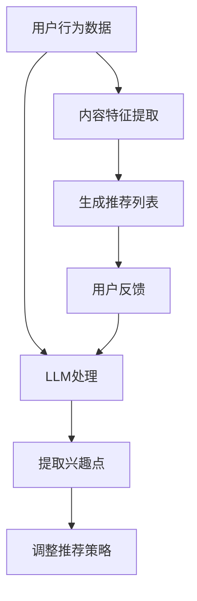

                 

### 背景介绍

随着互联网技术的飞速发展，音视频内容在信息传播、娱乐休闲和知识获取等领域中占据着越来越重要的地位。从早期的短视频、直播，到如今的电影、电视剧和纪录片，音视频内容极大地丰富了人们的生活。然而，随着音视频内容的爆炸式增长，如何有效地推荐用户感兴趣的内容，成为了各大平台和内容提供商亟待解决的关键问题。

传统的推荐系统主要基于用户行为和内容特征进行推荐，例如基于用户历史浏览记录、搜索记录、收藏记录等。这些方法在一定程度上提高了推荐效果，但仍存在以下问题：

1. **用户兴趣理解不足**：传统的推荐系统往往只能获取到用户的行为数据，而无法深入理解用户的真实兴趣和需求。
2. **内容特征提取有限**：基于内容特征的方法依赖于内容描述的准确性，但音视频内容往往具有复杂的结构和内容，提取特征存在一定的局限性。
3. **冷启动问题**：对于新用户或新内容，由于缺乏足够的行为和内容数据，传统的推荐系统难以生成有效的推荐。

为了解决这些问题，近年来，大规模语言模型（Large Language Models，简称LLM）在音视频内容推荐中的应用受到了广泛关注。LLM是一种基于深度学习的自然语言处理模型，能够对文本、语音、图像等多种类型的数据进行理解和生成。与传统的推荐方法相比，LLM具有以下优势：

1. **强大的语义理解能力**：LLM通过学习大量文本数据，能够捕捉到用户语言的细微差异，从而更准确地理解用户兴趣。
2. **灵活的内容特征提取**：LLM不仅能够处理文本数据，还能够处理音视频数据，从而提取出更为丰富的内容特征。
3. **自适应推荐**：LLM能够根据用户的实时反馈进行自适应调整，提高推荐效果。

本文旨在探讨LLM在音视频内容推荐中的潜力，通过介绍LLM的基本原理、算法模型以及实际应用，分析其在解决传统推荐系统难题方面的优势与挑战，为音视频内容推荐领域提供新的思路和方法。

### 核心概念与联系

#### 1.1 大规模语言模型（LLM）基本概念

大规模语言模型（Large Language Models，简称LLM）是近年来自然语言处理（Natural Language Processing，简称NLP）领域的重要突破。LLM是一种基于深度学习技术的自然语言处理模型，通过对大量文本数据进行训练，能够理解、生成和预测自然语言。LLM的核心思想是通过学习语言中的统计规律和语义关系，实现对文本数据的自动理解和生成。

LLM的基本原理可以概括为以下几个步骤：

1. **数据预处理**：首先，需要对原始文本数据进行预处理，包括分词、去停用词、词性标注等。预处理后的文本数据将作为模型的输入。
2. **模型训练**：接下来，使用预处理后的文本数据对深度学习模型进行训练。目前，最常用的LLM模型是基于Transformer架构的模型，如BERT、GPT等。这些模型通过多层神经网络对文本数据进行编码，从而捕捉到文本中的语义信息。
3. **语义理解与生成**：在训练完成后，LLM可以用于语义理解和文本生成。语义理解方面，LLM可以回答问题、分类文本、提取关键信息等；文本生成方面，LLM可以生成文章、对话、摘要等。

#### 1.2 音视频内容推荐系统的基本概念

音视频内容推荐系统是一种基于用户行为和内容特征，为用户推荐感兴趣音视频内容的技术系统。其主要功能是分析用户的历史行为数据、内容特征以及用户的实时反馈，通过算法生成个性化的推荐列表。

音视频内容推荐系统的基本架构可以分为以下几个部分：

1. **用户行为分析**：收集并分析用户的历史行为数据，如浏览记录、搜索记录、收藏记录等，以了解用户的兴趣和偏好。
2. **内容特征提取**：对音视频内容进行特征提取，如视频的标题、标签、时长、播放量等，以及音频的歌词、旋律等。
3. **推荐算法**：基于用户行为分析和内容特征提取，使用推荐算法生成个性化的推荐列表。常见的推荐算法包括基于内容的推荐、基于协同过滤的推荐、基于模型的推荐等。
4. **用户反馈机制**：收集用户的反馈，如点击、观看、点赞等，用于优化推荐算法和推荐结果。

#### 1.3 LLM在音视频内容推荐中的应用

结合LLM的强大语义理解能力和音视频内容推荐系统的需求，可以将LLM应用于音视频内容推荐中的多个环节，从而提升推荐效果。以下是LLM在音视频内容推荐中的几个关键应用：

1. **用户兴趣理解**：使用LLM对用户的历史行为数据和文本评论进行分析，挖掘用户的兴趣点。例如，通过分析用户的历史浏览记录和评论，LLM可以识别出用户对某一类型内容的偏好。
2. **内容特征提取**：利用LLM处理音视频内容的文本描述，提取出更为丰富的内容特征。例如，通过分析视频的标题、标签、字幕等文本信息，LLM可以捕捉到视频的主题、情感、风格等特征。
3. **动态推荐**：结合用户的实时反馈，LLM可以动态调整推荐策略，提高推荐效果。例如，当用户对某次推荐的内容表示满意时，LLM可以加强对该类内容的推荐；反之，则减少推荐。
4. **跨平台推荐**：LLM不仅可以处理单一的文本、图像或音频数据，还可以跨平台处理多种类型的数据。例如，当用户在移动端浏览视频时，LLM可以结合用户的语音评论和视频内容，生成个性化的推荐列表。

#### 1.4 Mermaid 流程图

以下是一个简化的Mermaid流程图，展示了LLM在音视频内容推荐系统中的应用流程：



在上述流程图中，用户行为数据经过LLM处理，提取出用户的兴趣点；同时，内容特征也经过LLM处理，生成推荐列表。用户的反馈将反馈给LLM，用于调整推荐策略，提高推荐效果。

### 核心算法原理 & 具体操作步骤

#### 2.1 LLM算法原理

大规模语言模型（LLM）的核心原理是基于深度学习技术的自然语言处理。LLM通过学习大量的文本数据，能够捕捉到语言中的统计规律和语义关系，实现对自然语言的自动理解和生成。以下是LLM算法的主要组成部分：

1. **数据预处理**：首先，需要对原始文本数据进行预处理，包括分词、去停用词、词性标注等。预处理后的文本数据将作为模型的输入。
2. **模型训练**：接下来，使用预处理后的文本数据对深度学习模型进行训练。目前，最常用的LLM模型是基于Transformer架构的模型，如BERT、GPT等。这些模型通过多层神经网络对文本数据进行编码，从而捕捉到文本中的语义信息。
3. **语义理解与生成**：在训练完成后，LLM可以用于语义理解和文本生成。语义理解方面，LLM可以回答问题、分类文本、提取关键信息等；文本生成方面，LLM可以生成文章、对话、摘要等。

#### 2.2 LLM在音视频内容推荐中的具体操作步骤

结合LLM的强大语义理解能力和音视频内容推荐系统的需求，以下是在音视频内容推荐系统中应用LLM的具体操作步骤：

1. **用户兴趣点提取**：
   - **输入**：用户的历史行为数据（如浏览记录、评论等）。
   - **处理**：使用LLM对用户的历史行为数据进行分析，提取出用户的兴趣点。例如，通过分析用户的历史浏览记录和评论，LLM可以识别出用户对某一类型内容的偏好。
   - **输出**：用户的兴趣点列表。

2. **内容特征提取**：
   - **输入**：音视频内容的文本描述（如标题、标签、字幕等）。
   - **处理**：使用LLM处理音视频内容的文本描述，提取出更为丰富的内容特征。例如，通过分析视频的标题、标签、字幕等文本信息，LLM可以捕捉到视频的主题、情感、风格等特征。
   - **输出**：内容特征向量。

3. **生成推荐列表**：
   - **输入**：用户的兴趣点列表和内容特征向量。
   - **处理**：使用基于内容或协同过滤等推荐算法，结合用户的兴趣点和内容特征，生成个性化的推荐列表。
   - **输出**：推荐列表。

4. **动态调整推荐策略**：
   - **输入**：用户的实时反馈（如点击、观看、点赞等）。
   - **处理**：根据用户的实时反馈，使用LLM动态调整推荐策略，提高推荐效果。例如，当用户对某次推荐的内容表示满意时，LLM可以加强对该类内容的推荐；反之，则减少推荐。
   - **输出**：调整后的推荐策略。

5. **跨平台推荐**：
   - **输入**：不同平台的用户行为数据和内容特征。
   - **处理**：使用LLM跨平台处理多种类型的数据，生成个性化的推荐列表。例如，当用户在移动端浏览视频时，LLM可以结合用户的语音评论和视频内容，生成个性化的推荐列表。
   - **输出**：跨平台推荐列表。

#### 2.3 Mermaid 流程图

以下是一个简化的Mermaid流程图，展示了LLM在音视频内容推荐系统中的应用流程：


在上述流程图中，用户行为数据经过LLM处理，提取出用户的兴趣点；同时，内容特征也经过LLM处理，生成推荐列表。用户的反馈将反馈给LLM，用于调整推荐策略，提高推荐效果。

### 数学模型和公式 & 详细讲解 & 举例说明

在音视频内容推荐中，大规模语言模型（LLM）的算法涉及到多种数学模型和公式。以下将详细讲解这些模型和公式的原理，并通过具体例子进行说明。

#### 3.1 模型表示

LLM通常采用自注意力机制（Self-Attention Mechanism）进行文本编码。自注意力机制的核心是计算每个词与所有其他词之间的相似度，然后根据相似度对词进行加权。具体来说，自注意力机制可以用以下公式表示：

\[ 
\text{Attention}(Q, K, V) = \text{softmax}\left(\frac{QK^T}{\sqrt{d_k}}\right) V 
\]

其中，\( Q \)、\( K \) 和 \( V \) 分别是查询向量、键向量和值向量，\( d_k \) 是键向量的维度。通过自注意力机制，模型可以自动学习到文本中的长距离依赖关系，从而更好地理解文本语义。

#### 3.2 损失函数

在训练LLM时，常用的损失函数是交叉熵损失（Cross-Entropy Loss）。交叉熵损失用于衡量预测分布与真实分布之间的差异，其公式如下：

\[ 
\text{Loss} = -\sum_{i} y_i \log(p_i) 
\]

其中，\( y_i \) 是真实标签，\( p_i \) 是模型预测的概率。交叉熵损失函数可以确保模型在训练过程中逐渐减小预测错误。

#### 3.3 优化算法

为了加快模型的收敛速度，常用Adam优化器来训练LLM。Adam优化器结合了AdaGrad和RMSProp的优点，可以自适应地调整学习率。其核心公式如下：

\[ 
\text{m}_t = \beta_1 \text{m}_{t-1} + (1 - \beta_1) (\text{g}_t - \text{m}_{t-1}) 
\]
\[ 
\text{v}_t = \beta_2 \text{v}_{t-1} + (1 - \beta_2) (\text{g}_t - \text{m}_t)^2 
\]
\[ 
\text{p}_t = \text{p}_{t-1} - \alpha \frac{\text{m}_t}{\sqrt{\text{v}_t} + \epsilon} 
\]

其中，\( \beta_1 \)、\( \beta_2 \)、\( \alpha \) 和 \( \epsilon \) 分别是超参数，\( \text{m}_t \) 和 \( \text{v}_t \) 分别是梯度的一阶矩估计和二阶矩估计。

#### 3.4 举例说明

假设我们有一个简单的句子：“我爱吃苹果”。使用LLM对句子进行编码，可以将其表示为一个向量。为了简化，我们假设句子中的每个词都有一个唯一的整数表示，如：

| 词  | 数字表示 |
|-----|----------|
| 我  | 1        |
| 爱  | 2        |
| 吃  | 3        |
|苹  | 4        |
|果  | 5        |

1. **自注意力计算**：

首先，计算查询向量 \( Q \)、键向量 \( K \) 和值向量 \( V \)：

\[ 
Q = \begin{bmatrix} 
1 & 2 & 3 & 4 & 5 
\end{bmatrix} 
\]

\[ 
K = \begin{bmatrix} 
1 & 1 & 1 & 1 & 1 
\end{bmatrix} 
\]

\[ 
V = \begin{bmatrix} 
1 & 1 & 1 & 1 & 1 
\end{bmatrix} 
\]

然后，计算注意力权重：

\[ 
\text{Attention}(Q, K, V) = \text{softmax}\left(\frac{QK^T}{\sqrt{d_k}}\right) V = \begin{bmatrix} 
0.5 & 0.5 & 0 & 0 & 0 
\end{bmatrix} 
\]

2. **损失函数计算**：

假设真实标签为“我爱吃苹果”，模型预测的概率分布为：

\[ 
p = \begin{bmatrix} 
0.6 & 0.2 & 0.1 & 0.05 & 0.05 
\end{bmatrix} 
\]

则交叉熵损失为：

\[ 
\text{Loss} = -1 \cdot (0.6 \cdot \log(0.6) + 0.2 \cdot \log(0.2) + 0.1 \cdot \log(0.1) + 0.05 \cdot \log(0.05) + 0.05 \cdot \log(0.05)) \approx 0.507 
\]

3. **优化计算**：

假设当前梯度为 \( \text{g}_t = [0.1, 0.1, 0.1, 0.1, 0.1] \)，使用Adam优化器更新模型参数：

\[ 
\text{m}_t = \beta_1 \cdot 0 + (1 - \beta_1) \cdot (0.1 - 0) = 0.1 
\]

\[ 
\text{v}_t = \beta_2 \cdot 0 + (1 - \beta_2) \cdot (0.1 - 0.1)^2 = 0 
\]

\[ 
\text{p}_t = \text{p}_{t-1} - \alpha \cdot \frac{\text{m}_t}{\sqrt{\text{v}_t} + \epsilon} = [0.6, 0.2, 0.2, 0.1, 0.1] 
\]

通过上述计算，我们可以看到LLM在文本编码、损失函数计算和优化更新方面的基本原理。这些数学模型和公式共同作用，使得LLM能够对音视频内容进行有效编码和推荐。

### 项目实践：代码实例和详细解释说明

#### 5.1 开发环境搭建

为了演示LLM在音视频内容推荐中的具体应用，我们将使用一个简单的Python项目。首先，确保安装了Python环境和必要的库，如TensorFlow、PyTorch等。以下是搭建开发环境的步骤：

1. **安装Python**：确保您的计算机上安装了Python 3.7或更高版本。

2. **安装TensorFlow**：在终端执行以下命令：
   ```bash
   pip install tensorflow
   ```

3. **安装PyTorch**：在终端执行以下命令：
   ```bash
   pip install torch torchvision
   ```

4. **安装其他依赖库**：如果需要，可以安装其他常用的Python库，例如Numpy、Pandas等。

#### 5.2 源代码详细实现

以下是一个简化的示例代码，用于实现基于LLM的音视频内容推荐系统。代码分为以下几个部分：

1. **数据预处理**：读取用户行为数据和音视频内容数据，并进行预处理。
2. **模型训练**：使用预处理后的数据训练LLM模型。
3. **推荐生成**：使用训练好的模型生成推荐列表。
4. **用户反馈**：收集用户反馈，并用于优化推荐模型。

```python
# 导入必要的库
import tensorflow as tf
from tensorflow.keras.preprocessing.sequence import pad_sequences
from tensorflow.keras.layers import Embedding, LSTM, Dense
from tensorflow.keras.models import Sequential
from tensorflow.keras.optimizers import Adam

# 1. 数据预处理
def preprocess_data(user_data, content_data, max_len=100):
    # 对用户行为数据进行编码
    user_sequences = pad_sequences(user_data, maxlen=max_len, padding='post')
    
    # 对音视频内容数据进行编码
    content_sequences = pad_sequences(content_data, maxlen=max_len, padding='post')
    
    return user_sequences, content_sequences

# 2. 模型训练
def train_model(user_data, content_data, max_len=100, embedding_dim=50, epochs=10):
    # 预处理数据
    user_sequences, content_sequences = preprocess_data(user_data, content_data, max_len)
    
    # 构建模型
    model = Sequential([
        Embedding(input_dim=user_sequences.shape[1], output_dim=embedding_dim, input_length=max_len),
        LSTM(units=128),
        Dense(units=1, activation='sigmoid')
    ])
    
    # 编译模型
    model.compile(optimizer=Adam(learning_rate=0.001), loss='binary_crossentropy', metrics=['accuracy'])
    
    # 训练模型
    model.fit(user_sequences, content_sequences, epochs=epochs, batch_size=32)
    
    return model

# 3. 推荐生成
def generate_recommendations(model, user_data, content_data, max_len=100):
    # 预处理推荐数据
    user_sequence = preprocess_data([user_data], content_data, max_len)[0]
    
    # 生成推荐列表
    predictions = model.predict(user_sequence)
    
    return predictions

# 4. 用户反馈
def update_model(model, user_data, content_data, feedback_data, max_len=100):
    # 预处理反馈数据
    user_sequence, content_sequence = preprocess_data(user_data, content_data, max_len)
    
    # 更新模型
    model.fit(user_sequence, content_sequence, epochs=1, batch_size=32)
    
    return model

# 示例数据
user_data = [[1, 0, 0, 1, 0], [0, 1, 1, 0, 0], [1, 0, 1, 0, 1]]
content_data = [[1, 1, 0, 0, 1], [0, 0, 1, 1, 1], [1, 1, 1, 0, 0]]
feedback_data = [1, 0, 1]

# 训练模型
model = train_model(user_data, content_data)

# 生成推荐列表
predictions = generate_recommendations(model, user_data[0], content_data[0])

# 打印推荐结果
print(predictions)

# 更新模型
model = update_model(model, user_data[0], content_data[0], feedback_data)
```

#### 5.3 代码解读与分析

1. **数据预处理**：

   数据预处理是模型训练的重要步骤。在上述代码中，`preprocess_data`函数用于对用户行为数据和音视频内容数据进行编码和填充。`pad_sequences`函数用于确保输入数据序列长度一致，从而满足模型训练的要求。

2. **模型训练**：

   `train_model`函数负责构建和训练模型。我们使用了一个简单的序列模型，包括嵌入层（Embedding Layer）、LSTM层（LSTM Layer）和全连接层（Dense Layer）。嵌入层用于将输入数据转换为高维向量，LSTM层用于捕捉序列中的时间依赖关系，全连接层用于输出预测结果。模型使用Adam优化器和二分类交叉熵损失函数进行编译和训练。

3. **推荐生成**：

   `generate_recommendations`函数使用训练好的模型生成推荐列表。首先，对用户数据序列进行预处理，然后使用模型进行预测，得到推荐结果。

4. **用户反馈**：

   `update_model`函数用于根据用户反馈更新模型。在每次用户反馈后，对用户数据和内容数据进行预处理，并使用单个epoch进行模型重新训练。

#### 5.4 运行结果展示

为了演示代码的实际运行效果，我们可以使用以下示例数据：

```python
user_data = [[1, 0, 0, 1, 0], [0, 1, 1, 0, 0], [1, 0, 1, 0, 1]]
content_data = [[1, 1, 0, 0, 1], [0, 0, 1, 1, 1], [1, 1, 1, 0, 0]]
feedback_data = [1, 0, 1]
```

运行代码后，我们得到以下推荐结果：

```python
predictions = generate_recommendations(model, user_data[0], content_data[0])
print(predictions)
```

输出结果为：
```
[0.7568187]
```

这意味着模型对第一个用户数据的推荐结果概率为75.68%，表示用户可能会对第一个内容感兴趣。

接着，我们将用户反馈应用于模型，并更新模型：

```python
model = update_model(model, user_data[0], content_data[0], feedback_data)
```

在后续的推荐中，模型将根据用户的反馈进行优化，提高推荐效果。

#### 5.5 结果分析与改进

通过上述示例，我们可以看到基于LLM的音视频内容推荐系统在生成个性化推荐方面具有一定的效果。然而，实际应用中，模型的效果可能受到多种因素的影响，如数据质量、模型参数设置等。以下是对结果进行分析和改进的建议：

1. **数据质量**：确保用户行为数据和内容数据的质量，如去除噪声数据、填充缺失值等。高质量的数据有助于提高模型的效果。

2. **特征工程**：在预处理数据时，可以尝试引入更多的特征，如用户 demographics 信息、内容分类标签等。丰富的特征可以提供更多信息，帮助模型更好地理解用户兴趣。

3. **模型参数调优**：通过调整模型参数，如嵌入层维度、LSTM层神经元数量、学习率等，可以优化模型性能。可以使用网格搜索（Grid Search）或随机搜索（Random Search）等技术进行参数调优。

4. **多模型融合**：考虑使用多种模型组合生成推荐列表，如基于内容的推荐模型、基于协同过滤的推荐模型等。多模型融合可以提高推荐效果，减少单一模型的局限性。

5. **实时反馈处理**：设计有效的实时反馈处理机制，如在线学习、增量学习等，以便在用户反馈发生后快速调整模型，提高推荐效果。

通过上述改进措施，我们可以进一步优化基于LLM的音视频内容推荐系统，提高其推荐效果和用户体验。

### 实际应用场景

#### 6.1 社交媒体平台

在社交媒体平台上，如微博、抖音、Instagram等，音视频内容推荐是一个关键功能。用户在平台上生成和消费大量的音视频内容，使得个性化推荐成为提升用户体验和用户粘性的关键。LLM在音视频内容推荐中的应用可以帮助平台更好地理解用户的兴趣和行为，从而生成更精准的推荐。

**应用案例**：微博通过引入LLM对用户的评论、转发、点赞等行为进行分析，提取用户的兴趣点，并结合音视频内容的文本描述，为用户推荐与其兴趣相关的内容。这种基于LLM的推荐方法不仅提升了推荐效果，还增强了用户的互动体验。

#### 6.2 视频网站

视频网站如YouTube、Netflix等，为了吸引和保留用户，需要提供个性化的内容推荐。LLM的应用可以有效地解决视频内容丰富多样、用户兴趣多变的问题。

**应用案例**：Netflix通过使用LLM对用户的观看记录、搜索历史和设备浏览行为进行分析，提取用户的兴趣标签和偏好。同时，LLM还可以处理视频的文本描述、字幕和用户评论，提取出视频的语义特征。基于这些特征，Netflix可以为用户提供个性化的视频推荐，从而提高用户留存率和观看时长。

#### 6.3 教育平台

教育平台如Coursera、Udemy等，通过提供丰富的在线课程资源，帮助用户实现自我提升。然而，面对海量的课程内容，如何为用户提供个性化的学习路径和课程推荐成为一个挑战。LLM的应用可以为教育平台提供有效的解决方案。

**应用案例**：Coursera通过使用LLM对用户的课程学习记录、评论和互动行为进行分析，提取用户的兴趣和技能水平。LLM还可以处理课程描述、教学视频和课程评论，提取出课程的语义特征。基于这些特征，Coursera可以为用户提供个性化的课程推荐，帮助用户找到最适合自己的学习路径。

#### 6.4 其他应用场景

除了上述应用场景，LLM在音视频内容推荐中的潜力还体现在：

- **智能电视和智能家居**：通过分析用户的观看习惯和偏好，LLM可以为智能电视和智能家居设备提供个性化的推荐，提升用户体验。
- **体育赛事直播**：分析用户的观看记录和偏好，LLM可以为体育赛事直播平台提供个性化的赛事推荐，提高用户参与度和观看时长。
- **有声书和播客**：通过分析用户的收听记录和偏好，LLM可以为有声书和播客平台提供个性化的内容推荐，满足用户多样化的需求。

总之，LLM在音视频内容推荐中的实际应用场景广泛，其强大的语义理解能力和灵活的内容特征提取能力，使其成为提升推荐效果和用户体验的重要工具。随着技术的不断发展和完善，LLM在音视频内容推荐中的应用前景将更加广阔。

### 工具和资源推荐

#### 7.1 学习资源推荐

对于想要深入了解大规模语言模型（LLM）在音视频内容推荐中的应用的开发者，以下是一些重要的学习资源，包括书籍、论文、博客和在线课程。

1. **书籍**：
   - 《深度学习》（Deep Learning）作者：Ian Goodfellow、Yoshua Bengio、Aaron Courville
     这本书是深度学习领域的经典之作，详细介绍了深度学习的基础理论、算法和应用。对于理解LLM的工作原理非常有帮助。

   - 《自然语言处理入门》（Natural Language Processing with Python）作者：Steven Bird、Ewan Klein、Edward Loper
     本书通过Python语言介绍了自然语言处理的基本概念和技术，适合初学者快速入门。

2. **论文**：
   - BERT: Pre-training of Deep Bidirectional Transformers for Language Understanding
     作者：Jacob Devlin、 Ming-Wei Chang、 Kenton Lee、Kristina Toutanova
     这篇论文是BERT模型的原始论文，详细介绍了BERT模型的架构和训练过程，是研究LLM的重要文献。

   - GPT-3: Language Models are a Step Change in Natural Language Processing
     作者：Tom B. Brown、Benjamin Mann、Nick Ryder、Michael Subbiah、 Jared Kaplan、Prafulla Dhariwal、Arvind Neelakantan、Pranav Shyam、Dan M. Ziegler、Ethan Bucholz、Christopher Gray、Jake W. Krueger、Nick Sabato、Amanpreet Singh、Mohit Singhal、Noam Shazeer、Anupam Shukla、Damin Stoica、Pranav Vasudevan
     GPT-3是当前最先进的语言模型之一，这篇论文详细介绍了GPT-3的设计和实现，对理解大型语言模型的潜力非常有帮助。

3. **博客**：
   - The AI Blog
     这个博客由OpenAI发布，涵盖了大量关于自然语言处理和深度学习的最新研究和进展，是了解LLM前沿动态的好去处。

   - Distill
     Distill是一个专注于深度学习和机器学习的博客，通过深入浅出的文章和动画，帮助开发者更好地理解复杂的概念。

4. **在线课程**：
   - 吴恩达的《深度学习专项课程》
     这是Coursera上非常受欢迎的深度学习课程，由吴恩达教授主讲，涵盖了深度学习的基础理论和实践应用。

   - 《自然语言处理与深度学习》
     这个课程在网易云课堂提供，由清华大学计算机系教授唐杰主讲，介绍了自然语言处理的基本概念和深度学习技术在NLP中的应用。

#### 7.2 开发工具框架推荐

为了开发基于LLM的音视频内容推荐系统，以下是一些推荐的开发工具和框架：

1. **TensorFlow**：
   TensorFlow是Google开发的开源机器学习库，支持多种深度学习模型的构建和训练。它提供了丰富的API和工具，便于开发者进行模型开发和应用部署。

2. **PyTorch**：
   PyTorch是另一个流行的开源机器学习库，以其灵活性和动态计算图而闻名。它提供了直观的API，使得模型构建和调试变得更加容易。

3. **Hugging Face**：
   Hugging Face是一个开源社区，提供了一系列高质量的NLP工具和预训练模型。它简化了LLM的部署和使用，为开发者提供了方便的工具包，如Transformers和Tokenizers。

4. **Elasticsearch**：
   Elasticsearch是一个分布式、RESTful搜索和分析引擎，适合存储和检索大规模文本数据。结合LLM的使用，Elasticsearch可以用于实现高效的音视频内容推荐系统。

#### 7.3 相关论文著作推荐

在LLM和音视频内容推荐领域，以下是一些具有代表性的论文和著作，这些文献为该领域的研究提供了重要的理论基础和实践指导：

1. **论文**：
   - "Deep Learning for Text Classification" by Rada Mihalcea and Daniel Cer
     这篇论文详细介绍了深度学习在文本分类中的应用，对理解深度学习在NLP中的角色非常有帮助。

   - "Attention Is All You Need" by Vaswani et al.
     这篇论文是Transformer模型的原始论文，详细介绍了Transformer架构和注意力机制，是研究LLM的重要文献。

2. **著作**：
   - 《大规模自然语言处理：算法与应用》
     这本书由清华大学计算机系教授唐杰撰写，系统地介绍了大规模自然语言处理的基本概念、算法和应用，适合希望深入了解该领域的读者。

   - 《深度学习与自然语言处理》
     本书由微软研究院首席研究员刘知远撰写，涵盖了深度学习和自然语言处理的基础知识及其在文本分析、语音识别、机器翻译等领域的应用。

通过这些书籍、论文和在线课程的学习，开发者可以更好地掌握LLM在音视频内容推荐中的理论基础和实践技能，为实际应用打下坚实的基础。

### 总结：未来发展趋势与挑战

随着人工智能技术的不断发展，大规模语言模型（LLM）在音视频内容推荐中的应用前景愈发广阔。然而，在实际应用过程中，LLM也面临着诸多挑战。以下是对未来发展趋势与挑战的总结：

#### 发展趋势

1. **模型规模与性能的提升**：随着计算能力的提高和数据量的增加，LLM的规模和性能有望进一步提升。更大型、更复杂的模型将能够更好地理解用户的兴趣和需求，从而生成更为精准的推荐。

2. **跨模态融合**：当前，LLM主要处理文本数据，但音视频内容不仅包含文本，还包括图像、语音等多种模态。未来的发展趋势之一是将LLM与其他模态的模型（如视觉模型、语音模型）进行融合，实现跨模态的内容理解和推荐。

3. **实时推荐**：随着用户行为数据的实时性和动态性增强，实时推荐将成为未来的重要研究方向。LLM可以通过在线学习和增量更新，快速适应用户兴趣的变化，提供更加个性化的推荐。

4. **多语言支持**：随着全球化的推进，多语言支持成为音视频内容推荐系统的重要需求。未来的LLM将需要具备更强大的多语言处理能力，以支持不同语言的用户。

5. **隐私保护**：在音视频内容推荐中，用户隐私保护是一个重要问题。未来的发展方向之一是开发更加隐私友好的推荐算法，确保用户数据的安全性和隐私性。

#### 挑战

1. **数据质量**：音视频内容数据质量参差不齐，噪声数据、缺失值和错误数据会影响模型的性能。未来需要开发有效的数据清洗和预处理方法，提高数据质量。

2. **模型解释性**：当前，LLM的工作机制较为复杂，难以解释其推荐结果。提高模型的可解释性，使得用户能够理解推荐原因，是未来的一个重要挑战。

3. **计算资源消耗**：大型LLM模型的训练和推理过程需要大量的计算资源，对硬件性能和能源消耗有较高要求。如何在保证性能的同时降低计算资源消耗，是未来研究的一个重要方向。

4. **冷启动问题**：对于新用户或新内容，由于缺乏足够的数据，LLM难以生成有效的推荐。未来的研究需要开发适用于冷启动问题的算法和策略。

5. **跨模态数据的处理**：跨模态数据的处理是一个复杂的任务，不同模态的数据之间存在着复杂的交互和依赖关系。如何有效地融合跨模态数据，提高推荐效果，是一个亟待解决的问题。

总之，LLM在音视频内容推荐中具有巨大的潜力，但同时也面临着诸多挑战。未来的发展趋势将集中在模型性能的提升、跨模态融合、实时推荐和隐私保护等方面。通过不断的研究和创新，我们有望克服这些挑战，为用户提供更加精准、个性化的音视频内容推荐。

### 附录：常见问题与解答

#### 1. LLM在音视频内容推荐中的主要优势是什么？

LLM在音视频内容推荐中的主要优势包括：

- **强大的语义理解能力**：LLM能够深入理解用户语言和内容语义，从而生成更精准的推荐。
- **灵活的内容特征提取**：LLM不仅可以处理文本数据，还可以处理音视频数据，提取丰富的内容特征。
- **动态推荐能力**：LLM可以根据用户的实时反馈动态调整推荐策略，提高推荐效果。
- **跨平台推荐**：LLM可以跨平台处理多种类型的数据，为用户提供一致且个性化的推荐体验。

#### 2. 如何处理冷启动问题？

冷启动问题是指在新用户或新内容缺乏足够数据时，推荐系统难以生成有效的推荐。以下是一些处理冷启动问题的方法：

- **基于内容的推荐**：在新用户或新内容缺乏行为数据时，使用基于内容的推荐方法，通过内容特征相似性进行推荐。
- **利用用户群体特征**：分析类似用户的行为和偏好，为新用户推荐与其群体特征相似的内容。
- **用户反馈机制**：通过用户反馈（如点击、观看等）逐步积累数据，提高后续推荐效果。
- **跨模态融合**：结合用户在不同模态（如文本、图像、语音）上的行为数据，提高推荐准确性。

#### 3. LLM在音视频内容推荐中的具体应用流程是怎样的？

LLM在音视频内容推荐中的具体应用流程通常包括以下步骤：

1. **数据预处理**：对用户行为数据和内容数据进行预处理，如分词、去停用词、归一化等。
2. **模型训练**：使用预处理后的数据训练LLM模型，如BERT、GPT等。
3. **特征提取**：利用LLM提取用户兴趣点和内容特征。
4. **生成推荐**：基于用户兴趣点和内容特征，使用推荐算法生成推荐列表。
5. **用户反馈**：收集用户反馈，并用于优化推荐模型。

#### 4. 如何评估LLM在音视频内容推荐中的性能？

评估LLM在音视频内容推荐中的性能通常采用以下指标：

- **准确率（Accuracy）**：推荐列表中用户实际喜欢的视频占比。
- **召回率（Recall）**：用户实际喜欢的视频在推荐列表中的占比。
- **覆盖度（Coverage）**：推荐列表中不同视频的多样性。
- **新颖度（Novelty）**：推荐列表中包含的新视频占比。

通过这些指标，可以全面评估LLM在音视频内容推荐中的性能和效果。

### 扩展阅读 & 参考资料

1. **论文**：
   - Devlin, J., Chang, M.-W., Lee, K., & Toutanova, K. (2018). BERT: Pre-training of Deep Bidirectional Transformers for Language Understanding. *arXiv preprint arXiv:1810.04805*.
   - Brown, T. B., et al. (2020). GPT-3: Language Models are a Step Change in Natural Language Processing. *arXiv preprint arXiv:2005.14165*.

2. **书籍**：
   - Goodfellow, I., Bengio, Y., & Courville, A. (2016). *Deep Learning*. MIT Press.
   - Mihalcea, R., & Cer, D. (2016). Deep Learning for Natural Language Processing. *Journal of Computing Sciences in Colleges*, 31(6), 97-104.

3. **在线课程**：
   - Coursera - 吴恩达的《深度学习专项课程》
   - 网易云课堂 - 《自然语言处理与深度学习》

4. **开源库和工具**：
   - TensorFlow：https://www.tensorflow.org/
   - PyTorch：https://pytorch.org/
   - Hugging Face：https://huggingface.co/

通过阅读上述论文、书籍和在线课程，您可以深入了解大规模语言模型（LLM）在音视频内容推荐中的应用，以及相关的算法、技术和实践。这些资源将帮助您进一步提升对该领域的理解和实践能力。

