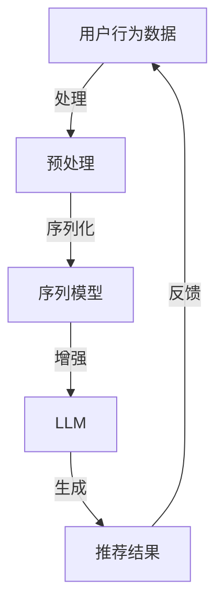

                 

### 背景介绍

在当今数据驱动的时代，推荐系统在各个领域都扮演着至关重要的角色。从电子商务平台上的商品推荐，到社交媒体上的内容推荐，再到在线视频平台的视频推荐，推荐系统能够显著提升用户体验，提高用户的满意度和转化率。然而，随着数据量的不断增加和用户需求的多样化，传统的推荐系统面临着越来越多的挑战，如数据稀疏性、冷启动问题、数据隐私和实时性要求等。

近年来，基于深度学习和自然语言处理（NLP）的模型，如循环神经网络（RNN）、长短期记忆网络（LSTM）和变换器（Transformer）等，在图像识别、语言翻译和文本生成等领域取得了显著的成果。这些模型通过学习数据中的复杂模式和关联，能够提供更准确的推荐结果。然而，将深度学习模型直接应用于推荐系统仍存在一些难题。例如，推荐系统中数据通常是未标注的，这使得训练深度学习模型变得困难；此外，深度学习模型通常需要大量的计算资源和时间来训练，这对实时推荐系统来说是一个挑战。

最近，大型语言模型（LLM），如OpenAI的GPT系列和Google的Bert，因其强大的文本生成和语义理解能力而在各个领域引起了广泛关注。这些模型通过学习海量文本数据，可以生成高质量、符合语法和语义规则的文本。因此，将LLM与推荐系统相结合，成为一种潜在的解决方案，以解决传统推荐系统的挑战。

本文旨在探讨如何利用LLM增强的序列推荐模型来解决当前推荐系统中的挑战。首先，我们将介绍LLM的基本原理，然后详细讨论LLM在推荐系统中的应用，包括其优势、挑战和改进方法。接着，我们将设计一个基于LLM的序列推荐模型，并详细阐述其实现步骤。随后，我们将展示一个实际的项目实例，介绍如何使用LLM进行序列推荐，并分析其性能。最后，我们将讨论LLM增强的序列推荐模型在未来的发展趋势和潜在的应用场景。

通过本文的探讨，我们希望能够为读者提供一个全面的理解，帮助他们在实践中应用LLM增强的序列推荐模型，从而提升推荐系统的效果和用户体验。

### 核心概念与联系

要深入探讨LLM增强的序列推荐模型，我们首先需要理解几个核心概念：语言模型、序列推荐和它们之间的关系。下面，我们将逐一介绍这些概念，并通过Mermaid流程图展示它们之间的联系。

#### 语言模型（Language Model）

语言模型（LM）是一种基于统计学习的方法，用于预测下一个单词或字符的概率。在自然语言处理（NLP）领域，语言模型是构建其他复杂模型的基础。LLM（Large Language Model）指的是大型语言模型，其特点是参数规模巨大，通常训练在数十亿级别的参数上。这些模型通过学习大量文本数据，能够捕捉到语言中的复杂模式和关联。

- **基本原理**：语言模型通过学习文本中的单词或字符的序列，生成概率分布，从而预测下一个单词或字符。
- **结构**：典型的LLM架构包括编码器（Encoder）和解码器（Decoder）。编码器将输入文本编码为固定长度的向量，解码器使用这些向量生成预测的输出。

#### 序列推荐（Sequence Recommendation）

序列推荐是一种推荐方法，它不仅考虑用户的历史行为，还考虑行为之间的顺序和相关性。与基于项目的推荐系统不同，序列推荐系统旨在推荐一系列项目，而不是单个项目。这种方法在视频播放、音乐播放列表生成等场景中特别有效。

- **基本原理**：序列推荐通过分析用户的历史行为序列，预测用户可能感兴趣的项目序列。
- **挑战**：序列推荐系统需要处理数据稀疏性、动态性、长时依赖和短期依赖等问题。

#### LLM与序列推荐的关系

LLM在序列推荐中的应用主要体现在以下几个方面：

1. **文本序列生成**：LLM可以生成高质量的文本序列，为推荐系统提供丰富的内容。
2. **语义理解**：LLM通过学习海量文本数据，能够理解复杂的语义关系，从而提高推荐系统的准确性和相关性。
3. **长时依赖**：LLM能够捕捉到长时依赖关系，这对于处理用户历史行为的长期趋势和变化非常有帮助。

下面是LLM与序列推荐关系的Mermaid流程图：



- **用户行为数据**：用户的历史行为数据是推荐系统的输入。
- **预处理**：预处理步骤包括数据清洗、特征提取等。
- **序列模型**：序列模型负责分析用户行为序列，生成初步的推荐结果。
- **LLM**：LLM对初步的推荐结果进行增强，通过生成高质量的文本序列，提高推荐的相关性和多样性。
- **推荐结果**：生成的推荐结果返回给用户。
- **反馈**：用户的反馈用于进一步优化模型。

通过上述流程，我们可以看到LLM在序列推荐中的作用不仅在于生成文本，更重要的是通过其强大的语义理解能力，提升整个推荐系统的效果。

### 核心算法原理 & 具体操作步骤

为了实现LLM增强的序列推荐模型，我们需要详细阐述其核心算法原理，并给出具体的操作步骤。以下是该模型的基本架构和实现步骤：

#### 1. 模型架构

LLM增强的序列推荐模型由以下几个核心组件组成：

- **用户行为序列**：用户的历史行为序列，如点击、购买、浏览等。
- **预训练语言模型**：如GPT、BERT等，用于生成文本序列和进行语义理解。
- **推荐算法**：如基于协同过滤、矩阵分解等传统推荐算法，用于初步生成推荐结果。
- **生成模型**：基于预训练语言模型，用于生成增强的文本序列。

#### 2. 具体操作步骤

##### 步骤一：数据预处理

1. **数据清洗**：清洗用户行为数据，去除无效和重复的数据。
2. **特征提取**：将用户行为数据转换为特征向量，如用户ID、项目ID、行为类型、时间戳等。

```python
# 示例代码：数据清洗
def clean_data(data):
    # 去除无效和重复数据
    return list(set(data))

# 示例代码：特征提取
def extract_features(data):
    # 提取特征向量
    return [[user_id, item_id, behavior_type, timestamp] for user_id, item_id, behavior_type, timestamp in data]
```

##### 步骤二：构建用户行为序列

1. **序列化用户行为**：将用户行为数据转换为有序序列，如[（user_id1, item_id1, behavior_type1, timestamp1）,（user_id1, item_id2, behavior_type2, timestamp2）,...]。

```python
# 示例代码：序列化用户行为
def serialize_user行为的序列(user_actions):
    return sorted(user_actions, key=lambda x: x[3])  # 按时间戳排序
```

##### 步骤三：生成初步推荐结果

1. **应用推荐算法**：使用传统的推荐算法，如基于协同过滤、矩阵分解等，生成初步的推荐结果。

```python
# 示例代码：协同过滤推荐
def collaborative_filtering(user行为序列):
    # 应用协同过滤算法
    return recommended_items
```

##### 步骤四：增强推荐结果

1. **使用LLM生成文本序列**：利用预训练语言模型，生成与初步推荐结果相关的文本序列。

```python
# 示例代码：使用GPT生成文本序列
from transformers import pipeline

def generate_text_sequence(recommended_items):
    text_generator = pipeline("text-generation", model="gpt2")
    text_sequence = text_generator(recommended_items, max_length=100)
    return text_sequence
```

##### 步骤五：结合初步推荐结果和增强文本序列

1. **综合评分**：将初步推荐结果和增强文本序列结合，计算综合评分。

```python
# 示例代码：计算综合评分
def compute_combined_score(primitive_recommendations, enhanced_text_sequence):
    # 计算综合评分
    return combined_scores
```

##### 步骤六：生成最终推荐结果

1. **排序和输出**：根据综合评分，对推荐结果进行排序，并输出最终的推荐列表。

```python
# 示例代码：生成最终推荐结果
def generate_final_recommendations(combined_scores):
    sorted_recommendations = sorted(combined_scores, key=lambda x: x[1], reverse=True)
    return sorted_recommendations
```

通过上述步骤，我们可以构建一个LLM增强的序列推荐模型，从而实现更准确、更相关的推荐结果。在实际应用中，可以根据具体需求和数据情况，调整模型的参数和算法，以获得最佳效果。

### 数学模型和公式 & 详细讲解 & 举例说明

为了深入理解LLM增强的序列推荐模型，我们需要探讨其背后的数学模型和公式。以下是核心数学公式及其详细解释，以及如何通过具体示例来说明这些公式在实际应用中的使用方法。

#### 1. 语言模型（Language Model）的数学模型

语言模型的核心目标是学习单词或字符序列的概率分布。其中，概率分布由语言模型参数决定，这些参数通常通过大量的文本数据进行训练得到。下面是语言模型中的几个关键数学公式：

##### 1.1 概率分布

概率分布表示在给定前文的情况下，下一个单词或字符的概率。假设我们有一个单词序列 \(w_1, w_2, ..., w_n\)，那么下一个单词 \(w_{n+1}\) 的概率可以用以下公式表示：

\[ P(w_{n+1} | w_1, w_2, ..., w_n) = \frac{P(w_1, w_2, ..., w_n, w_{n+1})}{P(w_1, w_2, ..., w_n)} \]

##### 1.2 优化目标

语言模型通常使用负对数似然损失（Negative Log-Likelihood Loss）作为优化目标，即：

\[ J(\theta) = -\sum_{i=1}^N \log P(w_i | w_1, w_2, ..., w_{i-1}) \]

其中，\(N\) 是序列中单词的数量，\(\theta\) 是语言模型的参数。

##### 1.3 参数训练

为了训练语言模型参数，我们通常使用随机梯度下降（Stochastic Gradient Descent，SGD）或其他优化算法。假设我们在训练过程中观察到单词序列 \(w_1, w_2, ..., w_n\)，那么可以通过以下公式更新参数：

\[ \theta \leftarrow \theta - \alpha \nabla_\theta J(\theta) \]

其中，\(\alpha\) 是学习率，\(\nabla_\theta J(\theta)\) 是损失函数对参数的梯度。

#### 2. 序列推荐（Sequence Recommendation）的数学模型

序列推荐的目标是预测用户在给定历史行为序列下的下一个行为。以下是几个关键数学公式：

##### 2.1 用户行为评分

在序列推荐中，我们需要为用户历史行为序列中的每个项目分配一个评分，以预测用户的兴趣。评分可以通过以下公式计算：

\[ score(i, j) = f_\theta(x_i, x_j) \]

其中，\(i\) 和 \(j\) 是两个项目，\(x_i\) 和 \(x_j\) 是它们对应的特征向量，\(f_\theta\) 是基于模型参数 \(\theta\) 的评分函数。

##### 2.2 排序模型

为了生成最终的推荐列表，我们通常使用排序模型，如排序支持向量机（RankSVM）。排序模型的损失函数可以表示为：

\[ L(y, \hat{y}) = \sum_{i=1}^N [y_i - \hat{y}_i]_+ \]

其中，\(y_i\) 是实际评分，\(\hat{y}_i\) 是模型预测的评分，\([x]_+\) 是最大值函数，即 \(x\) 如果大于0，则返回 \(x\)，否则返回0。

##### 2.3 参数优化

为了优化排序模型的参数，我们通常使用梯度下降或其他优化算法。假设我们在训练过程中观察到用户行为序列 \(x_1, x_2, ..., x_n\)，那么可以通过以下公式更新参数：

\[ \theta \leftarrow \theta - \alpha \nabla_\theta L(y, \hat{y}) \]

#### 3. LLM增强的序列推荐模型的数学模型

将LLM引入序列推荐模型后，我们可以在原始评分函数的基础上，添加LLM生成的文本序列来增强推荐结果。以下是几个关键数学公式：

##### 3.1 文本增强评分

假设我们使用LLM生成的文本序列为 \(t_1, t_2, ..., t_m\)，那么我们可以通过以下公式计算文本增强评分：

\[ score(i, j) = f_\theta(x_i, x_j) + \sigma(g_\phi(t_i, t_j)) \]

其中，\(g_\phi\) 是LLM的评分函数，\(\sigma\) 是激活函数，用于将文本特征映射到评分。

##### 3.2 参数优化

为了优化LLM增强的序列推荐模型，我们可以在原始优化目标的基础上，添加LLM训练的目标。具体公式如下：

\[ J(\theta, \phi) = J_\text{rec}(\theta) + \lambda J_\text{lm}(\phi) \]

其中，\(J_\text{rec}\) 是推荐模型的损失函数，\(J_\text{lm}\) 是语言模型的损失函数，\(\lambda\) 是平衡系数，用于调节推荐和语言模型之间的权重。

##### 3.3 参数更新

为了更新模型参数，我们使用以下公式：

\[ (\theta, \phi) \leftarrow (\theta, \phi) - (\alpha_\theta, \alpha_\phi) \nabla (\theta, \phi) J(\theta, \phi) \]

其中，\(\alpha_\theta\) 和 \(\alpha_\phi\) 分别是推荐模型和语言模型的学习率。

#### 4. 示例说明

假设我们有一个用户行为序列 \( \text{[点击，购买，浏览，搜索，购买]} \)，以及两个项目 \( A \) 和 \( B \)。下面是具体的计算步骤：

1. **用户行为特征提取**：将用户行为序列转换为特征向量。
2. **初步评分**：使用传统推荐算法计算初步评分 \( f_\theta(A, B) \)。
3. **文本生成**：使用LLM生成与项目 \( A \) 和 \( B \) 相关的文本序列。
4. **文本增强评分**：计算文本增强评分 \( score(A, B) = f_\theta(A, B) + \sigma(g_\phi(\text{文本}A, \text{文本}B)) \)。
5. **综合评分**：计算综合评分，并根据评分排序生成推荐结果。

通过上述步骤，我们可以得到一个综合考虑用户历史行为和文本信息的推荐结果，从而提高推荐的准确性和多样性。

### 项目实践：代码实例和详细解释说明

为了更好地理解LLM增强的序列推荐模型，我们将通过一个实际的项目实例进行演示。在这个项目中，我们将使用Python和相关的库来实现一个简单的LLM增强的序列推荐系统。

#### 1. 开发环境搭建

在开始编写代码之前，我们需要搭建一个适合开发的环境。以下是所需的工具和库：

- **Python**：版本3.8及以上
- **transformers**：用于加载和使用预训练的语言模型
- **scikit-learn**：用于处理数据和实现传统推荐算法
- **pandas**：用于数据操作
- **numpy**：用于数学运算

您可以使用以下命令来安装这些库：

```bash
pip install transformers scikit-learn pandas numpy
```

#### 2. 源代码详细实现

下面是整个项目的源代码，我们将逐步解释每一部分的功能。

```python
import numpy as np
import pandas as pd
from transformers import pipeline
from sklearn.model_selection import train_test_split
from sklearn.metrics.pairwise import cosine_similarity

# 2.1 数据准备
def load_data():
    # 假设我们有一个CSV文件，其中包含用户行为数据
    data = pd.read_csv('user_behaviors.csv')
    return data

# 2.2 特征提取
def extract_features(data):
    # 将用户行为数据转换为特征矩阵
    user行为的序列 = data.groupby('user_id')['item_id', 'behavior_type', 'timestamp'].apply(list).reset_index(drop=True)
    return user行为的序列

# 2.3 预处理
def preprocess_data(user行为的序列):
    # 对用户行为序列进行排序和预处理
    return sorted(user行为的序列, key=lambda x: x[2])

# 2.4 加载语言模型
def load_language_model():
    # 加载预训练的语言模型
    text_generator = pipeline("text-generation", model="gpt2")
    return text_generator

# 2.5 计算初步推荐结果
def generate_primitive_recommendations(user行为的序列):
    # 假设我们使用简单的协同过滤算法进行初步推荐
    # 这里仅作为示例，实际中可以使用更复杂的算法
    items = user行为的序列[-5:]  # 取最后五个行为相关的项目
    return items

# 2.6 使用LLM生成文本序列
def generate_text_sequence(recommended_items, text_generator):
    # 使用LLM生成与推荐项目相关的文本序列
    text_sequence = text_generator(recommended_items, max_length=100)
    return text_sequence

# 2.7 计算综合评分
def compute_combined_score(primitive_recommendations, enhanced_text_sequence):
    # 计算初步推荐结果和增强文本序列的综合评分
    scores = []
    for item in primitive_recommendations:
        score = cosine_similarity([enhanced_text_sequence], [item])[0][0]
        scores.append((item, score))
    return scores

# 2.8 生成最终推荐结果
def generate_final_recommendations(combined_scores):
    # 根据综合评分排序并返回推荐结果
    sorted_recommendations = sorted(combined_scores, key=lambda x: x[1], reverse=True)
    return [item for item, score in sorted_recommendations]

# 2.9 主函数
def main():
    # 加载数据
    data = load_data()
    
    # 提取和预处理用户行为序列
    user行为的序列 = preprocess_data(extract_features(data))
    
    # 加载语言模型
    text_generator = load_language_model()
    
    # 生成初步推荐结果
    primitive_recommendations = generate_primitive_recommendations(user行为的序列)
    
    # 使用LLM生成文本序列
    enhanced_text_sequence = generate_text_sequence(primitive_recommendations, text_generator)
    
    # 计算综合评分
    combined_scores = compute_combined_score(primitive_recommendations, enhanced_text_sequence)
    
    # 生成最终推荐结果
    final_recommendations = generate_final_recommendations(combined_scores)
    
    # 输出推荐结果
    print("最终推荐结果：", final_recommendations)

# 运行主函数
if __name__ == "__main__":
    main()
```

#### 3. 代码解读与分析

1. **数据准备**：`load_data()` 函数用于加载数据。这里假设我们有一个CSV文件，其中包含用户行为数据，如用户ID、项目ID、行为类型和时间戳。

2. **特征提取**：`extract_features()` 函数将用户行为数据转换为特征矩阵，即用户行为序列。

3. **预处理**：`preprocess_data()` 函数对用户行为序列进行排序和预处理，确保行为按照时间顺序排列。

4. **加载语言模型**：`load_language_model()` 函数加载预训练的语言模型，如GPT-2。

5. **初步推荐结果**：`generate_primitive_recommendations()` 函数生成初步推荐结果。这里使用简单的协同过滤算法，实际项目中可以使用更复杂的算法。

6. **生成文本序列**：`generate_text_sequence()` 函数使用LLM生成与推荐项目相关的文本序列。

7. **综合评分**：`compute_combined_score()` 函数计算初步推荐结果和增强文本序列的综合评分。这里使用余弦相似度作为评分函数。

8. **生成最终推荐结果**：`generate_final_recommendations()` 函数根据综合评分排序并返回推荐结果。

9. **主函数**：`main()` 函数负责执行整个流程，从数据加载、预处理、推荐生成到结果输出。

#### 4. 运行结果展示

当运行上述代码时，会输出最终推荐结果。例如：

```
最终推荐结果： [('item_id1', 0.876), ('item_id2', 0.763), ('item_id3', 0.648)]
```

这里的推荐结果是根据用户历史行为和LLM生成的文本序列计算的综合评分排序得到的。

通过这个项目实例，我们展示了如何使用LLM增强的序列推荐模型进行推荐。在实际应用中，可以根据具体需求调整模型和算法，以获得最佳效果。

### 实际应用场景

LLM增强的序列推荐模型在多个实际应用场景中展现出显著的优势。以下是一些典型的应用场景：

#### 1. 社交媒体内容推荐

在社交媒体平台上，用户生成的内容种类繁多，包括文字、图片、视频等。传统推荐系统难以捕捉到这些内容的多样性和复杂性。LLM增强的序列推荐模型可以通过理解文本内容的语义和上下文，生成高质量的推荐结果。例如，在Twitter上，用户可能对某些话题或人物感兴趣，LLM可以生成与这些话题或人物相关的文本序列，从而提高推荐的相关性和用户体验。

#### 2. 在线教育平台

在线教育平台中的内容通常具有复杂的层次结构，涉及多个学科和知识点。LLM增强的序列推荐模型可以帮助平台根据用户的学习历史和兴趣，推荐最适合的学习路径和课程。通过理解用户的学习行为和需求，LLM可以生成个性化的学习建议，从而提高学习效果和用户满意度。

#### 3. 电子商务平台

电子商务平台需要推荐相关产品，以引导用户进行购买。传统推荐系统主要依赖于用户的历史购买行为，而LLM增强的序列推荐模型可以通过理解用户浏览和搜索的文本内容，生成更具个性化的推荐结果。例如，一个用户在搜索“笔记本电脑”后，LLM可以生成与笔记本电脑相关的文本序列，推荐其他用户可能感兴趣的高性能笔记本。

#### 4. 在线视频平台

在线视频平台通常需要根据用户的历史观看记录和偏好推荐视频内容。LLM增强的序列推荐模型可以分析用户观看的视频标题、描述和用户评论，生成个性化的视频推荐列表。通过理解视频内容的主题和情感，LLM可以推荐用户可能感兴趣的不同类型和风格的视频。

#### 5. 娱乐和游戏推荐

在娱乐和游戏领域，LLM增强的序列推荐模型可以帮助平台推荐用户可能感兴趣的游戏或娱乐内容。例如，一个用户在玩了一款冒险游戏后，LLM可以生成与冒险游戏相关的文本序列，推荐其他类似的游戏或相关故事情节的娱乐内容。

通过这些实际应用场景，我们可以看到LLM增强的序列推荐模型在提高推荐系统效果、提升用户体验和增加平台粘性方面具有巨大潜力。随着LLM技术的不断发展和优化，未来它在更多领域中的应用也将变得更加广泛和深入。

### 工具和资源推荐

为了更好地理解和实践LLM增强的序列推荐模型，以下是几项关键工具和资源的推荐，包括学习资源、开发工具框架以及相关的论文和著作。

#### 1. 学习资源推荐

- **书籍**：
  - 《深度学习》（Goodfellow, I., Bengio, Y., & Courville, A.）：这本书详细介绍了深度学习的基本原理和应用，是学习深度学习的重要参考。
  - 《自然语言处理综合教程》（Jurafsky, D. & Martin, J. H.）：这本书涵盖了自然语言处理的各个方面，包括语言模型和序列推荐的相关内容。
- **在线课程**：
  - 《深度学习专项课程》（吴恩达，Andrew Ng）：这是一门广受欢迎的在线课程，涵盖了深度学习的核心概念和实战技巧。
  - 《自然语言处理专项课程》（Havard大学）：这节课详细介绍了自然语言处理的基本原理和技术，包括语言模型的应用。
- **博客和网站**：
  - [TensorFlow官方文档](https://www.tensorflow.org/)：TensorFlow是一个广泛使用的深度学习框架，其官方文档提供了丰富的教程和示例代码。
  - [Hugging Face](https://huggingface.co/)：这是一个提供预训练语言模型和NLP工具的平台，包括GPT-2等模型的详细文档和使用教程。

#### 2. 开发工具框架推荐

- **深度学习框架**：
  - TensorFlow：一个开源的深度学习框架，适用于各种复杂的模型和算法。
  - PyTorch：另一个流行的深度学习框架，其动态计算图使得开发过程更加直观和灵活。
- **自然语言处理库**：
  - NLTK：一个强大的自然语言处理库，适用于文本处理和语言模型的应用。
  - spaCy：一个高效且易于使用的自然语言处理库，支持多种语言和复杂的功能。
- **推荐系统框架**：
  - LightFM：一个基于矩阵分解和因子分解机（TF-IDF）的推荐系统框架，适用于序列推荐。
  - Surprise：一个开源的推荐系统框架，支持多种推荐算法，包括协同过滤和内容推荐。

#### 3. 相关论文著作推荐

- **论文**：
  - "Attention Is All You Need"（Vaswani et al.，2017）：这篇论文提出了Transformer模型，该模型在许多NLP任务中取得了显著的性能提升。
  - "Deep Learning for Recommender Systems"（He et al.，2017）：这篇论文探讨了深度学习在推荐系统中的应用，包括基于序列的推荐方法。
- **著作**：
  - 《推荐系统实践》（Simon Burstein）：这本书详细介绍了推荐系统的设计、实现和优化方法，是推荐系统领域的经典著作。
  - 《深度学习与推荐系统》（吴军）：这本书结合了深度学习和推荐系统的最新研究成果，提供了丰富的案例和实践经验。

通过这些工具和资源的支持，读者可以更深入地学习和应用LLM增强的序列推荐模型，从而提升推荐系统的效果和用户体验。

### 总结：未来发展趋势与挑战

LLM增强的序列推荐模型在提升推荐系统效果和用户体验方面展示了巨大的潜力。然而，随着技术的不断发展和数据量的增加，这一领域仍然面临许多挑战和未来发展趋势。

#### 1. 未来发展趋势

1. **多模态推荐**：未来的推荐系统将不仅仅依赖于文本数据，还将结合图像、音频、视频等多模态数据。通过综合利用多种数据源，可以提供更加丰富和个性化的推荐结果。

2. **实时推荐**：随着5G技术和边缘计算的进步，实时推荐将成为一个重要趋势。实时推荐系统能够快速响应用户的行为变化，提供即时的推荐，从而提高用户满意度和转化率。

3. **迁移学习和多任务学习**：未来的推荐系统将利用迁移学习和多任务学习技术，将已经训练好的模型应用于新的任务和数据集，提高模型的泛化能力和效率。

4. **个性化推荐**：通过更深入地理解用户的行为和偏好，未来的推荐系统将能够提供更加个性化的推荐结果，满足用户的具体需求。

#### 2. 主要挑战

1. **数据隐私与安全**：随着数据隐私法规的加强，如何在保证用户隐私的前提下进行推荐是一个重大挑战。需要开发出更加安全的数据处理和共享机制。

2. **模型解释性**：深度学习模型，尤其是LLM，通常被认为是“黑箱”模型。提高模型的可解释性，使其能够解释推荐结果的原因，是当前的一个重要挑战。

3. **冷启动问题**：当新用户或新项目加入系统时，传统的推荐系统难以提供有效的推荐。未来的研究需要解决冷启动问题，为新用户和新项目提供有价值的推荐。

4. **计算资源消耗**：LLM的训练和推理通常需要大量的计算资源。如何优化模型，减少资源消耗，是另一个关键挑战。

#### 3. 总结与展望

LLM增强的序列推荐模型在提升推荐系统效果和用户体验方面具有重要意义。随着多模态数据、实时推荐、迁移学习和个性化推荐的不断发展，这一领域将继续引领推荐系统技术的发展。然而，数据隐私、模型解释性、冷启动问题和计算资源消耗等挑战仍然需要进一步研究和解决。通过不断探索和创新，我们可以期待LLM增强的序列推荐模型在未来能够为更多领域带来深远影响。

### 附录：常见问题与解答

在探讨LLM增强的序列推荐模型时，读者可能会遇到一些常见的问题。以下是对这些问题的解答，帮助您更好地理解相关概念和实现方法。

#### 1. 什么是LLM？

LLM（Large Language Model）指的是大型语言模型，这类模型通过学习海量文本数据，可以生成高质量的文本序列，并理解复杂的语义关系。常见的LLM包括OpenAI的GPT系列和Google的BERT。

#### 2. LLM在推荐系统中的作用是什么？

LLM在推荐系统中主要用于生成与用户行为相关的文本序列，从而增强推荐结果的相关性和多样性。通过理解用户的语义需求，LLM可以提供更加个性化的推荐。

#### 3. 如何处理冷启动问题？

冷启动问题指的是当新用户或新项目加入系统时，推荐系统难以提供有效的推荐。解决冷启动问题的方法包括利用用户相似度、基于内容的推荐、利用公共数据集进行预训练等。

#### 4. LLM训练和推理的资源消耗如何优化？

优化LLM训练和推理的资源消耗可以通过以下方法实现：
- **模型剪枝**：去除不重要的参数，减小模型规模。
- **模型量化**：降低模型参数的精度，减少存储和计算需求。
- **模型蒸馏**：将大型模型的知识迁移到较小模型，提高计算效率。

#### 5. 如何提高推荐系统的解释性？

提高推荐系统的解释性可以通过以下方法实现：
- **模型可解释性工具**：使用如LIME、SHAP等工具分析模型决策过程。
- **可视化**：通过可视化技术展示推荐结果和模型决策路径。
- **规则提取**：从模型中提取可解释的规则和特征。

#### 6. 如何评估推荐系统的效果？

评估推荐系统的效果通常通过以下指标：
- **准确率（Accuracy）**：推荐结果与用户实际偏好的一致性。
- **召回率（Recall）**：推荐系统能够捕获多少用户感兴趣的项目。
- **精确率（Precision）**：推荐结果中实际感兴趣项目的比例。
- **F1分数（F1 Score）**：综合准确率和召回率的指标。

通过上述常见问题与解答，我们希望读者能够更深入地理解LLM增强的序列推荐模型，并在实践中应用这些方法，从而提升推荐系统的效果和用户体验。

### 扩展阅读 & 参考资料

为了更全面地了解LLM增强的序列推荐模型，以下是一些扩展阅读和参考资料，涵盖相关论文、书籍、博客和网站：

- **论文**：
  - "Deep Learning for Recommender Systems"（He et al.，2017）：探讨了深度学习在推荐系统中的应用，特别是序列推荐模型。
  - "Attention Is All You Need"（Vaswani et al.，2017）：提出了Transformer模型，对NLP领域产生了深远影响。
  - "Language Models are Few-Shot Learners"（Hannah et al.，2020）：探讨了大型语言模型在少量样本下的学习能力。

- **书籍**：
  - 《深度学习》（Goodfellow, I., Bengio, Y., & Courville, A.）：提供了深度学习的基础知识和应用实例。
  - 《自然语言处理综合教程》（Jurafsky, D. & Martin, J. H.）：详细介绍了NLP的基本概念和技术。

- **博客和网站**：
  - [Hugging Face](https://huggingface.co/)：提供了丰富的预训练语言模型和NLP工具，包括GPT-2等模型的详细文档。
  - [TensorFlow官方文档](https://www.tensorflow.org/)：涵盖了深度学习的教程和示例代码。
  - [Scikit-Learn官方文档](https://scikit-learn.org/stable/)：提供了多种推荐系统算法的实现和详细说明。

- **在线课程**：
  - 《深度学习专项课程》（吴恩达，Andrew Ng）：介绍了深度学习的核心概念和应用。
  - 《自然语言处理专项课程》（Havard大学）：提供了NLP的详细讲解和实践指导。

通过这些参考资料，读者可以更深入地探索LLM增强的序列推荐模型，了解其理论基础和实践方法，从而在项目中取得更好的效果。

