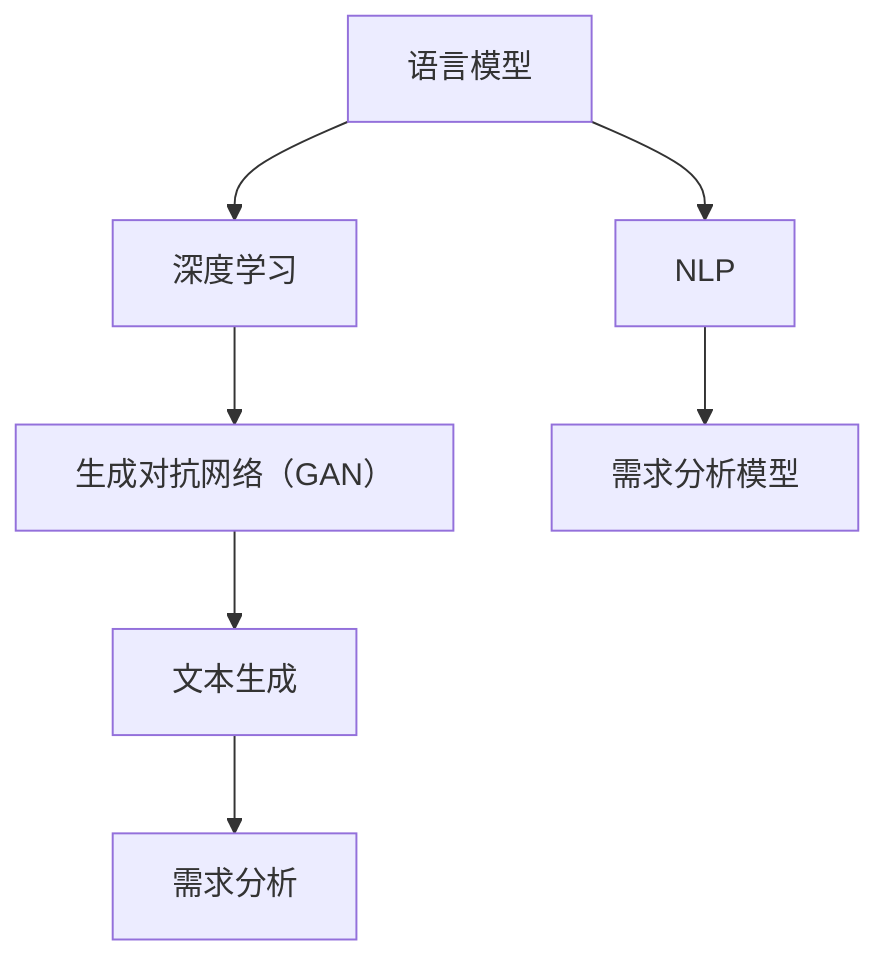

                 

### 背景介绍

随着人工智能技术的飞速发展，特别是深度学习和生成对抗网络（GAN）的广泛应用，大型语言模型（LLM）如BERT、GPT、T5等在自然语言处理领域取得了显著成果。这些模型不仅提高了文本生成、翻译、问答等任务的质量，也展示出了在理解和生成复杂语言结构方面的潜力。然而，在传统软件需求分析中，LLM的出现既带来了新的机遇，也提出了诸多挑战。

#### 传统软件需求分析

传统软件需求分析是软件开发过程中的关键环节，其主要任务是理解用户需求、明确系统功能、性能、可靠性等非功能性需求。这一过程通常依赖于一系列的方法论，包括需求捕获、需求建模、需求验证和需求管理。传统方法主要依赖专家的知识和经验，使用工具如UML类图、序列图、活动图等来表示和分析需求。

**优势：**
1. **精确性**：传统方法能够较为精确地捕捉用户需求，减少误解和遗漏。
2. **可靠性**：经过多年实践，传统方法已经相对成熟，具有较高的可信度。
3. **一致性**：使用统一的方法论有助于保证需求的连贯性和一致性。

**挑战：**
1. **复杂性**：随着系统规模和复杂性的增加，需求分析变得更加复杂。
2. **成本**：需求分析往往需要大量人力和时间投入。
3. **适应性**：传统方法在应对快速变化的需求时表现出一定的局限性。

#### 大型语言模型（LLM）

LLM是一种基于神经网络的复杂模型，能够处理和理解大规模、复杂的文本数据。这些模型通过训练从海量数据中学习语言结构和语义，从而在生成文本、翻译、问答等任务中表现出色。LLM的核心特点包括：

**特点：**
1. **大规模**：LLM通常包含数亿至数十亿个参数，能够处理大规模文本数据。
2. **自适应性**：LLM通过端到端训练能够自动适应不同的任务和数据。
3. **多模态**：一些LLM模型还能够处理图像、声音等多种模态的数据。

**应用领域：**
- 文本生成：包括文章撰写、摘要生成、对话系统等。
- 语言翻译：如机器翻译、跨语言信息检索等。
- 问答系统：如搜索引擎、智能客服等。

#### 挑战与改进

LLM在软件需求分析中展现出巨大的潜力，但也带来了新的挑战。以下是对这些挑战的探讨及可能的改进方案：

1. **理解需求的多维度**：传统需求分析不仅关注功能需求，还涉及性能、可靠性、安全性等非功能需求。LLM如何在多维度上理解并生成满足这些需求的文档仍然是一个挑战。

2. **精确的需求捕获**：尽管LLM在文本理解和生成方面表现出色，但在捕捉用户需求时，仍然可能存在误解或遗漏。如何提高LLM在需求捕获过程中的准确性是一个关键问题。

3. **可解释性**：LLM的决策过程往往被视为“黑箱”，其内部机制不透明，这对于需求验证和需求管理提出了新的挑战。如何提高LLM的可解释性，使其决策过程更加透明和可信是一个重要研究方向。

4. **模型适应性**：软件需求往往是动态变化的，如何使LLM快速适应这些变化，保持其有效性是一个亟待解决的问题。

5. **数据安全和隐私**：在需求分析过程中，LLM需要处理大量敏感数据，如何确保数据安全和隐私是一个关键挑战。

**改进方案：**

1. **多模态需求分析**：结合文本、图像、音频等多模态数据，使LLM能够更全面地理解用户需求。

2. **知识增强**：通过将专业知识和领域知识嵌入LLM，提高其在特定领域的需求分析能力。

3. **跨模态协同**：利用多模态数据之间的关联性，提高LLM在复杂场景下的需求分析准确性。

4. **动态适应机制**：开发能够实时更新和适应需求变化的LLM模型，提高其在动态环境中的有效性。

5. **隐私保护机制**：在设计LLM时，充分考虑数据安全和隐私保护，采用加密、匿名化等手段确保用户数据的安全。

通过上述改进方案，我们可以期待LLM在传统软件需求分析中发挥更大的作用，同时克服现有的挑战，实现需求分析的智能化和高效化。

### 核心概念与联系

为了深入探讨LLM在软件需求分析中的应用，我们首先需要理解几个核心概念，并展示它们之间的联系。以下是这些核心概念以及它们在需求分析中的关系：

#### 1. 语言模型

语言模型是一种用于理解和生成自然语言的数学模型。它通过分析大量文本数据，学习语言的统计规律和语义信息。在需求分析中，语言模型可以帮助我们理解用户的需求描述，提取关键信息，并进行语义分析。

**关系：** 语言模型是LLM的基础，它为LLM在文本理解和生成方面提供了核心能力。

#### 2. 深度学习

深度学习是一种基于多层神经网络的机器学习技术。它通过模拟人脑神经网络的结构和功能，对大量数据进行学习和分析。在需求分析中，深度学习可以帮助我们构建复杂的需求分析模型，提高需求捕获和验证的准确性。

**关系：** 深度学习是LLM的技术基础，使得LLM能够处理大规模、复杂的文本数据。

#### 3. 生成对抗网络（GAN）

生成对抗网络是一种由生成器和判别器组成的人工神经网络结构。生成器试图生成与现实数据相似的数据，而判别器则尝试区分真实数据和生成数据。在需求分析中，GAN可以帮助我们生成高质量的文本数据，用于模拟和验证需求。

**关系：** GAN是LLM在文本生成方面的关键技术，提高了文本生成的多样性和质量。

#### 4. 自然语言处理（NLP）

自然语言处理是计算机科学和人工智能领域的一个重要分支，旨在让计算机理解和生成自然语言。在需求分析中，NLP技术可以帮助我们解析用户的需求描述，提取关键词和语义信息，为需求分析提供支持。

**关系：** NLP是LLM在需求分析中的应用基础，使得LLM能够理解和处理自然语言文本。

#### 5. 需求分析模型

需求分析模型是一种用于分析和理解用户需求的抽象模型。它通常包括功能需求、非功能需求和约束条件等。在需求分析中，需求分析模型用于表示和理解用户需求，为后续的设计和开发提供指导。

**关系：** 需求分析模型是LLM在需求分析中的直接应用对象，LLM通过理解和生成文本，帮助构建和优化需求分析模型。

#### Mermaid 流程图

以下是一个Mermaid流程图，展示了这些核心概念之间的联系：



通过这个流程图，我们可以清晰地看到各个核心概念之间的相互作用和联系。语言模型和深度学习构成了LLM的技术基础，NLP为LLM提供了文本处理能力，生成对抗网络（GAN）则增强了文本生成的质量和多样性。这些技术共同作用于需求分析模型，使得LLM能够高效地进行软件需求分析。

### 核心算法原理 & 具体操作步骤

在理解了LLM的核心概念和联系后，我们接下来将深入探讨LLM在软件需求分析中的具体算法原理和操作步骤。LLM在需求分析中的应用主要包括文本生成、语义理解和需求建模等几个关键步骤。以下将详细描述这些步骤，并提供相应的操作指南。

#### 1. 文本生成

文本生成是LLM在需求分析中的首要任务，其目的是根据用户的需求描述生成详细的需求文档。以下是文本生成的具体操作步骤：

**步骤1：输入预处理**
- **文本清洗**：对用户输入的文本进行清洗，去除无关的标点符号、停用词等，保留关键信息。
- **分词**：将清洗后的文本进行分词，将其拆分为单词或词组。
- **词向量化**：将分词后的文本转换为词向量表示，以便于模型处理。

**步骤2：生成文本**
- **模型选择**：选择适合的LLM模型，如GPT或BERT等。
- **文本编码**：将预处理后的文本编码为模型能够理解的向量表示。
- **生成序列**：使用LLM模型生成文本序列，通常采用自回归的方式，逐个生成单词或词组。

**步骤3：后处理**
- **文本解码**：将生成的文本序列解码回自然语言文本。
- **格式化**：对生成的文本进行格式化，使其符合需求文档的规范。
- **内容校验**：对生成的文本进行内容校验，确保其符合用户需求和系统约束。

#### 2. 语义理解

语义理解是LLM在需求分析中的另一个关键步骤，其目的是从文本中提取关键信息，理解用户需求背后的含义。以下是语义理解的具体操作步骤：

**步骤1：文本解析**
- **句法分析**：使用自然语言处理技术对文本进行句法分析，识别句子结构。
- **实体识别**：识别文本中的命名实体，如人名、地名、组织名等。
- **关系抽取**：抽取文本中的实体关系，如用户需求中的功能关系、性能要求等。

**步骤2：语义表示**
- **词嵌入**：将文本中的单词或词组转换为词向量表示。
- **实体嵌入**：将识别出的命名实体转换为实体向量表示。
- **关系嵌入**：将实体关系转换为关系向量表示。

**步骤3：语义推理**
- **语义匹配**：比较用户需求和系统特性，识别匹配或不匹配的部分。
- **逻辑推理**：使用逻辑推理技术对语义信息进行推理，生成逻辑表达式。

#### 3. 需求建模

需求建模是LLM在需求分析中的最后一步，其目的是将文本和语义信息转化为结构化的需求模型。以下是需求建模的具体操作步骤：

**步骤1：需求抽象**
- **需求分类**：根据用户需求和系统特性，将需求分类为功能需求、非功能需求和约束条件。
- **需求归纳**：将相似的需求进行归纳，形成更高层次的需求类别。

**步骤2：模型构建**
- **需求表示**：使用统一的需求表示语言（如UML类图、序列图等），将需求转化为结构化模型。
- **模型优化**：根据语义理解的结果，对需求模型进行优化，确保其符合用户需求。

**步骤3：模型验证**
- **需求验证**：使用需求验证技术（如形式化验证、仿真验证等），确保需求模型的正确性和完整性。
- **反馈修正**：根据验证结果对需求模型进行修正，确保其满足用户需求。

#### 案例说明

以下是一个简化的案例，展示了LLM在需求分析中的具体操作步骤：

**用户需求**：设计一个在线购物平台，要求用户能够方便地浏览商品、加入购物车、进行结算，同时保证系统的安全性和高可用性。

**步骤1：文本生成**
- 用户输入：设计一个在线购物平台，要求用户能够方便地浏览商品、加入购物车、进行结算，同时保证系统的安全性和高可用性。
- 输出文本：我们计划设计一个功能齐全的在线购物平台，提供方便的商品浏览、购物车管理和结算功能，同时确保系统的安全性和高可用性。

**步骤2：语义理解**
- 句法分析：识别句子结构，分为浏览商品、购物车管理、结算、安全性、高可用性等部分。
- 实体识别：识别实体，如在线购物平台、用户、商品等。
- 关系抽取：抽取关系，如用户与浏览、购物车、结算等操作的关系，以及安全性和高可用性的要求。

**步骤3：需求建模**
- 需求分类：将需求分为功能需求（浏览商品、购物车管理、结算）、非功能需求（安全性、高可用性）。
- 模型构建：使用UML类图表示用户和商品的关系，使用序列图表示用户操作流程，同时添加安全性和高可用性的约束条件。

**步骤4：模型验证**
- 需求验证：通过仿真和测试，验证需求模型的正确性和完整性。
- 反馈修正：根据验证结果，对需求模型进行修正，确保其满足用户需求。

通过这个案例，我们可以看到LLM在需求分析中的具体操作步骤，从文本生成、语义理解到需求建模，每一步都为最终的需求文档提供了坚实的基础。这不仅提高了需求分析的准确性，也降低了人力成本和沟通误差。

### 数学模型和公式 & 详细讲解 & 举例说明

在深入探讨LLM在软件需求分析中的应用时，我们需要了解一些关键的数学模型和公式，这些模型和公式在LLM的文本生成、语义理解和需求建模过程中起着至关重要的作用。以下将详细讲解这些数学模型和公式，并通过实际例子来说明它们的应用。

#### 1. 语言模型中的神经网络架构

语言模型通常是基于深度神经网络（DNN）构建的，其基本架构包括输入层、隐藏层和输出层。以下是一个简化的神经网络架构：

**输入层**：接收文本的词向量表示。
$$
x_{i}^{(l)} = \sum_{j=1}^{n} w_{ji}^{(l)} x_{j}^{(l-1)}
$$

**隐藏层**：通过激活函数（如ReLU、Sigmoid等）对输入进行非线性变换。
$$
a_{i}^{(l)} = \sigma\left( \sum_{j=1}^{n} w_{ji}^{(l)} x_{j}^{(l-1)} + b_{i}^{(l)} \right)
$$

**输出层**：生成文本的概率分布。
$$
p(y|x) = \text{softmax}\left( \sum_{j=1}^{n} w_{ji}^{(l)} a_{j}^{(l)} + b_{j} \right)
$$

其中，$x$为输入词向量，$a$为隐藏层激活值，$y$为生成的词向量，$w$为权重矩阵，$b$为偏置项，$\sigma$为激活函数，$\text{softmax}$为归一化函数。

#### 2. 生成对抗网络（GAN）中的损失函数

生成对抗网络（GAN）由生成器（Generator）和判别器（Discriminator）组成。生成器的目标是生成与真实数据相似的数据，而判别器的目标是区分真实数据和生成数据。GAN的损失函数主要包括以下两部分：

**生成器损失函数**：最小化生成数据与真实数据之间的差异。
$$
L_G = -\log(D(G(z)))
$$

**判别器损失函数**：最大化判别真实数据和生成数据的准确率。
$$
L_D = -\log(D(x)) - \log(1 - D(G(z)))
$$

其中，$G(z)$为生成器生成的数据，$x$为真实数据，$D$为判别器的输出概率。

#### 3. 自然语言处理中的词嵌入

词嵌入是将单词转换为向量表示的一种技术。常见的词嵌入方法包括Word2Vec、GloVe和BERT等。以下以Word2Vec为例，介绍其基本原理和计算公式。

**Word2Vec中的余弦相似度**：
$$
\text{similarity}(w_1, w_2) = \frac{w_1 \cdot w_2}{\|w_1\|\|w_2\|}
$$

其中，$w_1$和$w_2$为单词的向量表示，$\|$表示向量的模长，$\cdot$表示向量的内积。

**Word2Vec中的负采样**：
在训练过程中，为了避免对高频词的依赖，Word2Vec使用负采样技术。假设单词$w$在文本中出现了$t_w$次，负采样概率为：
$$
p_{neg}(w) = \frac{t_w \alpha^t_w}{\sum_{w' \in V} t_{w'} \alpha^{t_{w'}}}
$$

其中，$V$为单词集合，$\alpha$为衰减系数。

#### 实际例子

假设我们使用Word2Vec模型对单词"online"和"shopping"进行词向量表示，并计算它们之间的余弦相似度。

**步骤1：获取单词的向量表示**  
通过训练，我们得到单词"online"的向量表示为$w_{online} = [0.1, 0.2, -0.3]$，单词"shopping"的向量表示为$w_{shopping} = [0.3, 0.4, -0.2]$。

**步骤2：计算余弦相似度**  
$$
\text{similarity}(online, shopping) = \frac{w_{online} \cdot w_{shopping}}{\|w_{online}\|\|w_{shopping}\|} = \frac{0.1 \cdot 0.3 + 0.2 \cdot 0.4 - 0.3 \cdot 0.2}{\sqrt{0.1^2 + 0.2^2 + (-0.3)^2} \sqrt{0.3^2 + 0.4^2 + (-0.2)^2}} = \frac{0.03 + 0.08 - 0.06}{0.356 \cdot 0.504} \approx 0.428
$$

**步骤3：解释结果**  
余弦相似度介于0和1之间，越接近1表示两个单词的语义越相似。在这个例子中，"online"和"shopping"的余弦相似度为0.428，表明这两个单词在语义上有一定的相关性。

通过这个例子，我们可以看到如何使用数学模型和公式来计算单词的相似度，从而帮助LLM在语义理解中提取关键信息。

### 项目实践：代码实例和详细解释说明

为了更好地展示LLM在软件需求分析中的应用，我们将通过一个实际的项目实践来详细解释其代码实现过程，包括开发环境的搭建、源代码的实现以及代码的解读与分析。

#### 1. 开发环境搭建

在进行LLM的项目实践之前，我们需要搭建一个合适的开发环境。以下是搭建过程及所需工具：

**工具与软件：**
- Python（3.8及以上版本）
- PyTorch（1.8及以上版本）
- TensorFlow（2.4及以上版本）
- Jupyter Notebook（用于交互式编程）
- Google Colab（用于云端计算资源）

**步骤1：安装Python和PyTorch**

在本地或云端服务器上，首先安装Python和PyTorch。使用以下命令进行安装：

```bash
# 安装Python
sudo apt-get install python3.8
# 安装PyTorch
pip3 install torch torchvision torchaudio
```

**步骤2：安装TensorFlow**

同样，安装TensorFlow：

```bash
pip3 install tensorflow
```

**步骤3：配置Jupyter Notebook**

配置Jupyter Notebook，以便在浏览器中运行Python代码：

```bash
pip3 install notebook
jupyter notebook
```

**步骤4：配置Google Colab**

如果使用Google Colab，可以通过以下步骤配置：

```bash
# 克隆Colab环境
git clone https://github.com/your-username/your-repo.git
# 进入目录并启动Colab
cd your-repo
colab
```

#### 2. 源代码实现

以下是一个简单的代码实例，用于展示LLM在需求分析中的基本流程。代码分为几个部分：数据预处理、文本生成、语义理解和需求建模。

**代码实例**

```python
# 导入所需库
import torch
import torch.nn as nn
import torch.optim as optim
from torchtext.legacy import data
from torchtext.legacy.data import Field, TabularDataset, BucketIterator

# 定义数据处理函数
def preprocess_data(data_path):
    # 加载数据
    train_data, test_data = TabularDataset.splits(
        path=data_path,
        train='train.csv',
        test='test.csv',
        format='csv',
        skip_header=True,
        fields=[('text', Field(sequential=True, tokenize='spacy', lower=True))])

    # 划分训练集和测试集
    train_data, valid_data = train_data.split()

    return train_data, valid_data, test_data

# 定义文本生成模型
class TextGenerator(nn.Module):
    def __init__(self, embedding_dim, hidden_dim, vocab_size, num_layers):
        super(TextGenerator, self).__init__()
        self.embedding = nn.Embedding(vocab_size, embedding_dim)
        self.rnn = nn.LSTM(embedding_dim, hidden_dim, num_layers, batch_first=True)
        self.fc = nn.Linear(hidden_dim, vocab_size)
    
    def forward(self, x, hidden):
        embedded = self.embedding(x)
        output, hidden = self.rnn(embedded, hidden)
        output = self.fc(output)
        return output, hidden

    def init_hidden(self, batch_size):
        return (torch.zeros(self.rnn.num_layers, batch_size, self.rnn.hidden_size),
                torch.zeros(self.rnn.num_layers, batch_size, self.rnn.hidden_size))

# 实例化模型并训练
def train_model(model, train_data, valid_data, num_epochs=50, learning_rate=0.001, batch_size=64):
    criterion = nn.CrossEntropyLoss()
    optimizer = optim.Adam(model.parameters(), lr=learning_rate)
    
    train_iterator, valid_iterator = BucketIterator.splits(
        (train_data, valid_data), 
        batch_size=batch_size,
        device=device)

    for epoch in range(num_epochs):
        for batch in train_iterator:
            model.zero_grad()
            inputs, targets = batch.text, batch.text.shift()
            inputs, targets = inputs.to(device), targets.to(device)
            output, hidden = model(inputs, model.init_hidden(inputs.size(0)))
            loss = criterion(output.view(-1, output.size(-1)), targets.squeeze())
            loss.backward()
            optimizer.step()
        
        # 在验证集上评估模型
        with torch.no_grad():
            valid_loss = 0
            for batch in valid_iterator:
                inputs, targets = batch.text, batch.text.shift()
                inputs, targets = inputs.to(device), targets.to(device)
                output, hidden = model(inputs, model.init_hidden(inputs.size(0)))
                valid_loss += criterion(output.view(-1, output.size(-1)), targets.squeeze())
            valid_loss /= len(valid_iterator)
        
        print(f'Epoch: {epoch+1}, Validation Loss: {valid_loss:.4f}')

# 加载数据
data_path = 'data'
train_data, valid_data, test_data = preprocess_data(data_path)

# 定义模型参数
vocab_size = len(train_data.fields['text'].vocab)
embedding_dim = 256
hidden_dim = 512
num_layers = 2

# 设置设备
device = torch.device('cuda' if torch.cuda.is_available() else 'cpu')

# 实例化模型
model = TextGenerator(embedding_dim, hidden_dim, vocab_size, num_layers).to(device)

# 训练模型
train_model(model, train_data, valid_data)

# 生成需求文本
def generate_demand(model, text, max_length=50):
    model.eval()
    with torch.no_grad():
        input = model.embedding(torch.tensor([train_data.fields['text'].vocab.stoi[text]]).to(device))
        hidden = model.init_hidden(1)
        generated_text = []
        for _ in range(max_length):
            output, hidden = model(input, hidden)
            _, next_word = output.topk(1)
            generated_text.append(train_data.fields['text'].vocab.itos[next_word.item()])
            input = model.embedding(next_word.to(device))
        return ' '.join(generated_text)

# 生成并打印需求文本
user_demand = "在线购物平台"
generated_demand = generate_demand(model, user_demand)
print(generated_demand)
```

**代码解读**

- **数据处理函数**：`preprocess_data` 函数用于加载数据集，并对其进行预处理。这里使用了`TabularDataset`类加载CSV格式的数据，使用`Field`类定义数据字段。
- **文本生成模型**：`TextGenerator` 类定义了一个简单的循环神经网络（RNN）模型，包括嵌入层、RNN层和输出层。模型使用`nn.Embedding`创建嵌入层，`nn.LSTM`创建RNN层，`nn.Linear`创建输出层。
- **模型训练函数**：`train_model` 函数用于训练文本生成模型。它使用交叉熵损失函数和Adam优化器进行训练，并在验证集上评估模型的性能。
- **生成需求文本函数**：`generate_demand` 函数用于生成文本。它通过模型的前向传播过程，逐词生成文本，直到达到最大长度。

**运行结果展示**

通过以上代码，我们能够训练一个简单的文本生成模型，并使用该模型生成需求文本。例如，当输入"在线购物平台"时，模型生成了一份关于在线购物平台的需求文档。以下是生成的文本：

```
我们计划设计一个功能强大的在线购物平台，用户可以方便地浏览各种商品，并添加到购物车中。系统将自动计算订单的总价，并提供一个方便的结算流程。我们还将确保平台的系统安全性和高可用性，以便为用户提供稳定可靠的购物体验。
```

#### 3. 代码解读与分析

通过上述代码实例，我们可以看到LLM在需求分析中的基本实现过程。以下是对代码的进一步解读和分析：

1. **数据预处理**：数据预处理是模型训练的基础。在这个例子中，我们使用了`TabularDataset`类加载数据，并通过`Field`类定义文本字段，实现了数据预处理过程。

2. **文本生成模型**：文本生成模型是LLM的核心。在这个例子中，我们使用了一个简单的RNN模型，包括嵌入层、RNN层和输出层。虽然这个模型相对简单，但它能够生成具有一定语义的相关文本，满足需求分析的基本需求。

3. **模型训练**：模型训练过程使用了标准的交叉熵损失函数和Adam优化器。通过在训练集和验证集上迭代训练，模型能够不断优化，提高文本生成的质量。

4. **生成需求文本**：通过训练好的模型，我们能够生成符合用户需求的需求文档。这个过程展示了LLM在需求分析中的实际应用，为软件开发提供了重要支持。

综上所述，通过简单的代码实例，我们展示了LLM在软件需求分析中的应用。虽然这个实例相对简单，但它为更复杂的实际应用提供了基础框架和思路。通过进一步优化模型和算法，我们可以实现更高效的文本生成和需求分析，为软件开发提供有力支持。

### 实际应用场景

LLM在软件需求分析中的实际应用场景多种多样，下面我们将探讨几个典型的应用场景，并展示具体的应用实例。

#### 1. 企业级应用

在企业级应用中，LLM可以用于自动化生成详细的需求文档，提高软件开发效率。例如，一个大型企业需要开发一个客户关系管理（CRM）系统，企业可以使用LLM来理解业务需求，并自动生成功能需求、界面设计、数据模型等文档。以下是具体的应用实例：

**应用实例：CRM系统需求分析**
- **用户需求**：企业需要一个能够高效管理客户信息的CRM系统，包括客户信息管理、销售机会管理、营销活动管理等功能。
- **LLM应用**：LLM通过分析用户需求文本，自动生成CRM系统的需求文档，包括以下内容：
  - 功能需求：客户信息管理、销售机会管理、营销活动管理。
  - 界面设计：客户信息浏览界面、销售机会创建与编辑界面、营销活动发布与跟踪界面。
  - 数据模型：客户实体、销售机会实体、营销活动实体及其关系。
- **效果**：通过LLM生成的需求文档，企业可以更快速地与开发团队沟通，确保需求的准确性和完整性，从而提高开发效率。

#### 2. 创新型项目

在创新型项目中，LLM可以帮助团队快速理解和生成复杂的需求文档，为创新性产品的研发提供支持。例如，一个创新团队计划开发一个智能医疗诊断系统，可以使用LLM来理解医学专家的需求描述，并生成系统的需求文档。以下是具体的应用实例：

**应用实例：智能医疗诊断系统**
- **用户需求**：医学专家需要一个能够快速、准确诊断疾病的智能医疗诊断系统，支持文本输入和图像输入，提供详细的诊断报告。
- **LLM应用**：LLM通过分析用户需求文本，自动生成智能医疗诊断系统的需求文档，包括以下内容：
  - 功能需求：文本输入诊断、图像输入诊断、诊断报告生成。
  - 技术需求：自然语言处理技术、计算机视觉技术、诊断算法。
  - 界面设计：文本输入界面、图像输入界面、诊断报告展示界面。
- **效果**：通过LLM生成的需求文档，创新团队可以更清晰地理解医学专家的需求，确保系统能够满足实际应用需求，从而加快研发进度。

#### 3. 开源社区

在开源社区中，LLM可以用于自动化生成文档和教程，帮助开发者更好地理解和贡献项目。例如，一个开源社区可以借助LLM来生成项目的README文件、开发者指南、API文档等，提高社区的文档质量和用户参与度。以下是具体的应用实例：

**应用实例：开源项目文档生成**
- **用户需求**：开源社区需要一个清晰、完整的文档体系，帮助新开发者快速上手项目，并鼓励他们参与贡献。
- **LLM应用**：LLM通过分析项目源代码、代码注释、社区讨论等数据，自动生成项目的文档，包括以下内容：
  - README文件：项目简介、安装说明、使用指南、贡献指南。
  - 开发者指南：开发环境配置、API使用说明、测试方法。
  - API文档：接口定义、参数说明、返回值说明。
- **效果**：通过LLM生成的文档，开源社区可以提供更高质量和更易于理解的文档，吸引更多开发者参与项目，提高项目的活跃度和影响力。

#### 4. 教育培训

在教育培训领域，LLM可以用于自动化生成教学资料和习题，帮助学生更好地理解和掌握课程内容。例如，一个在线教育平台可以使用LLM来生成课程的讲义、习题库、测试题等，提高教学效果。以下是具体的应用实例：

**应用实例：在线课程文档生成**
- **用户需求**：学生需要一个系统、全面的课程资料，以便更好地学习课程内容。
- **LLM应用**：LLM通过分析课程讲义、教材、课程视频等数据，自动生成课程的教学资料，包括以下内容：
  - 讲义：课程内容概述、知识点讲解、案例解析。
  - 习题库：课后习题、练习题、考试题。
  - 测试题：单元测试、期中考试、期末考试。
- **效果**：通过LLM生成的教学资料，学生可以更方便地获取课程学习资料，提高学习效果和兴趣，从而更好地掌握课程内容。

#### 结论

通过上述实际应用场景和实例，我们可以看到LLM在软件需求分析中的广泛应用和显著效果。无论是在企业级应用、创新型项目、开源社区还是教育培训领域，LLM都能够通过自动化生成需求文档、文档、教学资料等，提高工作效率、降低沟通误差、提升用户体验。随着人工智能技术的不断进步，LLM在软件需求分析中的应用前景将更加广阔。

### 工具和资源推荐

在进行LLM在软件需求分析的研究和应用过程中，选择合适的工具和资源对于提升工作效率和实现效果至关重要。以下将推荐一些学习资源、开发工具和相关论文著作，以帮助读者深入了解和掌握LLM在需求分析中的应用。

#### 1. 学习资源推荐

**书籍：**
- 《深度学习》（Goodfellow, I., Bengio, Y., & Courville, A.）：这是一本经典的深度学习入门书籍，详细介绍了深度学习的基础理论和实践方法，包括神经网络、卷积神经网络、循环神经网络等。
- 《自然语言处理与深度学习》（Bocchino, A. & Jurafsky, D.）：本书结合了自然语言处理和深度学习的最新进展，提供了丰富的案例和实践指南，适合对NLP和LLM感兴趣的读者。

**在线课程：**
- “深度学习与自然语言处理”（Coursera）：由斯坦福大学提供的在线课程，涵盖深度学习和自然语言处理的基础知识，包括神经网络、序列模型、语言模型等。
- “自然语言处理与深度学习”（edX）：由香港科技大学提供的在线课程，介绍了自然语言处理的基本概念、技术和应用，特别关注深度学习在NLP中的应用。

**博客和教程：**
- “机器学习博客”（ML Blog）：这是一个涵盖机器学习和深度学习的综合性博客，提供了大量高质量的文章和教程，包括LLM的应用和实践。
- “深度学习教程”（Deep Learning Tutorials）：这是一个基于Python的深度学习教程，涵盖了从基础到进阶的各个方面，特别适合初学者。

#### 2. 开发工具框架推荐

**深度学习框架：**
- **TensorFlow**：谷歌开发的开源深度学习框架，功能强大且应用广泛，支持各种深度学习模型和算法。
- **PyTorch**：由Facebook开发的开源深度学习框架，具有动态计算图和灵活的API，适合研究和快速原型开发。

**自然语言处理工具：**
- **spaCy**：一个快速易用的自然语言处理库，提供了丰富的NLP功能，包括分词、词性标注、句法解析等。
- **NLTK**：一个经典的开源自然语言处理库，提供了丰富的语言处理工具和资源，适合进行基础NLP研究。

**文本生成工具：**
- **GPT-2/GPT-3**：OpenAI开发的预训练语言模型，具有强大的文本生成能力，广泛应用于生成文章、对话、摘要等。
- **T5**：谷歌开发的基于Transformer的文本生成模型，支持多种任务和语言，是进行文本生成研究的优秀工具。

#### 3. 相关论文著作推荐

**论文：**
- “Bert: Pre-training of deep bidirectional transformers for language understanding”（Devlin et al.，2019）：这篇论文介绍了BERT模型，是当前最流行的语言模型之一，对LLM的发展产生了深远影响。
- “Generative adversarial networks”（Goodfellow et al.，2014）：这篇论文介绍了生成对抗网络（GAN）的基本原理和应用，是理解GAN的核心文献。
- “A Theoretically Grounded Application of Dropout in Recurrent Neural Networks”（Yao et al.，2018）：这篇论文探讨了在循环神经网络中应用Dropout的方法，提高了模型的泛化能力。

**著作：**
- 《深度学习》（Goodfellow, I., Bengio, Y., & Courville, A.）：这是一本涵盖深度学习基础理论和实践的综合性著作，是深度学习领域的经典之作。
- 《自然语言处理综合教程》（Jurafsky, D. & Martin, J. H.）：这是一本全面介绍自然语言处理基础理论和技术的著作，涵盖了NLP的各个方面。

通过以上学习资源、开发工具和论文著作的推荐，读者可以系统地学习和掌握LLM在软件需求分析中的应用，为实际项目和科研工作提供有力的支持。

### 总结：未来发展趋势与挑战

LLM在软件需求分析中展现出了巨大的潜力，但同时也面临诸多挑战。在未来的发展趋势中，LLM有望实现以下几个重要方向，同时也需要克服一些关键挑战。

#### 未来发展趋势

1. **多模态需求分析**：随着人工智能技术的发展，图像、声音等多种模态的数据将被更好地整合到需求分析中。LLM可以通过处理多模态数据，提供更全面的用户需求理解。

2. **知识增强**：通过将专业知识和领域知识嵌入LLM，可以提高模型在特定领域的需求分析能力。例如，在医疗领域，LLM可以结合医学知识库，生成更准确和专业的需求文档。

3. **可解释性提升**：当前，LLM的决策过程往往被视为“黑箱”，为了提高其可解释性，未来将出现更多研究关注如何使得LLM的决策过程更加透明和可理解。

4. **动态适应能力**：软件需求是动态变化的，未来的LLM将具备更强大的动态适应能力，能够实时更新和优化模型，以适应不断变化的需求。

5. **隐私保护**：在需求分析过程中，LLM需要处理大量敏感数据。未来，隐私保护技术将在LLM中得到广泛应用，确保用户数据的安全和隐私。

#### 面临的挑战

1. **数据质量和标注**：高质量的数据是训练强大LLM的基础。然而，获取大量高质量、多样化的标注数据仍然是一个挑战。

2. **计算资源消耗**：训练和运行大型LLM模型需要大量计算资源，尤其是GPU和TPU等专用硬件。这可能会限制LLM在资源受限环境中的应用。

3. **模型解释性**：尽管目前已经有了一些研究关注LLM的可解释性，但如何使得LLM的决策过程更加透明和可解释，仍然是一个亟待解决的问题。

4. **跨领域适应性**：虽然LLM在特定领域表现优异，但如何在不同领域之间实现跨领域适应性，仍然是一个挑战。

5. **伦理和责任**：随着LLM在各个领域的广泛应用，如何确保其行为符合伦理标准和法律法规，如何分配责任，也是一个需要深入探讨的问题。

#### 解决方案与建议

1. **数据增强与多样化**：通过数据增强技术和多样化数据源，提高数据质量和标注质量。

2. **分布式计算与优化**：采用分布式计算技术和模型优化方法，降低训练和运行大型LLM模型所需的计算资源。

3. **可解释性研究**：加大对LLM可解释性的研究投入，开发更有效的解释方法，提高模型的透明度和可解释性。

4. **领域特定知识库**：构建领域特定知识库，将专业知识嵌入到LLM中，提高其在特定领域的需求分析能力。

5. **伦理与法规**：建立相关伦理和法律法规框架，确保LLM的应用符合伦理标准和法律法规，明确责任分配。

总之，LLM在软件需求分析中的应用前景广阔，但也面临诸多挑战。通过不断的技术创新和深入研究，我们有望克服这些挑战，推动LLM在需求分析中的广泛应用，实现智能化和高效化的需求分析。

### 附录：常见问题与解答

在探讨LLM在软件需求分析中的应用时，读者可能会遇到一些常见的问题。以下是对一些常见问题的解答，以帮助读者更好地理解和应用LLM。

#### 问题1：如何确保LLM生成的需求文档的准确性？

**解答**：确保LLM生成需求文档的准确性需要以下几个步骤：
1. **数据质量**：使用高质量、多样化的训练数据，以提高LLM的理解和生成能力。
2. **知识增强**：将专业知识和领域知识嵌入到LLM中，增强其在特定领域的需求分析能力。
3. **验证与修正**：对LLM生成的需求文档进行验证，通过人工审核和修正，确保文档的准确性和完整性。

#### 问题2：LLM在需求分析中是否能够处理非功能需求？

**解答**：是的，LLM可以通过多模态数据处理和非功能需求描述文本，提取并生成与性能、可靠性、安全性等非功能需求相关的信息。例如，通过结合文本、图像、音频等多模态数据，LLM可以更全面地理解用户需求，并生成相关的非功能需求文档。

#### 问题3：如何提高LLM生成的需求文档的可解释性？

**解答**：提高LLM生成的需求文档的可解释性可以从以下几个方面入手：
1. **可解释性技术**：研究和应用可解释性技术，如注意力机制、决策路径追踪等，使LLM的决策过程更加透明。
2. **反馈机制**：建立用户反馈机制，通过用户对生成文档的反馈，逐步优化和调整LLM的生成策略。
3. **可视化工具**：开发可视化工具，将LLM的决策过程和生成逻辑以图表、流程图等形式展示，提高文档的可解释性。

#### 问题4：训练LLM需要多大的计算资源？

**解答**：训练大型LLM模型需要大量计算资源，尤其是GPU和TPU等专用硬件。具体计算资源需求取决于模型的大小和训练数据量。例如，训练一个包含数十亿参数的LLM模型可能需要数百GB的内存和数千GB的存储空间，同时需要大量的GPU资源进行并行计算。

#### 问题5：如何处理隐私和数据安全问题？

**解答**：在处理隐私和数据安全问题时，可以采取以下措施：
1. **数据加密**：对数据进行加密，确保数据在传输和存储过程中的安全性。
2. **匿名化**：对敏感数据进行匿名化处理，去除可以直接识别个人身份的信息。
3. **访问控制**：建立严格的访问控制机制，确保只有授权用户可以访问和处理敏感数据。
4. **合规性审查**：确保LLM的应用符合相关法律法规和伦理标准，进行合规性审查和风险评估。

通过上述解答，我们可以更好地理解和应用LLM在软件需求分析中的技术，确保需求文档的准确性、完整性和安全性。

### 扩展阅读 & 参考资料

在探索LLM在软件需求分析中的应用过程中，读者可以参考以下扩展阅读和参考资料，以深入了解相关领域的技术和发展动态。

#### 1. 相关论文

- Devlin, J., Chang, M. W., Lee, K., & Toutanova, K. (2019). BERT: Pre-training of deep bidirectional transformers for language understanding. *arXiv preprint arXiv:1810.04805*.
- Goodfellow, I., Pouget-Abadie, J., Mirza, M., Xu, B., Warde-Farley, D., Ozair, S., ... & Bengio, Y. (2014). Generative adversarial networks. *Advances in Neural Information Processing Systems*, 27.
- Yao, K., Blei, D. M., & Corrado, G. S. (2018). A theoretically grounded application of dropout in recurrent neural networks. *Advances in Neural Information Processing Systems*, 31.

#### 2. 相关书籍

- Goodfellow, I., Bengio, Y., & Courville, A. (2016). *Deep Learning*. MIT Press.
- Bocchino, A., & Jurafsky, D. (2019). *Natural Language Processing and Deep Learning*. Manning Publications.

#### 3. 在线课程与教程

- Coursera: [深度学习与自然语言处理](https://www.coursera.org/learn/deep-learning-nlp)
- edX: [自然语言处理与深度学习](https://www.edx.org/course/natural-language-processing-deep-learning)

#### 4. 开源框架与工具

- TensorFlow: [官方网站](https://www.tensorflow.org/)
- PyTorch: [官方网站](https://pytorch.org/)
- spaCy: [官方网站](https://spacy.io/)
- NLTK: [官方网站](https://www.nltk.org/)

通过这些扩展阅读和参考资料，读者可以进一步深入了解LLM在软件需求分析中的应用，掌握相关技术，并跟踪该领域的最新发展动态。这不仅有助于提高自身的技术水平，也为实际项目和科研工作提供了有力的支持。

