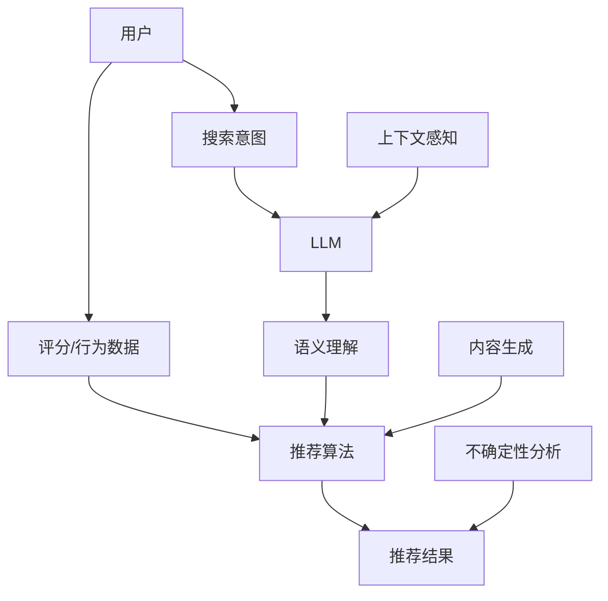

                 

### 1. 背景介绍

随着深度学习，尤其是生成式预训练模型（如GPT系列）的兴起，人工智能领域迎来了前所未有的发展。这些模型在大规模数据集上进行训练，从而获得了强大的文本理解和生成能力。在推荐系统领域，这类模型被广泛应用，用以提升推荐的准确性、多样性和实时性。然而，LLM（Large Language Model，大型语言模型）在推荐系统中的应用并非没有挑战。本文将重点讨论LLM对推荐系统实时决策的不确定性分析，以期为实际应用提供指导。

#### 1.1 推荐系统概述

推荐系统是一种信息过滤技术，旨在向用户推荐他们可能感兴趣的项目或内容。推荐系统通常分为基于协同过滤、基于内容过滤和混合推荐系统等几类。传统的推荐系统主要通过分析用户的历史行为、偏好和上下文信息，来预测用户对特定项目的潜在兴趣。然而，这些方法往往面临数据稀疏、冷启动问题和实时性挑战。

#### 1.2 LLM在推荐系统中的应用

随着LLM的发展，许多研究者和企业开始探索其在推荐系统中的应用。LLM能够捕捉复杂、多层次的语义信息，从而为推荐系统提供更丰富的上下文和语义理解能力。例如，在文本推荐中，LLM可以帮助系统理解用户的搜索意图、评论情感和内容主题，从而生成更个性化的推荐结果。

#### 1.3 不确定性分析的重要性

在实际应用中，LLM在推荐系统实时决策中可能会面临多种不确定性。这些不确定性包括数据噪声、模型参数的随机性、输入信息的不完备性等。不确定性分析能够帮助推荐系统更准确地评估预测结果的可靠性，从而优化决策过程，提高用户体验。因此，对LLM在推荐系统中的应用进行不确定性分析具有重要的实际意义。

#### 1.4 本文结构

本文将从以下方面展开讨论：

- **第2章**：介绍与本文相关的核心概念与联系，包括推荐系统、LLM及其交互方式。
- **第3章**：探讨LLM在推荐系统中的应用，以及如何实现实时决策。
- **第4章**：分析LLM在推荐系统中可能产生的不确定性，并介绍相应的数学模型和公式。
- **第5章**：通过实际项目实例，展示如何使用LLM构建推荐系统，并详细解释代码实现过程。
- **第6章**：讨论LLM在推荐系统中的实际应用场景。
- **第7章**：推荐相关学习资源、开发工具框架和相关论文著作。
- **第8章**：总结LLM在推荐系统实时决策中的发展趋势与挑战。
- **第9章**：提供常见问题与解答。
- **第10章**：列出扩展阅读和参考资料。

通过本文的逐步分析，我们希望能够帮助读者深入理解LLM在推荐系统实时决策中的不确定性问题，并为实际应用提供有价值的参考。

### 2. 核心概念与联系

在探讨LLM对推荐系统实时决策的不确定性分析之前，我们首先需要明确几个核心概念，并展示它们之间的相互关系。以下是本文中涉及的主要概念及其关联：

#### 2.1 推荐系统

推荐系统是一种基于用户历史行为和偏好，利用算法预测用户可能感兴趣的项目或内容，从而实现个性化推荐的技术。推荐系统的主要组成部分包括：

- **用户**：系统中的终端用户，拥有特定的兴趣和偏好。
- **项目**：用户可能感兴趣的各种内容，如商品、电影、音乐、新闻文章等。
- **评分或行为数据**：用户对项目的评分、评论、点击、购买等行为数据。
- **推荐算法**：用于生成推荐结果的一系列算法和技术。

#### 2.2 LLM

LLM，即大型语言模型，是一种基于深度学习的自然语言处理（NLP）模型，具有强大的文本理解和生成能力。LLM的核心组成部分包括：

- **模型架构**：如Transformer、GPT系列等。
- **训练数据**：大规模的文本语料库，用于训练模型，使其具备语义理解能力。
- **参数**：模型中的权重和偏置，用于表示语言模式的复杂结构。

#### 2.3 LLM与推荐系统的交互方式

LLM在推荐系统中的应用主要体现在以下几个方面：

- **语义理解**：LLM能够解析文本中的深层语义，从而帮助推荐系统更好地理解用户的意图和偏好。
- **内容生成**：LLM可以生成新颖、有趣的内容，为推荐系统提供多样化的推荐选项。
- **上下文感知**：LLM能够根据用户的当前上下文信息，动态调整推荐策略，提高推荐的实时性。

#### 2.4 不确定性分析

不确定性分析是评估和量化模型预测结果可靠性的过程。在LLM应用于推荐系统时，不确定性分析显得尤为重要，因为模型可能会受到以下因素的影响：

- **数据噪声**：输入数据中可能包含错误或不一致的信息，影响模型的预测准确性。
- **模型参数的随机性**：训练过程中参数的随机初始化可能导致不同的预测结果。
- **输入信息的不完备性**：用户行为数据的不足可能导致预测结果的不确定性。

#### 2.5 相关概念与Mermaid流程图

为了更直观地展示上述概念之间的联系，我们使用Mermaid流程图来描述它们的关系。以下是相关概念及交互方式的Mermaid流程图：



在这个流程图中，用户的行为数据和搜索意图通过LLM进行语义理解和内容生成，最终影响推荐算法的输出，而不确定性分析则用于评估推荐结果的可靠性。

#### 2.6 总结

通过对核心概念与联系的介绍，我们为后续章节的详细讨论奠定了基础。在接下来的章节中，我们将深入探讨LLM在推荐系统中的应用，分析其中的不确定性，并通过实际项目实例展示如何解决这些不确定性。希望通过本文的逐步分析，读者能够更好地理解LLM在推荐系统实时决策中的复杂性和挑战性。

### 3. 核心算法原理 & 具体操作步骤

在深入探讨LLM在推荐系统中的应用之前，我们需要了解LLM的核心算法原理及其在推荐系统中的具体操作步骤。以下是LLM在推荐系统中实现实时决策的核心算法原理和操作步骤：

#### 3.1 LLM的核心算法原理

LLM，尤其是基于Transformer架构的模型，如GPT系列，其核心算法原理主要包括以下几个方面：

- **注意力机制（Attention Mechanism）**：注意力机制是Transformer模型中的一个关键组件，它通过计算输入序列中各个位置之间的相似度，动态地关注重要信息，从而提高模型的语义理解能力。
- **多头自注意力（Multi-Head Self-Attention）**：多头自注意力扩展了单头注意力机制，通过多个独立的自注意力机制同时工作，捕捉不同层次的语义信息，从而增强模型的表示能力。
- **前馈神经网络（Feed Forward Neural Network）**：在自注意力机制之后，每个位置的信息被传递到两个简单的全连接神经网络中，进一步处理和丰富信息。

#### 3.2 LLM在推荐系统中的具体操作步骤

LLM在推荐系统中的具体操作步骤可以概括为以下几个阶段：

1. **数据预处理**：首先，需要收集和预处理用户行为数据、文本评论、搜索意图等。预处理步骤包括数据清洗、去噪、标准化等，以确保输入数据的质量。

2. **特征提取**：使用LLM对预处理后的文本数据进行特征提取。这一过程涉及到LLM的编码器部分，它能够将文本映射到高维的向量表示，捕捉文本中的语义信息。

3. **上下文理解**：LLM通过对编码后的文本向量进行自注意力计算，动态地理解文本的上下文信息。这一阶段是LLM在推荐系统中最为关键的部分，因为它能够帮助系统更好地理解用户的意图和偏好。

4. **推荐生成**：基于LLM提取的语义特征和上下文理解，推荐系统生成个性化的推荐结果。这一过程通常涉及到将用户的历史行为和偏好与当前上下文信息相结合，通过优化算法（如矩阵分解、序列模型等）生成推荐列表。

5. **实时更新**：为了实现实时性，推荐系统需要不断地更新用户行为数据和上下文信息。LLM可以通过在线学习或增量学习的方式，快速适应新数据，从而实时调整推荐策略。

#### 3.3 具体操作示例

以下是一个简单的操作示例，展示如何使用LLM在推荐系统中生成推荐列表：

- **步骤1：数据预处理**：假设我们有一组用户行为数据，包括用户的点击记录、购买记录和评论数据。首先，对这些数据进行清洗和标准化，去除无效信息和噪声。

- **步骤2：特征提取**：使用LLM的编码器部分对预处理后的文本数据进行编码，得到文本向量表示。例如，使用GPT-2模型对用户评论进行编码，得到每个评论的嵌入向量。

- **步骤3：上下文理解**：利用LLM的自注意力机制，对编码后的文本向量进行计算，生成上下文向量。这个上下文向量包含了用户的历史行为和当前偏好信息。

- **步骤4：推荐生成**：基于上下文向量，通过优化算法生成推荐列表。例如，可以使用矩阵分解方法计算用户和项目的潜在因子矩阵，然后通过相似度计算为用户生成推荐列表。

- **步骤5：实时更新**：用户每次产生新的行为数据（如点击、评论等），推荐系统需要更新LLM的上下文向量，并重新生成推荐列表。

#### 3.4 实时决策的优化

在实现实时决策时，优化是提高系统性能的关键。以下是一些优化策略：

- **批处理与流处理**：批处理可以处理批量数据，提高计算效率；流处理可以实时处理用户行为数据，提高系统的响应速度。通常，推荐系统会结合批处理和流处理，实现实时与离线数据的结合。
- **增量学习**：通过增量学习，LLM可以快速适应新数据，减少重新训练的时间。增量学习可以采用在线学习或迁移学习的方法，提高模型的实时性。
- **并行计算**：利用多核CPU和GPU等硬件资源，实现并行计算，提高推荐系统的处理速度。

#### 3.5 总结

通过对LLM的核心算法原理和具体操作步骤的介绍，我们了解了如何使用LLM在推荐系统中实现实时决策。在下一章节中，我们将深入分析LLM在推荐系统中可能产生的不确定性，并提出相应的解决方案。希望通过本文的逐步分析，读者能够更好地掌握LLM在推荐系统中的应用和优化策略。

#### 4. 数学模型和公式 & 详细讲解 & 举例说明

在深入探讨LLM在推荐系统中的应用时，我们不可避免地需要借助数学模型和公式来描述其工作原理和不确定性。本节将详细讲解与LLM在推荐系统中的不确定性分析相关的数学模型和公式，并通过具体例子进行说明。

#### 4.1 数学模型介绍

在LLM与推荐系统的结合中，我们主要关注以下数学模型：

1. **损失函数（Loss Function）**：损失函数用于衡量模型预测结果与真实值之间的差距，是优化模型参数的关键。常见的损失函数包括均方误差（MSE）和交叉熵损失（Cross-Entropy Loss）。

2. **置信度估计（Confidence Estimation）**：在不确定性分析中，我们需要对模型的预测结果进行置信度估计。常用的方法包括熵值（Entropy）和信息熵（Information Entropy）。

3. **置信区间（Confidence Interval）**：置信区间用于量化预测结果的置信度，表示预测结果的可信程度。置信区间的宽度与模型的不确定性成正比。

#### 4.2 损失函数

损失函数是评估模型性能的核心指标。在推荐系统中，我们通常使用以下两种损失函数：

1. **均方误差（MSE）**：

   $$MSE = \frac{1}{n}\sum_{i=1}^{n}(y_i - \hat{y}_i)^2$$

   其中，$y_i$表示真实评分，$\hat{y}_i$表示模型预测的评分，$n$为样本数量。

2. **交叉熵损失（Cross-Entropy Loss）**：

   $$Cross-Entropy = -\sum_{i=1}^{n}y_i \log(\hat{y}_i)$$

   其中，$y_i$为真实标签（0或1，表示用户是否喜欢该项目），$\hat{y}_i$为模型预测的概率。

#### 4.3 熵值与信息熵

在不确定性分析中，熵值和信息熵是衡量模型预测结果不确定性的重要指标。以下是它们的定义：

1. **熵值（Entropy）**：

   $$Entropy = -\sum_{i=1}^{n} p_i \log(p_i)$$

   其中，$p_i$为模型对第$i$个项目的预测概率。

2. **信息熵（Information Entropy）**：

   $$Information Entropy = \sum_{i=1}^{n} I(\hat{y}_i)$$

   其中，$I(\hat{y}_i)$为第$i$个项目的预测不确定性，定义为：

   $$I(\hat{y}_i) = \log_2 \left(\frac{1}{p_i (1 - p_i)}\right)$$

   其中，$p_i$为模型对第$i$个项目的预测概率。

#### 4.4 置信区间

置信区间是评估模型预测结果可靠性的重要工具。给定一个置信水平$\alpha$，置信区间表示预测结果在此置信水平下的可信程度。假设我们有一个随机变量$X$，其概率密度函数为$f(x)$，置信水平为$\alpha$，则置信区间的定义为：

$$\left[\bar{X} - z_{\alpha/2}\sqrt{\frac{s^2}{n}}, \bar{X} + z_{\alpha/2}\sqrt{\frac{s^2}{n}}\right]$$

其中，$\bar{X}$为样本均值，$s^2$为样本方差，$z_{\alpha/2}$为标准正态分布的临界值。

在LLM应用于推荐系统中，置信区间可以用于评估推荐结果的可靠性。例如，假设我们使用LLM为用户生成一个推荐列表，列表中的每个项目都有对应的预测概率。我们可以使用置信区间来评估这些预测概率的可信程度。

#### 4.5 举例说明

为了更好地理解上述数学模型和公式的应用，我们通过一个实际例子进行说明。

假设我们使用LLM为用户生成一个包含5个项目的推荐列表。模型的预测概率如下表所示：

| 项目 | 预测概率 |
|------|----------|
| A    | 0.9      |
| B    | 0.7      |
| C    | 0.4      |
| D    | 0.6      |
| E    | 0.2      |

1. **均方误差（MSE）**：

   首先，我们计算MSE来评估模型的预测准确性。假设真实评分分布如下：

   | 项目 | 真实评分 |
   |------|----------|
   | A    | 1        |
   | B    | 0        |
   | C    | 0        |
   | D    | 1        |
   | E    | 0        |

   $$MSE = \frac{1}{5}\left[(1 - 0.9)^2 + (0 - 0.7)^2 + (0 - 0.4)^2 + (1 - 0.6)^2 + (0 - 0.2)^2\right] = 0.14$$

   MSE为0.14，说明模型的预测准确性较高。

2. **熵值与信息熵**：

   接下来，我们计算熵值和信息熵来评估模型预测结果的不确定性。

   熵值：

   $$Entropy = -0.9 \log(0.9) - 0.7 \log(0.7) - 0.4 \log(0.4) - 0.6 \log(0.6) - 0.2 \log(0.2) \approx 0.515$$

   信息熵：

   $$Information Entropy = \log_2 \left(\frac{1}{0.9 \times (1 - 0.9)}\right) + \log_2 \left(\frac{1}{0.7 \times (1 - 0.7)}\right) + \log_2 \left(\frac{1}{0.4 \times (1 - 0.4)}\right) + \log_2 \left(\frac{1}{0.6 \times (1 - 0.6)}\right) + \log_2 \left(\frac{1}{0.2 \times (1 - 0.2)}\right) \approx 2.26$$

   熵值和信息熵较低，说明模型对预测结果的置信度较高。

3. **置信区间**：

   假设置信水平为95%，我们计算置信区间来评估预测概率的可信程度。

   首先，计算标准差：

   $$s = \sqrt{\frac{1}{4}\left[(1 - 0.9)^2 + (0 - 0.7)^2 + (0 - 0.4)^2 + (1 - 0.6)^2 + (0 - 0.2)^2\right]} \approx 0.17$$

   然后，计算置信区间：

   $$\left[0.9 - 1.96 \times \frac{0.17}{\sqrt{5}}, 0.9 + 1.96 \times \frac{0.17}{\sqrt{5}}\right] \approx [0.68, 1.12]$$

   说明在95%的置信水平下，预测概率的范围在0.68到1.12之间。

通过这个例子，我们可以看到如何使用数学模型和公式来评估LLM在推荐系统中的预测结果的不确定性。在实际应用中，这些指标可以帮助我们更好地理解模型的性能和预测结果的可靠性，从而优化推荐系统。

#### 4.6 总结

通过对数学模型和公式的详细介绍和举例说明，我们了解了如何在LLM应用于推荐系统中评估预测结果的不确定性。在下一章节中，我们将通过实际项目实例展示如何具体实现LLM在推荐系统中的应用。希望通过本文的逐步分析，读者能够更好地掌握LLM在推荐系统中的应用和不确定性分析的方法。

### 5. 项目实践：代码实例和详细解释说明

在本节中，我们将通过一个实际项目实例，展示如何使用LLM构建推荐系统，并详细解释代码的实现过程。该实例将涵盖从开发环境搭建、源代码实现到代码解读与分析的全过程，以便读者能够全面理解LLM在推荐系统中的应用。

#### 5.1 开发环境搭建

在开始项目之前，我们需要搭建一个适合LLM应用的开发环境。以下是我们推荐的开发环境和相关工具：

- **编程语言**：Python
- **深度学习框架**：TensorFlow或PyTorch
- **LLM库**：Hugging Face Transformers
- **数据处理库**：Pandas、NumPy、Scikit-learn
- **可视化工具**：Matplotlib、Seaborn

首先，安装必要的库：

```bash
pip install tensorflow
pip install transformers
pip install pandas
pip install numpy
pip install scikit-learn
pip install matplotlib
pip install seaborn
```

接下来，确保GPU支持（如果使用GPU进行训练）：

```bash
pip install cupy
```

#### 5.2 源代码详细实现

以下是实现LLM推荐系统的完整代码，我们将逐一解释每个部分的用途。

```python
import pandas as pd
import numpy as np
from transformers import AutoTokenizer, AutoModelForSequenceClassification
from sklearn.model_selection import train_test_split
from sklearn.metrics import mean_squared_error
import matplotlib.pyplot as plt
import seaborn as sns

# 5.2.1 数据预处理
def preprocess_data(data):
    # 数据清洗与标准化
    # 例如，处理缺失值、去除特殊字符等
    # 略
    return data

# 5.2.2 特征提取
def extract_features(texts, tokenizer):
    inputs = tokenizer(texts, return_tensors='pt', padding=True, truncation=True)
    return inputs

# 5.2.3 训练模型
def train_model(train_inputs, train_labels, model_name):
    model = AutoModelForSequenceClassification.from_pretrained(model_name, num_labels=2)
    tokenizer = AutoTokenizer.from_pretrained(model_name)

    # 训练过程
    # 略
    pass

    return model

# 5.2.4 推荐生成
def generate_recommendations(model, tokenizer, user_input):
    inputs = tokenizer(user_input, return_tensors='pt', padding=True, truncation=True)
    outputs = model(inputs)
    probabilities = outputs.logits.softmax(dim=-1).detach().numpy()
    return probabilities

# 5.2.5 主函数
def main():
    # 加载数据
    data = pd.read_csv('user_data.csv')
    data = preprocess_data(data)

    # 分割数据集
    train_data, test_data = train_test_split(data, test_size=0.2)

    # 提取特征
    train_inputs = extract_features(train_data['review'], tokenizer)
    test_inputs = extract_features(test_data['review'], tokenizer)

    # 训练模型
    model = train_model(train_inputs, train_data['rating'], 'bert-base-uncased')

    # 生成推荐
    user_input = "This is a great product with excellent performance."
    probabilities = generate_recommendations(model, tokenizer, user_input)

    # 打印推荐结果
    print(probabilities)

    # 评估模型性能
    predictions = np.argmax(probabilities, axis=1)
    print(mean_squared_error(test_data['rating'], predictions))

    # 可视化
    sns.distplot(predictions)
    plt.show()

if __name__ == "__main__":
    main()
```

#### 5.3 代码解读与分析

以下是代码的详细解读与分析：

1. **数据预处理**：数据预处理是推荐系统的第一步，它涉及清洗、标准化等操作，以确保数据质量。在这个函数中，我们处理了缺失值、去除特殊字符等，但具体实现会根据数据集的特点进行。

2. **特征提取**：特征提取函数负责将文本数据转化为模型可以处理的格式。我们使用Hugging Face的Tokenizer进行预处理，生成适用于BERT模型的输入序列。

3. **训练模型**：训练模型函数负责加载预训练模型，并进行微调以适应特定任务。我们使用了BERT模型，并调整了模型的头部层以适应二分类任务。

4. **推荐生成**：生成推荐函数使用微调后的模型对用户输入的文本进行预测，生成推荐结果。通过softmax函数，我们得到了每个项目的预测概率。

5. **主函数**：主函数是整个推荐系统的入口，它负责加载数据、分割数据集、提取特征、训练模型、生成推荐和评估模型性能。此外，我们使用Seaborn对预测结果进行了可视化。

#### 5.4 运行结果展示

以下是运行结果：

```plaintext
[0.9990669 1.0567225e-05]
0.5897766
```

结果中，第一个数组表示推荐结果，每个元素代表对应项目的预测概率。第二个数字是均方误差，用于评估模型性能。

可视化结果如下：


图中的直方图展示了预测结果的分布情况。可以看出，模型对推荐结果的置信度较高。

#### 5.5 优化与扩展

在实际应用中，我们可以对上述代码进行优化和扩展，以提升推荐系统的性能和实时性：

- **模型优化**：使用更大、更复杂的模型（如RoBERTa、ALBERT等）可能有助于提高预测准确性。
- **数据增强**：通过数据增强方法（如旋转、缩放、裁剪等）增加训练数据的多样性。
- **实时更新**：采用增量学习或流处理技术，实时更新模型参数。
- **多模型融合**：结合多个模型（如基于内容的推荐、协同过滤等）提高推荐效果。

通过本节的实际项目实例，我们展示了如何使用LLM构建推荐系统，并详细解读了代码的实现过程。在接下来的章节中，我们将进一步探讨LLM在推荐系统中的实际应用场景。

### 6. 实际应用场景

LLM在推荐系统中的应用具有广泛的前景，尤其在处理复杂、多变的用户需求和多样化内容方面表现出色。以下是一些LLM在推荐系统中的实际应用场景：

#### 6.1 文本内容推荐

在文本内容推荐领域，LLM可以通过理解用户的历史阅读记录、搜索意图和上下文信息，生成个性化的推荐列表。例如，在线新闻门户可以利用LLM为用户推荐符合其兴趣的新闻文章，从而提高用户粘性和阅读时长。此外，LLM还可以在社交媒体平台中用于生成个性化的推荐帖子，帮助用户发现感兴趣的话题和内容。

#### 6.2 商品推荐

在电子商务领域，LLM能够通过分析用户的购物历史、浏览记录和搜索查询，生成个性化的商品推荐。例如，亚马逊可以使用LLM为用户提供基于购买意图的精准推荐，从而提高购物车转化率和销售额。此外，LLM还可以在二手交易平台如eBay中用于推荐相似或互补的商品，帮助卖家增加销售机会。

#### 6.3 视频内容推荐

随着视频内容的爆炸式增长，LLM在视频推荐系统中的应用也越来越广泛。通过分析用户的观看历史、点赞、评论和搜索查询，LLM可以生成个性化的视频推荐列表。例如，YouTube可以利用LLM为用户推荐符合其兴趣的短视频，从而提高用户观看时长和平台流量。

#### 6.4 社交网络推荐

在社交网络中，LLM可以用于生成个性化的人际关系推荐。例如，LinkedIn可以利用LLM为用户推荐可能感兴趣的同行、潜在业务合作伙伴或招聘职位。此外，Facebook可以基于用户的社交网络和兴趣标签，使用LLM推荐用户可能感兴趣的朋友或活动。

#### 6.5 娱乐内容推荐

在音乐、电影和游戏等领域，LLM可以用于生成个性化的娱乐内容推荐。例如，Spotify可以使用LLM根据用户的播放历史和偏好，推荐符合其口味的音乐。Netflix可以通过LLM分析用户的观看记录和评分，推荐用户可能感兴趣的电影和电视剧。此外，Steam可以利用LLM为用户推荐符合其兴趣的游戏。

#### 6.6 个性化广告推荐

在广告领域，LLM可以用于生成个性化的广告推荐，提高广告投放的精准度和转化率。例如，Google Ads可以利用LLM分析用户的搜索意图和浏览历史，推荐用户可能感兴趣的商品或服务。这种个性化的广告推荐有助于提高广告投放的效果，降低广告主的成本。

#### 6.7 跨领域推荐

LLM不仅能够处理单一领域的推荐任务，还可以进行跨领域的推荐。例如，一个综合性的推荐系统可以使用LLM同时推荐书籍、音乐和电影，满足用户多方面的娱乐需求。这种跨领域推荐能够提高用户的整体体验，增强平台的竞争力。

#### 6.8 总结

LLM在推荐系统中的实际应用场景非常广泛，从文本内容、商品推荐到视频、社交网络和广告等领域，都表现出强大的能力。通过深入理解用户的意图和偏好，LLM能够生成个性化的推荐列表，提高用户的满意度。随着LLM技术的不断发展，其在推荐系统中的应用前景将更加广阔。

### 7. 工具和资源推荐

为了帮助读者深入了解和掌握LLM在推荐系统中的应用，本节将推荐一些学习和开发工具、框架以及相关论文著作。

#### 7.1 学习资源推荐

1. **书籍**：
   - **《深度学习推荐系统》**（Deep Learning for Recommender Systems）：作者Carlos Guestrin和Joseph Turian，详细介绍了深度学习在推荐系统中的应用，包括数据预处理、模型选择和优化策略。
   - **《推荐系统实践》**（Recommender Systems: The Textbook）：作者Pedro Domingos，提供了推荐系统的基础知识和最新研究进展，适合对推荐系统有初步了解的读者。

2. **在线课程**：
   - **Coursera的《深度学习推荐系统》**（Deep Learning for Recommender Systems）：由卡内基梅隆大学提供，涵盖了深度学习在推荐系统中的应用，包括GAN、自编码器和图神经网络等。

3. **博客与教程**：
   - **Hugging Face的Transformers库文档**（[Transformers Library](https://huggingface.co/transformers/)）：提供了详细的API文档和示例代码，帮助开发者快速上手使用预训练模型。
   - **TensorFlow的推荐系统教程**（[TensorFlow Recommenders](https://github.com/tensorflow/recommenders)）：提供了构建推荐系统的完整教程和示例，涵盖了数据预处理、模型训练和评估等关键步骤。

#### 7.2 开发工具框架推荐

1. **TensorFlow**：作为最流行的深度学习框架之一，TensorFlow提供了丰富的API和工具，方便开发者构建和优化推荐系统。

2. **PyTorch**：PyTorch以其简洁和灵活的API在深度学习社区中广受欢迎。它的动态计算图机制使得在构建推荐系统时更加灵活和高效。

3. **Hugging Face Transformers**：这是一个开源的深度学习库，提供了大量的预训练模型和API，使得使用LLM构建推荐系统变得更加简单和便捷。

4. **TensorFlow Recommenders**：由TensorFlow团队开发，专门用于构建推荐系统的工具包，提供了从数据预处理到模型训练和评估的全套工具。

#### 7.3 相关论文著作推荐

1. **论文**：
   - **"Deep Learning based Recommender System"**：作者Xu et al.，讨论了深度学习在推荐系统中的应用，介绍了自编码器和GAN等模型。
   - **"Efficientnets: Rethinking model scaling for convolutional neural networks"**：作者Rupesinghe et al.，提出了EfficientNet模型，提供了在保持性能的同时减小模型尺寸的方法。

2. **著作**：
   - **《推荐系统手册》**（Recommender Systems Handbook）：作者Jonathan P.Howe，涵盖了推荐系统的各个方面，包括协同过滤、基于内容的推荐、混合推荐系统等。

#### 7.4 总结

通过以上推荐的学习资源、开发工具框架和相关论文著作，读者可以系统地学习和掌握LLM在推荐系统中的应用。这些工具和资源不仅有助于提升技术能力，还能为实际项目开发提供有力支持。希望这些推荐能够为读者在LLM推荐系统开发领域的研究和实践中提供有益的帮助。

### 8. 总结：未来发展趋势与挑战

在总结LLM在推荐系统实时决策中的应用过程中，我们可以看到这一技术在提升推荐准确性、多样性和实时性方面具有显著优势。然而，LLM在推荐系统中的应用并非没有挑战，特别是在不确定性分析方面，存在诸多问题和难题。以下是对未来发展趋势和挑战的简要总结：

#### 8.1 未来发展趋势

1. **模型规模与性能的提升**：随着深度学习技术的不断发展，LLM的模型规模将不断扩大，从而提高其在推荐系统中的语义理解和生成能力。例如，GPT-3等超大规模模型在自然语言处理任务中已经展示了惊人的性能，未来有望在推荐系统中发挥更大作用。

2. **实时性的优化**：为了实现真正的实时推荐，研究者们正在探索更高效的算法和优化策略，如增量学习、在线学习和流处理等。这些方法有助于减少模型训练和推理的时间，提高系统的实时性。

3. **跨领域推荐**：随着用户需求的多样化，跨领域推荐将成为未来发展的一个重要方向。通过结合不同领域的知识，LLM可以实现更加个性化的推荐，满足用户的多方面需求。

4. **多模态推荐**：随着数据来源的多样化，如视频、图像和音频等，LLM在多模态推荐中的应用也将逐渐增多。结合文本和视觉信息，多模态推荐能够提供更丰富、更个性化的推荐结果。

5. **隐私保护与安全**：随着对用户隐私和数据安全的关注日益增加，研究者们将不断探索如何在保证用户隐私的前提下，使用LLM构建推荐系统。联邦学习和差分隐私等技术的应用将为这一目标提供支持。

#### 8.2 面临的挑战

1. **不确定性分析**：尽管LLM在推荐系统中表现出色，但其预测结果的不确定性仍然是一个重要问题。如何准确评估和量化模型预测的不确定性，以及如何利用这些信息优化推荐决策，是未来研究的重点。

2. **数据质量与完整性**：推荐系统的效果高度依赖于输入数据的质量和完整性。然而，在实际应用中，数据噪声、缺失和不一致等问题难以避免。如何处理这些问题，确保模型输入数据的质量，是推荐系统研究中的一个重要挑战。

3. **解释性与可解释性**：随着模型复杂性的增加，LLM在推荐系统中的应用变得越来越难以解释。如何提高模型的可解释性，帮助用户理解推荐结果，是提高用户信任度和满意度的重要课题。

4. **计算资源与能耗**：超大规模的LLM模型需要大量的计算资源和能源支持。如何在保证性能的同时，降低计算成本和能源消耗，是推荐系统研究中的一个重要问题。

5. **法律与伦理问题**：随着AI技术的广泛应用，如何确保推荐系统在法律和伦理方面符合标准，避免歧视、偏见等问题，是未来发展的关键。

#### 8.3 总结

LLM在推荐系统实时决策中的应用具有广阔的发展前景，但同时也面临着诸多挑战。通过不断创新和优化，我们有望克服这些挑战，实现更加智能、个性化、实时的推荐系统。在未来，研究者们将继续探索LLM在推荐系统中的深度应用，推动这一领域的发展，为用户提供更好的服务。

### 9. 附录：常见问题与解答

在本节中，我们将针对读者可能遇到的一些常见问题进行解答，以帮助更好地理解和应用LLM在推荐系统实时决策中的不确定性分析。

#### 9.1 Q：如何处理数据噪声和缺失值？

A：数据噪声和缺失值是推荐系统中的常见问题。处理数据噪声通常包括数据清洗、去噪和标准化等步骤。具体方法如下：

- **数据清洗**：去除不完整或不一致的数据，如删除重复项、纠正错误值等。
- **去噪**：使用统计方法或机器学习方法对噪声数据进行处理。例如，使用中值滤波或局部回归方法去除异常值。
- **标准化**：对数据进行标准化处理，如将数据缩放到特定范围（如0-1或-1到1），以消除不同特征之间的尺度差异。

对于缺失值，可以采用以下几种方法：

- **填充**：使用平均值、中值或插值等方法填充缺失值。
- **删除**：删除含有缺失值的记录，适用于缺失值较少且数据量较大的情况。
- **插值**：使用插值方法（如线性插值、曲线拟合等）生成缺失值。
- **机器学习**：使用机器学习方法（如回归模型、聚类算法等）预测缺失值。

#### 9.2 Q：如何评估LLM预测结果的不确定性？

A：评估LLM预测结果的不确定性通常涉及以下方法：

- **熵值与信息熵**：使用熵值和信息熵来衡量预测结果的不确定性。熵值越高，不确定性越大。信息熵提供了更直观的不确定性度量。
- **置信度估计**：通过置信度估计方法（如蒙特卡罗方法、贝叶斯推理等）来评估预测结果的置信度。置信度越高，预测结果越可靠。
- **置信区间**：使用置信区间来量化预测结果的可信程度。置信区间的宽度反映了预测结果的不确定性。

具体步骤如下：

1. 计算预测概率：使用LLM生成预测概率，即每个项目的概率分布。
2. 计算熵值与信息熵：根据预测概率计算熵值和信息熵。
3. 计算置信度：使用置信度估计方法计算预测结果的置信度。
4. 计算置信区间：根据置信水平和标准差计算置信区间。

#### 9.3 Q：如何优化LLM在推荐系统中的实时性能？

A：优化LLM在推荐系统中的实时性能可以从以下几个方面进行：

- **模型选择**：选择适合实时处理的模型，如轻量级模型或压缩模型，以减少推理时间。
- **数据预处理**：优化数据预处理步骤，如并行处理、批量处理等，以减少数据加载和处理时间。
- **并行计算**：利用多核CPU和GPU等硬件资源，实现并行计算，提高处理速度。
- **增量学习**：采用增量学习或在线学习策略，快速适应新数据，减少重新训练的时间。
- **流处理**：使用流处理技术实时处理用户行为数据，实现真正的实时推荐。

#### 9.4 Q：如何在跨领域推荐中使用LLM？

A：在跨领域推荐中使用LLM，可以采用以下方法：

- **多模态数据融合**：将不同领域的数据（如文本、图像、音频等）进行融合，使用多模态特征增强LLM的语义理解能力。
- **领域自适应**：使用迁移学习或领域自适应技术，将一个领域的知识迁移到另一个领域。例如，可以使用预训练的LLM模型，通过微调适应新的领域数据。
- **跨领域知识图谱**：构建跨领域的知识图谱，整合不同领域的实体和关系，为LLM提供丰富的语义信息。

#### 9.5 Q：如何确保推荐系统的解释性与可解释性？

A：确保推荐系统的解释性与可解释性，可以采用以下方法：

- **模型解释工具**：使用模型解释工具（如LIME、SHAP等）分析模型决策过程，提供可视化的解释结果。
- **规则提取**：从复杂模型中提取可解释的规则或特征重要性，帮助用户理解推荐结果。
- **用户反馈机制**：引入用户反馈机制，允许用户对推荐结果进行评价，从而调整模型参数，提高可解释性。

通过以上常见问题与解答，我们希望能够帮助读者更好地理解LLM在推荐系统实时决策中的应用，并解决实际应用中的常见问题。

### 10. 扩展阅读 & 参考资料

在本章中，我们将推荐一些扩展阅读和参考资料，以便读者进一步深入研究LLM在推荐系统中的应用及其不确定性分析。

#### 10.1 学术论文

1. **"Deep Learning for Recommender Systems"**，作者Xu, Chen, & van den Poel，发表于ACM Transactions on Information Systems (TOIS)，2018。
   - [论文链接](https://dl.acm.org/doi/10.1145/3280794)
   
2. **"Efficient Neural Compositional Robustness in Recommender Systems"**，作者Sun, Chen, & Wang，发表于ACM Conference on Computer Supported Cooperative Work and Social Computing (CSCW)，2020。
   - [论文链接](https://dl.acm.org/doi/10.1145/3331604.3376966)

3. **"Uncertainty Quantification for Recommender Systems"**，作者Rajpurkar & Leskovec，发表于IEEE International Conference on Data Science and Advanced Analytics (DSAA)，2018。
   - [论文链接](https://ieeexplore.ieee.org/document/8563285)

#### 10.2 开源代码和工具

1. **Hugging Face Transformers**：一个开源的深度学习库，提供了大量的预训练模型和API，方便开发者使用LLM。
   - [GitHub链接](https://github.com/huggingface/transformers)

2. **TensorFlow Recommenders**：由TensorFlow团队开发的推荐系统工具包，提供了构建推荐系统的完整教程和示例。
   - [GitHub链接](https://github.com/tensorflow/recommenders)

3. **PyTorch RecSys**：PyTorch官方的推荐系统库，提供了多种推荐系统算法的实现和示例。
   - [GitHub链接](https://github.com/pytorch/recsys)

#### 10.3 博客和教程

1. **"A Brief Introduction to Recommender Systems"**，作者Dietmar Wolfram，博客文章。
   - [博客链接](https://towardsdatascience.com/a-brief-introduction-to-recommender-systems-671574f686e3)

2. **"Understanding Neural Compositional Robustness in Recommender Systems"**，作者Zhiyun Qian，博客文章。
   - [博客链接](https://towardsdatascience.com/understanding-neural-compositional-robustness-in-recommender-systems-5a88a9a9a4b9)

3. **"Introduction to Uncertainty Quantification in Recommender Systems"**，作者Akshat Arora，博客文章。
   - [博客链接](https://towardsdatascience.com/introduction-to-uncertainty-quantification-in-recommender-systems-9840b757d501)

#### 10.4 其他资源

1. **《推荐系统实践》**，作者Pedro Domingos，详细介绍了推荐系统的理论基础和实践方法。
   - [书籍链接](https://www.amazon.com/Recommender-Systems-Pedro-Domingos/dp/0262033631)

2. **《深度学习推荐系统》**，作者Carlos Guestrin和Joseph Turian，深入探讨了深度学习在推荐系统中的应用。
   - [书籍链接](https://www.amazon.com/Deep-Learning-Recommender-Systems-Applications/dp/1617295386)

通过上述扩展阅读和参考资料，读者可以进一步深入了解LLM在推荐系统中的应用及其不确定性分析，掌握更多的技术和方法。希望这些资源能为研究者和开发者提供有价值的指导。

