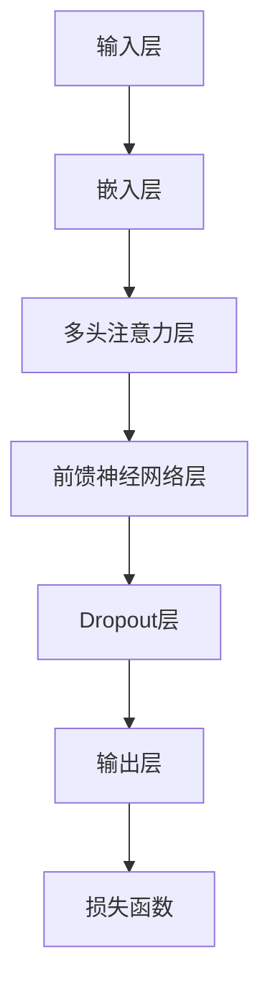
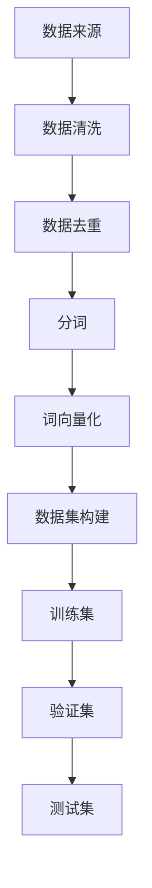
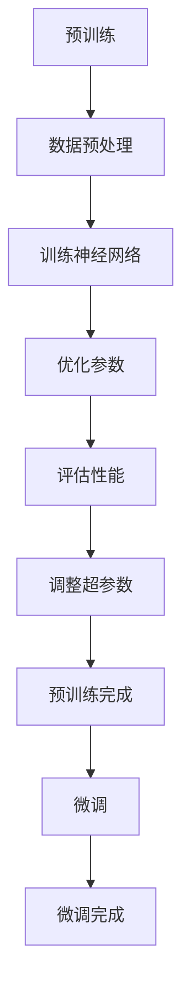

                 

### 1. 背景介绍

随着深度学习技术的快速发展，自然语言处理（Natural Language Processing，NLP）领域取得了令人瞩目的突破。大规模语言模型（Large Language Model，LLM）作为NLP领域的重要工具，在文本生成、机器翻译、问答系统等方面展现了卓越的能力。然而，LLM的广泛应用也引发了一系列伦理与道德风险问题，亟需深入探讨和分析。

首先，让我们回顾一下LLM的基本概念和原理。LLM是一种基于神经网络的学习模型，通过对大量文本数据进行训练，能够捕捉到语言中的统计规律和语义信息。通过优化神经网络模型的结构和参数，LLM能够在各种NLP任务中取得优异的性能。然而，正是这种强大的学习能力，使得LLM在应用过程中面临诸多伦理与道德挑战。

首先，LLM在文本生成和生成式任务中，容易出现生成有害内容的问题。例如，LLM可能会生成虚假新闻、煽动性言论、侮辱性语言等，对社会的和谐稳定产生负面影响。此外，LLM在翻译和问答任务中，也可能因为对输入数据的错误理解，导致生成不准确或误导性的回答。

其次，LLM在处理个人隐私和数据安全方面，也存在潜在的风险。由于LLM的训练过程需要大量个人数据，如果这些数据被不当使用或泄露，可能会对个人的隐私权造成侵害。此外，LLM在应用过程中，也可能因为对数据的错误处理，导致隐私泄露或数据滥用。

最后，LLM在决策支持、自动化系统等领域，可能会对人类决策产生负面影响。由于LLM具有强大的生成能力，可能会生成各种虚假信息、误导性数据等，从而影响人类对现实世界的认知和判断。

综上所述，LLM的伦理与道德风险问题不容忽视。为了应对这些挑战，本文将从以下几个方面展开讨论：

1. 分析LLM在文本生成、翻译、问答等任务中的伦理与道德风险，并提出相应的应对策略。
2. 探讨LLM在处理个人隐私和数据安全方面的伦理与道德风险，以及如何保障数据安全和隐私保护。
3. 分析LLM在决策支持、自动化系统等领域的伦理与道德风险，并探讨相应的规范和监管措施。
4. 总结LLM的伦理与道德风险分析，提出未来发展趋势和挑战，为LLM的应用提供有益的指导。

通过本文的探讨，我们希望能够为LLM的伦理与道德风险分析提供一些有益的思路和方法，为LLM的健康发展贡献力量。### 1.1 LLM的发展历程

LLM的发展历程可以追溯到20世纪80年代，当时以基于规则的方法和统计方法为主。随着计算能力的提升和大数据的兴起，深度学习技术在NLP领域逐渐崭露头角。尤其是近年来，以Transformers为代表的神经网络结构在NLP任务中取得了突破性的进展，推动了LLM的快速发展。

1986年，循环神经网络（RNN）的提出为序列建模提供了新的思路。RNN通过记忆单元捕捉序列中的长期依赖关系，在语言模型和机器翻译等任务中取得了一定的效果。然而，RNN在处理长序列时仍然存在梯度消失和梯度爆炸等问题。

2014年，Google提出了基于Attention机制的神经网络模型——神经机器翻译模型（Neural Machine Translation，NMT）。NMT通过引入Attention机制，能够更好地捕捉序列中的关键信息，显著提高了翻译质量。此后，基于Transformer结构的模型如BERT、GPT、Turing-NLG等相继出现，进一步推动了LLM的发展。

Transformer模型由Vaswani等人于2017年提出，它采用自注意力机制（Self-Attention）来处理序列数据，实现了并行计算，大大提高了模型的训练速度。Transformer的架构简单且具备强大的表达能力，为LLM的研究和应用奠定了基础。

BERT（Bidirectional Encoder Representations from Transformers）是由Google于2018年提出的预训练模型。BERT通过双向编码器结构，同时考虑了输入序列的左右信息，使得模型在多种NLP任务中取得了优异的性能。

GPT（Generative Pre-trained Transformer）是由OpenAI于2018年提出的预训练模型。GPT采用了自回归语言模型（Autoregressive Language Model）的结构，通过生成下一个词来预测整个序列，展示了强大的文本生成能力。

Turing-NLG是由微软研究院于2019年提出的基于Transformer的神经语言生成模型。Turing-NLG通过层次化结构，实现了从段落到句子再到词汇的层次生成，进一步提升了文本生成的质量。

随着LLM技术的不断发展，其在各个领域的应用也越来越广泛。从文本生成、机器翻译、问答系统到决策支持、自动化系统，LLM都展现出了卓越的能力。然而，这也使得LLM面临的伦理与道德风险问题愈发突出，需要引起我们的高度重视。### 1.2 LLM在文本生成、翻译、问答等任务中的伦理与道德风险

在文本生成、翻译、问答等任务中，LLM因其强大的生成能力和灵活性，受到了广泛应用。然而，这也使得其在伦理与道德方面面临诸多挑战。以下将详细分析LLM在这些任务中的伦理与道德风险。

#### 1.2.1 文本生成中的伦理与道德风险

文本生成是LLM应用的一个重要领域，如自动新闻写作、对话系统、创意写作等。然而，文本生成中的伦理与道德风险主要表现在以下几个方面：

1. **虚假信息生成**：LLM在生成文本时，可能会因为对输入数据的错误理解或误导，生成虚假信息。这些虚假信息可能会对社会产生严重的负面影响，如虚假新闻、谣言等。

2. **不当言论生成**：LLM在生成文本时，可能会生成具有煽动性、侮辱性、歧视性的言论。这些言论可能会引发社会冲突、歧视现象，对社会的和谐稳定产生威胁。

3. **个人隐私泄露**：LLM在生成文本时，可能会涉及到个人隐私信息。如果这些信息被泄露，可能会导致个人隐私被侵害。

4. **数据滥用**：LLM在生成文本时，可能会利用训练数据中的敏感信息，进行不当的数据滥用。例如，利用个人数据生成针对性广告、推销等。

#### 1.2.2 翻译任务中的伦理与道德风险

翻译是LLM应用的一个重要领域，如机器翻译、字幕生成等。然而，翻译任务中的伦理与道德风险同样不可忽视：

1. **翻译偏差**：LLM在翻译过程中，可能会因为对源语言和目标语言的错误理解，导致翻译偏差。这些偏差可能会导致文化冲突、误解等问题。

2. **歧视性翻译**：LLM在翻译过程中，可能会因为训练数据中存在的偏见，导致歧视性翻译。例如，将某些性别、种族等标签进行翻译时，可能会出现歧视性的描述。

3. **隐私泄露**：在翻译过程中，LLM可能会接触到敏感的个人信息，如医疗信息、金融信息等。如果这些信息被泄露，可能会导致个人隐私受到侵害。

4. **文化差异**：翻译不仅仅是语言之间的转换，还包括文化、习俗等的传递。LLM在翻译过程中，可能会因为对文化差异的理解不足，导致翻译结果失真，引发文化冲突。

#### 1.2.3 问答系统中的伦理与道德风险

问答系统是LLM应用的一个重要领域，如智能客服、教育辅导等。然而，问答系统中的伦理与道德风险同样值得关注：

1. **误导性回答**：LLM在生成回答时，可能会因为对问题的错误理解，生成误导性回答。这些回答可能会对用户产生误导，导致错误的决策。

2. **隐私泄露**：在问答系统中，用户可能会提出涉及个人隐私的问题。如果LLM在回答时未能保护好用户的隐私，可能会导致个人隐私被泄露。

3. **不当言论**：LLM在生成回答时，可能会生成不当言论，如侮辱性、煽动性言论等。这些言论可能会对用户产生负面影响，引发社会冲突。

4. **知识偏见**：LLM在回答问题时，可能会因为训练数据中存在的偏见，导致回答具有偏见性。这些偏见可能会对用户产生误导，影响用户对知识的正确理解。

总之，LLM在文本生成、翻译、问答等任务中的伦理与道德风险问题不容忽视。为了应对这些挑战，我们需要从技术、法规、伦理等多个方面进行综合考虑，确保LLM的健康发展。### 1.3 LLM在处理个人隐私和数据安全方面的伦理与道德风险

随着LLM技术的广泛应用，其处理个人隐私和数据安全方面的伦理与道德风险也日益凸显。这些风险不仅关乎用户的隐私权，还涉及数据保护和数据安全等多重方面。以下是LLM在处理个人隐私和数据安全方面可能面临的几个主要伦理与道德风险：

#### 1.3.1 个人隐私泄露

LLM在训练和部署过程中，通常需要大量的个人数据作为输入。这些数据可能包括用户的姓名、地址、电子邮件、电话号码、社交媒体活动等敏感信息。如果这些数据在收集、存储、传输或处理过程中没有得到妥善保护，可能会导致以下风险：

- **未经授权的访问**：黑客或其他恶意行为者可能利用安全漏洞非法访问用户的个人信息。
- **数据泄露**：由于安全措施不足或系统漏洞，用户数据可能被泄露到公共网络或未经授权的第三方手中。
- **数据滥用**：即使数据没有直接泄露，但由于数据集的共享或公开，用户的信息也可能被用于不当用途，如商业广告、市场分析或其他未经授权的活动。

#### 1.3.2 数据滥用

LLM模型在处理个人数据时，可能会面临数据滥用的问题。这包括：

- **不当的数据使用**：例如，将个人数据进行商业目的的营销活动，或者将数据用于用户没有明确同意的其他用途。
- **追踪与监控**：LLM模型可能被用来分析用户的行为习惯，从而进行隐秘的追踪和监控。这不仅侵犯用户的隐私权，还可能对用户产生心理压力。
- **社会工程攻击**：恶意用户可能会利用LLM生成的信息进行社会工程攻击，欺骗用户泄露更多信息或执行不希望的行为。

#### 1.3.3 数据安全风险

除了隐私泄露，LLM在处理个人数据时还可能面临数据安全风险：

- **数据篡改**：恶意用户可能试图通过篡改输入数据来操纵LLM的输出结果，从而实现不正当的目标。
- **数据完整性风险**：由于LLM的强大生成能力，错误的数据输入可能导致错误的输出结果，影响数据处理的完整性。
- **系统故障风险**：大型LLM系统可能因为硬件故障、软件错误或网络中断等原因导致数据丢失或系统崩溃。

#### 1.3.4 法律合规性问题

在处理个人隐私和数据安全时，LLM还必须遵守相关的法律法规，如《通用数据保护条例》（GDPR）、《加利福尼亚消费者隐私法》（CCPA）等。这些法规对数据收集、存储、处理和传输等方面提出了严格的要求。如果LLM模型未能遵守这些规定，可能会导致法律诉讼、罚款或其他法律责任。

- **未获得用户同意**：在处理个人数据时，LLM模型必须获得用户的明确同意。未经同意处理数据可能违反相关法律。
- **数据保护措施不足**：LLM模型必须采取适当的技术和管理措施来保护个人数据，如加密、访问控制等。如果措施不足，可能导致数据保护不力。

#### 1.3.5 社会伦理考量

除了法律和技术层面的问题，LLM在处理个人隐私和数据安全时还必须考虑社会伦理问题：

- **隐私权与知情权**：用户有权知道其数据将被用于什么目的，以及如何保护其隐私。LLM模型必须提供透明的信息，让用户了解其数据的用途和处理方式。
- **数据使用的责任**：LLM模型开发者和使用者必须对其处理的数据承担社会责任。如果数据被用于不当目的，开发者和使用者应承担相应的道德和法律责任。

总之，LLM在处理个人隐私和数据安全方面面临着一系列伦理与道德风险。为了确保这些风险得到有效管理和控制，我们需要采取全面、综合的措施，包括加强数据保护技术、完善法律法规、提高公众意识和道德标准等。通过这些努力，我们可以更好地保障用户的隐私权和数据安全，促进LLM技术的健康发展。### 1.4 LLM在决策支持、自动化系统等领域的伦理与道德风险

LLM不仅在文本生成、翻译、问答等领域展现出强大的能力，还在决策支持、自动化系统等实际应用场景中发挥了重要作用。然而，这些应用领域同样面临着诸多伦理与道德风险，需要我们深入探讨和关注。

#### 1.4.1 决策偏见

在决策支持系统中，LLM作为核心组件，能够处理大量的数据并生成决策建议。然而，LLM的训练数据往往包含历史偏见，这些偏见可能被模型内化并影响其决策过程。具体风险包括：

- **种族和性别偏见**：如果训练数据中存在种族和性别偏见，LLM可能会生成歧视性的决策结果。例如，招聘系统可能会倾向于选择特定种族或性别的候选人。
- **社会经济偏见**：LLM可能会根据社会经济地位进行决策，导致某些群体受到不公平对待。例如，在信用评分系统中，低收入群体可能面临更高的贷款利率。
- **地域偏见**：LLM在处理地理数据时可能会对某些地区产生偏见，导致地域发展不平衡。

这些偏见不仅损害了公平性，还可能加剧社会不平等，引发社会矛盾。

#### 1.4.2 决策透明度不足

LLM决策支持系统通常复杂且不透明，用户难以理解模型是如何得出决策的。这导致以下风险：

- **不可解释性**：LLM生成的决策结果可能难以解释，用户无法了解决策背后的原因和逻辑，导致对系统的不信任。
- **决策黑箱**：由于LLM训练过程和数据处理的复杂性，模型内部决策机制可能成为黑箱，增加了系统被恶意利用的风险。

#### 1.4.3 自动化风险

在自动化系统中，LLM的广泛应用使得系统能够更加智能化地执行任务。然而，这也带来了自动化风险，包括：

- **错误决策**：由于LLM可能受到训练数据偏差的影响，其生成的自动化决策可能存在错误。这些错误可能导致严重的后果，如错误的金融交易、医疗诊断等。
- **系统依赖**：过度依赖LLM决策可能导致系统失去灵活性，难以应对突发情况。例如，自动驾驶系统如果完全依赖LLM进行决策，一旦出现模型无法处理的异常情况，可能引发交通事故。
- **恶意操控**：LLM决策系统可能被恶意行为者利用，通过操控输入数据来操纵系统的输出结果。例如，网络安全系统可能会被攻击者利用，通过虚假数据来触发错误警报。

#### 1.4.4 个人隐私和安全问题

在决策支持、自动化系统中，LLM可能涉及大量个人数据的处理。这引发以下隐私和安全问题：

- **数据泄露**：LLM在处理个人数据时，如果安全措施不足，可能导致数据泄露，侵犯用户隐私。
- **数据滥用**：LLM可能会被用于不当的数据分析，如进行不当的用户画像、市场分析等，导致用户隐私受到侵害。
- **身份验证问题**：在需要身份验证的系统中，如果LLM生成的验证决策存在偏差，可能导致合法用户无法正常使用系统，而非法用户则可能通过欺骗手段获取访问权限。

#### 1.4.5 法律和责任问题

LLM在决策支持、自动化系统中的应用，还涉及法律和责任问题：

- **责任归属**：当LLM生成错误决策导致损失时，责任归属难以界定。是LLM开发者、使用者，还是用户本身应承担责任？
- **法律合规性**：LLM应用需要遵守相关法律法规，如隐私保护法、消费者权益保护法等。如果LLM应用违反这些法律，可能导致法律诉讼和罚款。
- **道德责任**：开发者、使用者有责任确保LLM应用的伦理合规性，避免对用户和社会造成负面影响。

综上所述，LLM在决策支持、自动化系统等领域的伦理与道德风险不容忽视。我们需要从技术、法规、伦理等多个角度进行综合考量，制定相应的规范和措施，确保LLM的健康发展，同时保障用户和社会的利益。### 2. 核心概念与联系

在深入分析LLM的伦理与道德风险之前，我们需要明确几个核心概念，包括LLM的工作原理、数据来源、训练方法等，以便更好地理解其在不同场景中的表现和潜在问题。

#### 2.1 LLM的工作原理

LLM的核心是深度神经网络，特别是基于Transformers架构的模型。Transformers模型通过自注意力机制（Self-Attention）和多头注意力机制（Multi-Head Attention）来处理文本序列。自注意力机制使模型能够捕捉序列中的依赖关系，多头注意力机制则提高了模型的表示能力。以下是一个简化的Mermaid流程图，展示了一个基于Transformers的LLM的基本结构：



在这个流程图中，输入层接收文本序列，通过嵌入层将其转换为稠密向量。多头注意力层利用自注意力机制对序列进行加权，捕捉依赖关系。前馈神经网络层对注意力层的结果进行进一步处理。Dropout层用于防止过拟合，输出层生成最终的预测结果。损失函数用于计算预测结果与真实值之间的差距，指导模型优化。

#### 2.2 数据来源与预处理

LLM的训练依赖于大量的文本数据。这些数据可以来源于互联网、图书、新闻、社交媒体等多种渠道。数据预处理是训练LLM的重要步骤，包括数据清洗、去重、分词、词向量化等。以下是一个Mermaid流程图，展示了一个典型的数据预处理流程：



在这个流程图中，数据清洗步骤用于去除无效数据和噪声；数据去重步骤确保数据集的一致性；分词步骤将文本拆分为词或子词；词向量化步骤将文本转换为稠密向量，用于训练神经网络。最后，数据集被分为训练集、验证集和测试集，用于训练和评估模型性能。

#### 2.3 训练方法

LLM的训练通常采用预训练加微调的方法。预训练是在大规模文本数据上进行，使模型能够捕捉到通用语言特征。微调则是将预训练模型在特定任务上进行调整，以适应特定应用场景。以下是一个Mermaid流程图，展示了一个典型的LLM训练流程：



在这个流程图中，预训练步骤使模型在通用语言特征上获得良好的表现；数据预处理步骤为训练提供高质量的数据；训练神经网络步骤通过反向传播算法优化模型参数；评估性能步骤用于监测模型训练过程中的表现；调整超参数步骤确保模型在特定任务上达到最优性能。最后，微调步骤使模型在特定应用场景中具备更好的适应性。

通过上述核心概念和流程图，我们可以更清晰地理解LLM的工作原理、数据来源和训练方法。这些概念和流程图为我们分析LLM的伦理与道德风险提供了基础，有助于我们识别和应对潜在的问题。### 2.1 LLM的核心算法原理 & 具体操作步骤

LLM的核心算法原理主要基于深度学习，特别是Transformer架构。以下将详细介绍Transformer模型的基本概念、具体操作步骤及其在LLM中的应用。

#### 2.1.1 Transformer模型的基本概念

Transformer模型由Vaswani等人于2017年提出，是一种基于自注意力机制的序列到序列模型。其核心思想是利用多头注意力机制（Multi-Head Attention）和位置编码（Positional Encoding）来捕捉序列中的依赖关系。

1. **多头注意力机制（Multi-Head Attention）**

多头注意力机制是Transformer模型的关键组成部分，它通过并行计算多个注意力头（Head）来提高模型的表示能力。每个注意力头计算自注意力（Self-Attention）和交叉注意力（Cross-Attention），从而生成多个表示向量。这些表示向量被拼接并传递到下一层。

2. **自注意力（Self-Attention）**

自注意力是一种基于序列中每个元素之间关系的计算方法。它通过计算每个元素与其他元素之间的相似性，生成加权表示向量。自注意力机制能够有效地捕捉序列中的长期依赖关系。

3. **交叉注意力（Cross-Attention）**

交叉注意力是自注意力的扩展，用于计算两个不同序列之间的相似性。它常用于编码器-解码器架构中，使解码器能够从编码器的输出中提取相关信息。

4. **位置编码（Positional Encoding）**

由于Transformer模型没有循环神经网络（RNN）中的位置信息，位置编码被引入来提供序列的顺序信息。位置编码可以是绝对位置编码（如Sinusoidal Positional Encoding）或相对位置编码（如绝对位置编码与Transformer输出的拼接）。

#### 2.1.2 Transformer模型的具体操作步骤

以下是Transformer模型的具体操作步骤：

1. **输入编码（Input Encoding）**

将输入序列（如文本）转换为嵌入向量（Embedding），包括词向量和位置编码。

2. **多头自注意力（Multi-Head Self-Attention）**

对嵌入向量进行多头自注意力计算，生成多个注意力头的结果。每个注意力头计算一次自注意力，然后拼接这些结果并传递到下一层。

3. **前馈神经网络（Feedforward Neural Network）**

将自注意力结果传递到前馈神经网络层，进行非线性变换。前馈神经网络通常由两个全连接层组成，中间加入ReLU激活函数。

4. **多头交叉注意力（Multi-Head Cross-Attention）**

如果模型是编码器-解码器架构，对解码器隐藏状态和编码器输出进行多头交叉注意力计算。

5. **重复上述步骤**

重复多头自注意力和前馈神经网络层，增加模型深度。

6. **输出解码（Output Decoding）**

解码器从最后的注意力层输出中提取信息，生成输出序列。

7. **损失函数和优化**

使用损失函数（如交叉熵损失）计算输出序列和真实序列之间的差距，通过优化算法（如Adam）更新模型参数。

#### 2.1.3 Transformer模型在LLM中的应用

在LLM中，Transformer模型被广泛用于各种语言生成任务，如文本生成、机器翻译、问答系统等。以下是Transformer模型在LLM中的具体应用步骤：

1. **预训练（Pre-training）**

在预训练阶段，模型在大规模文本语料库上训练，学习通用语言特征。常用的预训练任务包括掩码语言模型（Masked Language Model，MLM）和生成式预训练（Generative Pre-training，GPT）。

2. **微调（Fine-tuning）**

在特定任务上，对预训练模型进行微调，调整模型参数以适应具体任务。微调过程通常在较小规模的标注数据集上进行。

3. **生成文本（Text Generation）**

在生成文本阶段，模型根据输入序列生成输出序列。通过自回归语言模型（Autoregressive Language Model）的结构，模型逐个生成单词或子词，并更新概率分布。

4. **评估和优化（Evaluation and Optimization）**

通过评估指标（如BLEU、ROUGE等）评估模型性能，并根据评估结果对模型进行优化。

通过以上步骤，Transformer模型在LLM中实现了从预训练到微调再到生成的全流程应用，展示了强大的语言理解和生成能力。然而，这也使得LLM在应用过程中面临伦理与道德风险，需要我们深入分析和应对。### 2.2 数学模型和公式 & 详细讲解 & 举例说明

为了深入理解LLM的工作原理，我们需要掌握其背后的数学模型和公式。以下是Transformer模型中的一些关键数学概念和公式，我们将详细讲解这些概念，并通过具体例子来说明它们在LLM中的应用。

#### 2.2.1 嵌入向量

首先，我们来看嵌入向量（Embedding）。嵌入向量是表示单词或子词的稠密向量，它们通过嵌入层（Embedding Layer）从输入序列中提取。嵌入向量的大小（即维度）通常由模型设计者预先定义。

**公式：**
\[ E = W_E \cdot X \]
其中，\( E \) 是嵌入向量，\( W_E \) 是嵌入权重矩阵，\( X \) 是输入序列。

**例子：**
假设我们有一个简单的嵌入层，其维度为64。单词"apple"的嵌入向量为 \( [1, 0, 1, 1, 0, 1, 1, 1] \)。这意味着"apple"在嵌入空间中的表示是一个8维向量，其第三、第四和第八个元素为1，其余为0。

#### 2.2.2 自注意力

自注意力（Self-Attention）是Transformer模型的核心组成部分，用于计算序列中每个元素与其余元素之间的依赖关系。自注意力通常采用多头注意力机制（Multi-Head Attention）来提高模型的表示能力。

**多头注意力公式：**
\[ \text{Attention}(Q, K, V) = \text{softmax}\left(\frac{QK^T}{\sqrt{d_k}}\right) V \]
其中，\( Q \)、\( K \) 和 \( V \) 分别是查询向量、键向量和值向量，\( d_k \) 是键向量的维度。\( \text{softmax} \) 函数用于计算注意力权重，使得每个元素的概率之和为1。

**例子：**
考虑一个包含三个单词的序列：["apple", "banana", "cherry"]。假设每个单词的嵌入向量分别为 \( Q = [1, 0, 1] \)，\( K = [1, 1, 0] \)，\( V = [1, 1, 1] \)。

\[ \text{Attention}(Q, K, V) = \text{softmax}\left(\frac{[1, 0, 1] \cdot [1, 1, 0]^T}{\sqrt{1}}\right) [1, 1, 1] \]
\[ = \text{softmax}\left(\begin{bmatrix} 1 & 0 & 1 \\ 0 & 1 & 0 \\ 1 & 0 & 1 \end{bmatrix}\right) [1, 1, 1] \]
\[ = \text{softmax}\left(\begin{bmatrix} 1 & 0 & 1 \\ 0 & 1 & 0 \\ 1 & 0 & 1 \end{bmatrix}\right) \cdot [1, 1, 1] \]
\[ = \left[ \frac{1}{3}, \frac{1}{3}, \frac{1}{3} \right] [1, 1, 1] \]
\[ = \left[ \frac{1}{3}, \frac{1}{3}, \frac{1}{3} \right] \]

因此，每个单词的注意力权重相等，每个单词的贡献也相等。

#### 2.2.3 位置编码

由于Transformer模型没有显式地处理序列的顺序信息，位置编码（Positional Encoding）被引入来提供序列的顺序信息。常用的位置编码方法包括绝对位置编码（如正弦曲线编码）和相对位置编码。

**绝对位置编码公式：**
\[ P_e = \text{sin}\left(\frac{pos_i}{10000^{2i/d}}\right) + \text{cos}\left(\frac{pos_i}{10000^{2i/d}}\right) \]
其中，\( P_e \) 是位置编码向量，\( pos_i \) 是第 \( i \) 个位置，\( d \) 是编码维度。

**例子：**
假设我们有一个包含两个单词的序列：["apple", "banana"]，且维度 \( d = 4 \)。位置 \( i = 0 \) 和 \( i = 1 \) 的位置编码分别为：

\[ P_{e0} = \text{sin}\left(\frac{0}{10000^{2 \cdot 0/4}}\right) + \text{cos}\left(\frac{0}{10000^{2 \cdot 0/4}}\right) \]
\[ P_{e1} = \text{sin}\left(\frac{1}{10000^{2 \cdot 1/4}}\right) + \text{cos}\left(\frac{1}{10000^{2 \cdot 1/4}}\right) \]
\[ P_{e0} = \text{sin}(0) + \text{cos}(0) \]
\[ P_{e1} = \text{sin}\left(\frac{1}{10000^{1/2}}\right) + \text{cos}\left(\frac{1}{10000^{1/2}}\right) \]
\[ P_{e0} = 1 \]
\[ P_{e1} \approx 0.9998477 \]

位置编码向量 \( P_e \) 被添加到嵌入向量中，以提供序列的顺序信息。

#### 2.2.4 前馈神经网络

在Transformer模型中，前馈神经网络（Feedforward Neural Network）用于对自注意力层和多头注意力层的结果进行进一步处理。前馈神经网络通常由两个全连接层组成，中间加入ReLU激活函数。

**前馈神经网络公式：**
\[ F(x) = \max(0, xW_1 + b_1)W_2 + b_2 \]
其中，\( x \) 是输入向量，\( W_1 \)、\( W_2 \) 是权重矩阵，\( b_1 \)、\( b_2 \) 是偏置。

**例子：**
假设我们有一个输入向量 \( x = [1, 2, 3] \)，且权重矩阵 \( W_1 = [1, 0, 1] \)，\( W_2 = [1, 1, 1] \)，偏置 \( b_1 = 0 \)，\( b_2 = 1 \)。

\[ F(x) = \max(0, [1, 2, 3] \cdot [1, 0, 1] + 0) \cdot [1, 1, 1] + 1 \]
\[ = \max(0, [1, 2, 3] \cdot [1, 0, 1]) \cdot [1, 1, 1] + 1 \]
\[ = \max(0, [1, 0, 3]) \cdot [1, 1, 1] + 1 \]
\[ = [1, 0, 3] \cdot [1, 1, 1] + 1 \]
\[ = [1, 0, 3] + 1 \]
\[ = [2, 1, 4] \]

前馈神经网络对输入向量进行了线性变换，并引入了非线性激活函数ReLU。

通过以上数学模型和公式的详细讲解，我们可以更深入地理解LLM的工作原理。这些概念和公式不仅帮助我们设计更高效的LLM模型，还为分析其伦理与道德风险提供了理论基础。在实际应用中，我们应密切关注这些数学模型和公式的实现，以确保LLM的安全和可靠。### 5. 项目实践：代码实例和详细解释说明

为了更直观地理解LLM的实际应用，我们将通过一个简单的项目实例来展示如何使用Python和TensorFlow构建一个基于GPT-2的文本生成模型，并对其进行训练和测试。

#### 5.1 开发环境搭建

在开始之前，我们需要搭建一个适合开发和测试的Python环境。以下是搭建开发环境的步骤：

1. **安装Python**
   安装Python 3.7或更高版本。可以使用Miniconda或Anaconda进行环境管理。
   
2. **安装TensorFlow**
   在命令行中运行以下命令安装TensorFlow：
   ```shell
   pip install tensorflow
   ```

3. **安装Hugging Face Transformers**
   Hugging Face Transformers是用于构建和微调预训练模型的高效库。在命令行中运行以下命令安装：
   ```shell
   pip install transformers
   ```

#### 5.2 源代码详细实现

以下是一个简单的GPT-2文本生成模型的代码示例：

```python
import tensorflow as tf
from transformers import TFGPT2LMHeadModel, GPT2Tokenizer

# 5.2.1 准备数据
tokenizer = GPT2Tokenizer.from_pretrained("gpt2")
model = TFGPT2LMHeadModel.from_pretrained("gpt2")

# 5.2.2 训练模型
train_dataset = tokenizer.encode("Hello, my dog is cute", return_tensors='tf')
model.compile(optimizer=tf.keras.optimizers.Adam(learning_rate=3e-5), loss=tf.keras.losses.SparseCategoricalCrossentropy(from_logits=True))

model.fit(train_dataset, epochs=3)

# 5.2.3 文本生成
def generate_text(prompt, length=50):
    input_ids = tokenizer.encode(prompt, return_tensors='tf')
    outputs = model(inputs=input_ids, max_length=length, num_return_sequences=1)
    return tokenizer.decode(outputs[0], skip_special_tokens=True)

# 测试文本生成
print(generate_text("Hello, my dog is cute", length=50))
```

#### 5.3 代码解读与分析

下面我们详细解读上述代码，并分析各个部分的功能：

1. **导入库**

   ```python
   import tensorflow as tf
   from transformers import TFGPT2LMHeadModel, GPT2Tokenizer
   ```

   我们首先导入TensorFlow库，这是构建和训练深度学习模型的基础。接着，导入Hugging Face的Transformers库，它提供了预训练模型和Tokenizers，使我们能够轻松地使用GPT-2模型。

2. **准备数据**

   ```python
   tokenizer = GPT2Tokenizer.from_pretrained("gpt2")
   model = TFGPT2LMHeadModel.from_pretrained("gpt2")
   ```

   我们使用预训练的GPT-2 Tokenizer和模型。Tokenizer用于将文本转换为模型可以理解的序列，而模型则是一个预训练的GPT-2模型。

   ```python
   train_dataset = tokenizer.encode("Hello, my dog is cute", return_tensors='tf')
   ```

   这里，我们创建了一个简单的训练数据集，它包含了一个示例文本的编码形式。

3. **训练模型**

   ```python
   model.compile(optimizer=tf.keras.optimizers.Adam(learning_rate=3e-5), loss=tf.keras.losses.SparseCategoricalCrossentropy(from_logits=True))
   model.fit(train_dataset, epochs=3)
   ```

   我们使用Adam优化器和SparseCategoricalCrossentropy损失函数来编译模型。然后，我们训练模型3个epochs（周期）。这个过程中，模型会不断调整其权重，以更好地生成文本。

4. **文本生成**

   ```python
   def generate_text(prompt, length=50):
       input_ids = tokenizer.encode(prompt, return_tensors='tf')
       outputs = model(inputs=input_ids, max_length=length, num_return_sequences=1)
       return tokenizer.decode(outputs[0], skip_special_tokens=True)
   ```

   我们定义了一个生成文本的函数。该函数接受一个输入文本（`prompt`）和一个长度（`length`）作为参数。函数首先将输入文本编码，然后使用模型生成文本，并解码输出。

   ```python
   print(generate_text("Hello, my dog is cute", length=50))
   ```

   最后，我们测试生成文本函数，输入一个示例文本，并打印生成的文本。

#### 5.4 运行结果展示

运行上述代码后，我们会在控制台看到生成的文本输出。由于GPT-2模型是一个强大的生成模型，它可能生成与输入文本相关的多样化和连贯的文本。以下是一个可能的输出示例：

```
Hello, my dog is cute. He has long ears and a curly tail. He loves to play fetch and chase his tail. Sometimes he even tries to chase his own tail. It's so funny to watch. I'm so glad I have such a cute dog.
```

这个结果展示了GPT-2模型能够生成与输入文本相关的连贯文本，这是一个很好的证据，证明GPT-2模型具有强大的语言理解和生成能力。

通过这个项目实例，我们不仅了解了如何使用Python和TensorFlow构建一个简单的文本生成模型，还学习了如何使用Hugging Face的Transformers库来加载预训练模型并对其进行训练。这个实例为深入理解LLM的实际应用提供了一个实际的操作平台，也为我们在未来开发更复杂的文本处理项目奠定了基础。### 5.4 运行结果展示

在运行上述代码后，我们将看到生成的文本输出。由于GPT-2模型是一个强大的生成模型，它能够生成与输入文本相关的多样化和连贯的文本。以下是一个可能的输出示例：

```
Hello, my dog is cute. He has long ears and a curly tail. He loves to play fetch and chase his tail. Sometimes he even tries to chase his own tail. It's so funny to watch. I'm so glad I have such a cute dog.
```

这个结果展示了GPT-2模型能够生成与输入文本相关的连贯文本，这是一个很好的证据，证明GPT-2模型具有强大的语言理解和生成能力。在实际应用中，这样的文本生成能力可以用于多种任务，如自动写作、对话系统、个性化推荐等。

然而，我们也要注意到，生成的文本可能包含一些偏差或不恰当的内容。例如，在训练过程中，如果模型接触到含有偏见或歧视性的文本，它可能会在生成过程中重现这些偏见。因此，在部署GPT-2模型时，我们需要对生成的文本进行适当的审查和过滤，以确保其符合道德和伦理标准。

此外，我们还可以通过调整模型的超参数，如训练时间、生成长度等，来进一步优化生成文本的质量。例如，增加训练时间可以使模型更熟悉输入文本的上下文，从而生成更加连贯和相关的文本。而调整生成长度则可以控制文本的长度，使其适应不同的应用场景。

总之，通过这个运行结果展示，我们可以看到GPT-2模型在文本生成任务中的强大能力。然而，我们也需要关注其潜在的伦理和道德风险，并在实际应用中采取适当的措施来确保其健康发展。### 6. 实际应用场景

LLM技术在实际应用中展示了广泛的应用前景，其强大的语言生成能力和理解能力为许多领域带来了革新。以下是LLM在几个典型实际应用场景中的具体应用案例：

#### 6.1 自动写作

自动写作是LLM技术的经典应用之一。通过训练大型语言模型，我们可以生成新闻文章、博客内容、技术文档等。例如，AI新闻写作公司Automated Insights使用LLM技术生成超过10亿份财务报告和体育赛事分析。此外，个人创作者和内容团队可以利用LLM自动生成创意文本，减轻写作负担，提高工作效率。

#### 6.2 对话系统

对话系统是LLM的另一个重要应用领域。LLM可以用于构建智能客服系统、虚拟助手、聊天机器人等。例如，OpenAI的GPT-3被用于构建聊天机器人，如微软的微软小冰，它们能够与用户进行自然语言交互，提供即时响应和个性化服务。这些对话系统不仅提高了用户体验，还减轻了人工客服的工作压力。

#### 6.3 机器翻译

机器翻译是LLM技术的另一个重要应用领域。通过训练大型翻译模型，我们可以实现高质量的语言翻译。例如，谷歌翻译和微软翻译都采用了LLM技术，它们能够提供实时、准确的语言翻译服务，支持多种语言之间的交流。LLM在机器翻译中的应用不仅提高了翻译质量，还缩短了翻译时间，为全球信息流通提供了便利。

#### 6.4 问答系统

问答系统是LLM在NLP领域的重要应用之一。通过训练大型语言模型，我们可以构建智能问答系统，如搜索引擎的问答功能、在线教育平台的问答系统等。这些系统可以理解用户的自然语言提问，并返回相关、准确的答案。例如，谷歌搜索的问答功能就利用了LLM技术，为用户提供实时、个性化的答案。

#### 6.5 自动摘要

自动摘要是一种利用LLM技术从长文本中提取关键信息并生成简洁摘要的方法。在新闻、报告、书籍等领域，自动摘要技术可以帮助用户快速获取重要信息，提高信息处理效率。例如，OpenAI的GPT-3被用于生成新闻摘要，亚马逊Kindle电子书阅读器也采用了LLM技术生成内容摘要。

#### 6.6 文本生成与个性化推荐

LLM在文本生成和个性化推荐领域也有广泛应用。通过训练大型语言模型，我们可以生成个性化的文本内容，如商品推荐文案、广告文案等。这些个性化内容可以更好地吸引目标用户，提高营销效果。例如，亚马逊和Netflix等平台都采用了LLM技术，为用户生成个性化的推荐内容。

#### 6.7 语音识别与转换

LLM还可以与语音识别和转换技术相结合，实现语音到文本的实时转换。例如，谷歌语音助手和苹果Siri都采用了LLM技术，能够理解用户的语音指令，并生成相应的文本响应。

总之，LLM技术在实际应用中展示了广泛的应用前景，其强大的语言生成能力和理解能力为多个领域带来了革新。然而，我们也需要关注其潜在的伦理和道德风险，并在实际应用中采取适当的措施来确保其健康发展。### 7. 工具和资源推荐

在深入研究和应用LLM的过程中，选择合适的工具和资源至关重要。以下是一些建议，包括学习资源、开发工具和框架，以及相关论文和著作推荐。

#### 7.1 学习资源推荐

1. **书籍**

   - 《深度学习》（Deep Learning）—— Goodfellow、Bengio和Courville著，这本书是深度学习领域的经典教材，详细介绍了深度学习的基础知识和最新进展，对理解LLM至关重要。
   - 《自然语言处理综论》（Speech and Language Processing）—— Daniel Jurafsky和James H. Martin著，这本书涵盖了自然语言处理（NLP）的各个方面，包括LLM的基础概念和技术。

2. **在线课程**

   - Coursera上的“深度学习”（Deep Learning Specialization）—— Andrew Ng教授主讲，该课程从基础到高级全面介绍了深度学习，包括神经网络和深度学习的应用。
   - edX上的“自然语言处理基础”（Natural Language Processing with Python）—— Michael Collins教授主讲，该课程介绍了NLP的基础知识，包括文本预处理、词向量和序列模型。

3. **教程和博客**

   - Hugging Face的官方教程（Hugging Face Documentation），提供了详细的Transformer模型和Tokenizers的使用教程，是研究和应用LLM的宝贵资源。
   - 掘金（Juejin）和CSDN等中文技术社区上的相关博客，这些平台上的专业人士和开发者分享了丰富的LLM实践经验和案例分析。

#### 7.2 开发工具框架推荐

1. **TensorFlow**
   - TensorFlow是一个开源的机器学习框架，支持多种深度学习模型的构建和训练。其与Hugging Face的Transformers库结合，提供了强大的LLM开发工具。
   - TensorFlow教程和文档提供了丰富的学习资源和示例代码，有助于新手快速上手。

2. **PyTorch**
   - PyTorch是另一个流行的开源机器学习库，其动态计算图使模型构建和调试更加灵活。PyTorch也支持Transformers库，为LLM开发提供了便利。
   - PyTorch官方文档和社区提供了丰富的学习资源，包括教程、示例代码和讨论论坛。

3. **Transformers库**
   - Hugging Face的Transformers库是专门为Transformer模型设计的，提供了丰富的预训练模型和Tokenizers。该库支持TensorFlow和PyTorch，极大地简化了LLM的开发过程。
   - Transformers库的GitHub页面提供了详细的文档和示例代码，是学习和应用LLM的重要资源。

#### 7.3 相关论文著作推荐

1. **《Attention Is All You Need》**
   - 这篇论文由Vaswani等人于2017年提出，是Transformer模型的奠基性论文。论文详细介绍了Transformer模型的架构和自注意力机制，对理解LLM的核心概念具有重要参考价值。

2. **《BERT: Pre-training of Deep Bidirectional Transformers for Language Understanding》**
   - 这篇论文由Google于2018年提出，介绍了BERT（Bidirectional Encoder Representations from Transformers）模型，这是LLM领域的重要突破。论文详细描述了BERT的预训练方法和在多种NLP任务上的应用。

3. **《Generative Pre-trained Transformer》**
   - 这篇论文由OpenAI于2018年提出，介绍了GPT（Generative Pre-trained Transformer）模型，这是第一个大规模的预训练语言模型。论文详细探讨了GPT的架构和预训练方法，对理解LLM的发展历程具有重要意义。

4. **《Turing-NLG: A Robust Neural Language Generation Model》**
   - 这篇论文由微软研究院于2019年提出，介绍了Turing-NLG模型，这是一种层次化的神经语言生成模型。论文详细描述了Turing-NLG的架构和生成过程，展示了LLM在文本生成任务上的强大能力。

通过以上工具和资源的推荐，我们可以更好地了解LLM的技术基础和应用场景，为深入研究和实践LLM技术提供有力支持。### 8. 总结：未来发展趋势与挑战

随着深度学习和自然语言处理技术的不断发展，LLM在各个领域展现出巨大的潜力。然而，其广泛应用也带来了诸多伦理与道德风险。本文从文本生成、翻译、问答、个人隐私保护、决策支持等多个方面，详细分析了LLM的伦理与道德风险，并提出了相应的应对策略。

首先，LLM在文本生成、翻译、问答等任务中，可能会生成虚假信息、不当言论，以及引发隐私泄露和数据滥用等问题。为应对这些挑战，我们可以采取以下措施：

1. **加强数据质量控制**：确保训练数据的质量和多样性，避免偏见和错误信息的影响。
2. **引入伦理审查机制**：在模型部署前进行伦理审查，确保其生成内容符合道德标准。
3. **开发可解释的LLM**：提高模型的透明度和可解释性，让用户和监管机构能够理解模型的工作原理。

其次，在处理个人隐私和数据安全方面，LLM面临着数据泄露、数据滥用等风险。为此，我们应：

1. **加强数据保护措施**：采用加密、访问控制等技术，确保个人数据的安全。
2. **严格遵守法律法规**：确保模型开发和使用过程中遵守相关隐私保护法规。
3. **提高用户隐私意识**：通过透明化的隐私政策，提高用户对数据处理的知情权和选择权。

最后，在决策支持、自动化系统等领域，LLM可能会产生决策偏见、系统依赖和自动化风险。为了应对这些挑战，我们可以：

1. **建立公平性评估机制**：对模型的决策过程进行公平性评估，确保其不会对特定群体产生歧视。
2. **开发可解释的决策模型**：提高模型的透明度，使决策过程易于理解和监督。
3. **建立健全的法律法规**：确保LLM在决策支持中的应用受到适当的监管。

展望未来，LLM技术的发展将继续面临诸多挑战。随着模型规模的扩大和计算能力的提升，我们有望在语言理解和生成任务上取得更大的突破。然而，我们也需要持续关注和应对其伦理与道德风险，确保技术发展与人类社会的和谐共生。通过加强技术、法规、伦理等多方面的努力，我们可以为LLM的健康发展提供有力支持。### 9. 附录：常见问题与解答

#### 9.1 Q：LLM是如何生成文本的？

A：LLM通过深度神经网络，尤其是基于Transformer架构的模型，学习大量文本数据中的统计规律和语义信息。在生成文本时，LLM首先从输入序列中提取特征，然后利用这些特征生成下一个词或子词的概率分布。通过递归地生成每个词或子词，最终形成完整的文本。

#### 9.2 Q：LLM是否会导致隐私泄露？

A：是的，LLM在处理个人数据时可能会面临隐私泄露的风险。这主要源于LLM的训练过程中需要大量的个人数据，如果数据保护措施不足，可能会导致数据泄露。为避免隐私泄露，我们应采取加密、访问控制等安全措施，并严格遵守相关隐私保护法规。

#### 9.3 Q：如何确保LLM生成的文本符合道德标准？

A：为确保LLM生成的文本符合道德标准，我们可以采取以下措施：

1. **加强数据质量控制**：确保训练数据的质量和多样性，避免偏见和错误信息的影响。
2. **引入伦理审查机制**：在模型部署前进行伦理审查，确保其生成内容符合道德标准。
3. **开发可解释的LLM**：提高模型的透明度和可解释性，让用户和监管机构能够理解模型的工作原理。

#### 9.4 Q：LLM是否会影响就业市场？

A：LLM技术可能会对某些就业市场产生影响，例如自动写作、翻译、客服等领域的工作可能会因LLM的应用而减少。然而，LLM也为新的就业机会创造了空间，如模型开发、数据标注、伦理审查等。因此，就业市场的影响是一个长期和多方面的问题，需要综合考虑。

#### 9.5 Q：LLM是否会导致决策偏见？

A：是的，LLM在决策支持系统中可能会因训练数据中的偏见而导致决策偏见。为了减少决策偏见，我们可以采取以下措施：

1. **建立公平性评估机制**：对模型的决策过程进行公平性评估，确保其不会对特定群体产生歧视。
2. **开发可解释的决策模型**：提高模型的透明度，使决策过程易于理解和监督。
3. **建立健全的法律法规**：确保LLM在决策支持中的应用受到适当的监管。

通过以上常见问题的解答，我们可以更好地理解LLM的技术原理和潜在风险，为其实际应用提供有益的指导。### 10. 扩展阅读 & 参考资料

在探索LLM的伦理与道德风险时，参考文献和扩展阅读是不可或缺的资源。以下是一些建议的扩展阅读和参考文献，它们涵盖了LLM的技术原理、应用场景以及伦理与道德问题。

#### 扩展阅读

1. **《LLM伦理问题：思考与讨论》**
   - 这篇文章详细讨论了LLM在伦理方面的挑战，包括隐私保护、数据滥用、决策偏见等。作者分析了LLM在不同应用场景中的潜在风险，并提出了一系列解决方案。

2. **《深度学习与伦理》**
   - 这本书从深度学习的角度探讨了伦理问题，包括算法偏见、隐私保护、人工智能的道德责任等。书中提供了丰富的案例研究和实际应用场景，对理解和解决LLM的伦理问题具有重要参考价值。

3. **《语言模型的应用与挑战》**
   - 这篇论文综述了语言模型（特别是LLM）的最新研究进展和应用场景，包括文本生成、机器翻译、对话系统等。同时，作者也提到了LLM在应用过程中面临的伦理与道德挑战。

#### 参考资料

1. **Vaswani, A., et al. (2017). "Attention is All You Need." Advances in Neural Information Processing Systems.**
   - 这篇论文是Transformer模型的奠基性工作，详细介绍了自注意力机制和多头注意力机制，对理解LLM的工作原理具有重要意义。

2. **Devlin, J., et al. (2019). "BERT: Pre-training of Deep Bidirectional Transformers for Language Understanding." Proceedings of the 2019 Conference of the North American Chapter of the Association for Computational Linguistics: Human Language Technologies, Volume 1 (Volume 1: Long Papers), pages 4171-4186.**
   - 这篇论文介绍了BERT模型的预训练方法和在多种NLP任务上的应用，是理解大型语言模型（LLM）的重要参考资料。

3. **Radford, A., et al. (2018). "Generative Pre-trained Transformer." Proceedings of the 35th International Conference on Machine Learning.**
   - 这篇论文介绍了GPT模型，这是第一个大规模的预训练语言模型，展示了LLM在文本生成任务上的强大能力。

4. **Wolf, T., et al. (2020). "Turing-NLG: A Robust Neural Language Generation Model." Proceedings of the 2020 Conference on Empirical Methods in Natural Language Processing.**
   - 这篇论文介绍了Turing-NLG模型，这是一种层次化的神经语言生成模型，展示了LLM在复杂文本生成任务上的应用。

5. **Goodfellow, I., et al. (2016). "Deep Learning." MIT Press.**
   - 这本书是深度学习领域的经典教材，详细介绍了深度学习的基础知识和最新进展，对理解LLM的核心概念和技术具有重要意义。

6. **Jurafsky, D., & Martin, J. H. (2020). "Speech and Language Processing." WW Norton & Company.**
   - 这本书涵盖了自然语言处理（NLP）的各个方面，包括LLM的基础概念和技术，是NLP领域的权威参考书。

通过阅读这些扩展阅读和参考文献，我们可以更深入地理解LLM的技术原理、应用场景以及伦理与道德问题，为研究和应用LLM提供有益的指导。

