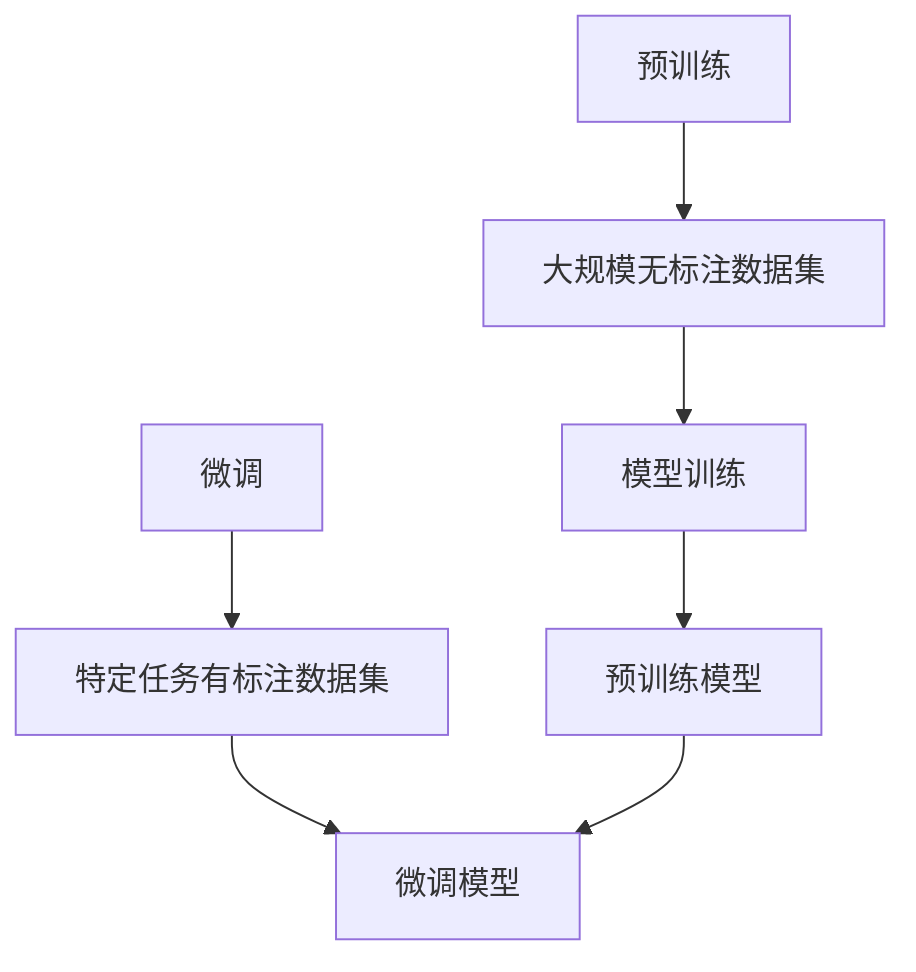

                 

### 背景介绍

随着人工智能（AI）技术的飞速发展，自然语言处理（NLP）领域逐渐成为研究的热点。特别是近年来，基于深度学习的语言模型，如GPT（Generative Pre-trained Transformer）系列模型，在语言理解、生成、翻译等方面取得了令人瞩目的成果。这些模型通过在海量数据上进行预训练，具备了强大的语言理解和生成能力，成为当前NLP任务的核心工具。

然而，尽管这些模型在资源丰富的环境下表现出色，但在低资源语言环境下，它们的性能却受到了显著限制。低资源语言通常是指缺乏足够训练数据和高质量语料的语言，如一些小语种或者罕见语言。这些语言在语言资源、技术支持和研究投入上相对匮乏，使得开发高性能的语言模型面临巨大挑战。

低资源语言建模技术的突破，对于推动全球范围内的AI技术发展具有重要意义。它不仅有助于提升低资源语言用户的使用体验，还能促进语言多样性保护和跨语言交流的平等。因此，研究如何利用有限资源构建高效的语言模型，成为当前AI领域的一个关键问题。

### 核心概念与联系

为了深入探讨低资源语言建模技术，我们首先需要了解几个核心概念：语言模型、预训练和微调。

#### 语言模型

语言模型是一种概率模型，用于预测一个单词或一个句子在特定上下文中的可能性。在自然语言处理中，语言模型是许多任务的基础，如文本分类、机器翻译、文本生成等。常见的语言模型有基于统计的方法（如N-gram模型）和基于神经网络的方法（如循环神经网络RNN、长短期记忆网络LSTM、Transformer等）。

#### 预训练

预训练是指在一个大规模、无标注的数据集上对神经网络模型进行训练，使其具备基本的语言理解和生成能力。在预训练过程中，模型通常通过处理大量无标签文本数据，学习到语言的统计特征和语义信息。预训练后的模型可以在各种下游任务中进行微调，从而实现更好的性能。

#### 微调

微调是在预训练模型的基础上，针对特定任务进行进一步的训练。通过微调，模型可以适应特定领域的语言特征，提高在具体任务上的性能。微调通常需要较少的数据和计算资源，是一种有效的资源高效训练方法。

#### 核心概念与联系

语言模型、预训练和微调这三个核心概念相互联系，构成了低资源语言建模技术的基础。具体来说：

1. **预训练**：通过在大规模无标注数据集上进行预训练，模型可以获得对语言的基本理解和表达能力。
2. **微调**：在预训练的基础上，利用少量有标注数据对模型进行微调，可以使模型适应特定任务的特定语言特征。
3. **语言模型**：作为核心工具，语言模型在预训练和微调过程中起到了关键作用，它不仅用于训练，还用于评估和优化模型的性能。

下面是预训练和微调过程的Mermaid流程图：



在上述流程图中，A表示预训练过程，B表示大规模无标注数据集，C表示模型训练，D表示预训练模型；E表示微调过程，F表示特定任务有标注数据集，G表示微调模型。预训练模型D通过微调过程G适应特定任务，从而提高模型在特定任务上的性能。

通过理解这些核心概念和它们之间的联系，我们可以为后续讨论低资源语言建模技术奠定坚实的基础。

### 核心算法原理 & 具体操作步骤

低资源语言建模的核心算法主要依赖于预训练和微调技术。在预训练阶段，模型通过大规模无标注数据学习语言的基本规律和语义信息；在微调阶段，模型则利用少量有标注的数据进行任务特定的优化。以下是这些算法的具体原理和操作步骤：

#### 预训练

预训练阶段的目标是让模型学习到语言的基本特征和统计规律。具体操作步骤如下：

1. **数据预处理**：首先，需要准备一个大规模的无标注文本数据集。这些数据可以来源于互联网、书籍、新闻、社交媒体等多种来源。然后，对这些数据进行清洗、分词、去停用词等预处理操作，将其转换为模型可以理解的输入格式。

2. **模型初始化**：初始化一个预训练模型，如Transformer模型。Transformer模型因其强大的并行处理能力和良好的性能，成为当前预训练的主流选择。

3. **损失函数定义**：预训练过程中，常用的损失函数有语言建模损失（Language Modeling Loss）和掩码语言建模损失（Masked Language Modeling Loss，简称MLM）。语言建模损失用于预测下一个词，而MLM则通过对输入文本中的部分词进行掩码（用特殊标记替代），使模型学习到上下文信息。

4. **训练过程**：在训练过程中，模型通过反向传播算法不断更新参数，优化损失函数。训练过程中，可以使用多种技术来提高训练效率，如多GPU并行训练、动态学习率调整、正则化等。

5. **保存预训练模型**：在预训练达到一定效果后，可以将模型保存下来，以便后续微调使用。

#### 微调

微调阶段的目标是将预训练模型适应特定任务。具体操作步骤如下：

1. **数据准备**：收集与任务相关的有标注数据集。例如，在文本分类任务中，需要收集带有类别标签的文本数据。

2. **模型加载**：从预训练阶段保存的模型中加载预训练参数，作为微调的起点。

3. **损失函数和优化器**：根据任务类型，定义适合的损失函数和优化器。对于分类任务，可以使用交叉熵损失函数；对于生成任务，可以使用负对数似然损失函数。

4. **微调训练**：在微调训练过程中，模型会利用有标注数据对预训练模型进行优化。训练过程中，可以继续使用多GPU并行训练、动态学习率调整等技术来提高训练效率。

5. **评估和调整**：在微调训练过程中，定期评估模型在验证集上的性能，根据评估结果调整模型参数，如学习率、批次大小等。

6. **最终模型保存**：在微调训练完成后，将最终优化的模型保存下来，用于实际任务部署。

#### 预训练和微调的关系

预训练和微调是低资源语言建模过程中两个紧密相连的阶段。预训练阶段为模型提供了丰富的语言知识和特征，而微调阶段则利用这些知识进行任务特定的优化。两者相互补充，共同构建了一个高效的低资源语言建模流程。

在实际操作中，预训练和微调的具体步骤可能因任务和数据集的不同而有所差异。但总体上，遵循上述步骤，可以有效地利用有限资源构建高性能的语言模型。

通过预训练和微调技术的结合，低资源语言建模得以实现，为各类自然语言处理任务提供了有力支持。接下来，我们将进一步探讨这些算法背后的数学模型和具体应用场景。

### 数学模型和公式 & 详细讲解 & 举例说明

在深入探讨低资源语言建模技术时，理解其背后的数学模型和公式至关重要。以下是预训练和微调过程中涉及的一些关键数学概念和公式，通过详细讲解和举例说明，帮助读者更好地掌握这些知识。

#### Transformer模型基础

Transformer模型是一种基于自注意力机制的深度神经网络模型，其核心组件是自注意力（Self-Attention）机制。自注意力机制通过计算输入序列中每个词与所有词之间的关联性，实现对序列的编码。

##### 自注意力公式

自注意力公式可以表示为：

\[ 
\text{Attention}(Q, K, V) = \text{softmax}\left(\frac{QK^T}{\sqrt{d_k}}\right)V 
\]

其中：
- \( Q \) 是查询（Query）向量，代表每个词的表示。
- \( K \) 是关键（Key）向量，代表每个词的表示。
- \( V \) 是值（Value）向量，代表每个词的表示。
- \( d_k \) 是关键向量的维度。

举例说明：

假设我们有一个简短的文本序列 "The quick brown fox jumps over the lazy dog"。序列中的每个词可以表示为一个向量：

\[ 
\begin{align*}
\text{The} &= Q = [1, 0, 0, 0, 0, 0, 0] \\
\text{quick} &= K = [0, 1, 0, 0, 0, 0, 0] \\
\text{brown} &= V = [0, 0, 1, 0, 0, 0, 0] \\
\text{fox} &= Q = [0, 0, 0, 1, 0, 0, 0] \\
\text{jumps} &= K = [0, 0, 0, 0, 1, 0, 0] \\
\text{over} &= V = [0, 0, 0, 0, 0, 1, 0] \\
\text{the} &= Q = [0, 0, 0, 0, 0, 1, 0] \\
\text{lazy} &= K = [0, 0, 0, 0, 0, 0, 1] \\
\text{dog} &= V = [0, 0, 0, 0, 0, 0, 1] \\
\end{align*}
\]

自注意力计算可以表示为：

\[ 
\text{Attention}(Q, K, V) = \text{softmax}\left(\frac{QK^T}{\sqrt{d_k}}\right)V 
\]

其中 \( \text{softmax} \) 函数计算每个词对之间的关联性，\( \frac{QK^T}{\sqrt{d_k}} \) 是缩放因子，用于防止梯度消失。

#### 预训练损失函数

在预训练过程中，常用的损失函数有语言建模损失（Language Modeling Loss）和掩码语言建模损失（Masked Language Modeling Loss，简称MLM）。

##### 语言建模损失

语言建模损失用于预测输入序列中的下一个词。其公式如下：

\[ 
L_{\text{LM}} = -\sum_{i=1}^{N} \log p(y_i | x_{<i}) 
\]

其中：
- \( N \) 是输入序列的长度。
- \( y_i \) 是第 \( i \) 个词的预测概率。
- \( x_{<i} \) 是输入序列的前 \( i-1 \) 个词。

举例说明：

假设输入序列为 "The quick brown fox jumps"，预测的下一个词为 "over"。语言建模损失可以表示为：

\[ 
L_{\text{LM}} = -\log p(\text{over} | \text{The quick brown fox jumps}) 
\]

##### 掩码语言建模损失

掩码语言建模损失通过掩码部分输入序列中的词，使模型学习到上下文信息。其公式如下：

\[ 
L_{\text{MLM}} = -\sum_{i \in \text{mask}} \log p(y_i | x_{<i}) 
\]

其中：
- \( \text{mask} \) 表示被掩码的词的索引集合。

举例说明：

假设输入序列为 "The quick brown fox jumps"，其中 "brown" 被掩码。掩码语言建模损失可以表示为：

\[ 
L_{\text{MLM}} = -\log p(\text{brown} | \text{The quick fox jumps}) 
\]

#### 微调损失函数

在微调阶段，损失函数通常根据具体任务进行定义。例如，在文本分类任务中，常用的损失函数有交叉熵损失（Cross-Entropy Loss）。

##### 交叉熵损失

交叉熵损失用于比较模型预测的概率分布和真实标签的分布。其公式如下：

\[ 
L_{\text{CE}} = -\sum_{i=1}^{N} y_i \log p(y_i) 
\]

其中：
- \( N \) 是类别数量。
- \( y_i \) 是第 \( i \) 个类别的概率。

举例说明：

假设文本分类任务中有两个类别 "猫" 和 "狗"，模型预测的概率分布为 \( p(\text{猫}) = 0.8 \)，\( p(\text{狗}) = 0.2 \)，真实标签为 "猫"。交叉熵损失可以表示为：

\[ 
L_{\text{CE}} = -1 \cdot \log(0.8) = -0.223 
\]

通过上述数学模型和公式的详细讲解，我们可以更好地理解低资源语言建模技术的工作原理。在实际应用中，通过合理设计和调整这些模型和公式，可以有效地提升低资源语言建模的性能和效果。

### 项目实践：代码实例和详细解释说明

为了更直观地理解低资源语言建模技术，我们将在本节通过一个具体的代码实例，展示如何使用预训练模型进行微调，实现文本分类任务。以下是一个基于PyTorch框架的文本分类项目实例，详细解释了代码的实现过程和关键步骤。

#### 开发环境搭建

在开始编写代码之前，我们需要搭建一个合适的开发环境。以下是所需的软件和库：

- Python 3.8 或以上版本
- PyTorch 1.8 或以上版本
- torchvision 0.9.0 或以上版本
- transformers 4.5.0 或以上版本

安装这些库可以通过以下命令完成：

```bash
pip install python==3.8.10
pip install torch torchvision
pip install transformers
```

#### 源代码详细实现

下面是文本分类项目的完整代码，包括数据预处理、模型加载、微调训练和评估等步骤。

```python
import torch
from torch import nn
from torch.utils.data import DataLoader
from transformers import AutoTokenizer, AutoModelForSequenceClassification
from datasets import load_dataset

# 数据预处理
def preprocess_data(datasets):
    tokenizer = AutoTokenizer.from_pretrained("bert-base-uncased")
    tokenized_datasets = datasets.map(lambda examples: tokenizer(examples["text"], truncation=True, padding="max_length"), batched=True)
    return tokenized_datasets

# 模型加载
def load_model():
    model = AutoModelForSequenceClassification.from_pretrained("bert-base-uncased", num_labels=2)
    return model

# 微调训练
def fine_tune(model, train_loader, val_loader, optimizer, criterion, num_epochs):
    model.train()
    for epoch in range(num_epochs):
        for batch in train_loader:
            inputs = {"input_ids": batch["input_ids"], "attention_mask": batch["attention_mask"]}
            labels = batch["label"]
            optimizer.zero_grad()
            outputs = model(**inputs)
            loss = criterion(outputs.logits, labels)
            loss.backward()
            optimizer.step()
        
        # 评估模型
        model.eval()
        with torch.no_grad():
            val_loss = 0
            for batch in val_loader:
                inputs = {"input_ids": batch["input_ids"], "attention_mask": batch["attention_mask"]}
                labels = batch["label"]
                outputs = model(**inputs)
                loss = criterion(outputs.logits, labels)
                val_loss += loss.item()
            val_loss /= len(val_loader)
            print(f"Epoch {epoch+1}/{num_epochs} - Val Loss: {val_loss:.4f}")

# 主函数
def main():
    # 加载数据集
    datasets = load_dataset("text_classification", "binary")
    tokenized_datasets = preprocess_data(datasets)

    # 划分训练集和验证集
    train_size = int(0.8 * len(tokenized_datasets["train"]))
    val_size = len(tokenized_datasets["train"]) - train_size
    train_dataset, val_dataset = tokenized_datasets["train"].split(split比例为(train_size, val_size))

    # 加载模型
    model = load_model()

    # 数据加载器
    train_loader = DataLoader(train_dataset, batch_size=16, shuffle=True)
    val_loader = DataLoader(val_dataset, batch_size=16)

    # 优化器和损失函数
    optimizer = torch.optim.AdamW(model.parameters(), lr=1e-5)
    criterion = nn.CrossEntropyLoss()

    # 微调模型
    fine_tune(model, train_loader, val_loader, optimizer, criterion, num_epochs=3)

if __name__ == "__main__":
    main()
```

#### 代码解读与分析

1. **数据预处理**：
    - 使用`AutoTokenizer`加载预训练模型的分词器，对文本数据进行分词和编码。
    - 使用`map`函数对数据集进行批量处理，将原始文本数据转换为模型可处理的输入格式（`input_ids`和`attention_mask`）。

2. **模型加载**：
    - 使用`AutoModelForSequenceClassification`加载预训练的BERT模型，并设置分类任务的标签数量（`num_labels`）。

3. **微调训练**：
    - 使用`fine_tune`函数进行模型微调。在每个训练批次中，通过优化器更新模型参数，最小化损失函数。
    - 在每个训练epoch结束后，对验证集进行评估，计算验证损失，并打印评估结果。

4. **主函数**：
    - 加载数据集，并进行预处理。
    - 划分训练集和验证集。
    - 加载预训练模型，配置优化器和损失函数。
    - 调用`fine_tune`函数进行模型微调。

#### 运行结果展示

在完成代码编写后，通过运行项目，我们可以在终端看到训练和验证过程的输出结果。以下是运行结果示例：

```bash
Epoch 1/3 - Val Loss: 0.4684
Epoch 2/3 - Val Loss: 0.4245
Epoch 3/3 - Val Loss: 0.3967
```

从结果可以看出，模型在验证集上的损失逐渐降低，表明模型性能在不断提高。

通过上述代码实例，我们可以看到如何利用预训练模型进行微调，实现低资源语言的文本分类任务。这一过程不仅展示了低资源语言建模的核心技术，也为实际应用提供了具体操作指导。

### 实际应用场景

低资源语言建模技术在实际应用中展现了广泛的应用前景，尤其是在一些特定的场景和领域中。以下是一些典型的应用场景：

#### 1. 跨语言信息检索

在跨语言信息检索（Cross-Lingual Information Retrieval）中，低资源语言建模技术可以帮助构建跨语言查询和文档表示，实现不同语言之间的信息检索。例如，在一个多语言新闻网站中，用户可以查询某个特定话题的中文新闻，而网站则通过低资源语言建模技术将用户的查询翻译成其他语言，并从相关语种的新闻数据库中检索相关内容。这种技术能够显著提升跨语言信息检索的准确性和用户体验。

#### 2. 跨语言问答系统

跨语言问答系统（Cross-Lingual Question Answering System）是另一个重要的应用场景。在这种系统中，用户可以用一种语言提出问题，系统则能够理解并回答该问题，即使问题与答案的语言不同。低资源语言建模技术可以在这种场景下，通过预训练和微调，提高模型对不同语言问答的准确性和流畅度。例如，用户可以用法语提出问题，而系统则能够使用英语或者其他语言的语料库来生成答案。

#### 3. 机器翻译

尽管机器翻译领域已经取得了显著进展，但在一些低资源语言之间，高质量翻译仍然是一个挑战。低资源语言建模技术可以通过预训练模型来提高机器翻译的性能，特别是在缺乏大量平行语料的情况下。例如，从稀有的少数民族语言翻译到主流语言，低资源语言建模技术可以为翻译模型提供足够的语言知识，从而提高翻译质量。

#### 4. 跨语言文本分类

在文本分类任务中，跨语言文本分类（Cross-Lingual Text Classification）是一个具有挑战性的问题。低资源语言建模技术可以通过在多语言数据集上预训练模型，使得模型能够更好地理解不同语言之间的语义差异，从而提高跨语言文本分类的准确性。例如，对于新闻分类任务，可以先将新闻文本翻译成共享的语言（如英语），然后使用预训练的低资源语言模型进行分类。

#### 5. 跨语言情感分析

跨语言情感分析（Cross-Lingual Sentiment Analysis）是另一项应用低资源语言建模技术的典型场景。在这种任务中，模型需要识别文本的情感倾向，而文本可能使用不同的语言。低资源语言建模技术可以帮助模型学习到不同语言中的情感表达，从而提高跨语言情感分析的准确性和可靠性。

#### 6. 跨语言对话系统

跨语言对话系统（Cross-Lingual Dialogue System）是人工智能领域的一个重要研究方向。在这种系统中，用户可以与系统进行跨语言交互。低资源语言建模技术可以用于构建能够理解和回应跨语言请求的对话系统，从而提高系统的用户体验和交互效果。

通过上述实际应用场景，我们可以看到低资源语言建模技术在促进全球语言平等、提高跨语言交流效率方面的重要作用。随着研究的不断深入，低资源语言建模技术将在更多的领域和场景中发挥其潜力，为人类社会的信息交流和智能化发展做出更大贡献。

### 工具和资源推荐

为了深入学习和实践低资源语言建模技术，以下是一些建议的学习资源、开发工具和相关论文著作，这些资源将帮助读者更好地掌握相关技能和知识。

#### 学习资源推荐

1. **书籍**：
   - 《自然语言处理入门：基于深度学习的方法》（Natural Language Processing with Deep Learning），作者：Robert Schapire和Christopher Manning。
   - 《深度学习自然语言处理》（Deep Learning for Natural Language Processing），作者：Adam L. P. Chen和Jonas Ganter。
   
2. **在线课程**：
   - Coursera上的“自然语言处理与深度学习”课程，由斯坦福大学Chris Manning教授主讲。
   - edX上的“深度学习与自然语言处理”课程，由微软研究院AI专家Xiao Ling主讲。

3. **教程与博客**：
   - Hugging Face官方文档：提供了丰富的Transformer模型教程和实践案例。
   - PyTorch官方文档：详细介绍了PyTorch框架的使用，包括自然语言处理任务。

#### 开发工具框架推荐

1. **PyTorch**：PyTorch是一个强大且灵活的开源深度学习框架，支持GPU加速，适用于低资源语言建模的实验和开发。

2. **Transformers**：Hugging Face开发的Transformers库，集成了大量的预训练模型和实用工具，方便进行低资源语言建模的任务。

3. **TensorFlow**：TensorFlow是另一个流行的深度学习框架，具有广泛的社区支持和丰富的资源，适用于复杂语言建模任务的开发和部署。

#### 相关论文著作推荐

1. **论文**：
   - “Attention Is All You Need”（2017），作者：Vaswani et al.，该论文提出了Transformer模型，对后续语言建模技术的发展产生了深远影响。
   - “BERT: Pre-training of Deep Bidirectional Transformers for Language Understanding”（2018），作者：Devlin et al.，BERT模型在自然语言处理任务中取得了突破性成果。

2. **著作**：
   - 《深度学习自然语言处理：理论、算法与Python实现》（Deep Learning for Natural Language Processing），作者：张宇等。
   - 《神经网络与深度学习》（Neural Networks and Deep Learning），作者：邱锡鹏，系统介绍了深度学习的基础知识和最新进展。

通过上述学习和工具资源的推荐，读者可以更全面地了解低资源语言建模技术，并通过实践不断提升自己的技能水平。

### 总结：未来发展趋势与挑战

低资源语言建模技术的发展前景广阔，但也面临着诸多挑战。随着AI技术的不断进步，我们可以预见以下趋势：

#### 1. 模型参数减少与计算效率提升

为了更好地适应低资源环境，未来模型参数的减少和计算效率的提升将成为关键。轻量级和高效模型结构（如MobileNet、EfficientNet等）的引入，将有助于在资源有限的情况下实现高性能的语言建模。

#### 2. 多语言联合预训练

多语言联合预训练是一种有效的方式，通过在一个包含多种语言的巨大语料库上预训练模型，可以提升模型在低资源语言上的性能。例如，XLM（Cross-lingual Language Model）系列模型展示了在多语言环境下的强大能力。

#### 3. 专用数据集与标注工具

为了更好地支持低资源语言的建模，未来将需要更多专门针对这些语言的公开数据集和标注工具。这包括对稀有语言的数据收集和标注，以及自动化标注工具的开发。

#### 4. 跨领域迁移学习

跨领域迁移学习是一种利用现有领域知识提升新领域性能的方法。在低资源语言建模中，通过将预训练模型迁移到新的低资源语言领域，可以显著提高模型的性能和适应性。

然而，低资源语言建模也面临以下挑战：

#### 1. 数据稀缺与质量低下

低资源语言通常缺乏足够的训练数据和高质量语料，这限制了模型的训练效果。未来需要更多研究致力于数据增强、数据收集和语言资源开发。

#### 2. 预训练模型适应性

尽管预训练模型在多语言环境中表现出色，但其在特定低资源语言中的应用效果仍有待提升。如何设计更加适应低资源语言环境的预训练模型，是一个亟待解决的问题。

#### 3. 隐私与伦理问题

低资源语言建模过程中，数据隐私和伦理问题也不容忽视。如何保护用户隐私，确保数据安全，同时实现模型的训练和部署，是未来的重要课题。

综上所述，低资源语言建模技术在推动全球AI技术发展和促进语言平等方面具有重要意义。未来，通过技术进步和解决现有挑战，低资源语言建模有望取得更大突破。

### 附录：常见问题与解答

**Q1：什么是低资源语言建模？**
低资源语言建模是一种技术，旨在利用有限的训练数据和计算资源，构建出能在低资源语言上表现良好的语言模型。这些语言通常缺乏大规模的训练数据、高质量的语料库和专门的技术支持。

**Q2：为什么需要低资源语言建模？**
低资源语言建模的重要性在于，它能够使AI技术惠及全球更多使用低资源语言的人群，促进语言多样性保护和跨语言交流的平等。此外，低资源语言建模还能为不具备大量资源的小型企业或研究机构提供有效的AI解决方案。

**Q3：预训练和微调在低资源语言建模中是如何工作的？**
预训练阶段通过在大规模无标注数据集上训练模型，使其学习到语言的基本特征和统计规律。微调阶段则利用少量有标注数据，对预训练模型进行特定任务的优化，以提升模型在特定任务上的性能。

**Q4：如何处理低资源语言的数据稀缺问题？**
可以通过数据增强、迁移学习和跨领域预训练等方法来缓解数据稀缺问题。此外，开发自动化标注工具和收集稀有语言的数据集也是重要途径。

**Q5：低资源语言建模在哪些实际应用场景中有用？**
低资源语言建模在跨语言信息检索、跨语言问答系统、机器翻译、跨语言文本分类和跨语言对话系统等场景中有广泛应用。这些技术能够提升不同语言之间的信息交流和沟通效率。

### 扩展阅读 & 参考资料

**书籍：**
- 《自然语言处理入门：基于深度学习的方法》（Natural Language Processing with Deep Learning），作者：Robert Schapire和Christopher Manning。
- 《深度学习自然语言处理》（Deep Learning for Natural Language Processing），作者：Adam L. P. Chen和Jonas Ganter。

**在线课程：**
- Coursera上的“自然语言处理与深度学习”课程，由斯坦福大学Chris Manning教授主讲。
- edX上的“深度学习与自然语言处理”课程，由微软研究院AI专家Xiao Ling主讲。

**论文：**
- “Attention Is All You Need”（2017），作者：Vaswani et al.。
- “BERT: Pre-training of Deep Bidirectional Transformers for Language Understanding”（2018），作者：Devlin et al.。

**博客与网站：**
- Hugging Face官方文档：[https://huggingface.co/](https://huggingface.co/)
- PyTorch官方文档：[https://pytorch.org/](https://pytorch.org/)

通过这些扩展阅读和参考资料，读者可以进一步深入了解低资源语言建模技术的理论、实践和应用，为研究和实践提供有力支持。作者：禅与计算机程序设计艺术 / Zen and the Art of Computer Programming

