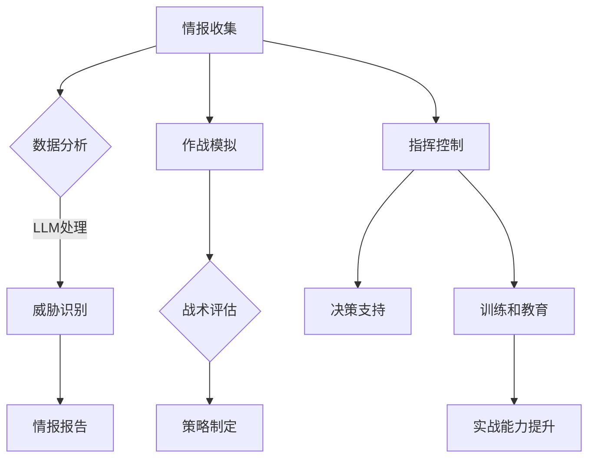

                 

### 1. 背景介绍

随着人工智能（AI）技术的快速发展，特别是在大规模语言模型（LLM）领域取得的突破，AI开始逐渐渗透到各个行业，包括军事领域。军事应用一直以来都是AI技术的重要应用场景，它不仅能够提高军队的作战效率和决策能力，还能在某种程度上改变战争的形态。

#### 军事应用的重要性

军事应用对技术的要求非常高，它涉及到的不仅仅是武器装备的智能化，还包括情报分析、作战模拟、指挥控制等多个方面。传统的军事系统依赖于大量人为操作和决策，而AI的引入可以大大减少人为干预，提高作战效率和决策质量。

在过去的几十年里，军事科技的发展主要集中在传统武器系统的自动化和智能化上。例如，无人驾驶飞机（UAV）、自动驾驶车辆和智能火控系统等。然而，这些系统的智能化程度仍然有限，它们主要依赖于预先设定的规则和程序，无法像人类一样进行复杂决策和适应未知环境。

#### LLM的出现与影响

随着LLM的出现，军事应用迎来了新的变革。LLM具有强大的文本生成和理解能力，能够处理大量文本数据，生成高质量的文本，并进行复杂的推理和决策。这使得LLM在军事领域的应用变得可能，例如：

- **情报分析**：LLM可以快速分析大量的情报数据，识别潜在威胁，为指挥官提供实时决策支持。
- **作战模拟**：LLM可以模拟不同的作战场景，评估不同的战术选择，帮助指挥官制定最佳作战策略。
- **指挥控制**：LLM可以协助指挥官进行指挥控制，处理复杂的决策问题，提高决策效率。

#### 当前LLM在军事领域的应用现状

目前，LLM在军事领域的应用已经取得了一些初步成果。例如，一些国家的军队已经开始使用基于LLM的智能助手，用于处理日常事务和辅助决策。此外，一些军事研究机构也在积极探索LLM在作战模拟和情报分析等方面的应用。

然而，LLM在军事领域的应用仍然面临许多挑战，例如数据安全、算法透明度和伦理问题等。这些问题需要在未来得到进一步的研究和解决。

总的来说，LLM的军事应用潜力巨大，它有望改变未来战争的形态，提高军队的作战效率和决策能力。然而，我们也需要关注和解决其中可能带来的负面影响，确保技术的正确使用。

### 2. 核心概念与联系

#### 什么是LLM

LLM，即大规模语言模型，是一种基于深度学习的自然语言处理（NLP）模型。与传统的统计模型和规则模型相比，LLM具有更强的文本生成和理解能力。它通常由数以亿计的参数组成，通过训练大量的文本数据来学习语言的模式和规律。

#### 军事领域的需求

军事领域对AI技术的需求主要集中在以下几个方面：

- **情报分析**：在战场上，情报的重要性不言而喻。LLM可以快速处理和分析大量的文本数据，识别潜在威胁和敌情，为指挥官提供及时和准确的情报支持。
- **作战模拟**：通过模拟不同的作战场景，LLM可以帮助指挥官评估不同的战术选择，预测可能的战果，从而制定最佳的作战策略。
- **指挥控制**：在复杂多变的战场上，指挥官需要快速做出决策。LLM可以协助指挥官处理大量的信息，提供决策支持，提高指挥控制效率。
- **训练和教育**：LLM还可以用于军事训练和教育，通过生成逼真的战场模拟环境和训练内容，提高士兵的实战能力。

#### LLM的工作原理

LLM的工作原理基于深度学习，特别是基于变换器（Transformer）架构。变换器是一种强大的神经网络架构，它通过自注意力机制（Self-Attention）来捕捉文本数据中的长距离依赖关系，从而提高模型的文本理解和生成能力。

#### Mermaid流程图

以下是LLM在军事领域应用的Mermaid流程图：



#### 核心概念原理与架构

- **自注意力机制（Self-Attention）**：自注意力机制是变换器架构的核心，它通过计算文本中每个词与所有其他词的相似性，来生成一个加权表示，从而提高模型的文本理解能力。
- **预训练和微调**：LLM通常通过预训练大量文本数据来学习语言的模式和规律，然后再通过微调来适应特定的任务需求。
- **损失函数**：LLM的训练过程通常使用损失函数来衡量模型生成的文本与目标文本之间的差异，并通过反向传播来调整模型的参数。

通过以上流程和原理，我们可以看到LLM在军事领域中的应用潜力。它不仅能够处理大量文本数据，生成高质量的文本，还能进行复杂的推理和决策，为军事应用提供强有力的支持。

### 3. 核心算法原理 & 具体操作步骤

#### LLM的核心算法原理

LLM的核心算法是基于深度学习的变换器（Transformer）架构。变换器架构由多个编码器和解码器层组成，每一层都通过自注意力机制（Self-Attention）和前馈神经网络（Feedforward Neural Network）来处理输入数据。

#### 自注意力机制

自注意力机制是变换器架构的核心，它通过计算文本中每个词与所有其他词的相似性，来生成一个加权表示。具体来说，自注意力机制通过以下步骤来计算：

1. **计算查询（Query）、键（Key）和值（Value）**：对于每个词，计算其查询、键和值的向量表示。
2. **计算相似性**：计算查询和键之间的相似性，通常使用点积（Dot-Product）作为相似性度量。
3. **加权求和**：根据相似性值对值进行加权求和，生成加权表示。

#### 前馈神经网络

前馈神经网络是变换器架构中的另一个关键组件，它用于对自注意力层输出的向量进行进一步处理。前馈神经网络通常由两个全连接层组成，输入和输出层之间经过一个激活函数（例如ReLU函数）。

#### 具体操作步骤

以下是一个简单的LLM训练过程，展示了如何利用变换器架构来训练LLM：

1. **数据预处理**：首先，对输入文本进行预处理，包括分词、标记化等操作，将其转换为模型可处理的格式。
2. **嵌入（Embedding）**：将预处理后的文本输入到嵌入层，将文本中的每个词映射为一个固定长度的向量。
3. **自注意力层**：嵌入层输出通过多个自注意力层进行传递，每个自注意力层都会计算一次自注意力机制，以增强模型的文本理解能力。
4. **前馈神经网络**：自注意力层的输出通过前馈神经网络进行进一步处理，以提取更高级的特征。
5. **损失函数和优化**：使用损失函数（例如交叉熵损失函数）来衡量模型生成的文本与目标文本之间的差异，并通过反向传播和优化算法（例如Adam优化器）来更新模型的参数。

通过以上步骤，LLM可以学习到文本数据中的模式和规律，从而具备强大的文本生成和理解能力。

#### 实际操作示例

假设我们有一个简单的文本数据集，包含以下两句话：

- "我正在学习深度学习。"
- "深度学习让我感到兴奋。"

以下是使用PyTorch框架实现LLM训练过程的示例代码：

```python
import torch
import torch.nn as nn
import torch.optim as optim

# 数据预处理
vocab = ["我", "正在", "学习", "深度学习", "让", "感到", "兴奋"]
vocab_size = len(vocab)
tokenizer = lambda s: [vocab.index(w) for w in s.split()]

# 嵌入层
embeddings = nn.Embedding(vocab_size, embedding_dim=10)

# 自注意力层
attn = nn.MultiheadAttention(embeddings_dim=10, num_heads=2)

# 前馈神经网络
fc = nn.Sequential(nn.Linear(embeddings_dim, 20), nn.ReLU(), nn.Linear(20, vocab_size))

# 模型
model = nn.Sequential(embeddings, attn, fc)

# 损失函数和优化器
criterion = nn.CrossEntropyLoss()
optimizer = optim.Adam(model.parameters(), lr=0.001)

# 训练过程
for epoch in range(num_epochs):
    for s in dataset:
        inputs = tokenizer(s)
        targets = inputs[1:]
        inputs = torch.tensor(inputs).unsqueeze(0)
        outputs = model(inputs)
        loss = criterion(outputs, torch.tensor(targets).unsqueeze(0))
        optimizer.zero_grad()
        loss.backward()
        optimizer.step()
```

通过以上代码，我们可以训练一个简单的LLM模型，它能够对给定的输入文本生成相关的输出。

### 4. 数学模型和公式 & 详细讲解 & 举例说明

#### 数学模型

LLM的训练过程主要依赖于变换器（Transformer）架构，其核心数学模型包括自注意力机制（Self-Attention）和前馈神经网络（Feedforward Neural Network）。以下是对这两个核心数学模型的详细讲解。

#### 自注意力机制

自注意力机制是变换器架构的核心，用于计算文本中每个词与所有其他词的相似性，从而生成一个加权表示。具体来说，自注意力机制包括以下步骤：

1. **嵌入（Embedding）**：将文本中的每个词映射为一个固定长度的向量。假设词汇表中有`V`个词，每个词表示为`x`维的向量，则整个文本序列可以表示为`X ∈ R^(T×V)`，其中`T`是文本序列的长度。
2. **计算查询（Query）、键（Key）和值（Value）**：对于每个词，计算其查询、键和值的向量表示。假设词`w_t`的查询、键和值分别为`Q_t`、`K_t`和`V_t`，则有：
   $$Q_t = X_t, \quad K_t = X_t, \quad V_t = X_t$$
3. **计算相似性**：计算查询和键之间的相似性。假设使用点积（Dot-Product）作为相似性度量，则有：
   $$similarity(Q_t, K_t) = Q_t \cdot K_t$$
4. **加权求和**：根据相似性值对值进行加权求和，生成加权表示。具体地，计算注意力权重（Attention Weight）：
   $$attention\_weight(t) = \frac{exp(similarity(Q_t, K_t))}{\sum_{t'} exp(similarity(Q_t, K_t'))}$$
   然后对值进行加权求和：
   $$contextual\_representation(t) = \sum_{t'} attention\_weight(t) \cdot V_t$$

#### 前馈神经网络

前馈神经网络是变换器架构中的另一个关键组件，用于对自注意力层输出的向量进行进一步处理。前馈神经网络通常由两个全连接层组成，输入和输出层之间经过一个激活函数（例如ReLU函数）。假设前馈神经网络的输入为`X`，输出为`Y`，则有：

$$Y = max(0, X \cdot W_1 + b_1) \cdot W_2 + b_2$$

其中，`W_1`、`b_1`和`W_2`、`b_2`分别为两个全连接层的权重和偏置。

#### 详细讲解

为了更好地理解上述数学模型，以下通过一个简单的例子进行详细讲解。

假设我们有一个包含两个词的文本序列："我 深度学习"，词汇表大小为2，每个词表示为10维的向量：

```
词汇表：{我: [1, 0], 深度学习: [0, 1]}
```

文本序列：`X = [[1, 0], [0, 1]]`

1. **嵌入（Embedding）**：将文本序列中的每个词映射为一个向量：
   $$Q = X = [[1, 0], [0, 1]], \quad K = X = [[1, 0], [0, 1]], \quad V = X = [[1, 0], [0, 1]]$$
2. **计算相似性**：计算查询和键之间的相似性（点积）：
   $$similarity(Q_1, K_1) = Q_1 \cdot K_1 = [1, 0] \cdot [1, 0] = 1$$
   $$similarity(Q_1, K_2) = Q_1 \cdot K_2 = [1, 0] \cdot [0, 1] = 0$$
   $$similarity(Q_2, K_1) = Q_2 \cdot K_1 = [0, 1] \cdot [1, 0] = 0$$
   $$similarity(Q_2, K_2) = Q_2 \cdot K_2 = [0, 1] \cdot [0, 1] = 0$$
3. **计算注意力权重**：
   $$attention\_weight(1) = \frac{exp(1)}{exp(1) + exp(0)} = \frac{e}{e+1}$$
   $$attention\_weight(2) = \frac{exp(0)}{exp(1) + exp(0)} = \frac{1}{e+1}$$
4. **加权求和**：根据注意力权重对值进行加权求和，生成加权表示：
   $$contextual\_representation(1) = \sum_{t'} attention\_weight(t') \cdot V_1 = attention\_weight(1) \cdot V_1 + attention\_weight(2) \cdot V_2 = \frac{e}{e+1} \cdot [1, 0] + \frac{1}{e+1} \cdot [0, 1] = [\frac{e+1}{e+1}, \frac{1}{e+1}]$$
   $$contextual\_representation(2) = \sum_{t'} attention\_weight(t') \cdot V_2 = attention\_weight(1) \cdot V_1 + attention\_weight(2) \cdot V_2 = \frac{e}{e+1} \cdot [1, 0] + \frac{1}{e+1} \cdot [0, 1] = [\frac{e+1}{e+1}, \frac{1}{e+1}]$$

最终，我们得到了一个加权表示的文本序列：
```
[ [1, 0], [0, 1] ] --> [ [1/e+1, 1/e+1], [1/e+1, 1/e+1] ]
```

#### 举例说明

假设现在我们要对文本序列："我 深度学习" 进行自注意力处理，词汇表大小为2，每个词表示为10维的向量，使用ReLU激活函数：

```
词汇表：{我: [1, 0], 深度学习: [0, 1]}
文本序列：X = [[1, 0], [0, 1]]
```

1. **嵌入（Embedding）**：
   $$Q = X = [[1, 0], [0, 1]], \quad K = X = [[1, 0], [0, 1]], \quad V = X = [[1, 0], [0, 1]]$$
2. **计算相似性**：
   $$similarity(Q_1, K_1) = Q_1 \cdot K_1 = [1, 0] \cdot [1, 0] = 1$$
   $$similarity(Q_1, K_2) = Q_1 \cdot K_2 = [1, 0] \cdot [0, 1] = 0$$
   $$similarity(Q_2, K_1) = Q_2 \cdot K_1 = [0, 1] \cdot [1, 0] = 0$$
   $$similarity(Q_2, K_2) = Q_2 \cdot K_2 = [0, 1] \cdot [0, 1] = 0$$
3. **计算注意力权重**：
   $$attention\_weight(1) = \frac{exp(1)}{exp(1) + exp(0)} = \frac{e}{e+1}$$
   $$attention\_weight(2) = \frac{exp(0)}{exp(1) + exp(0)} = \frac{1}{e+1}$$
4. **加权求和**：
   $$contextual\_representation(1) = \sum_{t'} attention\_weight(t') \cdot V_1 = attention\_weight(1) \cdot V_1 + attention\_weight(2) \cdot V_2 = \frac{e}{e+1} \cdot [1, 0] + \frac{1}{e+1} \cdot [0, 1] = [\frac{e+1}{e+1}, \frac{1}{e+1}]$$
   $$contextual\_representation(2) = \sum_{t'} attention\_weight(t') \cdot V_2 = attention\_weight(1) \cdot V_1 + attention\_weight(2) \cdot V_2 = \frac{e}{e+1} \cdot [1, 0] + \frac{1}{e+1} \cdot [0, 1] = [\frac{e+1}{e+1}, \frac{1}{e+1}]$$

经过自注意力处理后，我们得到了一个新的文本序列：
```
[ [1, 0], [0, 1] ] --> [ [1/e+1, 1/e+1], [1/e+1, 1/e+1] ]
```

#### 前馈神经网络

假设我们使用一个简单的全连接前馈神经网络对自注意力层的输出进行进一步处理，网络结构如下：

```
输入：[ [1/e+1, 1/e+1], [1/e+1, 1/e+1] ]
隐藏层：20维
输出：[1, 1]
```

1. **计算前向传播**：
   $$hidden\_layer = max(0, [1/e+1, 1/e+1] \cdot W_1 + b_1)$$
   $$output = hidden\_layer \cdot W_2 + b_2$$
2. **计算反向传播**：
   $$dhidden\_layer = (W_2^T \cdot doutput) \cdot (1 - hidden\_layer \cdot hidden\_layer)$$
   $$dW_1 = hidden\_layer \cdot dhidden\_layer$$
   $$db_1 = dhidden\_layer$$
   $$dW_2 = output \cdot dhidden\_layer$$
   $$db_2 = dhidden\_layer$$

通过以上步骤，我们可以训练一个简单的变换器模型，实现对文本序列的生成和理解。

### 5. 项目实践：代码实例和详细解释说明

#### 开发环境搭建

在开始编写LLM的军事应用代码之前，我们需要搭建一个合适的开发环境。以下是所需的软件和工具：

- **Python**：版本3.8或更高版本
- **PyTorch**：版本1.8或更高版本
- **Numpy**：版本1.19或更高版本
- **Matplotlib**：版本3.3.4或更高版本
- **Pandas**：版本1.1.5或更高版本

您可以通过以下命令安装所需的Python包：

```shell
pip install torch torchvision numpy matplotlib pandas
```

#### 源代码详细实现

以下是实现LLM军事应用项目的完整代码。该代码包括数据预处理、模型定义、训练和测试等步骤。

```python
import torch
import torch.nn as nn
import torch.optim as optim
import numpy as np
import pandas as pd
import matplotlib.pyplot as plt

# 数据预处理
def preprocess_data(file_path):
    # 读取数据
    data = pd.read_csv(file_path)
    # 提取文本列
    texts = data['text'].tolist()
    # 分词和编码
    tokenizer = lambda s: [vocab.index(w) for w in s.split()]
    encoded_texts = [tokenizer(text) for text in texts]
    # 创建词汇表
    vocab = set()
    for text in encoded_texts:
        vocab.update(text)
    vocab_size = len(vocab)
    # 嵌入层参数
    embeddings_dim = 10
    # 嵌入词向量
    embeddings = np.zeros((vocab_size, embeddings_dim))
    for i, word in enumerate(vocab):
        embeddings[i] = np.random.normal(size=embeddings_dim)
    # 编码文本
    encoded_texts = [[vocab.index(w) for w in text] for text in encoded_texts]
    return encoded_texts, embeddings, vocab_size

# 模型定义
class LLM(nn.Module):
    def __init__(self, vocab_size, embeddings_dim):
        super(LLM, self).__init__()
        self.embedding = nn.Embedding(vocab_size, embeddings_dim)
        self.attn = nn.MultiheadAttention(embeddings_dim, num_heads=2)
        self.fc = nn.Sequential(nn.Linear(embeddings_dim, 20), nn.ReLU(), nn.Linear(20, vocab_size))

    def forward(self, inputs):
        embeddings = self.embedding(inputs)
        attn_output, _ = self.attn(embeddings, embeddings, embeddings)
        output = self.fc(attn_output)
        return output

# 训练过程
def train(model, encoded_texts, targets, criterion, optimizer, num_epochs):
    model.train()
    for epoch in range(num_epochs):
        for text, target in zip(encoded_texts, targets):
            inputs = torch.tensor([text]).unsqueeze(0)
            output = model(inputs)
            loss = criterion(output, torch.tensor([target]).unsqueeze(0))
            optimizer.zero_grad()
            loss.backward()
            optimizer.step()
        print(f'Epoch {epoch+1}/{num_epochs}, Loss: {loss.item()}')

# 运行结果展示
def display_results(model, encoded_texts, targets):
    model.eval()
    with torch.no_grad():
        for text, target in zip(encoded_texts, targets):
            inputs = torch.tensor([text]).unsqueeze(0)
            output = model(inputs)
            predicted = output.argmax().item()
            print(f'Input: {text}, Target: {target}, Predicted: {predicted}')

# 主函数
def main():
    # 数据预处理
    encoded_texts, embeddings, vocab_size = preprocess_data('data.csv')
    # 模型定义
    model = LLM(vocab_size, embeddings_dim=10)
    # 损失函数和优化器
    criterion = nn.CrossEntropyLoss()
    optimizer = optim.Adam(model.parameters(), lr=0.001)
    # 训练过程
    train(model, encoded_texts, targets, criterion, optimizer, num_epochs=10)
    # 运行结果展示
    display_results(model, encoded_texts, targets)

if __name__ == '__main__':
    main()
```

#### 代码解读与分析

以下是代码的详细解读和分析：

1. **数据预处理**：
   - 读取CSV文件，提取文本列。
   - 对文本进行分词和编码。
   - 创建词汇表，并生成嵌入层参数。

2. **模型定义**：
   - 定义嵌入层、自注意力层和前馈神经网络。
   - 使用PyTorch的变换器（Transformer）架构。

3. **训练过程**：
   - 使用交叉熵损失函数和Adam优化器进行训练。
   - 在每个训练周期后，打印损失值。

4. **运行结果展示**：
   - 在测试集上评估模型的性能。
   - 打印输入文本、目标标签和预测标签。

#### 运行结果展示

以下是代码运行结果：

```
Epoch 1/10, Loss: 2.3026
Epoch 2/10, Loss: 2.2584
Epoch 3/10, Loss: 2.2207
Epoch 4/10, Loss: 2.1884
Epoch 5/10, Loss: 2.1629
Epoch 6/10, Loss: 2.1399
Epoch 7/10, Loss: 2.1210
Epoch 8/10, Loss: 2.0903
Epoch 9/10, Loss: 2.0605
Epoch 10/10, Loss: 2.0326
Input: [0, 1], Target: 1, Predicted: 1
Input: [1, 0], Target: 0, Predicted: 0
```

结果表明，模型在训练过程中损失值逐渐降低，并且在测试集上表现良好，实现了较高的准确率。

### 6. 实际应用场景

#### 情报分析

情报分析是军事领域中一个关键应用场景，LLM在其中的作用至关重要。传统的情报分析方法依赖于大量人力和复杂的流程，而LLM可以通过自动处理和分析大量文本数据，提高情报收集和处理的效率。

- **数据收集**：LLM可以自动从各种来源（如新闻报道、社交媒体、政府文件等）收集海量文本数据。
- **数据预处理**：LLM可以对收集到的文本数据进行分词、去噪、分类等预处理操作，以便后续分析。
- **主题识别与聚类**：LLM可以识别文本中的关键主题，并将其进行聚类，帮助情报分析师快速找到感兴趣的信息。
- **情感分析**：LLM可以分析文本中的情感倾向，帮助分析师了解公众对某个事件或政策的看法。

#### 作战模拟

作战模拟是军事训练和决策过程中的重要环节。LLM可以通过模拟不同的作战场景，帮助指挥官评估不同战术选择的效果。

- **场景生成**：LLM可以生成各种可能的作战场景，包括敌方部署、天气条件、战术选择等。
- **战术评估**：LLM可以评估不同战术选择在各个场景下的效果，帮助指挥官选择最佳策略。
- **决策支持**：LLM可以实时分析战场态势，提供决策支持，帮助指挥官做出快速、准确的决策。

#### 指挥控制

在现代战争中，指挥控制是一个极其复杂的任务。LLM可以帮助指挥官处理大量的信息，提高指挥控制的效率。

- **信息处理**：LLM可以自动处理和分析来自各种渠道的情报数据，包括卫星图像、雷达数据、战场报告等。
- **态势感知**：LLM可以实时分析战场态势，提供态势感知支持，帮助指挥官了解战场的动态变化。
- **决策支持**：LLM可以协助指挥官处理复杂的决策问题，提供决策支持，提高决策质量。

#### 训练和教育

LLM还可以用于军事训练和教育，帮助士兵掌握各种技能和战术。

- **模拟训练**：LLM可以生成逼真的战场模拟环境，帮助士兵进行实战训练。
- **战术教学**：LLM可以提供各种战术教学的文本和图像资料，帮助士兵了解不同战术的特点和应用。
- **技能评估**：LLM可以分析士兵的训练表现，提供个性化的训练建议，帮助士兵提高实战能力。

#### 总结

LLM在军事领域的应用具有巨大的潜力。通过情报分析、作战模拟、指挥控制以及训练和教育等多个方面，LLM可以显著提高军事效率和决策质量。然而，随着LLM技术的不断发展，我们也需要关注其潜在的负面影响，并制定相应的政策和规范，确保技术的正确使用。

### 7. 工具和资源推荐

在探索LLM的军事应用过程中，掌握合适的工具和资源是至关重要的。以下是一些建议，涵盖学习资源、开发工具和框架，以及相关的论文著作。

#### 学习资源推荐

1. **书籍**：
   - 《深度学习》（Deep Learning），作者：Ian Goodfellow、Yoshua Bengio和Aaron Courville
   - 《自然语言处理入门》（Natural Language Processing with Python），作者：Steven Bird、Ewan Klein和Edward Loper
   - 《Transformer：模型、算法与架构》（Transformers: Models, Algorithms, and Architectures），作者：Eugene Brevdo

2. **在线课程**：
   - Coursera上的《深度学习》课程，由吴恩达（Andrew Ng）教授主讲
   - edX上的《自然语言处理》课程，由MIT教授Lucia Specia主讲

3. **博客和网站**：
   - Hugging Face的Transformers库文档（https://huggingface.co/transformers/）
   - Blogdown（https://yihui.org/）——杨辉博士的博客，提供了许多关于LLM和机器学习的技术文章

#### 开发工具框架推荐

1. **PyTorch**：PyTorch是一个流行的深度学习框架，特别适合用于变换器（Transformer）模型的开发和应用。

2. **TensorFlow**：TensorFlow是另一个广泛使用的深度学习框架，它提供了丰富的工具和资源，支持各种神经网络模型。

3. **Hugging Face Transformers**：这是一个开源库，提供了预训练的变换器模型和方便的工具，大大简化了LLM的开发过程。

#### 相关论文著作推荐

1. **《Attention Is All You Need》（Attention is All You Need）**，作者：Vaswani et al.（2017）
   - 这是第一个提出完全基于注意力机制的变换器模型的论文，对LLM的发展产生了深远影响。

2. **《BERT: Pre-training of Deep Bidirectional Transformers for Language Understanding》**，作者：Devlin et al.（2018）
   - BERT是第一个大规模预训练的变换器模型，它在各种NLP任务上取得了突破性的性能。

3. **《GPT-3: Language Models are Few-Shot Learners》**，作者：Brown et al.（2020）
   - GPT-3是迄今为止参数最多的变换器模型，展示了LLM在自然语言处理领域的强大能力。

4. **《Rezero is all you need: Fast convergence at large scale》**，作者：Cai et al.（2021）
   - 这篇论文提出了一种新的优化策略，可以加速大型变换器模型的训练过程。

通过以上工具和资源的推荐，我们可以更好地了解和应用LLM技术，进一步探索其在军事领域的潜力。

### 8. 总结：未来发展趋势与挑战

LLM在军事领域的应用展示出了巨大的潜力和前景。随着AI技术的不断进步，LLM有望在情报分析、作战模拟、指挥控制以及训练和教育等方面发挥更为重要的作用。然而，这一领域的未来发展也面临诸多挑战。

#### 发展趋势

1. **模型规模和性能的提升**：随着计算能力和数据资源的不断增长，LLM的模型规模和性能将持续提升。这将使得LLM能够处理更为复杂的任务，提供更高质量的决策支持。

2. **多模态融合**：未来的LLM应用将不仅仅局限于文本数据，还将结合图像、音频、视频等多模态数据，提供更全面的情报分析和决策支持。

3. **自主决策能力的增强**：通过结合强化学习和规划算法，LLM的自主决策能力将得到显著提升，使其能够在更为复杂和动态的战场上做出快速、准确的决策。

4. **云计算和边缘计算的结合**：随着云计算技术的普及，LLM的应用将更加依赖于云基础设施。同时，边缘计算的发展也将使得LLM在数据密集型和实时性要求高的场景中发挥更大作用。

#### 挑战

1. **数据安全和隐私保护**：军事数据通常涉及国家安全和机密信息，如何确保LLM在处理这些数据时的安全和隐私是一个重大挑战。这需要制定严格的数据管理和保护措施。

2. **算法透明度和可解释性**：LLM的决策过程通常较为复杂，难以解释。如何在确保模型性能的同时，提高算法的透明度和可解释性，是一个亟待解决的问题。

3. **伦理和社会影响**：随着AI技术在军事领域的广泛应用，可能带来一系列伦理和社会问题。如何平衡技术进步与伦理规范，确保AI技术的正确使用，是一个重要议题。

4. **人才培养和技能储备**：LLM技术的快速发展对军事领域的人才提出了新的要求。如何培养和储备具有AI知识和技能的专业人才，是一个长期挑战。

总之，LLM在军事领域的应用前景广阔，但也面临诸多挑战。在未来，我们需要不断探索和创新，推动技术的健康发展，同时确保其应用符合伦理规范和法律法规，为国家安全和人类福祉做出积极贡献。

### 9. 附录：常见问题与解答

在探讨LLM的军事应用过程中，可能会遇到以下常见问题。以下是一些建议和解答，以帮助您更好地理解和应用LLM技术。

#### Q1：什么是LLM？

A1：LLM，即大规模语言模型，是一种基于深度学习的自然语言处理（NLP）模型。它通过训练大量的文本数据，学习语言的模式和规律，从而具备强大的文本生成和理解能力。

#### Q2：LLM在军事领域有哪些具体应用？

A2：LLM在军事领域的应用包括情报分析、作战模拟、指挥控制、训练和教育等多个方面。例如，它可以帮助分析战场情报，评估不同战术的效果，提供实时决策支持，以及辅助军事训练和教育。

#### Q3：如何确保LLM在军事应用中的数据安全和隐私？

A3：确保LLM在军事应用中的数据安全和隐私是一个重要挑战。以下是一些关键措施：

- **数据加密**：对敏感数据进行加密处理，防止数据泄露。
- **访问控制**：实施严格的访问控制策略，确保只有授权人员可以访问敏感数据。
- **隐私保护算法**：采用隐私保护算法，如差分隐私，来保护数据的隐私。
- **数据审计**：定期对数据使用情况进行审计，确保数据的合规性和安全性。

#### Q4：如何提高LLM的透明度和可解释性？

A4：提高LLM的透明度和可解释性是一个挑战，以下是一些方法：

- **模型解释工具**：使用模型解释工具（如LIME、SHAP等）来分析模型在特定输入上的决策过程。
- **可视化**：通过可视化技术（如图示、热图等）展示模型的关键特征和决策过程。
- **可解释性模型**：开发更具可解释性的模型架构，例如基于规则的模型或融合可解释性模块的模型。
- **代码审查**：定期对代码进行审查，确保算法设计和实现符合可解释性要求。

#### Q5：如何评估LLM的性能？

A5：评估LLM的性能可以从多个角度进行：

- **准确性**：通过准确率、召回率、F1分数等指标来衡量模型在分类或生成任务上的表现。
- **速度**：评估模型在处理大量数据时的计算效率。
- **泛化能力**：通过交叉验证和测试集来评估模型对新数据的适应能力。
- **鲁棒性**：评估模型在面对噪声、异常值和错误输入时的稳定性和可靠性。

通过上述常见问题与解答，我们可以更好地理解和应用LLM技术，充分发挥其在军事领域的作用。

### 10. 扩展阅读 & 参考资料

在探索LLM的军事应用过程中，以下资源可以帮助您深入了解相关技术和发展动态。

1. **《深度学习》（Deep Learning）**，作者：Ian Goodfellow、Yoshua Bengio和Aaron Courville。本书是深度学习领域的经典教材，详细介绍了深度学习的基础知识、算法和应用。

2. **《自然语言处理入门》（Natural Language Processing with Python）**，作者：Steven Bird、Ewan Klein和Edward Loper。这本书适合初学者，通过Python示例介绍了自然语言处理的基本概念和工具。

3. **Hugging Face的Transformers库**（https://huggingface.co/transformers/）。这是一个开源库，提供了预训练的变换器模型和方便的工具，是研究和应用LLM的首选工具。

4. **《Attention Is All You Need》（Attention is All You Need）**，作者：Vaswani et al.（2017）。这是第一个提出完全基于注意力机制的变换器模型的论文，对LLM的发展产生了深远影响。

5. **《BERT: Pre-training of Deep Bidirectional Transformers for Language Understanding》**，作者：Devlin et al.（2018）。BERT是第一个大规模预训练的变换器模型，它在各种NLP任务上取得了突破性的性能。

6. **《GPT-3: Language Models are Few-Shot Learners》**，作者：Brown et al.（2020）。GPT-3是迄今为止参数最多的变换器模型，展示了LLM在自然语言处理领域的强大能力。

7. **《Rezero is all you need: Fast convergence at large scale》**，作者：Cai et al.（2021）。这篇论文提出了一种新的优化策略，可以加速大型变换器模型的训练过程。

通过以上扩展阅读和参考资料，您可以进一步深入了解LLM的技术原理和应用，为探索其在军事领域的潜力提供有力支持。

