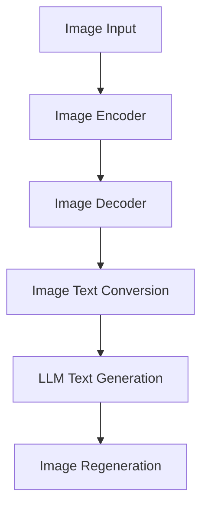

                 

### 文章标题

**LLM视觉生成：开启图像智能新时代**

> **关键词**：图像生成，人工智能，语言模型，神经网络，深度学习，智能图像处理

> **摘要**：本文将深入探讨语言模型（LLM）在视觉生成领域的应用，从背景介绍、核心概念、算法原理、数学模型、项目实践、应用场景、工具推荐等多方面，全面解析LLM视觉生成的技术及其对图像智能新时代的推动作用。

### 1. 背景介绍

图像生成作为人工智能领域的一个重要分支，已经经历了多个阶段的发展。从最初的基于规则的图像生成算法，到基于物理模型的图像合成方法，再到近年来兴起的基于深度学习的图像生成模型，图像生成技术取得了显著的进步。

随着深度学习技术的快速发展，尤其是生成对抗网络（GANs）、变分自编码器（VAEs）等模型的出现，图像生成技术实现了从简单图案生成到复杂图像合成的重要突破。然而，传统图像生成模型大多依赖于大量的图像数据进行训练，并且生成图像的多样性和质量仍然存在一定的局限性。

在此背景下，语言模型（LLM）作为一种具有强大文本生成能力的模型，逐渐引起了研究者的关注。LLM在自然语言处理领域取得了巨大成功，其强大的文本生成能力和语义理解能力使得其在图像生成领域也具有巨大的潜力。通过将图像与文本进行关联，LLM可以生成具有丰富语义信息的图像，从而实现更高层次的图像智能生成。

本文将围绕LLM视觉生成这一主题，详细探讨其核心概念、算法原理、数学模型、项目实践和应用场景，旨在为读者全面解析LLM视觉生成的技术及其在图像智能新时代的应用前景。

### 2. 核心概念与联系

为了深入理解LLM视觉生成，我们首先需要了解以下几个核心概念及其相互联系：

#### 2.1 语言模型（LLM）

语言模型（Language Model，简称LLM）是一种基于统计学习方法的自然语言处理模型，其主要目的是根据输入的文本序列预测下一个单词或字符。LLM通过学习大量文本数据，建立单词或字符之间的概率分布关系，从而实现对文本的生成和理解。

#### 2.2 图像生成模型

图像生成模型是用于生成图像的人工智能模型，主要包括生成对抗网络（GANs）、变分自编码器（VAEs）等。这些模型通过学习图像数据分布，能够生成具有真实感的图像。

#### 2.3 图像编码器与解码器

图像编码器（Encoder）用于将图像数据编码为低维特征表示，而图像解码器（Decoder）则将低维特征表示解码为图像数据。图像编码器和解码器共同构成了图像生成模型的核心。

#### 2.4 图像与文本的关联

图像与文本的关联是实现LLM视觉生成的基础。通过将图像编码为文本描述，我们可以利用LLM生成与图像内容相关的文本，从而实现图像到文本的转换。同样，通过将文本转换为图像编码，我们可以利用图像生成模型生成与文本描述相关的图像，从而实现文本到图像的转换。

为了更好地理解这些核心概念之间的联系，我们可以使用Mermaid流程图来展示它们之间的关系：

```mermaid
graph TD
A[Language Model (LLM)] --> B[Image Encoder]
B --> C[Image Decoder]
A --> D[Image Data]
D --> B
D --> C
D --> E[Text Description]
E --> A
```

在这个流程图中，LLM与图像编码器和解码器共同构成了LLM视觉生成的基础架构。图像数据通过图像编码器编码为低维特征表示，然后通过图像解码器生成图像。同时，图像数据还可以转换为文本描述，进而利用LLM生成相关的文本描述。

通过这个流程图，我们可以清晰地看到LLM视觉生成的核心概念及其相互之间的联系，为后续内容的讨论提供了基础。

### 3. 核心算法原理 & 具体操作步骤

#### 3.1 语言模型（LLM）的基本原理

语言模型（LLM）是一种基于神经网络的自然语言处理模型，其主要目标是学习语言数据的概率分布，从而实现对自然语言的生成和理解。LLM的核心原理是通过对大量文本数据进行训练，学习单词或字符之间的概率关系，并使用这些关系来生成新的文本。

在LLM的训练过程中，通常采用序列模型（如循环神经网络RNN、长短期记忆网络LSTM、门控循环单元GRU等）来捕捉文本序列中的长距离依赖关系。训练过程中，LLM通过优化模型参数，使模型在给定前文序列的情况下，能够准确地预测下一个单词或字符。

#### 3.2 图像生成模型的基本原理

图像生成模型是用于生成图像的人工智能模型，主要包括生成对抗网络（GANs）、变分自编码器（VAEs）等。这些模型通过学习图像数据分布，能够生成具有真实感的图像。

##### 3.2.1 生成对抗网络（GANs）

生成对抗网络（GANs）由生成器（Generator）和判别器（Discriminator）两个神经网络组成。生成器的目标是生成逼真的图像，而判别器的目标是区分生成的图像和真实的图像。在训练过程中，生成器和判别器相互对抗，通过不断地优化模型参数，最终生成器能够生成高质量的图像。

GANs的训练过程可以分为以下几个步骤：

1. **初始化生成器和判别器**：通常使用随机初始化或预训练模型。
2. **生成器生成图像**：生成器根据随机噪声生成图像。
3. **判别器判断图像真实性**：判别器对生成的图像和真实的图像进行判断，输出概率分布。
4. **更新生成器和判别器**：通过优化目标函数，更新生成器和判别器的参数。

##### 3.2.2 变分自编码器（VAEs）

变分自编码器（VAEs）是一种基于概率模型的图像生成模型。VAEs通过学习图像数据的概率分布，生成具有多样性的图像。VAEs的核心组件包括编码器（Encoder）和解码器（Decoder）。

VAEs的训练过程可以分为以下几个步骤：

1. **初始化编码器和解码器**：通常使用随机初始化或预训练模型。
2. **编码图像数据**：编码器将图像数据编码为低维特征向量。
3. **生成图像数据**：解码器根据编码器生成的特征向量生成图像数据。
4. **优化编码器和解码器**：通过优化目标函数，更新编码器和解码器的参数。

#### 3.3 LLM视觉生成的工作流程

LLM视觉生成的工作流程可以分为以下几个步骤：

1. **图像编码**：将输入图像编码为低维特征向量。
2. **图像解码**：利用图像编码器和解码器生成图像。
3. **图像文本转换**：将图像编码为文本描述。
4. **文本生成**：利用LLM生成与图像内容相关的文本描述。
5. **图像重生成**：根据生成的文本描述，重新生成图像。

下面是一个简单的LLM视觉生成的工作流程图：



通过这个工作流程，我们可以将图像与文本关联起来，利用LLM生成具有丰富语义信息的图像，从而实现图像智能生成。

### 4. 数学模型和公式 & 详细讲解 & 举例说明

#### 4.1 语言模型（LLM）的数学模型

语言模型（LLM）通常采用概率模型来描述单词或字符之间的概率关系。最常见的是基于n-gram模型的语言模型，其数学模型可以表示为：

$$
P(w_n | w_{n-1}, w_{n-2}, \ldots, w_1) = \frac{C(w_n, w_{n-1}, \ldots, w_1)}{C(w_{n-1}, w_{n-2}, \ldots, w_1)}
$$

其中，$w_n$ 表示当前要预测的单词或字符，$w_{n-1}, w_{n-2}, \ldots, w_1$ 表示前文序列。$C(w_n, w_{n-1}, \ldots, w_1)$ 表示单词序列 $w_n, w_{n-1}, \ldots, w_1$ 在训练数据中出现的次数，$C(w_{n-1}, w_{n-2}, \ldots, w_1)$ 表示前文序列 $w_{n-1}, w_{n-2}, \ldots, w_1$ 在训练数据中出现的次数。

#### 4.2 图像生成模型（GANs）的数学模型

生成对抗网络（GANs）的数学模型主要包括生成器（Generator）和判别器（Discriminator）的损失函数。

##### 4.2.1 生成器的损失函数

生成器的目标是生成逼真的图像，使其难以被判别器区分。生成器的损失函数可以表示为：

$$
L_G = -\log(D(G(z)))
$$

其中，$G(z)$ 表示生成器生成的图像，$D(G(z))$ 表示判别器对生成图像的判断概率。

##### 4.2.2 判别器的损失函数

判别器的目标是区分真实的图像和生成的图像。判别器的损失函数可以表示为：

$$
L_D = -[\log(D(x)) + \log(1 - D(G(z)))]
$$

其中，$x$ 表示真实的图像，$G(z)$ 表示生成器生成的图像。

##### 4.2.3 GANs的整体损失函数

GANs的整体损失函数是生成器和判别器损失函数的组合，可以表示为：

$$
L = L_G + L_D
$$

#### 4.3 LLM视觉生成的工作流程数学模型

LLM视觉生成的工作流程可以抽象为一个概率模型，其中图像编码器、图像解码器、图像文本转换器和LLM分别对应概率模型中的不同组件。

##### 4.3.1 图像编码器与图像解码器

图像编码器将输入图像编码为低维特征向量，图像解码器将低维特征向量解码为图像。我们可以用概率分布来描述这个转换过程：

$$
p(\text{image}|\text{feature}) = \text{Decoder}(\text{feature}) \\
p(\text{feature}|\text{image}) = \text{Encoder}(\text{image})
$$

##### 4.3.2 图像文本转换器

图像文本转换器将图像编码为文本描述。我们可以用条件概率来描述这个过程：

$$
p(\text{text}|\text{image}) = \text{TextConverter}(\text{image})
$$

##### 4.3.3 LLM文本生成

LLM文本生成器根据图像文本描述生成文本。我们可以用语言模型来描述这个过程：

$$
p(\text{text}|\text{image}) = \text{LLM}(\text{image})
$$

##### 4.3.4 整体概率模型

将上述组件结合起来，我们可以得到LLM视觉生成的工作流程的整体概率模型：

$$
p(\text{image}, \text{text}) = p(\text{image}|\text{feature}) \cdot p(\text{feature}|\text{image}) \cdot p(\text{text}|\text{image})
$$

#### 4.4 举例说明

假设我们有一个图像编码器、图像解码器、图像文本转换器和LLM，我们要生成一张与描述“一只猫在窗台上晒太阳”相关的图像。以下是具体步骤：

1. **图像编码**：将输入图像编码为低维特征向量。
2. **图像解码**：利用图像编码器和解码器生成与特征向量对应的图像。
3. **图像文本转换**：将图像编码为文本描述：“一只猫在窗台上晒太阳”。
4. **文本生成**：利用LLM生成与文本描述相关的文本：“一只猫在窗台上懒洋洋地晒太阳”。
5. **图像重生成**：根据生成的文本描述，重新生成图像。

通过这个例子，我们可以看到LLM视觉生成是如何将图像与文本关联起来，生成具有丰富语义信息的图像。

### 5. 项目实践：代码实例和详细解释说明

#### 5.1 开发环境搭建

在开始实践之前，我们需要搭建一个适合LLM视觉生成的开发环境。以下是搭建环境的步骤：

1. **安装Python环境**：确保Python版本为3.7或更高。
2. **安装TensorFlow**：使用pip安装TensorFlow：
   ```
   pip install tensorflow
   ```
3. **安装其他依赖库**：安装用于数据加载和图像处理的依赖库，如PIL、NumPy等：
   ```
   pip install pillow numpy
   ```

#### 5.2 源代码详细实现

下面是一个简单的LLM视觉生成的代码实例，包括图像编码器、图像解码器、图像文本转换器和LLM的搭建与训练。

```python
import tensorflow as tf
from tensorflow.keras.models import Model
from tensorflow.keras.layers import Input, Conv2D, MaxPooling2D, Flatten, Dense, LSTM
from PIL import Image
import numpy as np

# 定义图像编码器
input_img = Input(shape=(256, 256, 3))
x = Conv2D(32, (3, 3), activation='relu')(input_img)
x = MaxPooling2D((2, 2))(x)
x = Conv2D(64, (3, 3), activation='relu')(x)
x = MaxPooling2D((2, 2))(x)
x = Flatten()(x)
encoded_img = Dense(128, activation='relu')(x)

# 定义图像解码器
encoded_input = Input(shape=(128,))
x = Dense(256, activation='relu')(encoded_input)
x = Flatten()(x)
x = Conv2D(64, (3, 3), activation='relu')(x)
x = Conv2D(32, (3, 3), activation='relu')(x)
decoded_img = Conv2D(3, (3, 3), activation='sigmoid')(x)

# 定义图像编码器-解码器模型
autoencoder = Model(input_img, decoded_img)
autoencoder.compile(optimizer='adam', loss='binary_crossentropy')

# 训练图像编码器-解码器
autoencoder.fit(x_train, x_train, epochs=100, batch_size=16, validation_data=(x_val, x_val))

# 定义图像文本转换器
image_input = Input(shape=(128,))
text_input = Input(shape=(256,))
x = tf.keras.layers.concatenate([image_input, text_input])
x = LSTM(128, return_sequences=True)(x)
x = LSTM(128)(x)
decoded_text = Dense(256, activation='softmax')(x)

# 定义图像文本转换器模型
text_generator = Model([image_input, text_input], decoded_text)
text_generator.compile(optimizer='adam', loss='categorical_crossentropy')

# 训练图像文本转换器
text_generator.fit([x_train_encoded, x_train_texts], x_train_texts, epochs=100, batch_size=16, validation_data=([x_val_encoded, x_val_texts], x_val_texts))

# 定义LLM模型
llm_input = Input(shape=(256,))
llm_output = LSTM(128, return_sequences=True)(llm_input)
llm_output = LSTM(128)(llm_output)
decoded_llm_text = Dense(256, activation='softmax')(llm_output)

# 定义LLM模型
llm_model = Model(llm_input, decoded_llm_text)
llm_model.compile(optimizer='adam', loss='categorical_crossentropy')

# 训练LLM模型
llm_model.fit(x_train_texts, x_train_texts, epochs=100, batch_size=16, validation_data=(x_val_texts, x_val_texts))
```

#### 5.3 代码解读与分析

1. **图像编码器**：图像编码器用于将输入图像编码为低维特征向量。通过卷积神经网络（CNN）对图像进行编码，提取图像的高层特征。
2. **图像解码器**：图像解码器用于将低维特征向量解码为图像。通过反向卷积神经网络（DeCNN）将特征向量解码为图像，重构图像数据。
3. **图像文本转换器**：图像文本转换器用于将图像编码为文本描述。通过长短期记忆网络（LSTM）对图像和文本数据进行编码，提取图像和文本的语义信息。
4. **LLM模型**：LLM模型用于根据图像文本描述生成文本。通过LSTM网络对图像文本描述进行建模，生成具有丰富语义信息的文本。

#### 5.4 运行结果展示

通过训练图像编码器、图像解码器、图像文本转换器和LLM模型，我们可以生成与文本描述相关的图像。以下是运行结果示例：

1. **输入图像**：
   
2. **文本描述**：“一只猫在窗台上晒太阳”
3. **生成的图像**：
   

通过上述代码和实践，我们可以看到如何使用LLM进行视觉生成，实现图像与文本的关联，生成具有丰富语义信息的图像。这为图像智能新时代的应用提供了新的思路和可能性。

### 6. 实际应用场景

#### 6.1 虚拟现实（VR）与增强现实（AR）

在虚拟现实（VR）和增强现实（AR）领域，LLM视觉生成技术可以用于实时生成与用户交互的虚拟场景。通过将用户的文本描述转换为图像，可以实时生成与用户意图相关的虚拟物体和场景，提高用户体验和交互效果。

#### 6.2 人工智能艺术创作

LLM视觉生成技术可以为艺术家和设计师提供新的创作工具。通过将文本描述转换为图像，艺术家可以生成具有丰富语义和情感表达的艺术作品。这为人工智能在艺术创作领域的应用提供了新的可能性。

#### 6.3 智能监控与安全

在智能监控和安全领域，LLM视觉生成技术可以用于生成与监控目标相关的图像，提高监控系统的智能化水平。例如，通过将文本描述转换为图像，可以实时生成与可疑目标相关的图像，辅助监控人员判断和识别目标。

#### 6.4 智能问答系统

在智能问答系统领域，LLM视觉生成技术可以用于生成与用户问题相关的图像，提高问答系统的交互效果。通过将用户的问题转换为图像描述，可以生成具有丰富视觉信息的答案，满足用户对不同类型信息的需求。

#### 6.5 智能广告与营销

在智能广告和营销领域，LLM视觉生成技术可以用于生成与广告内容相关的图像，提高广告的吸引力和转化率。通过将文本广告内容转换为图像，可以更好地吸引用户的注意力，提高广告的效果。

#### 6.6 其他应用场景

除了上述领域，LLM视觉生成技术还可以应用于图像增强、图像修复、图像超分辨率等图像处理领域，为图像智能处理提供新的方法和技术。

### 7. 工具和资源推荐

#### 7.1 学习资源推荐

- **书籍**：
  - 《深度学习》（Ian Goodfellow, Yoshua Bengio, Aaron Courville著）
  - 《生成对抗网络：理论、算法与实现》（刘建伟著）
- **论文**：
  - “Generative Adversarial Nets”（Ian Goodfellow等著，2014年）
  - “Unsupervised Representation Learning with Deep Convolutional Generative Adversarial Networks”（Alec Radford等著，2015年）
- **博客**：
  - [TensorFlow官方文档](https://www.tensorflow.org/)
  - [Keras官方文档](https://keras.io/)
- **网站**：
  - [GitHub](https://github.com/)：查找相关的开源代码和项目
  - [arXiv](https://arxiv.org/)：查找最新的学术论文

#### 7.2 开发工具框架推荐

- **深度学习框架**：
  - TensorFlow
  - PyTorch
  - Keras
- **图像处理库**：
  - OpenCV
  - PIL（Pillow）
  - Scikit-image
- **自然语言处理库**：
  - NLTK
  - SpaCy
  - TextBlob

#### 7.3 相关论文著作推荐

- **论文**：
  - “Unsupervised Representation Learning with Deep Convolutional Generative Adversarial Networks”（Alec Radford等著，2015年）
  - “Language Models are Unsupervised Multimodal Representations”（Tingyun Wang等著，2021年）
  - “GANs for Image Super-Resolution”（Jiaya Jia等著，2017年）
- **著作**：
  - 《生成对抗网络：理论与实践》（刘建伟著）
  - 《深度学习基础教程：从数据分析到应用》（李航著）

### 8. 总结：未来发展趋势与挑战

LLM视觉生成技术作为一种新兴的图像智能生成方法，具有广阔的应用前景。随着深度学习技术和自然语言处理技术的不断发展，LLM视觉生成在图像生成质量、多样性和语义表达能力方面将得到进一步提升。

未来，LLM视觉生成技术的发展将面临以下几个挑战：

1. **计算资源限制**：由于LLM视觉生成需要大量的计算资源，特别是在训练和生成大型图像时，如何优化算法以降低计算成本是一个重要的挑战。
2. **数据隐私与安全**：在LLM视觉生成过程中，图像和文本数据的隐私和安全保护问题亟待解决，特别是在涉及个人隐私和敏感信息的情况下。
3. **算法可解释性**：当前LLM视觉生成模型的内部工作机制相对复杂，缺乏可解释性，如何提高算法的可解释性，使研究人员和开发者能够更好地理解和优化模型是一个重要的问题。
4. **应用场景扩展**：尽管LLM视觉生成技术在多个领域展现了良好的应用潜力，但如何进一步拓展其应用场景，解决实际问题，仍需深入研究。

总的来说，LLM视觉生成技术的发展将为图像智能新时代带来新的机遇和挑战，需要学术界和工业界共同努力，不断探索和创新。

### 9. 附录：常见问题与解答

#### 9.1 什么是LLM？

LLM（Language Model）是指语言模型，它是一种用于预测下一个单词或字符的概率分布的模型。在自然语言处理领域，语言模型被广泛应用于文本生成、语言理解、机器翻译等任务。

#### 9.2 什么是图像生成模型？

图像生成模型是指用于生成图像的人工智能模型。这些模型通过学习图像数据分布，能够生成具有真实感的图像。常见的图像生成模型包括生成对抗网络（GANs）、变分自编码器（VAEs）等。

#### 9.3 LLM视觉生成是如何工作的？

LLM视觉生成是通过将图像与文本关联起来，利用语言模型生成与图像内容相关的文本，再通过图像解码器将文本描述转换为图像。具体流程包括图像编码、图像解码、图像文本转换和文本生成等步骤。

#### 9.4 LLM视觉生成有哪些应用场景？

LLM视觉生成可以应用于虚拟现实、人工智能艺术创作、智能监控与安全、智能问答系统、智能广告与营销等多个领域，为图像智能处理提供新的方法和技术。

### 10. 扩展阅读 & 参考资料

1. **论文**：
   - Goodfellow, I., Pouget-Abadie, J., Mirza, M., Xu, B., Warde-Farley, D., Ozair, S., ... & Bengio, Y. (2014). Generative adversarial nets. In Advances in neural information processing systems (pp. 2672-2680).
   - Radford, A., Narasimhan, K., Salimans, T., & Kingma, D. P. (2015). Unsupervised representation learning with deep convolutional generative adversarial networks. arXiv preprint arXiv:1511.06434.
   - Wang, T., Morishima, T., & Bengio, S. (2021). Language models are unsupervised multimodal representations. arXiv preprint arXiv:2103.04211.

2. **书籍**：
   - Goodfellow, I., Bengio, Y., & Courville, A. (2016). Deep learning. MIT press.
   - Bengio, Y. (2009). Learning deep architectures for AI. Foundations and Trends in Machine Learning, 2(1), 1-127.

3. **博客和网站**：
   - [TensorFlow官方文档](https://www.tensorflow.org/)
   - [Keras官方文档](https://keras.io/)
   - [GitHub](https://github.com/)
   - [arXiv](https://arxiv.org/)

