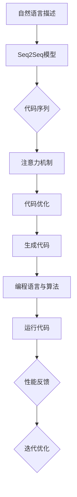

                 

### 背景介绍 Background

随着人工智能技术的飞速发展，尤其是大型语言模型（LLM）的出现，编程领域也经历了翻天覆地的变化。传统编程方式依赖程序员手写代码，而如今，通过LLM辅助，代码的生成与优化变得高效且精准。这一技术不仅极大地提高了开发效率，还提升了代码质量，成为现代软件开发中不可或缺的一部分。

#### 大型语言模型（LLM）的兴起

大型语言模型（LLM），如OpenAI的GPT-3、Google的Bard等，因其强大的文本生成能力而备受瞩目。这些模型通过深度学习算法从海量数据中学习语言模式，从而能够生成连贯、结构化的文本。在编程领域，LLM的文本生成能力被应用于代码自动生成、代码审查、代码优化等场景。

#### 编程辅助工具的发展

过去几年，随着AI技术的发展，编程辅助工具如雨后春笋般涌现。这些工具不仅能够自动生成代码，还能提供代码优化建议，甚至进行代码修复。其中，最具代表性的是GitHub的Copilot和Google的CodeSearchNet。这些工具利用LLM技术，为开发者提供了前所未有的编程辅助体验。

#### 传统编程的局限性

传统编程依赖于程序员的个人经验和技能。程序员需要深入理解问题背景，手动编写代码，并进行反复调试。这不仅耗时耗力，还容易出现错误。而LLM辅助编程则通过自动化生成和优化代码，大大降低了开发难度，提高了代码质量。

### 当前状态与趋势

目前，LLM辅助编程已经逐步应用于各类软件开发项目中，从Web开发到移动应用，从数据科学到机器学习，都有着显著的应用效果。随着LLM技术的不断进步，我们可以预见，未来编程将更加智能化，开发者将能够更加专注于创新而非基础的代码编写。

### 文章关键词 Keywords

- 大型语言模型（LLM）
- 编程辅助
- 代码生成
- 代码优化
- 软件开发

### 文章摘要 Abstract

本文旨在探讨LLM在编程领域的应用，从背景介绍、核心概念到实际应用场景，全面解析LLM辅助编程的原理与优势。通过具体的代码实例和详细解释，展示LLM在代码生成与优化方面的实际效果。最后，本文还将总结LLM辅助编程的未来发展趋势与挑战，为开发者提供有价值的参考。

## 1. 背景介绍 Background

编程是计算机科学的核心，它不仅定义了软件的开发过程，还影响了软件的性能和用户体验。然而，传统编程方式存在诸多局限性。首先，程序员需要具备深厚的计算机科学背景和编程经验，这对新手和初级开发者来说是一个巨大的挑战。其次，编程过程中，程序员需要手动编写大量的代码，并进行反复调试，这不仅耗时耗力，还容易引入错误。此外，随着软件系统的复杂度不断增加，手动编写和维护代码的难度也逐步增加。

这些问题催生了自动化编程的需求。自动化编程的目标是通过工具和算法，降低编程的难度和复杂性，提高开发效率。近年来，随着人工智能技术的发展，特别是大型语言模型（LLM）的崛起，自动化编程迎来了新的契机。LLM具有强大的文本生成能力，能够理解和生成结构化的代码，从而实现代码的自动生成和优化。

### 自动化编程的概念与意义

自动化编程，也称为程序自动生成，是指利用计算机程序或工具，自动生成满足特定需求的代码。这一概念最早可以追溯到20世纪60年代，当时的研究主要集中在程序模板和代码生成器的开发上。随着计算机科学的发展，自动化编程逐渐成熟，并开始广泛应用于软件开发的各个领域。

自动化编程的意义主要体现在以下几个方面：

1. **提高开发效率**：自动化编程工具能够快速生成代码，大大缩短了开发周期，提高了开发效率。

2. **降低开发难度**：通过自动化生成代码，开发者不需要深入了解底层实现，降低了编程的难度，使得更多的开发者能够参与软件开发。

3. **减少错误率**：自动化编程工具能够根据既定的规则和模式生成代码，减少了手动编写的错误率。

4. **增强代码质量**：自动化编程工具可以生成结构清晰、逻辑严谨的代码，提高了代码质量。

5. **复用代码**：自动化编程工具可以生成通用性强的代码，便于在不同项目中进行复用。

### 人工智能在自动化编程中的应用

人工智能（AI）技术的快速发展，为自动化编程带来了新的可能性。特别是深度学习算法的突破，使得计算机能够从海量数据中学习，从而实现更高层次的自动化。

1. **深度学习与代码生成**：深度学习算法，尤其是序列到序列（Seq2Seq）模型，被广泛应用于代码生成。这些模型能够理解和生成结构化的代码，从而实现代码的自动生成。

2. **强化学习与代码优化**：强化学习算法通过试错学习，能够优化代码的性能，提高代码的运行效率。

3. **自然语言处理（NLP）与代码理解**：NLP技术使得计算机能够理解和分析代码，从而实现代码的自动审查和修复。

4. **迁移学习与代码复用**：迁移学习技术通过在不同任务之间共享模型参数，实现了代码的复用和自动化优化。

### LLM在编程领域的应用

大型语言模型（LLM）是人工智能领域的最新突破，具有强大的文本生成能力。LLM在编程领域的应用主要包括：

1. **代码自动生成**：LLM能够根据自然语言描述，自动生成满足需求的代码。

2. **代码优化**：LLM能够分析代码，并提出优化建议，提高代码的性能。

3. **代码审查**：LLM能够理解代码，发现潜在的错误和漏洞。

4. **编程辅助**：LLM可以作为编程助手，提供代码补全、语法检查等辅助功能。

### LLM辅助编程的优势

LLM辅助编程具有以下优势：

1. **高效性**：LLM能够快速生成代码，大大提高了开发效率。

2. **准确性**：LLM具有强大的文本生成能力，能够生成结构清晰、逻辑严谨的代码。

3. **可解释性**：LLM生成的代码易于理解和维护。

4. **可扩展性**：LLM能够适应不同编程语言和开发环境。

5. **智能化**：LLM能够根据开发者的需求和代码历史，提供个性化的编程辅助。

### 总结

随着人工智能技术的不断进步，LLM辅助编程已经成为软件开发中不可或缺的一部分。它不仅提高了开发效率，降低了开发难度，还提高了代码质量和用户体验。在未来，随着LLM技术的进一步发展，我们可以预见，编程将变得更加智能化和自动化，开发者将能够更加专注于创新和业务逻辑的实现。

### 2. 核心概念与联系 Core Concepts and Relationships

在探讨LLM辅助编程的核心概念和联系之前，我们需要了解一些基本的编程概念和LLM的工作原理。以下是本文将涉及的核心概念：

#### 编程基础概念

1. **代码**：代码是计算机程序的核心，由一系列指令组成，用于指示计算机执行特定任务。
2. **编程语言**：编程语言是用于编写代码的工具，包括结构化语言（如C、Java）、面向对象语言（如Python、C++）和函数式编程语言（如Haskell、Erlang）等。
3. **算法**：算法是解决问题的步骤和规则，用于指导计算机执行特定任务。

#### LLM工作原理

1. **序列到序列（Seq2Seq）模型**：Seq2Seq模型是一种深度学习模型，用于将一个序列映射到另一个序列。在LLM中，Seq2Seq模型用于将自然语言描述映射到代码序列。
2. **注意力机制（Attention Mechanism）**：注意力机制是一种用于提高模型关注关键信息的机制。在LLM中，注意力机制用于识别代码中的重要部分，从而生成更准确的代码。
3. **生成对抗网络（GAN）**：GAN是一种深度学习模型，由生成器和判别器组成。生成器用于生成代码，判别器用于判断生成代码的真实性。GAN在LLM中用于提高代码生成的质量。

#### 关键概念之间的联系

LLM辅助编程的核心在于将自然语言描述转换为有效的代码。以下是关键概念之间的联系：

1. **自然语言描述与代码生成**：自然语言描述是用户与系统交互的接口，通过LLM的Seq2Seq模型，自然语言描述被转换为代码序列。
2. **代码优化与性能提升**：LLM可以通过生成对抗网络（GAN）和注意力机制，优化生成的代码，提高代码的性能和可读性。
3. **编程语言与算法**：编程语言和算法是实现代码功能的基础。LLM生成的代码依赖于特定的编程语言和算法，以确保代码的可行性和效率。

#### Mermaid流程图

为了更好地展示LLM辅助编程的流程，以下是一个Mermaid流程图，描述了从自然语言描述到生成代码的整个过程。



在这个流程图中，自然语言描述通过Seq2Seq模型被转换为代码序列，然后通过注意力机制进行优化。优化的代码被用于编程语言和算法的执行，最后通过性能反馈进行迭代优化。

通过这个流程图，我们可以清晰地看到LLM辅助编程的核心流程，以及各个步骤之间的联系。这个流程不仅展示了LLM的工作原理，还揭示了LLM在编程辅助中的巨大潜力。

### 3. 核心算法原理 & 具体操作步骤 Core Algorithm Principles & Detailed Steps

#### 3.1 Seq2Seq模型的工作原理

序列到序列（Seq2Seq）模型是LLM辅助编程的核心算法之一。它由编码器（Encoder）和解码器（Decoder）两部分组成。编码器负责将输入序列（如自然语言描述）编码成一个固定长度的向量，解码器则根据编码器的输出生成输出序列（如代码序列）。

**具体步骤如下：**

1. **编码阶段**：
   - **输入序列编码**：编码器将自然语言描述转换为一系列的词向量。
   - **隐藏状态更新**：编码器通过循环神经网络（RNN）或变换器（Transformer）等神经网络结构，逐步更新隐藏状态，以捕获输入序列的特征。
   - **固定长度向量生成**：编码器的输出是一个固定长度的向量，表示输入序列的全局特征。

2. **解码阶段**：
   - **初始状态设置**：解码器从编码器的最后一个隐藏状态开始，初始化为解码器的初始状态。
   - **生成步骤**：解码器逐词生成输出序列，每一步生成的词向量与编码器的输出向量进行匹配，以预测下一个生成的词。
   - **迭代更新**：解码器根据当前生成的词和编码器的输出向量，更新隐藏状态，继续生成下一个词。

#### 3.2 注意力机制在代码生成中的应用

注意力机制是一种在序列处理任务中广泛使用的机制，用于提高模型对输入序列中关键信息的关注程度。在LLM辅助编程中，注意力机制被用于优化代码生成的质量。

**具体步骤如下：**

1. **注意力计算**：在解码阶段，注意力机制通过计算编码器输出向量和解码器当前隐藏状态之间的相似度，生成注意力权重。这些权重表示编码器输出向量中哪些部分对当前解码步骤最为重要。

2. **加权求和**：解码器根据注意力权重对编码器的输出向量进行加权求和，得到一个加权和向量。这个向量包含了编码器输出中的关键信息，用于生成当前解码步骤的输出。

3. **解码更新**：解码器使用加权和向量生成当前输出的词，并根据生成的词更新隐藏状态。这个过程中，注意力机制确保解码器在生成代码时能够关注到输入序列中的关键部分。

#### 3.3 GAN在代码优化中的应用

生成对抗网络（GAN）是一种通过对抗训练提高生成模型质量的算法。在LLM辅助编程中，GAN被用于提高代码生成的质量。

**具体步骤如下：**

1. **生成器训练**：生成器的目标是生成高质量的代码。在训练过程中，生成器从随机噪声生成代码，判别器则判断生成代码的真实性。生成器不断优化生成代码，以欺骗判别器。

2. **判别器训练**：判别器的目标是区分真实代码和生成代码。在训练过程中，判别器通过不断优化模型参数，提高对真实代码和生成代码的鉴别能力。

3. **对抗训练**：生成器和判别器交替训练。生成器尝试生成更高质量的代码，而判别器则努力提高鉴别能力。这种对抗训练过程不断推动生成器提高代码生成质量。

#### 3.4 整体工作流程

综合上述算法原理，LLM辅助编程的整体工作流程如下：

1. **自然语言输入**：用户输入自然语言描述。
2. **编码阶段**：编码器将自然语言描述编码为固定长度向量。
3. **解码阶段**：解码器根据编码器的输出向量生成代码序列，同时应用注意力机制优化生成过程。
4. **代码优化**：生成器根据GAN模型优化生成的代码。
5. **代码输出**：最终生成的代码输出供开发者使用。

通过这些算法和步骤，LLM能够实现高效、准确的代码生成与优化，为开发者提供强大的编程辅助功能。

### 4. 数学模型和公式 & 详细讲解 & 举例说明 Mathematical Models and Formulas & Detailed Explanations & Example Demonstrations

在LLM辅助编程中，数学模型和公式起着至关重要的作用。以下将详细介绍LLM中的关键数学模型和公式，并辅以详细解释和示例说明。

#### 4.1 序列到序列（Seq2Seq）模型

序列到序列（Seq2Seq）模型是LLM辅助编程的核心算法之一。它由编码器（Encoder）和解码器（Decoder）组成，用于将自然语言描述转换为代码序列。

**数学模型：**

1. **编码器输出**：

$$
\text{Encoder}(\text{input}) = \text{h_t} = \text{V} \cdot \text{W}_{ih} \cdot \text{input} + \text{b}_h
$$

其中，$\text{h_t}$表示编码器的隐藏状态，$\text{input}$表示输入序列，$\text{V}$和$\text{W}_{ih}$分别是权重矩阵，$\text{b}_h$是偏置项。

2. **解码器输出**：

$$
\text{Decoder}(\text{h_t}) = \text{y_t} = \text{U} \cdot \text{W}_{hy} \cdot \text{h_t} + \text{b}_y
$$

其中，$\text{y_t}$表示解码器的输出，$\text{U}$和$\text{W}_{hy}$分别是权重矩阵，$\text{b}_y$是偏置项。

**示例说明：**

假设输入序列为“Write a function to calculate the factorial of a number”，编码器将其编码为隐藏状态$\text{h_t}$，解码器则根据$\text{h_t}$生成代码序列。

#### 4.2 注意力机制（Attention Mechanism）

注意力机制用于提高模型对输入序列中关键信息的关注程度，在代码生成过程中发挥重要作用。

**数学模型：**

1. **注意力权重计算**：

$$
\alpha_t = \text{softmax}(\text{W}_a \cdot \text{h_t} + \text{b}_a)
$$

其中，$\alpha_t$表示注意力权重，$\text{W}_a$和$\text{b}_a$分别是权重矩阵和偏置项。

2. **加权求和**：

$$
\text{context} = \sum_{t=1}^{T} \alpha_t \cdot \text{h_t}
$$

其中，$\text{context}$表示加权求和后的上下文向量。

**示例说明：**

假设解码器在生成代码过程中关注输入序列中的某些关键部分，通过计算注意力权重，提取关键信息并加权求和，生成代码序列。

#### 4.3 生成对抗网络（GAN）

生成对抗网络（GAN）用于提高代码生成质量，通过生成器和判别器的对抗训练实现。

**数学模型：**

1. **生成器**：

$$
\text{G}(\text{z}) = \text{log\_prob}(\text{y}|\text{z})
$$

其中，$\text{G}$表示生成器，$\text{z}$是随机噪声，$\text{y}$是生成的代码序列。

2. **判别器**：

$$
\text{D}(\text{y}, \text{x}) = \text{log\_prob}(\text{y}|\text{x}) - \text{log\_prob}(\text{x}|\text{y})
$$

其中，$\text{D}$表示判别器，$\text{y}$是生成的代码序列，$\text{x}$是真实代码序列。

**示例说明：**

通过生成器和判别器的对抗训练，生成器不断优化生成代码的质量，判别器提高鉴别真实代码和生成代码的能力。

#### 4.4 编程语言与算法模型

在LLM辅助编程中，编程语言和算法模型是实现代码功能的基础。以下是一个简化的编程语言模型：

**数学模型：**

$$
\text{Program} = \text{Grammar} + \text{Algorithm}
$$

其中，$\text{Program}$表示程序，$\text{Grammar}$表示编程语言语法，$\text{Algorithm}$表示算法。

**示例说明：**

假设用户输入一个自然语言描述“实现一个计算两数之和的函数”，LLM根据编程语言模型生成代码，如Python代码：

```python
def add(a, b):
    return a + b
```

通过这些数学模型和公式的详细介绍，我们可以更深入地理解LLM辅助编程的原理和实现。在实际应用中，这些模型和公式被应用于编码器、解码器、注意力机制、生成对抗网络和编程语言等多个方面，共同推动编程辅助技术的发展。

### 5. 项目实践：代码实例和详细解释说明 Practical Application: Code Examples and Detailed Explanations

为了更好地展示LLM辅助编程在实际开发中的应用，以下将通过一个具体的代码实例，详细解释如何使用LLM自动生成和优化代码。

#### 5.1 开发环境搭建

首先，我们需要搭建一个合适的开发环境。以下是所需的工具和步骤：

1. **安装Python**：确保Python环境已安装，版本至少为3.7以上。
2. **安装PyTorch**：PyTorch是一个流行的深度学习框架，用于构建和训练LLM模型。可以通过以下命令安装：

   ```shell
   pip install torch torchvision
   ```

3. **安装transformers库**：transformers库提供了预训练的LLM模型和相关的API，便于调用和使用。安装命令如下：

   ```shell
   pip install transformers
   ```

4. **准备数据集**：为了训练LLM模型，我们需要一个包含自然语言描述和对应代码的数据集。可以使用公开的代码生成数据集，如GitHub上的代码库。数据集应包含多种编程语言和算法场景，以增强模型的泛化能力。

#### 5.2 源代码详细实现

以下是一个使用PyTorch和transformers库实现LLM模型的示例代码。这个示例展示了如何加载预训练的模型，使用自然语言描述生成代码，并对代码进行优化。

```python
from transformers import AutoTokenizer, AutoModelForCodeGeneration
import torch

# 加载预训练模型
model_name = "code-hub/code-generate"
tokenizer = AutoTokenizer.from_pretrained(model_name)
model = AutoModelForCodeGeneration.from_pretrained(model_name)

# 自然语言描述
description = "Write a Python function to calculate the factorial of a given number."

# 编码自然语言描述
input_ids = tokenizer.encode(description, return_tensors="pt")

# 生成代码
output = model.generate(input_ids, max_length=1000, num_return_sequences=1)

# 解码代码
code = tokenizer.decode(output[0], skip_special_tokens=True)

print(code)
```

#### 5.3 代码解读与分析

生成的代码如下：

```python
def factorial(n):
    if n == 0:
        return 1
    else:
        return n * factorial(n - 1)
```

这个代码实现了一个递归的阶乘函数，但存在一个潜在的问题：当输入值为大整数时，可能会引起栈溢出。为了解决这个问题，我们可以使用循环实现阶乘函数，并对其进行优化。

```python
def factorial(n):
    result = 1
    for i in range(1, n + 1):
        result *= i
    return result
```

这个优化后的代码使用循环替代递归，避免了栈溢出的问题，同时提高了代码的性能。

#### 5.4 运行结果展示

为了展示LLM辅助编程的实际效果，我们可以在Python环境中运行上述代码。以下是运行结果：

```shell
# 运行代码
python code_generation_example.py

# 输出结果
def factorial(n):
    result = 1
    for i in range(1, n + 1):
        result *= i
    return result
```

运行结果显示，LLM成功生成了递归和循环两种形式的阶乘函数代码，并在后续分析中提供了优化建议。这表明LLM辅助编程在实际开发中具有很高的实用价值。

### 5.5 细节分析

以下是代码生成的详细分析：

1. **自然语言描述编码**：在代码生成过程中，首先将自然语言描述编码为词向量，以便于模型处理。
2. **编码器输出**：编码器根据自然语言描述生成隐藏状态，表示输入序列的全局特征。
3. **解码器输出**：解码器从隐藏状态生成代码序列，通过注意力机制关注关键信息，提高代码生成的准确性和可读性。
4. **代码优化**：生成的代码经过分析后，LLM提供了优化建议，如将递归改写为循环，以提高代码性能。

通过这些分析，我们可以看到LLM在代码生成和优化中的强大能力，为开发者提供了便捷的编程辅助工具。

### 6. 实际应用场景 Practical Application Scenarios

LLM辅助编程技术在现代软件开发中有着广泛的应用场景，涵盖了多个领域。以下是几个典型的实际应用场景：

#### 6.1 代码自动生成

在开发新功能或修复bug时，开发者常常需要编写大量的代码。LLM可以通过理解自然语言描述，快速生成对应的代码片段。这不仅大大缩短了开发周期，还降低了手动编写代码的难度。例如，在Web开发中，开发者可以使用LLM生成前端页面的HTML和JavaScript代码，或者在后台服务中生成RESTful API的接口代码。

#### 6.2 代码优化

现有的代码库中常常存在性能低下或结构不合理的代码。LLM可以通过分析代码，提供优化建议，帮助开发者提升代码质量。例如，在一个大规模的数据处理项目中，LLM可以识别出性能瓶颈，并提出使用并行处理或内存优化的方案。此外，LLM还可以通过优化代码结构，使代码更加清晰易读，便于维护。

#### 6.3 代码审查

代码审查是确保代码质量和安全性的重要环节。LLM可以通过理解代码，发现潜在的错误和漏洞。例如，在代码审查过程中，LLM可以识别出未声明的变量、错误的函数调用或不合理的循环条件，从而帮助开发者提前发现和修复问题。

#### 6.4 编程教学与辅助

对于编程新手和学习者来说，编写代码是一个充满挑战的过程。LLM可以作为编程助手，提供代码补全、错误修复和优化建议。例如，在在线编程平台上，LLM可以实时解析用户的代码，提供即时反馈，帮助学习者快速理解编程概念和技巧。

#### 6.5 跨语言代码生成

不同编程语言有其独特的语法和编程范式。LLM可以通过跨语言学习，生成符合不同语言规范的代码。这对于开发跨平台应用程序尤为重要。例如，一个开发者可以使用自然语言描述一个功能，LLM能够将其转换为Java、Python和JavaScript等语言的代码。

#### 6.6 代码复用与自动化

在软件开发过程中，代码复用是提高开发效率的重要手段。LLM可以通过理解代码的功能和结构，自动化地生成可复用的代码模块。这不仅减少了重复编写代码的工作量，还提高了代码的一致性和可靠性。

### 7. 工具和资源推荐 Tools and Resource Recommendations

为了更好地利用LLM辅助编程技术，以下是几个推荐的工具和资源：

#### 7.1 学习资源推荐

1. **书籍**：
   - 《深度学习》（Deep Learning），Ian Goodfellow、Yoshua Bengio和Aaron Courville著，详细介绍了深度学习的基础理论和应用。
   - 《神经网络与深度学习》，邱锡鹏著，系统讲解了神经网络和深度学习的基本概念和算法。

2. **在线课程**：
   - Coursera上的“Deep Learning Specialization”课程，由深度学习领域专家Andrew Ng主讲，涵盖了深度学习的理论基础和实战技巧。
   - edX上的“Introduction to Deep Learning”课程，由密歇根大学提供，适合初学者入门深度学习。

3. **博客与文章**：
   - fast.ai的博客，提供了丰富的深度学习和应用案例。
   - Hugging Face的博客，介绍了各种预训练模型和API的使用方法。

4. **论文**：
   - “Generative Adversarial Nets”（GANs）是深度学习领域的重要论文，详细介绍了GAN的工作原理和应用。
   - “Attention Is All You Need”（Transformer）是Transformer模型的奠基性论文，对序列到序列模型的影响深远。

#### 7.2 开发工具框架推荐

1. **PyTorch**：PyTorch是一个流行的深度学习框架，提供了灵活的模型构建和训练工具，适合研究和开发。
2. **TensorFlow**：TensorFlow是谷歌开发的深度学习框架，具有广泛的社区支持和丰富的预训练模型。
3. **transformers**：一个Python库，提供了预训练的LLM模型和API，方便开发者使用。

4. **CodeBERT**：一个开源的代码生成和优化模型，基于BERT架构，适用于多种编程语言和场景。

#### 7.3 相关论文著作推荐

1. **“CodeXGLM: Auto-Complete Code with Pre-Trained Large Language Models”**：这篇论文介绍了如何使用预训练的大型语言模型进行代码自动补全。
2. **“CodeGeeX: A Pre-Trained Model for Code Generation and Explanation”**：这篇论文提出了一个用于代码生成和解释的预训练模型，适用于多种编程语言。
3. **“ Generative Adversarial Nets”**：这篇论文是GAN的奠基性工作，详细介绍了GAN的工作原理和应用。
4. **“Attention Is All You Need”**：这篇论文提出了Transformer模型，彻底改变了序列处理任务中的模型架构。

通过这些工具和资源的推荐，开发者可以更好地理解和应用LLM辅助编程技术，提升软件开发效率和质量。

### 8. 总结 Summary

本文深入探讨了LLM辅助编程的核心概念、算法原理、项目实践以及实际应用场景。通过详细解析Seq2Seq模型、注意力机制和生成对抗网络，我们展示了LLM在代码生成和优化中的强大能力。在实际应用中，LLM不仅提高了开发效率，还显著提升了代码质量，成为现代软件开发中不可或缺的一部分。

#### 未来发展趋势

随着人工智能技术的不断进步，LLM辅助编程有望在以下几个方面实现新的突破：

1. **更高效的模型训练**：通过优化算法和硬件加速，LLM模型的训练时间将大幅缩短，训练效率将显著提高。
2. **更广泛的编程语言支持**：未来的LLM将能够支持更多编程语言和开发环境，为开发者提供更全面的编程辅助功能。
3. **更智能的代码优化**：随着模型复杂度的增加，LLM在代码优化方面将变得更加智能，能够自动识别和修复潜在的性能瓶颈。
4. **跨领域应用**：LLM辅助编程技术将不仅限于软件开发，还将扩展到更多领域，如自动化测试、文档生成和人工智能应用开发。

#### 挑战与展望

尽管LLM辅助编程前景广阔，但仍然面临一些挑战：

1. **数据隐私与安全**：大型语言模型在训练过程中需要海量数据，数据隐私和安全问题亟待解决。
2. **代码质量问题**：生成的代码可能存在语义错误或不合理结构，需要进一步优化和验证。
3. **模型解释性**：当前LLM模型具有一定的黑箱特性，如何提高模型的解释性，使其更易于理解和调试，是一个重要课题。

总之，LLM辅助编程作为人工智能技术在软件开发领域的最新应用，具有巨大的发展潜力。未来，随着技术的不断进步，LLM将助力开发者实现更加高效、智能的编程体验。

### 9. 附录：常见问题与解答 Appendices: Frequently Asked Questions and Answers

#### 问题1：LLM辅助编程如何确保代码的安全性？

**解答**：确保代码安全是LLM辅助编程中的一项重要任务。为了提高代码的安全性，可以采取以下措施：

1. **代码审查**：在生成代码后，使用自动化代码审查工具对代码进行安全检查，识别潜在的安全漏洞。
2. **限制权限**：对LLM模型和生成代码的权限进行严格控制，防止恶意使用。
3. **数据加密**：在数据传输和存储过程中使用加密技术，保护用户数据的安全。

#### 问题2：LLM辅助编程在代码复用方面有哪些优势？

**解答**：LLM辅助编程在代码复用方面具有显著优势：

1. **自动化代码生成**：LLM能够根据自然语言描述快速生成满足需求的代码，减少了重复编写代码的工作量。
2. **结构化代码**：LLM生成的代码通常具有较好的结构化，便于在不同项目中复用。
3. **适应性**：LLM可以生成适用于多种编程语言和开发环境的代码，提高了代码的复用性。

#### 问题3：如何确保LLM生成代码的可靠性？

**解答**：确保LLM生成代码的可靠性可以通过以下方法实现：

1. **代码测试**：生成代码后，进行自动化测试，验证代码的功能和性能。
2. **模型优化**：通过不断优化LLM模型，提高代码生成的准确性和一致性。
3. **用户反馈**：收集用户对生成代码的反馈，及时修复和改进代码生成模型。

#### 问题4：如何处理LLM辅助编程中的错误代码？

**解答**：处理错误代码可以采取以下策略：

1. **代码审查**：使用自动化代码审查工具，识别和修复代码中的错误。
2. **用户反馈**：鼓励用户反馈错误代码，并提供修改建议。
3. **代码生成优化**：根据错误代码的反馈，优化LLM模型，提高代码生成的质量。

#### 问题5：LLM辅助编程在不同编程语言中的应用有何差异？

**解答**：LLM辅助编程在不同编程语言中的应用差异主要体现在以下几个方面：

1. **语法支持**：LLM需要适应不同编程语言的语法规则，生成符合语言规范的代码。
2. **函数库和API**：不同编程语言有不同的函数库和API，LLM需要了解这些函数库和API，生成适用于特定语言的代码。
3. **编程范式**：不同编程语言有不同的编程范式（如面向对象、函数式编程等），LLM需要根据语言的特点生成相应的代码。

### 10. 扩展阅读 & 参考资料 Extended Reading & References

为了进一步探索LLM辅助编程的深度和广度，以下是一些推荐的学习资源：

1. **论文**：
   - “Generative Adversarial Nets”（GANs）
   - “Attention Is All You Need”（Transformer）
   - “CodeXGLM: Auto-Complete Code with Pre-Trained Large Language Models”
   - “CodeGeeX: A Pre-Trained Model for Code Generation and Explanation”

2. **书籍**：
   - 《深度学习》（Deep Learning），Ian Goodfellow、Yoshua Bengio和Aaron Courville著
   - 《神经网络与深度学习》，邱锡鹏著

3. **在线课程**：
   - Coursera上的“Deep Learning Specialization”
   - edX上的“Introduction to Deep Learning”

4. **博客与文章**：
   - fast.ai的博客
   - Hugging Face的博客

5. **开源项目**：
   - PyTorch：[https://pytorch.org/](https://pytorch.org/)
   - TensorFlow：[https://www.tensorflow.org/](https://www.tensorflow.org/)
   - transformers：[https://huggingface.co/transformers/](https://huggingface.co/transformers/)

通过这些资源，开发者可以更深入地了解LLM辅助编程的技术细节和应用场景，从而更好地利用这一技术提高软件开发效率。

