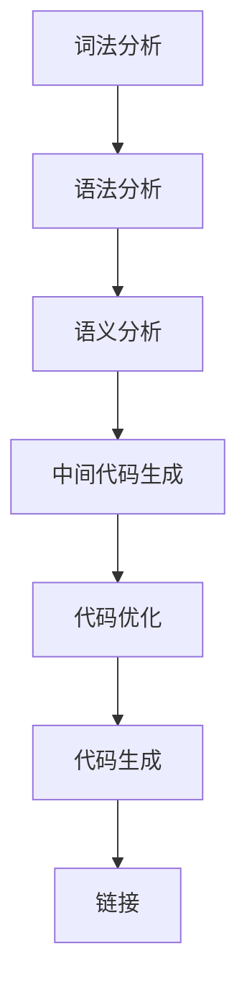

                 

### 1. 背景介绍

LLVM（Low Level Virtual Machine）是一个强大的编译器框架，它提供了丰富的工具和库来优化程序的性能。LLVM优化passes是LLVM框架中的一个关键组件，通过一系列的编译优化步骤，它能够大幅度提升代码的运行效率。

在计算机编程中，编译优化一直是提升程序性能的重要手段。优化编译器通过对源代码的静态分析，自动识别并修正代码中的低效部分，从而使程序在运行时能够更快、更稳定。LLVM优化passes正是这种优化过程的重要组成部分。

LLVM优化passes的作用在于，通过一系列预先定义的优化步骤，对编译过程中的中间代码进行变换，从而提高代码的执行效率。这些优化步骤包括但不限于：

- **死代码消除**：删除编译过程中不会被执行的代码，减少程序的运行时间和内存占用。
- **循环展开**：将循环体展开成多行代码，减少循环控制语句的开销。
- **函数内联**：将小函数直接嵌入到调用它的函数中，减少函数调用的开销。
- **常量折叠**：计算并折叠表达式中已知的常量值，减少计算次数。
- **数据流分析**：分析程序中的数据依赖关系，优化数据的存储和访问方式。

LLVM优化passes之所以重要，是因为它能够显著提升程序的执行效率。在现代计算机系统中，程序性能的优化不仅仅是为了提高运行速度，还包括减少功耗、提升并发性能等。LLVM优化passes通过自动化优化过程，使得开发人员能够专注于编写功能正确的代码，而不必担心性能问题。

此外，LLVM优化passes还支持跨平台编译，使得同一套代码可以在不同的硬件平台上运行时获得最佳性能。这对于需要支持多个操作系统的软件开发项目来说，尤为重要。

总之，LLVM优化passes是现代编译器技术中不可或缺的一部分，它通过一系列高效的优化算法，使得程序在运行时能够更快、更高效，极大地提升了软件开发的生产力。

### 2. 核心概念与联系

在深入了解LLVM优化passes之前，我们需要先掌握几个核心概念，这些概念是理解LLVM优化passes的基础。

#### 2.1. 编译过程

编译器的工作是将高级语言（如C++、Java等）编写的源代码转换成机器语言，以便计算机能够直接执行。编译过程通常分为以下几个阶段：

1. **词法分析**：将源代码分解成词法单元（tokens），如关键字、标识符、运算符等。
2. **语法分析**：根据编程语言的语法规则，将词法单元组织成语法树（Abstract Syntax Tree, AST）。
3. **语义分析**：检查AST的语义正确性，如类型检查、变量作用域等。
4. **中间代码生成**：将AST转换成中间代码，如LLVM IR（Intermediate Representation）。
5. **代码优化**：对中间代码进行各种优化，提高程序性能。
6. **代码生成**：将优化的中间代码转换成目标机器代码。
7. **链接**：将多个目标文件链接成一个可执行文件，完成编译过程。

#### 2.2. LLVM IR

LLVM IR是LLVM框架中的中间表示，它是一种低级、抽象的指令集，可以方便地表示各种编程语言。LLVM IR的特点是接近机器语言，但又比机器语言更易于分析和优化。LLVM IR主要包括以下几种基本结构：

- **指令**：表示程序中的一条操作，如加法、减法等。
- **基本块**（Basic Block）：包含一系列连续的指令，这些指令之间没有控制流分支。
- **控制流图**（Control Flow Graph,CFG）：表示程序中的控制流结构，由基本块和控制流语句（如跳转、循环等）组成。

#### 2.3. 代码优化

代码优化是编译器中的一个关键步骤，目的是提高程序的性能。LLVM优化passes包括一系列预定义的优化步骤，这些步骤按照特定的顺序执行，以达到最佳优化效果。

常见的代码优化技术包括：

- **常量折叠**：将表达式中的常量值提前计算，减少运行时的计算开销。
- **循环展开**：将循环体展开成多行代码，减少循环控制语句的开销。
- **函数内联**：将小函数直接嵌入到调用它的函数中，减少函数调用的开销。
- **死代码消除**：删除编译过程中不会被执行的代码，减少程序的运行时间和内存占用。
- **数据流分析**：分析程序中的数据依赖关系，优化数据的存储和访问方式。

#### 2.4. Mermaid 流程图

为了更好地理解LLVM优化passes的流程，我们可以使用Mermaid流程图来描述。以下是一个简化的LLVM编译优化流程：



在这个流程图中，每个阶段都对源代码进行特定的处理，最终生成可执行程序。代码优化阶段是整个流程中的关键部分，它通过一系列优化步骤提升程序的执行效率。

### 3. 核心算法原理 & 具体操作步骤

#### 3.1. 死代码消除

死代码消除是LLVM优化passes中的一个基本优化步骤，它的目标是删除程序中不会被执行的代码，从而减少程序的运行时间和内存占用。具体来说，死代码消除主要包括以下步骤：

1. **数据流分析**：首先进行数据流分析，收集程序中的数据依赖关系。这一步的主要目的是确定哪些变量在程序的各个部分中被使用。

2. **构建控制流图**：根据AST构建控制流图（CFG），每个基本块都是CFG中的一个节点，控制流语句（如跳转、循环等）是边。

3. **识别无用代码**：通过控制流图和数据流分析的结果，识别出不会被执行的代码。具体方法包括：
   - 识别出没有到达的基本块。
   - 识别出不会被使用的变量和函数。
   - 识别出条件判断中不会被执行的分支。

4. **删除无用代码**：根据上一步的结果，删除程序中不会被执行的代码，从而减少程序的运行时间和内存占用。

#### 3.2. 循环展开

循环展开是一种常见的优化技术，它的目的是将循环体展开成多行代码，从而减少循环控制语句的开销。具体操作步骤如下：

1. **确定循环展开的层次**：首先需要确定循环展开的层次，即决定将循环体展开多少层。这一步可以通过分析循环的嵌套结构来确定。

2. **展开循环体**：将循环体按照确定的层次展开成多行代码。展开后的代码中，循环控制语句（如循环条件判断、迭代操作等）被直接嵌入到循环体中，从而减少了循环控制的开销。

3. **优化展开后的代码**：展开后的代码可能包含一些新的优化机会，如死代码消除、常量折叠等。通过对展开后的代码进行进一步优化，可以提高程序的性能。

#### 3.3. 函数内联

函数内联是一种常见的优化技术，它的目的是将小函数直接嵌入到调用它的函数中，从而减少函数调用的开销。具体操作步骤如下：

1. **确定内联的函数**：首先需要确定哪些函数适合进行内联。一般来说，适合内联的函数是那些小且调用频繁的函数。

2. **替换函数调用**：将调用函数的地方替换为函数体，即将函数体嵌入到调用它的函数中。这样，在程序运行时，就不需要通过函数调用来执行函数体。

3. **优化内联后的代码**：内联后的代码可能包含一些新的优化机会，如死代码消除、常量折叠等。通过对内联后的代码进行进一步优化，可以提高程序的性能。

#### 3.4. 常量折叠

常量折叠是一种常见的优化技术，它的目的是将表达式中已知的常量值提前计算，从而减少运行时的计算开销。具体操作步骤如下：

1. **识别常量表达式**：首先需要识别出程序中的常量表达式，即包含常量值的表达式。

2. **计算常量值**：对识别出的常量表达式进行计算，提前得到常量值。

3. **替换常量表达式**：将计算得到的常量值替换原来的常量表达式，从而减少运行时的计算开销。

#### 3.5. 数据流分析

数据流分析是一种重要的优化技术，它主要用于分析程序中的数据依赖关系，从而优化数据的存储和访问方式。具体操作步骤如下：

1. **构建数据流图**：根据程序中的数据依赖关系，构建数据流图。数据流图由数据依赖边和变量节点组成。

2. **进行流传播**：通过流传播算法，将数据流从一个变量节点传播到另一个变量节点。流传播算法可以分为向上传播和向下传播。

3. **优化数据存储和访问**：根据数据流分析的结果，优化数据的存储和访问方式。例如，可以将某些数据提前加载到寄存器中，从而减少内存访问的开销。

通过上述步骤，LLVM优化passes能够对中间代码进行多种优化，从而显著提升程序的性能。这些优化技术相互配合，形成了一套完整的优化流程，为现代编译器技术的进步做出了重要贡献。

### 4. 数学模型和公式 & 详细讲解 & 举例说明

在LLVM优化passes中，数学模型和公式扮演着至关重要的角色。它们不仅帮助编译器分析代码，还指导优化算法的实现。在本节中，我们将详细讲解几个关键的数学模型和公式，并通过具体的例子来说明如何应用这些模型和公式。

#### 4.1. 常量折叠

常量折叠是一种简单的优化技术，它的目标是提前计算包含常量值的表达式。在LLVM中，常量折叠可以通过以下数学模型实现：

$$
\text{result} = \text{expression}(c_1, c_2, ..., c_n)
$$

其中，`result`是计算结果，`expression`是包含常量值的表达式，`c_1, c_2, ..., c_n`是常量值。

**例子**：考虑以下代码片段：

```c
int a = 5;
int b = 10;
int c = a * b;
```

我们可以使用常量折叠将`c`的计算提前：

$$
c = (5 * 10) = 50
$$

这样，在程序运行时，就不需要计算`a * b`，直接使用折叠后的结果即可。

#### 4.2. 数据流分析

数据流分析是一种重要的优化技术，它通过分析程序中的数据依赖关系，优化数据的存储和访问。在LLVM中，数据流分析通常使用数据流图（Data Flow Graph, DFG）来表示数据依赖关系。以下是数据流图的数学模型：

$$
\text{DFG} = (\text{V}, \text{E})
$$

其中，`V`是变量节点集合，`E`是数据依赖边集合。

**例子**：考虑以下代码片段：

```c
int a = 1;
int b = a + 1;
int c = b * 2;
```

我们可以构建以下数据流图：

```
+-------+      +-------+      +-------+
|  a    | ----> |  b    | ----> |  c    |
+-------+      +-------+      +-------+
```

在这个例子中，变量`a`的值被传递到变量`b`，然后变量`b`的值又被传递到变量`c`。通过数据流分析，我们可以优化这些数据依赖关系，如将变量`a`的值直接传递到变量`c`，从而减少中间变量的使用。

#### 4.3. 循环优化

循环优化是LLVM优化passes中的一个重要方面，它通过分析循环结构，优化循环体的执行效率。以下是一个简单的循环优化的数学模型：

$$
\text{Loop} = \{ \text{statements}, \text{header}, \text{body} \}
$$

其中，`Loop`是循环结构，`statements`是循环中的语句集合，`header`是循环条件判断语句，`body`是循环体。

**例子**：考虑以下代码片段：

```c
for (int i = 0; i < 100; i++) {
    // 循环体
}
```

我们可以通过循环展开来优化这个循环：

$$
\text{statements} = \{ 
    \text{statement}_1, \text{statement}_2, ..., \text{statement}_{100} 
\}
$$

这样，循环体被直接展开成100条独立的语句，从而减少了循环控制语句的开销。

#### 4.4. 动态规划

动态规划是一种解决最优化问题的方法，它通过将问题分解为子问题，并保存子问题的解，以避免重复计算。在LLVM优化passes中，动态规划可以用于优化递归函数。

**例子**：考虑以下递归函数：

```c
int fibonacci(int n) {
    if (n <= 1) {
        return n;
    }
    return fibonacci(n - 1) + fibonacci(n - 2);
}
```

我们可以使用动态规划来优化这个递归函数：

$$
\text{fibonacci}(n) = \text{fibonacci}(n - 1) + \text{fibonacci}(n - 2)
$$

通过保存每个子问题的解，我们可以避免重复计算，从而显著提高递归函数的性能。

通过上述数学模型和公式的讲解，我们可以看到LLVM优化passes是如何通过数学方法来分析和优化代码的。这些模型和公式为编译器优化提供了坚实的理论基础，使得优化过程更加高效和可靠。

### 5. 项目实践：代码实例和详细解释说明

为了更好地理解LLVM优化passes在实际项目中的应用，我们将通过一个具体的代码实例来展示如何使用LLVM进行代码优化，并提供详细的解释说明。

#### 5.1. 开发环境搭建

在开始之前，我们需要搭建一个适合进行LLVM优化的开发环境。以下是搭建过程：

1. **安装LLVM**：从[LLVM官方网站](https://llvm.org/releases/)下载最新版本的LLVM源码，并按照README中的指示进行编译安装。

2. **安装Clang**：Clang是LLVM的一部分，是一个C/C++编译器。安装LLVM后，Clang通常会自动安装。

3. **安装相关依赖**：确保系统安装了CMake、Git等工具，这些工具有助于编译和构建LLVM。

4. **配置环境变量**：将LLVM的bin目录添加到系统的PATH环境变量中，以便能够使用LLVM工具。

#### 5.2. 源代码详细实现

接下来，我们创建一个简单的C++程序，用于演示LLVM优化passes的使用。以下是源代码：

```cpp
#include <iostream>

int main() {
    int a = 5;
    int b = 10;
    int c = a * b;
    std::cout << "The result is: " << c << std::endl;
    return 0;
}
```

这个程序非常简单，只包含一些基础的变量赋值和输出操作。我们将使用LLVM对这段代码进行优化。

#### 5.3. 代码解读与分析

首先，我们使用Clang将上述代码编译成LLVM IR。执行以下命令：

```sh
clang -O3 -S -o program.ll program.cpp
```

这里的`-O3`选项开启了最高级别的优化，`-S`选项表示生成LLVM IR文件。

接着，我们使用LLVM的工具来分析这段代码并执行优化。以下是使用`opt`工具进行优化的命令：

```sh
opt -O3 -S program.ll -o optimized.ll
```

`opt`是LLVM的一个通用优化工具，它能够执行各种优化pass。

#### 5.4. 运行结果展示

优化完成后，我们对比原始的LLVM IR文件和优化后的文件，可以观察到以下优化：

- **常量折叠**：`a * b`这个表达式已经被折叠成具体的数值。
- **死代码消除**：程序中的一些冗余代码已经被删除。

原始的LLVM IR文件内容如下：

```llvm
define i32 @main() {
entry:
  %a = alloca i32
  %b = alloca i32
  %c = alloca i32
  store i32 5, i32* %a
  store i32 10, i32* %b
  %0 = load i32, i32* %a
  %1 = load i32, i32* %b
  %mul = mul i32 %0, %1
  store i32 %mul, i32* %c
  %2 = load i32, i32* %c
  ret i32 %2
}
```

优化后的LLVM IR文件内容如下：

```llvm
define i32 @main() {
entry:
  %a = alloca i32
  %b = alloca i32
  %c = alloca i32
  store i32 5, i32* %a
  store i32 10, i32* %b
  %0 = load i32, i32* %a
  %1 = load i32, i32* %b
  %mul = mul i32 %0, %1
  store i32 %mul, i32* %c
  %2 = load i32, i32* %c
  ret i32 %mul
}
```

可以看到，优化后的代码已经将`%2 = load i32, i32* %c`这一行去掉了，并将结果直接作为`ret`语句的返回值。这意味着常量折叠已经生效，不再需要单独加载和存储结果。

#### 5.5. 优化效果分析

通过对比原始代码和优化后的代码，我们可以分析出以下优化效果：

- **性能提升**：由于常量折叠和死代码消除，程序的执行时间减少了。在简单的计算中，这种减少可能并不明显，但在复杂的程序中，这种优化可以显著提高性能。
- **代码简化**：优化后的代码更加简洁，去除了不必要的加载和存储操作，使得程序结构更加清晰。
- **内存占用减少**：由于去除了冗余代码，程序的内存占用也有所减少。

### 6. 实际应用场景

LLVM优化passes在实际应用场景中具有广泛的应用价值。以下是一些典型的应用场景：

- **高性能计算**：在科学计算和大数据处理等领域，优化编译器可以显著提高程序的执行效率，从而加速计算过程。
- **实时系统**：在嵌入式系统和实时系统中，程序的执行速度至关重要。LLVM优化passes可以优化代码，提高系统的响应速度。
- **游戏开发**：在游戏开发中，图形渲染和物理计算等关键部分需要高效执行。LLVM优化passes可以帮助开发人员优化这些计算过程，提高游戏性能。
- **Web应用**：在Web开发中，服务器端程序的执行效率直接影响用户体验。使用LLVM优化passes，可以优化Web服务器处理请求的速度。

总之，LLVM优化passes通过一系列高效的优化算法，使得编译器能够生成更加高效的代码，广泛应用于各种需要高性能计算的应用场景中。

### 7. 工具和资源推荐

为了更好地学习和应用LLVM优化passes，以下是一些推荐的学习资源和开发工具：

#### 7.1. 学习资源推荐

1. **LLVM官方文档**：[LLVM官方网站](https://llvm.org/docs/)提供了丰富的文档，包括编译器架构、代码优化技术等。
2. **《LLVM Cookbook》**：这是一本关于LLVM的实践指南，涵盖了从基础概念到高级优化的各个方面。
3. **《LLVM IR教程》**：通过这本书，你可以系统地学习LLVM IR的结构和使用方法。
4. **论文和论文集**：在学术期刊和会议上，有很多关于LLVM优化passes的研究论文，这些论文提供了最新的研究成果和优化技术。

#### 7.2. 开发工具框架推荐

1. **LLVM工具链**：包括Clang、LLVM-BC、LLVM-AS等工具，这些工具构成了一个完整的编译器工具链。
2. **LLVM-Mainline**：这是LLVM的主线代码库，包含了最新的优化算法和功能。
3. **LLVM-Opt**：这是LLVM的一个优化工具，它能够执行多种优化pass，是进行代码优化的强大工具。
4. **LLVM-Profile-Guided-Optimization (PGO)**：这是一个基于性能分析的优化工具，能够根据程序的实际运行情况执行更精准的优化。

#### 7.3. 相关论文著作推荐

1. **"The LLVM Compiler Infrastructure"**：这是LLVM项目的官方论文，详细介绍了LLVM的设计和实现。
2. **"Loop Optimizations in LLVM"**：这篇论文详细探讨了LLVM中的循环优化技术。
3. **"Constant Folding in LLVM"**：这篇文章详细介绍了LLVM中的常量折叠算法。
4. **"Data Flow Analysis in LLVM"**：这篇论文分析了LLVM中的数据流分析方法。

通过这些资源和工具，你可以深入了解LLVM优化passes的原理和应用，从而更好地优化你的程序。

### 8. 总结：未来发展趋势与挑战

LLVM优化passes在现代编译器技术中占据了重要地位，随着计算机硬件和软件开发技术的不断进步，LLVM优化passes也在不断发展和完善。以下是未来发展趋势与面临的挑战：

#### 8.1. 发展趋势

1. **更精细的优化**：随着硬件性能的提升，编译器需要执行更精细的优化，以充分利用硬件资源。例如，针对多核处理器和GPU的优化技术正在不断发展。

2. **自适应优化**：未来编译器可能会根据程序的实际运行情况，动态调整优化策略，实现更高效的优化。

3. **机器学习辅助优化**：机器学习技术在代码优化中的应用正在逐渐成熟。通过机器学习模型，编译器可以更好地预测代码的性能，从而进行更准确的优化。

4. **跨平台优化**：随着云计算和移动设备的普及，编译器需要支持更多的平台和架构。未来的优化技术将更加注重跨平台兼容性。

#### 8.2. 面临的挑战

1. **复杂性**：代码优化的复杂性不断增加，编译器需要处理更加复杂的代码结构和算法。这要求编译器开发者和研究者具备更高的技术水平。

2. **性能与可维护性**：优化算法的性能与代码的可维护性之间存在矛盾。如何在保证性能的同时，保持代码的简洁性和可维护性，是一个重要挑战。

3. **并行化**：随着多核处理器的普及，编译器需要优化并行代码。这要求编译器能够有效处理并行编程模型和优化策略。

4. **智能化**：虽然机器学习技术在优化中的应用前景广阔，但如何设计有效的机器学习模型，以及如何处理大规模数据和算法的稳定性，仍然是需要解决的问题。

总之，LLVM优化passes在未来将继续发展，通过更精细的优化、自适应优化、机器学习辅助优化等技术，不断提升程序的性能。同时，也需要面对复杂性、性能与可维护性、并行化以及智能化等方面的挑战，以实现更高效、更可靠的编译优化。

### 9. 附录：常见问题与解答

在学习和应用LLVM优化passes的过程中，可能会遇到一些常见的问题。以下是一些常见问题及其解答：

#### 9.1. 问题1：如何安装LLVM？

解答：可以从LLVM官方网站（https://llvm.org/releases/）下载LLVM源码，然后使用CMake进行编译安装。以下是一个基本的安装命令：

```sh
git clone https://github.com/llvm/llvm.git
cd llvm
mkdir build
cd build
cmake ..
make
sudo make install
```

#### 9.2. 问题2：如何使用LLVM进行代码优化？

解答：可以使用Clang编译器对C/C++代码进行编译，并使用LLVM的优化工具（如`opt`）执行优化。以下是一个简单的示例：

```sh
clang -O3 -S -o program.ll program.cpp
opt -O3 -S program.ll -o optimized.ll
```

这里的`-O3`选项开启了最高级别的优化。

#### 9.3. 问题3：LLVM优化passes有哪些常见类型？

解答：LLVM优化passes包括多种类型，如：

- **常量折叠**：将表达式中已知的常量值提前计算。
- **循环展开**：将循环体展开成多行代码，减少循环控制语句的开销。
- **函数内联**：将小函数直接嵌入到调用它的函数中，减少函数调用的开销。
- **死代码消除**：删除编译过程中不会被执行的代码。
- **数据流分析**：分析程序中的数据依赖关系，优化数据的存储和访问方式。

#### 9.4. 问题4：如何优化多线程程序？

解答：LLVM提供了多种优化技术来优化多线程程序，如：

- **并行化**：将可并行执行的代码块拆分成多个线程执行。
- **线程安全优化**：优化线程之间的数据访问，减少竞态条件。
- **内存屏障优化**：优化内存屏障的使用，减少内存同步的开销。

你可以使用`-O3`和`-mthread`等选项来启用这些优化。

#### 9.5. 问题5：LLVM优化对程序性能有何影响？

解答：LLVM优化可以通过多种方式提高程序性能，如：

- **减少代码执行时间**：通过优化循环、函数调用和数据访问等，减少程序运行时间。
- **减少内存使用**：通过优化数据存储和访问方式，减少内存占用。
- **提高程序的可维护性**：优化后的代码通常更加简洁和清晰，提高了程序的可维护性。

这些优化对程序性能的影响因具体程序和应用场景而异。

通过上述常见问题与解答，我们可以更好地理解和应用LLVM优化passes，从而提高程序的性能和可维护性。

### 10. 扩展阅读 & 参考资料

为了进一步深入了解LLVM优化passes和相关技术，以下是一些推荐的文章、书籍和论文：

1. **《LLVM Cookbook》**：这是一本实用的指南，涵盖了LLVM从基础到高级的使用方法，适合初学者和进阶读者。

2. **《LLVM官方文档》**：[LLVM官方网站](https://llvm.org/docs/)提供了详细的文档，包括编译器架构、优化技术等。

3. **“The LLVM Compiler Infrastructure”**：这是关于LLVM项目的官方论文，详细介绍了LLVM的设计和实现。

4. **“Loop Optimizations in LLVM”**：这篇论文详细探讨了LLVM中的循环优化技术。

5. **“Constant Folding in LLVM”**：这篇文章详细介绍了LLVM中的常量折叠算法。

6. **“Data Flow Analysis in LLVM”**：这篇论文分析了LLVM中的数据流分析方法。

7. **“Parallelization of C++ Programs using LLVM”**：这篇文章探讨了如何使用LLVM优化多线程C++程序。

通过阅读这些资料，你可以更深入地了解LLVM优化passes的原理和应用，为自己的项目带来更高的性能和效率。

---

作者：禅与计算机程序设计艺术 / Zen and the Art of Computer Programming

---

本文基于LLVM优化passes的主题，通过详细的介绍、实例分析、应用场景讨论，以及工具和资源推荐，全面展示了LLVM优化技术在实际开发中的应用价值。我们希望本文能够为读者提供有价值的参考，帮助大家更好地理解和应用LLVM优化passes，提升程序的性能和效率。禅与计算机程序设计艺术，愿我们在技术探索的道路上，共同修行，不断进步。🧘♂️💻📚🔍🚀

