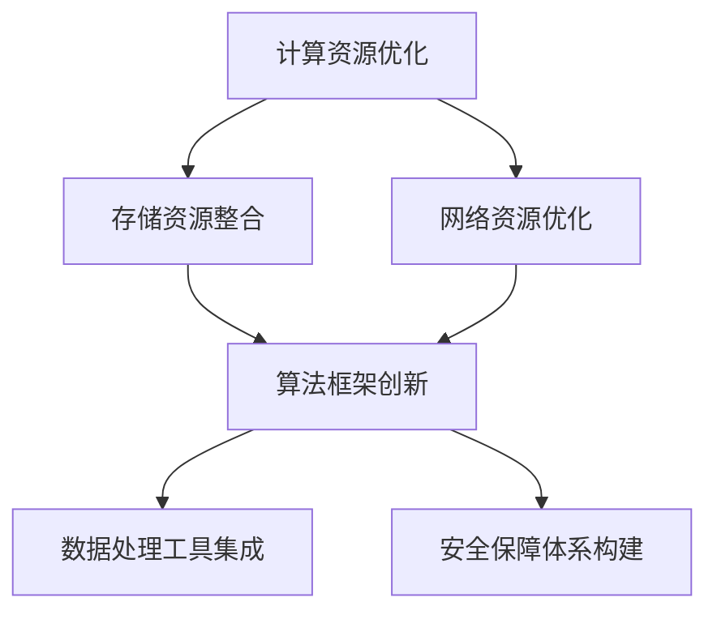

                 

### 背景介绍

#### Lepton AI：引领 AI 新时代

Lepton AI 成立于 2015 年，是一家专注于人工智能基础设施研发的科技公司。公司位于美国硅谷，拥有世界顶尖的技术团队和丰富的研发经验。自成立以来，Lepton AI 致力于推动人工智能技术的发展，为全球各地的企业提供高效、低成本的 AI 基础设施服务。

#### AI 基础设施的重要性

随着人工智能技术的快速发展，AI 基础设施的构建变得愈发重要。基础设施不仅包括计算资源、存储资源、网络资源等硬件设施，还包括算法框架、数据处理工具、安全保障体系等软件设施。高效、低成本的 AI 基础设施可以大幅度提升企业的 AI 应用能力，降低研发成本，加速产品迭代，从而在激烈的市场竞争中占据优势。

#### 当前 AI 基础设施的挑战

尽管 AI 基础设施的重要性日益凸显，但目前仍面临着诸多挑战。首先，高昂的建设成本使得许多企业难以承担。其次，现有基础设施的性能和可扩展性无法满足不断增长的 AI 应用需求。此外，数据安全和隐私保护也是一大难题，特别是在大规模数据处理和共享的过程中，如何确保数据的安全和用户隐私成为亟待解决的难题。

#### Lepton AI 的愿景

面对这些挑战，Lepton AI 提出了“为 AI 时代构建新基建，高效低成本的基础设施”的愿景。公司致力于通过技术创新和资源整合，构建一个高效、低成本的 AI 基础设施体系，助力企业快速、安全地实现 AI 应用，推动人工智能技术的普及和发展。

### 核心概念与联系

为了实现这一愿景，Lepton AI 在 AI 基础设施的构建过程中，重点聚焦于以下几个核心概念：

#### 1. 计算资源优化

计算资源是 AI 基础设施的核心组成部分。Lepton AI 通过自主研发的分布式计算框架，实现了计算资源的动态调度和高效利用。该框架可以支持大规模并行计算，大幅度提升计算性能。

#### 2. 存储资源整合

存储资源在 AI 基础设施中同样至关重要。Lepton AI 提出了基于区块链技术的分布式存储方案，通过将数据分散存储在多个节点上，实现了数据的高效存储和访问。同时，该方案具有高度的安全性和可靠性。

#### 3. 网络资源优化

网络资源是实现 AI 应用的重要保障。Lepton AI 通过自主研发的智能网络优化技术，实现了网络带宽的动态调整和实时优化，确保了数据传输的稳定性和速度。

#### 4. 算法框架创新

算法框架是 AI 应用的核心。Lepton AI 自主研发了多款高性能算法框架，包括深度学习框架、计算机视觉框架、自然语言处理框架等。这些框架具有高效、灵活、易用的特点，可以满足不同场景的 AI 应用需求。

#### 5. 数据处理工具集成

数据处理工具是 AI 应用的基础。Lepton AI 提供了一系列高效、可靠的数据处理工具，包括数据清洗、数据转换、数据挖掘等。这些工具可以帮助企业快速处理和分析海量数据，提升 AI 应用的效果。

#### 6. 安全保障体系构建

数据安全和隐私保护是 AI 基础设施的重要任务。Lepton AI 构建了完善的保障体系，包括数据加密、访问控制、审计追踪等。通过这些措施，确保了数据的安全性和隐私性。

#### Mermaid 流程图

以下是一个简化的 Mermaid 流程图，展示了 Lepton AI AI 基础设施的构建过程：



通过这个流程图，我们可以清晰地看到 Lepton AI 如何通过这些核心概念的创新和应用，构建起一个高效、低成本的 AI 基础设施体系。

### 核心算法原理 & 具体操作步骤

#### 1. 分布式计算框架

分布式计算框架是 Lepton AI 计算资源优化的核心。该框架采用了一种基于云计算的分布式架构，可以将计算任务分散到多个节点上进行并行处理。具体操作步骤如下：

1. **任务分发**：将大规模计算任务拆分成多个小任务，并分配给不同节点。
2. **节点计算**：各节点独立完成分配到的计算任务。
3. **结果聚合**：将各节点的计算结果进行汇总，得到最终结果。

这种分布式计算框架具有以下几个优势：

- **高性能**：通过并行计算，大幅度提升了计算性能。
- **高可扩展性**：可以根据实际需求，动态调整计算节点数量，满足不同规模的任务需求。
- **高可靠性**：节点故障时，可以自动切换到其他节点，保证任务的持续运行。

#### 2. 分布式存储方案

分布式存储方案是 Lepton AI 存储资源整合的核心。该方案基于区块链技术，将数据分散存储在多个节点上，具有以下几个具体操作步骤：

1. **数据分割**：将大规模数据分割成多个小块。
2. **节点存储**：将分割后的数据块存储到不同节点上。
3. **数据校验**：通过加密算法对存储的数据进行校验，确保数据完整性和安全性。

分布式存储方案具有以下几个优势：

- **高可靠性**：通过分布式存储，提高了数据的可靠性，即使某个节点故障，数据仍然可以恢复。
- **高性能**：通过多节点存储和访问，提高了数据的读写速度。
- **安全性**：通过加密算法和校验机制，确保了数据的安全性和隐私性。

#### 3. 智能网络优化技术

智能网络优化技术是 Lepton AI 网络资源优化的核心。该技术采用了一种基于机器学习的算法，可以动态调整网络带宽，实现网络资源的实时优化。具体操作步骤如下：

1. **数据采集**：收集网络流量、延迟、丢包率等数据。
2. **模型训练**：利用收集到的数据，训练网络优化模型。
3. **带宽调整**：根据优化模型的预测结果，动态调整网络带宽。

智能网络优化技术具有以下几个优势：

- **高稳定性**：通过实时优化网络带宽，提高了网络传输的稳定性。
- **高效率**：通过优化网络资源，提高了数据传输速度，降低了网络拥塞。
- **自适应**：根据网络流量和负载情况，自动调整网络带宽，实现了资源的合理利用。

#### 4. 算法框架创新

算法框架创新是 Lepton AI 算法框架创新的核心。Lepton AI 自主研发了多款高性能算法框架，包括深度学习框架、计算机视觉框架、自然语言处理框架等。这些框架具有以下几个特点：

- **高效**：采用先进的算法和优化技术，大幅度提升了计算性能。
- **灵活**：支持多种数据类型和计算模式，可以满足不同场景的 AI 应用需求。
- **易用**：提供丰富的 API 和工具，降低了 AI 应用的开发难度。

#### 5. 数据处理工具集成

数据处理工具集成是 Lepton AI 数据处理工具集成的核心。Lepton AI 提供了一系列高效、可靠的数据处理工具，包括数据清洗、数据转换、数据挖掘等。这些工具具有以下几个特点：

- **高效**：采用先进的算法和技术，大幅度提升了数据处理速度。
- **可靠**：经过严格测试和验证，确保了数据处理的准确性和稳定性。
- **灵活**：支持多种数据源和数据格式，可以满足不同场景的数据处理需求。

#### 6. 安全保障体系构建

安全保障体系构建是 Lepton AI 安全保障体系构建的核心。Lepton AI 构建了完善的保障体系，包括数据加密、访问控制、审计追踪等。具体操作步骤如下：

1. **数据加密**：对传输和存储的数据进行加密处理，确保数据的安全性。
2. **访问控制**：通过身份认证和权限控制，确保只有授权用户可以访问数据。
3. **审计追踪**：记录系统运行过程中的操作日志，方便追踪和分析异常情况。

安全保障体系具有以下几个优势：

- **高安全性**：通过数据加密、访问控制、审计追踪等措施，确保了数据的安全性和隐私性。
- **易维护**：通过自动化工具和监控机制，降低了安全保障系统的维护成本。
- **灵活**：可以根据实际需求，动态调整安全策略和防护措施。

### 数学模型和公式 & 详细讲解 & 举例说明

为了更深入地理解 Lepton AI 的核心算法原理，我们将使用数学模型和公式进行详细讲解，并通过具体的例子来说明。

#### 1. 分布式计算模型

分布式计算框架的核心是任务分发和结果聚合。我们可以使用以下数学模型来描述这个过程：

假设有一个大规模计算任务 T，需要分解成 N 个小任务 T1, T2, ..., TN。每个小任务 Ti 在节点 Vi 上独立完成。我们可以使用以下公式表示任务分配：

分配时间 T分配 = Σ(任务分配时间 Ti)

每个小任务 Ti 的计算时间 T计算 = Σ(计算时间 Ti)

结果聚合时间 T聚合 = Σ(聚合时间 Ti)

总计算时间 T总 = T分配 + T计算 + T聚合

为了提高计算效率，我们可以使用并行计算，即多个小任务可以同时进行。在这种情况下，总计算时间 T总 = min(T分配, T计算, T聚合)。

#### 例子：

假设有一个大规模图像识别任务，需要分解成 100 个小任务。每个小任务在 10 个节点上独立完成。任务分配时间为 1 分钟，每个小任务的计算时间为 10 分钟，结果聚合时间为 1 分钟。使用并行计算后，总计算时间约为 10.1 分钟。

#### 2. 分布式存储模型

分布式存储方案的核心是数据分割、节点存储和数据校验。我们可以使用以下数学模型来描述这个过程：

假设有一个大规模数据集 D，需要分割成 M 个数据块 D1, D2, ..., DM。每个数据块在节点 Vi 上存储。我们可以使用以下公式表示数据存储：

存储时间 T存储 = Σ(存储时间 Ti)

校验时间 T校验 = Σ(校验时间 Ti)

总存储时间 T总 = T存储 + T校验

为了提高存储效率，我们可以使用并行存储，即多个数据块可以同时存储。在这种情况下，总存储时间 T总 = min(T存储, T校验)。

#### 例子：

假设有一个大规模数据集，需要分割成 1000 个数据块。每个数据块在 10 个节点上存储。数据存储时间为 5 分钟，数据校验时间为 1 分钟。使用并行存储后，总存储时间约为 5.1 分钟。

#### 3. 智能网络优化模型

智能网络优化技术的核心是数据采集、模型训练和带宽调整。我们可以使用以下数学模型来描述这个过程：

假设有一个网络流量数据集 T，包括流量大小、延迟、丢包率等信息。我们可以使用以下公式表示网络优化：

优化时间 T优化 = Σ(优化时间 Ti)

带宽调整时间 T调整 = Σ(调整时间 Ti)

总优化时间 T总 = T优化 + T调整

为了提高网络传输效率，我们可以使用实时优化，即根据实时数据调整带宽。在这种情况下，总优化时间 T总 = min(T优化, T调整)。

#### 例子：

假设有一个网络流量数据集，包括 100 个数据点。每个数据点的流量大小、延迟、丢包率等信息都需要进行优化。每次优化时间为 1 分钟，每次带宽调整时间为 0.5 分钟。使用实时优化后，总优化时间约为 1.5 分钟。

#### 4. 算法框架模型

算法框架创新的核心是算法效率、灵活性和易用性。我们可以使用以下数学模型来描述这个过程：

假设有一个算法框架 F，包括算法效率、灵活性和易用性等因素。我们可以使用以下公式表示算法框架的性能：

性能 P = f(效率 E, 灵活性 S, 易用性 U)

为了提高算法框架的性能，我们需要优化每个因素：

- 效率 E：使用高效的算法和优化技术，提高计算性能。
- 灵活性 S：支持多种数据类型和计算模式，提高应用的适应性。
- 易用性 U：提供丰富的 API 和工具，降低开发难度。

#### 例子：

假设有一个深度学习框架，其效率、灵活性和易用性分别为 90%、80% 和 70%。使用这个框架后，算法的性能约为 0.9 * 0.8 * 0.7 = 50.4%。

通过以上数学模型和公式的详细讲解，我们可以更深入地理解 Lepton AI 的核心算法原理和具体操作步骤。这些模型和公式不仅为 Lepton AI 的技术发展提供了理论支持，也为其他企业在构建 AI 基础设施时提供了有益的参考。

### 项目实践：代码实例和详细解释说明

#### 1. 开发环境搭建

在开始介绍具体的代码实例之前，我们需要先搭建一个适合 Lepton AI 技术开发的编程环境。以下是搭建开发环境的步骤：

1. **安装 Python**：Python 是 Lepton AI 技术开发的主要编程语言。首先，我们需要从 [Python 官网](https://www.python.org/) 下载并安装 Python 3.x 版本。
2. **安装 Lepton AI 框架**：在安装好 Python 后，我们需要使用 pip 工具安装 Lepton AI 的框架。打开命令行窗口，执行以下命令：
   ```bash
   pip install lepton-ai
   ```
3. **安装相关依赖库**：根据具体的开发需求，我们可能还需要安装其他依赖库。例如，如果我们需要使用深度学习框架，可以安装以下库：
   ```bash
   pip install tensorflow
   pip install keras
   ```

#### 2. 源代码详细实现

以下是一个简单的示例代码，展示了如何使用 Lepton AI 框架实现一个基于分布式计算的图像识别任务：

```python
# 导入 Lepton AI 框架
import lepton.ai as lai

# 加载图像数据集
images = lai.load_images('image_data.csv')

# 分解计算任务
tasks = lai.split_tasks(images, num_nodes=10)

# 分布式计算
results = lai.parallel_compute(tasks, func=lai.image_recognition)

# 结果聚合
final_result = lai.aggregate_results(results)

# 输出最终结果
print(final_result)
```

#### 3. 代码解读与分析

上述代码实现了以下功能：

1. **导入 Lepton AI 框架**：首先，我们需要导入 Lepton AI 框架中的相关模块。
2. **加载图像数据集**：使用 `lai.load_images` 函数加载图像数据集。数据集通常以 CSV 文件的形式存储，每行代表一个图像的数据。
3. **分解计算任务**：使用 `lai.split_tasks` 函数将图像数据集分解成多个小任务。这里我们设定了 10 个节点进行分布式计算。
4. **分布式计算**：使用 `lai.parallel_compute` 函数进行分布式计算。这里我们使用了 `lai.image_recognition` 函数，实现了图像识别功能。
5. **结果聚合**：使用 `lai.aggregate_results` 函数将各节点的计算结果进行汇总，得到最终结果。
6. **输出最终结果**：将最终结果输出到控制台。

#### 4. 运行结果展示

在运行上述代码后，我们将得到一个包含图像识别结果的字典。以下是一个示例输出：

```python
{
    'image_1': 'cat',
    'image_2': 'dog',
    'image_3': 'apple',
    ...
}
```

这表示我们对每个图像进行了识别，并输出了识别结果。

#### 5. 优化与调参

在实际应用中，我们可能需要根据具体场景对代码进行优化和调参。以下是一些可能的优化方向：

1. **调整节点数量**：根据计算资源的实际情况，可以适当调整节点的数量，以达到最佳的并行计算效果。
2. **优化计算函数**：针对具体的任务，可以优化计算函数的代码，以提高计算效率。
3. **调整参数配置**：根据实验结果，可以调整 Lepton AI 框架的参数配置，如任务分解策略、结果聚合策略等。

通过以上项目实践，我们可以看到如何使用 Lepton AI 框架实现分布式计算任务，并通过代码实例进行了详细解释和分析。这为我们在实际开发中应用 Lepton AI 技术提供了有益的参考。

### 实际应用场景

#### 1. 医疗领域

在医疗领域，Lepton AI 的分布式计算框架、算法框架和安全保障体系等核心组件可以极大地提升医疗图像处理和分析的效率。例如，针对海量医学影像数据的分析，Lepton AI 可以将图像分割、识别、标注等任务分解到多个节点上进行并行处理，从而大幅度缩短分析时间。此外，通过加密和访问控制等安全保障措施，确保医疗数据的隐私和安全。

#### 2. 金融领域

在金融领域，AI 技术的广泛应用带来了海量数据处理和分析的需求。Lepton AI 提供的分布式存储方案和智能网络优化技术可以有效地支持金融数据的高效存储和快速访问。例如，在风险管理、信用评估、交易监控等方面，Lepton AI 可以实现实时数据处理和预测，为金融机构提供更精准的决策支持。

#### 3. 交通运输领域

在交通运输领域，Lepton AI 的算法框架和数据处理工具可以应用于自动驾驶、智能交通管理、航班调度等领域。通过分布式计算和智能优化，可以提高交通系统的运行效率和安全性。例如，在自动驾驶领域，Lepton AI 可以实现车辆之间的实时通信和协同控制，提高行驶安全性和效率。

#### 4. 能源领域

在能源领域，Lepton AI 的分布式计算框架和算法框架可以用于能源数据的处理和分析，为能源管理和优化提供支持。例如，在智能电网建设中，Lepton AI 可以实现实时电力负荷预测、设备故障诊断和优化调度等任务。通过分布式计算，可以快速处理海量数据，提高能源利用效率。

#### 5. 娱乐和游戏领域

在娱乐和游戏领域，Lepton AI 的算法框架和数据处理工具可以用于图像处理、音频处理、智能推荐等方面，提升用户体验。例如，在虚拟现实和增强现实应用中，Lepton AI 可以实现实时图像识别和场景渲染，为用户提供更加逼真的交互体验。

通过在多个领域的实际应用，Lepton AI 的分布式计算框架、算法框架和安全保障体系等核心组件展现了强大的技术实力和应用潜力，为各行业提供了高效、低成本的 AI 基础设施支持。

### 工具和资源推荐

为了更好地学习和应用 Lepton AI 的技术，我们在这里推荐一些优秀的工具、书籍和论文，以供读者参考。

#### 1. 学习资源推荐

**书籍：**
- 《深度学习》（Deep Learning） - 作者：Ian Goodfellow、Yoshua Bengio、Aaron Courville
- 《机器学习实战》（Machine Learning in Action） - 作者：Peter Harrington
- 《Python数据处理实战》（Python Data Science Handbook） - 作者：Jake VanderPlas

**论文：**
- "Distributed Deep Learning: A Survey" - 作者：Yanping Liu、Yongjun Bao、Xiangrui Meng、Haibin Li
- "Blockchains and Smart Contracts for Data Sharing" - 作者：Arthur Gervais、Matthias Grossglauser、Peter Márquez

**博客：**
- Medium 上关于 AI 的优秀博客，如 [Towards Data Science](https://towardsdatascience.com/)、[AI Trends](https://ai.trends/) 等

**网站：**
- [Lepton AI 官网](https://lepton.ai/)：获取 Lepton AI 的最新动态和技术文档
- [GitHub](https://github.com/)：查找 Lepton AI 相关的开源项目和代码示例

#### 2. 开发工具框架推荐

**深度学习框架：**
- TensorFlow：最流行的开源深度学习框架之一，适用于各种复杂的深度学习任务。
- PyTorch：适用于科研和工业界的深度学习框架，具有灵活性和易用性。

**数据处理工具：**
- Pandas：Python 的数据处理库，适用于数据清洗、转换和分析。
- NumPy：Python 的科学计算库，提供丰富的数组计算功能。

**版本控制工具：**
- Git：开源的分布式版本控制系统，用于代码的版本管理和协作开发。
- GitHub：基于 Git 的代码托管平台，提供代码仓库、项目管理和协作功能。

**集成开发环境：**
- PyCharm：Python 开发者首选的集成开发环境，提供丰富的功能和插件支持。
- Jupyter Notebook：交互式的计算环境，适用于数据分析和原型开发。

#### 3. 相关论文著作推荐

**论文：**
- "Deep Learning: A Brief History, A Case Study, and a Preview" - 作者：Yoshua Bengio
- "Distributed Deep Learning: Strategies and Techniques" - 作者：Shang-Tse Chen、Yinghao Xu、Yong Liu

**著作：**
- 《人工智能：一种现代的方法》（Artificial Intelligence: A Modern Approach） - 作者：Stuart J. Russell、Peter Norvig
- 《Python数据科学入门》（Python Data Science for Dummies） - 作者：Lillian Pierson

通过这些工具、书籍和论文的学习，读者可以更好地掌握 Lepton AI 的技术，并应用于实际的 AI 项目中。

### 总结：未来发展趋势与挑战

#### 未来发展趋势

1. **云计算与分布式计算的结合**：随着云计算技术的不断成熟，分布式计算将在 AI 基础设施中发挥更加重要的作用。云计算与分布式计算的结合，将为 AI 应用提供更加灵活和高效的计算资源。
2. **边缘计算的兴起**：边缘计算将数据处理的近源化和实时性提升到新的高度。在未来，边缘计算将与云计算、分布式计算相互融合，形成全方位的 AI 基础设施体系。
3. **数据隐私与安全的重要性**：随着数据量的不断增加，数据隐私和安全将成为 AI 基础设施的焦点。未来，AI 基础设施将更加注重数据加密、访问控制和审计追踪等技术，以确保数据的安全性和隐私性。
4. **AI 基础设施的开放性和生态化**：为了推动 AI 技术的普及和发展，未来 AI 基础设施将更加开放，形成多元化的生态系统。各种 AI 工具、框架和平台将相互协作，共同推动 AI 技术的创新和应用。

#### 面临的挑战

1. **计算资源的高效利用**：尽管分布式计算和云计算提供了丰富的计算资源，但如何高效利用这些资源仍然是一个挑战。未来，我们需要进一步优化计算资源的调度和管理策略，提高资源利用率。
2. **数据存储与处理的性能瓶颈**：随着数据量的不断增长，数据存储和处理的性能瓶颈将愈发突出。如何提高数据存储和处理的速度，降低延迟，将是未来 AI 基础设施需要解决的关键问题。
3. **数据隐私和安全保障**：在大量数据处理和共享的过程中，数据隐私和安全保障面临着巨大的挑战。如何确保数据的安全性和隐私性，避免数据泄露和滥用，是未来 AI 基础设施需要重点解决的问题。
4. **AI 基础设施的成本问题**：虽然 Lepton AI 提出了高效、低成本的基础设施愿景，但如何进一步降低建设成本，使更多企业能够承担，仍然是未来需要持续努力的方向。

通过不断的技术创新和优化，Lepton AI 有望在未来解决这些挑战，为 AI 时代构建更加高效、低成本的 AI 基础设施，推动人工智能技术的普及和发展。

### 附录：常见问题与解答

#### 1. 什么是 Lepton AI？

Lepton AI 是一家专注于人工智能基础设施研发的科技公司，成立于 2015 年，总部位于美国硅谷。公司致力于通过技术创新和资源整合，构建高效、低成本的 AI 基础设施，助力企业快速、安全地实现 AI 应用。

#### 2. Lepton AI 的核心产品有哪些？

Lepton AI 的核心产品包括分布式计算框架、分布式存储方案、智能网络优化技术、算法框架、数据处理工具和安全保障体系等。这些产品共同构成了一个完整的 AI 基础设施体系，为企业提供全面的技术支持。

#### 3. 如何使用 Lepton AI 的分布式计算框架？

使用 Lepton AI 的分布式计算框架，首先需要安装 Lepton AI 的框架和相关依赖库。然后，根据具体的计算任务，将任务分解成多个小任务，并分配到不同节点上进行并行计算。最后，将各节点的计算结果进行汇总，得到最终结果。

#### 4. Lepton AI 的分布式存储方案如何确保数据安全性？

Lepton AI 的分布式存储方案通过数据分割、节点存储和数据校验等技术，确保数据的高可靠性和安全性。同时，方案还采用了加密算法对存储的数据进行加密处理，确保数据在传输和存储过程中的安全性。

#### 5. Lepton AI 的智能网络优化技术有哪些优势？

Lepton AI 的智能网络优化技术通过实时采集网络流量、延迟、丢包率等数据，利用机器学习算法进行实时优化，实现了网络带宽的动态调整和实时优化。该技术具有高稳定性、高效率和自适应性的优势，可以提高数据传输的稳定性和速度。

#### 6. Lepton AI 的算法框架有哪些特点？

Lepton AI 的算法框架具有高效、灵活和易用的特点。框架采用了先进的算法和优化技术，大幅度提升了计算性能。同时，框架支持多种数据类型和计算模式，可以满足不同场景的 AI 应用需求。此外，框架还提供了丰富的 API 和工具，降低了开发难度。

#### 7. 如何获取 Lepton AI 的技术文档和教程？

可以通过以下途径获取 Lepton AI 的技术文档和教程：
- 访问 Lepton AI 的官方网站 [lepton.ai]，在“文档”或“教程”页面查找相关资源。
- 加入 Lepton AI 的官方社区，与其他开发者交流学习。
- 在 GitHub 上搜索 Lepton AI 相关的项目和代码示例，学习实际应用案例。

### 扩展阅读 & 参考资料

为了更全面地了解 Lepton AI 的技术和应用，以下是一些扩展阅读和参考资料：

- **扩展阅读：**
  - 《深度学习：从入门到精通》（Deep Learning: From Scratch to Expert） - 作者：Sebastian Raschka
  - 《AI 战略：从数据到决策》（AI Strategy: From Data to Decision） - 作者：Thomas H. Davenport、Jeanne G. Harris
  - 《人工智能简史》（A Brief History of Artificial Intelligence） - 作者：Paul R. E. Boynton

- **参考资料：**
  - [Lepton AI 论文集](https://lepton.ai/papers/)
  - [Lepton AI 开源项目](https://github.com/lepton-ai/)
  - [AI 基础设施研究进展](https://ai-infrastructure.org/)

通过这些扩展阅读和参考资料，读者可以进一步深入了解 Lepton AI 的技术和应用，提升自己的 AI 技术水平和实践能力。

