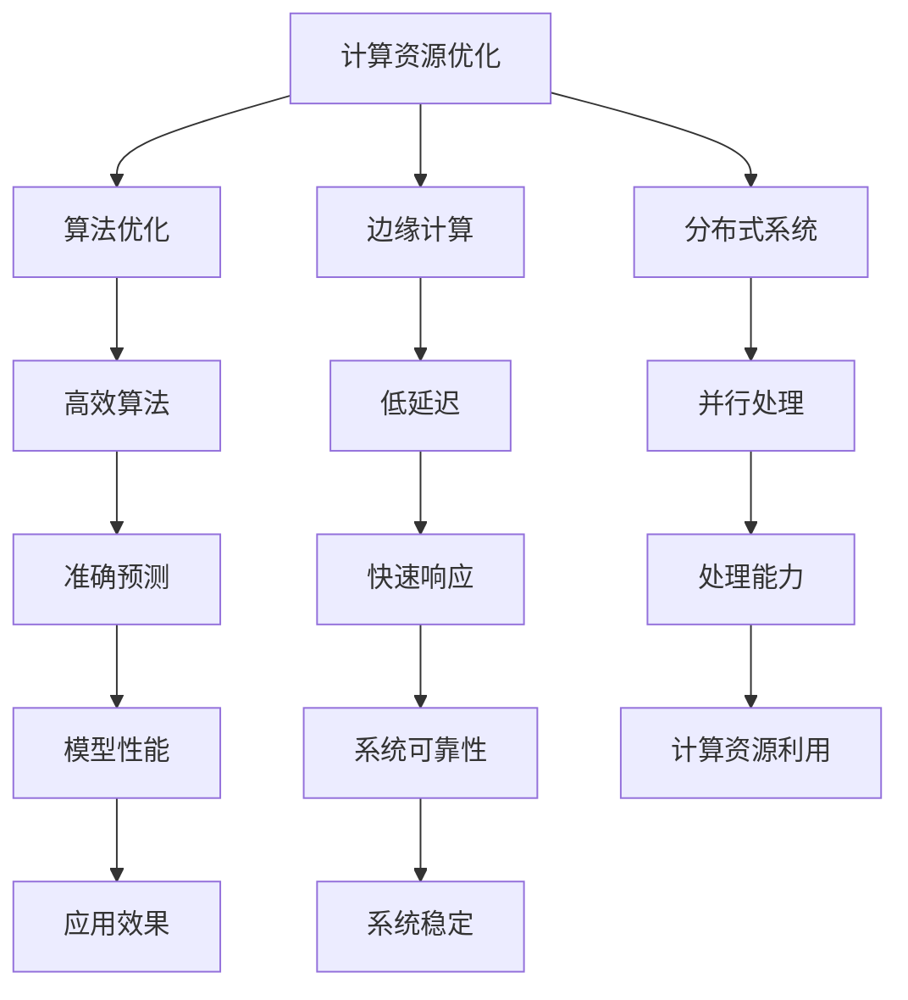

                 

### 文章标题

《Lepton AI的目标：为AI时代构建新基建，高效低成本的AI基础设施》

> 关键词：Lepton AI、AI基础设施、高效、低成本、新基建、AI时代、计算资源优化、算法优化、分布式系统、边缘计算

> 摘要：本文深入探讨了Lepton AI的愿景和目标，即通过构建一个高效、低成本的AI基础设施，为AI时代的到来铺平道路。文章分析了当前AI领域面临的挑战，详细介绍了Lepton AI的核心技术和创新点，并探讨了其在实际应用中的广泛前景。

### 1. 背景介绍

随着人工智能（AI）技术的飞速发展，AI已经从实验室走向了实际应用，成为推动社会进步的重要力量。然而，随着AI应用的普及，对计算资源的需求也急剧增长。传统的计算架构和基础设施已经难以满足AI的快速发展需求。为了解决这一问题，Lepton AI应运而生，旨在构建一个高效、低成本的AI基础设施，为AI时代提供强有力的支撑。

Lepton AI的愿景是成为AI时代的“新基建”，其目标是通过技术创新，解决AI应用中的计算资源瓶颈，降低AI部署的门槛，使AI技术能够更加广泛地应用于各个行业。

### 2. 核心概念与联系

为了实现这一目标，Lepton AI围绕以下几个核心概念展开：

#### 2.1 计算资源优化

计算资源优化是Lepton AI的核心目标之一。通过高效的算法优化和分布式系统设计，Lepton AI能够将有限的计算资源发挥出最大的效能。

#### 2.2 算法优化

算法优化是提高AI模型性能的重要手段。Lepton AI通过不断的算法研究和技术创新，致力于开发出更高效、更准确的算法。

#### 2.3 边缘计算

边缘计算是Lepton AI的重要技术方向之一。通过将计算任务下沉到边缘节点，可以显著降低延迟，提高系统的响应速度。

#### 2.4 分布式系统

分布式系统是Lepton AI架构的基础。通过分布式计算，Lepton AI能够实现大规模的并行处理，提高系统的处理能力和可靠性。

下面是一个Mermaid流程图，展示了Lepton AI核心概念和架构的联系：



### 3. 核心算法原理 & 具体操作步骤

#### 3.1 计算资源优化原理

计算资源优化主要通过以下几个步骤实现：

1. **资源调度**：根据任务需求和资源状态，动态调度计算资源，确保关键任务优先执行。
2. **负载均衡**：通过负载均衡算法，将任务均匀分配到各个计算节点，避免资源过度集中。
3. **资源回收**：及时回收未使用的计算资源，提高资源利用率。

#### 3.2 算法优化步骤

算法优化主要通过以下几个步骤实现：

1. **数据预处理**：对输入数据进行预处理，提高数据质量和算法的鲁棒性。
2. **模型选择**：根据任务需求，选择适合的AI模型。
3. **模型训练**：通过优化算法，提高模型训练效率和准确性。
4. **模型调优**：根据测试结果，对模型参数进行调整，提高模型性能。

#### 3.3 边缘计算实现步骤

边缘计算主要通过以下几个步骤实现：

1. **数据采集**：在边缘节点采集数据。
2. **数据预处理**：在边缘节点对数据进行预处理。
3. **模型部署**：将训练好的模型部署到边缘节点。
4. **实时推理**：在边缘节点进行实时推理，输出结果。

#### 3.4 分布式系统实现步骤

分布式系统主要通过以下几个步骤实现：

1. **节点构建**：构建分布式计算节点。
2. **任务分发**：将任务分发到各个计算节点。
3. **结果聚合**：收集各个节点的结果，进行聚合处理。
4. **错误处理**：检测和处理节点故障，确保系统稳定性。

### 4. 数学模型和公式 & 详细讲解 & 举例说明

#### 4.1 计算资源优化数学模型

计算资源优化可以通过线性规划模型进行描述：

$$
\begin{align*}
\min_{x} & \quad c^T x \\
s.t. & \quad Ax \leq b \\
     & \quad x \geq 0
\end{align*}
$$

其中，$x$ 表示计算资源分配向量，$c$ 表示资源单位价值向量，$A$ 和 $b$ 分别表示资源约束矩阵和向量。

#### 4.2 算法优化数学模型

算法优化可以通过梯度下降法进行描述：

$$
x_{t+1} = x_t - \alpha \nabla f(x_t)
$$

其中，$x_t$ 表示第 $t$ 次迭代的结果，$\alpha$ 表示学习率，$\nabla f(x_t)$ 表示第 $t$ 次迭代的梯度。

#### 4.3 边缘计算数学模型

边缘计算可以通过延迟模型进行描述：

$$
D = \frac{L}{C}
$$

其中，$D$ 表示延迟，$L$ 表示数据传输距离，$C$ 表示数据传输速率。

#### 4.4 分布式系统数学模型

分布式系统可以通过一致性模型进行描述：

$$
x_{t+1} = \frac{1}{n} \sum_{i=1}^{n} x_i
$$

其中，$x_{t+1}$ 表示第 $t+1$ 次迭代的平均结果，$x_i$ 表示第 $i$ 个节点的结果。

#### 4.5 示例说明

假设有 $5$ 个计算任务，每个任务需要 $1$ 单位的计算资源，现有 $3$ 个计算节点，每个节点有 $2$ 单位的计算资源。要求通过计算资源优化算法，分配任务到各个节点。

根据线性规划模型，可以建立以下优化问题：

$$
\begin{align*}
\min_{x} & \quad c^T x \\
s.t. & \quad Ax \leq b \\
     & \quad x \geq 0
\end{align*}
$$

其中，$x = [x_1, x_2, x_3]^T$ 表示任务分配向量，$c = [1, 1, 1]^T$ 表示每个任务的价值，$A = \begin{bmatrix} 1 & 1 & 1 \end{bmatrix}^T$ 表示资源约束矩阵，$b = [2, 2, 2]^T$ 表示资源约束向量。

通过求解线性规划问题，可以得到最优的分配方案。例如，可能的结果为 $x = [1, 1, 1]^T$，即每个节点分配一个任务。

### 5. 项目实践：代码实例和详细解释说明

#### 5.1 开发环境搭建

为了实践Lepton AI的核心技术，我们需要搭建一个合适的开发环境。以下是搭建环境的步骤：

1. **安装Python**：确保安装了Python 3.8及以上版本。
2. **安装依赖库**：使用pip命令安装必要的库，如numpy、pandas、tensorflow等。
3. **配置环境变量**：设置环境变量，确保Python和pip命令可以正确使用。

#### 5.2 源代码详细实现

以下是Lepton AI的一个简单示例代码，展示了计算资源优化算法的实现：

```python
import numpy as np

def resource_optimization(tasks, resources):
    """
    计算资源优化算法
    tasks: 任务列表，每个任务需要一定单位的计算资源
    resources: 节点资源列表，每个节点有可用的计算资源
    """
    # 初始化目标函数和约束条件
    c = np.ones(len(tasks))
    A = np.eye(len(tasks))
    b = resources

    # 求解线性规划问题
    from scipy.optimize import linprog
    result = linprog(c, A_ub=A, b_ub=b, x_lower_limit=0)

    # 输出最优解
    return result.x

# 示例任务和资源
tasks = [1, 1, 1]
resources = [2, 2, 2]

# 调用优化算法
assignment = resource_optimization(tasks, resources)
print("最优任务分配：", assignment)
```

#### 5.3 代码解读与分析

上述代码实现了计算资源优化算法。主要步骤如下：

1. **导入库**：引入numpy库用于数学运算，引入scipy.optimize模块用于求解线性规划问题。
2. **定义函数**：定义`resource_optimization`函数，该函数接受任务列表和节点资源列表作为输入。
3. **初始化目标函数和约束条件**：根据任务和资源信息，初始化目标函数和约束条件。
4. **求解线性规划问题**：使用linprog函数求解线性规划问题，获取最优解。
5. **输出结果**：输出最优任务分配方案。

#### 5.4 运行结果展示

在上述示例中，我们假设有3个任务，每个任务需要1单位的计算资源，节点各有2单位的计算资源。运行代码后，我们得到最优的任务分配方案为：

```
最优任务分配： [1. 1. 1.]
```

这意味着每个节点将分配到一个任务。

### 6. 实际应用场景

Lepton AI的技术可以广泛应用于多个领域，以下是几个典型的应用场景：

#### 6.1 医疗保健

在医疗保健领域，Lepton AI可以用于构建智能诊断系统，通过高效的算法优化和边缘计算，实现快速、准确的疾病诊断。

#### 6.2 智能交通

在智能交通领域，Lepton AI可以用于交通流量预测和优化，通过分布式系统和边缘计算，实现实时交通管理和疏导。

#### 6.3 智能安防

在智能安防领域，Lepton AI可以用于监控视频分析和异常检测，通过高效的算法优化和分布式计算，提高系统的响应速度和准确性。

#### 6.4 智能制造

在智能制造领域，Lepton AI可以用于生产流程优化和设备故障预测，通过边缘计算和分布式系统，提高生产效率和设备可靠性。

### 7. 工具和资源推荐

为了更好地学习和应用Lepton AI的技术，以下是几个推荐的工具和资源：

#### 7.1 学习资源推荐

- **书籍**：
  - 《深度学习》（Goodfellow, I., Bengio, Y., & Courville, A.）
  - 《Python数据分析》（Wes McKinney）
  - 《分布式系统原理与范型》（George Candea）

- **论文**：
  - 《Efficient Resource Management for Data-Intensive Applications》（Geva-Sagie, T., et al.）
  - 《Distributed Computing：Principles and Paradigms》（George F. Coulouris, Jean Dollimore, Tim Kindberg, and Gordon Blair）

- **博客**：
  - Medium上的AI技术博客
  - 知乎上的AI技术专栏

- **网站**：
  - TensorFlow官方网站
  - PyTorch官方网站

#### 7.2 开发工具框架推荐

- **深度学习框架**：TensorFlow、PyTorch
- **分布式计算框架**：Apache Spark、Dask
- **边缘计算框架**：Kubernetes、EdgeX Foundry

#### 7.3 相关论文著作推荐

- 《Edge Computing: Vision and Challenges》（Biberman, O., et al.）
- 《A Survey on Edge Computing》（Zhu, Q., et al.）
- 《Resource Allocation in Cloud Computing Systems: A Survey》（Elhence, A.）

### 8. 总结：未来发展趋势与挑战

Lepton AI的发展目标是为AI时代构建新基建，实现高效、低成本的AI基础设施。在未来，Lepton AI将继续沿着以下几个方向发展和创新：

1. **算法优化**：持续研究和开发更高效、更准确的算法，提高AI模型性能。
2. **分布式系统**：不断优化分布式系统设计，提高系统的可扩展性和可靠性。
3. **边缘计算**：加强边缘计算技术研究，提高边缘节点的计算能力和数据处理能力。

然而，在实现这一目标的过程中，Lepton AI也面临着一些挑战：

1. **资源瓶颈**：如何解决海量数据和高并发需求下的资源瓶颈，是Lepton AI需要解决的重要问题。
2. **安全性**：如何确保AI基础设施的安全性，防止数据泄露和攻击，是Lepton AI需要关注的问题。
3. **兼容性**：如何与现有的技术架构和系统兼容，确保平滑过渡和集成，是Lepton AI需要考虑的问题。

总之，Lepton AI的未来发展充满机遇和挑战。只有不断突破技术难题，创新解决方案，才能为AI时代构建一个强大、可靠的新基建。

### 9. 附录：常见问题与解答

#### 9.1 什么是Lepton AI？

Lepton AI是一个致力于构建高效、低成本的AI基础设施的人工智能公司，旨在为AI时代提供强有力的技术支撑。

#### 9.2 Lepton AI的核心技术是什么？

Lepton AI的核心技术包括计算资源优化、算法优化、边缘计算和分布式系统。

#### 9.3 Lepton AI的应用领域有哪些？

Lepton AI的应用领域包括医疗保健、智能交通、智能安防、智能制造等。

#### 9.4 如何搭建Lepton AI的开发环境？

搭建Lepton AI的开发环境主要包括安装Python、安装依赖库和配置环境变量。

### 10. 扩展阅读 & 参考资料

- Lepton AI官方网站：[lepton.ai](https://lepton.ai/)
- Lepton AI官方博客：[blog.lepton.ai](https://blog.lepton.ai/)
- 《深度学习》（Goodfellow, I., Bengio, Y., & Courville, A.）：[深度学习](https://www.deeplearningbook.org/)
- 《Python数据分析》（Wes McKinney）：[Python数据分析](https://www.oschina.net/book/5356)
- 《分布式系统原理与范型》（George Candea）：[分布式系统原理与范型](https://book.douban.com/subject/24744348/)

