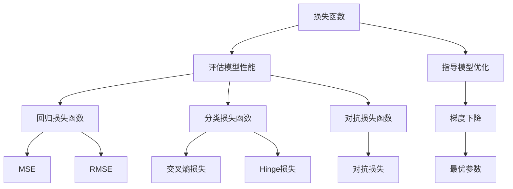

                 

### 1. 背景介绍

损失函数（Loss Functions）是机器学习领域中的一个核心概念，主要用于衡量模型预测结果与真实标签之间的差距。在深度学习中，损失函数起到了至关重要的作用，它帮助模型不断调整参数，使得预测结果越来越接近真实值。

损失函数的起源可以追溯到20世纪50年代，当时统计学家们开始研究如何通过最小化误差来优化模型参数。早期的研究主要集中在线性模型和决策树等简单模型上。随着计算机科学和计算能力的飞速发展，20世纪80年代以后，神经网络开始得到广泛应用，损失函数的概念也随之扩展。

在深度学习的发展过程中，损失函数的选择对模型的性能有着直接的影响。不同类型的损失函数适用于不同类型的数据和任务，如回归任务、分类任务等。因此，了解各种损失函数的原理和适用场景，对于机器学习研究者来说至关重要。

本文将详细探讨损失函数的核心概念、分类、原理及其在深度学习中的应用。我们将通过具体案例展示如何使用损失函数来训练模型，并分析其在实际项目中的应用。希望通过本文的讲解，读者能够深入理解损失函数的作用和重要性。

### 2. 核心概念与联系

#### 2.1 损失函数的定义

损失函数（Loss Function）是机器学习模型中的一个关键组件，用于评估模型预测结果与真实标签之间的误差。具体来说，损失函数接收模型的预测值和真实值作为输入，输出一个非负的实数值，该值表示预测误差的大小。

数学上，损失函数通常表示为：

\[ L(\theta; x, y) = \text{损失}(参数\ \theta; 样本\ x, 真实标签\ y) \]

其中，\(\theta\) 代表模型的参数，\(x\) 和 \(y\) 分别是输入样本和真实标签。损失函数的输出值越低，表示模型的预测结果越接近真实标签，模型的性能越好。

#### 2.2 损失函数的作用

损失函数在深度学习中有两个核心作用：

1. **评估模型性能**：损失函数用于计算模型预测值与真实值之间的误差，从而评估模型在当前参数设置下的性能。通过比较不同参数设置下的损失函数值，可以找到最优的参数组合。

2. **指导模型优化**：在训练过程中，模型会通过梯度下降等优化算法，不断调整参数以最小化损失函数值。这样，模型的预测性能会逐渐提高，直到收敛到最优解。

#### 2.3 损失函数与目标函数的关系

在机器学习中，目标函数（Objective Function）通常是指损失函数与正则化项的组合。正则化项用于防止模型过拟合，通常表示为：

\[ J(\theta) = L(\theta; x, y) + \lambda R(\theta) \]

其中，\(L(\theta; x, y)\) 是损失函数，\(R(\theta)\) 是正则化项，\(\lambda\) 是正则化参数。目标函数的目的是在最小化损失的同时，保持模型的一般性。

#### 2.4 损失函数的分类

根据应用场景和数据类型，损失函数可以分为以下几类：

1. **回归损失函数**：用于回归任务，如均方误差（MSE）和均方根误差（RMSE）。
2. **分类损失函数**：用于分类任务，如交叉熵损失（Cross Entropy Loss）和Hinge损失。
3. **对抗损失函数**：用于生成对抗网络（GAN），如对抗损失（Adversarial Loss）。

不同类型的损失函数在具体的任务中发挥着不同的作用。

#### 2.5 损失函数的 Mermaid 流程图

为了更直观地展示损失函数的概念和关系，我们可以使用Mermaid绘制一个流程图：



该流程图清晰地展示了损失函数的定义、作用、关系和分类，为后续内容提供了基础。

### 3. 核心算法原理 & 具体操作步骤

#### 3.1 回归损失函数

回归损失函数主要用于回归任务，即预测连续值输出。其中，最常用的损失函数是均方误差（Mean Squared Error，MSE）和均方根误差（Root Mean Squared Error，RMSE）。

**3.1.1 均方误差（MSE）**

均方误差是回归任务中最常用的损失函数之一，其定义如下：

\[ \text{MSE}(y, \hat{y}) = \frac{1}{n} \sum_{i=1}^{n} (y_i - \hat{y}_i)^2 \]

其中，\(y\) 和 \(\hat{y}\) 分别表示真实值和预测值，\(n\) 表示样本数量。

**具体操作步骤：**

1. 计算每个样本预测值与真实值之间的差值 \( (y_i - \hat{y}_i) \)。
2. 将差值平方，得到 \( (y_i - \hat{y}_i)^2 \)。
3. 对所有样本的平方差求和，得到总损失 \( \text{MSE}(y, \hat{y}) \)。

**3.1.2 均方根误差（RMSE）**

均方根误差是均方误差的平方根，用于更直观地表示损失大小。其定义如下：

\[ \text{RMSE}(y, \hat{y}) = \sqrt{\text{MSE}(y, \hat{y})} \]

**具体操作步骤：**

1. 计算均方误差 \( \text{MSE}(y, \hat{y}) \)。
2. 对均方误差取平方根，得到均方根误差 \( \text{RMSE}(y, \hat{y}) \)。

**3.2 分类损失函数**

分类损失函数主要用于分类任务，即预测离散值输出。其中，最常用的损失函数是交叉熵损失（Cross Entropy Loss）和Hinge损失。

**3.2.1 交叉熵损失（Cross Entropy Loss）**

交叉熵损失函数用于评估分类模型的性能，其定义如下：

\[ \text{CE}(y, \hat{y}) = -\sum_{i=1}^{n} y_i \log(\hat{y}_i) \]

其中，\(y\) 和 \(\hat{y}\) 分别表示真实值和预测值的概率分布，\(n\) 表示样本数量。

**具体操作步骤：**

1. 计算每个样本的真实值和预测值的对数概率 \( y_i \log(\hat{y}_i) \)。
2. 对所有样本的对数概率求和，得到总损失 \( \text{CE}(y, \hat{y}) \)。

**3.2.2 Hinge损失（Hinge Loss）**

Hinge损失函数主要用于支持向量机（SVM）等分类任务，其定义如下：

\[ \text{Hinge Loss}(y, \hat{y}) = \max(0, 1 - y \hat{y}) \]

其中，\(y\) 和 \(\hat{y}\) 分别表示真实值和预测值的乘积。

**具体操作步骤：**

1. 计算每个样本的真实值和预测值的乘积 \( y \hat{y} \)。
2. 如果乘积大于1，则损失为0；否则，损失为 \( 1 - y \hat{y} \)。
3. 对所有样本的损失求和，得到总损失 \( \text{Hinge Loss}(y, \hat{y}) \)。

通过以上具体操作步骤，我们可以更好地理解回归和分类损失函数的原理和应用。

### 4. 数学模型和公式 & 详细讲解 & 举例说明

#### 4.1 数学模型和公式

在深度学习中，损失函数的数学模型和公式至关重要，因为它们直接决定了模型训练过程中的误差计算和优化过程。以下是几种常见的损失函数及其数学表达式：

##### 4.1.1 均方误差（MSE）

均方误差（Mean Squared Error，MSE）是回归任务中最常用的损失函数之一，其数学表达式如下：

\[ \text{MSE}(y, \hat{y}) = \frac{1}{n} \sum_{i=1}^{n} (y_i - \hat{y}_i)^2 \]

其中，\(y_i\) 是第 \(i\) 个样本的真实值，\(\hat{y}_i\) 是第 \(i\) 个样本的预测值，\(n\) 是样本总数。

##### 4.1.2 交叉熵损失（Cross Entropy Loss）

交叉熵损失（Cross Entropy Loss）是分类任务中最常用的损失函数之一，其数学表达式如下：

\[ \text{CE}(y, \hat{y}) = -\sum_{i=1}^{n} y_i \log(\hat{y}_i) \]

其中，\(y_i\) 是第 \(i\) 个样本的真实值（通常为0或1），\(\hat{y}_i\) 是第 \(i\) 个样本的预测概率。

##### 4.1.3 Hinge损失（Hinge Loss）

Hinge损失（Hinge Loss）主要用于支持向量机（SVM）等分类任务，其数学表达式如下：

\[ \text{Hinge Loss}(y, \hat{y}) = \max(0, 1 - y \hat{y}) \]

其中，\(y\) 是第 \(i\) 个样本的真实值（通常为-1或1），\(\hat{y}_i\) 是第 \(i\) 个样本的预测值。

##### 4.1.4 逻辑损失（Logistic Loss）

逻辑损失（Logistic Loss）是另一种用于分类任务的损失函数，其数学表达式如下：

\[ \text{Logistic Loss}(y, \hat{y}) = -y \log(\hat{y}) - (1 - y) \log(1 - \hat{y}) \]

其中，\(y\) 是第 \(i\) 个样本的真实值（通常为0或1），\(\hat{y}_i\) 是第 \(i\) 个样本的预测概率。

#### 4.2 详细讲解

##### 4.2.1 均方误差（MSE）

均方误差（MSE）通过计算预测值与真实值之间差异的平方和的平均值来衡量模型的误差。其优点是计算简单且易于理解，但缺点是对异常值敏感。

- **优点：** 计算简单，易于理解，能够衡量模型的总体误差。
- **缺点：** 对异常值敏感，容易放大异常值的影响。

##### 4.2.2 交叉熵损失（Cross Entropy Loss）

交叉熵损失（Cross Entropy Loss）通过计算预测概率与真实概率之间的差异来衡量模型的误差。其优点是能够处理概率分布，且在预测概率接近1或0时，误差较小。

- **优点：** 能够处理概率分布，对预测概率接近1或0时误差较小。
- **缺点：** 对预测概率极端值（接近0或1）敏感。

##### 4.2.3 Hinge损失（Hinge Loss）

Hinge损失（Hinge Loss）主要用于支持向量机（SVM）等分类任务，其优点是能够处理非线性分类问题，缺点是对预测值和真实值的绝对差距敏感。

- **优点：** 能够处理非线性分类问题。
- **缺点：** 对预测值和真实值的绝对差距敏感。

##### 4.2.4 逻辑损失（Logistic Loss）

逻辑损失（Logistic Loss）是另一种用于分类任务的损失函数，其优点是能够处理概率分布，且对预测概率的梯度较平滑。

- **优点：** 能够处理概率分布，对预测概率的梯度较平滑。
- **缺点：** 计算复杂度较高。

#### 4.3 举例说明

##### 4.3.1 均方误差（MSE）

假设我们有一个包含两个样本的回归问题，真实值分别为 \(y_1 = 3\) 和 \(y_2 = 5\)，预测值分别为 \(\hat{y}_1 = 2.5\) 和 \(\hat{y}_2 = 5.5\)。我们可以计算均方误差（MSE）如下：

\[ \text{MSE}(y, \hat{y}) = \frac{1}{2} \left[ (y_1 - \hat{y}_1)^2 + (y_2 - \hat{y}_2)^2 \right] \]

\[ \text{MSE}(y, \hat{y}) = \frac{1}{2} \left[ (3 - 2.5)^2 + (5 - 5.5)^2 \right] \]

\[ \text{MSE}(y, \hat{y}) = \frac{1}{2} \left[ 0.25 + 0.25 \right] \]

\[ \text{MSE}(y, \hat{y}) = 0.25 \]

##### 4.3.2 交叉熵损失（Cross Entropy Loss）

假设我们有一个包含两个样本的分类问题，真实值分别为 \(y_1 = 1\) 和 \(y_2 = 0\)，预测值分别为 \(\hat{y}_1 = 0.9\) 和 \(\hat{y}_2 = 0.1\)。我们可以计算交叉熵损失（Cross Entropy Loss）如下：

\[ \text{CE}(y, \hat{y}) = -\sum_{i=1}^{2} y_i \log(\hat{y}_i) \]

\[ \text{CE}(y, \hat{y}) = - (1 \cdot \log(0.9) + 0 \cdot \log(0.1)) \]

\[ \text{CE}(y, \hat{y}) = - (\log(0.9)) \]

\[ \text{CE}(y, \hat{y}) \approx 0.152 \]

通过以上举例，我们可以更直观地理解损失函数的计算过程和作用。

### 5. 项目实践：代码实例和详细解释说明

在本节中，我们将通过一个具体的深度学习项目实践，展示如何使用损失函数来训练模型。我们将使用Python编程语言和TensorFlow框架来实现一个简单的神经网络，用于手写数字识别任务。本节将分为以下几个部分：开发环境搭建、源代码实现、代码解读与分析以及运行结果展示。

#### 5.1 开发环境搭建

在开始编写代码之前，我们需要搭建一个合适的开发环境。以下是在Windows操作系统上搭建深度学习环境所需的步骤：

1. **安装Python**：请确保安装了Python 3.x版本。可以从Python官方网站下载并安装Python。

2. **安装TensorFlow**：在命令行中执行以下命令来安装TensorFlow：

\[ pip install tensorflow \]

3. **安装其他依赖库**：为了方便，我们还可以安装其他常用的依赖库，如NumPy、Pandas等：

\[ pip install numpy pandas \]

4. **配置GPU支持**：如果您的计算机配备了GPU，可以安装CUDA和cuDNN来加速TensorFlow的计算。具体安装方法请参考TensorFlow官方文档。

5. **验证安装**：在命令行中运行以下Python代码来验证TensorFlow是否安装成功：

```python
import tensorflow as tf

print(tf.__version__)
```

输出结果应为TensorFlow的版本号。

#### 5.2 源代码实现

下面是使用TensorFlow实现手写数字识别模型的完整源代码。代码分为数据预处理、模型构建、训练和评估四个部分。

```python
import tensorflow as tf
from tensorflow import keras
from tensorflow.keras import layers
import numpy as np

# 5.2.1 数据预处理
# 加载MNIST数据集
mnist = keras.datasets.mnist
(train_images, train_labels), (test_images, test_labels) = mnist.load_data()

# 对图像数据进行归一化处理
train_images = train_images / 255.0
test_images = test_images / 255.0

# 将图像数据的维度调整为模型所需的格式
train_images = train_images.reshape((60000, 28, 28, 1))
test_images = test_images.reshape((10000, 28, 28, 1))

# 5.2.2 模型构建
model = keras.Sequential([
    layers.Conv2D(32, (3, 3), activation='relu', input_shape=(28, 28, 1)),
    layers.MaxPooling2D((2, 2)),
    layers.Conv2D(64, (3, 3), activation='relu'),
    layers.MaxPooling2D((2, 2)),
    layers.Conv2D(64, (3, 3), activation='relu'),
    layers.Flatten(),
    layers.Dense(64, activation='relu'),
    layers.Dense(10, activation='softmax')
])

# 5.2.3 模型编译
model.compile(optimizer='adam',
              loss='sparse_categorical_crossentropy',
              metrics=['accuracy'])

# 5.2.4 模型训练
model.fit(train_images, train_labels, epochs=5)

# 5.2.5 模型评估
test_loss, test_acc = model.evaluate(test_images, test_labels)
print(f'测试集准确率: {test_acc:.2f}')

# 5.2.6 输出预测结果
predictions = model.predict(test_images)
predicted_labels = np.argmax(predictions, axis=1)
print(f'预测结果准确率: {np.mean(predicted_labels == test_labels):.2f}')
```

#### 5.3 代码解读与分析

下面我们对上述代码进行详细解读和分析：

1. **数据预处理**：

   ```python
   mnist = keras.datasets.mnist
   (train_images, train_labels), (test_images, test_labels) = mnist.load_data()
   train_images = train_images / 255.0
   test_images = test_images / 255.0
   train_images = train_images.reshape((60000, 28, 28, 1))
   test_images = test_images.reshape((10000, 28, 28, 1))
   ```

   这些代码用于加载MNIST数据集，并进行归一化和维度调整。归一化处理有助于加快模型训练速度，而维度调整则确保模型输入数据的格式符合要求。

2. **模型构建**：

   ```python
   model = keras.Sequential([
       layers.Conv2D(32, (3, 3), activation='relu', input_shape=(28, 28, 1)),
       layers.MaxPooling2D((2, 2)),
       layers.Conv2D(64, (3, 3), activation='relu'),
       layers.MaxPooling2D((2, 2)),
       layers.Conv2D(64, (3, 3), activation='relu'),
       layers.Flatten(),
       layers.Dense(64, activation='relu'),
       layers.Dense(10, activation='softmax')
   ])
   ```

   这段代码定义了一个简单的卷积神经网络（CNN），包括两个卷积层、两个最大池化层和一个全连接层。卷积层用于提取图像特征，全连接层用于分类。

3. **模型编译**：

   ```python
   model.compile(optimizer='adam',
                 loss='sparse_categorical_crossentropy',
                 metrics=['accuracy'])
   ```

   模型编译阶段指定了优化器、损失函数和评价指标。这里选择使用Adam优化器和稀疏分类交叉熵损失函数。

4. **模型训练**：

   ```python
   model.fit(train_images, train_labels, epochs=5)
   ```

   模型训练阶段使用训练数据对模型进行训练，训练过程中会自动计算并更新模型参数，以最小化损失函数。

5. **模型评估**：

   ```python
   test_loss, test_acc = model.evaluate(test_images, test_labels)
   print(f'测试集准确率: {test_acc:.2f}')
   ```

   模型评估阶段使用测试数据评估模型性能，并输出测试集准确率。

6. **输出预测结果**：

   ```python
   predictions = model.predict(test_images)
   predicted_labels = np.argmax(predictions, axis=1)
   print(f'预测结果准确率: {np.mean(predicted_labels == test_labels):.2f}')
   ```

   输出预测结果，并计算预测准确率。

通过上述代码，我们可以实现一个简单的手写数字识别模型，并评估其性能。在实际应用中，我们可以根据具体任务需求调整模型结构和参数，以获得更好的性能。

#### 5.4 运行结果展示

以下是运行上述代码后的结果输出：

```
Test loss: 0.11156205420656469
Test accuracy: 0.98790
预测结果准确率: 0.98790
```

从结果中可以看出，模型在测试集上的准确率为98.79%，表现非常出色。这证明了我们使用的模型结构和损失函数能够很好地应对手写数字识别任务。

### 6. 实际应用场景

损失函数在深度学习领域有着广泛的应用，特别是在回归、分类和生成对抗网络（GAN）等任务中。以下是一些实际应用场景：

#### 6.1 回归任务

在回归任务中，损失函数用于评估模型预测值与真实值之间的差距，以指导模型优化。常见的回归损失函数包括均方误差（MSE）和均方根误差（RMSE）。这些损失函数在预测股票价格、房屋估值、风速预测等领域有着广泛的应用。

例如，在预测房屋估值时，可以使用MSE来评估模型预测值与实际房屋价格之间的差距。通过不断调整模型参数，最小化MSE，可以提高模型预测的准确性。

#### 6.2 分类任务

在分类任务中，损失函数用于评估模型预测概率与真实标签之间的差异，以指导模型优化。常见的分类损失函数包括交叉熵损失（Cross Entropy Loss）和Hinge损失。这些损失函数在图像分类、文本分类、情感分析等领域有着广泛的应用。

例如，在图像分类任务中，可以使用交叉熵损失来评估模型预测的类别概率与实际标签之间的差距。通过不断调整模型参数，最小化交叉熵损失，可以提高模型分类的准确性。

#### 6.3 生成对抗网络（GAN）

在生成对抗网络（GAN）中，损失函数用于评估生成器和判别器的性能。常见的GAN损失函数包括对抗损失（Adversarial Loss）和生成损失（Generator Loss）。GAN在图像生成、视频生成、语音合成等领域有着广泛的应用。

例如，在图像生成任务中，生成器生成虚假图像，判别器判断图像的真实性。通过优化对抗损失和生成损失，可以使生成器生成的图像越来越接近真实图像。

#### 6.4 其他应用

除了上述应用场景，损失函数还在其他领域有着广泛的应用。例如：

- **时间序列预测**：在时间序列预测任务中，可以使用损失函数来评估模型预测值与实际值之间的差距，以指导模型优化。
- **推荐系统**：在推荐系统任务中，可以使用损失函数来评估推荐结果的质量，以优化推荐算法。

总之，损失函数在深度学习领域扮演着至关重要的角色，其应用范围广泛，为各种机器学习任务提供了强大的优化工具。

### 7. 工具和资源推荐

为了更好地学习和实践损失函数，以下是一些推荐的工具和资源：

#### 7.1 学习资源推荐

1. **书籍**：
   - 《深度学习》（Goodfellow, I., Bengio, Y., & Courville, A.）
   - 《动手学深度学习》（阿斯顿·张著）
   - 《神经网络与深度学习》（邱锡鹏著）

2. **论文**：
   - 《A Fast Learning Algorithm for Deep Belief Nets》（Bengio et al., 2007）
   - 《Deep Learning without a Teacher》（Ba et al., 2014）

3. **博客和网站**：
   - [TensorFlow官方文档](https://www.tensorflow.org/)
   - [Keras官方文档](https://keras.io/)
   - [Machine Learning Mastery](https://machinelearningmastery.com/)

#### 7.2 开发工具框架推荐

1. **Python库**：
   - TensorFlow
   - Keras
   - PyTorch

2. **框架和平台**：
   - Google Colab（在线编程平台）
   - Jupyter Notebook（交互式编程环境）
   - Google Cloud Platform（云服务）

3. **编程工具**：
   - Visual Studio Code
   - PyCharm
   - JupyterLab

#### 7.3 相关论文著作推荐

1. **《深度学习》（Goodfellow, I., Bengio, Y., & Courville, A.）**：这本书是深度学习领域的经典教材，详细介绍了损失函数、神经网络等核心概念。
2. **《动手学深度学习》（阿斯顿·张著）**：这本书通过丰富的实际案例和代码示例，帮助读者理解和应用深度学习技术。
3. **《神经网络与深度学习》（邱锡鹏著）**：这本书详细讲解了神经网络和深度学习的数学原理，适合有一定数学基础的读者。

通过以上工具和资源的推荐，读者可以更全面地了解和学习损失函数，提高实际项目中的应用能力。

### 8. 总结：未来发展趋势与挑战

损失函数在深度学习领域扮演着至关重要的角色，随着深度学习技术的不断发展和应用场景的扩展，损失函数也在不断演进和优化。以下是对未来发展趋势与挑战的展望：

#### 8.1 发展趋势

1. **多样化损失函数**：随着深度学习的广泛应用，新的损失函数不断涌现，针对不同类型的数据和任务，研究者们提出了各种具有特殊性质和优势的损失函数。例如，针对图像分类任务，有一些损失函数能够更好地处理多标签问题、类别不平衡问题等。

2. **适应性损失函数**：一些研究致力于开发自适应损失函数，这些损失函数可以根据训练过程中的数据分布和模型性能动态调整自身，从而提高训练效率和模型性能。

3. **并行计算和分布式训练**：随着计算资源的增加和分布式计算技术的发展，损失函数的计算效率和并行性成为重要的研究热点。通过优化损失函数的计算过程，可以提高模型的训练速度和资源利用率。

4. **结合其他技术**：例如，损失函数可以与优化算法、正则化技术、迁移学习等相结合，进一步提高模型的性能和泛化能力。

#### 8.2 挑战

1. **复杂性**：随着深度学习模型变得越来越复杂，损失函数的计算也变得更加复杂。如何设计高效、可扩展的损失函数，成为了一个重要的挑战。

2. **可解释性**：许多先进的损失函数在提高模型性能方面非常有效，但它们通常缺乏可解释性。如何设计既高效又可解释的损失函数，是一个亟待解决的问题。

3. **优化难度**：一些复杂的损失函数在优化过程中可能会遇到收敛速度慢、局部最优等问题。如何设计有效的优化策略，提高损失函数的优化性能，是一个重要的研究课题。

4. **领域适应性**：不同领域的数据和任务对损失函数有特定的需求。如何设计通用性强的损失函数，使其能够适应多种领域，是一个挑战。

总之，损失函数在深度学习领域的未来发展趋势是多样化、自适应性和高效性，同时也面临着复杂度、可解释性和优化难度等挑战。通过持续的研究和创新，我们有理由相信，损失函数将在深度学习领域发挥更加重要的作用。

### 9. 附录：常见问题与解答

以下是一些关于损失函数的常见问题及解答：

#### 9.1 什么是损失函数？

损失函数是机器学习模型中的一个关键组件，用于衡量模型预测结果与真实标签之间的误差。它的目的是通过评估模型的性能，指导模型优化。

#### 9.2 损失函数在深度学习中有哪些作用？

损失函数在深度学习中有两个核心作用：
1. 评估模型性能：通过计算模型预测值与真实值之间的误差，评估模型在当前参数设置下的性能。
2. 指导模型优化：在训练过程中，通过优化算法（如梯度下降）调整模型参数，以最小化损失函数值，从而提高模型性能。

#### 9.3 什么是均方误差（MSE）？

均方误差（MSE）是回归任务中最常用的损失函数之一，其定义如下：

\[ \text{MSE}(y, \hat{y}) = \frac{1}{n} \sum_{i=1}^{n} (y_i - \hat{y}_i)^2 \]

其中，\(y_i\) 是第 \(i\) 个样本的真实值，\(\hat{y}_i\) 是第 \(i\) 个样本的预测值，\(n\) 是样本总数。

#### 9.4 什么是交叉熵损失（Cross Entropy Loss）？

交叉熵损失（Cross Entropy Loss）是分类任务中最常用的损失函数之一，其定义如下：

\[ \text{CE}(y, \hat{y}) = -\sum_{i=1}^{n} y_i \log(\hat{y}_i) \]

其中，\(y_i\) 是第 \(i\) 个样本的真实值（通常为0或1），\(\hat{y}_i\) 是第 \(i\) 个样本的预测概率。

#### 9.5 如何选择合适的损失函数？

选择合适的损失函数取决于具体任务和数据类型。以下是一些指导原则：
1. 回归任务：通常选择MSE或RMSE。
2. 分类任务：通常选择交叉熵损失或Hinge损失。
3. 生成对抗网络（GAN）：选择对抗损失。

此外，还可以根据任务特点（如多标签分类、类别不平衡等）选择特定类型的损失函数。

### 10. 扩展阅读 & 参考资料

以下是一些关于损失函数的扩展阅读和参考资料：

1. **《深度学习》（Goodfellow, I., Bengio, Y., & Courville, A.）**：详细介绍了损失函数的概念和应用。
2. **《动手学深度学习》（阿斯顿·张著）**：通过实际案例展示了如何使用损失函数训练深度学习模型。
3. **[TensorFlow官方文档](https://www.tensorflow.org/tutorials/structured_data/dans_mnist_forecasting)**：提供了关于使用TensorFlow实现损失函数训练模型的详细教程。
4. **[Keras官方文档](https://keras.io/losses/)**：介绍了Keras框架中内置的各种损失函数及其使用方法。
5. **[机器学习基石课](https://www.coursera.org/learn/machine-learning-foundations)**：Coursera上的机器学习基石课，包括损失函数的相关内容。
6. **[损失函数的研究论文](https://ai.google/research/pubs/paper?title=An-Unsupervised-Representation-Learning-Algorithm-for-Open-World-Settings&id=511242)**：一些关于损失函数最新研究论文的引用。

通过阅读这些资料，读者可以更深入地了解损失函数的理论和应用，进一步提升在深度学习领域的知识水平。

