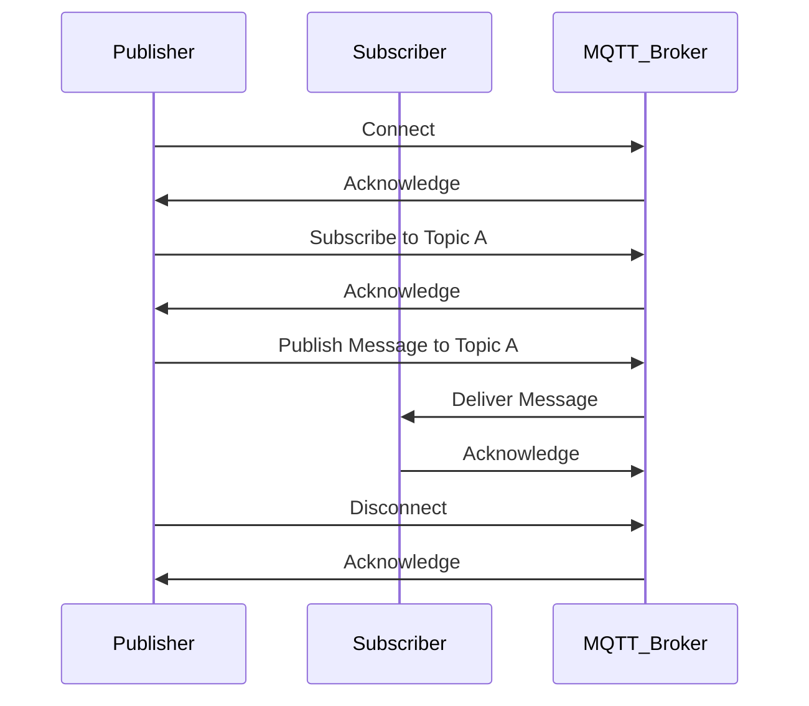

                 

### 1. 背景介绍

#### MQTT协议的起源

MQTT（Message Queuing Telemetry Transport）协议起源于1999年，由IBM的Ardent公司软件工程师Arshdeep Bahga和Andy Stanford-Clark共同开发。该协议的初衷是为资源受限的环境提供一种轻量级的通信方式，以便于远程监控和物联网应用。最初的背景是为了实现卫星数据采集和传输的效率优化，但后来MQTT被广泛应用于智能家居、工业自动化、智能交通等多个领域。

#### 物联网的发展与需求

随着物联网（Internet of Things，IoT）技术的快速发展，设备和传感器数量急剧增加。传统的HTTP协议在低带宽、高延迟的网络环境中表现不佳，难以满足物联网设备的通信需求。物联网设备通常资源有限，如电池寿命有限、存储空间有限、带宽有限等。因此，一种轻量级、低开销、可靠且高效的通信协议变得至关重要。

MQTT协议正是为了解决这些问题而诞生的。它的设计目标是尽可能地减少带宽占用，同时确保消息的可靠传输。通过使用MQTT协议，物联网设备可以更加高效地进行数据交换，从而降低运营成本，延长设备寿命。

#### MQTT协议的优势

1. **轻量级协议**：MQTT协议具有极小的消息头部，消息传输效率高，特别适合带宽受限的环境。
2. **可靠传输**：MQTT协议支持消息的确认机制，确保消息的可靠传输。
3. **可扩展性**：MQTT协议支持多种质量服务等级（QoS），可以根据不同的应用场景进行灵活配置。
4. **易于集成**：MQTT协议简单且易于实现，可以方便地与其他协议和系统进行集成。
5. **安全性**：MQTT协议支持加密，可以确保通信过程中的数据安全性。

### 2. 核心概念与联系

#### MQTT协议核心概念

1. **发布者（Publisher）**：发布者是指发送消息的设备或服务器，它将数据发布到MQTT服务器。
2. **订阅者（Subscriber）**：订阅者是指接收消息的设备或服务器，它订阅了某个特定的主题以接收相关数据。
3. **MQTT服务器（Broker）**：MQTT服务器是负责接收和分发消息的中心节点。它维护订阅者和发布者之间的映射关系，并确保消息的可靠传输。
4. **主题（Topic）**：主题是消息的分类标识符，用于定义发布者和订阅者之间的通信内容。

#### MQTT协议架构


在上图中，可以看到MQTT协议的基本架构：

- **客户端（Client）**：包括发布者和订阅者，它们通过TCP/IP连接到MQTT服务器。
- **MQTT服务器（Broker）**：作为通信的中介，处理客户端的连接、订阅、发布和消息分发。

#### MQTT协议流程

1. **连接**：客户端通过TCP/IP连接到MQTT服务器，并完成身份验证。
2. **订阅**：客户端向MQTT服务器订阅特定的主题。
3. **发布**：客户端将数据发布到订阅的主题。
4. **消息分发**：MQTT服务器将发布者发布的数据分发到订阅该主题的客户端。
5. **断开连接**：客户端完成通信后，与MQTT服务器断开连接。

#### Mermaid流程图



### 3. 核心算法原理 & 具体操作步骤

#### MQTT连接流程

1. **TCP连接**：客户端首先通过TCP/IP协议与MQTT服务器建立连接。
2. **握手**：客户端发送连接请求，包含客户端标识、协议版本、连接目标等信息。服务器响应连接确认。
3. **认证**：如果需要，客户端会提供用户名和密码进行身份验证。
4. **连接确认**：服务器确认连接请求，并返回连接确认包。

#### MQTT订阅流程

1. **订阅请求**：客户端向服务器发送订阅请求，指定订阅的主题和QoS等级。
2. **订阅确认**：服务器确认订阅请求，并将订阅信息存储在内部映射表中。

#### MQTT发布流程

1. **发布请求**：客户端向服务器发送发布请求，包含主题、QoS等级和消息内容。
2. **发布确认**：服务器确认发布请求，并根据QoS等级进行相应的消息处理。

#### MQTT消息确认

- **QoS 0**：消息发送后不进行确认，可靠性最低。
- **QoS 1**：消息发送后等待服务器确认，可靠性中等。
- **QoS 2**：消息发送后等待服务器确认，并确保消息至少被存储一次，可靠性最高。

#### MQTT断开连接

1. **断开请求**：客户端向服务器发送断开请求。
2. **断开确认**：服务器确认断开请求，并释放相关资源。

### 4. 数学模型和公式 & 详细讲解 & 举例说明

#### MQTT消息结构

MQTT消息主要由以下部分组成：

- **固定头部**：包含消息类型、QoS等级、消息标识符等。
- **可变头部**：包含消息的剩余长度、主题名称、消息标识符等。
- **消息体**：包含实际的消息内容。

#### MQTT消息结构公式

$$
\text{消息结构} = (\text{固定头部}, \text{可变头部}, \text{消息体})
$$

#### MQTT消息传输模型

MQTT消息传输模型可以使用以下公式进行描述：

$$
\text{消息传输} = \text{客户端} \rightarrow \text{MQTT服务器} \rightarrow \text{订阅者}
$$

#### MQTT消息确认模型

MQTT消息确认模型可以使用以下公式进行描述：

$$
\text{消息确认} = \text{QoS 0: 无确认} \\
\text{消息确认} = \text{QoS 1: 客户端 \rightarrow MQTT服务器}} \\
\text{消息确认} = \text{QoS 2: 客户端 \rightarrow MQTT服务器 \rightarrow 订阅者}}
$$

#### 举例说明

假设客户端A订阅了主题`home/temperature`，并发布了一条消息`{"value": 25.5}`到主题。

1. **连接请求**：客户端A通过TCP连接到MQTT服务器。
2. **订阅请求**：客户端A发送订阅请求，订阅主题`home/temperature`，QoS等级为1。
3. **发布请求**：客户端A发送发布请求，主题为`home/temperature`，QoS等级为1，消息内容为`{"value": 25.5}`。
4. **消息确认**：服务器收到发布请求后，向客户端A发送确认消息。
5. **消息分发**：服务器将消息分发到订阅主题`home/temperature`的订阅者，如客户端B。

### 5. 项目实践：代码实例和详细解释说明

#### 开发环境搭建

1. **安装Java开发环境**：在本地计算机上安装Java开发环境，确保JDK版本至少为1.8。
2. **安装MQTT服务器**：可以选择安装开源的MQTT服务器如mosquitto，或者使用云服务提供的MQTT服务器。
3. **创建项目**：使用IDE（如Eclipse或IntelliJ IDEA）创建Java项目，并添加必要的依赖库。

#### 源代码详细实现

以下是一个简单的MQTT客户端示例代码，用于连接MQTT服务器、订阅主题并发布消息。

```java
import org.eclipse.paho.client.mqttv3.*;
import org.eclipse.paho.client.mqttv3.impl.MQTTClient;

public class MQTTClientExample {
    public static void main(String[] args) {
        String brokerUri = "tcp://localhost:1883";
        String clientId = "MQTTClientExample";
        String topic = "home/temperature";

        MQTTClient mqttClient = new MQTTClient();
        try {
            // 连接到MQTT服务器
            mqttClient.connect(brokerUri, clientId);

            // 订阅主题
            mqttClient.subscribe(topic, 1);

            // 发布消息
            String message = "{\"value\": 25.5}";
            mqttClient.publish(topic, message, 1, true);

            // 断开连接
            mqttClient.disconnect();
        } catch (MqttException e) {
            e.printStackTrace();
        }
    }
}
```

#### 代码解读与分析

1. **导入依赖库**：首先需要导入相关的MQTT客户端库。
2. **配置MQTT服务器**：指定MQTT服务器的地址（URI）和客户端ID。
3. **连接服务器**：使用`connect`方法连接到MQTT服务器。
4. **订阅主题**：使用`subscribe`方法订阅特定的主题，并设置QoS等级。
5. **发布消息**：使用`publish`方法发布消息到订阅的主题。
6. **断开连接**：在完成通信后，使用`disconnect`方法断开与MQTT服务器的连接。

#### 运行结果展示

1. **启动MQTT服务器**：启动本地MQTT服务器（如mosquitto）。
2. **运行客户端程序**：运行Java程序，连接到MQTT服务器并订阅主题。
3. **查看订阅者**：使用MQTT终端客户端（如MQTT.fx）连接到MQTT服务器，并查看订阅的主题`home/temperature`。

在MQTT终端客户端中，应该可以看到发布者发布的消息`{"value": 25.5}`。

### 6. 实际应用场景

#### 智能家居

MQTT协议在智能家居领域得到了广泛应用。例如，智能灯具、智能门锁、智能恒温器等设备可以通过MQTT协议与家庭网关进行通信，实现远程控制和自动化场景。

#### 工业自动化

在工业自动化领域，MQTT协议被用于传感器数据采集、设备状态监控和远程控制。例如，生产线上的各种传感器可以实时发送数据到MQTT服务器，供监控系统进行分析和处理。

#### 智能交通

智能交通系统中的车辆传感器、道路监控设备等可以通过MQTT协议传输数据，实现交通流量监测、故障诊断和应急响应。

#### 物流跟踪

在物流跟踪领域，MQTT协议可以用于实时跟踪运输过程中的温度、湿度等环境参数，确保货物安全到达目的地。

### 7. 工具和资源推荐

#### 学习资源推荐

1. **《MQTT协议设计与实现》**：这本书详细介绍了MQTT协议的设计原理和实现细节。
2. **《物联网通信技术》**：这本书涵盖了物联网通信的多个方面，包括MQTT协议。
3. **《MQTT官方文档》**：MQTT协议的官方文档，提供了最权威的技术指南。

#### 开发工具框架推荐

1. **Eclipse Paho MQTT客户端库**：Eclipse Paho项目提供了跨平台的MQTT客户端库，适用于Java、C++、C#等多种编程语言。
2. **mosquitto MQTT服务器**：mosquitto是一个开源的MQTT服务器，易于安装和使用。
3. **MQTT.fx MQTT终端客户端**：MQTT.fx是一个跨平台的MQTT客户端工具，方便测试和调试MQTT协议。

#### 相关论文著作推荐

1. **“MQTT: A Message Queuing Protocol for Sensor Networks”**：这篇论文是MQTT协议的原始论文，详细介绍了协议的设计和实现。
2. **“MQTT v5.0 Specification”**：MQTT v5.0规范的正式文档，提供了最新版本的协议规范。

### 8. 总结：未来发展趋势与挑战

#### 发展趋势

1. **协议标准化**：随着物联网的快速发展，MQTT协议的标准化工作越来越重要，以促进不同设备和平台之间的互操作性。
2. **安全性增强**：随着物联网设备的增加，安全性成为了一个关键问题。未来的MQTT协议将更加注重安全性，包括加密通信、认证机制等。
3. **智能化与自动化**：随着人工智能技术的进步，MQTT协议将更多地与智能算法结合，实现更加智能化和自动化的物联网应用。

#### 挑战

1. **性能优化**：在物联网设备数量急剧增加的背景下，如何提高MQTT协议的性能和可扩展性是一个挑战。
2. **跨平台兼容性**：不同操作系统和硬件平台之间的兼容性问题是另一个挑战。
3. **安全性**：确保物联网设备和数据的安全性是一个长期而艰巨的任务。

### 9. 附录：常见问题与解答

#### 问题1：MQTT协议与HTTP协议有什么区别？

**解答**：MQTT协议和HTTP协议都是用于数据传输的协议，但它们在设计目标和应用场景上有很大的区别。MQTT协议是专为物联网设备设计的，轻量级、低带宽占用、可靠传输，适用于资源受限的环境。而HTTP协议是Web应用的标准协议，设计用于请求-响应模式，带宽需求较高，不适用于物联网设备。

#### 问题2：MQTT协议支持加密通信吗？

**解答**：是的，MQTT协议支持加密通信。通过使用TLS（传输层安全协议），可以确保客户端和服务器之间的通信数据是加密的，从而提高数据的安全性。

#### 问题3：如何选择合适的QoS等级？

**解答**：选择合适的QoS等级取决于应用场景的需求。QoS 0适用于对消息可靠性要求不高的场景，如简单的状态监控。QoS 1适用于需要确保消息至少被发送一次的场景，如传感器数据采集。QoS 2适用于需要确保消息被可靠传输的场景，如关键数据通信。

### 10. 扩展阅读 & 参考资料

1. **“MQTT 5.0 Protocol Specification”**：https://docs.oasis-open.org/mqtt/mqtt/v5.0/os/mqtt-v5.0-os.html
2. **“Eclipse Paho MQTT Client Library”**：https://www.eclipse.org/paho/clients/
3. **“mosquitto MQTT Server”**：https://mosquitto.org/
4. **“MQTT Application Guide”**：https://www.hivemq.com/documentation/
5. **“IoT Protocol Comparison”**：https://www.hivemq.com/iot-protocol-comparison/

---

作者：禅与计算机程序设计艺术 / Zen and the Art of Computer Programming

通过以上详细的讲解，相信读者对MQTT物联网通信协议已经有了深入的了解。MQTT协议以其轻量级、可靠性和易用性在物联网领域得到了广泛应用，未来也将继续在物联网技术的发展中发挥重要作用。在实现物联网应用时，选择合适的通信协议至关重要，MQTT协议无疑是一个优秀的选项。希望这篇文章能够为您的物联网项目提供有益的指导。如果您对MQTT协议还有其他疑问或需求，欢迎进一步讨论和交流。|

