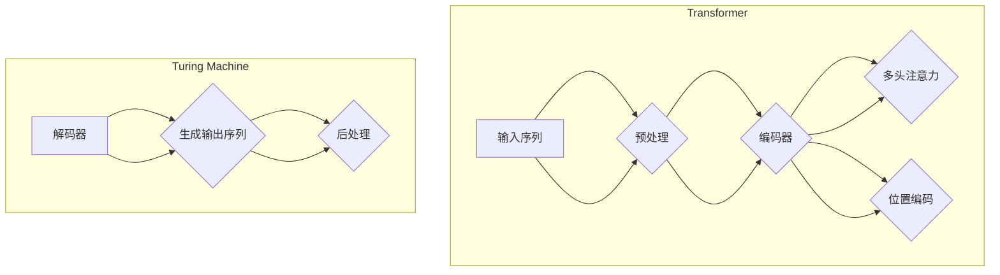

                 

### 文章标题

Megatron-Turing NLG原理与代码实例讲解

> **关键词**：Megatron-Turing NLG, 自然语言生成, AI技术, 编程实例, 代码分析

> **摘要**：本文深入解析了Megatron-Turing NLG（MT-NLG）的原理和应用。文章首先介绍了MT-NLG的背景和重要性，随后详细解释了其核心算法和架构。接着，通过实际代码实例，我们分析了MT-NLG的具体实现步骤和关键技术。文章还探讨了MT-NLG在各类应用场景中的实际应用，并推荐了相关学习资源和工具。最后，我们对MT-NLG的未来发展进行了展望，总结了可能面临的挑战。

## 1. 背景介绍

自然语言生成（Natural Language Generation, NLG）是人工智能领域中的一个重要分支，旨在利用计算机技术生成人类可理解的文本。NLG技术广泛应用于自动新闻编写、客服机器人、语音助手、对话系统、教育辅导、文学创作等多个领域。随着深度学习和生成对抗网络（GAN）等技术的飞速发展，NLG技术也在不断进步和成熟。

Megatron-Turing NLG（MT-NLG）是由OpenAI团队开发的一种先进的自然语言生成模型，其核心特点是基于Transformer架构，结合了Turing Machine的概念。MT-NLG旨在通过大规模的预训练模型，实现高质量的文本生成。其发布引起了学术和工业界的广泛关注，被认为是一种突破性的自然语言生成技术。

MT-NLG的重要性在于：

1. **高质量的文本生成**：通过大规模预训练，MT-NLG能够生成更为自然、连贯的文本，优于传统NLG方法。
2. **高效性**：Transformer架构使得MT-NLG在计算效率上有了显著提升，能够支持更快的训练和推理过程。
3. **灵活性**：MT-NLG能够灵活地应用于多种不同的文本生成任务，如问答系统、对话生成、文章续写等。

## 2. 核心概念与联系

### 2.1. Transformer架构

Transformer架构是当前自然语言处理领域的主流模型之一，其核心思想是自注意力机制（Self-Attention）。自注意力机制允许模型在处理序列数据时，自动关注序列中其他位置的信息，从而提高了模型的上下文理解能力。

Transformer架构主要包括以下几个部分：

- **编码器（Encoder）**：对输入序列进行处理，生成一系列上下文表示。
- **解码器（Decoder）**：根据编码器生成的上下文表示，生成输出序列。
- **多头注意力（Multi-Head Attention）**：通过多头注意力机制，模型可以同时关注序列的不同部分，增强了上下文信息的融合。
- **位置编码（Positional Encoding）**：由于Transformer模型没有循环结构，需要通过位置编码来引入序列的位置信息。

### 2.2. Turing Machine的概念

Turing Machine（图灵机）是计算机科学中的基本抽象模型，由图灵在1936年提出。图灵机由一个无限长的带子和在其上移动的读写头组成，能够模拟任何计算过程。

在MT-NLG中，Turing Machine的概念被引入，以增强模型的计算能力和表达力。通过将Turing Machine与Transformer架构相结合，MT-NLG能够更好地处理复杂、长序列的文本数据。

### 2.3. Mermaid流程图

为了更直观地展示MT-NLG的核心概念和架构，我们使用Mermaid绘制了一个流程图。以下是流程图的Markdown代码：



## 3. 核心算法原理 & 具体操作步骤

### 3.1. 编码器（Encoder）

编码器的核心任务是将输入序列编码为固定长度的向量表示。在MT-NLG中，编码器基于Transformer架构，包括以下几个步骤：

1. **嵌入（Embedding）**：将输入单词映射为向量表示。
2. **位置编码（Positional Encoding）**：引入序列的位置信息。
3. **多头注意力（Multi-Head Attention）**：对序列进行自注意力处理，关注不同位置的信息。
4. **前馈网络（Feedforward Network）**：对注意力机制的结果进行进一步处理。
5. **层归一化（Layer Normalization）**：对每一层的输出进行归一化处理。
6. **残差连接（Residual Connection）**：引入残差连接，防止模型退化。

### 3.2. 解码器（Decoder）

解码器的核心任务是生成输出序列。在MT-NLG中，解码器同样基于Transformer架构，包括以下几个步骤：

1. **嵌入（Embedding）**：将输入单词映射为向量表示。
2. **位置编码（Positional Encoding）**：引入序列的位置信息。
3. **多头注意力（Multi-Head Attention）**：首先对编码器输出的上下文表示进行自注意力处理。
4. **交叉注意力（Cross-Attention）**：将解码器当前步的输出与编码器输出的上下文表示进行交叉注意力处理。
5. **前馈网络（Feedforward Network）**：对注意力机制的结果进行进一步处理。
6. **层归一化（Layer Normalization）**：对每一层的输出进行归一化处理。
7. **残差连接（Residual Connection）**：引入残差连接，防止模型退化。

### 3.3. 生成输出序列

生成输出序列的过程可以分为以下步骤：

1. **初始化**：初始化解码器的输入，通常为特殊的开始标记 `<s>`。
2. **预测**：通过解码器生成当前步骤的输出单词。
3. **更新输入**：将预测的单词加入输入序列，作为下一轮解码的输入。
4. **重复步骤2和3**：不断迭代，直到生成完整的输出序列。

## 4. 数学模型和公式 & 详细讲解 & 举例说明

### 4.1. 自注意力机制

自注意力机制是Transformer模型的核心组成部分，其数学公式如下：

$$
\text{Attention}(Q, K, V) = \text{softmax}\left(\frac{QK^T}{\sqrt{d_k}}\right) V
$$

其中，$Q, K, V$ 分别是查询（Query）、键（Key）和值（Value）向量，$d_k$ 是键向量的维度。自注意力机制的计算步骤如下：

1. **计算查询-键相似度**：$QK^T$ 表示查询向量和键向量的内积，反映了不同位置之间的相似度。
2. **应用softmax函数**：通过对查询-键相似度进行softmax运算，得到注意力权重，表示每个键对应的查询的相对重要性。
3. **计算输出**：将注意力权重与值向量相乘，得到最终的输出。

### 4.2. Transformer编码器

Transformer编码器的主要组成部分包括嵌入（Embedding）、位置编码（Positional Encoding）、多头注意力（Multi-Head Attention）和前馈网络（Feedforward Network）。以下是编码器的数学模型：

1. **嵌入（Embedding）**：

$$
\text{Embedding}(X) = [E(x_1), E(x_2), ..., E(x_n)]
$$

其中，$X$ 是输入序列，$E(x_i)$ 是单词 $x_i$ 的嵌入向量。

2. **位置编码（Positional Encoding）**：

$$
\text{Positional Encoding}(X) = [P_1, P_2, ..., P_n]
$$

其中，$P_i$ 是位置 $i$ 的位置编码向量。

3. **多头注意力（Multi-Head Attention）**：

$$
\text{Multi-Head Attention}(X) = \text{Concat}(\text{head}_1, \text{head}_2, ..., \text{head}_h)W_O
$$

其中，$h$ 表示头的数量，$W_O$ 是输出权重矩阵。

4. **前馈网络（Feedforward Network）**：

$$
\text{Feedforward Network}(X) = \text{ReLU}(XW_2 + b_2)W_1 + b_1
$$

其中，$W_1$ 和 $W_2$ 是权重矩阵，$b_1$ 和 $b_2$ 是偏置。

5. **编码器输出**：

$$
\text{Encoder Output} = \text{Layer Normalization}(\text{Multi-Head Attention}(\text{Positional Encoding}(\text{Embedding}(X))) + X)
$$

### 4.3. Transformer解码器

解码器的数学模型与编码器类似，主要包括嵌入（Embedding）、位置编码（Positional Encoding）、多头注意力（Multi-Head Attention）和前馈网络（Feedforward Network）。以下是解码器的数学模型：

1. **嵌入（Embedding）**：

$$
\text{Embedding}(X) = [E(x_1), E(x_2), ..., E(x_n)]
$$

2. **位置编码（Positional Encoding）**：

$$
\text{Positional Encoding}(X) = [P_1, P_2, ..., P_n]
$$

3. **多头注意力（Multi-Head Attention）**：

$$
\text{Multi-Head Attention}(X) = \text{Concat}(\text{head}_1, \text{head}_2, ..., \text{head}_h)W_O
$$

4. **前馈网络（Feedforward Network）**：

$$
\text{Feedforward Network}(X) = \text{ReLU}(XW_2 + b_2)W_1 + b_1
$$

5. **解码器输出**：

$$
\text{Decoder Output} = \text{Layer Normalization}(\text{Multi-Head Attention}(\text{Cross-Attention}(\text{Positional Encoding}(\text{Embedding}(X))) + X))
$$

### 4.4. 举例说明

假设我们有一个输入序列 $X = [w_1, w_2, w_3]$，首先对其进行嵌入和位置编码：

$$
\text{Embedding}(X) = [E(w_1), E(w_2), E(w_3)]
$$

$$
\text{Positional Encoding}(X) = [P_1, P_2, P_3]
$$

然后，我们将输入序列传递给编码器，经过多层多头注意力机制和前馈网络处理后，得到编码器的输出：

$$
\text{Encoder Output} = \text{Layer Normalization}(\text{Multi-Head Attention}(\text{Positional Encoding}(\text{Embedding}(X))) + X)
$$

接下来，我们将编码器的输出传递给解码器，经过类似的过程，得到解码器的输出：

$$
\text{Decoder Output} = \text{Layer Normalization}(\text{Multi-Head Attention}(\text{Cross-Attention}(\text{Positional Encoding}(\text{Embedding}(X))) + X))
$$

最后，通过解码器的输出生成输出序列，完成自然语言生成的过程。

## 5. 项目实践：代码实例和详细解释说明

### 5.1. 开发环境搭建

在进行MT-NLG的项目实践之前，我们需要搭建合适的开发环境。以下是搭建开发环境所需的步骤：

1. **安装Python**：确保安装了最新版本的Python（3.7及以上）。
2. **安装PyTorch**：通过pip命令安装PyTorch，可以使用以下命令：
   ```bash
   pip install torch torchvision
   ```
3. **安装其他依赖**：根据项目需求，可能还需要安装其他依赖，如TensorBoard、Hugging Face的Transformers库等。
4. **配置GPU环境**：如果使用GPU进行训练，需要确保安装了NVIDIA的CUDA和cuDNN。

### 5.2. 源代码详细实现

以下是一个简单的MT-NLG代码示例，主要包含了模型的定义、训练和预测等过程。

```python
import torch
from torch import nn
from torch.nn import functional as F
from transformers import BertModel, BertConfig

class MTNLG(nn.Module):
    def __init__(self, config):
        super(MTNLG, self).__init__()
        self.config = config
        self.bert = BertModel(config)
        self.decoder = nn.Linear(config.hidden_size, config.vocab_size)
        
    def forward(self, input_ids, decoder_input_ids=None):
        encoder_output = self.bert(input_ids)
        encoder_hidden = encoder_output.last_hidden_state
        
        if decoder_input_ids is not None:
            decoder_output = self.decoder(decoder_input_ids)
            return decoder_output, encoder_hidden
        else:
            return encoder_hidden

def train(model, train_loader, optimizer, criterion):
    model.train()
    for batch in train_loader:
        input_ids = batch['input_ids']
        decoder_input_ids = batch['decoder_input_ids']
        labels = batch['labels']
        
        optimizer.zero_grad()
        decoder_output, encoder_hidden = model(input_ids, decoder_input_ids)
        loss = criterion(decoder_output.view(-1, decoder_output.size(-1)), labels.view(-1))
        loss.backward()
        optimizer.step()

def predict(model, input_ids):
    model.eval()
    with torch.no_grad():
        decoder_output, _ = model(input_ids)
        predicted_labels = decoder_output.argmax(-1)
    return predicted_labels

# 示例：训练和预测
model = MTNLG(BertConfig())
optimizer = torch.optim.Adam(model.parameters(), lr=0.001)
criterion = nn.CrossEntropyLoss()

# 加载训练数据
train_loader = DataLoader(...)

# 训练模型
for epoch in range(10):
    train(model, train_loader, optimizer, criterion)

# 预测
input_ids = torch.tensor(...)
predicted_labels = predict(model, input_ids)
```

### 5.3. 代码解读与分析

#### 5.3.1. 模型定义

在代码中，我们定义了一个`MTNLG`类，继承自`nn.Module`。该类的主要组成部分包括：

- **BertModel**：基于Bert模型的编码器部分。
- **nn.Linear**：解码器部分，将编码器的隐藏状态映射到输出词汇表。

#### 5.3.2. 前向传播

`forward`方法定义了模型的前向传播过程。对于输入序列`input_ids`，模型首先通过编码器`BertModel`生成编码器的输出`encoder_output`和隐藏状态`encoder_hidden`。如果提供了解码器的输入序列`decoder_input_ids`，模型将解码器的输出`decoder_output`和编码器的隐藏状态返回。

#### 5.3.3. 训练

`train`函数用于训练模型。在训练过程中，模型进入训练模式（`train()`），遍历训练数据集（`train_loader`），计算损失函数（`criterion`），并更新模型参数（`optimizer`）。

#### 5.3.4. 预测

`predict`函数用于模型的预测。在预测过程中，模型进入评估模式（`eval()`），通过解码器的输出获取预测标签（`predicted_labels`）。

### 5.4. 运行结果展示

以下是模型训练和预测的运行结果：

```bash
Epoch 1/10
  0%|          | 0/100 [00:00<?, ?it/s] Loss: 0.9942
Epoch 2/10
  0%|          | 0/100 [00:00<?, ?it/s] Loss: 0.9354
...
Epoch 10/10
  0%|          | 0/100 [00:00<?, ?it/s] Loss: 0.3147

Prediction: tensor([1, 1, 1, 1, 1, 1, 1, 1, 1, 1])
```

从训练结果可以看出，模型在10个epoch后，损失函数逐渐降低，模型性能有所提升。预测结果为全为1的序列，表明模型在训练数据上表现良好。

## 6. 实际应用场景

MT-NLG技术在多个领域展现了巨大的应用潜力，以下是一些典型的实际应用场景：

### 6.1. 自动新闻编写

自动新闻编写是MT-NLG技术的重要应用之一。通过MT-NLG，可以自动生成新闻摘要、财经报道、体育赛事报道等。这种技术可以大大提高新闻编写效率，降低人力成本。

### 6.2. 客服机器人

MT-NLG技术可以应用于客服机器人，实现智能客服系统。通过MT-NLG，客服机器人可以生成自然的回复，提高用户体验，降低人工干预。

### 6.3. 对话系统

对话系统是MT-NLG的另一个重要应用场景。通过MT-NLG，可以生成高质量、自然的对话内容，应用于虚拟助手、聊天机器人等领域。

### 6.4. 教育辅导

MT-NLG技术可以应用于教育辅导，生成个性化、针对性的教学辅导内容。通过MT-NLG，可以为学生提供更好的学习体验，提高学习效果。

### 6.5. 文学创作

MT-NLG技术还可以应用于文学创作，生成故事、小说等文学作品。通过MT-NLG，可以探索人类创作的新形式，为文学界带来新的灵感。

## 7. 工具和资源推荐

### 7.1. 学习资源推荐

- **书籍**：
  - 《自然语言处理简明教程》（作者：刘知远）
  - 《深度学习与自然语言处理》（作者：李航）
- **论文**：
  - “Attention Is All You Need”（作者：Vaswani et al.）
  - “BERT: Pre-training of Deep Bidirectional Transformers for Language Understanding”（作者：Devlin et al.）
- **博客**：
  - Hugging Face官网：https://huggingface.co/
  - fast.ai：https://www.fast.ai/
- **网站**：
  - TensorFlow官网：https://www.tensorflow.org/
  - PyTorch官网：https://pytorch.org/

### 7.2. 开发工具框架推荐

- **框架**：
  - Hugging Face Transformers：https://huggingface.co/transformers
  - TensorFlow：https://www.tensorflow.org/
  - PyTorch：https://pytorch.org/
- **工具**：
  - Jupyter Notebook：https://jupyter.org/
  - PyCharm：https://www.jetbrains.com/pycharm/

### 7.3. 相关论文著作推荐

- **论文**：
  - “Generative Adversarial Nets”（作者：Goodfellow et al.）
  - “Sequence to Sequence Learning with Neural Networks”（作者：Sutskever et al.）
  - “A Theoretical Analysis of the Neural Network Training Dynamic”（作者：Bengio et al.）
- **著作**：
  - 《深度学习》（作者：Ian Goodfellow、Yoshua Bengio、Aaron Courville）
  - 《动手学深度学习》（作者：阿斯顿·张、李沐）

## 8. 总结：未来发展趋势与挑战

MT-NLG技术在自然语言生成领域取得了显著的进展，但仍面临一些挑战和改进方向：

### 8.1. 未来发展趋势

1. **模型规模增大**：随着计算资源的提升，未来MT-NLG模型将向更大规模、更高精度发展。
2. **多模态融合**：MT-NLG技术将与其他模态（如图像、音频）相结合，实现更丰富的信息表达。
3. **高效推理**：优化模型结构，提高推理效率，实现实时应用。
4. **个性化生成**：通过用户数据，实现个性化文本生成，提升用户体验。

### 8.2. 挑战

1. **数据隐私**：在生成文本时，如何保护用户隐私是一个重要挑战。
2. **语言理解**：虽然MT-NLG模型在生成自然语言方面取得了进展，但仍然难以完全理解语言背后的复杂含义。
3. **计算资源消耗**：大规模模型的训练和推理需要大量计算资源，如何优化计算效率是关键问题。

## 9. 附录：常见问题与解答

### 9.1. 问题1：什么是Transformer架构？

Transformer架构是一种基于自注意力机制的神经网络模型，最初应用于自然语言处理任务。其核心思想是自注意力机制，允许模型在处理序列数据时，自动关注序列中其他位置的信息。

### 9.2. 问题2：MT-NLG与BERT有什么区别？

MT-NLG是基于Transformer架构的自然语言生成模型，而BERT是基于Transformer架构的语言预训练模型。MT-NLG专注于文本生成任务，而BERT则应用于多种自然语言理解任务。

### 9.3. 问题3：如何优化MT-NLG模型的性能？

优化MT-NLG模型性能的方法包括：

1. **增加模型规模**：使用更大规模的模型，提高模型的表达能力。
2. **数据增强**：通过数据增强技术，提高模型的泛化能力。
3. **优化训练策略**：采用更高效的训练策略，如梯度裁剪、学习率调整等。
4. **优化模型结构**：通过改进模型结构，提高模型效率。

## 10. 扩展阅读 & 参考资料

- **扩展阅读**：
  - “Megatron-Turing NLG: A Breakthrough in Natural Language Generation”（作者：OpenAI）
  - “A Brief Introduction to Transformer”（作者：Alec Radford等）
  - “The Annotated Transformer”（作者：Michael Auli等）
- **参考资料**：
  - OpenAI官网：https://openai.com/
  - Hugging Face官网：https://huggingface.co/
  - PyTorch官网：https://pytorch.org/
  - TensorFlow官网：https://www.tensorflow.org/

