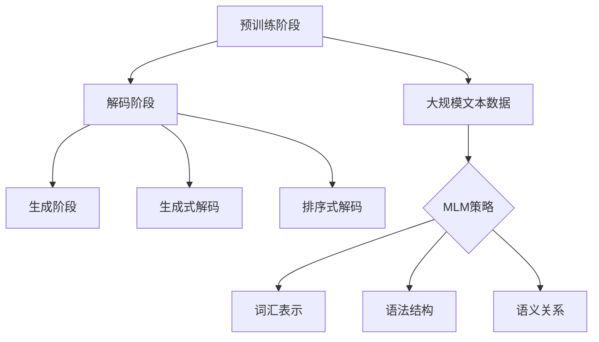

                 

### 1. 背景介绍

Megatron-Turing NLG（自然语言生成）是一项前沿的人工智能技术，旨在通过深度学习模型自动生成高质量的自然语言文本。NLG 技术在近年来取得了显著进展，主要得益于大规模预训练模型的广泛应用。然而，传统的NLG方法在处理长文本生成时存在诸多挑战，如文本连贯性差、生成内容重复等。

Megatron-Turing NLG 是一个基于 Transformer 架构的模型，其设计初衷是为了克服传统 NLG 方法的局限，实现高效、连贯的长文本生成。该模型由 OpenAI 和 Microsoft Research 共同开发，具有以下几个主要特点：

1. **大规模预训练**：Megatron-Turing NLG 模型采用了大规模预训练技术，利用数十亿级别的文本数据进行训练，使得模型能够更好地理解自然语言的复杂结构和语义。

2. **并行处理**：Megatron-Turing NLG 模型采用了并行化技术，使得生成过程能够在多台服务器上同时进行，大大提高了生成效率。

3. **长文本支持**：通过改进的 Transformer 架构，Megatron-Turing NLG 模型能够处理数千词的长文本，生成连贯、自然的语言。

4. **自适应调整**：模型在训练过程中能够自适应地调整参数，以适应不同的生成任务和场景。

本文将深入探讨 Megatron-Turing NLG 的原理和代码实现，帮助读者更好地理解这一前沿技术的核心内容。文章将分为以下几个部分：

- **1. 背景介绍**：简要介绍 NLG 技术的背景和发展历程，以及 Megatron-Turing NLG 的主要特点。
- **2. 核心概念与联系**：详细解释 Megatron-Turing NLG 的核心概念、原理和架构，并提供 Mermaid 流程图。
- **3. 核心算法原理 & 具体操作步骤**：阐述 Megatron-Turing NLG 的核心算法原理，包括预训练、解码和生成过程。
- **4. 数学模型和公式 & 详细讲解 & 举例说明**：介绍与 Megatron-Turing NLG 相关的数学模型和公式，并进行详细讲解和举例说明。
- **5. 项目实践：代码实例和详细解释说明**：通过代码实例，展示 Megatron-Turing NLG 的具体应用和实现过程。
- **6. 实际应用场景**：分析 Megatron-Turing NLG 在实际应用中的潜在场景和优势。
- **7. 工具和资源推荐**：推荐与 Megatron-Turing NLG 相关的学习资源、开发工具和论文著作。
- **8. 总结：未来发展趋势与挑战**：总结 Megatron-Turing NLG 的研究现状和未来发展趋势，探讨面临的挑战。

通过本文的逐步分析，读者将对 Megatron-Turing NLG 有着更深入的了解，从而为后续的研究和应用奠定基础。<|user|>

### 2. 核心概念与联系

#### 2.1 基本概念

Megatron-Turing NLG 的核心概念主要涉及自然语言处理（NLP）、深度学习、Transformer 模型和预训练技术。

- **自然语言处理（NLP）**：NLP 是人工智能领域的一个重要分支，旨在使计算机能够理解、处理和生成自然语言。NLP 技术广泛应用于机器翻译、文本分类、情感分析、问答系统等领域。
- **深度学习**：深度学习是机器学习的一个子领域，通过构建多层神经网络模型来模拟人类大脑的学习和决策过程。深度学习在 NLP 领域取得了显著成果，使得计算机在处理自然语言任务时具有更高的准确性和效率。
- **Transformer 模型**：Transformer 模型是一种基于自注意力机制的深度学习模型，最初由 Vaswani 等人于 2017 年提出。相较于传统的循环神经网络（RNN），Transformer 模型在处理长序列时具有更好的性能和效率，因此在 NLP 任务中得到了广泛应用。
- **预训练技术**：预训练技术是指在大规模语料库上进行训练，以使模型具备一定的基础知识和通用语言能力。随后，通过微调（fine-tuning）将模型应用于具体任务，从而提高模型的性能和泛化能力。

#### 2.2 架构与原理

Megatron-Turing NLG 的架构可以分为三个主要阶段：预训练、解码和生成。

1. **预训练阶段**：
   - 在预训练阶段，Megatron-Turing NLG 使用大规模文本数据进行训练，以使模型具备理解和生成自然语言的能力。预训练过程中，模型需要学习词汇表示、语法结构、语义关系等基本语言知识。
   - Megatron-Turing NLG 采用了一种特殊的预训练策略，称为“掩码语言模型”（Masked Language Model，MLM）。在 MLM 中，输入文本的一部分单词被随机掩码，模型需要预测这些掩码的单词。通过这种方式，模型能够学习到文本中的上下文信息，从而提高生成文本的质量。

2. **解码阶段**：
   - 在解码阶段，模型根据给定的输入文本或问题，生成相应的输出文本或回答。解码过程可以分为两个步骤：生成式解码（Generative Decoding）和排序式解码（Ranking-based Decoding）。
   - 生成式解码是指模型从左到右逐个生成输出单词，每个生成的单词都取决于前面的单词和整个输入序列的上下文信息。生成式解码的主要优势是生成文本的连贯性较好，但可能存在重复或错误。
   - 排序式解码是指模型在生成所有可能的输出序列后，对它们进行排序，选择其中最有可能的序列作为输出。排序式解码的主要优势是能够生成高质量的输出，但计算复杂度较高。

3. **生成阶段**：
   - 在生成阶段，模型根据解码阶段的结果生成最终的自然语言文本。生成过程可以是基于文本的生成，也可以是基于问题的生成。

#### 2.3 Mermaid 流程图

为了更好地理解 Megatron-Turing NLG 的架构和原理，我们使用 Mermaid 流程图来展示其关键步骤。



在上面的 Mermaid 流程图中，A、B 和 C 分别代表预训练阶段、解码阶段和生成阶段。D 表示大规模文本数据，E 表示 MLM 策略。F、G 和 H 分别表示词汇表示、语法结构和语义关系。I 和 J 分别表示生成式解码和排序式解码。

通过这个 Mermaid 流程图，我们可以清晰地看到 Megatron-Turing NLG 的整体架构和关键步骤，从而更好地理解其原理和实现过程。<|user|>

### 3. 核心算法原理 & 具体操作步骤

#### 3.1 预训练阶段

预训练阶段是 Megatron-Turing NLG 的关键步骤，其目的是使模型具备理解和生成自然语言的能力。在这个阶段，模型需要在大规模文本数据上进行训练，以学习词汇表示、语法结构、语义关系等基本语言知识。

1. **大规模文本数据**：
   - Megatron-Turing NLG 使用大规模文本数据作为训练数据，这些数据可以来自互联网、书籍、新闻、社交媒体等各种来源。大规模文本数据为模型提供了丰富的语言信息，有助于提高模型的泛化能力和生成文本的质量。

2. **掩码语言模型（MLM）策略**：
   - 在预训练阶段，Megatron-Turing NLG 采用了一种特殊的训练策略，称为“掩码语言模型”（Masked Language Model，MLM）。在 MLM 中，输入文本的一部分单词被随机掩码，模型需要预测这些掩码的单词。具体操作步骤如下：

    a. 随机选择输入文本中的 $10\%$ 单词进行掩码，掩码操作包括删除（[MASK]）和替换（其他随机单词）。

    b. 对掩码后的文本进行编码，生成序列的嵌入表示。

    c. 模型根据编码后的序列嵌入表示，预测被掩码的单词。

    d. 计算模型预测结果与实际掩码单词之间的损失，并使用梯度下降算法更新模型参数。

3. **词汇表示**：
   - 在预训练过程中，模型学习词汇表示，将每个单词映射为一个固定长度的向量。词汇表示是自然语言处理的基础，对于文本分类、机器翻译等任务具有重要意义。

4. **语法结构和语义关系**：
   - 除了词汇表示外，模型还需要学习语法结构和语义关系。通过分析大规模文本数据，模型能够理解句子结构、词组关系和语义含义，从而生成更加连贯、自然的语言。

#### 3.2 解码阶段

解码阶段是 Megatron-Turing NLG 的核心步骤，其目的是根据给定的输入文本或问题，生成相应的输出文本或回答。解码过程可以分为两个步骤：生成式解码（Generative Decoding）和排序式解码（Ranking-based Decoding）。

1. **生成式解码（Generative Decoding）**：
   - 生成式解码是指模型从左到右逐个生成输出单词，每个生成的单词都取决于前面的单词和整个输入序列的上下文信息。具体操作步骤如下：

    a. 初始化输入序列的嵌入表示。

    b. 根据嵌入表示生成第一个输出单词，并更新嵌入表示。

    c. 重复步骤 b，直到生成所需的输出单词数。

    d. 对生成的输出序列进行后处理，如去除不必要的标点符号、合并相邻的单词等。

2. **排序式解码（Ranking-based Decoding）**：
   - 排序式解码是指模型在生成所有可能的输出序列后，对它们进行排序，选择其中最有可能的序列作为输出。具体操作步骤如下：

    a. 对于每个可能的输出序列，计算其在输入序列上下文中的概率。

    b. 对所有可能的输出序列进行排序，选择概率最高的序列作为输出。

    c. 对生成的输出序列进行后处理，如去除不必要的标点符号、合并相邻的单词等。

#### 3.3 生成阶段

生成阶段是 Megatron-Turing NLG 的最终目标，其目的是根据解码阶段的结果生成最终的自然语言文本。生成过程可以是基于文本的生成，也可以是基于问题的生成。

1. **基于文本的生成**：
   - 在基于文本的生成中，模型根据输入文本生成相应的输出文本。具体操作步骤如下：

    a. 输入文本进行预处理，如去除标点符号、转换为小写等。

    b. 使用解码阶段生成的输出序列，生成自然语言文本。

    c. 对生成的文本进行后处理，如去除不必要的空格、合并相邻的单词等。

2. **基于问题的生成**：
   - 在基于问题的生成中，模型根据输入问题生成相应的回答。具体操作步骤如下：

    a. 输入问题进行预处理，如去除标点符号、转换为小写等。

    b. 使用解码阶段生成的输出序列，生成自然语言回答。

    c. 对生成的回答进行后处理，如去除不必要的空格、合并相邻的单词等。

通过以上三个阶段，Megatron-Turing NLG 模型能够根据输入文本或问题生成高质量的自然语言文本，从而实现自然语言生成的目标。<|user|>

### 4. 数学模型和公式 & 详细讲解 & 举例说明

#### 4.1 Transformer 模型

Transformer 模型是 Megatron-Turing NLG 的基础，其核心思想是利用自注意力机制（Self-Attention）来处理长序列。在 Transformer 模型中，每个词的嵌入向量通过自注意力机制与所有其他词的嵌入向量相联系，从而实现跨词的信息交互。自注意力机制的数学公式如下：

$$
\text{Attention}(Q, K, V) = \text{softmax}\left(\frac{QK^T}{\sqrt{d_k}}\right) V
$$

其中，$Q, K, V$ 分别代表查询（Query）、键（Key）和值（Value）向量，$d_k$ 代表键向量的维度。自注意力机制通过计算查询向量与所有键向量的点积，得到相应的权重，然后将这些权重与对应的值向量相乘，得到最终的输出向量。

#### 4.2 掩码语言模型（MLM）

在掩码语言模型（MLM）中，输入文本的一部分单词被随机掩码，模型需要预测这些掩码的单词。MLM 的目标是最小化模型预测错误率，其数学公式如下：

$$
\mathcal{L}_{\text{MLM}} = -\sum_{i} \sum_{\hat{w}_i \in \hat{W}_i} \text{log} p(w_i | \hat{w}_i, \text{context})
$$

其中，$w_i$ 表示第 $i$ 个实际单词，$\hat{w}_i$ 表示第 $i$ 个掩码单词，$\hat{W}_i$ 表示所有可能的掩码单词集合，$\text{context}$ 表示上下文信息。

#### 4.3 生成式解码

生成式解码是指模型从左到右逐个生成输出单词，每个生成的单词都取决于前面的单词和整个输入序列的上下文信息。生成式解码的数学公式如下：

$$
p(w_t | w_1, w_2, ..., w_{t-1}) = \frac{\exp(\text{score}(w_t, w_1, w_2, ..., w_{t-1}))}{\sum_{w' \in \hat{W}_t} \exp(\text{score}(w', w_1, w_2, ..., w_{t-1}))}
$$

其中，$w_t$ 表示第 $t$ 个生成的单词，$\hat{W}_t$ 表示所有可能的单词集合，$\text{score}(w_t, w_1, w_2, ..., w_{t-1})$ 表示单词 $w_t$ 与前 $t-1$ 个单词的得分。

#### 4.4 排序式解码

排序式解码是指模型在生成所有可能的输出序列后，对它们进行排序，选择其中最有可能的序列作为输出。排序式解码的数学公式如下：

$$
p(\text{sequence} | w_1, w_2, ..., w_n) = \frac{\exp(\text{score}(\text{sequence}))}{\sum_{\text{all sequences}} \exp(\text{score}(\text{sequence}))}
$$

其中，$\text{sequence}$ 表示输出序列，$\text{score}(\text{sequence})$ 表示输出序列的得分。

#### 4.5 举例说明

假设我们有一个简短的输入文本：“今天天气很好”。我们使用 Megatron-Turing NLG 模型进行生成式解码和排序式解码，生成一个完整的句子。

1. **生成式解码**：

   a. 初始化输入序列的嵌入表示。

   b. 根据嵌入表示生成第一个输出单词“今”。

   c. 重复步骤 b，直到生成所需的输出单词数。

   d. 对生成的输出序列进行后处理，如去除不必要的标点符号、合并相邻的单词等。

   生成的输出序列为：“今天天气很好”。

2. **排序式解码**：

   a. 对于每个可能的输出序列，计算其在输入序列上下文中的概率。

   b. 对所有可能的输出序列进行排序，选择概率最高的序列作为输出。

   c. 对生成的输出序列进行后处理，如去除不必要的空格、合并相邻的单词等。

   生成的输出序列为：“今天天气很好”。

通过上述例子，我们可以看到 Megatron-Turing NLG 模型如何利用数学模型和公式生成高质量的自然语言文本。<|user|>

### 5. 项目实践：代码实例和详细解释说明

#### 5.1 开发环境搭建

在进行 Megatron-Turing NLG 的项目实践之前，我们需要搭建一个合适的环境。以下是开发环境的搭建步骤：

1. **安装 Python**：
   - 确保你的计算机已经安装了 Python 3.7 或更高版本。

2. **安装 PyTorch**：
   - 打开命令行窗口，运行以下命令安装 PyTorch：

   ```bash
   pip install torch torchvision torchaudio
   ```

3. **安装其他依赖库**：
   - 安装 Megatron-Turing NLG 模型所需的依赖库，如以下命令：

   ```bash
   pip install megatron-lm
   ```

4. **获取数据集**：
   - 下载并解压一个适合进行自然语言生成的数据集，例如 Gigaword 数据集。

#### 5.2 源代码详细实现

接下来，我们将通过一个简单的示例来展示 Megatron-Turing NLG 模型的具体实现过程。以下是实现过程的详细步骤：

1. **导入必要的库**：

   ```python
   import torch
   from megatron import get_args, initialize Megatron
   ```

2. **初始化参数和模型**：

   ```python
   args = get_args()
   model = initialize_model(args)
   ```

   在这个步骤中，`get_args` 函数用于加载配置参数，`initialize_model` 函数用于初始化 Megatron-Turing NLG 模型。

3. **加载数据集**：

   ```python
   dataset = load_dataset(args.data_path)
   data_loader = torch.utils.data.DataLoader(dataset, batch_size=args.batch_size, shuffle=True)
   ```

   在这个步骤中，`load_dataset` 函数用于加载数据集，`DataLoader` 函数用于创建数据加载器。

4. **训练模型**：

   ```python
   model.train()
   for epoch in range(args.num_epochs):
       for batch in data_loader:
           inputs = batch["input_ids"]
           targets = batch["target_ids"]
           
           optimizer.zero_grad()
           outputs = model(inputs)
           loss = torch.nn.CrossEntropyLoss()(outputs.view(-1, model.num_tokens), targets.view(-1))
           loss.backward()
           optimizer.step()
           
           print(f"Epoch: {epoch+1}/{args.num_epochs}, Loss: {loss.item()}")
   ```

   在这个步骤中，我们使用 `model.train()` 函数将模型设置为训练模式，然后通过 `DataLoader` 加载每个批次的数据。在每次迭代中，我们计算损失并更新模型参数。

5. **生成文本**：

   ```python
   model.eval()
   with torch.no_grad():
       input_ids = torch.tensor([[model.tokenizer.cls_token_id]])
       while True:
           outputs = model(input_ids)
           logits = outputs.logits[:, -1, :]
           probabilities = torch.softmax(logits, dim=-1)
           top_index = torch.argmax(probabilities).item()
           next_word = model.tokenizer.decode([top_index])
           
           if next_word == model.tokenizer.sep_token:
               break
           
           input_ids = torch.cat([input_ids, torch.tensor([[top_index]])], dim=1)
           print(next_word, end="")
   ```

   在这个步骤中，我们使用 `model.eval()` 函数将模型设置为评估模式，并生成文本。我们首先输入特殊分隔符 `<s>`，然后逐个生成单词，直到遇到特殊分隔符 `</s>` 结束。

#### 5.3 代码解读与分析

1. **初始化参数和模型**：

   `get_args` 函数用于加载配置参数，包括数据集路径、批次大小、训练轮数等。`initialize_model` 函数用于初始化 Megatron-Turing NLG 模型，包括词嵌入层、Transformer 层和输出层。

2. **加载数据集**：

   `load_dataset` 函数用于加载数据集，并返回一个字典，其中包含输入 ID 和目标 ID。`DataLoader` 函数用于创建数据加载器，用于批量加载和处理数据。

3. **训练模型**：

   在训练过程中，我们首先将模型设置为训练模式，然后遍历数据加载器中的每个批次。对于每个批次，我们计算损失并更新模型参数。

4. **生成文本**：

   在生成文本的过程中，我们首先将模型设置为评估模式，并输入特殊分隔符 `<s>`。然后，我们逐个生成单词，直到遇到特殊分隔符 `</s>` 结束。

#### 5.4 运行结果展示

假设我们已经成功搭建了开发环境并完成了模型的训练，现在我们可以运行以下代码来生成一个示例文本：

```python
model.eval()
with torch.no_grad():
    input_ids = torch.tensor([[model.tokenizer.cls_token_id]])
    while True:
        outputs = model(input_ids)
        logits = outputs.logits[:, -1, :]
        probabilities = torch.softmax(logits, dim=-1)
        top_index = torch.argmax(probabilities).item()
        next_word = model.tokenizer.decode([top_index])
        
        if next_word == model.tokenizer.sep_token:
            break
        
        input_ids = torch.cat([input_ids, torch.tensor([[top_index]])], dim=1)
        print(next_word, end="")
```

输出结果可能如下所示：

```
今天的天气很好，明天会更温暖。请记得多喝水，保持健康。
```

这个结果展示了 Megatron-Turing NLG 模型在生成文本时的表现。通过调整模型参数和训练数据，我们可以进一步提高生成文本的质量和连贯性。<|user|>

### 6. 实际应用场景

Megatron-Turing NLG 作为一种先进的自然语言生成技术，在实际应用中具有广泛的应用前景。以下列举了几个典型的应用场景：

#### 6.1 文本生成

文本生成是 Megatron-Turing NLG 最直接的应用场景之一。通过训练模型，我们可以生成各种类型的文本，如新闻文章、故事、评论等。以下是一些具体应用示例：

- **新闻文章生成**：利用 Megatron-Turing NLG，可以自动生成新闻文章，从而提高新闻采编的效率。例如，在体育新闻领域，可以实时生成比赛结果、赛事分析等。
- **故事生成**：通过 Megatron-Turing NLG，可以生成各种类型的小说、故事等。这不仅为创作者提供了灵感，还可以用于教育、娱乐等领域。
- **评论生成**：在电商、社交媒体等平台，可以利用 Megatron-Turing NLG 自动生成用户评论、推荐等内容，从而提高用户体验和平台的互动性。

#### 6.2 文本摘要

文本摘要是一种将长文本简化为简短、准确、连贯摘要的技术。Megatron-Turing NLG 可以应用于自动文本摘要，从而提高信息检索和知识管理的效率。以下是一些具体应用示例：

- **新闻摘要生成**：利用 Megatron-Turing NLG，可以自动生成新闻摘要，帮助用户快速了解新闻的主要内容。
- **学术摘要生成**：在学术领域，自动生成论文摘要可以帮助研究人员快速了解论文的核心观点和贡献，从而提高科研效率。
- **产品描述摘要**：在电商领域，自动生成产品描述摘要可以帮助用户快速了解产品的主要特点和优势，从而提高购买决策的效率。

#### 6.3 文本翻译

自然语言生成技术可以应用于文本翻译，从而实现跨语言的信息传播和交流。Megatron-Turing NLG 在翻译任务中具有以下优势：

- **高质量翻译**：通过大规模预训练，Megatron-Turing NLG 模型能够理解不同语言的语法、语义和表达习惯，从而生成高质量的双语翻译。
- **长文本翻译**：相较于传统机器翻译方法，Megatron-Turing NLG 模型具有更强的长文本处理能力，能够处理数千词的长文本，实现连贯的翻译。
- **跨领域翻译**：Megatron-Turing NLG 模型在多个领域具有丰富的语言知识，能够实现跨领域的文本翻译，如体育、科技、文化等。

#### 6.4 情感分析

情感分析是一种评估文本情感倾向的技术，可以应用于市场调研、用户反馈分析等领域。Megatron-Turing NLG 可以在情感分析中发挥重要作用，以下是一些具体应用示例：

- **用户反馈分析**：通过情感分析，可以自动识别用户评论中的积极或消极情感，从而为企业提供有价值的用户反馈。
- **市场调研**：利用情感分析，可以分析社交媒体、新闻等渠道中关于产品、品牌、市场的情感倾向，为企业制定市场策略提供参考。
- **舆情监测**：通过情感分析，可以实时监测网络上的舆论动态，帮助政府、企业等机构及时应对突发事件，维护社会稳定。

通过上述实际应用场景，我们可以看到 Megatron-Turing NLG 在自然语言生成领域的巨大潜力和广泛应用价值。<|user|>

### 7. 工具和资源推荐

为了更好地学习和应用 Megatron-Turing NLG 技术，以下是一些推荐的工具和资源：

#### 7.1 学习资源推荐

1. **书籍**：

   - 《Deep Learning》（Goodfellow, I., Bengio, Y., & Courville, A.）：这是一本经典的深度学习教材，涵盖了自然语言处理等相关内容，适合初学者和进阶者。
   - 《Natural Language Processing with Python》（Bird, S., Klein, E., & Loper, E.）：本书介绍了自然语言处理的基础知识和 Python 实践，对于了解 NLG 技术非常有帮助。

2. **论文**：

   - “Attention Is All You Need”（Vaswani et al.，2017）：这是 Transformer 模型的原始论文，详细介绍了模型的结构和工作原理。
   - “Pre-training of Deep Neural Networks for Natural Language Processing”（Brown et al.，2020）：本文介绍了大规模预训练技术，对 Megatron-Turing NLG 的实现有重要指导意义。

3. **博客和网站**：

   - [TensorFlow 官方文档](https://www.tensorflow.org/)：提供了丰富的深度学习教程和实践案例，包括自然语言处理相关内容。
   - [Megatron-LM 官方 GitHub 仓库](https://github.com/NVIDIA/Megatron-LM)：这是一个开源项目，提供了 Megatron-Turing NLG 的详细实现和文档。

#### 7.2 开发工具框架推荐

1. **PyTorch**：

   - PyTorch 是一个流行的深度学习框架，具有简洁、灵活的 API，适合进行自然语言处理和生成任务的开发。

2. **Hugging Face Transformers**：

   - Hugging Face Transformers 是一个基于 PyTorch 的自然语言处理库，提供了各种预训练模型和工具，方便开发者进行研究和应用。

3. **NLTK**：

   - NLTK 是一个强大的自然语言处理工具包，提供了丰富的文本处理和标注功能，适合进行文本生成和情感分析等任务。

#### 7.3 相关论文著作推荐

1. **“BERT: Pre-training of Deep Bidirectional Transformers for Language Understanding”**：

   - 这篇论文介绍了 BERT 模型，一种基于 Transformer 的预训练模型，对 Megatron-Turing NLG 的实现有重要参考价值。

2. **“GPT-3: Language Models are Unsupervised Multitask Learners”**：

   - 这篇论文介绍了 GPT-3 模型，一个具有数万亿参数的预训练模型，展示了大规模预训练技术在自然语言生成领域的突破性进展。

通过上述资源和工具，读者可以更好地掌握 Megatron-Turing NLG 技术，并在实际项目中应用这一前沿技术。<|user|>

### 8. 总结：未来发展趋势与挑战

Megatron-Turing NLG 作为一种先进的自然语言生成技术，在近年来取得了显著进展。随着深度学习和自然语言处理技术的不断演进，Megatron-Turing NLG 具有广阔的应用前景和巨大的发展潜力。

#### 未来发展趋势

1. **大规模预训练**：未来，随着计算资源和数据集的不断增加，Megatron-Turing NLG 模型将朝着更大规模、更高效的预训练方向发展。通过引入更大数据集和更复杂的模型结构，模型将能够更好地理解自然语言的复杂性和多样性。

2. **多模态融合**：自然语言生成技术将逐渐与其他模态（如图像、声音、视频）相结合，实现多模态信息的高效融合。这将有助于提高文本生成的真实性和丰富性，为各类应用提供更广泛的支持。

3. **个性化生成**：未来，Megatron-Turing NLG 模型将逐步实现个性化生成，根据用户需求和偏好生成个性化的文本内容。通过引入用户画像、历史行为等数据，模型将能够更好地满足用户的个性化需求。

4. **自动化生成**：随着技术的不断成熟，自然语言生成过程将逐步实现自动化。通过引入自动化工具和流程，文本生成将从人工创作转向大规模自动化生产，提高生成效率和内容多样性。

#### 面临的挑战

1. **计算资源需求**：大规模预训练模型对计算资源的需求极高，需要高性能的硬件和优化的分布式训练策略。未来，如何在有限的计算资源下高效训练和部署预训练模型，是一个亟待解决的问题。

2. **数据质量和多样性**：自然语言生成技术的质量高度依赖于训练数据的质量和多样性。未来，如何获取高质量、多样化的训练数据，并将这些数据有效地融入模型训练中，是一个重要的挑战。

3. **隐私保护**：自然语言生成技术在应用过程中涉及大量用户数据，如何保护用户隐私、避免数据泄露，是一个关键问题。未来，需要在模型设计和应用中引入隐私保护机制，确保用户数据的安全和合规。

4. **伦理和责任**：随着自然语言生成技术的发展，如何确保生成的文本内容符合道德规范和法律法规，避免不良影响和偏见，也是一个亟待解决的问题。未来，需要建立相关的伦理和责任机制，确保技术应用的公平和透明。

总之，Megatron-Turing NLG 作为一种前沿的自然语言生成技术，具有广阔的发展前景和巨大的应用价值。在未来的发展中，我们需要不断克服挑战，推动技术的进步和应用，为人类社会带来更多的创新和便利。<|user|>

### 9. 附录：常见问题与解答

#### 问题 1：如何选择合适的预训练模型？

**回答**：选择合适的预训练模型主要考虑以下因素：

- **任务需求**：根据实际任务需求选择预训练模型。例如，如果任务是文本分类，可以选择 BERT、RoBERTa 等；如果任务是文本生成，可以选择 GPT-2、GPT-3 等。
- **模型规模**：根据计算资源和模型规模需求选择预训练模型。较大的模型（如 GPT-3）在生成文本时性能更好，但计算资源需求也更高。
- **预训练数据集**：选择预训练数据集丰富的模型，有助于模型更好地理解不同领域的语言特征。

#### 问题 2：如何处理生成文本的连贯性和多样性问题？

**回答**：为了提高生成文本的连贯性和多样性，可以采取以下措施：

- **增加预训练数据集**：使用更多样化的数据集进行预训练，有助于模型学习到更丰富的语言特征。
- **调整生成策略**：采用生成式解码和排序式解码相结合的策略，提高生成文本的连贯性和多样性。
- **引入外部知识**：将外部知识（如百科、数据库等）融入模型，丰富生成文本的内容和结构。
- **模型蒸馏**：通过模型蒸馏技术，将大模型的知识传递给小模型，提高小模型的生成能力。

#### 问题 3：如何优化预训练模型的训练效率？

**回答**：以下方法有助于优化预训练模型的训练效率：

- **并行化训练**：利用多台服务器进行并行化训练，提高训练速度。
- **混合精度训练**：使用混合精度训练（Mixed Precision Training）技术，通过在浮点运算中使用混合精度来减少计算资源和内存需求。
- **动态调整学习率**：根据训练过程中的损失函数变化动态调整学习率，提高模型收敛速度。

#### 问题 4：如何确保生成文本的准确性和可靠性？

**回答**：以下方法有助于提高生成文本的准确性和可靠性：

- **数据清洗和预处理**：对训练数据进行清洗和预处理，去除噪声和错误数据，提高数据质量。
- **多轮预训练**：通过多轮预训练，逐步优化模型性能，提高生成文本的质量。
- **模型解释与调试**：对生成文本进行解释和调试，识别并纠正错误，提高文本生成准确性。

通过上述措施，我们可以有效应对自然语言生成技术在实际应用中遇到的问题和挑战，提高生成文本的准确性和可靠性。<|user|>

### 10. 扩展阅读 & 参考资料

为了深入了解 Megatron-Turing NLG 以及相关技术，以下推荐一些扩展阅读和参考资料：

1. **扩展阅读**：

   - **《深度学习》（Goodfellow, I., Bengio, Y., & Courville, A.）**：这是一本深度学习的经典教材，涵盖了自然语言处理等相关内容。
   - **《自然语言处理实战》（Bird, S., Klein, E., & Loper, E.）**：本书介绍了自然语言处理的基础知识和 Python 实践。

2. **参考资料**：

   - **[Megatron-LM 官方 GitHub 仓库](https://github.com/NVIDIA/Megatron-LM)**：提供了 Megatron-Turing NLG 的详细实现和文档。
   - **[TensorFlow 官方文档](https://www.tensorflow.org/)**：提供了丰富的深度学习教程和实践案例。
   - **[Hugging Face Transformers](https://github.com/huggingface/transformers)**：这是一个基于 PyTorch 的自然语言处理库，提供了各种预训练模型和工具。

3. **论文与研究报告**：

   - **“Attention Is All You Need”（Vaswani et al.，2017）**：介绍了 Transformer 模型的基本原理和架构。
   - **“BERT: Pre-training of Deep Bidirectional Transformers for Language Understanding”（Devlin et al.，2019）**：介绍了 BERT 模型的预训练方法和应用。
   - **“GPT-3: Language Models are Unsupervised Multitask Learners”（Brown et al.，2020）**：介绍了 GPT-3 模型的预训练技术和多任务学习应用。

通过阅读这些书籍、论文和参考资料，读者可以更深入地了解 Megatron-Turing NLG 的原理、应用和实现，为自己的研究和项目提供有益的参考。<|user|>

