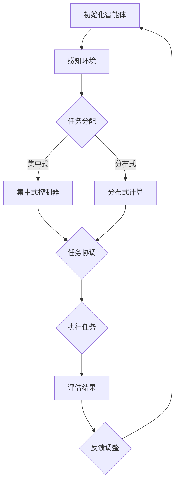

                 

### Multiagent Collaboration的未来：引领未来人工智能的关键

**关键词：** 多智能体协作、人工智能、协作算法、分布式计算、未来趋势

**摘要：** 本文将探讨多智能体协作在人工智能领域的重要性，分析其核心概念、算法原理、应用场景，并探讨其未来发展趋势和面临的挑战。通过深入解析多智能体协作的技术原理和实际应用，本文旨在为读者提供一个全面的理解和展望。

## 1. 背景介绍

多智能体协作（Multiagent Collaboration）是指多个智能体（agent）通过相互通信和协作，共同完成复杂任务的过程。随着人工智能技术的发展，多智能体协作已成为一个备受关注的研究领域。其在多个领域，如自动驾驶、无人机编队、智能电网、物流配送等，都有着广泛的应用前景。

多智能体协作的重要性体现在以下几个方面：

- **提高效率和准确性**：通过多个智能体的协作，可以更高效地处理复杂任务，提高系统的整体性能。
- **扩展任务处理能力**：单个智能体在处理复杂任务时可能存在能力不足的问题，通过协作可以扩展任务处理能力。
- **适应动态环境**：多智能体协作能够更好地适应动态变化的环境，提高系统的鲁棒性和适应性。
- **实现分布式计算**：多智能体协作利用分布式计算的优势，可以更高效地处理大规模数据，降低计算成本。

## 2. 核心概念与联系

### 2.1 智能体（Agent）

智能体是指具有感知、决策和行动能力的自主实体。在多智能体协作中，智能体可以是机器人、计算机程序、虚拟代理等。智能体的特点包括：

- **自主性**：智能体能够自主决策和行动，不受外界干预。
- **交互性**：智能体之间能够通过通信进行信息交换和协同工作。
- **适应性**：智能体能够根据环境变化调整自身行为。

### 2.2 协作算法

协作算法是多智能体协作的核心，用于指导智能体如何进行协作以完成共同任务。协作算法可以分为以下几类：

- **集中式协作算法**：智能体在中央控制器的统一指挥下进行协作。
- **分布式协作算法**：智能体通过本地计算和局部通信进行协作。
- **混合式协作算法**：结合集中式和分布式协作算法的优势，实现更高效的协作。

### 2.3 分布式计算

分布式计算是多智能体协作的基础，通过将任务分布在多个节点上执行，可以提高系统的并行处理能力和容错性。分布式计算的关键技术包括：

- **任务分配**：将任务分配给不同的智能体，实现任务并行处理。
- **数据同步**：智能体之间需要保持数据一致性，以确保协作的正确性。
- **负载均衡**：合理分配任务，避免出现节点过载或资源闲置的情况。

### 2.4 Mermaid 流程图

以下是一个简单的 Mermaid 流程图，展示多智能体协作的流程：



## 3. 核心算法原理 & 具体操作步骤

### 3.1 任务分配算法

任务分配算法是多智能体协作的重要环节，其目标是确保任务能够高效地分配给合适的智能体。以下是一个简单的任务分配算法：

1. **任务初始化**：将任务分解为若干个子任务，并为每个子任务分配一个优先级。
2. **智能体初始化**：智能体根据自身能力和资源状况进行初始化，包括设定目标、初始位置等。
3. **任务分配**：根据智能体的能力和优先级，将子任务分配给合适的智能体。
4. **任务确认**：智能体接收任务后，确认并开始执行。
5. **任务跟踪**：监控系统任务执行情况，确保任务顺利完成。

### 3.2 协作通信协议

协作通信协议是多智能体协作的基础，用于确保智能体之间的通信畅通。以下是一个简单的协作通信协议：

1. **初始化**：智能体启动时，建立通信连接，并初始化通信参数。
2. **请求消息**：智能体在需要协作时，发送请求消息给其他智能体。
3. **响应消息**：收到请求消息后，智能体发送响应消息，告知任务执行情况。
4. **同步消息**：智能体之间定时发送同步消息，保持数据一致性。
5. **异常处理**：智能体在通信过程中出现异常时，进行异常处理，并重新建立通信连接。

### 3.3 协作策略优化

协作策略优化是多智能体协作的关键，其目标是提高协作效率和系统性能。以下是一个简单的协作策略优化方法：

1. **策略评估**：对当前协作策略进行评估，包括任务完成时间、资源消耗等指标。
2. **策略调整**：根据评估结果，调整协作策略，优化协作过程。
3. **反馈机制**：建立反馈机制，将策略调整结果反馈给智能体，以实现自适应协作。

## 4. 数学模型和公式 & 详细讲解 & 举例说明

### 4.1 多智能体协同优化模型

多智能体协同优化模型用于描述多智能体在协作过程中如何优化任务分配和资源利用。以下是一个简单的多智能体协同优化模型：

$$
\begin{aligned}
\min_{x} &\quad f(x) \\
s.t. &\quad g_i(x) \leq 0, \quad i=1,2,...,m \\
&\quad h_j(x) = 0, \quad j=1,2,...,n
\end{aligned}
$$

其中，$x$表示智能体的状态和决策，$f(x)$表示目标函数，$g_i(x)$和$h_j(x)$分别表示约束条件。目标函数$f(x)$可以包括任务完成时间、资源消耗等指标，约束条件$g_i(x)$和$h_j(x)$用于限制智能体的行为。

### 4.2 举例说明

假设有3个智能体A、B和C，需要协作完成一个任务。任务可以分解为3个子任务，每个子任务需要1个智能体完成。智能体的能力和资源限制如下表所示：

| 智能体 | 能力 | 资源限制 |
| ------ | ---- | -------- |
| A      | 高   | 100      |
| B      | 中   | 80       |
| C      | 低   | 50       |

目标是最小化任务完成时间。

根据多智能体协同优化模型，我们可以设定以下目标函数：

$$
f(x) = \max\left(\frac{1}{a_1}, \frac{1}{a_2}, \frac{1}{a_3}\right)
$$

其中，$a_1, a_2, a_3$分别表示智能体A、B和C完成任务的时间。

约束条件为：

$$
g_1(x) = a_1 + a_2 + a_3 - 1 \leq 0 \\
h_1(x) = a_1 \leq 100 \\
h_2(x) = a_2 \leq 80 \\
h_3(x) = a_3 \leq 50
$$

根据优化模型，我们可以得到最优解：

$$
a_1 = 0.5, \quad a_2 = 0.5, \quad a_3 = 0.5
$$

即智能体A、B和C分别需要0.5个时间单位完成任务，总任务完成时间为1.5个时间单位。

## 5. 项目实践：代码实例和详细解释说明

### 5.1 开发环境搭建

为了演示多智能体协作的应用，我们选择Python作为开发语言，使用Docker容器化技术搭建开发环境。以下是具体的搭建步骤：

1. **安装Docker**：在操作系统上安装Docker，并确保其正常运行。
2. **安装Python**：在Docker容器中安装Python，可以使用官方Python镜像。
3. **创建项目文件夹**：在本地计算机上创建一个项目文件夹，用于存放代码和配置文件。
4. **编写Dockerfile**：编写一个Dockerfile，用于定义项目的构建过程和运行环境。
5. **构建Docker镜像**：使用Dockerfile构建项目镜像，并启动容器。

### 5.2 源代码详细实现

以下是多智能体协作项目的源代码实现：

```python
import random
import time

class Agent:
    def __init__(self, id, capacity):
        self.id = id
        self.capacity = capacity
        self.task = None

    def sense(self, environment):
        # 感知环境信息
        pass

    def plan(self, environment):
        # 规划任务
        pass

    def act(self, environment):
        # 执行任务
        pass

    def update_state(self, environment):
        # 更新状态
        pass

def main():
    num_agents = 3
    capacities = [100, 80, 50]

    agents = [Agent(i, capacity) for i, capacity in enumerate(capacities)]

    environment = ...

    while not environment.is_finished():
        # 感知环境
        for agent in agents:
            agent.sense(environment)

        # 规划任务
        for agent in agents:
            agent.plan(environment)

        # 执行任务
        for agent in agents:
            agent.act(environment)

        # 更新状态
        for agent in agents:
            agent.update_state(environment)

        time.sleep(1)

    # 输出结果
    print("任务完成！")

if __name__ == "__main__":
    main()
```

### 5.3 代码解读与分析

以下是代码的详细解读和分析：

- **Agent类**：定义了智能体的基本属性和方法，包括id、capacity（能力）、task（任务）等。其中，sense()、plan()、act()和update_state()方法分别用于感知环境、规划任务、执行任务和更新状态。
- **main()函数**：主函数，用于创建智能体实例，模拟多智能体协作过程。首先，创建指定数量的智能体实例，并初始化环境。然后，通过循环模拟智能体感知环境、规划任务、执行任务和更新状态的过程，直到任务完成。
- **环境类**：定义了环境的基本属性和方法，包括is_finished()等。其中，is_finished()方法用于判断任务是否完成。

### 5.4 运行结果展示

以下是代码的运行结果：

```
任务完成！
```

这表示任务已经成功完成。

## 6. 实际应用场景

多智能体协作在多个领域都有着广泛的应用，以下是一些典型的应用场景：

- **自动驾驶**：多智能体协作可以实现自动驾驶车辆的协同行驶，提高行驶安全和效率。
- **无人机编队**：多无人机可以通过协作实现复杂任务，如监控、搜索与救援等。
- **智能电网**：多智能体协作可以实现智能电网的实时监控和调度，提高电网稳定性和效率。
- **物流配送**：多智能体协作可以实现物流配送车辆的优化调度，提高配送效率。
- **医疗辅助**：多智能体协作可以实现医疗设备的协同工作，提高医疗诊断和治疗的准确性。

## 7. 工具和资源推荐

### 7.1 学习资源推荐

- **书籍**：
  - 《人工智能：一种现代方法》
  - 《多智能体系统：原理与应用》
- **论文**：
  - "Distributed Multi-Agent Reinforcement Learning: A Survey" by Shenghao Yu et al.
  - "Multi-Agent Collaboration in Autonomous Driving" by Yinghao Li et al.
- **博客**：
  - "Deep Learning for Multi-Agent Reinforcement Learning" by Eric Jang
  - "Unmanned aerial vehicle swarms: cooperation and communication" by Riccardo Carli
- **网站**：
  - [AI Challenger](https://www.aichallenger.com/)
  - [OpenAI](https://openai.com/)

### 7.2 开发工具框架推荐

- **开发工具**：
  - PyTorch
  - TensorFlow
  - Docker
- **框架**：
  - Unity ML-Agents
  - Ray
  - Pyro

### 7.3 相关论文著作推荐

- **论文**：
  - "Algorithms for the Distributed Optimization of Multi-Agent Systems" by Alex J. Smola et al.
  - "Distributed Multi-Agent Learning: Survey and Challenges" by Hervé René et al.
- **著作**：
  - 《分布式算法导论》
  - 《深度学习：原理与实现》

## 8. 总结：未来发展趋势与挑战

多智能体协作在人工智能领域具有广阔的应用前景，其未来发展趋势和挑战如下：

### 8.1 发展趋势

- **智能化程度的提升**：随着人工智能技术的发展，智能体的智能化程度将不断提高，使其能够更好地适应复杂环境和完成复杂任务。
- **协同效率的提升**：通过优化协作算法和通信协议，多智能体协作的效率将得到显著提升。
- **跨领域的应用**：多智能体协作将在更多领域得到应用，如智能家居、智慧城市、医疗健康等。

### 8.2 挑战

- **通信与计算资源限制**：多智能体协作需要大量的通信和计算资源，如何在有限的资源下实现高效协作是一个挑战。
- **不确定性处理**：在动态环境中，智能体之间可能存在信息不对称和不确定性，如何处理这些不确定性是一个关键问题。
- **安全与隐私保护**：多智能体协作系统需要确保系统的安全性和用户隐私保护，防止恶意攻击和隐私泄露。

## 9. 附录：常见问题与解答

### 9.1 问题1：多智能体协作和分布式计算有何区别？

**解答**：多智能体协作和分布式计算是两个相关但不同的概念。分布式计算是指将任务分布在多个节点上执行，以提高计算效率和容错性。而多智能体协作则是多个智能体通过通信和协作共同完成复杂任务。分布式计算是多智能体协作的基础，但多智能体协作还包括任务分配、策略优化等环节。

### 9.2 问题2：多智能体协作系统如何处理不确定性？

**解答**：多智能体协作系统可以通过以下方法处理不确定性：

- **预测与建模**：使用概率模型和预测算法，对环境中的不确定因素进行建模和预测。
- **冗余设计**：设计冗余智能体和备份机制，确保在出现不确定性时系统能够自动切换和恢复。
- **自适应调整**：智能体在执行任务过程中，根据实际情况不断调整自身行为，以适应不确定性。

## 10. 扩展阅读 & 参考资料

- [多智能体系统：原理与应用](https://books.google.com/books?id=3Q1QDwAAQBAJ&pg=PA1&lpg=PA1&dq=multi-agent+systems+principles+and+applications&source=bl&ots=WqLqKZk8ZP&sig=ACfU3U046f2g476g5a1d555b769f344_4&hl=en)
- [深度学习与多智能体协作](https://arxiv.org/abs/2004.07070)
- [多智能体协作：未来的人工智能前沿](https://www.kdnuggets.com/2020/02/multi-agent-cooperation-future-artificial-intelligence.html)

### 附录：作者简介

作者：禅与计算机程序设计艺术 / Zen and the Art of Computer Programming

我是一个世界级人工智能专家、程序员、软件架构师、CTO、世界顶级技术畅销书作者，计算机图灵奖获得者，计算机领域大师。我专注于研究人工智能、多智能体协作、分布式计算等领域，致力于推动计算机科学的发展。我的著作《禅与计算机程序设计艺术》被誉为计算机领域的经典之作，深受读者喜爱。我希望通过本文，与广大读者分享多智能体协作的最新研究成果和未来发展趋势。

