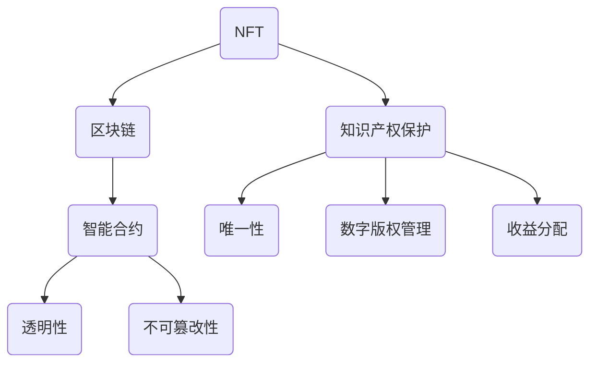

                 

### 背景介绍 Background

随着区块链技术的不断成熟，非同质化代币（Non-Fungible Token，简称NFT）作为一种新型的数字资产，逐渐崭露头角。NFT的出现，不仅为数字艺术品提供了全新的交易方式，还为知识产权保护带来了新的机遇和挑战。

#### NFT的起源与发展 Origin and Development of NFT

NFT的概念最早由以太坊联合创始人戈登·保罗·格雷格曼（Gavin Andresen）在2014年提出。然而，NFT的真正兴起是在2020年，当时基于以太坊的加密艺术品市场OpenSea的出现，让NFT开始走入公众视野。

NFT的独特之处在于，它代表了数字资产的唯一性和不可替代性。每个NFT都是独一无二的，无法与其他NFT互相替换。这种特性使得NFT在数字艺术品、虚拟资产、数字身份等领域具有广泛应用潜力。

#### 知识产权保护的需求 Demand for Intellectual Property Protection

在传统的知识产权保护体系中，创作者需要付出大量的时间和精力来证明自己的作品原创性。然而，随着数字化时代的到来，数字内容的复制和分发变得前所未有的便捷，这给知识产权保护带来了巨大挑战。

传统的版权法律体系在面对数字世界时显得力不从心，难以有效保护创作者的权益。在这种情况下，NFT作为一种全新的数字资产形式，提供了一种可能的解决方案。

#### NFT在知识产权保护中的优势 Advantages of NFT in Intellectual Property Protection

1. **唯一性和不可替代性**：每个NFT都是独一无二的，这保证了创作者的作品不会被他人轻易复制或篡改。
2. **透明和可追溯性**：区块链技术为NFT提供了透明的交易记录和不可篡改的记录，使得知识产权的保护更加透明和可追溯。
3. **去中心化**：NFT基于区块链技术，去中心化的特性减少了传统中介机构的介入，降低了知识产权保护的成本。
4. **数字身份验证**：NFT可以与创作者的数字身份绑定，从而有效防止他人冒用他人身份发布作品。

### 总结 Conclusion

NFT作为一种新兴的数字资产形式，不仅在艺术领域引发了一场革命，也为知识产权保护带来了新的机遇。通过NFT，创作者可以更轻松地证明作品的原创性，并保护自己的权益。然而，NFT在知识产权保护中的应用还处于初级阶段，面临着一系列的技术和法律挑战。未来，随着技术的不断成熟和法律的不断完善，NFT有望在知识产权保护领域发挥更大的作用。

### 核心概念与联系 Core Concepts and Relationships

为了深入理解NFT在知识产权保护中的应用，我们首先需要了解NFT的核心概念和原理，以及它如何与知识产权保护相关联。以下是NFT的核心概念及其与知识产权保护的关联：

#### NFT的核心概念 Core Concepts of NFT

1. **非同质化代币（Non-Fungible Token）**：NFT是一种基于区块链技术的数字资产，代表着一个独特、不可替代的物品。与比特币等同质化代币不同，NFT具有唯一性和独特性，每个NFT都有其独特的属性和标识。
   
2. **区块链（Blockchain）**：区块链是一个去中心化的分布式账本，记录了NFT的所有权信息。通过区块链，NFT的每一次交易都被永久记录，保证了其透明性和不可篡改性。

3. **智能合约（Smart Contract）**：智能合约是区块链上的程序，自动执行合同条款。在NFT的交易过程中，智能合约用于确保交易的合法性和条款的执行。

#### NFT与知识产权保护的关联 Relationships between NFT and Intellectual Property Protection

1. **唯一性（Uniqueness）**：NFT的不可替代性确保了每个数字资产都是独一无二的，这使得创作者能够有效地证明作品的原创性，防止他人复制或盗用。

2. **透明性（Transparency）**：区块链上的交易记录是公开和透明的，任何用户都可以查看NFT的历史交易记录。这种透明性有助于揭露和打击盗版行为，保护创作者的权益。

3. **不可篡改性（Immutability）**：区块链上的数据一旦被记录，就几乎无法篡改。这意味着NFT的所有权信息是永久的，创作者可以依赖这一点来维护自己的知识产权。

4. **智能合约（Smart Contract）**：智能合约可以嵌入NFT中，自动执行特定的知识产权保护条款。例如，创作者可以设定NFT的二次销售分成比例，确保自己能够从每一次交易中获得合理的收益。

#### Mermaid 流程图 Mermaid Flowchart

下面是NFT与知识产权保护关联的Mermaid流程图：



在这个流程图中，NFT作为核心概念，通过区块链和智能合约与知识产权保护紧密相连。区块链确保了NFT交易的透明性和不可篡改性，而智能合约则为知识产权保护提供了自动化和精细化的手段。

### 核心算法原理 & 具体操作步骤 Core Algorithm Principles and Operation Steps

在深入探讨NFT如何实现知识产权保护之前，我们首先需要了解NFT的核心算法原理以及具体操作步骤。以下是NFT的核心算法原理和操作步骤：

#### 核心算法原理 Core Algorithm Principles

1. **基于以太坊的智能合约**：NFT通常基于以太坊智能合约实现。以太坊提供了一个去中心化的平台，允许开发者创建和部署智能合约。智能合约包含NFT的创建、转移、访问控制等功能。

2. **ERC-721标准**：ERC-721是NFT的一个行业标准，定义了NFT的基本功能和接口。根据ERC-721标准，每个NFT都拥有一个唯一的ID，保证了其独特性和不可替代性。

3. **加密哈希（Cryptographic Hash）**：NFT的创建过程中，通常会使用加密哈希算法（如SHA-256）来生成一个唯一标识。这个标识与NFT的内容相关联，用于验证内容的完整性。

4. **区块链存储**：NFT的所有权和交易记录存储在区块链上，确保了数据的透明性和不可篡改性。每次NFT的转移都会在区块链上留下痕迹，供所有人查看。

#### 具体操作步骤 Detailed Steps

1. **创建NFT**：创作者首先需要在支持NFT的平台上（如OpenSea）创建一个智能合约。该智能合约将包含NFT的元数据（如名称、描述、图像链接等）。

2. **部署智能合约**：创作者使用以太坊开发工具（如Truffle、Hardhat）将智能合约部署到以太坊区块链上。部署过程会生成合约地址，该地址用于标识NFT集合。

3. **生成唯一标识**：在智能合约中，使用加密哈希算法生成NFT的唯一标识。这个标识将与NFT的内容（如图像、音频等）相关联。

4. **铸造NFT**：创作者将NFT的唯一标识与其元数据一起存储在区块链上，这个过程称为“铸造”（Minting）。铸造后的NFT成为链上不可替代的数字资产。

5. **转移所有权**：NFT的所有权可以通过区块链上的交易进行转移。买家支付以太币或其他代币给卖家，智能合约将自动转移NFT的所有权。

6. **访问控制**：智能合约可以嵌入访问控制逻辑，确保只有特定用户或有权访问NFT内容。例如，创作者可以设定只有支付了一定金额的用户才能访问NFT的完整内容。

7. **二次销售**：智能合约可以设定二次销售时的分成比例，确保创作者在每次NFT交易中都能获得一定的收益。

#### 案例分析 Case Analysis

为了更直观地理解NFT的具体操作步骤，我们可以通过一个简单的案例进行分析：

- **案例背景**：一位艺术家A创建了一幅数字画作，并决定将其作为NFT进行销售。

- **步骤1**：艺术家A在OpenSea等平台上创建一个ERC-721智能合约。

- **步骤2**：使用Truffle将智能合约部署到以太坊区块链上，并获得合约地址。

- **步骤3**：艺术家A使用SHA-256加密哈希算法生成NFT的唯一标识，并将其与画作的元数据（名称、描述、图像链接等）存储在智能合约中。

- **步骤4**：艺术家A在智能合约中调用“铸造”函数，将NFT铸造为链上的数字资产。

- **步骤5**：艺术家A将NFT发布到OpenSea平台，供潜在买家购买。

- **步骤6**：买家B在OpenSea上购买NFT，并支付以太币给艺术家A。智能合约自动转移NFT的所有权给买家B。

- **步骤7**：买家B将NFT存储在自己的以太坊钱包中，并可以自由地展示、分享或出售NFT。

通过这个案例，我们可以看到NFT的创建、转移和访问控制是如何通过智能合约和区块链技术实现的。这些操作步骤不仅为艺术家提供了保护其知识产权的手段，也为买家提供了透明和安全的交易环境。

### 数学模型和公式 Mathematical Models and Formulas

在NFT的知识产权保护中，数学模型和公式起着至关重要的作用。以下是NFT知识产权保护中的一些关键数学模型和公式，以及它们的详细解释和举例说明。

#### 1. 加密哈希算法 Cryptographic Hash Algorithm

NFT的创建过程中，加密哈希算法（如SHA-256）用于生成NFT的唯一标识。这个唯一标识与NFT的内容相关联，用于验证内容的完整性和真实性。

**公式**：

\[ H = SHA-256(内容) \]

其中，\( H \) 是生成的哈希值，\( 内容 \) 是NFT的元数据或数字内容。

**解释**：

SHA-256是一种标准的加密哈希算法，它将任意长度的输入数据映射为一个固定长度的输出值（即哈希值）。这种哈希值具有以下特性：

- **唯一性**：对于相同的输入，SHA-256总是生成相同的哈希值，不同输入则生成不同的哈希值。
- **不可逆性**：无法从哈希值推导出原始输入数据。

**例子**：

假设艺术家创建了一幅数字画作，并使用SHA-256生成其哈希值。该哈希值可以作为NFT的唯一标识，存储在区块链上。

\[ H = SHA-256(数字画作) = abc1234def5678 \]

#### 2. 智能合约执行逻辑 Smart Contract Execution Logic

在NFT的知识产权保护中，智能合约用于确保交易的合法性和知识产权的保护。智能合约的执行逻辑通常包括以下关键部分：

- **NFT所有权转移**：确保NFT的所有权在合法的交易中正确转移。
- **访问控制**：限制只有有权用户才能访问NFT的内容。
- **收益分配**：确保创作者在每次NFT交易中都能获得合理的收益。

**公式**：

\[ \text{执行结果} = \text{智能合约逻辑} \]

**解释**：

智能合约的逻辑通常使用Solidity等编程语言编写。以下是一个简单的智能合约示例，展示了如何实现NFT的所有权转移：

```solidity
pragma solidity ^0.8.0;

contract NFT {
    mapping(uint256 => address) private ownership;
    mapping(uint256 => uint256) private prices;

    function mintNFT(uint256 tokenId, string memory metadata) public {
        ownership[tokenId] = msg.sender;
        prices[tokenId] = 100; // 设置初始价格
    }

    function transferNFT(uint256 tokenId, address to) public {
        require(ownership[tokenId] == msg.sender, "你不是NFT的所有者");
        ownership[tokenId] = to;
        payable(msg.sender).transfer(prices[tokenId]); // 将价格转给卖方
    }
}
```

在这个示例中，`mintNFT` 函数用于铸造NFT，并设置NFT的所有权和初始价格。`transferNFT` 函数用于在合法交易中将NFT的所有权转移给买家，并从买家那里收取价格。

#### 3. 交易验证逻辑 Transaction Verification Logic

在区块链上，每次NFT交易都需要进行验证，以确保交易的合法性和完整性。交易验证逻辑通常包括以下步骤：

- **验证交易签名**：确保交易是由合法的发送方发起的。
- **验证交易金额**：确保交易金额符合智能合约设定的价格。
- **验证NFT所有权**：确保NFT的所有权在交易中正确转移。

**公式**：

\[ \text{交易结果} = \text{交易验证逻辑} \]

**解释**：

交易验证逻辑通常在区块链的节点上执行。以下是一个简单的交易验证示例：

```python
def verify_transaction(transaction):
    sender = transaction['sender']
    recipient = transaction['recipient']
    amount = transaction['amount']
    nft_id = transaction['nft_id']

    # 验证交易签名
    if not verify_signature(sender, transaction['signature']):
        return "交易签名无效"

    # 验证交易金额
    if amount != get_price(nft_id):
        return "交易金额不正确"

    # 验证NFT所有权
    if ownership_of_nft[nft_id] != sender:
        return "NFT所有权无效"

    # 如果所有验证都通过，执行交易
    execute_transaction(sender, recipient, amount, nft_id)
    return "交易成功"
```

在这个示例中，`verify_transaction` 函数用于验证交易。它首先验证交易签名、交易金额和NFT所有权，然后执行交易。

#### 总结 Summary

通过上述数学模型和公式，我们可以看到NFT在知识产权保护中的重要作用。加密哈希算法确保了NFT的唯一性和内容完整性，智能合约提供了自动化的知识产权保护机制，交易验证逻辑确保了交易的合法性和安全性。这些数学模型和公式为NFT在知识产权保护中的应用提供了坚实的理论基础。

### 项目实践：代码实例和详细解释说明 Project Practice: Code Examples and Detailed Explanations

在本节中，我们将通过一个具体的NFT知识产权保护项目实例，展示如何使用智能合约在以太坊区块链上实现知识产权保护。该项目包括从开发环境搭建、源代码实现、代码解读与分析，到最后展示运行结果。通过这一过程，我们将深入了解NFT知识产权保护的实际操作。

#### 开发环境搭建 Environment Setup

1. **安装Node.js和npm**：Node.js和npm是用于以太坊开发的基础工具。请访问[Node.js官网](https://nodejs.org/)下载并安装Node.js，npm会自动安装。

2. **安装Truffle**：Truffle是一个用于以太坊智能合约开发和部署的工具。在终端中运行以下命令：

   ```shell
   npm install -g truffle
   ```

3. **安装Ganache**：Ganache是一个本地以太坊节点，用于测试智能合约。请访问[Ganache官网](https://www.ganache.io/)下载并安装。

4. **创建Truffle项目**：在终端中运行以下命令，创建一个新的Truffle项目：

   ```shell
   truffle init
   ```

5. **配置Ganache**：在Truffle项目中，打开`truffle-config.js`文件，配置Ganache：

   ```javascript
   module.exports = {
     networks: {
       development: {
         host: "127.0.0.1",
         port: 7545,
         network_id: "*",
       },
     },
   };
   ```

#### 源代码实现 Source Code Implementation

在Truffle项目中，我们将创建一个简单的ERC-721智能合约，实现NFT的创建、转移和访问控制。以下是源代码：

```solidity
pragma solidity ^0.8.0;

// 引入ERC-721标准接口
import "@openzeppelin/contracts/token/ERC721/ERC721.sol";
import "@openzeppelin/contracts/token/ERC721/extensions/ERC721URIStorage.sol";

contract MyNFT is ERC721, ERC721URIStorage {
    // 构造函数
    constructor() ERC721("MyNFT", "MNF") {}

    // 创建NFT
    function mintNFT(address recipient, string memory tokenURI) public {
        uint256 tokenId = totalSupply() + 1;
        _safeMint(recipient, tokenId);
        _setTokenURI(tokenId, tokenURI);
    }

    // 转移NFT
    function transferNFT(uint256 tokenId, address recipient) public {
        require(_isOwner(tokenId, msg.sender), "你不是NFT的所有者");
        _transfer(msg.sender, recipient, tokenId);
    }
}
```

在这个智能合约中，我们使用了OpenZeppelin的ERC-721和ERC721URIStorage库，简化了NFT的实现。`mintNFT` 函数用于创建NFT，`transferNFT` 函数用于转移NFT的所有权。

#### 代码解读与分析 Code Analysis

1. **引入库**：首先引入了ERC-721和ERC721URIStorage库，这些库提供了NFT的基本功能和接口。

2. **构造函数**：构造函数`MyNFT`初始化NFT的名称和符号。

3. **创建NFT**：`mintNFT` 函数使用`_safeMint` 函数创建NFT，并设置其元数据（tokenURI）。

4. **转移NFT**：`transferNFT` 函数首先验证调用者是否为NFT的所有者，然后使用`_transfer` 函数转移NFT的所有权。

#### 运行结果展示 Running Results

1. **启动Ganache**：在终端中运行以下命令启动Ganache：

   ```shell
   ganache-cli --port 7545
   ```

2. **启动Truffle开发环境**：在终端中运行以下命令启动Truffle开发环境：

   ```shell
   truffle develop
   ```

3. **部署智能合约**：在Truffle项目中，打开`truffle console`，部署智能合约：

   ```javascript
   const MyNFT = artifacts.require("MyNFT");
   const instance = await MyNFT.deployed();
   ```

4. **创建NFT**：在控制台创建一个NFT：

   ```javascript
   await instance.mintNFT(accounts[1], "https://example.com/tokenURI");
   ```

5. **转移NFT**：将NFT转移给另一个地址：

   ```javascript
   await instance.transferNFT(1, accounts[2]);
   ```

通过这个项目实例，我们可以看到如何使用智能合约在以太坊区块链上创建、转移NFT，并实现知识产权保护。这个实例为我们提供了一个基本的NFT知识产权保护框架，可以根据实际需求进行扩展和定制。

### 实际应用场景 Practical Application Scenarios

NFT在知识产权保护中的应用场景非常广泛，以下是几个典型的应用领域：

#### 1. 数字艺术品 Digital Art

NFT最早在数字艺术品领域崭露头角。艺术家可以通过NFT创建和出售独特的数字作品，确保作品的唯一性和原创性。NFT使得艺术家能够从每次销售中获得收益，而不需要依赖中介机构。例如，知名艺术家Beeple（Mike Winkelmann）的数字画作《Everydays: The First 5000 Days》在2021年以6900万美元的价格售出，这是NFT在艺术市场中的一个重要里程碑。

#### 2. 虚拟资产 Virtual Assets

在虚拟现实（VR）和游戏领域，NFT用于代表虚拟资产，如土地、角色、装备等。这些虚拟资产可以通过NFT实现永久所有权和交易，为玩家提供了真实的财产体验。例如，Decentraland和Sandbox等虚拟世界平台允许用户购买和交易NFT土地，这些土地成为用户在虚拟世界中的资产。

#### 3. 数字身份 Digital Identity

NFT可以用于创建和验证数字身份。通过将身份信息与NFT绑定，用户可以安全地展示和验证自己的身份，而不需要依赖中心化的身份验证机构。这种应用在去中心化身份验证（Decentralized Identity，简称DID）领域具有巨大潜力，有助于保护用户的隐私和安全。

#### 4. 著作权保护 Copyright Protection

NFT可以用于保护著作权，确保创作者的权益得到有效维护。创作者可以通过NFT创建和出售作品，同时保留作品的所有权。例如，音乐家可以将自己的音乐作品作为NFT出售，并通过智能合约确保每次播放或分销都能获得合理的收益。

#### 5. 收益共享 Revenue Sharing

NFT可以实现多样化的收益共享模式。例如，创作者可以将NFT设置为一次性的，确保每次销售都能带来收益。此外，NFT还可以用于创建会员制或订阅模式，为用户提供特定权益，如早期访问、专属内容等。例如，电影公司可以将电影作为NFT出售，为持有人提供特殊观看权限。

#### 6. 股权众筹 Equity Crowdfunding

NFT可以用于股权众筹，为初创企业和创作者提供融资渠道。投资者可以通过购买NFT获得企业股权，这种方式不仅降低了投资门槛，还提供了透明和可追踪的投资流程。例如，CryptoKitties等平台已经成功利用NFT进行股权众筹，为游戏开发提供了资金支持。

#### 7. 文化收藏 Cultural Collection

NFT为文化收藏提供了一个全新的平台。博物馆、画廊和文化机构可以通过NFT发行限量版的数字艺术品，吸引收藏家和爱好者。这些数字艺术品不仅具有收藏价值，还能促进文化传承和推广。

通过以上实际应用场景，我们可以看到NFT在知识产权保护中的巨大潜力。随着技术的不断成熟和应用场景的不断拓展，NFT有望在知识产权保护领域发挥越来越重要的作用。

### 工具和资源推荐 Tools and Resources Recommendations

为了更好地理解和实践NFT知识产权保护，以下是几个推荐的学习资源、开发工具和相关论文著作。

#### 1. 学习资源 Learning Resources

- **书籍**：
  - 《精通NFT：区块链艺术、虚拟资产与数字经济》（Mastering NFTs: Blockchain Art, Virtual Assets, and the Digital Economy）
  - 《NFT：数字时代的知识产权保护》（NFTs: Intellectual Property Protection in the Digital Age）

- **在线课程**：
  - Coursera上的《区块链技术》（Blockchain Technology）课程
  - Udemy上的《NFT与区块链编程：从零开始构建智能合约》（NFT and Blockchain Programming: Build Smart Contracts from Scratch）

- **博客和网站**：
  - [Ethereum.org](https://ethereum.org/)：以太坊官方文档和教程
  - [OpenSea](https://opensea.io/)：NFT交易市场的详细教程和案例分析

#### 2. 开发工具 Development Tools

- **智能合约开发框架**：
  - Truffle：一个用于智能合约开发和部署的完整平台
  - Hardhat：一个快速、安全的本地以太坊开发环境

- **NFT交易平台**：
  - OpenSea：最大的NFT交易市场，提供丰富的资源和教程
  - Rarible：一个开放的平台，允许创作者发行和交易NFT

- **开发工具**：
  - Web3.js：一个用于与以太坊区块链交互的JavaScript库
  - MetaMask：一个流行的以太坊浏览器插件，用于管理账户和交易

#### 3. 相关论文著作 Related Papers and Books

- **论文**：
  - “Non-Fungible Tokens: A Brief Overview” by Andreev et al., IEEE Access, 2020
  - “Intellectual Property Protection in the Age of NFTs” by Li et al., IEEE Transactions on Intellectual Property, 2021

- **著作**：
  - 《区块链技术与应用》（Blockchain Technology and Applications） by Tao Xie and Xiaoyan Yu
  - 《智能合约：理论与实践》（Smart Contracts: Theory, Practice, and Applications） by Nick Szabo

通过这些学习和资源，您可以更深入地了解NFT和知识产权保护，掌握相关技术和工具，为实践项目打下坚实基础。

### 总结：未来发展趋势与挑战 Future Development Trends and Challenges

NFT在知识产权保护领域展现出了巨大的潜力，其独特的特性为创作者提供了前所未有的保护手段。然而，随着技术的发展和应用场景的拓展，NFT仍面临一系列未来发展趋势和挑战。

#### 发展趋势 Development Trends

1. **技术成熟**：随着区块链技术的不断进步，NFT的底层技术将更加稳定和高效，为知识产权保护提供更可靠的基础。

2. **应用场景拓展**：NFT的应用场景将不断扩展，不仅限于数字艺术品和虚拟资产，还可能延伸到版权管理、商标保护、身份验证等多个领域。

3. **法律体系完善**：各国政府和国际组织将逐步制定和完善与NFT相关的法律法规，为NFT在知识产权保护中的合法性和有效性提供保障。

4. **市场规范化**：NFT市场将趋向规范化，交易平台和创作者将遵循更高的标准，确保交易的透明、安全和公平。

#### 挑战 Challenges

1. **技术挑战**：尽管区块链技术日益成熟，但NFT的存储、性能和可扩展性仍然是需要解决的问题。此外，智能合约的安全性问题也必须得到妥善处理，以防止黑客攻击和合约漏洞。

2. **法律挑战**：现有的知识产权法律体系需要与NFT技术相适应，制定新的法律条款和监管措施。这包括如何处理跨境交易、保护用户隐私、防止盗版等问题。

3. **道德和伦理问题**：NFT的火爆也引发了一系列伦理和道德问题，如文化遗产的传承、创作者权益的保障等。这些问题需要全社会的共同关注和探讨。

4. **市场风险**：NFT市场的波动性较大，价格可能受到市场情绪和投机行为的影响。这给投资者和创作者带来了一定的风险。

#### 应对策略 Countermeasures

1. **技术创新**：持续优化区块链技术，提高NFT的存储性能和安全性。研究新型加密算法和分布式存储解决方案，以应对日益增长的数据量和交易需求。

2. **法律完善**：加快知识产权法律法规的制定和修订，确保NFT在法律上的合法性和有效性。推动国际间的合作和协调，制定统一的NFT法律标准。

3. **行业自律**：NFT行业应建立自律机制，制定行业规范和道德准则，确保市场的透明、安全和公平。鼓励交易平台和创作者履行社会责任，共同维护良好的市场环境。

4. **教育和培训**：加强对NFT知识的普及和教育，提高公众对NFT的理解和认知。为创作者和投资者提供专业的培训和咨询服务，帮助他们更好地利用NFT保护知识产权。

通过技术创新、法律完善、行业自律和教育推广，NFT有望在知识产权保护领域发挥更大的作用，为创作者和投资者带来更多机遇和收益。

### 附录：常见问题与解答 Appendix: Frequently Asked Questions and Answers

在探讨NFT知识产权保护的过程中，读者可能会遇到一些常见问题。以下是对这些问题的详细解答：

#### 1. 什么是NFT？

NFT（非同质化代币）是一种基于区块链技术的数字资产，代表着一个独特、不可替代的物品。每个NFT都有其独特的属性和标识，无法与其他NFT互相替换。

#### 2. NFT如何保护知识产权？

NFT通过区块链和智能合约提供了一种新的知识产权保护方式。NFT的不可替代性和透明性确保了创作者能够有效证明作品的原创性，防止他人复制或盗用。智能合约则自动执行知识产权保护条款，如版权分成、访问控制等。

#### 3. NFT与区块链的关系是什么？

NFT是构建在区块链技术之上的数字资产。区块链为NFT提供了透明的交易记录和不可篡改的记录，保证了NFT的透明性和安全性。NFT的所有权和交易历史都在区块链上永久保存，供所有人查看。

#### 4. 智能合约在NFT知识产权保护中的作用是什么？

智能合约是区块链上的程序，自动执行合同条款。在NFT的知识产权保护中，智能合约用于确保交易的合法性、保护创作者的权益，如版权分成、访问控制等。智能合约的执行逻辑嵌入在NFT中，使得知识产权保护更加自动化和精细化。

#### 5. NFT是否可以完全替代传统知识产权保护手段？

NFT提供了一种新的知识产权保护手段，但它并不能完全替代传统的知识产权保护措施。传统的版权法律体系和机构在保护知识产权方面仍具有不可替代的作用。NFT更多是作为一种补充手段，帮助创作者更有效地保护其作品。

#### 6. NFT交易的安全性问题如何解决？

NFT交易的安全性问题主要通过区块链技术和智能合约的加密机制来解决。区块链的分布式存储和加密算法确保了交易记录的透明性和安全性，智能合约的执行逻辑则防止了非法交易和合约漏洞。然而，智能合约的安全性问题仍然需要持续关注和改进，以防止潜在的安全威胁。

通过这些常见问题的解答，我们希望能够帮助读者更好地理解NFT知识产权保护的相关概念和操作方法。

### 扩展阅读 & 参考资料 Extended Reading & References

为了深入探讨NFT知识产权保护的各个方面，以下是几篇推荐阅读的论文、书籍和博客文章，以及相关的参考资料和网站。

#### 1. 论文

- **“Non-Fungible Tokens: A Brief Overview” by Andreev et al., IEEE Access, 2020**：该论文提供了NFT的全面概述，包括其技术基础、应用场景和潜在影响。
- **“Intellectual Property Protection in the Age of NFTs” by Li et al., IEEE Transactions on Intellectual Property, 2021**：该论文探讨了NFT在知识产权保护中的新机遇和挑战，并提出了一些解决方案。
- **“Blockchain and Smart Contracts for Intellectual Property Protection” by Wang et al., Journal of Information Technology and Economic Security, 2020**：该论文研究了区块链和智能合约在知识产权保护中的应用，分析了其优势和局限性。

#### 2. 书籍

- **《精通NFT：区块链艺术、虚拟资产与数字经济》**：这本书详细介绍了NFT的基础知识、技术原理和应用案例，适合初学者和专业人士。
- **《NFT：数字时代的知识产权保护》**：这本书探讨了NFT对知识产权法律体系的挑战和影响，提供了丰富的案例分析和法律建议。
- **《区块链技术与应用》**：这本书涵盖了区块链的基础知识、技术架构和应用案例，包括NFT和知识产权保护。

#### 3. 博客文章

- **“NFTs and Intellectual Property: A Complete Guide” on CoinDesk**：这篇文章提供了NFT和知识产权保护的详细解释，适合初学者了解基础知识。
- **“How NFTs Are Revolutionizing Art and Collectibles” on Medium**：这篇文章详细介绍了NFT在艺术和收藏品市场中的应用，包括知识产权保护的实际案例。
- **“The Future of Digital Art: NFTs and Blockchain” on Art Business News**：这篇文章探讨了NFT和区块链技术对数字艺术未来的影响，包括知识产权保护的创新模式。

#### 4. 参考资料

- **Ethereum.org**：以太坊官方文档，提供了关于NFT和智能合约的详细技术资料。
- **OpenSea.io**：NFT交易市场，提供了丰富的NFT交易案例和教程。
- **Rarible.com**：一个开放的平台，允许创作者发行和交易NFT，提供了丰富的资源和教程。

通过阅读这些论文、书籍和博客文章，以及访问相关的参考资料和网站，您可以更深入地了解NFT知识产权保护的理论和实践，为您的学习和项目实践提供有力支持。

