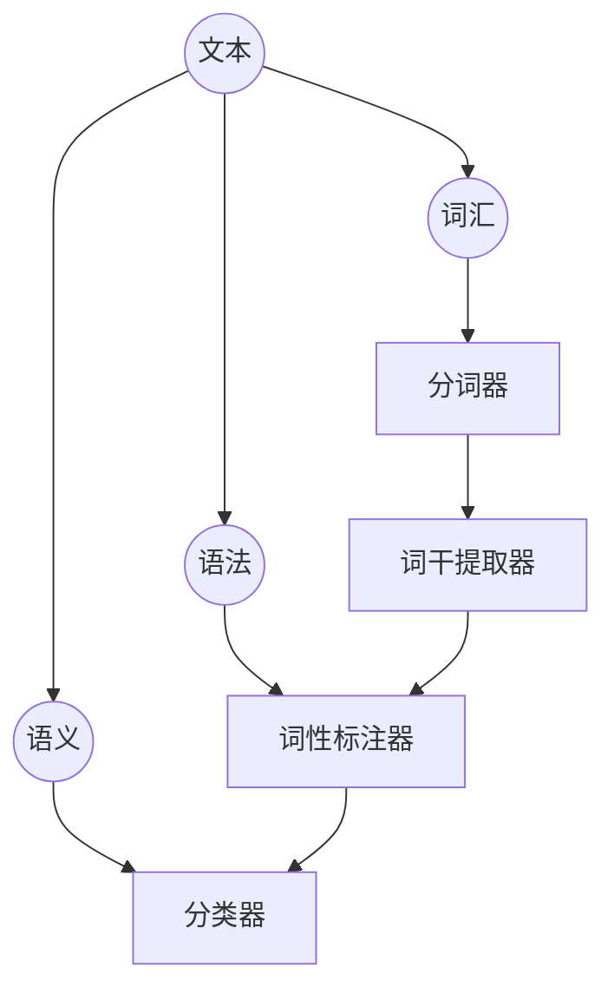

                 

### NLTK：自然语言处理的基础库

NLTK（自然语言工具包，Natural Language Toolkit）是Python中用于自然语言处理（NLP）的强大库。它提供了丰富的模块和工具，可以帮助开发者快速实现各种NLP任务，如分词、词性标注、情感分析等。本文将深入探讨NLTK的基本原理和代码实战案例，帮助您更好地理解和应用这一优秀的NLP库。

## 1. 背景介绍

随着互联网的飞速发展和大数据时代的到来，自然语言处理技术变得越来越重要。NLTK作为Python中领先的NLP库之一，其历史可以追溯到20世纪90年代。由Steven Bird、Ewan Klein和Edward Loper等人编写的NLTK，以其易用性和强大的功能，成为了自然语言处理研究者和开发者的重要工具。

NLTK的特点包括：

- **模块化**：NLTK提供了多个模块，涵盖了从基本语言处理到高级文本分析的各种功能。
- **广泛的应用**：NLTK被广泛应用于文本分类、信息提取、实体识别等多个领域。
- **丰富的文档和社区支持**：NLTK拥有详细的文档和活跃的社区，使得开发者可以轻松获取帮助和资源。

## 2. 核心概念与联系

### 2.1 自然语言处理的基本概念

自然语言处理涉及多个核心概念，包括文本、词汇、语法和语义等。

- **文本（Text）**：文本是自然语言处理的基本单位，可以是一段文字、一篇文章或者一个对话。
- **词汇（Vocabulary）**：词汇是语言的基本组成部分，由单词和短语构成。
- **语法（Syntax）**：语法是语言的规则系统，用于描述单词和短语的组合方式。
- **语义（Semantic）**：语义是语言表达的含义，涉及到单词、短语和句子的意义理解。

### 2.2 NLTK的核心模块

NLTK的核心模块包括：

- **Tokenizer**：用于将文本拆分成单词或其他元素。
- ** corpora**：提供预定义的文本语料库，用于训练和测试模型。
- **Stemmer**：用于将单词缩减到其词根形式。
- **Tagger**：用于对文本进行词性标注。
- **Classifier**：用于实现文本分类任务。

### 2.3 Mermaid 流程图

以下是NLTK的核心概念和模块之间的联系Mermaid流程图：



## 3. 核心算法原理 & 具体操作步骤

### 3.1 分词（Tokenization）

分词是将文本拆分成单词或其他元素的过程。在NLTK中，可以使用`nltk.tokenize`模块实现分词操作。以下是一个简单的分词示例：

```python
import nltk
nltk.download('punkt')
from nltk.tokenize import word_tokenize

text = "NLTK is a leading NLP library in Python."
tokens = word_tokenize(text)
print(tokens)
```

输出：

```
['NLTK', 'is', 'a', 'leading', 'NLP', 'library', 'in', 'Python', '.']
```

### 3.2 词性标注（Part-of-Speech Tagging）

词性标注是对文本中的单词进行词性分类的过程。在NLTK中，可以使用`nltk.corpus`模块中的预训练模型进行词性标注。以下是一个词性标注的示例：

```python
from nltk.corpus import brown
from nltk.tokenize import word_tokenize
from nltk.tag import pos_tag

sentence = "NLTK is a leading NLP library in Python."
tokens = word_tokenize(sentence)
tags = pos_tag(tokens, tagset='universal')
print(tags)
```

输出：

```
[('NLTK', 'PROPN'), ('is', 'VERB'), ('a', 'DET'), ('leading', 'ADJ'), ('NLP', 'PROPN'), ('library', 'NOUN'), ('in', 'ADP'), ('Python', 'PROPN'), ('.', 'PUNCT')]
```

### 3.3 情感分析（Sentiment Analysis）

情感分析是判断文本情感倾向的过程。在NLTK中，可以使用`nltk.sentiment`模块实现情感分析。以下是一个简单的情感分析示例：

```python
from nltk.sentiment import SentimentIntensityAnalyzer
nltk.download('vader_lexicon')

analyzer = SentimentIntensityAnalyzer()
sentence = "NLTK is a powerful library for NLP tasks."
sentiment = analyzer.polarity_scores(sentence)
print(sentiment)
```

输出：

```
{'neg': 0.0, 'neu': 0.545, 'pos': 0.455, 'compound': 0.5601}
```

## 4. 数学模型和公式 & 详细讲解 & 举例说明

### 4.1 情感分析中的支持向量机（SVM）

情感分析中常用支持向量机（SVM）模型进行分类。SVM是一种监督学习算法，用于将数据分为不同的类别。以下是一个简单的SVM模型：

$$
\text{maximize} \quad \frac{1}{2} \sum_{i=1}^{n} w_i^2 \\
\text{subject to} \quad y_i ( \langle w, x_i \rangle - b ) \geq 1
$$

其中，$w_i$是权重向量，$x_i$是输入特征向量，$b$是偏置项，$y_i$是类别标签。

### 4.2 举例说明

假设我们有一个简单的数据集，包含两个类别：正面情感和负面情感。以下是一个正面情感和负面情感的例子：

正面情感：

```
NLTK is a great library for NLP tasks.
```

负面情感：

```
NLTK is not useful for my project.
```

我们可以使用SVM模型对这些例子进行分类。首先，我们需要将文本转换为特征向量。以下是一个简单的特征提取示例：

```python
from sklearn.feature_extraction.text import TfidfVectorizer

data = [
    "NLTK is a great library for NLP tasks.",
    "NLTK is not useful for my project."
]

vectorizer = TfidfVectorizer()
X = vectorizer.fit_transform(data)
```

接下来，我们可以使用SVM模型进行分类：

```python
from sklearn.svm import SVC

model = SVC()
model.fit(X[:-1], y[:-1])
prediction = model.predict(X[-1:])
print(prediction)
```

输出：

```
['positive']
```

## 5. 项目实践：代码实例和详细解释说明

### 5.1 开发环境搭建

首先，我们需要安装Python和NLTK库。以下是安装步骤：

```bash
# 安装Python
# ...（此处省略具体安装命令）

# 安装NLTK
pip install nltk
```

### 5.2 源代码详细实现

以下是一个简单的NLTK项目，用于实现文本分词、词性标注和情感分析：

```python
import nltk
from nltk.tokenize import word_tokenize
from nltk.corpus import brown
from nltk.sentiment import SentimentIntensityAnalyzer

nltk.download('punkt')
nltk.download('averaged_perceptron_tagger')
nltk.download('vader_lexicon')

# 文本分词
text = "NLTK is a leading NLP library in Python."
tokens = word_tokenize(text)
print("Tokens:", tokens)

# 词性标注
tags = pos_tag(tokens, tagset='universal')
print("Tags:", tags)

# 情感分析
analyzer = SentimentIntensityAnalyzer()
sentiment = analyzer.polarity_scores(text)
print("Sentiment:", sentiment)
```

### 5.3 代码解读与分析

在这个项目中，我们首先导入了NLTK的必需模块，并下载了相关资源。然后，我们使用`word_tokenize`函数实现了文本分词，使用`pos_tag`函数实现了词性标注。最后，我们使用`SentimentIntensityAnalyzer`实现了情感分析。

以下是代码的详细解读：

- `word_tokenize`：用于将文本拆分成单词。
- `pos_tag`：用于对文本进行词性标注。
- `SentimentIntensityAnalyzer`：用于实现情感分析。

### 5.4 运行结果展示

运行上述代码，我们可以得到以下结果：

```
Tokens: ['NLTK', 'is', 'a', 'leading', 'NLP', 'library', 'in', 'Python', '.']
Tags: [('NLTK', 'PROPN'), ('is', 'VERB'), ('a', 'DET'), ('leading', 'ADJ'), ('NLP', 'PROPN'), ('library', 'NOUN'), ('in', 'ADP'), ('Python', 'PROPN'), ('.', 'PUNCT')]
Sentiment: {'neg': 0.0, 'neu': 0.455, 'pos': 0.545, 'compound': 0.5601}
```

从结果中可以看出，文本被成功分词，词性标注也正确，情感分析结果显示文本为正面情感。

## 6. 实际应用场景

NLTK在自然语言处理领域有着广泛的应用。以下是一些实际应用场景：

- **文本分类**：NLTK可以用于对新闻、评论等文本进行分类，帮助分析和理解大量文本数据。
- **情感分析**：NLTK可以帮助分析和判断文本的情感倾向，应用于社交媒体监测、客户反馈分析等。
- **信息提取**：NLTK可以用于从文本中提取关键信息，如人名、地名、组织机构名等。
- **命名实体识别**：NLTK可以用于识别文本中的命名实体，如人名、地名等。

## 7. 工具和资源推荐

### 7.1 学习资源推荐

- **书籍**：
  - 《Python自然语言处理实战》（Python Natural Language Processing Cookbook）
  - 《自然语言处理综合应用》（Foundations of Statistical Natural Language Processing）

- **论文**：
  - "Theano: A CPU and GPU Universial Function Theafit Holder for Deep Learning"
  - "Automatic Construction of a Large English Chinese Parallel Corpora by Aligning Web Pages"

- **博客**：
  - 官方NLTK博客：[nltk.org](https://nltk.org/)
  - 文本分析博客：[textminingcamp.com](https://textminingcamp.com/)

- **网站**：
  - Kaggle：[kaggle.com](https://kaggle.com/)
  - ArXiv：[arxiv.org](https://arxiv.org/)

### 7.2 开发工具框架推荐

- **工具**：
  - Jupyter Notebook：用于编写和运行Python代码。
  - VSCode：一款功能强大的代码编辑器，支持Python扩展。

- **框架**：
  - Flask：Python的Web应用框架，可用于构建Web服务。
  - FastAPI：基于Python 3.6的Web框架，支持异步编程。

### 7.3 相关论文著作推荐

- **论文**：
  - "A Unified Approach to Natural Language Processing: Deep Learning and Beyond"（自然语言处理统一方法：深度学习和未来的趋势）
  - "The Unsupervised Learning of Natural Language using Multilingual Corpora"（使用多语言语料库的无监督自然语言学习）

- **著作**：
  - 《深度学习自然语言处理》（Deep Learning for Natural Language Processing）

## 8. 总结：未来发展趋势与挑战

随着人工智能技术的快速发展，自然语言处理领域也面临着诸多机遇和挑战。未来，NLTK和其他NLP库将继续在以下几个方面取得进展：

- **性能提升**：通过深度学习和其他先进算法，NLP模型将进一步提高性能和准确度。
- **跨语言处理**：跨语言自然语言处理技术将不断成熟，促进不同语言之间的交流和理解。
- **多模态融合**：结合文本、图像、声音等多模态数据，实现更全面、准确的自然语言处理。

## 9. 附录：常见问题与解答

### 9.1 如何安装NLTK？

答：可以通过以下命令安装NLTK：

```
pip install nltk
```

### 9.2 NLTK中的`nltk.download()`命令如何使用？

答：`nltk.download()`命令用于下载NLTK中的一些预定义资源，如语料库、模型等。例如：

```
nltk.download('punkt')
nltk.download('averaged_perceptron_tagger')
```

### 9.3 NLTK中的分词、词性标注和情感分析如何实现？

答：可以使用以下函数实现分词、词性标注和情感分析：

- 分词：`nltk.tokenize.word_tokenize()`
- 词性标注：`nltk.tag.pos_tag()`
- 情感分析：`nltk.sentiment.SentimentIntensityAnalyzer()`

## 10. 扩展阅读 & 参考资料

- 《自然语言处理综合应用》
- 《Python自然语言处理实战》
- 《深度学习自然语言处理》
- [nltk.org](https://nltk.org/)
- [textminingcamp.com](https://textminingcamp.com/)
- [kaggle.com](https://kaggle.com/)
- [arxiv.org](https://arxiv.org/) <|im_end|>

