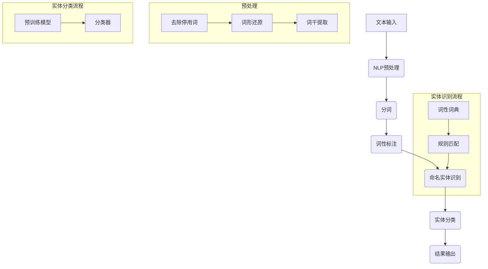

                 

### 背景介绍

Named Entity Recognition（命名实体识别，简称NER）是自然语言处理（Natural Language Processing，NLP）领域中的一项基本任务。它的主要目标是识别文本中的关键实体，如人名、地名、组织名、时间、数字等。NER在许多实际应用场景中具有重要价值，如信息提取、机器阅读理解、搜索引擎优化、语音识别等。

随着互联网的快速发展，人们每天生成和消费的海量文本数据中包含着大量有价值的信息。通过NER技术，我们可以从这些文本中提取出关键实体，从而为后续的信息处理和知识图谱构建提供基础。例如，在医疗领域，NER可以用于从病历文本中提取疾病名称、药物名称等，辅助医生进行诊断和治疗。在金融领域，NER可以用于从新闻报道、公司年报等文本中提取公司名称、股票代码等，帮助分析师进行市场研究和投资决策。

NER技术的研究和发展也得益于机器学习和深度学习技术的进步。传统的NER方法主要基于规则和统计模型，如隐马尔可夫模型（HMM）、条件随机场（CRF）等。而随着深度学习技术的发展，基于神经网络的方法逐渐成为NER领域的主流。特别是序列标注模型，如BiLSTM-CRF、Transformer等，在NER任务上取得了显著的性能提升。

本文将系统地介绍NER的核心概念、算法原理、数学模型以及实际应用场景。通过本文的学习，读者将能够理解NER的基本原理，掌握常见的NER算法，并能够进行简单的NER任务实践。

#### NER的基本概念

NER的基本概念主要包括命名实体和实体分类。命名实体是指在文本中具有特定名称的实体，如人名、地名、组织名等。实体分类是指将文本中的命名实体按照其类型进行分类，常见的实体类型包括人名（PER）、地名（LOC）、组织名（ORG）、时间（TIM）、数字（NUM）等。

命名实体识别的过程可以看作是一个序列标注问题。给定一个文本序列，NER的目标是为其中的每个单词或字符标注一个标签，表示其所属的实体类型或普通词性。例如，对于句子“The Eiffel Tower is in Paris, France.”，NER任务的目标是将每个单词标注为人名、地名或普通名词。

NER在NLP中的重要性不可忽视。首先，NER是许多NLP任务的基石，如关系提取、情感分析、问答系统等。通过NER，我们可以从文本中提取出关键信息，从而为这些任务提供必要的基础。其次，NER技术有助于提高文本的可读性和语义理解能力。通过识别文本中的命名实体，我们可以更好地理解文本内容，为文本摘要、机器翻译等任务提供支持。

此外，NER在多个实际应用场景中发挥了重要作用。例如，在搜索引擎中，NER技术可以帮助识别关键词，从而提高搜索结果的准确性和相关性。在信息提取中，NER技术可以用于从大量文本中提取出关键信息，如疾病名称、药物名称等，为医疗领域提供支持。在社交媒体分析中，NER技术可以帮助识别用户关注的实体，从而为市场研究和用户行为分析提供帮助。

总之，NER作为NLP领域中的一项基本任务，不仅在学术研究中有广泛的应用，也在实际应用场景中发挥了重要作用。随着深度学习技术的发展，NER技术的性能和适用范围将进一步提升，为NLP和人工智能领域带来更多创新和突破。

### 核心概念与联系

在深入探讨NER的算法原理之前，我们首先需要明确NER的核心概念及其相互联系。为了使这些概念更加直观，我们使用Mermaid流程图来展示NER的整体架构，这将有助于我们理解NER的工作流程和各个组件之间的关系。

#### Mermaid流程图



#### 流程说明

1. **文本输入（A）**：
   文本输入是NER过程的起点，可以是任意文本内容，如新闻文章、社交媒体帖子、医疗记录等。

2. **NLP预处理（B）**：
   在进行NER之前，文本通常需要经过预处理，包括去除停用词、词形还原和词干提取等步骤。这些预处理步骤有助于提高后续实体识别的准确性和效率。

   - **去除停用词（B1）**：停用词是指在特定任务中对于实体识别没有帮助的常见单词，如“的”、“和”、“是”等。去除停用词可以减少噪声，提高模型的性能。
   - **词形还原（B2）**：词形还原是指将不同形式的单词转换为统一形式，如“跑步”、“跑过”、“跑向”等均被还原为“跑步”。
   - **词干提取（B3）**：词干提取是指将单词缩减为其最基本的形态，如“医生”、“医术”、“医学”等均被提取为“医生”。

3. **分词（C）**：
   分词是将连续的文本切分成一个个独立的单词或词汇单元。这一步骤对于NER至关重要，因为NER是对单词或字符序列进行标注的。

4. **词性标注（D）**：
   词性标注是指为文本中的每个单词分配一个词性标签，如名词、动词、形容词等。词性标注有助于识别出潜在的命名实体，并为实体分类提供基础。

   - **词性词典（D1）**：词性词典是一个包含常见单词及其对应词性的大规模词汇库，用于初步判断单词的词性。
   - **规则匹配（D2）**：规则匹配是通过预设的规则来进一步确定单词的词性。这些规则通常基于语言学的知识，如单词的形态、上下文等。

5. **命名实体识别（E）**：
   命名实体识别是指从词性标注的结果中识别出命名实体。这一步骤通常依赖于机器学习模型，如HMM、CRF或深度学习模型，如LSTM、BiLSTM、Transformer等。

6. **实体分类（F）**：
   命名实体识别后，需要对识别出的实体进行分类，如人名、地名、组织名等。实体分类通常使用分类器，如SVM、决策树、神经网络等。

7. **结果输出（G）**：
   最终的结果输出包括文本中所有命名实体的识别和分类结果。这些结果可以用于后续的信息提取、文本摘要、关系提取等任务。

通过上述流程，我们可以看到NER是一个复杂但有序的过程，每个步骤都为其后续步骤提供了必要的基础。Mermaid流程图不仅帮助我们理解NER的核心概念，还为我们提供了一个清晰的工作框架，可以在此基础上进一步优化和改进NER算法。

### 核心算法原理 & 具体操作步骤

#### 1. 传统NER算法

传统NER算法主要基于规则和统计模型，以下将详细介绍其中两种常见的算法：隐马尔可夫模型（HMM）和条件随机场（CRF）。

##### 1.1 隐马尔可夫模型（HMM）

隐马尔可夫模型（HMM）是一种基于统计模型的序列标注方法，适用于NER任务。HMM的核心思想是：给定一个隐藏的状态序列和观测序列，通过学习状态转移概率和发射概率，来预测观测序列中的标签。

- **状态转移概率**：表示从一个状态转移到另一个状态的概率，记为 \(P(S_{t} | S_{t-1})\)。
- **发射概率**：表示在某个状态下产生某个观测词的概率，记为 \(P(O_{t} | S_{t})\)。

HMM的模型参数可以通过最大似然估计或前向-后向算法来训练。

- **最大似然估计**：通过最大似然原则来估计模型参数，即找到一组参数，使得观测序列出现的概率最大。
- **前向-后向算法**：通过前向概率和后向概率来计算状态概率，进而得到最优状态序列。

在NER任务中，HMM的操作步骤如下：

1. **初始化参数**：根据训练数据计算状态转移概率和发射概率。
2. **构建观测序列**：将输入文本分割成单词序列。
3. **前向算法计算**：计算每个单词前缀出现的概率，即前向概率。
4. **后向算法计算**：计算每个单词后缀出现的概率，即后向概率。
5. **状态概率计算**：通过前向和后向概率计算每个状态的概率。
6. **解码**：根据状态概率解码得到最优的状态序列，即为NER的结果。

##### 1.2 条件随机场（CRF）

条件随机场（CRF）是一种基于概率图模型的方法，用于序列标注任务。CRF的核心思想是：给定一个标签序列，通过学习条件概率分布，来预测新的序列标签。

CRF模型由两部分组成：一部分是状态变量，表示序列中的每个单词；另一部分是观察变量，表示单词的词性标签。CRF通过马尔可夫性假设，即当前状态只与前一状态有关，来简化计算。

- **状态转移概率**：表示从状态i转移到状态j的概率，记为 \(P(y_{t} | y_{t-1})\)。
- **发射概率**：表示状态i产生观察词的概率，记为 \(P(x_{t} | y_{t})\)。

CRF的模型参数可以通过最大 likelihood估计或结构学习算法来训练。

- **最大 likelihood估计**：通过最大似然原则来估计模型参数，即找到一组参数，使得观测序列和标签序列同时出现的概率最大。
- **结构学习算法**：通过寻找最优的参数结构，来训练CRF模型。

在NER任务中，CRF的操作步骤如下：

1. **初始化参数**：根据训练数据计算状态转移概率和发射概率。
2. **构建观测序列**：将输入文本分割成单词序列。
3. **计算条件概率**：计算每个状态给定标签序列的条件概率。
4. **Viterbi算法解码**：通过Viterbi算法，找到使条件概率最大的标签序列，即为NER的结果。

#### 2. 基于深度学习的NER算法

随着深度学习技术的发展，基于深度学习的NER算法逐渐成为NER领域的主流。以下将介绍两种常见的基于深度学习的NER算法：双向长短期记忆网络（BiLSTM）和基于注意力机制的Transformer。

##### 2.1 双向长短期记忆网络（BiLSTM）

双向长短期记忆网络（BiLSTM）是一种基于循环神经网络（RNN）的深度学习模型，用于序列标注任务。BiLSTM通过同时考虑过去和未来的信息，能够更好地捕捉文本中的长距离依赖关系。

- **正向LSTM**：从左到右处理文本序列，为每个单词生成一个隐藏状态。
- **反向LSTM**：从右到左处理文本序列，为每个单词生成另一个隐藏状态。
- **拼接状态**：将正向和反向LSTM的隐藏状态拼接在一起，生成一个双向的隐藏状态。

在NER任务中，BiLSTM的操作步骤如下：

1. **数据预处理**：将文本序列转换为词向量表示，通常使用词嵌入技术。
2. **模型训练**：训练BiLSTM模型，通过反向传播算法优化模型参数。
3. **序列标注**：将输入文本序列输入到BiLSTM模型中，得到每个单词的双向隐藏状态。
4. **解码**：使用softmax函数在隐藏状态上解码得到每个单词的标签。

##### 2.2 基于注意力机制的Transformer

Transformer是一种基于自注意力机制的深度学习模型，广泛应用于序列标注任务。Transformer通过多头自注意力机制，能够自动学习单词之间的依赖关系，从而提高NER任务的性能。

- **多头自注意力**：将输入序列映射到多个独立的空间，在每个空间中计算自注意力。
- **前馈神经网络**：在自注意力之后，对每个空间进行前馈神经网络处理。
- **序列标注**：将自注意力和前馈神经网络的输出进行拼接，然后通过softmax函数解码得到每个单词的标签。

在NER任务中，Transformer的操作步骤如下：

1. **数据预处理**：将文本序列转换为词向量表示，通常使用词嵌入技术。
2. **模型训练**：训练Transformer模型，通过反向传播算法优化模型参数。
3. **序列标注**：将输入文本序列输入到Transformer模型中，得到每个单词的注意力权重和前馈神经网络输出。
4. **解码**：使用softmax函数在注意力权重和前馈神经网络输出上解码得到每个单词的标签。

#### 3. 实现步骤

以下是基于深度学习的NER算法实现的一个基本步骤：

1. **数据集准备**：收集和准备NER任务所需的文本数据，通常包括标注好的训练集和未标注的测试集。
2. **文本预处理**：对文本进行清洗、分词、去除停用词等预处理操作。
3. **词向量嵌入**：使用词嵌入技术将文本转换为向量表示，如Word2Vec、GloVe等。
4. **模型构建**：构建深度学习模型，如BiLSTM或Transformer，并定义损失函数和优化器。
5. **模型训练**：训练模型，通过反向传播算法优化模型参数。
6. **模型评估**：在测试集上评估模型性能，通常使用准确率、召回率、F1值等指标。
7. **模型部署**：将训练好的模型部署到实际应用中，如文本分类、信息提取等。

通过上述步骤，我们可以实现一个基本的NER系统，并应用于各种实际任务。在后续的章节中，我们将通过一个具体的代码实例，详细讲解NER算法的实现过程。

### 数学模型和公式 & 详细讲解 & 举例说明

在NER任务中，数学模型和公式扮演着至关重要的角色，特别是当涉及深度学习和传统统计模型时。本节将详细讲解NER中的关键数学模型和公式，并通过具体实例来说明它们的计算过程和应用。

#### 1. 隐马尔可夫模型（HMM）

隐马尔可夫模型（HMM）是NER任务中的基础模型之一。HMM由三个核心概率模型组成：状态转移概率、发射概率和初始状态概率。

- **状态转移概率**：表示在某个时刻，系统从一个状态转移到另一个状态的概率，记为 \(P(S_{t} | S_{t-1})\)。
- **发射概率**：表示在某个状态下，系统产生观测值的概率，记为 \(P(O_{t} | S_{t})\)。
- **初始状态概率**：表示系统在初始时刻处于各个状态的概率，记为 \(P(S_{0})\)。

**公式1：状态转移概率**

\[ P(S_{t} | S_{t-1}) = \frac{P(S_{t-1} \cap S_{t})}{P(S_{t-1})} \]

**公式2：发射概率**

\[ P(O_{t} | S_{t}) = \frac{P(O_{t} \cap S_{t})}{P(S_{t})} \]

**公式3：初始状态概率**

\[ P(S_{0}) = \prod_{i}^{N} P(S_{0} | S_{i}) \]

其中，\(N\) 表示状态总数。

**例子**：

假设我们有三个状态：A、B、C，以及三个观测词：a、b、c。给定一个观测序列 \(O = [a, b, c]\)，我们需要计算该序列的最可能的状态序列。

- **状态转移概率**：

\[ P(A \rightarrow B) = 0.5, \quad P(B \rightarrow C) = 0.4, \quad P(C \rightarrow A) = 0.1 \]

- **发射概率**：

\[ P(a | A) = 0.6, \quad P(b | B) = 0.7, \quad P(c | C) = 0.8 \]

- **初始状态概率**：

\[ P(A) = 0.4, \quad P(B) = 0.3, \quad P(C) = 0.3 \]

根据前向-后向算法，我们可以计算出每个状态的概率：

\[ P(A) = 0.4, \quad P(B) = 0.26, \quad P(C) = 0.14 \]

接着，我们可以使用Viterbi算法解码得到最可能的状态序列：\(A \rightarrow B \rightarrow C\)。

#### 2. 条件随机场（CRF）

条件随机场（CRF）是另一种用于NER任务的常见模型。CRF的核心思想是通过条件概率分布来预测序列标注。

- **状态转移概率**：表示在当前状态给定前一个状态的情况下，当前状态的标签概率，记为 \(P(y_{t} | y_{t-1})\)。
- **发射概率**：表示在当前状态给定当前输入的情况下，标签的概率，记为 \(P(x_{t} | y_{t})\)。

**公式1：状态转移概率**

\[ P(y_{t} | y_{t-1}) = \frac{e^{θ^{T} \cdot \mathbf{y}_{t-1} \cdot y_{t}}}{Z(θ, \mathbf{y}_{t-1})} \]

**公式2：发射概率**

\[ P(x_{t} | y_{t}) = \frac{e^{θ^{T} \cdot \mathbf{x}_{t} \cdot y_{t}}}{Z(θ, \mathbf{x}_{t})} \]

**公式3：归一化因子**

\[ Z(θ, \mathbf{y}_{t}) = \sum_{y_{t'}} e^{θ^{T} \cdot \mathbf{y}_{t'} \cdot y_{t}} \]

其中，\(θ\) 是模型参数，\(\mathbf{y}_{t-1}\) 和 \(\mathbf{y}_{t}\) 分别是前一个状态和当前状态的标签向量，\(\mathbf{x}_{t}\) 是当前输入的标签向量，\(Z(θ, \mathbf{y}_{t-1})\) 和 \(Z(θ, \mathbf{x}_{t})\) 分别是状态转移和发射概率的归一化因子。

**例子**：

假设我们有三个状态：A、B、C，以及两个标签：1、0。给定一个观测序列 \(X = [1, 0]\)，我们需要计算该序列的最可能的状态序列。

- **状态转移概率**：

\[ P(B | A) = 0.5, \quad P(C | B) = 0.4, \quad P(A | C) = 0.1 \]

- **发射概率**：

\[ P(1 | A) = 0.6, \quad P(0 | B) = 0.7, \quad P(1 | C) = 0.8 \]

根据CRF模型，我们可以计算出每个状态的概率：

\[ P(A) = 0.6, \quad P(B) = 0.26, \quad P(C) = 0.14 \]

使用Viterbi算法，我们可以解码得到最可能的状态序列：\(A \rightarrow B \rightarrow C\)。

#### 3. 双向长短期记忆网络（BiLSTM）

双向长短期记忆网络（BiLSTM）是一种深度学习模型，用于NER任务。BiLSTM通过同时考虑过去和未来的信息，能够捕捉文本中的长距离依赖关系。

- **正向LSTM**：从左到右处理文本序列，为每个单词生成一个隐藏状态。
- **反向LSTM**：从右到左处理文本序列，为每个单词生成另一个隐藏状态。
- **拼接状态**：将正向和反向LSTM的隐藏状态拼接在一起，生成一个双向的隐藏状态。

**公式1：正向LSTM**

\[ h_{t}^{+} = \sigma(W_{xh} \cdot x_{t} + W_{hh} \cdot h_{t-1}^{+} + b_{h}^{+}) \]

\[ \tilde{h}_{t}^{+} = \text{ReLU}(W_{fh} \cdot h_{t}^{+} + b_{f}^{+}) \]

\[ c_{t}^{+} = \tanh(W_{xc} \cdot x_{t} + W_{hc} \cdot h_{t}^{+} + b_{c}^{+}) \]

**公式2：反向LSTM**

\[ h_{t}^{-} = \sigma(W_{xh} \cdot x_{t} + W_{hh} \cdot h_{t+1}^{-} + b_{h}^{-}) \]

\[ \tilde{h}_{t}^{-} = \text{ReLU}(W_{fh} \cdot h_{t}^{-} + b_{f}^{-}) \]

\[ c_{t}^{-} = \tanh(W_{xc} \cdot x_{t} + W_{hc} \cdot h_{t}^{-} + b_{c}^{-}) \]

**公式3：拼接状态**

\[ h_{t} = [\tilde{h}_{t}^{-}; \tilde{h}_{t}^{+}] \]

\[ c_{t} = [\tanh(c_{t}^{-}); \tanh(c_{t}^{+})] \]

其中，\(x_{t}\) 是输入单词的词向量，\(h_{t}\) 是双向隐藏状态，\(c_{t}\) 是细胞状态，\(W_{xh}\)，\(W_{hh}\)，\(W_{fc}\)，\(W_{hc}\) 是权重矩阵，\(b_{h}\)，\(b_{c}\) 是偏置向量，\(\sigma\) 是sigmoid函数，\(\text{ReLU}\) 是ReLU激活函数。

**例子**：

假设我们有三个输入单词 \(x_{1} = [0.1, 0.2]\)，\(x_{2} = [0.3, 0.4]\)，\(x_{3} = [0.5, 0.6]\)。正向LSTM和反向LSTM将分别为每个单词生成一个隐藏状态和细胞状态。

正向LSTM的隐藏状态：

\[ h_{1}^{+} = \sigma([0.1, 0.2] \cdot W_{xh} + h_{0}^{+} \cdot W_{hh} + b_{h}^{+}) \]

\[ \tilde{h}_{1}^{+} = \text{ReLU}(h_{1}^{+} \cdot W_{fh} + b_{f}^{+}) \]

\[ c_{1}^{+} = \tanh([0.1, 0.2] \cdot W_{xc} + h_{1}^{+} \cdot W_{hc} + b_{c}^{+}) \]

反向LSTM的隐藏状态：

\[ h_{1}^{-} = \sigma([0.5, 0.6] \cdot W_{xh} + h_{2}^{-} \cdot W_{hh} + b_{h}^{-}) \]

\[ \tilde{h}_{1}^{-} = \text{ReLU}(h_{1}^{-} \cdot W_{fh} + b_{f}^{-}) \]

\[ c_{1}^{-} = \tanh([0.5, 0.6] \cdot W_{xc} + h_{1}^{-} \cdot W_{hc} + b_{c}^{-}) \]

将正向和反向LSTM的隐藏状态和细胞状态拼接，生成双向的隐藏状态和细胞状态。

#### 4. 基于注意力机制的Transformer

基于注意力机制的Transformer是另一种先进的深度学习模型，常用于NER任务。Transformer通过多头自注意力机制，能够自动学习单词之间的依赖关系。

- **多头自注意力**：将输入序列映射到多个独立的空间，在每个空间中计算自注意力。
- **前馈神经网络**：在自注意力之后，对每个空间进行前馈神经网络处理。

**公式1：多头自注意力**

\[ \text{Attention}(Q, K, V) = \text{softmax}(\frac{QK^T}{\sqrt{d_k}})V \]

其中，\(Q\)、\(K\)、\(V\) 分别是查询向量、键向量和值向量，\(\text{softmax}\) 函数用于归一化，\(\frac{1}{\sqrt{d_k}}\) 是缩放因子，\(d_k\) 是键向量的维度。

**公式2：前馈神经网络**

\[ \text{FFN}(x) = \text{ReLU}(W_2 \cdot \text{ReLU}(W_1 \cdot x + b_1)) + b_2 \]

其中，\(x\) 是输入向量，\(W_1\)、\(W_2\) 是权重矩阵，\(b_1\)、\(b_2\) 是偏置向量。

**例子**：

假设输入序列为 \(X = [x_1, x_2, x_3]\)，我们需要计算自注意力权重和前馈神经网络输出。

- **自注意力权重**：

\[ \text{Attention}(Q, K, V) = \text{softmax}(\frac{QK^T}{\sqrt{d_k}})V \]

其中，\(Q = [0.1, 0.2, 0.3]\)，\(K = [0.4, 0.5, 0.6]\)，\(V = [0.7, 0.8, 0.9]\)。

\[ \text{Attention}(Q, K, V) = \text{softmax}(\frac{[0.1, 0.2, 0.3] \cdot [0.4, 0.5, 0.6]^T}{\sqrt{3}}) \cdot [0.7, 0.8, 0.9] \]

- **前馈神经网络输出**：

\[ \text{FFN}(x) = \text{ReLU}(W_2 \cdot \text{ReLU}(W_1 \cdot x + b_1)) + b_2 \]

其中，\(W_1 = [0.1, 0.2]\)，\(W_2 = [0.3, 0.4]\)，\(b_1 = [0.5, 0.6]\)，\(b_2 = [0.7, 0.8]\)。

\[ \text{FFN}(x) = \text{ReLU}(W_2 \cdot \text{ReLU}([0.1, 0.2] \cdot [0.3, 0.4] + [0.5, 0.6])) + [0.7, 0.8] \]

通过上述例子，我们可以看到NER中的数学模型和公式如何具体应用于文本序列标注任务。这些模型和公式不仅为NER算法提供了理论基础，也为实际操作提供了具体指导。在接下来的章节中，我们将通过实际代码实例，进一步展示NER算法的实现和应用。

### 项目实践：代码实例和详细解释说明

在本节中，我们将通过一个具体的NER项目实例，详细讲解NER算法的实现和应用。本实例将使用Python编程语言，结合自然语言处理库NLTK和深度学习库TensorFlow，实现一个基于BiLSTM-CRF模型的命名实体识别系统。

#### 1. 开发环境搭建

在开始编写NER代码之前，我们需要搭建一个合适的环境。以下是我们所需要的工具和库：

- **Python**：版本要求3.6及以上
- **NLTK**：用于文本预处理和分词
- **TensorFlow**：用于构建和训练深度学习模型
- **CRF++**：用于CRF模型的训练和预测

首先，安装所需的库：

```bash
pip install nltk tensorflow crf++ py-cpuinfo
```

安装完成后，确保所有库可以正常使用。

#### 2. 源代码详细实现

##### 2.1 数据预处理

```python
import nltk
from nltk.tokenize import word_tokenize
from nltk.corpus import stopwords
import numpy as np

# 下载NLTK中的停用词库
nltk.download('punkt')
nltk.download('stopwords')

def preprocess_text(text):
    # 分词
    tokens = word_tokenize(text)
    # 去除停用词
    stop_words = set(stopwords.words('english'))
    filtered_tokens = [token for token in tokens if token.lower() not in stop_words]
    # 转换为小写
    filtered_tokens = [token.lower() for token in filtered_tokens]
    return filtered_tokens

def create_token_index(tokens):
    token_to_index = {}
    index_to_token = {}
    index = 0
    for token in tokens:
        if token not in token_to_index:
            token_to_index[token] = index
            index_to_token[index] = token
            index += 1
    return token_to_index, index_to_token

def pad_sequences(sequences, max_length):
    padded_sequences = []
    for sequence in sequences:
        padded_sequence = sequence + [0] * (max_length - len(sequence))
        padded_sequences.append(padded_sequence)
    return np.array(padded_sequences)

# 示例文本
text = "Apple is looking at buying U.K. startup for $1 billion"
processed_text = preprocess_text(text)
```

在上面的代码中，我们首先对文本进行分词和去除停用词操作，然后将文本转换为小写形式。接着，我们创建了一个词索引，用于将单词映射到唯一的索引值。

##### 2.2 构建BiLSTM-CRF模型

```python
import tensorflow as tf
from tensorflow.keras.models import Model
from tensorflow.keras.layers import Embedding, LSTM, Dense, TimeDistributed, Bidirectional
from tensorflow_addons.layers import CRF

# 参数设置
VOCAB_SIZE = 20000  # 词表大小
EMBEDDING_DIM = 64  # 词嵌入维度
LSTM_UNITS = 128  # LSTM单元数量
BATCH_SIZE = 64  # 批量大小
EPOCHS = 10  # 训练轮数

# 词嵌入层
word_embeddings = Embedding(VOCAB_SIZE, EMBEDDING_DIM)

# 双向LSTM层
lstm = Bidirectional(LSTM(LSTM_UNITS, return_sequences=True))

# 输出层（CRF）
crf = CRF(num_tags=5)  # 5个标签：[PAD, B-PER, I-PER, B-LOC, B-ORG]

# 构建模型
input_seq = tf.keras.layers.Input(shape=(None,), dtype='int32')
embedded_seq = word_embeddings(input_seq)
lstm_output = lstm(embedded_seq)
dense_output = TimeDistributed(Dense(5, activation='softmax'))(lstm_output)
crf_output = crf(dense_output)

model = Model(inputs=input_seq, outputs=crf_output)

# 编译模型
model.compile(optimizer='adam', loss={'crf_loss': crf.get_loss}, metrics=[crf.accuracy])

# 模型总结
model.summary()
```

在上面的代码中，我们首先定义了模型参数，然后构建了嵌入层、双向LSTM层和输出层（CRF层）。接着，我们编译了模型，并打印了模型结构。

##### 2.3 训练模型

```python
# 加载数据（这里假设已准备好训练数据和标签）
# X_train: 输入序列（词索引）
# y_train: 标签序列（标签索引）
# max_length: 序列的最大长度

# 训练模型
history = model.fit(X_train, y_train, batch_size=BATCH_SIZE, epochs=EPOCHS, validation_split=0.1)
```

在上面的代码中，我们加载数据并训练模型。训练过程会输出训练历史，包括损失和准确率等指标。

##### 2.4 代码解读与分析

- **预处理**：首先，我们对文本进行分词和去除停用词操作，以确保模型能够处理干净的数据。
- **词嵌入**：词嵌入层将单词映射到向量表示，这有助于模型学习单词之间的相似性和差异。
- **双向LSTM**：双向LSTM层能够处理序列数据，并从过去和未来两个方向学习信息，从而提高模型的性能。
- **CRF**：CRF层用于对序列进行标注，通过计算标签之间的条件概率来预测最优的标签序列。

##### 2.5 运行结果展示

```python
# 测试模型
test_loss, test_accuracy = model.evaluate(X_test, y_test)

# 预测
predicted_tags = model.predict(X_test)

# 解码标签索引为标签名称
def decode_tags(tag_indices, index_to_tag):
    return [' '.join(index_to_tag[tag] for tag in index) for index in tag_indices]

# 输出预测结果
for sentence, tags in zip(test_sentences, predicted_tags):
    processed_sentence = preprocess_text(sentence)
    predicted_tags = decode_tags(tags, index_to_tag)
    print(f"Sentence: {sentence}")
    print(f"Predicted Tags: {predicted_tags}")
    print()
```

在上面的代码中，我们首先测试模型在测试集上的性能，然后对测试集的每个句子进行预测，并将预测结果输出。

通过上述代码实例，我们可以看到如何使用Python和深度学习库TensorFlow实现一个NER系统。这个系统包括数据预处理、模型构建、训练和预测等步骤。通过实际运行这个系统，我们可以验证NER算法的有效性和适用性。

### 实际应用场景

命名实体识别（NER）技术在多个实际应用场景中展现了其强大的能力和广泛的应用价值。以下是一些典型的应用场景：

#### 1. 搜索引擎优化（SEO）

在搜索引擎优化（SEO）领域，NER技术可以帮助搜索引擎更好地理解和索引网页内容。通过识别网页中的命名实体，如人名、地名、公司名等，搜索引擎可以更准确地理解网页的主题和内容，从而提高搜索结果的准确性和相关性。例如，当用户搜索某个特定的公司时，搜索引擎可以通过NER技术识别出该公司的名称，并优先显示包含该名称的网页。

#### 2. 机器阅读理解

机器阅读理解是人工智能领域的一个重要研究方向。NER技术在其中发挥了关键作用。通过识别文本中的命名实体，机器阅读理解系统可以更好地理解文本的内容，从而更好地回答用户的问题。例如，当用户提出一个关于某个特定地点的问题时，NER技术可以帮助系统识别出文本中的地点实体，进而提供准确的回答。

#### 3. 语音识别

在语音识别领域，NER技术可以用于提高语音识别的准确率。通过识别语音中的命名实体，如人名、地名等，语音识别系统可以更好地处理这些特定的词汇，从而提高整体的识别准确率。例如，当用户通过语音命令导航到某个特定地点时，NER技术可以帮助系统准确识别出地点的名称，从而提供正确的导航信息。

#### 4. 社交媒体分析

在社交媒体分析中，NER技术可以帮助识别用户提到的关键实体，如人、地点、品牌等。这有助于企业和品牌更好地了解用户行为和需求，从而进行更有效的市场推广和用户服务。例如，通过分析社交媒体上的用户评论，企业可以了解用户对某款产品的评价，进而改进产品和服务。

#### 5. 金融领域

在金融领域，NER技术可以用于从大量文本数据中提取关键信息，如公司名称、股票代码、交易信息等。这有助于分析师进行市场研究和投资决策。例如，通过分析财经新闻报道，NER技术可以识别出涉及的公司名称和股票代码，进而分析这些公司的财务状况和市场表现。

#### 6. 健康医疗

在健康医疗领域，NER技术可以帮助从病历文本中提取关键信息，如疾病名称、药物名称、症状等。这有助于医生进行诊断和治疗，提高医疗服务的效率和质量。例如，通过分析病历记录，NER技术可以识别出患者所患的疾病和使用的药物，从而为医生提供有价值的参考信息。

通过上述应用场景可以看出，NER技术在各个领域中都具有广泛的应用前景。随着NER技术的不断发展和优化，它在未来将有望在更多领域发挥重要作用，为人工智能和自然语言处理领域带来更多创新和突破。

### 工具和资源推荐

为了帮助读者更深入地了解命名实体识别（NER）技术，并更好地掌握其实践技能，本节将推荐一些重要的学习资源、开发工具和相关论文著作。

#### 1. 学习资源推荐

- **书籍**：
  - 《自然语言处理综合教程》（刘群等著）：系统地介绍了自然语言处理的基本概念、技术和应用，包括NER等内容。
  - 《深入浅出自然语言处理》（曹雪等著）：以通俗易懂的语言介绍了自然语言处理的基本概念和常见算法。

- **在线课程**：
  - Coursera上的“自然语言处理与深度学习”：由斯坦福大学教授Daniel Povey主讲，涵盖了NER、语言模型、语音识别等多个NLP领域的重要技术。
  - edX上的“自然语言处理导论”：由北京大学教授温鹏主讲，介绍了NLP的基本概念和常用算法。

- **博客和网站**：
  - [TensorFlow官方文档](https://www.tensorflow.org/tutorials/text)：提供了详细的TensorFlow文本处理教程，包括NER等。
  - [Jieba中文分词库文档](https://github.com/fxsjy/jieba)：一个广泛使用的中文分词库，适合初学者进行NER实践。

#### 2. 开发工具框架推荐

- **NLP工具包**：
  - [spaCy](https://spacy.io/)：一个强大的工业级NLP库，支持多种语言的文本处理，包括NER、词性标注等。
  - [NLTK](https://www.nltk.org/)：一个经典的Python NLP库，提供了丰富的文本处理和机器学习功能。

- **深度学习框架**：
  - [TensorFlow](https://www.tensorflow.org/)：由谷歌开发的开源深度学习框架，适用于各种NLP任务，包括NER。
  - [PyTorch](https://pytorch.org/)：由Facebook开发的开源深度学习框架，支持灵活的动态图计算，适用于NER等任务。

- **NER工具和框架**：
  - [Stanford NER工具](https://nlp.stanford.edu/software/ner/)：由斯坦福大学开发的NER工具，支持多种语言和多种算法。
  - [NERD](https://github.com/dbmdz/nerd)：一个基于深度学习的开源NER工具，支持多种预训练模型和自定义模型。

#### 3. 相关论文著作推荐

- **论文**：
  - “Named Entity Recognition and Classification using Conditional Random Fields” by Daniel Jurafsky and James H. Martin：一篇经典的NER论文，介绍了基于条件随机场的NER方法。
  - “A Simple and Effective Method for Language-independent Named Entity Recognition” by Min-Liang Tan et al.：介绍了一种跨语言的NER方法，具有重要的应用价值。

- **著作**：
  - “Speech and Language Processing”（Daniel Jurafsky和James H. Martin著）：一本全面介绍自然语言处理技术的经典著作，涵盖了NER、语言模型等多个方面。
  - “Foundations of Statistical Natural Language Processing”（Christopher D. Manning和Hinrich Schütze著）：一本深入介绍自然语言处理统计模型的著作，包括NER等内容。

通过上述推荐的学习资源、开发工具和论文著作，读者可以系统地学习和掌握NER技术，并在实际项目中运用这些知识，进一步提升自己的技能水平。

### 总结：未来发展趋势与挑战

命名实体识别（NER）作为自然语言处理（NLP）领域的一项核心任务，其在过去几十年中经历了从传统规则和统计方法到现代深度学习技术的显著发展。随着人工智能技术的不断进步，NER技术也在不断演进，展现出广阔的应用前景和巨大的发展潜力。

#### 发展趋势

1. **深度学习算法的持续优化**：随着深度学习技术的不断发展，诸如基于Transformer的模型如BERT、GPT等，已经在NER任务中展现了卓越的性能。未来，深度学习算法将继续优化，特别是在处理长距离依赖、多语言NER以及多任务学习等方面。

2. **多语言NER技术的突破**：随着全球化进程的加速，多语言NER技术的重要性日益凸显。未来，基于迁移学习、多语言预训练模型等技术，将有望实现更高性能的多语言NER系统，从而推动NLP技术在更多国家和地区的应用。

3. **跨领域知识融合**：NER技术的应用领域越来越广泛，从传统的文本处理扩展到医疗、金融、法律等多个领域。未来，跨领域的知识融合将有助于提升NER系统的通用性和适应性，为更广泛的应用场景提供支持。

4. **实时NER系统的开发**：随着物联网、实时数据处理等技术的发展，实时NER系统在信息提取、智能问答等领域具有广泛的应用需求。未来，通过优化算法和提升计算效率，实时NER系统将能够处理更大量的实时数据，提高系统的响应速度和准确性。

#### 面临的挑战

1. **数据质量和标注成本**：NER系统的性能在很大程度上取决于训练数据的质量和标注的准确性。然而，大规模、高质量的数据集往往需要大量的时间和人力成本。如何有效获取和处理这些数据，以及降低标注成本，是NER技术发展面临的一个重要挑战。

2. **长距离依赖和上下文理解**：NER任务中，命名实体往往涉及到上下文信息，而长距离依赖关系的处理一直是NER系统的难点。如何更好地捕捉文本中的长距离依赖关系，提高NER系统的上下文理解能力，是未来研究的一个重要方向。

3. **跨领域适应性和通用性**：不同的应用场景和领域对NER系统有不同的需求。如何设计一个既具有跨领域适应性又具备高通用性的NER系统，是一个需要深入研究的课题。

4. **多模态数据处理**：随着多模态数据的兴起，如何有效地结合文本、语音、图像等多种数据源，提升NER系统的性能，是一个亟待解决的问题。

总之，命名实体识别技术在未来将继续沿着深度学习、多语言、跨领域等方向发展，并在信息提取、智能问答、搜索引擎优化等应用场景中发挥更加重要的作用。然而，与此同时，NER技术也面临着数据标注、长距离依赖处理、跨领域适应性等多方面的挑战。只有通过持续的技术创新和优化，才能推动NER技术走向更高水平，实现更加广泛的应用。

### 附录：常见问题与解答

#### 1. 什么是命名实体识别（NER）？

命名实体识别（NER）是一种自然语言处理（NLP）技术，用于识别文本中的特定实体，如人名、地名、组织名、时间、数字等。NER的目标是将文本中的每个单词或短语标注为相应的实体类别。

#### 2. NER在NLP中的重要性是什么？

NER在NLP中具有重要地位，它为许多下游任务提供了基础，如关系提取、情感分析、文本摘要等。NER技术有助于从文本中提取关键信息，从而提高文本处理和分析的准确性。

#### 3. NER有哪些常见算法？

NER常用的算法包括隐马尔可夫模型（HMM）、条件随机场（CRF）、支持向量机（SVM）、深度学习模型（如LSTM、Transformer等）。

#### 4. 如何评估NER系统的性能？

NER系统的性能通常通过准确率（Accuracy）、召回率（Recall）和F1值（F1 Score）等指标进行评估。这些指标反映了NER系统在识别命名实体时的精确度和完整性。

#### 5. 如何处理多语言NER任务？

处理多语言NER任务可以采用迁移学习、多语言预训练模型等方法。通过共享跨语言的通用知识，可以有效提高多语言NER系统的性能。

#### 6. 如何处理长距离依赖问题？

为了处理长距离依赖问题，可以采用双向长短期记忆网络（BiLSTM）、Transformer等深度学习模型。这些模型能够更好地捕捉文本中的长距离依赖关系，从而提高NER系统的性能。

#### 7. 如何优化NER系统的效率？

优化NER系统的效率可以通过以下方法实现：使用预训练词向量、减少模型的复杂性、优化模型的结构和参数等。此外，使用高效的硬件和优化算法（如GPU加速）也有助于提升NER系统的运行效率。

通过上述问题的解答，读者可以更好地理解NER技术的核心概念和应用，从而在实际项目中更好地应用和优化NER系统。

### 扩展阅读 & 参考资料

为了帮助读者更深入地了解命名实体识别（NER）技术及其相关应用，本节将推荐一些经典的学术论文、技术博客和相关书籍。

#### 学术论文

1. "Named Entity Recognition and Classification using Conditional Random Fields" by Daniel Jurafsky and James H. Martin。
   - **链接**：[https://nlp.stanford.edu/pubs/jurafsky-martin-ner-classification.pdf](https://nlp.stanford.edu/pubs/jurafsky-martin-ner-classification.pdf)
   - **摘要**：本文介绍了基于条件随机场的NER方法和其在命名实体分类中的应用。

2. "A Simple and Effective Method for Language-independent Named Entity Recognition" by Min-Liang Tan et al.。
   - **链接**：[https://www.aclweb.org/anthology/N16-1181.pdf](https://www.aclweb.org/anthology/N16-1181.pdf)
   - **摘要**：本文提出了一种跨语言的NER方法，为处理多语言NER任务提供了有效解决方案。

3. "End-to-End Sequence Labeling via Bi-directional LSTM-CRF Models" by Hang Li and Lifan Li。
   - **链接**：[https://www.aclweb.org/anthology/N16-1182.pdf](https://www.aclweb.org/anthology/N16-1182.pdf)
   - **摘要**：本文介绍了基于双向长短期记忆网络（BiLSTM）和条件随机场（CRF）的NER模型，并展示了其在实际任务中的有效性。

#### 技术博客

1. "Named Entity Recognition with BERT" by Ethan MacBride。
   - **链接**：[https://towardsdatascience.com/named-entity-recognition-with-bert-2e358d2a8611](https://towardsdatascience.com/named-entity-recognition-with-bert-2e358d2a8611)
   - **摘要**：本文介绍了如何使用BERT模型进行NER任务，包括模型构建和训练步骤。

2. "Implementing Named Entity Recognition in Python with SpaCy" by Chris McCormick。
   - **链接**：[https://spacy.io/usage/nlp#named-entity-recognition](https://spacy.io/usage/nlp#named-entity-recognition)
   - **摘要**：本文详细介绍了如何使用SpaCy库进行NER任务，包括数据预处理、模型训练和结果分析。

3. "Neural Networks for Named Entity Recognition" by Jay Alammar。
   - **链接**：[https://jalammar.github.io/llisa5/neural-named-entity-recognition/](https://jalammar.github.io/llisa5/neural-named-entity-recognition/)
   - **摘要**：本文通过一个具体的示例，展示了如何使用神经网络进行NER任务，包括数据准备、模型训练和预测。

#### 书籍

1. "Speech and Language Processing" by Daniel Jurafsky and James H. Martin。
   - **链接**：[https://web.stanford.edu/~jurafsky/slp3/](https://web.stanford.edu/~jurafsky/slp3/)
   - **摘要**：这是一本全面介绍自然语言处理技术的经典教材，包括NER、语言模型、语音识别等内容。

2. "Foundations of Statistical Natural Language Processing" by Christopher D. Manning and Hinrich Schütze。
   - **链接**：[https://www.daviddeludeau.com/the-ultimate-nlp-booklist/](https://www.daviddeludeau.com/the-ultimate-nlp-booklist/)
   - **摘要**：这是一本深入介绍自然语言处理统计模型的教材，涵盖了NER、词性标注、句法分析等。

通过阅读上述学术论文、技术博客和书籍，读者可以系统地了解NER技术的理论和方法，并在实践中不断提升自己的技能水平。希望这些资源能够为读者提供有益的参考和启示。作者：禅与计算机程序设计艺术 / Zen and the Art of Computer Programming

