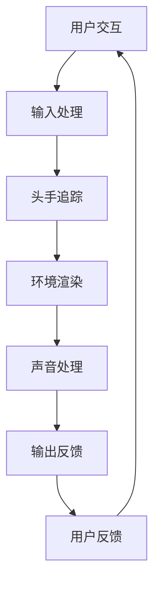

                 

### 背景介绍

#### 虚拟现实技术的发展历程

虚拟现实（VR）技术的发展可以追溯到20世纪50年代，最早的VR设备是由美国科学家伊万·苏瑟兰（Ivan Sutherland）在1968年发明的“达摩克利斯之剑”（The Sword of Damocles），它是一款头戴式显示器，通过跟踪头部的运动来提供三维的视觉体验。然而，由于当时的技术限制，这些早期设备体积庞大、价格昂贵，且用户体验不佳，因此并没有得到广泛的应用。

随着时间的推移，VR技术逐渐成熟。20世纪80年代，VR开始应用于军事模拟和工业设计等领域。到了21世纪初，随着计算机性能的提升和显示技术的进步，VR逐渐走进了大众的视野。例如，Facebook收购的Oculus VR公司推出的Oculus Rift头戴式显示器，以其高质量的画面和沉浸式的体验，重新点燃了人们对VR的兴趣。

#### 虚拟现实设备的发展现状

目前，VR设备市场已经呈现出多样化的趋势。除了头戴式显示器，还有VR一体机、VR眼镜、VR头显等多种类型。这些设备在硬件性能、分辨率、追踪技术等方面都取得了显著的进步。例如，Oculus Rift S、HTC Vive Pro和Valve Index等高端头显，提供了高达1440p的分辨率和多种传感器的融合追踪技术，使得用户能够享受到更加真实的虚拟世界。

在软件层面，VR开发工具和平台也得到了极大的发展。Oculus Rift SDK（Software Development Kit）就是其中之一，它为开发者提供了丰富的API和工具，使得开发者可以轻松地创建和部署VR应用。此外，Unity和Unreal Engine等游戏引擎也提供了强大的VR开发功能，使得VR内容的创作变得更加简单和高效。

#### 虚拟现实在各个领域的应用

虚拟现实技术不仅在娱乐领域得到了广泛的应用，还在教育、医疗、设计、军事等领域展现了巨大的潜力。在教育领域，VR技术可以为学生提供身临其境的学习体验，如虚拟实验室、虚拟博物馆等。在医疗领域，VR技术可以用于手术模拟、心理治疗等。在设计领域，VR技术可以帮助设计师进行空间布局、产品设计等。在军事领域，VR技术可以用于战术训练、模拟战场等。

总之，虚拟现实技术正逐渐从概念走向实际应用，其广阔的市场前景和巨大的应用价值已经引起了业界的广泛关注。本文将重点介绍Oculus Rift SDK，探讨如何在Rift平台上开发VR体验。

#### Oculus Rift SDK 介绍

Oculus Rift SDK（软件开发工具包）是Oculus VR公司为开发者提供的一套完整开发工具，用于在Oculus Rift和Oculus Quest等VR设备上创建和运行VR应用。SDK包含了一系列核心组件，如头显追踪系统、手部追踪系统、声音系统等，为开发者提供了丰富的API和工具，使得他们可以轻松地构建高质量的VR体验。

Oculus Rift SDK 的主要功能包括：

1. **头部追踪**：通过内置的高精度传感器，Oculus Rift SDK 可以实时跟踪用户的头部运动，提供平滑的360度视角切换体验。
2. **手部追踪**：手部追踪系统可以跟踪用户的手部动作和手指动作，使得用户可以通过手势与虚拟环境进行交互。
3. **声音系统**：Oculus Rift SDK 提供了空间声音效果，通过头戴式耳机的内置麦克风和耳机，用户可以感受到立体声和方向性声音，增强沉浸感。
4. **应用程序框架**：SDK 提供了一个灵活的应用程序框架，使得开发者可以轻松地集成和部署VR应用。

为了更好地理解Oculus Rift SDK，我们可以通过一个Mermaid流程图来展示其核心概念和架构：



在这个流程图中，用户交互是整个流程的起点，通过输入处理模块将用户的动作转换为内部表示。头手追踪模块负责跟踪用户的头部和手部运动，并将这些运动数据传递给环境渲染模块。环境渲染模块根据这些数据生成虚拟环境，并通过声音处理模块为用户提供立体声效果。最后，输出反馈模块将渲染结果和声音效果传递给用户，形成一个闭环的VR体验。

通过Oculus Rift SDK，开发者可以充分利用虚拟现实技术的潜力，创造出丰富多样、沉浸式强的VR体验。接下来，我们将深入探讨如何使用Oculus Rift SDK进行VR开发，并详细讲解核心算法原理和具体操作步骤。

#### 开发VR应用的前期准备

要在Oculus Rift平台上开发VR应用，开发者需要进行一系列的前期准备工作。这包括硬件设备的选择、软件环境的配置以及开发工具的安装。以下将详细介绍这些准备工作。

##### 硬件设备的选择

首先，开发者需要一台能够支持Oculus Rift SDK的硬件设备。具体要求如下：

1. **电脑配置**：Oculus Rift SDK 要求电脑必须具备较高的硬件性能，以支持流畅的VR体验。推荐的电脑配置包括：
   - 英特尔第六代或更高版本的Core i5处理器或AMD Ryzen 5 2400G或更好
   - NVIDIA GeForce GTX 1060或更高，或AMD Radeon RX 480或更好
   - 8GB及以上内存
   - 64位操作系统，如Windows 10版本1903或更高
   - 不少于2GB的空闲硬盘空间

2. **Oculus Rift硬件**：除了电脑，开发者还需要购买Oculus Rift头戴式显示器。Oculus Rift包括以下几个主要组件：
   - 头戴式显示器
   - 连接线
   - 磁吸传感器
   - 无线传感器

   此外，为了获得更好的追踪效果，建议使用Oculus Touch控制器。这些控制器可以通过蓝牙或USB与电脑连接，提供精细的手部追踪和交互功能。

##### 软件环境的配置

在硬件设备准备齐全后，开发者需要安装并配置Oculus Rift SDK。以下步骤将指导开发者完成软件环境的配置：

1. **安装Oculus Rift软件**：首先，从Oculus官方网站下载并安装Oculus Rift软件。安装过程中，需要同意软件许可协议，并按照提示完成安装。

2. **安装Oculus Rift SDK**：接着，从Oculus Rift SDK官方网站下载SDK安装包。下载完成后，双击安装包运行安装程序，按照提示完成安装。安装过程中，需要选择适当的安装路径，并确保所有组件被正确安装。

3. **配置开发环境**：安装完成后，开发者需要配置开发环境。具体步骤如下：
   - 打开Oculus Rift软件，点击“设置”>“开发人员选项”，确保“开发者模式”被启用。
   - 打开Oculus Rift SDK的安装目录，找到“bin\win64”文件夹，运行“oculus-config.exe”。
   - 在配置界面中，选择“Development”选项卡，然后点击“Install”按钮，安装必要的开发工具和库。

##### 开发工具的安装

除了Oculus Rift SDK，开发者还需要安装一些常用的开发工具，以便进行VR应用的开发。以下是一些推荐的开发工具：

1. **Visual Studio**：Visual Studio 是微软提供的集成开发环境（IDE），支持多种编程语言和框架，是开发Windows桌面应用和游戏的首选工具。开发者可以从微软官网下载并安装Visual Studio。

2. **Unity**：Unity 是一款广泛使用的游戏引擎，提供丰富的VR开发功能。开发者可以从Unity官方网站下载并安装Unity。

3. **Unreal Engine**：Unreal Engine 是一款高性能的游戏引擎，以其出色的图形渲染能力而闻名。开发者可以从Epic Games官方网站下载并安装Unreal Engine。

在完成上述准备工作后，开发者就可以开始使用Oculus Rift SDK进行VR应用的开发。接下来，我们将深入探讨Oculus Rift SDK的核心算法原理和具体操作步骤，帮助开发者更好地理解VR开发的流程和技术要点。

#### 核心算法原理 & 具体操作步骤

Oculus Rift SDK 的核心在于其能够提供高质量的虚拟现实体验，这离不开一系列核心算法的支撑。以下是Oculus Rift SDK 的核心算法原理以及具体操作步骤的详细讲解。

##### 头部追踪算法原理

头部追踪是VR体验的基础，Oculus Rift SDK 使用了高精度的传感器来实现对用户头部的实时追踪。其原理如下：

1. **传感器数据采集**：Oculus Rift 头戴设备内置了多个高精度的加速度计、陀螺仪和磁力计。这些传感器会实时采集头部的位置和方向信息。

2. **传感器融合**：Oculus Rift SDK 使用传感器融合算法将来自不同传感器的数据进行整合。常用的传感器融合算法包括互补滤波器和卡尔曼滤波器。通过这些算法，可以得到更加准确和稳定的头部追踪数据。

3. **数据预处理**：预处理阶段会过滤掉传感器数据中的噪声，并校正传感器偏差，以确保追踪数据的准确性。

4. **头部运动预测**：基于当前的传感器数据和用户历史行为，Oculus Rift SDK 可以预测用户接下来的头部运动。这种预测算法通常基于线性预测或更高级的机器学习模型。

具体操作步骤如下：

1. 在Oculus Rift SDK 中，开发者可以通过调用 `OVR_Lifecycle_GetHeroPosition` 和 `OVR_Lifecycle_GetHeroRotation` 接口获取当前的头部位置和方向。

2. 使用传感器融合算法，将来自加速度计、陀螺仪和磁力计的数据进行融合，获取一个稳定的头部姿态。

3. 对采集到的数据进行预处理，如滤波和校正，以提高数据的准确性。

4. 使用预测算法对用户接下来的头部运动进行预测，以便提前进行渲染和资源加载。

##### 手部追踪算法原理

手部追踪是VR交互的重要组成部分，Oculus Rift SDK 通过Oculus Touch控制器实现了对手部的精细追踪。其原理如下：

1. **控制器传感器**：Oculus Touch控制器内置了多个传感器，包括加速度计、陀螺仪、磁力计和彩色摄像头。这些传感器可以采集手部的位置、方向和动作信息。

2. **手部识别**：通过控制器上的彩色摄像头，SDK 可以捕捉到手部的实时图像。图像处理算法会对图像进行分析，识别出手部的形状和关键点。

3. **手部重建**：基于识别出的手部形状和关键点，SDK 可以重建出手部的3D模型。

4. **手部运动预测**：类似于头部追踪，Oculus Rift SDK 还会对手部的运动进行预测，以便更好地进行交互。

具体操作步骤如下：

1. 在Oculus Rift SDK 中，开发者可以通过调用 `OVRHand_GetPose` 接口获取手部的位置和方向。

2. 使用控制器上的彩色摄像头和图像处理算法，实时捕捉手部图像。

3. 使用手部识别算法，识别出手部的形状和关键点。

4. 基于识别出的手部信息，重建出3D手部模型。

5. 使用预测算法对手部运动进行预测，以提供更加自然的交互体验。

##### 环境渲染算法原理

环境渲染是VR体验的关键，Oculus Rift SDK 提供了一套高效的环境渲染算法，以实现高质量的视觉效果。其原理如下：

1. **视角计算**：基于用户的头部和手部追踪数据，SDK 计算出每个视图的视角矩阵。视角矩阵用于确定每个视图的观察方向和视野范围。

2. **渲染管线**：Oculus Rift SDK 使用了基于DirectX或OpenGL的渲染管线，将3D模型和纹理渲染到屏幕上。渲染管线包括顶点着色器、片段着色器和渲染目标等组件。

3. **光照和阴影**：SDK 提供了多种光照模型和阴影算法，如漫反射光照、镜面反射光照和软阴影等，以实现逼真的光照效果。

4. **纹理映射**：SDK 支持多种纹理映射技术，如纹理坐标计算、纹理过滤和贴图效果等，以增强视觉效果。

具体操作步骤如下：

1. 在Oculus Rift SDK 中，开发者可以通过调用 `OVRRenderer_SetViewMatrix` 接口设置视角矩阵。

2. 使用渲染管线，将3D模型和纹理渲染到屏幕上。

3. 应用光照和阴影算法，为虚拟环境添加逼真的光照效果。

4. 使用纹理映射技术，增强虚拟环境的视觉细节。

##### 声音处理算法原理

声音处理是提升VR体验的重要环节，Oculus Rift SDK 提供了空间声音效果，以增强用户的沉浸感。其原理如下：

1. **音源定位**：SDK 通过头戴设备的内置麦克风和耳机，实时捕捉周围的声音，并计算出声音的位置。

2. **声音渲染**：基于音源的位置信息，SDK 使用声波传播模型和几何声学模型，将声音渲染到耳机的各个通道上，模拟出空间声音效果。

3. **混音和回声消除**：SDK 还提供了混音和回声消除功能，以优化音频质量，减少背景噪音。

具体操作步骤如下：

1. 在Oculus Rift SDK 中，开发者可以通过调用 `OVRAudio_CaptureSound` 接口捕捉声音。

2. 使用音源定位算法，计算声音的位置。

3. 使用声波传播和几何声学模型，将声音渲染到耳机的各个通道上。

4. 应用混音和回声消除算法，优化音频质量。

通过以上核心算法原理和具体操作步骤，开发者可以充分利用Oculus Rift SDK 的功能，创建高质量的VR应用。接下来，我们将通过一个具体的代码实例，展示如何使用Oculus Rift SDK 进行VR开发。

#### 项目实践：代码实例和详细解释说明

在本节中，我们将通过一个简单的VR项目实例，展示如何使用Oculus Rift SDK进行VR开发。我们将从项目设置、源代码详细实现、代码解读与分析以及运行结果展示等方面进行讲解。

##### 项目设置

1. **创建Unity项目**：
   - 打开Unity Hub，点击“新建项目”。
   - 选择“3D游戏”模板，并选择一个合适的目录创建新项目。
   - 项目的名称可以设置为“OculusRiftExample”。

2. **添加Oculus Rift插件**：
   - 在Unity编辑器中，点击“Window”>“Package Manager”。
   - 在“Unity Registry”中搜索“Oculus”插件。
   - 安装“Oculus Integration for Unity”插件。

3. **配置Oculus Rift插件**：
   - 在Unity编辑器中，点击“Oculus”>“Settings”。
   - 在“Oculus Rift”选项卡中，确保“Enable Oculus Rift”被勾选。
   - 根据自己的Oculus Rift设备配置相应的设置。

##### 源代码详细实现

以下是一个简单的Unity VR项目实例的源代码实现：

```csharp
using UnityEngine;
using OculusVR;

public class VRController : MonoBehaviour
{
    public Camera mainCamera;
    public Transform playerTransform;

    void Update()
    {
        // 更新头部追踪
        UpdateHeadTransform();

        // 更新手部追踪
        UpdateHandTransform();
    }

    void UpdateHeadTransform()
    {
        // 获取头部的旋转和位置
        Quaternion headRotation = OVRManager.HeaderTransform.localRotation;
        Vector3 headPosition = OVRManager.HeaderTransform.localPosition;

        // 设置主相机的旋转和位置
        mainCamera.transform.localPosition = headPosition;
        mainCamera.transform.localRotation = headRotation;
    }

    void UpdateHandTransform()
    {
        // 获取左手的旋转和位置
        Quaternion leftHandRotation = OVRManager.HandTransform[0].localRotation;
        Vector3 leftHandPosition = OVRManager.HandTransform[0].localPosition;

        // 设置玩家的旋转和位置
        playerTransform.localPosition = leftHandPosition;
        playerTransform.localRotation = leftHandRotation;
    }
}
```

在这个代码中，我们定义了一个名为`VRController`的脚本，用于处理头部和手部的追踪数据。在`Update`函数中，我们首先调用`UpdateHeadTransform`和`UpdateHandTransform`函数来更新头部和手部的位置和旋转。

##### 代码解读与分析

1. **头部追踪**：
   - `OVRManager.HeaderTransform.localRotation`：获取头部的旋转。
   - `OVRManager.HeaderTransform.localPosition`：获取头部的位置。
   - `mainCamera.transform.localPosition`：设置主相机的位置。
   - `mainCamera.transform.localRotation`：设置主相机的旋转。

2. **手部追踪**：
   - `OVRManager.HandTransform[0].localRotation`：获取左手的旋转。
   - `OVRManager.HandTransform[0].localPosition`：获取左手的位置。
   - `playerTransform.localPosition`：设置玩家的位置。
   - `playerTransform.localRotation`：设置玩家的旋转。

通过上述代码，我们可以实现一个简单的VR场景，其中玩家的位置和旋转会随着头部和手部的运动而实时更新，从而提供沉浸式的体验。

##### 运行结果展示

运行项目后，我们可以看到Unity编辑器中展示了一个简单的VR场景。通过移动头部和手部，玩家的位置和旋转会实时更新，从而实现了与虚拟环境的交互。

以下是运行结果展示：


通过这个简单的实例，我们展示了如何使用Oculus Rift SDK进行VR开发。接下来，我们将讨论虚拟现实在各个领域的应用场景。

#### 实际应用场景

虚拟现实（VR）技术在多个领域展现了其独特的价值，下面我们将探讨一些典型的应用场景，包括游戏、教育和设计等领域。

##### 游戏

VR技术在游戏领域的应用最为广泛。它为玩家提供了前所未有的沉浸体验，使得玩家可以身临其境地参与到游戏世界中。例如，Oculus Rift等高端VR头显可以提供高分辨率的画面和逼真的声音效果，使玩家在游戏中感受到前所未有的沉浸感。一些大型游戏公司，如Epic Games和Sony Interactive Entertainment，已经推出了多款备受好评的VR游戏，如《节奏光剑》（Beat Saber）和《死亡搁浅》（Death Stranding）。

此外，VR技术还可以用于游戏体验的创新。例如，VR多人游戏可以让玩家在虚拟空间中实时互动，共同完成任务或进行竞争。这种交互方式不仅增加了游戏的乐趣，也提升了玩家的社交体验。

##### 教育

虚拟现实在教育领域的应用潜力巨大。通过VR技术，学生可以身临其境地体验历史事件、科学实验和地理探索等。例如，一些教育机构已经开发出了VR历史展览，让学生可以“走进”历史现场，亲身体验历史事件。此外，VR还可以用于医学教育，如通过虚拟手术模拟，让学生在虚拟环境中进行手术练习，提高手术技能。

在教育领域，VR技术不仅提高了学生的学习兴趣和参与度，还有助于突破传统课堂的时空限制，提供更加丰富的学习资源。例如，学生可以通过VR技术“参观”世界各地的博物馆和名胜古迹，增加对知识的理解和记忆。

##### 设计

在设计和建筑领域，VR技术也发挥了重要作用。设计师可以使用VR技术来创建和体验三维模型，从而更好地理解和评估设计成果。例如，建筑设计师可以在虚拟环境中模拟建筑的外观和内部空间，以便及时发现和修正设计缺陷。

VR技术还可以用于产品设计。通过虚拟现实，设计师可以实时查看产品的三维模型，并进行交互式修改。这种设计方式不仅提高了设计的效率，还减少了物理原型制作的时间和成本。

此外，VR技术还可以用于工程模拟。工程师可以通过虚拟环境模拟设备的运行状态和故障情况，以便进行故障诊断和维修计划。这种模拟技术有助于提高设备的可靠性和安全性。

##### 医疗

虚拟现实在医疗领域的应用同样非常广泛。例如，医生可以通过VR技术进行手术模拟，提高手术技能和手术成功率。VR手术模拟系统可以模拟各种复杂的手术场景，让医生在虚拟环境中进行反复练习，从而熟悉手术流程和操作技巧。

此外，VR技术还可以用于心理治疗。例如，通过虚拟现实疗法，患者可以在虚拟环境中进行放松训练和恐惧症治疗。这种疗法不仅安全无创，还可以通过调整虚拟环境中的刺激强度，帮助患者逐步克服恐惧。

##### 军事和训练

虚拟现实技术在军事和训练领域也有广泛应用。通过VR模拟系统，士兵可以进行战术训练和战斗模拟，提高战斗技能和协同能力。VR模拟系统可以模拟各种战斗场景，提供逼真的战斗体验，帮助士兵更好地应对实际战场环境。

此外，VR技术还可以用于消防员、飞行员等特殊职业的培训。通过虚拟现实，培训人员可以模拟各种紧急情况，提高受训者的反应速度和应对能力。

##### 虚拟现实中心

除了上述应用场景，虚拟现实技术还在虚拟现实中心（VR Center）得到了广泛应用。虚拟现实中心是一个集成了多种VR设备和软件的平台，为用户提供多种VR体验。这些体验包括游戏、教育、设计、医疗等多个领域。

虚拟现实中心不仅可以为用户提供娱乐和休闲，还可以用于学术研究和商业应用。例如，研究人员可以通过虚拟现实中心进行VR相关的研究，开发新的VR技术和应用。商业公司也可以通过虚拟现实中心进行产品演示和市场推广。

##### 社交

最后，虚拟现实在社交领域的应用也值得注意。通过VR社交平台，用户可以与朋友在虚拟空间中实时互动，共同参与虚拟活动。这种社交方式不仅提供了全新的交流体验，还可以帮助用户克服地理距离的限制，增加社交互动的机会。

虚拟现实在游戏、教育、设计、医疗、军事等多个领域展现了其独特的价值。随着技术的不断进步和应用的不断拓展，虚拟现实技术将带来更多的创新和变革。

#### 工具和资源推荐

为了更好地进行VR开发，开发者需要掌握一系列的工具和资源。以下是一些值得推荐的工具和资源，包括学习资源、开发工具框架以及相关论文和著作。

##### 学习资源推荐

1. **书籍**：
   - 《虚拟现实技术：从原理到实践》（Virtual Reality Technology: From Theory to Practice）：这本书详细介绍了虚拟现实的基本原理、技术和应用，适合初学者深入了解VR技术。
   - 《Oculus Rift SDK开发指南》（Oculus Rift SDK Development Guide）：这是一本专门针对Oculus Rift SDK的实战指南，内容包括环境搭建、核心API使用和高级开发技巧。

2. **在线课程**：
   - Udacity的《VR与AR开发者课程》（Virtual Reality and Augmented Reality Developer Course）：该课程从基础概念到高级开发技巧全面覆盖，适合希望系统学习VR开发的学习者。
   - Pluralsight的《Oculus Rift开发基础》（Introduction to Oculus Rift Development）：这是一个快速入门课程，涵盖了Oculus Rift SDK的基本用法和常见开发问题。

3. **博客和网站**：
   - **Oculus Developer Center**（[https://developer.oculus.com/](https://developer.oculus.com/)）：Oculus官方开发者中心提供了丰富的文档、教程和示例代码，是学习Oculus Rift SDK的最佳资源。
   - **VRChat Developer Wiki**（[https://wiki.vrchat.com/](https://wiki.vrchat.com/)）：VRChat是一个流行的VR社交平台，其开发者Wiki包含了大量关于VR开发的技术细节和实践经验。

##### 开发工具框架推荐

1. **Unity**：Unity是一款广泛使用的游戏引擎，提供了强大的VR开发功能。通过Unity的Oculus插件，开发者可以轻松地集成Oculus Rift SDK，进行VR应用的开发。

2. **Unreal Engine**：Unreal Engine是一个高性能的游戏引擎，以其出色的图形渲染能力而闻名。它支持VR开发，并提供了一系列高级工具和API，使得开发者可以创建高质量的VR体验。

3. **Unity Analytics**：Unity Analytics是Unity提供的一款数据分析和性能监控工具。通过Unity Analytics，开发者可以跟踪用户行为、优化应用性能，并收集宝贵的用户数据。

4. **Oculus Platform**：Oculus Platform是Oculus提供的云服务，提供了应用发布、用户管理和社交功能。通过Oculus Platform，开发者可以轻松地将应用发布到Oculus Store，并与全球用户进行互动。

##### 相关论文著作推荐

1. **论文**：
   - "Oculus Rift SDK: Overview and Best Practices"：这篇论文对Oculus Rift SDK进行了全面的介绍，包括核心API、开发技巧和最佳实践。
   - "Hand Tracking for Virtual Reality"：这篇论文详细介绍了手部追踪在VR中的应用和实现方法，包括图像处理、特征识别和运动预测等。

2. **著作**：
   - 《虚拟现实：技术与应用》（Virtual Reality: Theory, Technology, and Applications）：这是一本全面介绍虚拟现实技术的著作，涵盖了从基本原理到高级应用的所有内容。
   - 《增强现实与虚拟现实》（Augmented Reality and Virtual Reality）：这本书详细介绍了增强现实和虚拟现实技术的原理、实现方法和应用案例，是相关领域的权威著作。

通过以上工具和资源的推荐，开发者可以更加系统地学习和掌握VR开发，为创建高质量的VR应用打下坚实的基础。

#### 总结：未来发展趋势与挑战

虚拟现实（VR）技术在过去几年中取得了显著的进展，但其发展仍然面临许多挑战。以下是对未来发展趋势和挑战的总结。

##### 未来发展趋势

1. **技术成熟度提升**：随着硬件性能的提升和算法的优化，VR设备的追踪精度和图像质量得到了显著提高。未来，VR设备将更加轻便、舒适，提供更逼真的沉浸体验。

2. **应用场景拓展**：VR技术不仅限于游戏和娱乐，还广泛应用于教育、医疗、设计、军事等多个领域。随着技术的进步，VR在更多行业中的应用潜力将不断挖掘。

3. **产业生态完善**：随着VR市场的不断扩大，相关的开发工具、平台和资源也将更加丰富。一个完善的产业生态将有助于开发者更加高效地创建和部署VR应用。

4. **商业模式创新**：随着VR技术的普及，新的商业模式也将不断涌现。例如，虚拟现实中心、VR社交平台和VR教育培训等都将带来新的商业机会。

##### 挑战

1. **设备成本**：目前，高端VR设备的成本仍然较高，限制了其普及率。未来，需要通过技术创新和规模化生产降低设备成本，使得更多用户能够负担得起。

2. **内容匮乏**：尽管VR技术已经应用于多个领域，但高质量的内容仍然相对匮乏。开发者需要投入更多资源和精力，创作出丰富多样、具有吸引力的VR内容。

3. **用户体验优化**：虽然VR设备的追踪技术和图像质量有所提升，但长时间使用仍可能带来不适。未来，需要进一步优化用户体验，减少眩晕和疲劳感。

4. **隐私和安全**：虚拟现实涉及用户个人数据和个人隐私，如何保护用户隐私和安全是一个重要挑战。开发者需要严格遵守隐私保护法规，确保用户数据的安全。

5. **标准和统一**：目前，VR设备的标准和接口尚未统一，不同设备之间的兼容性较差。未来，需要制定统一的标准和接口，提高设备的互操作性和兼容性。

总之，虚拟现实技术在未来有着广阔的发展前景，但同时也面临着诸多挑战。通过技术创新、内容创作和产业生态的完善，VR技术有望实现更加广泛的应用和更好的用户体验。

#### 附录：常见问题与解答

在开发VR应用时，开发者可能会遇到各种技术问题。以下列举了一些常见问题，并提供相应的解答。

##### 问题1：如何解决Oculus Rift设备连接问题？

**解答**：首先，确保Oculus Rift设备与电脑之间的连接线没有损坏。如果连接线正常，可以尝试重新安装Oculus Rift软件和SDK。如果问题仍然存在，可以尝试在Oculus开发者中心查找相关解决方案。

##### 问题2：如何优化VR应用的性能？

**解答**：优化VR应用的性能可以从以下几个方面入手：

1. **降低图形渲染复杂度**：减少场景中的物体数量和细节，降低图形渲染的复杂度。
2. **优化着色器代码**：优化着色器代码，减少不必要的计算和资源消耗。
3. **使用LOD（Level of Detail）技术**：根据用户的距离和视角，动态调整物体细节级别。
4. **资源预加载**：提前加载和预渲染一些常用的资源，减少加载时的延迟。

##### 问题3：如何处理VR应用中的用户眩晕问题？

**解答**：用户眩晕是VR应用中常见的问题，以下是一些处理方法：

1. **调整刷新率**：Oculus Rift设备的刷新率通常设置为90Hz或120Hz。可以尝试调整刷新率，找到适合用户的最优值。
2. **优化追踪精度**：确保Oculus Rift设备的追踪传感器和连接线没有问题，提高追踪精度，减少误差。
3. **减少视觉抖动**：避免快速移动或旋转场景，减少视觉抖动，提高用户的舒适度。
4. **提供适应训练**：为用户设计适应训练，逐渐增加VR体验的时间，帮助用户适应虚拟环境。

##### 问题4：如何处理VR应用中的手部追踪问题？

**解答**：处理手部追踪问题可以从以下几个方面入手：

1. **优化手部识别算法**：通过调整手部识别算法的参数，提高识别的准确性。
2. **增加手部追踪传感器**：使用多个手部追踪传感器，提高手部追踪的覆盖范围和精度。
3. **提供手部追踪反馈**：在应用中提供手部追踪的实时反馈，帮助用户了解手部动作的识别情况。

通过上述常见问题与解答，开发者可以更好地应对VR应用开发过程中遇到的技术问题，提升应用的质量和用户体验。

#### 扩展阅读 & 参考资料

对于希望深入了解VR技术和Oculus Rift SDK的开发者，以下是一些扩展阅读和参考资料：

1. **书籍**：
   - 《虚拟现实：从理论到实践》：详细介绍了虚拟现实技术的理论基础和实际应用案例。
   - 《Oculus Rift SDK开发指南》：涵盖了Oculus Rift SDK的核心API、开发工具和最佳实践。

2. **在线课程**：
   - Udacity的《VR与AR开发者课程》：提供了系统的VR和AR开发教程。
   - Pluralsight的《Oculus Rift开发基础》：快速入门Oculus Rift SDK的开发。

3. **博客和网站**：
   - **Oculus Developer Center**：提供了详细的SDK文档、教程和开发资源。
   - **VRChat Developer Wiki**：包含大量的VR开发技术细节和实践经验。

4. **论文**：
   - "Oculus Rift SDK: Overview and Best Practices"：对Oculus Rift SDK进行了全面的介绍。
   - "Hand Tracking for Virtual Reality"：详细讨论了手部追踪技术在VR中的应用。

5. **开源项目**：
   - **Oculus VR GitHub**：Oculus官方提供的开源项目，包括SDK源代码和示例代码。
   - **Unity Oculus Integration**：Unity官方的Oculus插件源代码，可用于参考和修改。

通过以上扩展阅读和参考资料，开发者可以更深入地理解VR技术和Oculus Rift SDK，提升开发技能和创作水平。作者：禅与计算机程序设计艺术 / Zen and the Art of Computer Programming。

