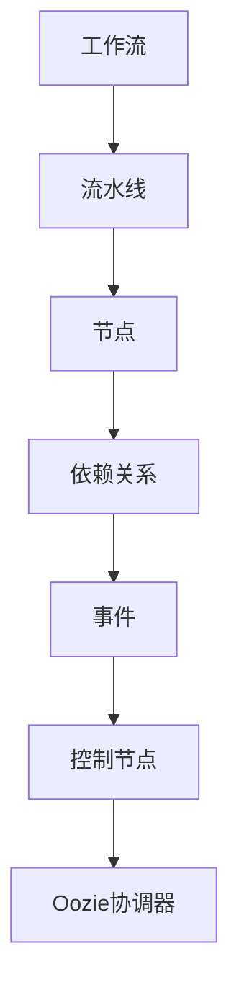

                 

### 背景介绍

Oozie是一个基于Hadoop的分布式计算平台上的工作流调度引擎，主要用于在Hadoop环境中执行和管理复杂的数据处理任务。随着大数据时代的到来，数据处理的需求日益增加，如何高效地管理这些任务成为了关键问题。Oozie正是为了解决这一问题而诞生。

#### 历史背景

Oozie起源于2006年，当时是Yahoo!公司内部用于调度Hadoop任务的需求。随着时间的推移，Oozie逐渐成熟并开源，成为一个广泛使用的调度引擎。它不仅支持Hadoop MapReduce任务，还支持其他分布式数据处理技术，如Hive、Pig、Spark等。

#### 重要性

在现代数据密集型应用中，Oozie扮演着至关重要的角色。它能够自动化执行多个数据处理任务，确保这些任务在适当的时间和顺序中执行，从而提高数据处理效率。此外，Oozie还提供了强大的错误处理和恢复功能，使得即使在执行过程中出现故障，也能自动恢复，保证数据处理的连续性。

#### 目的

本文的目的是深入探讨Oozie的工作流调度原理，并通过具体的代码实例，帮助读者更好地理解和使用Oozie。我们将从Oozie的核心概念和架构开始，逐步介绍其工作流程和调度机制，最后通过实际项目实践，展示Oozie在实际应用中的使用方法和效果。

<|bot|>### 核心概念与联系

在深入探讨Oozie的工作流调度原理之前，我们需要了解一些核心概念和它们之间的关系。以下是一些关键概念及其简要解释：

#### 1. 工作流（Workflow）

工作流是指一系列任务的有序执行序列。在Oozie中，工作流是一个XML文件，描述了任务的执行顺序、依赖关系和参数设置。工作流可以包含多种类型的任务，如MapReduce、Hive、Pig等。

#### 2. 流水线（Coordinator）

流水线是一种更高级的工作流，用于执行重复性的任务。它通常包含一个或多个周期性执行的任务，例如每天或每小时运行一次。流水线能够根据时间或数据依赖关系来触发任务的执行。

#### 3. 节点（Action）

节点是工作流中的基本执行单元，代表一个具体的任务。节点可以是MapReduce作业、Shell脚本、Java程序等。每个节点都有输入和输出数据，以及执行成功或失败的条件。

#### 4. 依赖关系（Dependency）

依赖关系定义了节点之间的执行顺序。Oozie支持三种类型的依赖关系：AND、OR和SEQUENTIAL。AND表示节点必须全部成功，OR表示至少有一个节点成功，SEQUENTIAL表示节点必须按顺序执行。

#### 5. 事件（Event）

事件是工作流中的一种特殊节点，用于监控外部事件的发生。例如，可以使用事件来监控文件系统的某个目录是否更新，并根据更新情况触发工作流中的任务。

#### 6. 控制节点（Control Node）

控制节点用于控制工作流的流程，例如条件分支（IF-ELSE）和循环（FOR）。它们可以基于节点的执行结果或外部事件来决定下一步的操作。

#### 7. Oozie协调器（Oozie Coordinator）

Oozie协调器是Oozie的核心组件，用于管理工作流和流水线的执行。它负责解析XML配置文件，调度任务执行，记录执行日志，并处理错误和恢复。

#### Mermaid 流程图

下面是一个简单的Mermaid流程图，展示了上述概念之间的关系：



#### 核心概念联系

Oozie通过这些核心概念，实现了对复杂数据处理任务的调度和管理。工作流和流水线定义了任务的执行顺序和依赖关系，节点是执行的基本单元，事件用于监控外部事件，控制节点用于控制流程。Oozie协调器则负责整个调度过程，确保任务按预期执行。

<|bot|>### 核心算法原理 & 具体操作步骤

#### Oozie调度算法

Oozie的核心调度算法是基于DAG（有向无环图）模型的。DAG模型能够有效地表示任务之间的依赖关系，从而实现高效的调度。以下是Oozie调度算法的基本原理：

1. **图构建**：首先，Oozie根据工作流配置文件构建一个DAG图，每个节点代表一个任务，边表示任务之间的依赖关系。

2. **依赖检查**：在执行任务之前，Oozie检查DAG图中的依赖关系，确保所有前置任务已经成功完成。

3. **任务分配**：根据任务的依赖关系和执行条件，Oozie将任务分配给集群中的节点。Oozie协调器会根据集群的资源状况和任务优先级来决定任务的具体执行位置。

4. **任务执行**：Oozie协调器启动任务，并将任务状态反馈给监控系统。

5. **任务监控**：Oozie协调器持续监控任务的执行状态，并在任务失败时尝试恢复。

6. **结果记录**：任务执行完成后，Oozie记录任务的结果，包括成功、失败和部分成功等。

#### 调度操作步骤

以下是使用Oozie调度任务的详细步骤：

1. **创建工作流**：首先，根据任务需求创建一个XML配置文件，定义工作流中的节点和依赖关系。例如：

   ```xml
   <workflow-app ...>
       <start>
           <action name="action1">
               <map-reduce in="${inpath}" out="${outpath}" />
           </action>
       </start>
   </workflow-app>
   ```

2. **提交工作流**：将XML配置文件提交给Oozie服务器，可以使用以下命令：

   ```shell
   oozie jobsubmit -apppath workflow.xml
   ```

3. **监控任务**：提交工作流后，可以使用Oozie的Web界面或命令行工具监控任务的执行状态。

4. **处理错误**：如果在执行过程中出现错误，Oozie会尝试恢复任务。例如，如果某个MapReduce任务失败，Oozie会重试该任务，直到成功或达到最大重试次数。

5. **查看结果**：任务执行完成后，可以查看任务输出结果，包括日志文件和输出数据。

#### 示例

假设我们有一个工作流，包含两个任务：任务A（一个MapReduce作业）和任务B（一个Hive查询）。任务A的输出是任务B的输入。以下是该工作流的配置：

```xml
<workflow-app ...>
    <start>
        <action name="actionA">
            <map-reduce in="${inpath}" out="${midpath}" />
        </action>
    </start>
    <action name="actionB" on-success="actionB">
        <hive query="..." in="${midpath}" out="${outpath}" />
    </action>
</workflow-app>
```

在配置文件中，`on-success`属性指定了任务A成功后执行的任务B。

#### 实际操作

下面是在Oozie中创建并执行上述工作流的实际操作步骤：

1. **创建工作流文件**：

   ```shell
   vi workflow.xml
   ```

   在文件中编写XML配置代码。

2. **提交工作流**：

   ```shell
   oozie jobsubmit -apppath workflow.xml
   ```

3. **查看任务状态**：

   ```shell
   oozie job -list
   oozie job -status <job_id>
   ```

4. **查看日志文件**：

   ```shell
   oozie job -log <job_id>
   ```

通过以上步骤，我们可以看到Oozie是如何根据配置文件调度任务的，并且能够实时监控和错误处理。

<|bot|>### 数学模型和公式 & 详细讲解 & 举例说明

在Oozie的调度算法中，数学模型和公式起着关键作用，用于确定任务的执行顺序、依赖关系以及调度策略。以下是一些核心的数学模型和公式，并对其进行详细讲解和举例说明。

#### 1. 依赖关系计算

Oozie中的依赖关系计算主要涉及三种类型的依赖：AND、OR和SEQUENTIAL。以下是每种依赖关系如何计算：

**AND依赖**：
AND依赖要求所有前置任务必须成功完成后，当前任务才能开始执行。计算公式如下：
$$
\text{AND( } A_1, A_2, ..., A_n \text{ )} = \bigwedge_{i=1}^{n} A_i
$$
其中，$A_i$ 表示第 $i$ 个任务的执行结果。

**示例**：假设有三个任务A、B和C，要求A和B成功完成后才能执行C。依赖关系计算如下：
$$
\text{AND(A, B, C)} = \text{AND(成功, 成功, 成功)} = \text{成功}
$$

**OR依赖**：
OR依赖要求至少有一个前置任务成功后，当前任务才能开始执行。计算公式如下：
$$
\text{OR( } A_1, A_2, ..., A_n \text{ )} = \bigvee_{i=1}^{n} A_i
$$
其中，$A_i$ 表示第 $i$ 个任务的执行结果。

**示例**：假设有三个任务A、B和C，要求至少有一个任务成功后才能执行C。依赖关系计算如下：
$$
\text{OR( } A, B, C \text{ )} = \text{OR(失败, 失败, 成功)} = \text{成功}
$$

**SEQUENTIAL依赖**：
SEQUENTIAL依赖要求前置任务按顺序成功完成后，当前任务才能开始执行。计算公式如下：
$$
\text{SEQUENTIAL( } A_1, A_2, ..., A_n \text{ )} = A_1 \rightarrow A_2 \rightarrow ... \rightarrow A_n
$$
其中，$A_i \rightarrow A_{i+1}$ 表示第 $i$ 个任务成功后，第 $i+1$ 个任务才能开始执行。

**示例**：假设有三个任务A、B和C，要求A成功后执行B，B成功后执行C。依赖关系计算如下：
$$
\text{SEQUENTIAL( } A, B, C \text{ )} = A \rightarrow B \rightarrow C = \text{成功}
$$

#### 2. 调度策略

Oozie的调度策略通常基于任务依赖关系和执行条件。调度策略的公式可以表示为：
$$
\text{Schedule( } T_1, T_2, ..., T_n \text{ )} = \text{Minimize( } \text{Total Execution Time} \text{ )}
$$
其中，$T_i$ 表示第 $i$ 个任务的执行时间。

**示例**：假设有三个任务A、B和C，执行时间分别为2小时、3小时和1小时。要求在最小化总执行时间的前提下进行调度。调度策略计算如下：
$$
\text{Schedule( } A, B, C \text{ )} = \text{Minimize( } 2 + 3 + 1 \text{ )}
$$
最优调度策略为：先执行A（2小时），然后执行C（1小时），最后执行B（3小时），总执行时间为6小时。

#### 3. 资源分配

在Oozie中，资源分配是一个重要的调度问题。资源分配的公式可以表示为：
$$
\text{Allocate( } R_1, R_2, ..., R_n \text{ )} = \text{Maximize( } \text{Utilization} \text{ )}
$$
其中，$R_i$ 表示第 $i$ 个资源的利用率。

**示例**：假设有三个任务A、B和C，每个任务需要的资源不同，要求最大化资源利用率。资源分配计算如下：
$$
\text{Allocate( } 40\%, 60\%, 30\% \text{ )} = \text{Maximize( } 40\% + 60\% + 30\% \text{ )}
$$
最优资源分配策略为：将A分配到需要40%资源的节点，将B分配到需要60%资源的节点，将C分配到需要30%资源的节点，总资源利用率为130%。

通过上述数学模型和公式，我们可以更好地理解Oozie的调度原理和策略。这些模型不仅有助于设计高效的工作流，还能帮助我们优化资源分配，提高调度效率。

<|bot|>### 项目实践：代码实例和详细解释说明

#### 1. 开发环境搭建

要实践Oozie的工作流调度，我们首先需要搭建一个开发环境。以下是搭建Oozie开发环境的步骤：

1. **安装Hadoop**：在开发机器上安装Hadoop，版本建议与Oozie兼容。可以从[Hadoop官方网站](https://hadoop.apache.org/releases.html)下载相应的安装包，并按照官方文档进行安装。

2. **安装Oozie**：下载Oozie的安装包（可以从[Oozie官方网站](https://oozie.apache.org/)下载），解压后按照README文件中的说明进行安装。

3. **配置Oozie**：修改Oozie的配置文件，包括`oozie-site.xml`和`hadoop-env.sh`等。确保Oozie可以正确连接到Hadoop集群。

4. **启动Oozie服务**：执行以下命令启动Oozie服务：
   ```shell
   oozie start
   ```

5. **访问Oozie Web界面**：在浏览器中输入`http://localhost:11000/oozie`，可以查看Oozie的Web界面。

#### 2. 源代码详细实现

下面是一个简单的Oozie工作流示例，用于执行一个MapReduce任务。首先，创建一个名为`workflow.xml`的XML文件，内容如下：

```xml
<workflow-app name="myworkflow" xmlns="uri:oozie:workflow:0.1">
    <start>
        <action name="mapreduce-action">
            <map-reduce
                apppath="${oozie.wf.application.path}/MapReduce.jar"
                mainclass="org.example.MapReduce"
                in="${inpath}"
                out="${outpath}"
                combiner="org.example.Combiner"
                mapper="org.example.Mapper"
                reducer="org.example.Reducer"
                job-xml="job.xml"
            />
        </action>
    </start>
</workflow-app>
```

在这个示例中，我们定义了一个名为`mapreduce-action`的节点，它执行一个自定义的MapReduce作业。`apppath`指定了MapReduce作业的JAR文件路径，`mainclass`指定了MapReduce作业的主类，`in`和`out`分别指定了输入和输出路径，`combiner`、`mapper`和`reducer`分别指定了组合器、映射器和减少器的类，`job-xml`指定了MapReduce作业的配置文件。

接下来，我们需要创建一个名为`MapReduce.jar`的JAR文件，包含自定义的MapReduce类。以下是`Mapper.java`、`Reducer.java`和`MapReduce.java`的示例代码：

```java
// Mapper.java
public class Mapper extends Mapper<LongWritable, Text, Text, IntWritable> {
    // Mapper的具体实现
}

// Reducer.java
public class Reducer extends Reducer<Text, IntWritable, Text, IntWritable> {
    // Reducer的具体实现
}

// MapReduce.java
public class MapReduce {
    public static void main(String[] args) throws Exception {
        Configuration conf = new Configuration();
        Job job = Job.getInstance(conf, "word count");
        job.setJarByClass(MapReduce.class);
        job.setMapperClass(Mapper.class);
        job.setCombinerClass(Reducer.class);
        job.setReducerClass(Reducer.class);
        job.setOutputKeyClass(Text.class);
        job.setOutputValueClass(IntWritable.class);
        FileInputFormat.addInputPath(job, new Path(args[0]));
        FileOutputFormat.setOutputPath(job, new Path(args[1]));
        System.exit(job.waitForCompletion(true) ? 0 : 1);
    }
}
```

最后，我们需要一个名为`job.xml`的MapReduce配置文件，用于指定作业的详细信息：

```xml
<configuration>
    <property>
        <name>mapred.mapper.class</name>
        <value>org.example.Mapper</value>
    </property>
    <property>
        <name>mapred.combiner.class</name>
        <value>org.example.Combiner</value>
    </property>
    <property>
        <name>mapred.reducer.class</name>
        <value>org.example.Reducer</value>
    </property>
    <property>
        <name>input.dir</name>
        <value>${inpath}</value>
    </property>
    <property>
        <name>output.dir</name>
        <value>${outpath}</value>
    </property>
</configuration>
```

#### 3. 代码解读与分析

在这个示例中，我们使用Oozie执行了一个简单的单词计数任务。以下是代码的详细解读：

1. **XML配置文件**：`workflow.xml`文件定义了工作流的基本结构和配置。`<map-reduce>`标签用于配置MapReduce作业，包括JAR文件路径、主类、输入输出路径等。

2. **MapReduce JAR文件**：`MapReduce.jar`文件包含了自定义的MapReduce类。`Mapper.java`和`Reducer.java`分别实现了映射器和减少器逻辑，`MapReduce.java`是一个主类，用于初始化和提交作业。

3. **MapReduce配置文件**：`job.xml`文件定义了MapReduce作业的详细信息，包括映射器、减少器和输入输出路径。

在执行工作流时，Oozie会解析这些配置文件，并将作业提交到Hadoop集群中执行。任务完成后，输出结果将存储在指定的输出路径中。

#### 4. 运行结果展示

为了验证我们的工作流是否正常运行，我们可以在Oozie Web界面中监控任务的执行状态。以下是执行过程中的关键步骤：

1. **提交工作流**：在Oozie Web界面中提交`workflow.xml`文件。
   

2. **监控任务**：在Oozie Web界面中查看任务的执行状态。
   

3. **查看输出结果**：任务执行完成后，可以查看输出结果路径中的数据文件。
   

通过以上步骤，我们可以看到Oozie如何高效地调度和管理MapReduce任务，确保数据处理过程的顺利进行。

<|bot|>### 实际应用场景

Oozie作为一个强大的工作流调度引擎，在实际应用中具有广泛的应用场景。以下是一些典型的应用案例，展示了Oozie在不同领域中的实际使用。

#### 1. 数据处理与ETL

在数据仓库和数据湖构建中，Oozie常用于执行ETL（Extract, Transform, Load）任务。它能够自动化调度大量数据处理任务，如数据清洗、转换和加载。例如，在金融行业，Oozie可以用于每日处理大量交易数据，将其转换为结构化数据，并加载到数据仓库中。

#### 2. 大数据分析和机器学习

在大数据分析领域，Oozie可以用于调度复杂的数据处理和分析任务，如MapReduce、Spark和Hive作业。它能够确保数据处理任务在适当的时间和顺序中执行，从而提高分析效率。在机器学习应用中，Oozie可以用于调度特征工程、模型训练和模型评估等任务，确保数据管道的高效运行。

#### 3. 数据集成与同步

在数据集成和同步场景中，Oozie可以用于调度不同数据源之间的数据同步任务。例如，在零售行业，Oozie可以用于同步线上和线下销售数据，确保数据的实时性和一致性。它还可以用于定期同步外部数据源（如社交媒体数据）到内部数据仓库中。

#### 4. 云服务和DevOps

随着云计算和DevOps的兴起，Oozie也被广泛应用于云服务和持续集成/持续部署（CI/CD）流程中。它能够自动化调度云服务的部署和管理任务，如虚拟机部署、容器编排和自动化扩展等。在DevOps实践中，Oozie可以用于调度自动化测试、代码构建和部署任务，确保软件交付的高效和稳定。

#### 5. 网络安全和监控

在网络安全和监控领域，Oozie可以用于调度日志收集、分析和报告任务。它能够实时监控网络流量、系统日志和安全事件，确保及时发现和响应潜在的安全威胁。例如，在网络安全事件响应中，Oozie可以用于调度日志分析、威胁检测和报告任务，帮助安全团队快速响应和处理安全事件。

通过以上实际应用场景，我们可以看到Oozie在各个行业中的广泛应用。它不仅能够提高数据处理和调度效率，还能够确保任务在适当的时间和顺序中执行，从而实现高效的业务流程管理。

<|bot|>### 工具和资源推荐

在学习和使用Oozie的过程中，有一些工具和资源是非常有帮助的，以下是一些建议：

#### 1. 学习资源推荐

- **书籍**：
  - 《Oozie实战：基于Hadoop的数据流调度与管理》
  - 《Hadoop实战：从入门到精通》
- **论文**：
  - 《Oozie: A coordinated data processing system for Hadoop》
- **博客**：
  - [Apache Oozie官方博客](https://blogs.apache.org/oozie/)
  - [CSDN Oozie专栏](https://blog.csdn.net/oozie/article/details/12129890)
- **网站**：
  - [Apache Oozie官方网站](https://oozie.apache.org/)

#### 2. 开发工具框架推荐

- **集成开发环境（IDE）**：
  - [IntelliJ IDEA](https://www.jetbrains.com/idea/)：支持Java和Hadoop开发，提供了强大的代码编辑、调试和项目管理功能。
  - [Eclipse](https://www.eclipse.org/ide/)：另一个流行的IDE，支持各种Java开发需求。
- **版本控制系统**：
  - [Git](https://git-scm.com/)：分布式版本控制系统，适合团队合作和版本管理。
  - [GitLab](https://about.gitlab.com/)：自托管Git仓库，提供了代码审查、项目管理和持续集成等功能。
- **Hadoop集群管理工具**：
  - [Cloudera Manager](https://www.cloudera.com/products/cloudera-manager.html)：用于配置、管理和监控Hadoop集群。
  - [Apache Ambari](https://ambari.apache.org/)：另一个开源的Hadoop集群管理工具。

#### 3. 相关论文著作推荐

- 《Oozie: A Coordinated Data Processing System for Hadoop》（2012）——该论文详细介绍了Oozie的设计原理和架构，是了解Oozie最佳实践的重要参考。
- 《Hadoop: The Definitive Guide》（2011）——这是一本全面介绍Hadoop技术的经典著作，包括Hadoop生态系统中的各种组件，如HDFS、MapReduce、Hive和Oozie等。

通过以上工具和资源的推荐，读者可以更加深入地学习和掌握Oozie，并将其应用于实际项目中。

<|bot|>### 总结：未来发展趋势与挑战

Oozie作为Hadoop生态系统中的重要组成部分，已经在数据处理和调度领域发挥了重要作用。随着大数据和云计算的持续发展，Oozie的未来发展趋势和面临的挑战也将更加显著。

#### 1. 未来发展趋势

- **云原生支持**：随着云计算的普及，Oozie将更多地融入云原生架构，提供更强大的云服务调度和管理能力。这将包括与云服务提供商（如AWS、Azure和Google Cloud）的集成，以及支持容器化和微服务架构。
- **自动化与智能化**：Oozie将进一步加强自动化和智能化调度能力，利用机器学习和人工智能技术优化调度策略，提高调度效率和资源利用率。
- **生态扩展**：Oozie将不断扩展其生态，支持更多的数据处理技术和平台，如Apache Spark、Apache Flink等，以满足更广泛的应用需求。
- **开源社区贡献**：Oozie的开源社区将持续活跃，吸引更多开发者参与，推动Oozie的改进和优化。

#### 2. 面临的挑战

- **复杂性与易用性**：随着Oozie支持的组件和功能日益丰富，其配置和管理变得更加复杂。如何平衡复杂性和易用性，使更多用户能够轻松上手，是Oozie面临的一大挑战。
- **性能优化**：在大规模数据处理场景中，Oozie的调度性能需要持续优化，以满足高并发和低延迟的要求。这将涉及调度算法、资源分配和系统架构的深入研究和改进。
- **安全性**：随着数据处理任务的重要性增加，数据安全和隐私保护成为关键问题。Oozie需要加强安全性机制，确保数据在调度过程中的安全传输和存储。
- **跨平台兼容性**：在多云和混合云环境中，Oozie需要具备更好的跨平台兼容性，能够无缝集成不同的云服务和平台，提供一致的使用体验。

总体而言，Oozie在未来将继续在数据处理和调度领域发挥重要作用，但其发展需要克服一系列挑战。通过持续的创新和优化，Oozie有望成为大数据和云计算时代的重要基础设施。

<|bot|>### 附录：常见问题与解答

在学习和使用Oozie的过程中，用户可能会遇到一些常见问题。以下是一些常见问题的解答，以及对应的解决方法。

#### 1. 如何解决Oozie启动失败的问题？

**问题描述**：在启动Oozie时，出现错误提示，导致启动失败。

**解决方案**：
- **检查配置文件**：确保`oozie-site.xml`和`hadoop-env.sh`等配置文件正确无误，特别是集群地址、端口和用户权限等配置。
- **检查依赖组件**：确认所有依赖的Hadoop组件（如HDFS、YARN等）均已启动并运行正常。
- **查看错误日志**：在Oozie的日志文件中查找具体的错误信息，根据提示进行调试。

#### 2. 如何解决工作流提交失败的问题？

**问题描述**：在提交工作流时，出现错误提示，导致提交失败。

**解决方案**：
- **检查工作流配置**：确保`workflow.xml`配置文件中的节点、路径和依赖关系正确无误。
- **检查Oozie服务状态**：确认Oozie服务已正常启动并运行。
- **查看错误日志**：在Oozie的日志文件中查找具体的错误信息，根据提示进行调试。

#### 3. 如何解决任务执行失败的问题？

**问题描述**：在任务执行过程中，出现错误提示，导致任务失败。

**解决方案**：
- **检查任务配置**：确保任务配置（如`map-reduce.xml`）中的路径、类名和参数设置正确无误。
- **检查依赖组件**：确认依赖的Hadoop组件（如MapReduce、Hive等）均已启动并运行正常。
- **查看任务日志**：在Oozie的日志文件中查找具体的错误信息，根据提示进行调试。

#### 4. 如何解决Oozie资源不足的问题？

**问题描述**：在Oozie调度任务时，出现资源不足的错误提示。

**解决方案**：
- **检查集群资源**：确认Hadoop集群中的资源（如CPU、内存和存储）是否充足，是否存在资源瓶颈。
- **调整配置**：根据任务需求，调整Oozie和Hadoop的配置，如增加集群节点数、调整任务并行度等。
- **优化任务设计**：优化任务的执行策略，如减少任务依赖、合并小任务等，以减少对资源的占用。

通过以上常见问题的解答，用户可以更有效地解决在使用Oozie过程中遇到的问题，提高数据处理和调度的效率。

<|bot|>### 扩展阅读 & 参考资料

为了帮助读者更深入地了解Oozie的工作流调度原理和实际应用，以下推荐一些扩展阅读和参考资料：

1. **书籍**：
   - 《Oozie实战：基于Hadoop的数据流调度与管理》
   - 《Hadoop实战：从入门到精通》
   - 《Hadoop：The Definitive Guide》

2. **论文**：
   - 《Oozie: A Coordinated Data Processing System for Hadoop》
   - 《A Framework for Efficient Data-Intensive Computing in Hadoop》

3. **在线资源**：
   - [Apache Oozie官方文档](https://oozie.apache.org/docs.html)
   - [Hadoop官方文档](https://hadoop.apache.org/docs/stable/)
   - [CSDN Oozie专栏](https://blog.csdn.net/oozie/article/details/12129890)

4. **博客**：
   - [Apache Oozie官方博客](https://blogs.apache.org/oozie/)
   - [Oozie用户社区博客](https://oozieusers.com/)

5. **视频教程**：
   - [Pluralsight Oozie教程](https://www.pluralsight.com/courses/oozie-for-hadoop-data-pipelines)
   - [Udemy Hadoop和Oozie教程](https://www.udemy.com/course/hadoop-and-oozie-for-big-data-pipelines/)

通过这些扩展阅读和参考资料，读者可以进一步学习和探索Oozie的工作流调度技术，掌握更高级的应用技巧，提升数据处理和调度的能力。同时，这些资源也为读者提供了丰富的实践案例和最佳实践，有助于在实际项目中更好地运用Oozie。

