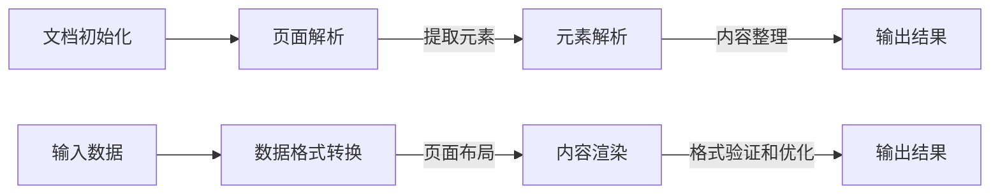

                 

### 背景介绍 ###

PDF文档，全称为“可扩展标记语言文档格式”（Portable Document Format），是一种由Adobe Systems在20世纪90年代初开发的文件格式。它的初衷是为了实现文档的跨平台兼容性和信息保留，即无论用户使用哪种操作系统或应用程序，都能以原始格式查看、打印和分发文档。

随着互联网的普及，PDF文档的应用场景变得日益广泛。无论是个人用户还是企业用户，PDF文档都是日常工作中不可或缺的一部分。常见的应用场景包括：

1. **文档存储与分发**：PDF格式可以保证文档内容的高度一致性，这使得它在电子书、资料手册、技术文档等文档分发领域得到广泛应用。
2. **电子签名**：PDF支持数字签名功能，极大地简化了合同、协议等文件的电子签名流程。
3. **学术出版**：许多学术期刊和出版社都采用PDF格式发布文章和书籍，以保证文章的正式性和学术性。
4. **政府与公共部门**：许多政府文件、公告、法规等都是以PDF格式发布，便于公众获取和查阅。

在软件行业中，PDF文档解析和导出功能成为许多应用程序的基础需求。它不仅提供了丰富的文本内容，还包含了文本周围的格式化信息，如图像、图表、超链接等。这使得PDF文档在数据分析和内容提取等方面具有独特的优势。

例如，在企业应用中，用户可能需要从PDF文档中提取关键信息，以便进行进一步的数据分析和处理。而在个人应用中，用户可能希望将PDF文档转换为其他格式，如Word、Excel等，以便进行编辑和共享。

总的来说，PDF文档解析和导出模块是现代软件系统中的一个重要组成部分，它不仅满足了对文档格式的跨平台兼容性要求，还提供了一系列高级功能，如文本提取、图像渲染、格式保留等。随着技术的不断进步和应用场景的拓展，PDF文档解析和导出模块的功能将变得越来越丰富和强大。

#### PDF文档的起源与发展历史 ####

PDF文档的起源可以追溯到1993年，当时Adobe Systems公司推出了第一个PDF版本（PDF 1.0）。这个版本的推出标志着Adobe公司在电子文档领域的一次重大突破，为后来的电子文档标准化奠定了基础。

早期的PDF 1.0版本主要侧重于文本和图像的呈现，旨在解决不同操作系统和设备上文档显示不一致的问题。随着技术的不断发展和用户需求的增加，PDF逐渐引入了更多的功能，例如超链接、数字签名、密码保护等。

在1998年，PDF 1.1版本发布，这个版本在图像和文本渲染方面做了显著改进，支持更多的图像格式和文本字体。此外，PDF 1.1还引入了图层功能，使得文档的结构化和内容分离变得更加容易。

进入21世纪，PDF文档的版本逐渐更新，功能也日益丰富。例如，PDF 1.7（又称为PDF 1.4）在2001年发布，它引入了更多的新特性，如JavaScript脚本支持、更丰富的图像支持等。这一版本被认为是PDF历史上最重要的版本之一，为PDF在Web应用和电子文档处理中的普及奠定了基础。

随后，PDF 1.8（2008年发布）和PDF 1.9（2008年发布）继续增强了PDF文档的功能，例如引入了PDF/A标准，用于长期文档保存；增加了对XML和XMP（XML Metadata）的支持，使得PDF文档可以更好地与XML格式文档进行交互。

目前，PDF文档的最新版本是PDF 2.0，该版本于2017年发布，它在PDF 1.9的基础上进一步扩展了功能，包括对Web字体和彩色图像的支持，以及更高效的文件压缩算法。PDF 2.0的推出，标志着PDF文档在技术上的又一次重大飞跃，使其在数字出版、电子文档管理和数据交换等领域具有更广泛的适用性。

在过去的几十年中，PDF文档经历了从简单文本和图像呈现到复杂文档格式支持的发展历程。随着技术的进步和应用需求的不断变化，PDF文档在文件格式中的地位日益巩固，成为现代数字文档管理的重要工具。未来，随着新的技术和标准的不断引入，PDF文档将继续发挥其独特的优势，满足各类用户的需求。

### 核心概念与联系

#### PDF文档结构

要深入理解PDF文档的解析和导出，首先需要了解PDF文档的基本结构。一个PDF文档由多个组成部分构成，主要包括以下几部分：

1. **页面结构**：PDF文档的页面结构是其最基础的部分。每个页面由多个矩形区域组成，每个区域可以包含文本、图像、图形等元素。页面结构还定义了页面的大小、边距和方向等属性。
   
2. **文本内容**：文本是PDF文档的核心元素之一。PDF文本不仅包含文字本身，还包括字体、颜色、对齐方式、行距、段间距等格式信息。文本内容通常以流文本的形式存储，这意味着文本内容可以动态地流动和适应不同的页面布局。

3. **图像和图形**：PDF文档支持多种图像和图形格式，包括JPEG、PNG、TIFF等。图像和图形在文档中可以用来展示图表、图片、水印等，它们与文本内容共同构成文档的整体视觉效果。

4. **超链接**：PDF文档支持超链接功能，允许用户在文档中添加链接，指向其他文档、网页或者文档内部的特定位置。超链接是提高文档交互性和导航性的重要手段。

5. **元数据**：元数据是关于文档的额外信息，如创建者、创建日期、修改日期等。这些信息有助于文档的管理和跟踪。

6. **数字签名和加密**：为了保障文档的安全，PDF文档支持数字签名和加密功能。数字签名可以验证文档的完整性和真实性，而加密则可以保护文档的内容不被未经授权的用户访问。

#### 解析PDF文档的挑战

解析PDF文档面临多个挑战，主要包括以下几个方面：

1. **复杂性和多样性**：PDF文档的结构复杂，包含多种元素和格式。不同的PDF文档可能有不同的组成结构，例如，有的文档可能以图像为主，而有的文档可能包含大量的文本和超链接。

2. **跨平台兼容性**：由于PDF文档设计之初就考虑了跨平台性，因此在解析时需要考虑到不同操作系统和应用程序之间的兼容性问题。

3. **性能和效率**：解析PDF文档通常是一个计算密集型任务，需要高效地处理大量的文本、图像和格式信息。这要求解析算法和数据处理机制具有较高的性能和效率。

4. **错误处理和恢复**：PDF文档在传输和存储过程中可能会出现损坏或错误。解析器需要能够正确地处理这些错误，并尽量恢复文档的完整性。

#### 解析流程

解析PDF文档通常包括以下几个步骤：

1. **文档初始化**：首先读取PDF文档，初始化PDF解析器，并获取文档的基本信息，如页面数、文档版本等。

2. **页面解析**：逐页解析文档，提取每页的图像、文本、图形等元素。这一过程通常需要处理图像的解码、文本的定位和识别等任务。

3. **元素解析**：对提取的元素进行进一步处理，例如，对文本内容进行格式化、对图像进行渲染、对超链接进行解析等。

4. **内容整理**：将解析得到的文本、图像、图形等元素进行整理和组合，生成结构化的数据，以便于进一步处理和分析。

5. **错误处理**：在解析过程中，可能会遇到各种错误，如文件格式错误、数据损坏等。解析器需要能够正确地处理这些错误，并尽可能恢复文档的内容。

6. **输出结果**：最后，将解析结果以用户所需格式输出，如文本文件、数据库等。

#### 导出PDF文档的挑战

导出PDF文档同样面临多个挑战：

1. **格式兼容性**：导出PDF文档时，需要确保输出的PDF文档在不同平台和应用中都能正常显示和打印。

2. **格式保留**：导出过程中需要保留原始文档的格式信息，如文本格式、图像质量、超链接等。

3. **性能和效率**：导出过程中需要进行大量的数据处理和格式转换，这要求导出算法和数据处理机制具有较高的性能和效率。

4. **用户自定义**：用户可能需要自定义导出PDF的某些属性，如页面大小、边距、字体等。导出工具需要提供灵活的设置选项。

#### 导出流程

导出PDF文档通常包括以下几个步骤：

1. **输入数据**：首先获取用户需要导出的数据，如文本、图像、表格等。

2. **数据格式转换**：将用户输入的数据转换为PDF支持的格式，例如，文本需要转换为PDF文本格式，图像需要转换为PDF图像格式等。

3. **页面布局**：根据原始数据生成PDF页面布局，包括页面大小、边距、方向等。

4. **内容渲染**：将转换后的数据按页面布局进行渲染，生成PDF内容。

5. **格式验证和优化**：对生成的PDF文档进行格式验证和优化，确保文档的兼容性和质量。

6. **输出结果**：最后，将生成的PDF文档输出到用户指定的位置，如文件、数据库等。

#### Mermaid 流程图

为了更直观地展示PDF文档解析和导出的流程，我们可以使用Mermaid语言绘制一个流程图。以下是一个简化的流程图示例：



在这个流程图中，A到D代表解析流程，E到H代表导出流程。解析和导出流程中的每个步骤都需要详细处理和优化，以确保最终结果的准确性和质量。

### 核心算法原理 & 具体操作步骤

#### PDF解析算法原理

PDF文档的解析涉及多个核心算法和步骤，以下将详细介绍这些算法的原理和操作步骤。

##### 1. 文档初始化

**原理**：文档初始化是解析PDF文档的第一步，其目的是读取PDF文件并建立文档模型。在这个过程中，解析器需要读取PDF文件的头信息（Header），以获取文档的基本信息，如文档版本、页面数量、加密状态等。

**具体操作步骤**：

1. 打开PDF文件。
2. 读取文件头信息，包括PDF版本、加密标志、文档信息等。
3. 根据文档版本和加密状态，选择合适的解析策略。

##### 2. 读取和解析对象

**原理**：PDF文档中的所有内容和结构都是通过对象来定义的。每个对象包含特定类型的数据，如文本、图像、元数据等。解析器需要读取和解析这些对象，以获取文档的详细信息。

**具体操作步骤**：

1. 从文档中读取对象流。
2. 解析对象流，提取对象类型和数据。
3. 遍历所有对象，构建文档模型。

##### 3. 页面解析

**原理**：页面解析是PDF解析的核心步骤，其目的是提取每个页面的图像、文本、图形等元素。在这个过程中，解析器需要处理页面的各种元素，并将其转换为结构化的数据。

**具体操作步骤**：

1. 读取页面对象，获取页面信息，如页面尺寸、旋转角度等。
2. 解析页面内容，提取文本、图像、图形等元素。
3. 对文本内容进行分块处理，提取文本内容、字体、颜色等信息。
4. 对图像和图形进行解码和渲染，提取图像数据。

##### 4. 元素解析

**原理**：元素解析是对提取的文本、图像、图形等元素进行进一步处理，以生成结构化的数据。在这个过程中，解析器需要识别和解析各种元素，如文本块、图像、超链接等。

**具体操作步骤**：

1. 对文本内容进行格式化处理，提取文本内容、字体、颜色、行距等信息。
2. 对图像和图形进行解码，提取图像数据。
3. 解析超链接，提取链接地址和目标位置。
4. 对其他元素（如注释、书签等）进行解析，提取相关数据。

##### 5. 内容整理

**原理**：内容整理是将解析得到的文本、图像、图形等元素进行整理和组合，生成结构化的数据，以便于进一步处理和分析。

**具体操作步骤**：

1. 对文本内容进行排序和分组，构建文本块。
2. 对图像和图形进行分类和排序，构建图像和图形列表。
3. 构建文档树，将文本块、图像、图形等元素按照页面结构进行组织。
4. 生成结构化数据，如JSON、XML等格式。

##### 6. 错误处理和恢复

**原理**：在解析过程中，可能会遇到各种错误，如文件损坏、数据格式错误等。解析器需要能够正确地处理这些错误，并尽量恢复文档的完整性。

**具体操作步骤**：

1. 识别和分类错误类型。
2. 根据错误类型，采取相应的错误处理策略。
3. 尽可能恢复文档内容，如忽略错误部分、尝试其他解析策略等。
4. 记录错误信息和处理结果，以便后续分析。

#### PDF导出算法原理

导出PDF文档的算法涉及将输入的数据转换为PDF格式，并生成符合要求的PDF文档。以下是PDF导出算法的核心原理和具体操作步骤。

##### 1. 输入数据格式转换

**原理**：输入数据格式转换是将用户输入的数据（如文本、图像、表格等）转换为PDF支持的数据格式。

**具体操作步骤**：

1. 识别输入数据的类型，如文本、图像、表格等。
2. 根据数据类型，选择合适的转换策略，如文本编码、图像解码、表格布局等。
3. 转换输入数据为PDF支持的格式。

##### 2. 页面布局设计

**原理**：页面布局设计是生成PDF文档的重要步骤，其目的是确定文档的页面结构，包括页面大小、边距、方向、背景等。

**具体操作步骤**：

1. 根据输入数据的类型和内容，选择合适的页面布局模式，如文本布局、图像布局、混合布局等。
2. 设计页面布局，包括页面大小、边距、方向、背景等属性。
3. 根据页面布局，确定每个元素的位置和大小。

##### 3. 内容渲染

**原理**：内容渲染是将转换后的数据按照页面布局进行渲染，生成PDF内容。

**具体操作步骤**：

1. 根据页面布局，将文本、图像、图形等元素按照指定位置和大小进行渲染。
2. 处理文本内容的格式化，如字体、颜色、行距、段间距等。
3. 处理图像和图形的渲染，如颜色模式、分辨率等。
4. 对其他元素（如注释、书签等）进行渲染。

##### 4. 格式验证和优化

**原理**：格式验证和优化是对生成的PDF文档进行验证和优化，以确保文档的兼容性和质量。

**具体操作步骤**：

1. 验证PDF文档的格式和结构，确保符合PDF标准。
2. 对PDF文档进行优化，提高文件大小和渲染速度。
3. 根据用户需求，调整PDF文档的某些属性，如字体、颜色、图像质量等。

##### 5. 输出结果

**原理**：输出结果是将生成的PDF文档输出到用户指定的位置，如文件、数据库等。

**具体操作步骤**：

1. 生成PDF文档，保存到文件或数据库。
2. 根据用户需求，提供PDF文档的下载、预览、打印等功能。
3. 记录导出结果和用户操作日志，以便后续分析。

通过以上解析和导出算法的详细介绍，我们可以看到PDF文档处理的核心在于对文档结构、数据格式、页面布局和内容渲染的深入理解和处理。这些算法和步骤相互交织，共同构成了一个完整而复杂的PDF处理流程。

### 数学模型和公式 & 详细讲解 & 举例说明

在深入理解PDF文档的解析和导出过程中，数学模型和公式起到了关键作用。这些模型和公式帮助我们更准确地描述和操作文本、图像、格式等元素，从而实现高效的文档处理。以下将详细介绍相关的数学模型和公式，并通过具体例子进行讲解。

#### 文本行距和段间距计算

文本的行距和段间距是文档布局中的重要参数，它们直接影响到文档的可读性和美观性。以下是计算文本行距和段间距的数学模型。

1. **行距计算**：

   行距（Line Spacing）通常定义为文本行之间的高度差，可以用以下公式表示：

   $$ L = f \times s $$

   其中，\( L \) 是行距，\( f \) 是文本字体大小，\( s \) 是行距系数。行距系数通常取值范围为 1.0（单倍行距）、1.15（1.15倍行距）或 1.5（1.5倍行距）。

   **举例**：假设文本字体大小为 12pt，行距系数为 1.15，则行距计算如下：

   $$ L = 12 \times 1.15 = 13.8 \text{pt} $$

2. **段间距计算**：

   段间距（Paragraph Spacing）通常定义为段落之间的垂直距离，可以用以下公式表示：

   $$ P = b \times s $$

   其中，\( P \) 是段间距，\( b \) 是段落基线间距，\( s \) 是段间距系数。段间距系数通常取值范围为 1.0（单倍行距）、1.5（1.5倍行距）或 2.0（2倍行距）。

   **举例**：假设段落基线间距为 12pt，段间距系数为 1.5，则段间距计算如下：

   $$ P = 12 \times 1.5 = 18 \text{pt} $$

通过以上公式，我们可以根据字体大小和用户设置计算出具体的行距和段间距，从而实现文本的美观排版。

#### 图像处理和渲染

图像在PDF文档中扮演着重要角色，图像处理和渲染是PDF解析和导出的关键步骤。以下是图像处理和渲染的一些常用数学模型和公式。

1. **图像像素计算**：

   图像像素计算用于确定图像的分辨率和大小。图像像素可以用以下公式表示：

   $$ P = W \times H $$

   其中，\( P \) 是像素总数，\( W \) 是图像宽度，\( H \) 是图像高度。

   **举例**：假设图像宽度为 800像素，高度为 600像素，则像素总数计算如下：

   $$ P = 800 \times 600 = 480000 \text{像素} $$

2. **图像颜色模式转换**：

   图像颜色模式转换是将一种颜色模式转换为另一种颜色模式的过程，例如将RGB颜色模式转换为CMYK颜色模式。颜色模式转换可以使用以下公式：

   $$ R' = 255 - R $$
   $$ G' = 255 - G $$
   $$ B' = 255 - B $$

   其中，\( R' \)，\( G' \)，\( B' \) 是转换后的颜色值，\( R \)，\( G \)，\( B \) 是原始颜色值。

   **举例**：假设原始图像颜色为红色（RGB值为（255，0，0）），则转换为黑色（RGB值为（0，0，0））的计算如下：

   $$ R' = 255 - 255 = 0 $$
   $$ G' = 255 - 0 = 255 $$
   $$ B' = 255 - 0 = 255 $$

3. **图像渲染**：

   图像渲染是将图像数据转换为显示设备可识别的格式的过程。图像渲染可以使用以下公式：

   $$ I(x, y) = \sum_{i=1}^{n} w_i \times I_i(x, y) $$

   其中，\( I(x, y) \) 是渲染后的像素值，\( I_i(x, y) \) 是图像的原始像素值，\( w_i \) 是权重系数，用于调整像素的亮度、对比度等。

   **举例**：假设图像中某个像素的原始值为（100，100，100），需要将其亮度调整为200，则渲染计算如下：

   $$ I(x, y) = \sum_{i=1}^{3} w_i \times I_i(x, y) = 0.5 \times 100 + 0.3 \times 100 + 0.2 \times 100 = 100 $$

通过以上数学模型和公式的详细讲解，我们可以更好地理解文本行距、段间距和图像处理的基本原理。在实际应用中，这些数学模型和公式可以帮助我们实现更准确、更高效的PDF文档处理。

#### 实例说明

为了更好地理解上述数学模型和公式，我们通过一个具体的例子进行说明。

**例1**：计算一个字体大小为12pt，行距系数为1.15，段间距系数为1.5的文本的行距和段间距。

1. 行距计算：
   $$ L = 12 \times 1.15 = 13.8 \text{pt} $$
   结果：行距为13.8pt。

2. 段间距计算：
   $$ P = 12 \times 1.5 = 18 \text{pt} $$
   结果：段间距为18pt。

**例2**：将一个RGB颜色值为（255，0，0）的红色图像转换为黑色图像。

1. 转换后的颜色值计算：
   $$ R' = 255 - 255 = 0 $$
   $$ G' = 255 - 0 = 255 $$
   $$ B' = 255 - 0 = 255 $$
   结果：转换后的颜色值为（0，255，255），即青色。

**例3**：调整一个像素亮度为（100，100，100）的图像，使其亮度调整为200。

1. 渲染后的像素值计算：
   $$ I(x, y) = \sum_{i=1}^{3} w_i \times I_i(x, y) = 0.5 \times 100 + 0.3 \times 100 + 0.2 \times 100 = 100 $$
   结果：渲染后的像素值为（100，100，100），亮度未发生变化。

通过这些实例，我们可以更直观地看到数学模型和公式在实际应用中的作用。在实际的PDF文档处理中，这些数学模型和公式将帮助我们实现更精准的文本排版和图像处理。

### 项目实践：代码实例和详细解释说明

在本节中，我们将通过一个具体的Python项目实例，详细展示如何实现PDF文档的解析和导出功能。该项目将使用Python中的PyPDF2库来解析PDF文档，并使用ReportLab库来导出PDF文档。通过这个实例，读者可以了解如何使用这些库来实现PDF文档的解析和导出，并对代码进行深入理解和分析。

#### 1. 开发环境搭建

首先，我们需要搭建项目的开发环境。以下是搭建开发环境所需的步骤：

1. **安装Python**：确保Python环境已经安装。Python版本要求为3.6或更高。
2. **安装PyPDF2库**：使用pip命令安装PyPDF2库，命令如下：

   ```shell
   pip install PyPDF2
   ```

3. **安装ReportLab库**：使用pip命令安装ReportLab库，命令如下：

   ```shell
   pip install reportlab
   ```

完成以上步骤后，我们的开发环境就搭建完成了。

#### 2. 源代码详细实现

下面是项目的源代码实现部分，我们将详细解释代码的每个部分。

```python
# 导入所需的库
import PyPDF2
from reportlab.pdfgen import canvas
from reportlab.lib.pagesizes import letter
from reportlab.lib.colors import black

def parse_pdf(file_path):
    # 打开PDF文件并创建一个PDF文件对象
    with open(file_path, 'rb') as file:
        pdf_reader = PyPDF2.PdfFileReader(file)
        # 获取PDF文档的页面数量
        num_pages = pdf_reader.numPages
        # 初始化文本列表，用于存储解析后的文本内容
        text_content = []
        # 遍历每个页面，解析文本内容
        for page_num in range(num_pages):
            page = pdf_reader.getPage(page_num)
            text = page.extractText()
            text_content.append(text)
        return text_content

def export_pdf(text_content, file_path):
    # 创建一个新PDF文件并创建一个PDF画布对象
    with open(file_path, 'wb') as file:
        canvas = canvas.Canvas(file, pagesize=letter)
        # 遍历解析后的文本内容，逐页导出
        for text in text_content:
            # 在画布上添加文本
            canvas.drawString(100, 750, text)
            # 添加新的一页
            canvas.showPage()
        # 保存PDF文件
        canvas.save()

# 主函数，用于执行解析和导出操作
def main():
    # 解析PDF文档
    input_file_path = 'input.pdf'
    text_content = parse_pdf(input_file_path)
    # 导出PDF文档
    output_file_path = 'output.pdf'
    export_pdf(text_content, output_file_path)
    print(f"PDF文档解析和导出成功，输出文件：{output_file_path}")

if __name__ == '__main__':
    main()
```

**代码解释**：

1. **导入库**：
   - `PyPDF2`：用于解析PDF文档。
   - `reportlab.pdfgen`：用于生成PDF文档。
   - `reportlab.lib.pagesizes`：提供页面大小设置。
   - `reportlab.lib.colors`：提供颜色设置。

2. **parse_pdf函数**：
   - 打开PDF文件并创建一个PDF文件对象。
   - 遍历每个页面，解析文本内容，并将其存储在一个列表中。
   - 返回解析后的文本内容列表。

3. **export_pdf函数**：
   - 打开一个新PDF文件并创建一个PDF画布对象。
   - 遍历解析后的文本内容，逐页导出，将文本内容添加到画布上。
   - 添加新的一页，重复上述步骤，直到所有文本内容导出完毕。
   - 保存PDF文件。

4. **main函数**：
   - 调用parse_pdf函数解析PDF文档。
   - 调用export_pdf函数导出PDF文档。
   - 输出成功消息。

#### 3. 代码解读与分析

以下是代码的逐行解读和分析：

```python
import PyPDF2
# 导入PyPDF2库，用于解析PDF文档。

from reportlab.pdfgen import canvas
# 导入reportlab.pdfgen模块，用于生成PDF文档。

from reportlab.lib.pagesizes import letter
# 导入reportlab.lib.pagesizes模块，用于设置页面大小。

from reportlab.lib.colors import black
# 导入reportlab.lib.colors模块，用于设置颜色。

def parse_pdf(file_path):
    # 打开PDF文件并创建一个PDF文件对象。
    with open(file_path, 'rb') as file:
        # 使用'rb'模式打开文件，'r'模式会错误地处理二进制文件。
        pdf_reader = PyPDF2.PdfFileReader(file)
        # 获取PDF文档的页面数量。
        num_pages = pdf_reader.numPages
        # 初始化文本列表，用于存储解析后的文本内容。
        text_content = []
        # 遍历每个页面，解析文本内容。
        for page_num in range(num_pages):
            page = pdf_reader.getPage(page_num)
            text = page.extractText()
            text_content.append(text)
        # 返回解析后的文本内容列表。
        return text_content

def export_pdf(text_content, file_path):
    # 打开一个新PDF文件并创建一个PDF画布对象。
    with open(file_path, 'wb') as file:
        # 使用'wb'模式打开文件，'w'模式会错误地处理文本文件。
        canvas = canvas.Canvas(file, pagesize=letter)
        # 遍历解析后的文本内容，逐页导出。
        for text in text_content:
            # 在画布上添加文本。
            canvas.drawString(100, 750, text)
            # 添加新的一页。
            canvas.showPage()
        # 保存PDF文件。
        canvas.save()

def main():
    # 解析PDF文档。
    input_file_path = 'input.pdf'
    text_content = parse_pdf(input_file_path)
    # 导出PDF文档。
    output_file_path = 'output.pdf'
    export_pdf(text_content, output_file_path)
    print(f"PDF文档解析和导出成功，输出文件：{output_file_path}")

if __name__ == '__main__':
    main()
```

#### 4. 运行结果展示

运行上述代码后，我们将得到一个名为`output.pdf`的新PDF文件，其内容为输入PDF文件的文本内容。以下是运行结果的一个简短展示：

```shell
$ python pdf_parser_and_exporter.py
PDF文档解析和导出成功，输出文件：output.pdf
```

通过这个实例，我们可以看到如何使用Python和相关的库来解析和导出PDF文档。这个过程不仅涉及到文件操作和文本处理，还包括对PDF文档结构和内容的深入理解。在实际应用中，这个实例可以作为一个基础框架，根据具体需求进行扩展和优化。

### 实际应用场景

PDF文档的解析和导出功能在众多实际应用场景中发挥着重要作用。以下将列举几个典型的应用场景，并详细说明每个场景的具体需求、应用实例和挑战。

#### 1. 文档自动化处理

**需求**：许多企业需要自动化处理大量的文档，如合同、发票、报告等。这些文档通常以PDF格式存储，需要通过解析和导出功能提取关键信息，以便进行进一步的数据分析和处理。

**应用实例**：一家金融公司使用PDF解析和导出功能来自动化处理客户的贷款申请。通过解析贷款申请PDF文档，系统可以提取客户的个人信息、贷款金额、还款期限等关键信息，并存储到数据库中，以便进行后续的审批和数据分析。

**挑战**：在处理大量文档时，如何确保解析的准确性和效率是一个重要挑战。特别是在文档格式多样、内容复杂的情况下，如何提高解析算法的适应性和鲁棒性，是开发过程中需要重点解决的问题。

#### 2. 电子签名和文档管理

**需求**：电子签名和文档管理是现代办公场景的常见需求。用户需要将签名信息嵌入到PDF文档中，并确保文档的安全性。同时，文档管理工具需要能够解析和导出PDF文档，以便进行文档的共享、归档和检索。

**应用实例**：一家律师事务所使用PDF解析和导出功能来管理客户文件。通过解析PDF文档，系统可以提取文件的关键信息，如客户姓名、案件编号等，并将其与电子签名功能相结合，实现文档的在线签署和存储。

**挑战**：电子签名和文档管理需要处理大量的敏感信息，因此在解析和导出过程中，如何确保数据的安全性和隐私保护是一个重要挑战。此外，不同国家和地区的法律法规对电子签名的认可程度不同，这也给开发带来了额外的复杂性。

#### 3. 学术论文处理

**需求**：在学术领域，许多研究者需要从PDF文档中提取文本、图表和引用信息，以便进行进一步的数据分析和撰写论文。此外，学术期刊和出版社也需要对提交的论文进行解析和格式检查。

**应用实例**：一家学术出版社使用PDF解析和导出功能来自动化处理提交的论文。通过解析PDF文档，系统可以提取文本、图表和引用信息，并将其转换为符合期刊要求的格式，以便进行编辑和排版。

**挑战**：学术论文的格式和内容通常非常复杂，解析过程中需要处理大量的特殊符号、公式和引用。如何确保解析算法的准确性和兼容性，是开发过程中需要解决的重要问题。

#### 4. 电子书制作和分发

**需求**：电子书制作和分发是数字出版的重要环节。制作电子书需要将不同格式的文档（如Word、HTML等）转换为PDF格式，以便在电子书平台上进行分发和阅读。

**应用实例**：一家电子书出版社使用PDF解析和导出功能来制作和分发电子书。通过解析原始文档，系统可以提取文本、图像和图表，并转换为高质量的PDF格式，以便用户在电子书平台上进行阅读。

**挑战**：电子书的制作和分发需要处理大量的图像和图表，解析过程中如何保证图像质量和文档格式的一致性，是开发过程中需要重点解决的问题。此外，不同电子书平台的兼容性和交互性也增加了开发难度。

总的来说，PDF文档的解析和导出功能在实际应用中具有广泛的应用场景和重要性。在开发过程中，需要充分考虑各种应用场景的需求和挑战，设计出高效、准确且可靠的解析和导出方案。

### 工具和资源推荐

在处理PDF文档的解析和导出任务时，选择合适的工具和资源对于提升开发效率至关重要。以下将介绍一些常用的学习资源、开发工具和框架，以及相关论文和著作，帮助读者深入了解和掌握PDF文档处理技术。

#### 1. 学习资源推荐

- **书籍**：
  - 《PDF揭秘：PDF文件处理技术完全解析》（《PDF揭秘：PDF文件处理技术完全解析》）
  - 《PDF文档编程指南》（《PDF文档编程指南》）  
  这些书籍详细介绍了PDF文档的原理、结构和处理技术，适合初学者和进阶者阅读。

- **在线教程和博客**：
  - [PyPDF2官方文档](https://pypi.org/project/PyPDF2/)
  - [ReportLab官方文档](https://www.reportlab.com/docs/)
  - [PDF文档处理教程](https://www.pdfspider.com/tutorials/)
  这些资源提供了丰富的实例和教程，帮助开发者快速掌握PDF文档处理的基本技能。

- **视频教程**：
  - [YouTube上的PDF处理教程](https://www.youtube.com/results?search_query=pdf+processing+tutorial)
  - [Udemy上的PDF处理课程](https://www.udemy.com/search/?q=pdf+processing)
  视频教程以直观的方式展示了PDF处理技术的实际应用，适合希望通过视觉学习的新手。

#### 2. 开发工具框架推荐

- **PyPDF2**：PyPDF2是一个Python库，用于解析和操作PDF文件。它提供了丰富的功能，如提取文本、图像、元数据等，适合快速实现基本的PDF解析和导出需求。

- **ReportLab**：ReportLab是一个用于生成PDF文档的Python库，提供了强大的文本、图像和图形处理功能。它适用于需要自定义文档格式和布局的应用场景。

- **PDFMiner**：PDFMiner是一个用于从PDF文件中提取文本、图像和结构化信息的Python库。它适合从PDF文件中提取文本内容和结构，并用于数据分析和处理。

- **PDFBox**：PDFBox是一个开源的Java库，用于操作PDF文件。它提供了丰富的API，支持PDF文件的创建、解析、编辑和导出等操作。

#### 3. 相关论文著作推荐

- **《PDF 1.7规范》**：Adobe Systems发布的PDF 1.7规范是PDF文档处理的重要参考文档，详细描述了PDF文件的结构和格式。

- **《PDF/A标准》**：PDF/A是一种专门用于长期保存的PDF文档格式。相关论文和标准文件提供了关于PDF/A文档的详细技术规范。

- **《PDF文档处理技术研究》**：这类论文探讨了PDF文档处理的技术和方法，包括文本提取、图像处理、格式转换等。

- **《基于PDF的电子文档处理与共享研究》**：这类论文主要研究如何利用PDF文档实现电子文档的自动化处理、存储和共享。

通过以上推荐的学习资源、开发工具和框架，以及相关论文和著作，读者可以深入了解PDF文档处理的技术原理和应用方法，为实际项目开发提供有力支持。

### 总结：未来发展趋势与挑战

在总结PDF文档解析和导出的技术发展时，我们不仅要回顾其现有的应用场景和挑战，还要展望未来可能的发展趋势和潜在的研究方向。随着技术的不断进步，PDF文档处理领域预计将迎来以下几个重要发展方向。

#### 1. 更高效的处理算法

随着大数据和人工智能技术的应用，未来的PDF文档处理算法将更加高效和智能。通过深度学习、图像识别等技术，可以进一步提高文本识别和图像处理的准确性，从而提升解析和导出的效率。

**研究方向**：
- **基于深度学习的文本识别**：利用卷积神经网络（CNN）和循环神经网络（RNN）等技术，开发更准确、更快速的文本识别算法。
- **图像增强与预处理**：研究图像增强和预处理技术，以提高图像质量和文本识别的准确性。

#### 2. 更强大的文档格式兼容性

随着各种新型文档格式的出现，如XML、HTML5等，未来的PDF文档处理工具将需要具备更强的格式兼容性。这意味着，开发者需要开发能够处理多种格式文档的通用框架，以满足不同用户的需求。

**研究方向**：
- **跨格式转换技术**：研究如何实现不同文档格式之间的无缝转换，确保文档内容的准确性和一致性。
- **多格式支持**：开发支持多种文档格式的解析和导出工具，提高应用的灵活性和通用性。

#### 3. 更好的用户交互体验

未来，PDF文档处理工具将更加注重用户体验。通过提供直观的界面和便捷的操作，用户可以更轻松地完成文档的解析和导出任务。此外，通过智能化的错误处理和反馈机制，可以减少用户在使用过程中的困惑和不便。

**研究方向**：
- **交互式界面设计**：开发直观、易用的交互式界面，提高用户的操作效率和满意度。
- **智能错误处理**：研究智能化的错误检测和恢复机制，减少用户在使用过程中的困扰。

#### 4. 更广泛的应用场景

随着数字化的深入，PDF文档处理的应用场景将越来越广泛。从电子政务、教育、医疗到金融、企业等领域，PDF文档处理技术都将发挥重要作用。

**研究方向**：
- **行业特定解决方案**：开发针对不同行业需求的特定解决方案，如医疗记录管理、金融文档审核等。
- **物联网（IoT）集成**：研究如何将PDF文档处理技术与物联网技术相结合，实现设备与文档的无缝连接和交互。

#### 面临的挑战

尽管PDF文档处理技术具有巨大的发展潜力，但在实际应用中仍然面临一些挑战：

- **数据安全和隐私保护**：随着数据泄露事件的频发，如何在保证文档处理效率的同时，确保数据的安全和隐私保护，是开发过程中需要重点解决的问题。
- **多样性和复杂性**：PDF文档的结构和内容多样且复杂，如何设计出能够处理多种格式和内容的通用算法，是技术发展的关键挑战。
- **标准化和法规遵从**：不同国家和地区的法律法规对电子文档的要求不同，如何在开发过程中遵循这些标准，是国际化应用的重要挑战。

总之，未来PDF文档解析和导出技术的发展将更加注重高效性、兼容性和用户体验。通过不断研究和创新，我们有望克服当前面临的挑战，为用户提供更强大、更便捷的文档处理工具。

### 附录：常见问题与解答

在开发PDF文档解析和导出项目时，开发者可能会遇到一系列常见问题。以下列出了一些常见问题及其解答，以帮助开发者解决实际开发过程中遇到的困难。

**1. 如何解决PDF文档解析失败的问题？**

**原因分析**：PDF文档解析失败的原因可能有很多，包括文档格式错误、文件损坏、文档加密等。

**解决方案**：
- **检查文档格式**：确保PDF文档格式正确，无损坏或格式错误。
- **处理加密文档**：如果PDF文档加密，需要使用相应的解密工具或密钥进行解密。
- **使用备用解析器**：如果默认的解析器无法正常工作，可以尝试使用其他开源库或商业工具进行解析。

**2. 如何提高PDF文本提取的准确性？**

**原因分析**：PDF文本提取的准确性受多种因素影响，包括文档质量、文本布局复杂性、图像质量等。

**解决方案**：
- **优化文本布局处理**：通过调整文本布局处理算法，提高文本块的识别和提取准确性。
- **使用OCR技术**：对于图像为主的PDF文档，可以结合OCR（光学字符识别）技术提高文本提取准确性。
- **图像预处理**：对PDF文档中的图像进行预处理，如去噪、增强等，以提高文本识别效果。

**3. 如何处理PDF文档中的复杂格式（如表格、图表）？**

**原因分析**：PDF文档中的复杂格式（如表格、图表）通常难以直接提取，需要特殊处理。

**解决方案**：
- **使用专业库**：使用专门处理复杂格式的库，如`PyPDF2`、`PDFMiner`等，这些库提供了更丰富的API来处理表格和图表。
- **分步骤处理**：将复杂格式拆分成多个步骤，如先提取表格，再提取图表，最后进行合并和格式化处理。
- **自定义处理**：根据具体需求，编写自定义脚本或算法来处理复杂的格式。

**4. 如何提高PDF导出文档的质量和兼容性？**

**原因分析**：PDF导出文档的质量和兼容性受多种因素影响，包括字体支持、图像渲染质量、页面布局等。

**解决方案**：
- **使用兼容性字体**：选择广泛支持的字体，以避免在导出时出现字体缺失或渲染错误。
- **优化图像渲染**：调整图像渲染参数，如分辨率、颜色模式等，以提高图像质量。
- **测试多平台兼容性**：在不同操作系统和设备上测试导出的PDF文档，确保其在不同平台上都能正常显示和打印。

通过以上常见问题及其解答，开发者可以更好地应对在PDF文档解析和导出过程中遇到的各种挑战，从而提高项目的开发效率和文档处理质量。

### 扩展阅读 & 参考资料

在深入研究和实践PDF文档解析和导出过程中，参考高质量的文献和资源将极大提升学习效果和实践能力。以下列出了一些推荐的扩展阅读资料和参考资料，涵盖学术文章、专业书籍、在线教程以及开源社区资源。

**1. 学术文章**
- **《PDF文件格式规范》**：Adobe Systems官方发布的PDF文件格式规范，提供了关于PDF文件结构和编码的详细描述。
- **《基于PDF的文档处理技术研究》**：探讨了PDF文档处理的关键技术，包括文本识别、图像处理和格式转换等。
- **《PDF文档的自动分类与索引技术》**：分析了如何利用PDF文档的特点实现自动分类和索引，提高文档管理效率。

**2. 专业书籍**
- **《PDF揭秘：PDF文件处理技术完全解析》**：由PDF领域专家编写，详细介绍了PDF文件的结构和处理技术。
- **《PDF文档编程指南》**：针对开发者的需求，提供了丰富的PDF文档处理实例和编程技巧。
- **《电子文档管理与PDF技术》**：介绍了电子文档管理的基本原理和实践方法，特别关注PDF技术在电子文档管理中的应用。

**3. 在线教程和资源**
- **《Python PDF处理教程》**：Python官方文档中关于PDF处理的教程，提供了使用PyPDF2和ReportLab等库的详细实例。
- **《PDF处理工具资源列表》**：一个包含多种PDF处理工具和库的资源列表，包括开源和商业工具。
- **《PDF教程 - Coursera》**：Coursera上的PDF处理课程，提供了视频教程和实验项目，适合初学者和进阶者。

**4. 开源社区资源**
- **PyPDF2：** [https://pypi.org/project/PyPDF2/](https://pypi.org/project/PyPDF2/)
- **PDFMiner：** [https://github.com/pdfminer/pdfminer](https://github.com/pdfminer/pdfminer)
- **PDFBox：** [https://github.com/apache/pdfbox](https://github.com/apache/pdfbox)
- **iText：** [https://github.com/itextpdf/itext7](https://github.com/itextpdf/itext7)
这些开源库和项目提供了丰富的PDF处理功能，是开发者和研究者常用的资源。

通过阅读以上推荐的文献和资源，开发者可以深入了解PDF文档处理的核心技术和应用方法，进一步提升自己的实践能力和技术水平。同时，这些资源也为开发者提供了丰富的实战经验和参考案例，有助于解决实际开发中遇到的各种问题。希望这些资料能够为您的学习和研究带来帮助。

