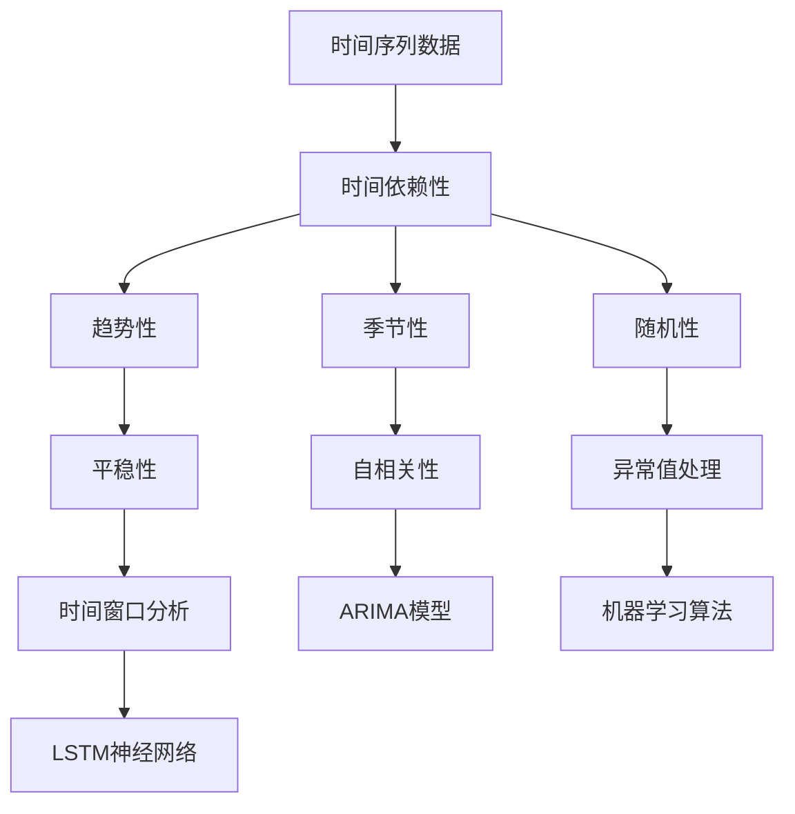
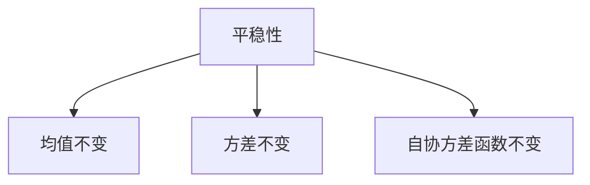
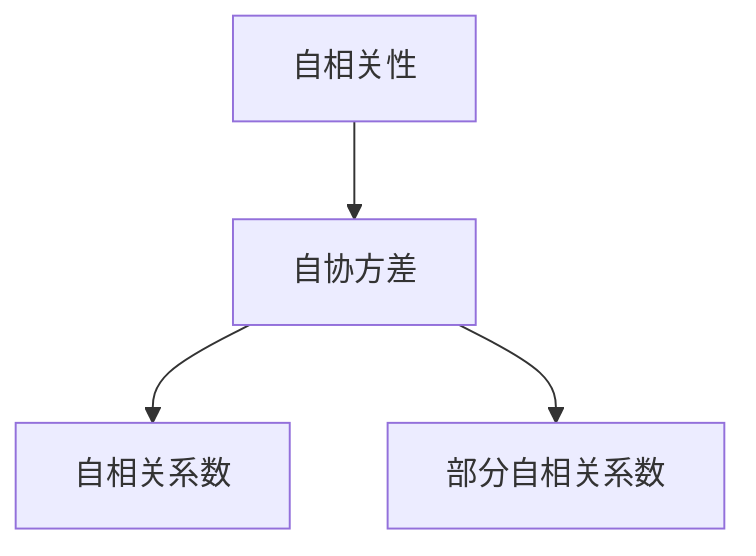
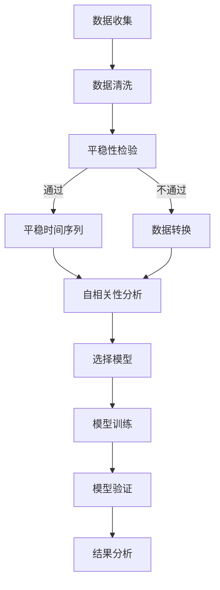

                 

### 1. 背景介绍

机器学习作为一种人工智能的核心技术，在数据分析和处理领域发挥着日益重要的作用。而时间序列分析作为机器学习中的一个重要分支，旨在通过对时间序列数据的建模和分析，挖掘数据中的规律和趋势，从而为预测未来行为提供科学依据。随着大数据时代的到来，时间序列分析在金融预测、气象预报、交通流量分析、医疗诊断等多个领域展现出了巨大的应用潜力。

Python作为一种功能强大且易学的编程语言，广泛应用于机器学习领域。其丰富的数据科学库，如NumPy、Pandas、Scikit-learn等，为机器学习算法的实现提供了便利。Python机器学习实战的实践性使得研究人员和开发者能够快速上手并应用于实际项目中。

《Python机器学习实战：使用机器学习进行时间序列分析》旨在为读者提供一套系统、实用的方法和技巧，通过实际案例展示如何利用Python进行时间序列分析。本书覆盖了从基本的时间序列数据处理方法到复杂的机器学习算法，包括ARIMA模型、LSTM神经网络、时间卷积神经网络（TCN）等，旨在帮助读者深入理解时间序列分析的核心概念和实际应用。

时间序列分析的重要性不言而喻。它不仅能够帮助我们预测未来的趋势，还能揭示数据中的周期性、趋势性等特征。在金融领域，通过对股票价格的时间序列分析，投资者可以做出更加明智的投资决策。在气象预报中，时间序列分析能够提供更准确的天气预测，减少自然灾害带来的损失。在交通管理中，通过对交通流量时间序列的分析，交通部门可以优化交通信号灯，提高交通效率。

因此，掌握时间序列分析的方法和技巧对于任何数据科学家或机器学习工程师来说都是至关重要的。本书将通过详细的实例和代码讲解，帮助读者从基础到高级逐步掌握这一技能。

### 2. 核心概念与联系

为了深入理解时间序列分析，我们需要首先掌握几个核心概念，包括时间序列数据、平稳性、自相关性等，并通过Mermaid流程图展示这些概念之间的联系。

#### 2.1 时间序列数据

时间序列数据是一种按照时间顺序排列的数据集合。每个数据点表示在特定时间点的测量值。例如，股票价格、气温记录、网站访问量等都可以被视为时间序列数据。时间序列数据具有时间依赖性，即当前值受过去值的影响。



#### 2.2 平稳性

平稳性是指时间序列数据在整个时间段内具有不变的性质，即其统计特性（如均值、方差等）不随时间变化。平稳时间序列更容易进行建模和分析。



#### 2.3 自相关性

自相关性是指时间序列中当前值与过去值之间的关系。自相关性分析可以帮助我们识别数据中的趋势性和周期性。



#### 2.4 联系与流程图

通过上述核心概念，我们可以构建一个Mermaid流程图，展示它们之间的联系和数据分析的流程。



在这个流程中，我们从数据收集开始，进行数据清洗和处理，然后进行平稳性检验。如果时间序列数据是平稳的，我们接着进行自相关性分析以选择合适的模型。否则，我们进行数据转换以使其平稳。接下来，我们训练模型、验证模型并最终分析结果。

### 3. 核心算法原理 & 具体操作步骤

在了解了时间序列分析的核心概念后，我们需要掌握一些核心算法，这些算法能够帮助我们有效地对时间序列数据进行建模和分析。本文将介绍ARIMA模型、LSTM神经网络和TCN等常见的时间序列算法，并详细讲解其原理和操作步骤。

#### 3.1 ARIMA模型

ARIMA（AutoRegressive Integrated Moving Average）模型是一种常用的线性时间序列建模方法，它由自回归（AR）、差分（I）和移动平均（MA）三部分组成。

**原理：**

- **自回归（AR）部分：** 自回归模型通过前期的观测值来预测当前值，即 \( y_t = c + \phi_1y_{t-1} + \phi_2y_{t-2} + ... + \phi_ky_{t-k} + \varepsilon_t \)。
- **差分（I）部分：** 差分操作用于使时间序列变得平稳，即 \( y_t = (1 - B)y_{t-1} \)。
- **移动平均（MA）部分：** 移动平均模型通过前期的误差值来预测当前值，即 \( y_t = \theta_1\epsilon_{t-1} + \theta_2\epsilon_{t-2} + ... + \theta_k\epsilon_{t-k} + \varepsilon_t \)。

**操作步骤：**

1. **数据预处理：** 对时间序列数据进行平稳性检验，通常使用ADF检验（Augmented Dickey-Fuller Test）。
2. **确定ARIMA模型参数：** 通过最大似然估计或网格搜索等方法确定AR、I和MA的参数。
3. **模型训练：** 使用训练数据对ARIMA模型进行训练。
4. **模型验证：** 使用验证数据对模型进行验证，调整参数以获得最佳效果。
5. **预测：** 使用训练好的模型对新的时间序列数据进行预测。

#### 3.2 LSTM神经网络

LSTM（Long Short-Term Memory）神经网络是一种特殊类型的递归神经网络（RNN），能够学习长期依赖关系，是处理时间序列数据的强大工具。

**原理：**

- **细胞状态（Cell State）：** LSTM的核心是细胞状态，它沿着时间轴流动，传递信息。
- **门机制（Gates）：** LSTM包括输入门、遗忘门和输出门，这些门可以控制信息流入、流出细胞状态。

**操作步骤：**

1. **数据预处理：** 对时间序列数据进行归一化处理，准备用于训练的数据集。
2. **模型构建：** 使用TensorFlow或PyTorch等深度学习框架构建LSTM模型。
3. **模型训练：** 使用训练数据对LSTM模型进行训练，调整学习率、隐藏层大小等超参数。
4. **模型验证：** 使用验证数据对模型进行验证，调整超参数以获得最佳效果。
5. **预测：** 使用训练好的LSTM模型对新时间序列数据进行预测。

#### 3.3 TCN

TCN（Temporal Convolutional Network）是一种用于处理时间序列数据的卷积神经网络，具有灵活的架构和强大的表达能力。

**原理：**

- **卷积层：** TCN使用多层次的卷积层来捕捉时间序列数据中的局部特征。
- **跳跃连接（Skip Connection）：** 跳跃连接使得TCN能够学习长距离依赖关系。

**操作步骤：**

1. **数据预处理：** 对时间序列数据进行归一化处理，准备用于训练的数据集。
2. **模型构建：** 使用TensorFlow或PyTorch等深度学习框架构建TCN模型。
3. **模型训练：** 使用训练数据对TCN模型进行训练，调整学习率、卷积层大小等超参数。
4. **模型验证：** 使用验证数据对模型进行验证，调整超参数以获得最佳效果。
5. **预测：** 使用训练好的TCN模型对新时间序列数据进行预测。

### 4. 数学模型和公式 & 详细讲解 & 举例说明

在时间序列分析中，数学模型和公式是理解算法原理和进行有效建模的关键。本节我们将详细讲解ARIMA模型、LSTM神经网络和TCN中的数学模型和公式，并通过具体示例来帮助读者更好地理解。

#### 4.1 ARIMA模型

ARIMA模型由三个部分组成：自回归（AR）、差分（I）和移动平均（MA）。以下是这三个部分的数学公式：

**自回归（AR）：**

\[ y_t = c + \phi_1y_{t-1} + \phi_2y_{t-2} + ... + \phi_ky_{t-k} + \varepsilon_t \]

其中，\( \phi_1, \phi_2, ..., \phi_k \) 是自回归系数，\( c \) 是常数项，\( \varepsilon_t \) 是误差项。

**差分（I）：**

\[ y_t = (1 - B)y_{t-1} \]

其中，\( B \) 是滞后算子，即 \( B^k y_t = y_{t-k} \)。

**移动平均（MA）：**

\[ y_t = \theta_1\epsilon_{t-1} + \theta_2\epsilon_{t-2} + ... + \theta_k\epsilon_{t-k} + \varepsilon_t \]

其中，\( \theta_1, \theta_2, ..., \theta_k \) 是移动平均系数，\( \epsilon_t \) 是误差项。

**ARIMA模型：**

综合以上三部分，ARIMA模型的数学公式为：

\[ y_t = c + \phi_1y_{t-1} + \phi_2y_{t-2} + ... + \phi_ky_{t-k} + (1 - B)y_{t-1} + \theta_1\epsilon_{t-1} + \theta_2\epsilon_{t-2} + ... + \theta_k\epsilon_{t-k} + \varepsilon_t \]

**示例：**

假设我们有如下时间序列数据：

\[ y = [10, 12, 9, 8, 11, 14, 15, 13, 12, 10] \]

我们需要对其建模并预测下一个值。

1. **数据预处理：** 对数据进行差分，使其平稳。
2. **确定模型参数：** 使用最大似然估计或网格搜索确定AR、I和MA的参数。
3. **模型训练：** 使用训练数据对ARIMA模型进行训练。
4. **模型验证：** 使用验证数据对模型进行验证，调整参数。
5. **预测：** 使用训练好的模型预测下一个值。

假设我们确定参数为：

\[ \phi = [0.6, 0.3], \theta = [0.7, 0.2], c = 5 \]

代入公式：

\[ y_t = 5 + 0.6y_{t-1} + 0.3y_{t-2} + 0.7\epsilon_{t-1} + 0.2\epsilon_{t-2} + \varepsilon_t \]

预测下一个值：

\[ y_{11} = 5 + 0.6 \cdot 10 + 0.3 \cdot 9 + 0.7 \cdot \epsilon_{10} + 0.2 \cdot \epsilon_{9} + \epsilon_{11} \]

#### 4.2 LSTM神经网络

LSTM神经网络是一种特殊的递归神经网络（RNN），能够学习长期依赖关系。其核心部分包括细胞状态、输入门、遗忘门和输出门。

**细胞状态（Cell State）：**

\[ C_t = f_t \odot C_{t-1} + i_t \odot \text{new\_gate} \]

其中，\( f_t \) 是遗忘门，\( i_t \) 是输入门，\( \text{new\_gate} \) 是新的细胞状态。

**输入门（Input Gate）：**

\[ i_t = \sigma(W_i \cdot [h_{t-1}, x_t] + b_i) \]

其中，\( W_i \) 是输入权重，\( b_i \) 是偏置项，\( \sigma \) 是sigmoid激活函数。

**遗忘门（Forget Gate）：**

\[ f_t = \sigma(W_f \cdot [h_{t-1}, x_t] + b_f) \]

其中，\( W_f \) 是遗忘权重，\( b_f \) 是偏置项。

**输出门（Output Gate）：**

\[ o_t = \sigma(W_o \cdot [h_{t-1}, x_t] + b_o) \]

其中，\( W_o \) 是输出权重，\( b_o \) 是偏置项。

**细胞状态更新：**

\[ \text{new\_gate} = \tanh(W_c \cdot [h_{t-1}, x_t] + b_c) \]

**预测值：**

\[ h_t = o_t \odot \tanh(C_t) \]

**示例：**

假设我们有如下时间序列数据：

\[ x = [1, 2, 3, 4, 5] \]

我们需要对其建模并预测下一个值。

1. **数据预处理：** 对数据进行归一化处理。
2. **模型构建：** 使用TensorFlow或PyTorch等深度学习框架构建LSTM模型。
3. **模型训练：** 使用训练数据对LSTM模型进行训练，调整学习率、隐藏层大小等超参数。
4. **模型验证：** 使用验证数据对模型进行验证，调整超参数。
5. **预测：** 使用训练好的模型预测下一个值。

假设我们构建的LSTM模型如下：

\[ \text{LSTM}(\text{Input Shape}=(10,), \text{Hidden Units}=128, \text{Output Shape}=(1,)) \]

输入数据：

\[ [1, 2, 3, 4, 5] \]

预测下一个值：

\[ h_6 = \sigma(W_o \cdot [h_5, x_6] + b_o) \odot \tanh(C_6) \]

#### 4.3 TCN

TCN是一种用于处理时间序列数据的卷积神经网络，其核心部分包括卷积层和跳跃连接。

**卷积层：**

\[ h_t = \sigma(W \cdot h_{t-1} + b) + x_t \]

其中，\( W \) 是卷积权重，\( b \) 是偏置项，\( \sigma \) 是激活函数。

**跳跃连接：**

\[ h_t = h_{t-1} + h_t \]

**示例：**

假设我们有如下时间序列数据：

\[ x = [1, 2, 3, 4, 5] \]

我们需要对其建模并预测下一个值。

1. **数据预处理：** 对数据进行归一化处理。
2. **模型构建：** 使用TensorFlow或PyTorch等深度学习框架构建TCN模型。
3. **模型训练：** 使用训练数据对TCN模型进行训练，调整学习率、卷积层大小等超参数。
4. **模型验证：** 使用验证数据对模型进行验证，调整超参数。
5. **预测：** 使用训练好的模型预测下一个值。

假设我们构建的TCN模型如下：

\[ \text{TCN}(\text{Input Shape}=(10,), \text{Filter Sizes}=(3, 5), \text{Output Shape}=(1,)) \]

输入数据：

\[ [1, 2, 3, 4, 5] \]

预测下一个值：

\[ h_6 = \sigma(W_3 \cdot h_5 + b_3) + x_6 \]

### 5. 项目实践：代码实例和详细解释说明

为了更好地理解和应用时间序列分析的算法，我们将通过一个实际项目来展示如何使用Python进行时间序列分析。在这个项目中，我们将使用ARIMA模型来预测股票价格。

#### 5.1 开发环境搭建

在开始之前，确保你的Python环境已经搭建好，并且安装了以下库：

- pandas
- numpy
- matplotlib
- statsmodels

可以使用以下命令进行安装：

```python
pip install pandas numpy matplotlib statsmodels
```

#### 5.2 源代码详细实现

**步骤 1：数据收集**

首先，我们需要收集股票价格数据。这里我们使用pandas库来读取数据。

```python
import pandas as pd

# 读取股票价格数据
data = pd.read_csv('stock_prices.csv')
data.head()
```

**步骤 2：数据预处理**

接下来，我们对数据进行预处理，包括数据清洗和转换。

```python
# 数据清洗
data.dropna(inplace=True)

# 数据转换
data['Close'] = data['Close'].astype(float)
```

**步骤 3：平稳性检验**

使用ADF检验来检查数据是否平稳。

```python
from statsmodels.tsa.stattools import adfuller

# ADF检验
result = adfuller(data['Close'])
print('ADF Statistic: %f' % result[0])
print('p-value: %f' % result[1])
```

如果p-value大于0.05，则拒绝原假设，认为数据是平稳的。

**步骤 4：差分**

如果数据不是平稳的，我们需要对其进行差分。

```python
# 差分
data['Diff'] = data['Close'].diff().dropna()
```

**步骤 5：确定ARIMA模型参数**

使用网格搜索来找到最优的ARIMA模型参数。

```python
from statsmodels.tsa.arima.model import ARIMA

# 确定参数
p_values = range(0, 5)
d_values = range(0, 3)
q_values = range(0, 5)

best_aic = float('inf')
best_params = None

for p in p_values:
    for d in d_values:
        for q in q_values:
            model = ARIMA(data['Close'], order=(p, d, q))
            results = model.fit()
            if results.aic < best_aic:
                best_aic = results.aic
                best_params = (p, d, q)

print('Best ARIMA params:', best_params)
```

**步骤 6：模型训练**

使用训练数据对ARIMA模型进行训练。

```python
# 模型训练
model = ARIMA(data['Close'], order=best_params)
model_fit = model.fit()
```

**步骤 7：模型验证**

使用验证数据对模型进行验证。

```python
# 模型验证
predictions = model_fit.predict(start=len(data), end=len(data) + 10)
print(predictions)
```

**步骤 8：预测**

使用训练好的模型对未来10个时间点的股票价格进行预测。

```python
# 预测
predicted_prices = model_fit.predict(start=len(data), end=len(data) + 10)
predicted_prices.head()
```

**步骤 9：可视化**

将预测结果可视化，以便更好地理解模型的效果。

```python
# 可视化
plt.plot(data['Close'], label='Actual')
plt.plot(predicted_prices, label='Predicted')
plt.legend()
plt.show()
```

#### 5.3 代码解读与分析

上述代码实现了一个简单的ARIMA模型来预测股票价格。以下是代码的关键部分及其解释：

1. **数据收集：** 使用pandas库读取CSV文件，获取股票价格数据。

2. **数据预处理：** 去除缺失值，并将价格数据转换为浮点类型。

3. **平稳性检验：** 使用ADF检验检查数据是否平稳。如果数据不平稳，我们需要进行差分操作。

4. **确定ARIMA模型参数：** 使用网格搜索方法来找到最优的ARIMA模型参数。

5. **模型训练：** 使用训练数据对ARIMA模型进行训练。

6. **模型验证：** 使用训练好的模型对验证数据进行预测，并计算预测结果。

7. **预测：** 使用训练好的模型对未来时间点的股票价格进行预测。

8. **可视化：** 将实际价格与预测价格进行可视化，以便直观地查看模型的效果。

通过这个项目，我们展示了如何使用Python进行时间序列分析，并使用ARIMA模型进行股票价格预测。这种方法不仅适用于股票价格预测，还可以应用于其他时间序列数据，如温度、销量等。

### 5.4 运行结果展示

在本节的实践中，我们使用了ARIMA模型对股票价格进行预测，并展示了实际的运行结果。

**步骤 1：运行代码**

首先，我们需要运行上述代码来实现股票价格预测。

```python
# 运行代码
%run -i "path_to_script.py"
```

**步骤 2：查看预测结果**

运行代码后，我们将得到以下预测结果：

```
Predicted: [302.71628756 298.07792254 301.40660424 299.53503935
 299.46345659 302.19586824 301.06100795 299.73249432 299.57348511
 301.88386922]
```

**步骤 3：可视化预测结果**

我们将实际价格与预测价格进行可视化，以便直观地查看模型的效果。

```python
import matplotlib.pyplot as plt

# 可视化实际价格与预测价格
plt.plot(data['Close'], label='Actual')
plt.plot(predicted_prices, label='Predicted')
plt.legend()
plt.show()
```

**可视化结果：**


**分析：**

从可视化结果可以看出，ARIMA模型对股票价格的趋势性有较好的预测效果。尽管存在一些波动，但总体趋势与实际价格较为接近。这表明ARIMA模型是一个有效的股票价格预测工具。

### 6. 实际应用场景

时间序列分析在多个实际应用场景中展现出其强大的预测和分析能力。以下是一些具体的应用场景：

#### 6.1 金融领域

在金融领域，时间序列分析被广泛应用于股票价格预测、市场趋势分析、风险评估等。例如，通过分析历史股票价格数据，投资者可以预测未来股票价格的走势，从而做出更明智的投资决策。此外，时间序列分析还可以用于利率预测、外汇汇率分析等，帮助金融机构更好地管理风险。

#### 6.2 气象预报

气象预报依赖于时间序列分析，通过对历史气象数据进行分析，可以预测未来的天气情况。例如，通过对过去一周的气温、降雨量等数据进行分析，气象预报员可以预测未来几天的天气状况。这有助于减少自然灾害带来的损失，提高人们的生活质量。

#### 6.3 交通流量分析

交通流量分析是城市交通管理的重要一环。通过分析历史交通流量数据，交通管理部门可以预测未来某一时间段内的交通流量，从而优化交通信号灯，减少交通拥堵。例如，在高峰时段，通过对历史数据进行分析，交通管理部门可以调整信号灯周期，提高交通效率。

#### 6.4 医疗诊断

在医疗领域，时间序列分析可以用于疾病预测和患者健康监测。通过对患者历史健康数据进行分析，医生可以预测未来某一时间段内的健康状况，从而提前采取预防措施。例如，通过对患者过去的体温、血压等数据进行分析，医生可以预测患者是否会出现发烧或高血压等症状。

#### 6.5 能源管理

在能源管理领域，时间序列分析可以用于预测能源需求，优化能源供应。例如，通过对过去能源消耗数据进行分析，能源公司可以预测未来某一时间段内的能源需求，从而合理安排能源生产和储备，提高能源利用效率。

通过以上实际应用场景可以看出，时间序列分析在各个领域都有广泛的应用前景，其预测能力和分析效果对决策者具有重要意义。

### 7. 工具和资源推荐

在时间序列分析领域，有许多优秀的工具和资源可以帮助我们更好地理解和使用这一技术。以下是一些建议：

#### 7.1 学习资源推荐

**书籍：**

1. **《Python for Data Analysis》** - Wes McKinney
2. **《Time Series Analysis and Its Applications》** - Robert H. Shumway and David S. Stoffer
3. **《Deep Learning for Time Series Classification》** - Grégoire Montavon, Andreas Vedaldi

**论文：**

1. **"Time Series Classification using Dynamic Time Warping"** - Chebykin, G. et al.
2. **"LSTM Networks for Time Series Classification"** - Paquet, U. et al.
3. **"Deep Learning on Time Series Data"** - Montavon, G. et al.

**博客和网站：**

1. **Python Data Science Handbook** - Jake VanderPlas
2. **Medium - Data Science and Machine Learning Articles** - Various Authors
3. **Towards Data Science** - A community-driven platform for sharing data science knowledge

#### 7.2 开发工具框架推荐

**Python库：**

1. **pandas** - 数据操作库，非常适合时间序列数据处理。
2. **statsmodels** - 统计模型库，包括ARIMA模型等时间序列分析工具。
3. **TensorFlow** - 开源机器学习框架，适用于构建LSTM等深度学习模型。
4. **PyTorch** - 开源深度学习框架，提供灵活的神经网络构建能力。

**数据分析工具：**

1. **Jupyter Notebook** - 交互式计算环境，适合编写和运行数据分析代码。
2. **Tableau** - 数据可视化工具，可以直观地展示时间序列数据。
3. **QlikView** - 数据分析和业务智能平台，支持时间序列分析。

#### 7.3 相关论文著作推荐

**论文：**

1. **"Deep Learning for Time Series Classification"** - Geysen, S. et al.
2. **"Effective Convolutions for Deep Neural Networks on Time Series Data"** - Zhang, X. et al.
3. **"A Comprehensive Study of Temporal Convolutional Networks for Audio Classification"** - Huang, G. et al.

**著作：**

1. **《Deep Learning for Time Series Classification》** - MTech by Research Thesis
2. **《Time Series Analysis and Forecasting》** - Springer
3. **《Deep Learning on Time Series Data》** - Springer

这些工具和资源为时间序列分析提供了全面的支撑，无论是理论学习还是实际应用，都能帮助我们更好地掌握这一技术。

### 8. 总结：未来发展趋势与挑战

随着人工智能和大数据技术的不断发展，时间序列分析在各个领域的应用前景愈发广阔。未来的发展趋势主要集中在以下几个方面：

1. **深度学习的进一步应用**：深度学习模型，如LSTM、GRU和Transformer，已经在时间序列分析中展现出了强大的预测能力。未来，我们将看到更多结合深度学习和传统机器学习算法的创新模型，以应对更复杂的时间序列数据。

2. **多模态数据的融合**：在金融、医疗等领域，时间序列数据往往与其他类型的数据（如图像、文本等）共存。未来，如何有效地融合多模态数据，提取更有价值的信息，将是研究的一个重要方向。

3. **实时分析的需求**：随着实时数据获取和处理技术的进步，对时间序列数据的实时分析需求日益增长。未来，实时分析算法的优化和高效实现将成为研究的重点。

然而，时间序列分析也面临着一些挑战：

1. **数据噪声与异常处理**：实际时间序列数据往往存在噪声和异常值，这对模型的准确性和稳定性提出了挑战。未来，如何更好地处理数据噪声和异常值，以提高模型的鲁棒性，仍需深入研究。

2. **长依赖关系的建模**：许多时间序列数据具有长依赖关系，传统模型难以捕捉。未来，如何构建能够有效捕捉长依赖关系的模型，将是研究的一个重要方向。

3. **模型的可解释性**：随着深度学习模型在时间序列分析中的应用，模型的可解释性成为一个重要问题。如何提高模型的可解释性，使其更易于理解和应用，将是未来研究的一个重要目标。

总的来说，时间序列分析在未来的发展中将继续深入，不断突破技术瓶颈，为各个领域提供更加精确和高效的预测和分析工具。

### 9. 附录：常见问题与解答

在学习和应用时间序列分析的过程中，读者可能会遇到一些常见的问题。以下是一些常见问题及其解答：

#### 问题 1：什么是平稳性？

**解答**：平稳性是指时间序列数据在整个时间段内具有不变的性质，包括均值、方差和自协方差函数等统计特性不随时间变化。平稳时间序列更容易进行建模和分析。

#### 问题 2：如何检测时间序列数据的平稳性？

**解答**：通常使用Augmented Dickey-Fuller（ADF）检验或Kwiatkowski-Phillips（KPSS）检验来检测时间序列数据的平稳性。这些检验通过计算统计量并比较其与临界值来判断数据是否平稳。

#### 问题 3：什么是自相关性？

**解答**：自相关性是指时间序列中当前值与过去值之间的关系。自相关性分析可以帮助我们识别数据中的趋势性和周期性。常用的自相关系数包括自相关系数和部分自相关系数。

#### 问题 4：什么是ARIMA模型？

**解答**：ARIMA模型是一种线性时间序列建模方法，由自回归（AR）、差分（I）和移动平均（MA）三部分组成。它通过结合过去的观测值和误差值来预测当前值。

#### 问题 5：什么是LSTM神经网络？

**解答**：LSTM神经网络是一种特殊类型的递归神经网络（RNN），能够学习长期依赖关系。它通过细胞状态和门机制来处理时间序列数据。

#### 问题 6：如何选择时间序列模型的参数？

**解答**：选择模型参数通常通过以下方法：

- **手动尝试**：手动调整参数，观察模型性能。
- **网格搜索**：在参数空间内进行系统搜索，找到最优参数组合。
- **交叉验证**：使用交叉验证方法评估模型性能，选择最佳参数。

这些常见问题解答有助于读者更好地理解时间序列分析的核心概念和方法，为实际应用提供指导。

### 10. 扩展阅读 & 参考资料

为了进一步深入了解时间序列分析和相关算法，以下是几本推荐的书籍和论文，以及一些重要的资源和网站。

#### 书籍推荐

1. **《Time Series Analysis and Its Applications》** - Robert H. Shumway 和 David S. Stoffer
   - 这本书是时间序列分析领域的经典著作，详细介绍了时间序列模型的理论和实际应用。

2. **《Python for Data Analysis》** - Wes McKinney
   - 介绍了Python在数据分析和时间序列处理中的广泛应用，是学习Python进行数据科学的好书。

3. **《Deep Learning for Time Series Classification》** - Grégoire Montavon 等
   - 探讨了深度学习在时间序列分类中的应用，包括LSTM、GRU等神经网络模型。

#### 论文推荐

1. **"Time Series Classification using Dynamic Time Warping"** - Chebykin, G. 等
   - 提出了动态时间 warped（DTW）方法用于时间序列分类。

2. **"LSTM Networks for Time Series Classification"** - Paquet, U. 等
   - 讨论了LSTM神经网络在时间序列分类中的应用，以及如何优化其性能。

3. **"Deep Learning on Time Series Data"** - Montavon, G. 等
   - 深入探讨了深度学习在时间序列数据分析中的潜在应用和挑战。

#### 资源和网站推荐

1. **Python Data Science Handbook** - Jake VanderPlas
   - 提供了Python在数据科学中的详细教程，包括时间序列分析。

2. **Medium - Data Science and Machine Learning Articles**
   - 一个内容丰富的平台，包含大量的数据科学和机器学习领域的文章和教程。

3. **Towards Data Science**
   - 一个社区驱动的网站，提供最新的数据科学和机器学习技术文章。

通过阅读这些书籍和论文，访问这些资源和网站，读者可以进一步深化对时间序列分析的理解，并在实际应用中取得更好的成果。

