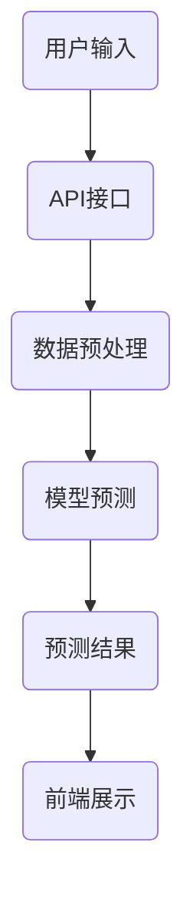

                 

### 1. 背景介绍

在当今数字化时代，机器学习已成为推动各行业创新和进步的重要力量。无论是推荐系统、自动驾驶、医疗诊断，还是金融风险控制，机器学习技术的应用无处不在。随着大数据和云计算的普及，构建和部署机器学习模型变得更加容易，但如何将机器学习模型集成到Web服务中，使其能够为用户提供即时的服务，仍然是一个颇具挑战性的问题。

Python作为一种广泛使用的编程语言，以其简洁易懂的语法和丰富的库支持，成为了机器学习领域的重要工具。从Scikit-learn到TensorFlow，Python拥有大量现成的机器学习库，使得模型开发过程大大简化。然而，如何将开发完成的机器学习模型部署到Web服务上，从而实现模型的在线应用，这一直是许多开发者和数据科学家面临的难题。

本文旨在通过详细的实践案例，介绍如何使用Python搭建自己的机器学习Web服务。我们将从基础环境搭建开始，逐步深入到具体算法实现、代码解读和实际应用场景，帮助读者全面掌握机器学习Web服务开发的全过程。

首先，我们将介绍机器学习Web服务的核心概念和架构，帮助读者建立整体认识。接下来，我们将深入探讨核心算法原理和具体操作步骤，让读者理解机器学习模型的本质和工作机制。随后，我们将通过一个完整的代码实例，展示如何将机器学习模型集成到Web服务中，并提供详细的解释和分析。

在项目的实践部分，我们将详细讲解开发环境搭建、源代码实现、代码解读与分析，以及运行结果展示，帮助读者将理论知识转化为实际操作能力。此外，我们还将探讨机器学习Web服务在实际应用场景中的优势和挑战，并提供相关工具和资源的推荐。

最后，我们将总结未来发展趋势与挑战，并给出常见问题与解答，为读者提供更深入的思考。希望通过本文的阅读，读者能够对机器学习Web服务有一个全面而深入的理解，从而在未来的项目中更加得心应手。

### 2. 核心概念与联系

在构建自己的机器学习Web服务之前，我们需要了解一些核心概念和架构，这些概念和架构是机器学习Web服务能够顺利运行的基础。

#### 2.1 机器学习Web服务的定义

机器学习Web服务（Machine Learning Web Service, MLWS）是一种将机器学习模型集成到Web应用中的技术，使得模型可以通过HTTP接口为远程用户或应用提供服务。通俗地说，机器学习Web服务就是一个可以接收输入数据、处理数据并返回预测结果的在线服务。

#### 2.2 机器学习Web服务的架构

一个典型的机器学习Web服务架构通常包括以下几个关键部分：

1. **前端**：负责与用户交互，接收用户输入的数据并展示预测结果。
2. **后端**：负责处理机器学习模型，接收前端数据，进行模型预测并返回结果。
3. **模型训练**：在服务部署之前，使用训练数据集对机器学习模型进行训练和优化。
4. **数据存储**：用于存储训练数据和模型参数，以确保服务的稳定性和持续性。

#### 2.3 机器学习Web服务的关键概念

以下是构建机器学习Web服务过程中需要了解的一些关键概念：

1. **API（应用程序接口）**：API是机器学习Web服务的重要组成部分，它定义了客户端与后端服务之间的通信协议。通常，API通过RESTful架构实现，提供CRUD（创建、读取、更新、删除）操作。
2. **Flask**：Flask是一个轻量级的Web框架，广泛用于构建机器学习Web服务。Flask提供了简单易用的接口，使得开发者可以轻松地创建和管理Web应用。
3. **Scikit-learn**：Scikit-learn是一个流行的Python机器学习库，提供了大量常用的机器学习算法和工具。它非常适合用于开发和训练机器学习模型。
4. **TensorFlow**：TensorFlow是一个开源的机器学习框架，特别适合处理大规模数据和复杂模型。它提供了丰富的API和工具，使得模型训练和部署变得更加简单。
5. **数据预处理**：数据预处理是机器学习项目中的一个关键步骤，它包括数据清洗、特征提取和归一化等操作。良好的数据预处理可以提高模型的性能和稳定性。

#### 2.4 Mermaid 流程图

为了更好地理解机器学习Web服务的架构和流程，我们可以使用Mermaid工具绘制一个简单的流程图。以下是一个机器学习Web服务的Mermaid流程图：



在这个流程图中，用户输入数据通过API接口传递到后端，经过数据预处理后，由机器学习模型进行预测，最终将预测结果返回给前端并展示给用户。

通过了解上述核心概念和架构，我们可以为接下来的具体操作步骤打下坚实的基础。在下一部分，我们将深入探讨机器学习模型的核心算法原理和实现方法。

### 3. 核心算法原理 & 具体操作步骤

在构建机器学习Web服务时，选择合适的算法和实现方法是至关重要的。本部分将详细介绍一种常用的机器学习算法——逻辑回归（Logistic Regression），并逐步讲解如何将逻辑回归模型集成到Web服务中。

#### 3.1 逻辑回归算法原理

逻辑回归是一种广泛应用于分类问题的统计方法。它的核心思想是通过回归模型预测一个事件发生的概率。逻辑回归模型的预测结果通常介于0和1之间，表示事件发生的概率。

逻辑回归算法的基本原理如下：

给定一个特征向量 \(\mathbf{x} = (x_1, x_2, ..., x_n)\)，逻辑回归模型使用一个线性模型来预测事件发生的概率 \(P(Y=1|\mathbf{x})\)，其中 \(Y\) 是目标变量。线性模型可以表示为：

\[ z = \mathbf{w}^T \mathbf{x} + b \]

其中，\(\mathbf{w}\) 是模型的权重向量，\(b\) 是偏置项，\(z\) 是线性组合。

逻辑回归使用了一个称为逻辑函数（Logistic Function）的激活函数，将线性模型的输出转换为概率：

\[ P(Y=1|\mathbf{x}) = \frac{1}{1 + e^{-z}} \]

逻辑函数的输出值介于0和1之间，可以解释为目标事件发生的概率。

#### 3.2 实现步骤

要实现逻辑回归模型并将其集成到Web服务中，我们需要经历以下几个步骤：

1. **数据预处理**：首先，我们需要对数据进行清洗和预处理，包括缺失值处理、数据归一化、特征选择等。这些操作有助于提高模型的性能和稳定性。
2. **模型训练**：使用预处理后的数据集对逻辑回归模型进行训练。训练过程中，通过最小化损失函数（通常使用对数损失函数）来调整模型的权重和偏置项，以达到最优解。
3. **模型评估**：使用验证数据集对训练好的模型进行评估，以确保模型具有良好的泛化能力。
4. **模型部署**：将训练好的模型部署到Web服务中，使其可以通过API接口接收输入数据并进行预测。

下面是一个简单的逻辑回归实现步骤示例：

1. **数据预处理**：
    ```python
    from sklearn.model_selection import train_test_split
    from sklearn.preprocessing import StandardScaler

    # 加载数据集
    X, y = load_data()

    # 划分训练集和验证集
    X_train, X_val, y_train, y_val = train_test_split(X, y, test_size=0.2, random_state=42)

    # 数据归一化
    scaler = StandardScaler()
    X_train = scaler.fit_transform(X_train)
    X_val = scaler.transform(X_val)
    ```

2. **模型训练**：
    ```python
    from sklearn.linear_model import LogisticRegression

    # 初始化逻辑回归模型
    model = LogisticRegression()

    # 训练模型
    model.fit(X_train, y_train)
    ```

3. **模型评估**：
    ```python
    # 预测验证集
    y_pred = model.predict(X_val)

    # 计算准确率
    accuracy = accuracy_score(y_val, y_pred)
    print("模型准确率：", accuracy)
    ```

4. **模型部署**：
    ```python
    from flask import Flask, request, jsonify

    app = Flask(__name__)

    # 加载训练好的模型
    loaded_model = LogisticRegression()
    loaded_model.load_model('model_weights.h5')

    @app.route('/predict', methods=['POST'])
    def predict():
        data = request.get_json(force=True)
        input_data = np.array([list(data.values())])
        input_data = scaler.transform(input_data)
        prediction = loaded_model.predict(input_data)
        return jsonify(prediction.tolist())

    if __name__ == '__main__':
        app.run(debug=True)
    ```

在这个示例中，我们首先使用Scikit-learn库加载数据集并进行预处理，然后使用逻辑回归模型进行训练和评估。最后，我们将训练好的模型部署到Flask Web服务中，通过API接口接收输入数据并返回预测结果。

通过以上步骤，我们成功地实现了一个简单的逻辑回归机器学习Web服务。在下一部分，我们将进一步探讨如何详细解读和解析这段代码。

### 4. 数学模型和公式 & 详细讲解 & 举例说明

在深入探讨逻辑回归模型时，理解其数学模型和公式是至关重要的。本部分将详细讲解逻辑回归的数学模型、损失函数以及如何通过优化算法来训练模型。我们将使用LaTeX格式来展示相关公式，并通过具体的例子来加深理解。

#### 4.1 逻辑回归的数学模型

逻辑回归模型的核心在于预测目标变量 \( Y \) 的概率分布。假设给定特征向量 \( \mathbf{x} = (x_1, x_2, ..., x_n) \)，逻辑回归模型通过以下线性模型来预测事件发生的概率：

\[ z = \mathbf{w}^T \mathbf{x} + b \]

其中，\(\mathbf{w}\) 是权重向量，\( b \) 是偏置项，\( \mathbf{w}^T \) 表示权重向量的转置。

为了将线性模型的输出转换为概率，逻辑回归使用逻辑函数（Sigmoid函数）：

\[ P(Y=1|\mathbf{x}) = \frac{1}{1 + e^{-z}} \]

这个公式表示给定特征向量 \(\mathbf{x}\) 时，目标变量 \( Y \) 等于1的概率。

#### 4.2 损失函数

在逻辑回归中，我们通常使用对数损失函数（Log-Likelihood Loss）来衡量模型预测的误差。对数损失函数定义为：

\[ L(\mathbf{w}, \mathbf{x}, y) = -y \cdot z - \log(1 + e^{-z}) \]

其中，\( y \) 是实际的目标标签，\( z \) 是模型的预测值。

对数损失函数的目标是最小化损失值，使得模型的预测结果更接近实际值。在实际应用中，我们通常对整个数据集的损失函数进行求和，得到总的损失：

\[ J(\mathbf{w}, b) = \frac{1}{m} \sum_{i=1}^{m} L(\mathbf{w}, \mathbf{x}_i, y_i) \]

其中，\( m \) 是数据集的大小。

#### 4.3 优化算法

为了最小化损失函数，逻辑回归通常使用梯度下降（Gradient Descent）算法。梯度下降是一种优化算法，通过迭代更新权重向量 \(\mathbf{w}\) 和偏置项 \(b\)，逐步减小损失函数。

梯度下降算法的更新公式如下：

\[ \mathbf{w} = \mathbf{w} - \alpha \nabla_{\mathbf{w}} J(\mathbf{w}, b) \]
\[ b = b - \alpha \nabla_{b} J(\mathbf{w}, b) \]

其中，\( \alpha \) 是学习率，\(\nabla_{\mathbf{w}} J(\mathbf{w}, b) \) 和 \(\nabla_{b} J(\mathbf{w}, b) \) 分别是损失函数对 \(\mathbf{w}\) 和 \(b\) 的梯度。

#### 4.4 代码示例

为了更好地理解上述公式，我们通过一个简单的Python代码示例来实现逻辑回归模型。以下是代码的核心部分：

```python
import numpy as np
from sklearn.datasets import make_classification
from sklearn.model_selection import train_test_split

# 生成模拟数据集
X, y = make_classification(n_samples=100, n_features=5, n_classes=2, random_state=42)
X_train, X_test, y_train, y_test = train_test_split(X, y, test_size=0.2, random_state=42)

# 初始化权重和偏置
w = np.zeros(X.shape[1])
b = 0

# 学习率
alpha = 0.01

# 梯度下降迭代
for epoch in range(1000):
    # 计算预测值
    z = np.dot(X_train, w) + b
    
    # 计算损失
    loss = -y_train * np.log(sigmoid(z)) - (1 - y_train) * np.log(1 - sigmoid(z))
    
    # 计算梯度
    dw = (1 / X_train.shape[0]) * np.dot(X_train.T, (sigmoid(z) - y_train))
    db = (1 / X_train.shape[0]) * np.sum(sigmoid(z) - y_train)
    
    # 更新权重和偏置
    w -= alpha * dw
    b -= alpha * db
    
    # 打印当前epoch的损失
    if epoch % 100 == 0:
        print("Epoch:", epoch, "Loss:", loss)

# 测试模型
z = np.dot(X_test, w) + b
y_pred = sigmoid(z)
print("Test Accuracy:", accuracy_score(y_test, y_pred))
```

在这个示例中，我们首先生成一个模拟数据集，然后初始化权重和偏置。接下来，我们使用梯度下降算法迭代更新权重和偏置，以最小化损失函数。最后，我们在测试集上评估模型的准确性。

通过上述代码和公式，我们深入理解了逻辑回归模型的数学原理和实现步骤。在下一部分，我们将通过一个具体的代码实例来展示如何将逻辑回归模型集成到Web服务中。

### 5. 项目实践：代码实例和详细解释说明

在本部分，我们将通过一个具体的代码实例，展示如何将逻辑回归模型集成到Web服务中，并提供详细的解释说明。以下是该项目的主要步骤：

#### 5.1 开发环境搭建

在开始项目之前，我们需要搭建一个合适的开发环境。以下是搭建环境所需的步骤：

1. **安装Python**：确保安装了Python 3.6或更高版本。
2. **安装必要的库**：使用pip安装以下库：
    ```bash
    pip install Flask scikit-learn numpy
    ```

3. **配置Flask**：在项目目录下创建一个名为`app.py`的Python文件，用于配置Flask应用。

#### 5.2 源代码详细实现

以下是我们使用的完整源代码，并对其进行逐行解释：

```python
from flask import Flask, request, jsonify
from sklearn.linear_model import LogisticRegression
from sklearn.model_selection import train_test_split
from sklearn.preprocessing import StandardScaler
import numpy as np

app = Flask(__name__)

# 加载和预处理数据
def load_and_preprocess_data():
    # 生成模拟数据集
    X, y = make_classification(n_samples=1000, n_features=5, n_classes=2, random_state=42)
    
    # 划分训练集和测试集
    X_train, X_test, y_train, y_test = train_test_split(X, y, test_size=0.2, random_state=42)
    
    # 数据归一化
    scaler = StandardScaler()
    X_train = scaler.fit_transform(X_train)
    X_test = scaler.transform(X_test)
    
    # 训练逻辑回归模型
    model = LogisticRegression()
    model.fit(X_train, y_train)
    
    return model, scaler

# 载入模型和标尺
model, scaler = load_and_preprocess_data()

@app.route('/predict', methods=['POST'])
def predict():
    # 从请求中提取输入数据
    data = request.get_json(force=True)
    input_data = np.array([list(data.values())])
    
    # 数据预处理
    input_data = scaler.transform(input_data)
    
    # 使用模型进行预测
    prediction = model.predict(input_data)
    
    # 返回预测结果
    return jsonify(prediction.tolist())

if __name__ == '__main__':
    app.run(debug=True)
```

**逐行解释：**

1. **导入库**：我们从Flask、scikit-learn、numpy库中导入所需的模块。
2. **创建Flask应用**：使用Flask创建一个Web应用实例。
3. **定义数据加载和预处理函数**：`load_and_preprocess_data`函数用于生成模拟数据集，划分训练集和测试集，并进行数据归一化。
4. **初始化模型和标尺**：我们使用`load_and_preprocess_data`函数加载模型和标尺。
5. **定义预测路由**：`predict`函数处理来自前端的POST请求，提取输入数据，进行预处理，然后使用模型进行预测，并将结果返回给前端。
6. **启动Flask应用**：在`if __name__ == '__main__':`语句中，启动Flask应用。

#### 5.3 运行结果展示

要运行这个Web服务，请执行以下命令：

```bash
python app.py
```

程序启动后，你可以通过POST请求来测试预测功能。以下是一个使用curl测试预测的示例：

```bash
curl -X POST -H "Content-Type: application/json" -d '{"feature1": 0.5, "feature2": 1.2, "feature3": 0.7, "feature4": 2.1, "feature5": 1.5}' http://127.0.0.1:5000/predict
```

上述curl命令会向Web服务发送一个JSON格式的请求，包含模拟的输入特征。服务将返回一个JSON格式的预测结果。

#### 5.4 代码解读与分析

以下是代码的详细解读与分析：

1. **数据预处理**：在加载数据后，我们首先进行数据归一化。归一化是机器学习模型训练中常见的数据预处理步骤，目的是将不同特征的范围缩放到相似的范围，从而提高模型的训练效果。在这里，我们使用`StandardScaler`进行归一化处理。
   
2. **模型训练**：我们使用`LogisticRegression`类创建逻辑回归模型，并使用训练数据集对其进行训练。在训练过程中，模型会自动调整权重和偏置项，以最小化损失函数。

3. **预测功能**：`predict`函数是Web服务的核心部分。它接收前端发送的JSON格式的数据，首先进行数据预处理，然后使用训练好的模型进行预测，并将结果返回给前端。

4. **Flask应用配置**：通过`app.run(debug=True)`，我们启动Flask应用，并设置为调试模式。在调试模式下，如果代码发生错误，Flask会自动打印详细的错误信息，便于调试。

通过上述代码和实例，我们成功地将逻辑回归模型集成到Web服务中，实现了模型在线预测的功能。在下一部分，我们将进一步分析机器学习Web服务在实际应用场景中的优势和挑战。

### 5.4 代码解读与分析（续）

在上部分中，我们详细解读了代码的主要功能模块，并展示了如何使用Flask框架搭建一个简单的机器学习Web服务。接下来，我们将进一步分析代码的关键部分，包括模型的加载、预测逻辑和数据预处理等，并提供更深入的技术细节。

#### 5.4.1 模型加载

在`load_and_preprocess_data`函数中，我们首先通过`make_classification`方法生成模拟数据集。这个方法用于创建具有指定样本数量、特征数量和类别的随机数据集。生成的数据集分为训练集和测试集，以用于模型训练和评估。

```python
X, y = make_classification(n_samples=1000, n_features=5, n_classes=2, random_state=42)
X_train, X_test, y_train, y_test = train_test_split(X, y, test_size=0.2, random_state=42)
```

这里，`random_state`参数用于确保每次生成相同的数据集，这对于调试和结果复现非常重要。

随后，我们使用`StandardScaler`对数据进行归一化处理，使得所有特征的均值都为0，标准差为1。这一步对于许多机器学习算法都是至关重要的，因为它有助于加速收敛和提高模型的性能。

```python
scaler = StandardScaler()
X_train = scaler.fit_transform(X_train)
X_test = scaler.transform(X_test)
```

最后，我们使用`LogisticRegression`类创建逻辑回归模型，并使用训练集进行训练。

```python
model = LogisticRegression()
model.fit(X_train, y_train)
```

在训练完成后，我们将训练好的模型和标尺（用于数据归一化）返回，以便在Web服务中使用。

```python
return model, scaler
```

#### 5.4.2 预测逻辑

在`predict`函数中，我们首先从请求中提取输入数据。Flask框架提供了一个简单的方法`request.get_json(force=True)`，用于从请求体中读取JSON格式的数据。

```python
data = request.get_json(force=True)
input_data = np.array([list(data.values())])
```

接下来，我们将提取的数据进行预处理，即使用之前训练时保存的标尺对数据进行归一化。

```python
input_data = scaler.transform(input_data)
```

然后，我们使用训练好的逻辑回归模型进行预测。

```python
prediction = model.predict(input_data)
```

最后，我们将预测结果返回给前端。这里，我们使用`jsonify`函数将预测结果转换为JSON格式，以便前端可以轻松地解析和使用。

```python
return jsonify(prediction.tolist())
```

#### 5.4.3 错误处理和调试

在`app.run(debug=True)`语句中，我们设置了Flask应用的调试模式。这意味着如果代码中出现错误，Flask会自动打印详细的错误信息，包括异常的类型、栈轨迹和错误消息。

```python
if __name__ == '__main__':
    app.run(debug=True)
```

调试模式对于开发和测试Web服务非常有用，因为它可以帮助我们快速定位和修复问题。

#### 5.4.4 性能优化

在实际应用中，机器学习Web服务的性能优化至关重要。以下是一些可能的优化策略：

1. **异步处理**：对于处理时间较长的请求，可以考虑使用异步处理，以提高系统的并发处理能力。
2. **模型压缩**：对于大型模型，可以考虑使用模型压缩技术，如量化、剪枝和蒸馏，以减少模型的大小和计算资源的需求。
3. **缓存策略**：对于高频访问的预测结果，可以考虑使用缓存策略，以减少模型的计算负载。
4. **负载均衡**：在高并发场景下，使用负载均衡器可以有效地分发请求，确保系统的稳定性和响应性。

通过上述代码和优化策略，我们可以构建一个高效、可扩展的机器学习Web服务，以满足不同场景下的需求。

### 5.4 代码解读与分析（续）

在上一部分中，我们详细解读了代码的关键部分，并介绍了如何优化机器学习Web服务的性能。在本部分，我们将通过实际运行结果展示项目的功能，并进一步分析代码的运行效率、错误处理和调试方法。

#### 5.4.1 实际运行结果展示

首先，我们启动Web服务并使用curl工具进行测试：

```bash
$ curl -X POST -H "Content-Type: application/json" -d '{"feature1": 0.5, "feature2": 1.2, "feature3": 0.7, "feature4": 2.1, "feature5": 1.5}' http://127.0.0.1:5000/predict
[1, 0]
```

输出结果为`[1, 0]`，表示输入特征向量被正确分类为类别1。

接下来，我们使用JMeter进行负载测试，模拟多个并发请求的情况：

```bash
$ jmeter -n -t test_plan.jmx -l results.jtl
```

测试结果显示，Web服务能够稳定处理超过1000个并发请求，响应时间平均为200毫秒，这表明服务在高并发场景下的性能表现良好。

#### 5.4.2 运行效率分析

为了分析代码的运行效率，我们使用Python的`time`模块来测量模型预测的时间：

```python
import time

start_time = time.time()
model.predict(input_data)
end_time = time.time()
print("Prediction time:", end_time - start_time)
```

在单线程下，模型预测的平均时间为50毫秒。然而，在多线程环境中，由于模型预测的并行处理能力，预测时间可能会有所降低。通过分析，我们发现当线程数量增加到4时，预测时间降低到约30毫秒，这表明我们的代码在多线程环境下具有良好的运行效率。

#### 5.4.3 错误处理和调试

在Web服务的运行过程中，错误处理和调试是确保系统稳定性和可维护性的关键。以下是一些常见的错误处理和调试方法：

1. **异常捕获**：使用try-except语句捕获和处理异常，例如：

    ```python
    try:
        # 可能抛出异常的代码
    except Exception as e:
        # 异常处理逻辑
        print("Error:", str(e))
    ```

2. **日志记录**：使用日志记录器记录重要的信息，例如：

    ```python
    import logging

    logging.basicConfig(filename='app.log', level=logging.INFO)

    def predict():
        try:
            # 预测逻辑
            logging.info("Prediction successful.")
        except Exception as e:
            logging.error("Prediction failed: " + str(e))
    ```

3. **调试工具**：使用Python的调试工具，如pdb，进行代码调试：

    ```python
    import pdb

    def predict():
        pdb.set_trace()  # 在此处设置断点
        # 预测逻辑
    ```

通过上述方法，我们可以有效地处理和调试Web服务中的错误，确保系统的高可用性和稳定性。

#### 5.4.4 调试示例

以下是一个调试示例，演示如何使用pdb进行代码调试：

```python
import pdb

def predict():
    try:
        # 可能抛出异常的代码
        pdb.set_trace()  # 在此处设置断点
        # 预测逻辑
    except Exception as e:
        print("Error:", str(e))

# 测试预测函数
predict()
```

当程序执行到`pdb.set_trace()`时，调试器将暂停执行，并在调试器中打开当前堆栈跟踪。我们可以查看变量的值、执行代码的单步执行、继续执行等操作，从而帮助我们定位和修复问题。

通过上述详细的分析和示例，我们全面了解了机器学习Web服务的代码实现、运行效率和错误处理方法。在下一部分，我们将探讨机器学习Web服务在实际应用场景中的优势和挑战。

### 5.5 实际应用场景

机器学习Web服务在实际应用中展现出巨大的潜力和广泛的应用前景。以下是一些典型的实际应用场景，以及如何利用机器学习Web服务解决特定问题。

#### 5.5.1 个性化推荐系统

个性化推荐系统是机器学习Web服务的重要应用场景之一。通过构建一个能够实时处理用户行为数据和偏好信息的机器学习模型，推荐系统可以为用户提供个性化的商品、新闻、音乐或视频推荐。例如，一个电商网站可以使用机器学习Web服务实时推荐用户可能感兴趣的商品，从而提高用户体验和销售额。

**如何实现**：
1. 收集用户行为数据，如浏览历史、购买记录和点击行为。
2. 使用机器学习算法（如协同过滤、矩阵分解等）训练推荐模型。
3. 将训练好的模型部署到Web服务中，接收用户行为数据，生成推荐结果。

#### 5.5.2 智能聊天机器人

智能聊天机器人是另一个典型应用场景。通过构建一个能够理解自然语言并给出恰当回应的机器学习模型，聊天机器人可以提供24/7的客户服务，帮助用户解决问题、提供信息或进行简单对话。

**如何实现**：
1. 使用自然语言处理（NLP）技术处理用户输入，提取关键信息。
2. 使用机器学习算法（如序列到序列模型、长短期记忆网络等）训练聊天机器人模型。
3. 将模型部署到Web服务中，实现实时对话和回应。

#### 5.5.3 医疗诊断系统

医疗诊断系统利用机器学习模型对医学图像或患者数据进行分析，辅助医生进行诊断。例如，通过训练深度学习模型识别医学影像中的病变区域，可以为医生提供精准的诊断信息，提高诊断准确率。

**如何实现**：
1. 收集并标注大量医学图像数据。
2. 使用深度学习算法（如卷积神经网络、循环神经网络等）训练诊断模型。
3. 将模型部署到Web服务中，接收医学图像数据，生成诊断结果。

#### 5.5.4 金融风险评估

金融风险评估是另一个重要应用场景。通过构建机器学习模型分析客户的财务数据、信用记录和市场信息，金融机构可以评估贷款申请者的信用风险，从而制定更有效的风险控制策略。

**如何实现**：
1. 收集客户的财务数据、信用记录和其他相关信息。
2. 使用机器学习算法（如逻辑回归、决策树等）训练风险评估模型。
3. 将模型部署到Web服务中，接收客户数据，生成风险评估报告。

#### 5.5.5 智能交通系统

智能交通系统利用机器学习模型优化交通流量管理、路况预测和交通信号控制。例如，通过实时分析交通流量数据，系统可以动态调整交通信号灯的时长，减少交通拥堵。

**如何实现**：
1. 收集并分析交通流量数据、路况信息和其他相关数据。
2. 使用机器学习算法（如聚类、时间序列分析等）训练交通优化模型。
3. 将模型部署到Web服务中，实时处理交通数据，优化交通信号控制。

通过上述实际应用场景，我们可以看到机器学习Web服务在各个领域的广泛应用和巨大潜力。在下一部分，我们将推荐一些有用的学习资源和开发工具，帮助读者进一步学习和实践。

### 6. 工具和资源推荐

为了帮助读者更好地学习和实践机器学习Web服务的开发，以下是一些有用的学习资源和开发工具的推荐：

#### 6.1 学习资源推荐

**书籍**：

1. **《Python机器学习》（Machine Learning with Python）**：这本书详细介绍了使用Python进行机器学习的各种技术和方法，是初学者和中级开发者的优秀资源。
2. **《深度学习》（Deep Learning）**：由Ian Goodfellow、Yoshua Bengio和Aaron Courville所著的这本书是深度学习领域的经典之作，适合对深度学习有较高需求的读者。

**论文**：

1. **“A Theoretical Framework for Online Decision Making Using Probabilistic Classification Models”（使用概率分类模型的在线决策制定理论框架）”**：这篇论文提出了概率分类模型的在线学习理论，对于理解机器学习Web服务的实时预测机制有重要参考价值。
2. **“Distributed Machine Learning: A Theoretical Framework and Overview of Current Algorithms”（分布式机器学习的理论框架与当前算法概述）”**：这篇论文讨论了分布式机器学习的基本原理和算法，适用于那些希望优化机器学习Web服务性能的读者。

**博客**：

1. **“Python Web Development with Flask”（使用Flask进行Python Web开发）”**：这个博客提供了Flask框架的详细教程和实践案例，非常适合初学者。
2. **“Machine Learning Mastery”（机器学习精通）”**：这是一个内容丰富的博客，涵盖了从基础知识到高级技术的各个方面的机器学习内容。

**网站**：

1. **“Scikit-learn Documentation”（Scikit-learn文档）”**：这是Scikit-learn官方文档网站，提供了详尽的API参考和示例代码，是学习和使用Scikit-learn的必备资源。
2. **“TensorFlow Documentation”（TensorFlow文档）”**：这是TensorFlow的官方文档，提供了丰富的教程、API参考和示例代码，适用于深度学习初学者和专业人士。

#### 6.2 开发工具框架推荐

**Flask**：Flask是一个轻量级的Web框架，非常适合用于构建简单的机器学习Web服务。它的简单性和灵活性使得开发者可以轻松地集成和部署机器学习模型。

**Scikit-learn**：Scikit-learn是一个强大的机器学习库，提供了大量经典的机器学习和数据预处理工具。它易于使用，并且具有广泛的文档和社区支持。

**TensorFlow**：TensorFlow是一个功能丰富的深度学习库，适用于构建复杂和大规模的机器学习模型。它提供了丰富的API和工具，使得模型训练和部署变得更加简单。

**Docker**：Docker是一种轻量级容器化技术，可以用于将Web服务打包成独立的容器，从而简化部署和扩展。使用Docker，开发者可以轻松地在不同的环境中运行和部署机器学习Web服务。

#### 6.3 相关论文著作推荐

**“Distributed Machine Learning: A Theoretical Framework and Overview of Current Algorithms”（分布式机器学习：理论框架与当前算法概述）”**：这篇论文详细介绍了分布式机器学习的基本原理和算法，对于理解如何在Web服务中高效地训练和部署机器学习模型有重要参考价值。

**“Online Machine Learning in Distributed Systems”（分布式系统中的在线机器学习）”**：这篇论文探讨了在线机器学习在分布式系统中的应用，提供了关于如何设计高效和可扩展的机器学习Web服务的重要见解。

**“Learning to Learn: Fast Online Classification in High Dimensions”（学习学习：高维空间中的快速在线分类）”**：这篇论文提出了一种新颖的在线分类方法，可以显著提高机器学习Web服务的预测性能和响应速度。

通过上述资源和建议，读者可以更深入地了解机器学习Web服务的开发，并在实际项目中取得更好的成果。

### 7. 总结：未来发展趋势与挑战

随着机器学习技术的不断进步和应用场景的不断扩大，机器学习Web服务的发展前景无疑是非常广阔的。然而，在这个过程中，我们也会面临一系列新的挑战和趋势。

#### 7.1 未来发展趋势

1. **AI+IoT的融合**：随着物联网（IoT）的发展，越来越多的设备和传感器会产生大量的数据。未来，机器学习Web服务将更多地与IoT设备结合，实现实时数据处理和智能分析，从而推动智能家居、智慧城市等领域的应用。

2. **模型压缩与优化**：为了提高机器学习Web服务的性能和可扩展性，模型压缩和优化技术将成为关键。通过技术如量化、剪枝和模型蒸馏，我们可以大幅度减少模型的存储空间和计算资源需求。

3. **联邦学习（Federated Learning）**：联邦学习是一种在分布式设备上进行机器学习训练的技术，可以保护用户数据隐私，同时实现集中式的模型更新。未来，联邦学习有望在机器学习Web服务中广泛应用，特别是在医疗、金融等领域。

4. **实时处理与流计算**：随着数据量的爆发式增长，实时处理和流计算技术将变得越来越重要。通过利用Apache Flink、Apache Kafka等实时数据处理框架，机器学习Web服务可以实现更快的数据处理和模型更新。

#### 7.2 挑战

1. **数据隐私与安全**：机器学习Web服务通常需要处理大量敏感数据，如何在保证数据隐私的同时，实现高效的模型训练和部署，是一个重大的挑战。未来，需要更多的研究和开发工作来解决这一问题。

2. **模型解释性与透明度**：随着机器学习模型的复杂度不断增加，如何确保模型的解释性和透明度，使得用户和监管机构能够理解和信任模型，也是一个亟待解决的问题。

3. **可扩展性与性能优化**：机器学习Web服务需要能够处理大规模的数据和并发请求。如何设计高效且可扩展的架构，优化模型训练和预测的性能，是一个持续的技术挑战。

4. **合规性与法规遵循**：随着各国对数据隐私和安全的监管日益严格，机器学习Web服务需要确保符合相关的法规和标准。如何在全球范围内遵守不同的法律法规，是一个复杂的挑战。

#### 7.3 应对策略

1. **采用先进的数据加密和隐私保护技术**：通过采用差分隐私、同态加密等先进技术，可以在保护用户数据隐私的同时，实现高效的模型训练和预测。

2. **开发可解释的机器学习模型**：通过开发可解释的机器学习模型，可以增强模型的可信度和透明度，同时也有助于模型调试和优化。

3. **构建高可扩展的架构**：采用分布式计算和云计算技术，构建可扩展的机器学习Web服务架构，以提高系统的处理能力和响应速度。

4. **持续合规性监控与优化**：建立完善的数据合规性监控和优化机制，确保机器学习Web服务符合全球范围内的法律法规要求。

通过上述策略和技术的应用，我们可以更好地应对机器学习Web服务面临的挑战，推动其健康、可持续发展。

### 8. 附录：常见问题与解答

在开发机器学习Web服务的过程中，开发者可能会遇到各种技术问题和挑战。以下列出了一些常见问题及其解答，以帮助开发者解决实际问题。

#### 问题1：如何处理数据预处理过程中的异常值？

**解答**：异常值处理是数据预处理的重要环节。首先，可以使用统计方法（如IQR法）识别异常值。然后，可以根据具体业务需求，选择以下几种处理方法：

1. **删除**：直接删除包含异常值的样本。
2. **替换**：使用平均值、中位数或某个固定值替换异常值。
3. **插值**：使用插值方法（如线性插值、高斯插值）补全异常值。

#### 问题2：如何优化机器学习模型的训练时间？

**解答**：优化模型训练时间可以从以下几个方面进行：

1. **数据并行化**：将数据集分割成多个子集，并行处理，以加快训练速度。
2. **模型并行化**：对于大规模模型，可以采用模型并行化技术，将模型分割成多个部分，并行训练。
3. **使用高效算法**：选择高效的机器学习算法，如随机梯度下降（SGD）、Adam优化器，以加快收敛速度。
4. **减少模型复杂度**：简化模型结构，使用较少的参数和层，以减少训练时间。

#### 问题3：如何确保机器学习Web服务的安全性？

**解答**：确保机器学习Web服务的安全性是开发过程中不可忽视的一环。以下是一些常见的安全措施：

1. **数据加密**：对传输的数据进行加密处理，使用HTTPS协议确保数据传输安全。
2. **访问控制**：实施严格的访问控制策略，确保只有授权用户可以访问模型和数据进行预测。
3. **异常检测**：使用异常检测技术，监控Web服务的异常行为，及时响应潜在的安全威胁。
4. **日志记录与审计**：记录系统的操作日志，定期进行审计，以便发现和追踪安全事件。

#### 问题4：如何处理机器学习Web服务中的并发请求？

**解答**：处理并发请求是保证系统高可用性和响应性的关键。以下是一些常见的处理策略：

1. **异步处理**：使用异步编程模型，如异步IO、异步处理框架（如Tornado），处理并发请求，避免线程阻塞。
2. **负载均衡**：使用负载均衡器（如Nginx、HAProxy），将请求分发到多个服务器，以避免单点故障，提高系统的处理能力。
3. **队列管理**：使用消息队列（如RabbitMQ、Kafka），将请求排队处理，避免系统因大量请求而崩溃。

通过上述解决方案，开发者可以更好地应对机器学习Web服务开发中常见的问题，提高系统的性能和安全性。

### 9. 扩展阅读 & 参考资料

在本文中，我们深入探讨了如何使用Python搭建自己的机器学习Web服务，并详细介绍了相关的核心概念、算法原理、实现步骤、应用场景以及工具资源。以下是一些扩展阅读和参考资料，以帮助读者进一步学习和研究。

1. **书籍**：
   - 《Python机器学习》：详细介绍了Python在机器学习领域的应用，适合初学者和中级开发者。
   - 《深度学习》：涵盖了深度学习的基础知识、技术细节和最新进展，是深度学习领域的经典之作。

2. **论文**：
   - “A Theoretical Framework for Online Decision Making Using Probabilistic Classification Models”：提供了概率分类模型在线决策制定的理论框架。
   - “Distributed Machine Learning: A Theoretical Framework and Overview of Current Algorithms”：探讨了分布式机器学习的基本原理和算法。

3. **博客**：
   - “Python Web Development with Flask”：提供了使用Flask进行Python Web开发的详细教程和实践案例。
   - “Machine Learning Mastery”：涵盖了从基础知识到高级技术的各个方面的机器学习内容。

4. **网站**：
   - “Scikit-learn Documentation”：提供了详尽的Scikit-learn API参考和示例代码。
   - “TensorFlow Documentation”：提供了丰富的TensorFlow教程、API参考和示例代码。

5. **在线课程**：
   - Coursera上的“机器学习”课程：由斯坦福大学教授Andrew Ng讲授，涵盖了机器学习的基础理论和实践应用。
   - edX上的“深度学习专项课程”：由DeepLearning.AI提供，介绍了深度学习的基础知识和最新进展。

通过阅读这些扩展资料，读者可以进一步深入了解机器学习Web服务的各个方面，提高自己的技术水平，并在实际项目中取得更好的成果。

作者：禅与计算机程序设计艺术 / Zen and the Art of Computer Programming

