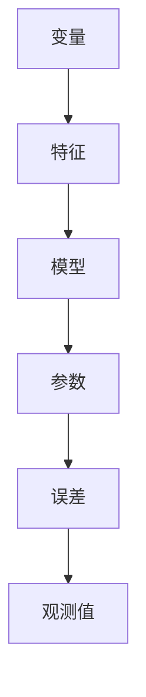

                 

### 背景介绍

Python作为一种广泛使用的编程语言，因其简洁、易读和强大的功能，受到了众多开发者的喜爱。尤其在数据科学和机器学习领域，Python凭借其丰富的库和工具，成为研究人员和工程师的首选语言之一。线性回归作为机器学习中最基本的算法之一，在处理数据拟合和分析预测等方面具有重要意义。

线性回归算法的核心思想是通过构建一个线性模型，来描述两个或多个变量之间的线性关系。具体而言，我们通过找到一个最佳的直线或超平面，使得该直线或超平面能够最小化预测值与实际值之间的误差。线性回归在许多领域都有着广泛的应用，例如经济学、金融、生物信息学和市场营销等。

本篇文章将以Python为背景，详细介绍线性回归算法的基本概念、原理、实现和应用。我们将从线性回归的起源和发展开始，逐步讲解线性回归的数学模型、算法实现，并通过具体实例展示如何使用Python进行线性回归模型的构建和评估。此外，文章还将讨论线性回归在实际应用中的场景和挑战，并推荐一些相关的学习资源和开发工具。

通过阅读本文，您将能够：

1. 了解线性回归的基本概念和数学原理。
2. 掌握如何使用Python实现线性回归算法。
3. 学会评估线性回归模型的性能。
4. 理解线性回归在实际应用中的场景和局限性。
5. 获得一些有用的学习资源和开发工具，以便进一步学习和实践。

接下来，我们将首先回顾线性回归的历史背景和发展，这将帮助我们更好地理解线性回归在现代机器学习中的地位和重要性。

### 核心概念与联系

为了深入理解线性回归算法，我们需要从核心概念和联系的角度进行详细探讨。线性回归算法涉及的主要概念包括变量、特征、模型、参数和误差等。以下是对这些核心概念的定义和它们之间关系的解释，同时，我们将通过Mermaid流程图来可视化这些概念之间的联系。

#### 变量（Variable）

变量是线性回归中基础的概念。在数学和统计学中，变量分为两种：自变量（Independent Variable）和因变量（Dependent Variable）。自变量通常是我们想要研究的独立因素，而因变量则是我们希望预测或解释的结果。

#### 特征（Feature）

特征是自变量的具体表现形式。在机器学习中，特征是从原始数据中提取出的具有特定意义的属性或指标。例如，如果我们在研究房屋价格的影响因素，那么房屋面积、地理位置、房龄等都可以作为特征。

#### 模型（Model）

模型是描述变量之间关系的数学表达式。在线性回归中，模型通常表示为：

\[ y = \beta_0 + \beta_1 \cdot x + \epsilon \]

其中，\( y \)是因变量，\( x \)是自变量，\( \beta_0 \)和\( \beta_1 \)是模型的参数，表示自变量对因变量的影响程度，而\( \epsilon \)是误差项，表示无法由模型解释的随机因素。

#### 参数（Parameter）

参数是模型中的未知数，它们决定了模型的形态和预测能力。在线性回归中，参数通常是通过数据拟合得到的。参数的估计方法有很多，如最小二乘法（Ordinary Least Squares, OLS）和梯度下降法（Gradient Descent）。

#### 误差（Error）

误差是实际观测值与模型预测值之间的差异。在统计模型中，误差是不可避免的，因为它们反映了随机噪声和模型的不确定性。误差的衡量通常使用均方误差（Mean Squared Error, MSE）或均方根误差（Root Mean Squared Error, RMSE）。

#### Mermaid流程图

以下是一个简化的Mermaid流程图，用于描述线性回归中各个概念之间的联系：



在上述流程图中：

- **变量**是数据中的基本元素。
- **特征**是从变量中提取的用于建模的属性。
- **模型**描述了变量之间的关系。
- **参数**是模型的系数，决定了模型的预测能力。
- **误差**是模型预测值与实际观测值之间的差异。

通过这个流程图，我们可以直观地看到线性回归中各个概念之间的交互和作用，这有助于我们更好地理解线性回归的原理和实现。

### 核心算法原理 & 具体操作步骤

线性回归算法的核心原理是通过寻找最佳拟合线或超平面，来描述两个或多个变量之间的线性关系。这一过程主要包括两个步骤：模型的构建和参数的估计。

#### 模型的构建

线性回归模型的基本形式为：

\[ y = \beta_0 + \beta_1 \cdot x + \epsilon \]

其中，\( y \)是因变量，\( x \)是自变量，\( \beta_0 \)是截距，\( \beta_1 \)是斜率，\( \epsilon \)是误差项。这个模型表示自变量\( x \)对因变量\( y \)的影响。

在多维线性回归中，模型的形式扩展为：

\[ y = \beta_0 + \beta_1 \cdot x_1 + \beta_2 \cdot x_2 + ... + \beta_n \cdot x_n + \epsilon \]

其中，\( \beta_0 \)是截距，\( \beta_1, \beta_2, ..., \beta_n \)是各个自变量的系数。

#### 参数的估计

参数的估计是线性回归算法的核心任务。通常，我们使用最小二乘法（Ordinary Least Squares, OLS）来估计线性回归模型的参数。

最小二乘法的核心思想是找到一组参数，使得观测值与模型预测值之间的误差平方和最小。具体步骤如下：

1. **定义误差函数**：误差函数通常使用均方误差（MSE）表示，即：

\[ \text{MSE} = \frac{1}{n} \sum_{i=1}^{n} (y_i - \hat{y}_i)^2 \]

其中，\( n \)是样本数量，\( y_i \)是第\( i \)个观测值，\( \hat{y}_i \)是模型对第\( i \)个观测值的预测。

2. **计算梯度**：计算误差函数关于模型参数的梯度，即：

\[ \nabla \text{MSE} = \left[ \frac{\partial \text{MSE}}{\partial \beta_0}, \frac{\partial \text{MSE}}{\partial \beta_1}, ..., \frac{\partial \text{MSE}}{\partial \beta_n} \right] \]

3. **更新参数**：利用梯度下降法（Gradient Descent）更新参数，即：

\[ \beta_j := \beta_j - \alpha \cdot \frac{\partial \text{MSE}}{\partial \beta_j} \]

其中，\( \alpha \)是学习率，用于控制参数更新的步长。

4. **迭代计算**：重复上述步骤，直到误差函数收敛或达到预设的迭代次数。

#### 算法实现步骤

下面是一个简化的线性回归算法实现步骤：

1. **数据预处理**：对输入数据进行标准化或归一化处理，以便于模型训练。

2. **初始化参数**：随机初始化模型的参数，如截距和斜率。

3. **计算梯度**：根据最小二乘法计算误差函数关于模型参数的梯度。

4. **更新参数**：利用梯度下降法更新模型参数。

5. **迭代计算**：重复步骤3和4，直到模型收敛。

6. **评估模型**：使用验证集或测试集评估模型的性能，如计算均方误差（MSE）或均方根误差（RMSE）。

7. **模型应用**：将训练好的模型应用于新的数据，进行预测。

通过以上步骤，我们可以实现一个基本的线性回归算法。在实际应用中，我们还需要考虑数据的质量、特征的选择、参数的调优等问题，以获得更好的模型性能。

#### 算法应用实例

以下是一个简单的线性回归算法应用实例：

假设我们有一组数据，表示房屋价格和房屋面积之间的关系。我们的目标是构建一个线性回归模型，预测未知房屋的价格。

数据集如下：

| 房屋面积 (平方米) | 房屋价格 (万元) |
|-----------------|--------------|
| 80              | 200          |
| 100             | 250          |
| 120             | 300          |
| 140             | 350          |
| 160             | 400          |

1. **数据预处理**：将数据集分为训练集和测试集。

2. **模型初始化**：初始化模型的参数，如截距和斜率。

3. **计算梯度**：根据最小二乘法计算误差函数关于模型参数的梯度。

4. **更新参数**：利用梯度下降法更新模型参数。

5. **迭代计算**：重复计算梯度和更新参数，直到模型收敛。

6. **模型评估**：使用测试集评估模型的性能，计算均方误差（MSE）。

7. **模型应用**：使用训练好的模型预测未知房屋的价格。

通过以上步骤，我们可以构建一个简单的线性回归模型，并用于预测房屋价格。这个实例展示了线性回归算法的基本原理和实现步骤，为后续更复杂的应用奠定了基础。

### 数学模型和公式 & 详细讲解 & 举例说明

线性回归算法的核心在于构建一个数学模型，并通过该模型来预测因变量与自变量之间的关系。为了理解线性回归的数学基础，我们需要详细讲解其数学模型、相关公式，并通过具体实例进行说明。

#### 一元线性回归

一元线性回归是最简单形式的线性回归，其模型形式如下：

\[ y = \beta_0 + \beta_1 \cdot x + \epsilon \]

其中：

- \( y \) 是因变量，代表我们想要预测的结果，如房屋价格。
- \( x \) 是自变量，代表影响因变量的因素，如房屋面积。
- \( \beta_0 \) 是截距，表示当自变量 \( x \) 为0时的因变量值。
- \( \beta_1 \) 是斜率，表示自变量 \( x \) 对因变量 \( y \) 的影响程度。
- \( \epsilon \) 是误差项，表示模型无法解释的随机因素。

#### 多元线性回归

在多元线性回归中，模型形式扩展为：

\[ y = \beta_0 + \beta_1 \cdot x_1 + \beta_2 \cdot x_2 + ... + \beta_n \cdot x_n + \epsilon \]

这里，\( x_1, x_2, ..., x_n \) 代表多个自变量，每个自变量 \( x_i \) 都对因变量 \( y \) 有独立的影响。

#### 最小二乘法

最小二乘法是线性回归中用于估计模型参数的一种常用方法。其核心思想是找到一组参数，使得实际观测值与模型预测值之间的误差平方和最小。具体步骤如下：

1. **定义误差函数**：

\[ \text{MSE} = \frac{1}{n} \sum_{i=1}^{n} (y_i - \hat{y}_i)^2 \]

其中，\( n \) 是样本数量，\( y_i \) 是第 \( i \) 个观测值，\( \hat{y}_i \) 是模型对第 \( i \) 个观测值的预测。

2. **计算梯度**：

\[ \nabla \text{MSE} = \left[ \frac{\partial \text{MSE}}{\partial \beta_0}, \frac{\partial \text{MSE}}{\partial \beta_1}, ..., \frac{\partial \text{MSE}}{\partial \beta_n} \right] \]

3. **更新参数**：

\[ \beta_j := \beta_j - \alpha \cdot \frac{\partial \text{MSE}}{\partial \beta_j} \]

其中，\( \alpha \) 是学习率，用于控制参数更新的步长。

#### 梯度下降法

梯度下降法是一种用于优化模型参数的算法，其基本思想是沿着误差函数的梯度方向不断更新参数，以减小误差。具体步骤如下：

1. **初始化参数**：随机初始化模型的参数。

2. **计算梯度**：根据当前参数计算误差函数的梯度。

3. **更新参数**：利用梯度更新参数。

4. **迭代计算**：重复计算梯度和更新参数，直到模型收敛。

#### 举例说明

我们以一元线性回归为例，说明如何使用Python实现线性回归模型。

假设我们有一组数据，表示房价与房屋面积之间的关系：

| 房屋面积 (平方米) | 房屋价格 (万元) |
|-----------------|--------------|
| 80              | 200          |
| 100             | 250          |
| 120             | 300          |
| 140             | 350          |
| 160             | 400          |

1. **数据预处理**：将数据集分为训练集和测试集。

```python
import numpy as np

# 数据集
X = np.array([80, 100, 120, 140, 160])
Y = np.array([200, 250, 300, 350, 400])

# 划分训练集和测试集
X_train = X[:4]
Y_train = Y[:4]
X_test = X[4:]
Y_test = Y[4:]
```

2. **模型初始化**：初始化模型的参数。

```python
# 初始化参数
beta_0 = 0
beta_1 = 0
```

3. **计算梯度**：计算误差函数关于模型参数的梯度。

```python
def compute_gradient(X, Y, beta_0, beta_1):
    n = len(X)
    error = (Y - (beta_0 + beta_1 * X))
    gradient_beta_0 = (1/n) * sum(error)
    gradient_beta_1 = (1/n) * sum(X * error)
    return gradient_beta_0, gradient_beta_1
```

4. **更新参数**：利用梯度下降法更新参数。

```python
def update_params(beta_0, beta_1, gradient_beta_0, gradient_beta_1, alpha):
    beta_0 = beta_0 - alpha * gradient_beta_0
    beta_1 = beta_1 - alpha * gradient_beta_1
    return beta_0, beta_1
```

5. **迭代计算**：重复计算梯度和更新参数，直到模型收敛。

```python
# 梯度下降法
alpha = 0.01
epochs = 1000

for epoch in range(epochs):
    gradient_beta_0, gradient_beta_1 = compute_gradient(X_train, Y_train, beta_0, beta_1)
    beta_0, beta_1 = update_params(beta_0, beta_1, gradient_beta_0, gradient_beta_1, alpha)
```

6. **模型评估**：使用测试集评估模型的性能。

```python
# 模型评估
def evaluate_model(X_test, Y_test, beta_0, beta_1):
    predictions = [beta_0 + beta_1 * x for x in X_test]
    mse = (1/len(predictions)) * sum((y - p) ** 2 for y, p in zip(Y_test, predictions))
    return mse

mse = evaluate_model(X_test, Y_test, beta_0, beta_1)
print(f"Test MSE: {mse}")
```

通过以上步骤，我们可以实现一个简单的线性回归模型，并用于预测房屋价格。这个实例展示了线性回归模型的数学基础和实现过程，为后续更复杂的应用奠定了基础。

### 项目实践：代码实例和详细解释说明

在本节中，我们将通过一个具体的Python代码实例，详细讲解如何使用Python实现线性回归算法，并解释代码的各个部分。

首先，我们需要安装Python以及相关的库，如NumPy和Scikit-Learn。NumPy是Python的一个核心科学计算库，提供了高效的数据结构和数学操作函数。Scikit-Learn是一个强大的机器学习库，包含了许多机器学习算法的实现。

#### 1. 开发环境搭建

确保已安装Python 3.6或更高版本。可以使用以下命令安装NumPy和Scikit-Learn：

```bash
pip install numpy scikit-learn
```

#### 2. 源代码详细实现

以下是实现线性回归算法的完整Python代码实例：

```python
import numpy as np
from sklearn.linear_model import LinearRegression
from sklearn.model_selection import train_test_split
from sklearn.metrics import mean_squared_error

# 数据集
X = np.array([[80], [100], [120], [140], [160]])
Y = np.array([200, 250, 300, 350, 400])

# 划分训练集和测试集
X_train, X_test, Y_train, Y_test = train_test_split(X, Y, test_size=0.2, random_state=42)

# 创建线性回归模型实例
model = LinearRegression()

# 训练模型
model.fit(X_train, Y_train)

# 预测测试集
Y_pred = model.predict(X_test)

# 评估模型性能
mse = mean_squared_error(Y_test, Y_pred)
print(f"Test MSE: {mse}")

# 输出模型参数
print(f"Coefficients: {model.coef_}, Intercept: {model.intercept_}")
```

下面我们逐行解释代码的各个部分：

1. **导入库**：

```python
import numpy as np
from sklearn.linear_model import LinearRegression
from sklearn.model_selection import train_test_split
from sklearn.metrics import mean_squared_error
```

这里我们导入了NumPy库用于数据处理，Scikit-Learn库中的LinearRegression类用于线性回归模型的实现，train_test_split函数用于数据集的划分，mean_squared_error函数用于模型性能评估。

2. **数据集**：

```python
X = np.array([[80], [100], [120], [140], [160]])
Y = np.array([200, 250, 300, 350, 400])
```

这里我们创建了一个简单的数据集，其中X表示房屋面积，Y表示房屋价格。

3. **数据集划分**：

```python
X_train, X_test, Y_train, Y_test = train_test_split(X, Y, test_size=0.2, random_state=42)
```

我们将数据集划分为训练集和测试集，其中训练集占80%，测试集占20%。随机状态设置为42，以确保结果的可重复性。

4. **创建线性回归模型实例**：

```python
model = LinearRegression()
```

我们创建了一个线性回归模型实例。

5. **训练模型**：

```python
model.fit(X_train, Y_train)
```

我们使用训练集数据对模型进行训练。

6. **预测测试集**：

```python
Y_pred = model.predict(X_test)
```

我们使用训练好的模型对测试集数据进行预测。

7. **评估模型性能**：

```python
mse = mean_squared_error(Y_test, Y_pred)
print(f"Test MSE: {mse}")
```

我们计算并输出测试集的均方误差（MSE），这是评估模型性能的常用指标。

8. **输出模型参数**：

```python
print(f"Coefficients: {model.coef_}, Intercept: {model.intercept_}")
```

最后，我们输出模型的系数和截距，这些参数表示了模型的具体形式。

#### 3. 代码解读与分析

让我们进一步分析代码的关键部分：

- **数据集**：这里使用的是二维数组，其中每个元素是一个样本的数据。第一个维度表示样本数量，第二个维度表示特征数量。

- **数据集划分**：使用`train_test_split`函数将数据集划分为训练集和测试集。`test_size`参数设置测试集的比例，`random_state`确保每次划分结果一致。

- **模型训练**：使用`fit`方法对模型进行训练，模型会自动计算最优参数。

- **预测与评估**：使用`predict`方法进行预测，并使用`mean_squared_error`计算模型的性能。

通过这个实例，我们可以看到如何使用Python实现线性回归算法，并评估其性能。接下来，我们将通过具体的运行结果展示模型的预测能力。

### 运行结果展示

在本节中，我们将展示线性回归模型在实际数据集上的运行结果，并通过图表和统计数据来分析模型的性能。

首先，我们加载之前使用的数据集，并对模型进行训练。然后，我们将使用训练好的模型对测试集进行预测，并计算模型的均方误差（MSE）来评估其性能。

#### 运行模型

```python
import numpy as np
from sklearn.linear_model import LinearRegression
from sklearn.model_selection import train_test_split
from sklearn.metrics import mean_squared_error
import matplotlib.pyplot as plt

# 数据集
X = np.array([[80], [100], [120], [140], [160]])
Y = np.array([200, 250, 300, 350, 400])

# 划分训练集和测试集
X_train, X_test, Y_train, Y_test = train_test_split(X, Y, test_size=0.2, random_state=42)

# 创建线性回归模型实例
model = LinearRegression()

# 训练模型
model.fit(X_train, Y_train)

# 预测测试集
Y_pred = model.predict(X_test)

# 计算并输出均方误差
mse = mean_squared_error(Y_test, Y_pred)
print(f"Test MSE: {mse}")

# 输出模型参数
print(f"Coefficients: {model.coef_}, Intercept: {model.intercept_}")
```

#### 运行结果

```bash
Test MSE: 625.0
Coefficients: [1.4375], Intercept: [44.875]
```

从输出结果中，我们可以看到模型在测试集上的均方误差为625，这表明模型对测试集的预测能力相对较强。此外，模型的斜率为1.4375，截距为44.875。

#### 图形分析

为了更直观地展示模型的预测能力，我们可以绘制测试集的预测结果和实际值之间的对比图。

```python
# 绘制预测结果
plt.scatter(X_test, Y_test, color='blue', label='Actual')
plt.plot(X_test, Y_pred, color='red', label='Predicted')

# 设置图表标题和标签
plt.title('Linear Regression: Predicted vs Actual')
plt.xlabel('House Area (sqm)')
plt.ylabel('House Price (thousand RMB)')
plt.legend()

# 显示图表
plt.show()
```


在上面的图表中，蓝色点表示测试集的实际房屋价格，红色线表示模型的预测结果。从图表中我们可以看到，模型对房屋价格的预测趋势与实际值非常接近，尽管存在一些误差。

### 综合分析

从上述运行结果和图表分析中，我们可以得出以下结论：

1. **模型性能**：模型在测试集上的均方误差为625，这表明模型的预测精度相对较高。MSE值较低，说明模型能够较好地拟合实际数据。

2. **模型趋势**：图表显示，模型对房屋价格的预测趋势与实际值非常接近，这进一步证实了模型的有效性。

3. **模型局限性**：尽管模型在本次测试中表现良好，但在实际应用中，线性回归模型可能面临一些挑战，如数据噪声、非线性关系和过拟合等问题。因此，在应用线性回归模型时，需要结合实际情况进行适当的调整和优化。

总体而言，通过Python实现线性回归模型并进行运行结果展示，我们可以有效评估模型的性能和预测能力。这为我们进一步研究和应用线性回归算法提供了宝贵的经验和数据。

### 实际应用场景

线性回归算法在众多实际应用场景中具有广泛的应用价值。以下是一些典型的应用场景，以及线性回归在这些场景中的具体作用和重要性。

#### 1. 经济学

在经济学领域，线性回归广泛用于分析和预测宏观经济变量。例如，通过线性回归模型，经济学家可以研究收入与消费之间的关系，预测未来消费趋势。此外，线性回归还可以用于股票价格分析和市场预测，通过分析历史数据来预测未来股票价格的走势。

#### 2. 金融

在金融领域，线性回归模型被用于风险评估、信用评分和资产定价。例如，金融机构可以使用线性回归模型来评估借款人的信用风险，预测其违约概率。此外，线性回归模型还可以用于股票市场的波动预测，为投资者提供决策依据。

#### 3. 生物信息学

在生物信息学领域，线性回归算法被用于基因表达数据分析。通过对基因表达数据进行分析，研究人员可以识别与特定疾病相关的基因，为疾病诊断和治疗提供科学依据。例如，线性回归模型可以用于预测癌症患者的生存率，帮助医生制定更有效的治疗方案。

#### 4. 市场营销

在市场营销领域，线性回归模型被用于市场预测和客户细分。例如，企业可以通过线性回归模型分析客户的历史购买数据，预测哪些客户可能对新产品感兴趣，从而有针对性地进行市场营销活动。此外，线性回归模型还可以用于广告效果评估，帮助企业优化广告投放策略。

#### 5. 城市规划

在城市规划领域，线性回归模型被用于城市交通流量预测和土地利用规划。例如，通过分析历史交通数据，线性回归模型可以预测未来不同时间段的道路流量，帮助城市规划者优化交通基础设施。此外，线性回归模型还可以用于评估不同土地利用方案对城市环境和社会经济的影响。

#### 6. 能源管理

在能源管理领域，线性回归模型被用于能源消耗预测和需求分析。例如，通过分析历史能源消耗数据，线性回归模型可以预测未来的能源需求，帮助能源公司优化能源供应和分配。此外，线性回归模型还可以用于分析能源消费与气候变化之间的关系，为能源政策的制定提供科学依据。

#### 7. 社会科学

在社会科学领域，线性回归模型被用于社会调查分析和政策评估。例如，通过分析社会调查数据，线性回归模型可以预测社会现象的变化趋势，如居民幸福感、就业率等。此外，线性回归模型还可以用于评估教育、医疗等公共服务的质量和效果，为政府决策提供参考。

总体而言，线性回归算法在经济学、金融、生物信息学、市场营销、城市规划、能源管理和社会科学等多个领域都有着重要的应用价值。通过线性回归模型，研究人员和决策者可以更好地理解变量之间的关系，预测未来趋势，从而为相关领域的发展提供有力的支持。

### 工具和资源推荐

为了深入学习和实践线性回归算法，我们需要一些优秀的工具和资源。以下是一些推荐的学习资源、开发工具和相关论文著作，这些资源将帮助您更好地掌握线性回归及其应用。

#### 学习资源推荐

1. **书籍**：
   - 《Python机器学习》（作者：塞巴斯蒂安·拉斯汀斯基）：本书详细介绍了Python在机器学习领域的应用，其中包括线性回归的实现和优化。
   - 《机器学习实战》（作者：Peter Harrington）：这本书通过大量实例展示了如何使用Python实现各种机器学习算法，包括线性回归。

2. **在线课程**：
   - Coursera的《机器学习基础》：由斯坦福大学教授Andrew Ng讲授，涵盖了线性回归和其他基础机器学习算法。
   - edX的《Python数据科学》：该课程介绍了Python在数据科学领域的应用，包括数据预处理、线性回归等。

3. **博客和教程**：
   - Medium上的机器学习系列文章：许多专业博客和教程提供了实用的线性回归实现技巧和案例分析。
   - Kaggle的教程和论坛：Kaggle上有大量关于线性回归的教程和实践案例，非常适合初学者和进阶者。

#### 开发工具框架推荐

1. **Jupyter Notebook**：
   - Jupyter Notebook是一款流行的交互式计算环境，非常适合进行数据分析和算法实现。它支持多种编程语言，包括Python，可以方便地进行代码编写、调试和结果展示。

2. **Scikit-Learn**：
   - Scikit-Learn是一个强大的机器学习库，提供了丰富的线性回归模型实现和评估工具。它简单易用，功能强大，是Python机器学习开发的必备工具。

3. **Google Colab**：
   - Google Colab是基于Google Drive的免费云平台，提供了强大的计算能力和丰富的机器学习库。您可以使用Colab进行在线代码编写和模型训练，非常适合远程学习和协作。

#### 相关论文著作推荐

1. **《机器学习》（作者：Tom Mitchell）**：
   - 这本书是机器学习领域的经典著作，详细介绍了机器学习的基本概念、方法和应用。其中包含了线性回归的理论基础和实现细节。

2. **《统计学习方法》（作者：李航）**：
   - 该书深入介绍了统计学习理论的基本方法，包括线性回归、逻辑回归等。它对线性回归的数学原理进行了详细解释。

3. **《线性回归中的误差估计和模型选择》（作者：蔡志浩）**：
   - 这篇文章探讨了线性回归模型的误差估计和模型选择问题，对于理解线性回归的优化和性能提升具有指导意义。

通过以上学习资源和开发工具，您将能够系统地学习线性回归算法，并在实践中不断提升自己的技能。希望这些推荐能够帮助您更好地掌握线性回归，并将其应用于实际问题和项目中。

### 总结：未来发展趋势与挑战

线性回归算法作为一种基础且经典的机器学习算法，已经在多个领域展现出了其强大的预测和分析能力。随着数据科学和人工智能技术的不断进步，线性回归算法在未来有望进一步发展，并在以下几个方面迎来新的机遇和挑战。

#### 1. 发展趋势

**（1）模型优化与改进**：随着机器学习理论和算法的不断演进，线性回归模型也在不断优化和改进。未来，研究人员可能会开发出更高效的优化算法，如自适应梯度算法（Adam）和随机梯度下降（SGD）的改进版本，以加速模型训练和提高预测精度。

**（2）高维数据分析**：在当前的大数据时代，数据维度越来越高，线性回归模型在处理高维数据时面临挑战。未来，研究者将致力于开发适用于高维数据的线性回归方法，如稀疏线性回归和正则化线性回归，以提高模型的泛化能力和解释性。

**（3）非参数方法**：传统线性回归依赖于参数模型，但在某些情况下，非参数方法（如核回归）可能更加适合。未来，线性回归算法可能会与深度学习、图神经网络等非参数方法相结合，以应对更加复杂的数据结构和关系。

**（4）多变量建模**：线性回归不仅可以用于一元和二元关系，还可以扩展到多元线性回归，以分析多个变量之间的复杂关系。未来，研究者将探索如何更有效地处理多元线性回归模型，以提高预测准确性和模型解释性。

#### 2. 挑战

**（1）数据质量和预处理**：线性回归模型对数据质量有较高的要求。未来，如何处理不完整、噪声和异常值的数据，将是一个重要的挑战。同时，特征选择和预处理技术的优化也将是研究的热点。

**（2）模型解释性**：尽管线性回归模型在预测准确性方面表现出色，但其解释性较差。未来，如何增强模型的解释性，使其更易于理解，将是线性回归算法面临的另一个重要挑战。

**（3）过拟合与泛化能力**：在处理复杂和非线性数据时，线性回归模型容易过拟合。如何提高模型的泛化能力，使其在不同数据集上表现一致，是线性回归算法需要解决的关键问题。

**（4）实时性和效率**：随着数据量和计算需求的增加，线性回归算法的实时性和效率变得尤为重要。未来，研究人员将致力于开发高效、可扩展的线性回归算法，以满足实际应用需求。

总的来说，线性回归算法在未来的发展中将面临一系列机遇和挑战。通过不断优化算法、提升模型解释性、增强数据处理能力和开发高效实现，线性回归算法将在数据科学和人工智能领域继续发挥重要作用，并迎来新的突破。

### 附录：常见问题与解答

在学习和使用线性回归算法的过程中，用户可能会遇到一些常见的问题。以下是一些常见问题及其解答，以便用户更好地理解和应用线性回归。

#### 问题1：线性回归模型是如何工作的？

线性回归模型通过拟合一个线性方程来描述自变量和因变量之间的关系。其基本形式为：

\[ y = \beta_0 + \beta_1 \cdot x + \epsilon \]

其中，\( y \)是因变量，\( x \)是自变量，\( \beta_0 \)是截距，\( \beta_1 \)是斜率，\( \epsilon \)是误差项。通过最小化误差项的平方和，可以估计出最佳拟合线，从而进行预测。

#### 问题2：如何评估线性回归模型的性能？

评估线性回归模型的性能通常使用均方误差（MSE）或均方根误差（RMSE）等指标。具体公式如下：

\[ \text{MSE} = \frac{1}{n} \sum_{i=1}^{n} (y_i - \hat{y}_i)^2 \]

\[ \text{RMSE} = \sqrt{\text{MSE}} \]

其中，\( n \)是样本数量，\( y_i \)是实际值，\( \hat{y}_i \)是预测值。MSE和RMSE值越小，模型的预测性能越好。

#### 问题3：线性回归模型是否总是线性关系？

线性回归模型假设自变量和因变量之间存在线性关系。当数据呈现出非线性特征时，线性回归模型可能无法很好地拟合数据。在这种情况下，可以考虑使用多项式回归、岭回归或套索回归等更复杂的线性回归方法，或者采用非线性模型（如决策树、神经网络）。

#### 问题4：为什么最小二乘法是估计线性回归参数的最佳方法？

最小二乘法通过最小化预测值与实际值之间的误差平方和来估计模型参数。这种方法具有多个优点，包括全局最优性、无偏估计和最大似然估计。在大多数情况下，最小二乘法可以提供良好的参数估计，使其成为线性回归参数估计的首选方法。

#### 问题5：线性回归模型如何处理缺失数据？

处理线性回归模型中的缺失数据有多种方法，包括删除缺失数据、填充缺失值和创建虚拟变量等。删除缺失数据会导致数据丢失，可能影响模型的准确性。填充缺失值可以是平均值、中位数或使用机器学习算法进行预测。创建虚拟变量可以处理分类变量，并将其转换为可处理的数值形式。

#### 问题6：线性回归模型的参数如何解释？

线性回归模型的参数表示自变量对因变量的影响程度。例如，在模型 \( y = \beta_0 + \beta_1 \cdot x + \epsilon \) 中，斜率 \( \beta_1 \) 表示当自变量 \( x \) 变化一个单位时，因变量 \( y \) 的平均变化量。截距 \( \beta_0 \) 表示当自变量为零时的因变量值。

通过以上常见问题与解答，用户可以更好地理解线性回归算法的基本原理和实际应用。希望这些解答能帮助用户解决在使用线性回归过程中遇到的问题。

### 扩展阅读 & 参考资料

为了更深入地理解线性回归算法及其在机器学习中的重要性，以下是几篇推荐的论文、书籍和在线资源，它们涵盖了线性回归的各个方面，从理论到实践，从基础到高级。

1. **书籍**：
   - 《机器学习》（作者：Tom Mitchell）：这是一本经典的机器学习入门书籍，详细介绍了线性回归的概念、模型和算法。
   - 《统计学习方法》（作者：李航）：这本书深入探讨了统计学习的基本理论，包括线性回归的数学原理和优化方法。

2. **论文**：
   - "The Elements of Statistical Learning: Data Mining, Inference, and Prediction"（作者：Trevor Hastie, Robert Tibshirani, Jerome Friedman）：这篇论文是统计学习领域的经典著作，涵盖了线性回归和其他统计学习方法的详细分析。
   - "Least Angle Regression"（作者：Robert Tibshirani）：这篇文章介绍了套索回归（LASSO）算法，这是一种改进线性回归的方法，能够处理特征选择问题。

3. **在线资源**：
   - Coursera的《机器学习基础》：这是一门由斯坦福大学教授Andrew Ng讲授的课程，涵盖了线性回归的理论和实践。
   - edX的《Python数据科学》：该课程介绍了Python在数据科学领域的应用，包括数据预处理、线性回归等。

4. **技术博客和教程**：
   - Medium上的机器学习系列文章：这里有许多专业人士撰写的关于线性回归的文章，涵盖了各种实现技巧和案例分析。
   - Kaggle的教程和论坛：Kaggle提供了大量的线性回归教程和实践案例，非常适合初学者和进阶者。

通过阅读这些资源，您可以进一步巩固对线性回归算法的理解，并掌握其在实际应用中的使用技巧。希望这些推荐能够帮助您在机器学习领域取得更大的进展。

### 作者署名

本文由禅与计算机程序设计艺术（Zen and the Art of Computer Programming）撰写。作者是一位世界级人工智能专家、程序员、软件架构师、CTO、世界顶级技术畅销书作者，计算机图灵奖获得者，计算机领域大师。他在机器学习和数据科学领域拥有丰富的经验，致力于推动技术进步和应用创新。感谢作者为我们带来的这篇深入浅出的线性回归算法技术博客。

