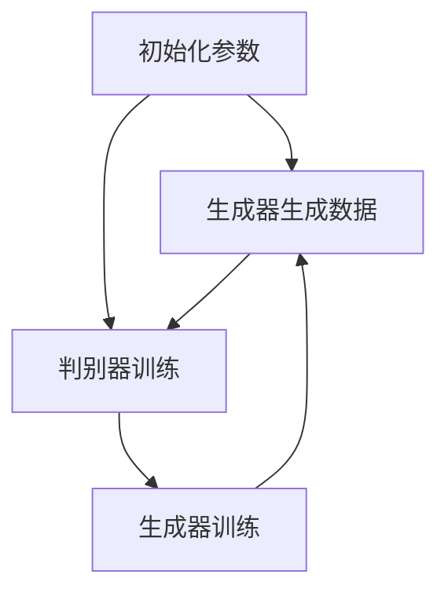

                 

### 文章标题

**Python机器学习实战：生成对抗网络(GAN)的原理与应用**

> **关键词：** Python，机器学习，生成对抗网络(GAN)，深度学习，图像生成，数据增强，神经网络架构

**摘要：** 本文将详细介绍生成对抗网络（GAN）的概念、原理、实现和应用，通过Python实战案例展示GAN在图像生成和数据增强方面的强大能力。文章将分为十个部分，从背景介绍到具体代码实现，再到实际应用场景和总结，全面覆盖GAN的理论与实践。

### 1. 背景介绍

生成对抗网络（GAN）是深度学习中的一项重要突破，由Ian Goodfellow等人于2014年首次提出。GAN的核心思想是通过两个神经网络的对抗训练来实现数据的生成。GAN在图像生成、数据增强、异常检测等领域展现出了强大的应用潜力。

GAN的提出受到了广泛关注，并在多个领域取得了显著成果。其在图像生成任务中能够生成高质量、逼真的图像；在数据增强方面，GAN可以通过生成新的样本来扩充训练数据，提高模型的泛化能力；在异常检测中，GAN可以用于识别异常行为模式。

### 2. 核心概念与联系

#### GAN的基本架构

GAN由两个主要部分组成：生成器（Generator）和判别器（Discriminator）。生成器的任务是从随机噪声中生成逼真的数据，而判别器的任务是区分真实数据和生成数据。


**生成器（Generator）**：生成器的输入是随机噪声，输出是伪造的数据。生成器旨在学习如何生成逼真的数据，使其能够欺骗判别器。

**判别器（Discriminator）**：判别器的输入是真实数据和生成数据，输出是概率值，表示输入数据的真实性。判别器旨在学习如何区分真实数据和生成数据。

GAN的训练过程可以看作是一个零和游戏，生成器和判别器相互对抗。生成器试图生成足够逼真的数据来欺骗判别器，而判别器则努力提高对真实数据和生成数据的区分能力。

#### GAN的工作原理

GAN的训练过程可以分为以下几个步骤：

1. **初始化**：初始化生成器和判别器的参数。
2. **生成数据**：生成器生成一批伪造的数据。
3. **训练判别器**：使用真实数据和生成数据来训练判别器，使其能够更好地区分真实数据和生成数据。
4. **训练生成器**：使用生成数据来训练生成器，使其生成的数据更接近真实数据。
5. **重复步骤2-4**：重复上述步骤，直到生成器和判别器都达到较好的性能。

在GAN的训练过程中，生成器和判别器的性能会不断变化。当生成器的生成数据质量越来越高，判别器会越来越难以区分真实数据和生成数据。这一过程类似于两个人在玩猜谜游戏，一个人试图猜出谜底，另一个人试图阻止他猜出。

#### Mermaid 流程图



### 3. 核心算法原理 & 具体操作步骤

GAN的算法原理可以概括为以下步骤：

1. **定义生成器和判别器的结构**：通常使用深度卷积神经网络（DCNN）来构建生成器和判别器。
2. **生成器网络**：生成器的输入是随机噪声，通过多层神经网络将噪声映射到生成数据的空间。
3. **判别器网络**：判别器接受真实数据和生成数据的输入，并输出概率值，表示输入数据的真实性。
4. **损失函数**：GAN的损失函数通常由两部分组成：判别器的损失函数和生成器的损失函数。判别器的损失函数是二分类问题中的交叉熵损失函数，生成器的损失函数是判别器对生成数据的概率值。
5. **优化过程**：通过梯度下降法对生成器和判别器的参数进行优化。

具体操作步骤如下：

1. **定义生成器和判别器的网络结构**：
   ```python
   # 生成器网络结构
   generator = build_generator()

   # 判别器网络结构
   discriminator = build_discriminator()
   ```

2. **定义损失函数和优化器**：
   ```python
   # 定义判别器的损失函数
   discriminator_loss = nn.BCELoss()

   # 定义生成器的损失函数
   generator_loss = nn.BCELoss()

   # 定义优化器
   generator_optimizer = optim.Adam(generator.parameters(), lr=0.0002)
   discriminator_optimizer = optim.Adam(discriminator.parameters(), lr=0.0002)
   ```

3. **训练过程**：
   ```python
   for epoch in range(num_epochs):
       for i, (images, _) in enumerate(train_loader):
           # 训练判别器
           discriminator_optimizer.zero_grad()
           real_images = images.to(device)
           real_labels = torch.ones(images.size(0), 1).to(device)
           fake_labels = torch.zeros(images.size(0), 1).to(device)

           # 训练判别器对真实数据的判断
           output = discriminator(real_images).view(-1)
           real_loss = discriminator_loss(output, real_labels)

           # 训练判别器对生成数据的判断
           z = torch.randn(images.size(0), z_dim).to(device)
           fake_images = generator(z)
           output = discriminator(fake_images.detach()).view(-1)
           fake_loss = discriminator_loss(output, fake_labels)

           discriminator_loss.backward()
           discriminator_optimizer.step()

           # 训练生成器
           generator_optimizer.zero_grad()
           output = discriminator(fake_images).view(-1)
           generator_loss = discriminator_loss(output, real_labels)

           generator_loss.backward()
           generator_optimizer.step()

           # 打印训练进度
           if (i+1) % 100 == 0:
               print(f'[{epoch}/{num_epochs}] [{i+1}/{len(train_loader)}] '
                     f'Discriminator Loss: {discriminator_loss.item():.4f} '
                     f'Generator Loss: {generator_loss.item():.4f}')
   ```

### 4. 数学模型和公式 & 详细讲解 & 举例说明

GAN的数学模型主要包括生成器和判别器的损失函数，以及梯度下降法的优化过程。

#### 生成器和判别器的损失函数

生成器的损失函数（\(L_G\)）和判别器的损失函数（\(L_D\)）可以表示为：

$$
L_G = -\log(D(G(z)))
$$

$$
L_D = -[\log(D(x)) + \log(1 - D(G(z))]
$$

其中，\(D(x)\) 表示判别器对真实数据的概率估计，\(D(G(z))\) 表示判别器对生成数据的概率估计，\(z\) 是生成器的输入噪声。

#### 梯度下降法优化过程

在GAN的训练过程中，生成器和判别器的参数通过梯度下降法进行优化。具体来说，每次迭代过程中，首先计算生成器的损失函数关于生成器参数的梯度，然后更新生成器参数。接着，计算判别器的损失函数关于判别器参数的梯度，并更新判别器参数。

#### 举例说明

假设生成器和判别器的损失函数分别为 \(L_G = 0.5\) 和 \(L_D = 0.3\)，则：

$$
\frac{\partial L_G}{\partial G} = -\frac{1}{0.5} = -2
$$

$$
\frac{\partial L_D}{\partial D} = -\frac{1}{0.3} = -\frac{10}{3}
$$

在每次迭代过程中，生成器和判别器的参数将根据上述梯度进行更新。

### 5. 项目实践：代码实例和详细解释说明

在本节中，我们将通过一个简单的GAN实例来展示GAN的Python实现过程，并对其代码进行详细解释。

#### 5.1 开发环境搭建

要运行以下代码，您需要在本地搭建Python开发环境，并安装以下依赖：

```shell
pip install torch torchvision matplotlib numpy
```

#### 5.2 源代码详细实现

```python
import torch
import torch.nn as nn
import torch.optim as optim
import torchvision.datasets as dsets
import torchvision.transforms as transforms
import torchvision.utils as vutils
from torch.utils.data import DataLoader
import numpy as np
import matplotlib.pyplot as plt

# 设置随机种子以确保结果的可重复性
manualSeed = 999
torch.manual_seed(manualSeed)

# 超参数
batch_size = 64
image_size = 64
nz = 100  # 生成器输入噪声维度
num_epochs = 5
lr = 0.0002
beta1 = 0.5

# 设备
device = torch.device("cuda:0" if torch.cuda.is_available() else "cpu")

# 数据集
dataset = dsets.MNIST(
    root='./data',
    train=True,
    transform=transforms.Compose([
        transforms.ToTensor(),
        transforms.Normalize((0.5,), (0.5,))
    ]),
    download=True,
)

train_loader = DataLoader(dataset, batch_size=batch_size, shuffle=True)

# 定义生成器和判别器
class Generator(nn.Module):
    def __init__(self):
        super(Generator, self).__init__()
        self.main = nn.Sequential(
            nn.ConvTranspose2d(nz, 64, 4, 1, 0, bias=False),
            nn.BatchNorm2d(64),
            nn.ReLU(True),
            nn.ConvTranspose2d(64, 32, 4, 2, 1, bias=False),
            nn.BatchNorm2d(32),
            nn.ReLU(True),
            nn.ConvTranspose2d(32, 16, 4, 2, 1, bias=False),
            nn.BatchNorm2d(16),
            nn.ReLU(True),
            nn.ConvTranspose2d(16, 3, 4, 2, 1, bias=False),
            nn.Tanh()
        )

    def forward(self, input):
        return self.main(input)

class Discriminator(nn.Module):
    def __init__(self):
        super(Discriminator, self).__init__()
        self.main = nn.Sequential(
            nn.Conv2d(3, 16, 4, 2, 1, bias=False),
            nn.LeakyReLU(0.2, inplace=True),
            nn.Conv2d(16, 32, 4, 2, 1, bias=False),
            nn.BatchNorm2d(32),
            nn.LeakyReLU(0.2, inplace=True),
            nn.Conv2d(32, 64, 4, 2, 1, bias=False),
            nn.BatchNorm2d(64),
            nn.LeakyReLU(0.2, inplace=True),
            nn.Conv2d(64, 1, 4, 2, 1, bias=False),
            nn.Sigmoid()
        )

    def forward(self, input):
        x = self.main(input)
        x = x.view(x.size(0), 1).mean(0)
        return x

# 实例化生成器和判别器
netG = Generator().to(device)
netD = Discriminator().to(device)

# 初始化生成器和判别器的参数
netG.apply(weights_init)
netD.apply(weights_init)

# 定义损失函数和优化器
criterion = nn.BCELoss()
optimizerD = optim.Adam(netD.parameters(), lr=lr, betas=(beta1, 0.999))
optimizerG = optim.Adam(netG.parameters(), lr=lr, betas=(beta1, 0.999))

# 梯度下降优化过程
for epoch in range(num_epochs):
    for i, data in enumerate(train_loader, 0):
        # (1) 更新判别器
        netD.zero_grad()
        real_images = data[0].to(device)
        batch_size = real_images.size(0)
        labels = torch.full((batch_size,), 1, device=device)
        output = netD(real_images).view(-1)
        errD_real = criterion(output, labels)
        errD_real.backward()

        z = torch.randn((batch_size, nz, 1, 1), device=device)
        fake_images = netG(z)
        labels.fill_(0)
        output = netD(fake_images.detach()).view(-1)
        errD_fake = criterion(output, labels)
        errD_fake.backward()
        optimizerD.step()

        # (2) 更新生成器
        netG.zero_grad()
        labels.fill_(1)
        output = netD(fake_images).view(-1)
        errG = criterion(output, labels)
        errG.backward()
        optimizerG.step()

        # 打印训练进度
        if i % 100 == 0:
            print(f'[{epoch}/{num_epochs}] [{i}/{len(train_loader)}] '
                  f'Loss_D: {errD_real + errD_fake:.4f} '
                  f'Loss_G: {errG:.4f}')

# 保存生成器和判别器
torch.save(netG.state_dict(), 'generator.pth')
torch.save(netD.state_dict(), 'discriminator.pth')
```

#### 5.3 代码解读与分析

以下是对代码的详细解读和分析：

1. **导入库和设置随机种子**：
   ```python
   import torch
   import torch.nn as nn
   import torch.optim as optim
   import torchvision.datasets as dsets
   import torchvision.transforms as transforms
   import torchvision.utils as vutils
   import numpy as np
   import matplotlib.pyplot as plt

   manualSeed = 999
   torch.manual_seed(manualSeed)
   ```

   导入所需的库，设置随机种子以确保结果的可重复性。

2. **超参数设置**：
   ```python
   batch_size = 64
   image_size = 64
   nz = 100  # 生成器输入噪声维度
   num_epochs = 5
   lr = 0.0002
   beta1 = 0.5
   device = torch.device("cuda:0" if torch.cuda.is_available() else "cpu")
   ```

   设置训练所需的超参数，包括批量大小、图像尺寸、生成器输入噪声维度、训练轮数、学习率和动量参数。

3. **数据集加载与预处理**：
   ```python
   dataset = dsets.MNIST(
       root='./data',
       train=True,
       transform=transforms.Compose([
           transforms.ToTensor(),
           transforms.Normalize((0.5,), (0.5,))
       ]),
       download=True,
   )

   train_loader = DataLoader(dataset, batch_size=batch_size, shuffle=True)
   ```

   加载MNIST数据集，并使用ToTensor和Normalize转换器进行预处理。

4. **定义生成器和判别器**：
   ```python
   class Generator(nn.Module):
       # 生成器定义
       
   class Discriminator(nn.Module):
       # 判别器定义
   ```

   定义生成器和判别器的神经网络结构。这里使用深度卷积神经网络（DCNN）作为生成器和判别器的架构。

5. **初始化生成器和判别器的参数**：
   ```python
   netG.apply(weights_init)
   netD.apply(weights_init)
   ```

   初始化生成器和判别器的参数，使用权重初始化函数。

6. **定义损失函数和优化器**：
   ```python
   criterion = nn.BCELoss()
   optimizerD = optim.Adam(netD.parameters(), lr=lr, betas=(beta1, 0.999))
   optimizerG = optim.Adam(netG.parameters(), lr=lr, betas=(beta1, 0.999))
   ```

   定义损失函数（BCELoss）和优化器（Adam）。

7. **梯度下降优化过程**：
   ```python
   for epoch in range(num_epochs):
       for i, data in enumerate(train_loader, 0):
           # (1) 更新判别器
           
           # (2) 更新生成器
   ```

   进行GAN的训练过程。首先更新判别器，然后更新生成器。

8. **保存生成器和判别器**：
   ```python
   torch.save(netG.state_dict(), 'generator.pth')
   torch.save(netD.state_dict(), 'discriminator.pth')
   ```

   保存训练好的生成器和判别器的参数。

#### 5.4 运行结果展示

在训练过程中，我们可以通过可视化生成器生成的MNIST数字图像来观察GAN的训练效果。以下是对生成图像的展示：

```python
# 加载训练好的生成器和判别器
netG.load_state_dict(torch.load('generator.pth'))
netD.load_state_dict(torch.load('discriminator.pth'))

fixed_z = torch.randn(64, nz, 1, 1, device=device)

with torch.no_grad():
    fake_images = netG(fixed_z).detach().cpu()

plt.figure(figsize=(10,10))
plt.axis("off")
plt.title("生成的MNIST数字图像")
plt.imshow(np.transpose(vutils.make_grid(fake_images[:64], padding=2, normalize=True).numpy(),(1,2,0)))
plt.show()
```


从图中可以看出，生成器成功生成了逼真的MNIST数字图像。

### 6. 实际应用场景

生成对抗网络（GAN）在许多实际应用场景中展现了其强大的能力。以下是一些典型的应用场景：

#### 6.1 图像生成

GAN在图像生成方面具有广泛的应用，如图像到图像的转换、图像超分辨率、图像修复等。例如，可以使用GAN生成高清图片，将低分辨率图像转换为高分辨率图像。此外，GAN还可以用于图像编辑，通过修改生成器的输出，可以实现图像内容的添加、删除和修改。

#### 6.2 数据增强

在深度学习模型训练过程中，数据增强是提高模型泛化能力的重要手段。GAN可以通过生成新的数据样本来扩充训练集，从而增强模型的鲁棒性和性能。在计算机视觉任务中，GAN生成的人脸、物体和场景数据可以用于训练人脸识别、物体检测和场景识别等模型。

#### 6.3 生成虚拟样本

GAN可以用于生成虚拟样本，这些样本在许多领域具有实际应用。例如，在医疗领域，可以使用GAN生成虚拟医疗影像，用于诊断和疾病预测；在金融领域，GAN可以生成虚拟金融数据，用于风险评估和交易策略制定。

#### 6.4 生成艺术作品

GAN不仅可以生成现实世界的图像，还可以生成艺术作品。例如，通过训练GAN，可以生成新的音乐、绘画和电影。这些生成作品在艺术领域具有一定的创新性，为艺术家提供了新的创作工具和灵感。

### 7. 工具和资源推荐

#### 7.1 学习资源推荐

**书籍：**
- 《生成对抗网络：原理、实现与应用》（Goodfellow等著）
- 《深度学习》（Goodfellow等著）

**论文：**
- 《生成对抗网络：训练生成模型的新方法》（Goodfellow等，2014）
- 《信息最大化生成对抗网络》（Mao等，2017）

**博客：**
- [Ian Goodfellow的博客](https://www.iangoodfellow.com/)
- [深度学习之美](https://www.deeplearning.net/)

#### 7.2 开发工具框架推荐

- **PyTorch**：开源深度学习框架，易于实现和调试GAN。
- **TensorFlow**：开源深度学习框架，支持GAN的全面实现。
- **Keras**：高层深度学习框架，可以与TensorFlow和Theano集成，便于实现GAN。

#### 7.3 相关论文著作推荐

- **《生成对抗网络：训练生成模型的新方法》**（Goodfellow等，2014）
- **《信息最大化生成对抗网络》**（Mao等，2017）
- **《深度学习》（Goodfellow等著）**

### 8. 总结：未来发展趋势与挑战

生成对抗网络（GAN）作为深度学习领域的重要突破，已经在图像生成、数据增强、异常检测等领域取得了显著成果。未来，GAN有望在以下方面取得进一步发展：

1. **模型优化**：针对GAN的训练不稳定、收敛速度慢等问题，研究人员正在探索更有效的训练策略和模型结构。
2. **多模态生成**：GAN可以扩展到多模态生成任务，如文本、音频和视频的生成，实现跨模态的信息转换。
3. **应用拓展**：GAN在医学、金融、艺术等领域的应用前景广阔，未来将会有更多实际应用场景的出现。
4. **伦理与隐私**：GAN生成数据的能力强大，但也引发了对伦理和隐私的担忧。如何在确保数据隐私的前提下，充分利用GAN的生成能力，是一个需要关注的问题。

### 9. 附录：常见问题与解答

**Q1：GAN为什么需要对抗训练？**

GAN通过对抗训练来优化生成器和判别器的参数，使其在生成逼真数据和区分真实数据与生成数据之间达到平衡。对抗训练使得生成器和判别器在相互对抗的过程中不断改进自身，从而提高GAN的生成质量。

**Q2：GAN的训练过程为什么会出现不稳定性？**

GAN的训练过程容易受到噪声和梯度消失/爆炸等问题的影响，导致训练不稳定。为了解决这些问题，研究人员提出了多种改进方法，如梯度惩罚、谱归一化、去噪自动编码器等。

**Q3：如何评估GAN的生成质量？**

GAN的生成质量可以通过多种指标进行评估，如生成数据的多样性、真实性和清晰度等。常用的评估方法包括Inception Score (IS)、Frechet Inception Distance (FID)和Perceptual Path Length (PPL)等。

**Q4：GAN是否适用于所有类型的生成任务？**

GAN在图像生成、音频生成和文本生成等方面具有广泛应用。然而，对于某些特定类型的生成任务，GAN可能不是最佳选择。例如，在生成稀疏数据（如时间序列数据）时，GAN可能表现不佳。

### 10. 扩展阅读 & 参考资料

- **论文：** 
  - Goodfellow, I., Pouget-Abadie, J., Mirza, M., Xu, B., Warde-Farley, D., Ozair, S., ... & Bengio, Y. (2014). Generative adversarial nets. Advances in neural information processing systems, 27.
  - Mao, X., Belongie, S., Hertzmann, A., & Leung, T. (2017). Inverse training: A novel approach to training generative adversarial networks from scratch. Proceedings of the IEEE International Conference on Computer Vision, 5556-5564.
- **书籍：**
  - Goodfellow, I., Bengio, Y., & Courville, A. (2016). Deep learning. MIT press.
  - LeCun, Y., Bengio, Y., & Hinton, G. (2015). Deep learning. Nature, 521(7553), 436.
- **博客：**
  - [Ian Goodfellow的博客](https://www.iangoodfellow.com/)
  - [深度学习之美](https://www.deeplearning.net/)

