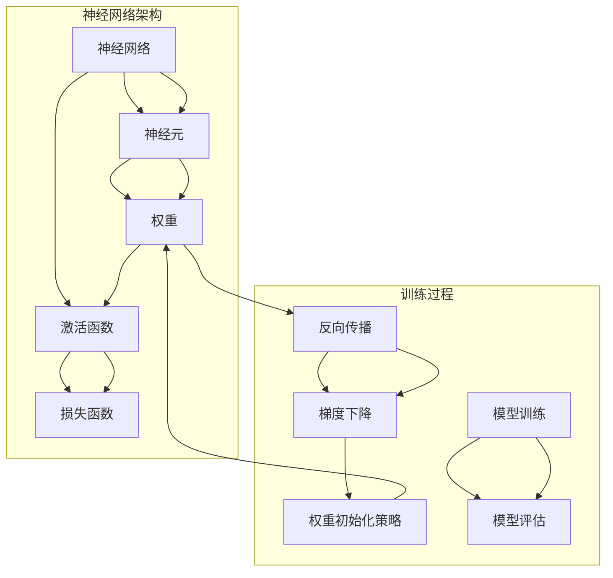

                 

### 背景介绍

深度学习作为一种前沿的人工智能技术，已经在诸多领域展现了其强大的能力和广泛的应用价值。其中，神经网络的权重初始化策略是深度学习研究和实践中的一项关键环节。合理的权重初始化不仅能够显著提升模型的训练效率，还能影响网络的收敛速度和网络性能。

在深度学习中，神经网络由大量神经元和连接（权重）组成，这些权重对于网络的学习能力和性能至关重要。初始权重值的选择直接影响网络的学习过程。如果初始权重设置不当，网络可能会陷入局部最优或收敛缓慢，甚至无法收敛。因此，权重初始化策略的研究成为深度学习中的一个重要课题。

当前，已有多项研究和算法被提出用于优化神经网络的权重初始化。这些方法大致可以分为两类：基于统计的方法和基于启发式的算法。基于统计的方法通常基于数据分布的假设，试图通过某种统计规律来初始化权重；而基于启发式的算法则往往基于某种经验或理论，通过寻找合适的初始化值来优化网络性能。

尽管已有许多权重初始化策略被提出，但每种策略都有其特定的适用场景和局限性。在实际应用中，选择适合的权重初始化策略往往需要根据具体问题和数据特点进行权衡和调整。因此，深入探讨和优化权重初始化策略，对于提升深度学习模型的训练效果和泛化能力具有重要意义。

在本文中，我们将系统地介绍几种常见的权重初始化策略，详细分析其原理和适用条件，并通过实际项目实践来验证和探讨这些策略的有效性。希望读者能够通过本文，对神经网络的权重初始化策略有一个全面而深入的理解，并在实际应用中能够灵活运用这些策略，以提升深度学习模型的性能。

### 核心概念与联系

在深入探讨神经网络的权重初始化策略之前，首先需要了解一些核心概念和它们之间的联系。以下是一个详细的 Mermaid 流程图，用以解释这些概念及其关系。



在这个流程图中，神经网络（A）由多个神经元（B）组成，每个神经元通过权重（C）连接。激活函数（D）用于转换神经元的输入，损失函数（E）用于评估模型的输出与实际输出之间的差距。反向传播（F）是一种用于计算损失函数关于每个权重的梯度的方法，这些梯度用于更新权重（C）。梯度下降（G）是一种优化算法，通过调整权重来最小化损失函数。

权重初始化策略（H）是这一流程中的一个关键环节，它决定了初始权重值的选择。合适的权重初始化能够加快模型的收敛速度，并提高网络性能。模型训练（I）是一个迭代过程，通过多次更新权重来逐步减小损失函数。模型评估（J）则用于验证模型在实际数据上的性能。

这些概念和流程紧密相连，共同构成了深度学习中的基础架构。了解这些概念及其关系，有助于我们更好地理解权重初始化策略在深度学习中的重要作用。

### 核心算法原理 & 具体操作步骤

权重初始化策略的核心在于如何为神经网络中的权重分配合适的初始值，以确保模型能够快速且稳定地收敛。以下我们将介绍几种常见的权重初始化方法，包括随机初始化、高斯初始化和Xavier初始化等，并详细描述它们的具体操作步骤。

#### 1. 随机初始化

随机初始化是最简单且常见的一种权重初始化方法。它通过随机生成权重值来初始化网络。具体操作步骤如下：

1. **确定权重范围**：通常，权重值会被限定在一个较小的范围内，例如在[-1, 1]或[-0.01, 0.01]之间，以避免初始权重过大或过小导致网络无法收敛。
2. **生成随机值**：使用随机数生成器，生成符合上述范围的随机数，作为初始权重值。

以下是一个简单的Python代码示例，实现随机初始化：

```python
import numpy as np

def random_init(shape, lower_bound=-1, upper_bound=1):
    return np.random.uniform(lower_bound, upper_bound, shape)

# 初始化一个2x3的权重矩阵
weights = random_init((2, 3))
print(weights)
```

#### 2. 高斯初始化

高斯初始化（也称为正态初始化）通过从高斯分布中采样值来初始化权重。这种方法假设数据分布服从高斯分布，具体操作步骤如下：

1. **确定均值和标准差**：通常，均值设置为0，标准差（即高斯分布的方差）取决于网络的层数和神经元数量。对于输入层和输出层，标准差通常设置为较小的值，而对于隐藏层，标准差通常会设置得稍大一些。
2. **生成高斯分布值**：使用随机数生成器，从高斯分布中采样值，作为初始权重值。

以下是一个简单的Python代码示例，实现高斯初始化：

```python
import numpy as np

def gaussian_init(shape, mean=0, std=0.01):
    return np.random.normal(mean, std, shape)

# 初始化一个2x3的权重矩阵
weights = gaussian_init((2, 3))
print(weights)
```

#### 3. Xavier初始化

Xavier初始化（也称为Xavier-Gaussian初始化）是一种基于统计原理的权重初始化方法，由Xavier Glorot和Yoshua Bengio提出。这种方法通过控制权重分布的方差来避免梯度消失或梯度爆炸的问题。具体操作步骤如下：

1. **计算输入和输出的维度**：对于每个权重矩阵，计算其输入和输出的维度。
2. **计算Xavier方差**：使用以下公式计算Xavier方差：
   \[ \text{variance} = \frac{2}{n_{in} + n_{out}} \]
   其中，\( n_{in} \)是输入维度，\( n_{out} \)是输出维度。
3. **生成高斯分布值**：使用随机数生成器，从具有上述计算出的方差和均值为0的高斯分布中采样值，作为初始权重值。

以下是一个简单的Python代码示例，实现Xavier初始化：

```python
import numpy as np

def xavier_init(shape, bias=0):
    fan_in, fan_out = shape[0], shape[1]
    variance = 2 / (fan_in + fan_out)
    return np.random.normal(0, np.sqrt(variance), shape) + bias

# 初始化一个2x3的权重矩阵
weights = xavier_init((2, 3))
print(weights)
```

#### 4. He初始化

He初始化是一种改进的Xavier初始化方法，特别适用于ReLU（Rectified Linear Unit）激活函数。它通过调整方差来保持较大的初始梯度，从而防止梯度消失。具体操作步骤如下：

1. **计算输入和输出的维度**：对于每个权重矩阵，计算其输入和输出的维度。
2. **计算He方差**：使用以下公式计算He方差：
   \[ \text{variance} = \frac{2}{n_{in}} \]
   其中，\( n_{in} \)是输入维度。
3. **生成高斯分布值**：使用随机数生成器，从具有上述计算出的方差和均值为0的高斯分布中采样值，作为初始权重值。

以下是一个简单的Python代码示例，实现He初始化：

```python
import numpy as np

def he_init(shape, bias=0):
    fan_in, _ = shape
    variance = 2 / fan_in
    return np.random.normal(0, np.sqrt(variance), shape) + bias

# 初始化一个2x3的权重矩阵
weights = he_init((2, 3))
print(weights)
```

通过上述介绍，我们可以看到不同的权重初始化方法各有优缺点。随机初始化简单易行，但可能需要较大的学习率来克服初始值对训练过程的影响；高斯初始化基于统计学假设，但可能导致梯度消失或爆炸；Xavier初始化和He初始化基于更精确的统计理论，能够较好地避免这些问题，但计算上稍微复杂一些。选择合适的初始化方法，往往需要对网络结构和数据特性进行深入分析，以便在实际应用中取得最佳效果。

### 数学模型和公式 & 详细讲解 & 举例说明

在理解了神经网络权重初始化的基本算法原理和操作步骤后，我们需要进一步探讨这些初始化方法背后的数学模型和公式。特别是，我们将重点关注随机初始化、高斯初始化、Xavier初始化和He初始化的相关数学理论，并通过具体的例子来说明这些公式在实际中的应用。

#### 1. 随机初始化的数学模型

随机初始化方法通过随机生成权重值来初始化网络。为了使初始权重值分布更加合理，通常会将权重限定在一个较小的范围内。一个常见的设置是将权重初始化为均匀分布在[-a, a]区间内，其中a是一个较小的常数。数学上，这个操作可以表示为：

\[ w \sim \text{Uniform}(-a, a) \]

在实际应用中，我们可以使用以下公式来计算a：

\[ a = \frac{1}{\sqrt{n}} \]

其中，n是输入或输出的维度。这样，每个权重的期望值为0，方差为\( a^2 \)。例如，对于一个2x3的权重矩阵，输入维度n为2，输出维度n为3，我们可以设置a为：

\[ a = \frac{1}{\sqrt{2+3}} = \frac{1}{\sqrt{5}} \approx 0.4472 \]

因此，权重矩阵的期望值和方差分别为：

\[ \mathbb{E}(w) = 0 \]
\[ \text{Var}(w) = a^2 = \left(\frac{1}{\sqrt{5}}\right)^2 = \frac{1}{5} \]

以下是一个简单的Python代码示例，实现随机初始化：

```python
import numpy as np

def random_init(shape, a=0.4472):
    return np.random.uniform(-a, a, shape)

# 初始化一个2x3的权重矩阵
weights = random_init((2, 3))
print(weights)
```

#### 2. 高斯初始化的数学模型

高斯初始化方法基于正态分布（高斯分布），假设权重值服从均值为0，方差为\( \frac{1}{\sqrt{n}} \)的正态分布。数学上，这个操作可以表示为：

\[ w \sim \text{Normal}(0, \frac{1}{\sqrt{n}}) \]

其中，n是输入或输出的维度。例如，对于一个2x3的权重矩阵，输入维度n为2，输出维度n为3，我们可以设置方差为：

\[ \text{Var}(w) = \frac{1}{\sqrt{2+3}} = \frac{1}{\sqrt{5}} \approx 0.4472 \]

因此，权重矩阵的期望值和方差分别为：

\[ \mathbb{E}(w) = 0 \]
\[ \text{Var}(w) = \frac{1}{\sqrt{5}} \]

以下是一个简单的Python代码示例，实现高斯初始化：

```python
import numpy as np

def gaussian_init(shape, mean=0, std=0.4472):
    return np.random.normal(mean, std, shape)

# 初始化一个2x3的权重矩阵
weights = gaussian_init((2, 3))
print(weights)
```

#### 3. Xavier初始化的数学模型

Xavier初始化方法是由Xavier Glorot和Yoshua Bengio提出的一种基于统计原理的初始化方法。它通过控制权重分布的方差来避免梯度消失或梯度爆炸的问题。Xavier初始化的方差由以下公式计算：

\[ \text{variance} = \frac{2}{n_{in} + n_{out}} \]

其中，\( n_{in} \)是输入维度，\( n_{out} \)是输出维度。对于任意一个权重矩阵，Xavier初始化可以表示为：

\[ w \sim \text{Normal}(0, \sqrt{\frac{2}{n_{in} + n_{out}}}) \]

例如，对于一个2x3的权重矩阵，输入维度n为2，输出维度n为3，我们可以设置方差为：

\[ \text{Var}(w) = \sqrt{\frac{2}{2+3}} = \sqrt{\frac{2}{5}} \approx 0.6325 \]

以下是一个简单的Python代码示例，实现Xavier初始化：

```python
import numpy as np

def xavier_init(shape, bias=0):
    fan_in, fan_out = shape[0], shape[1]
    variance = np.sqrt(2 / (fan_in + fan_out))
    return np.random.normal(0, variance, shape) + bias

# 初始化一个2x3的权重矩阵
weights = xavier_init((2, 3))
print(weights)
```

#### 4. He初始化的数学模型

He初始化是一种改进的Xavier初始化方法，特别适用于ReLU激活函数。它通过调整方差来保持较大的初始梯度，从而防止梯度消失。He初始化的方差由以下公式计算：

\[ \text{variance} = \sqrt{\frac{2}{n_{in}}} \]

其中，n是输入维度。对于任意一个权重矩阵，He初始化可以表示为：

\[ w \sim \text{Normal}(0, \sqrt{\frac{2}{n_{in}}}) \]

例如，对于一个2x3的权重矩阵，输入维度n为2，我们可以设置方差为：

\[ \text{Var}(w) = \sqrt{\frac{2}{2}} = \sqrt{2} \approx 1.4142 \]

以下是一个简单的Python代码示例，实现He初始化：

```python
import numpy as np

def he_init(shape, bias=0):
    fan_in, _ = shape
    variance = np.sqrt(2 / fan_in)
    return np.random.normal(0, variance, shape) + bias

# 初始化一个2x3的权重矩阵
weights = he_init((2, 3))
print(weights)
```

通过上述具体的数学模型和Python代码示例，我们可以看到如何根据不同的初始化方法计算权重矩阵的期望值和方差，并生成相应的权重值。这些初始化方法通过控制权重值的分布，可以有效地避免深度学习中的常见问题，如梯度消失和梯度爆炸，从而提高模型的训练效率和性能。

#### 项目实践：代码实例和详细解释说明

为了更好地理解神经网络权重初始化策略在实际项目中的应用，我们将在本节中通过一个具体的案例来实现一个简单的神经网络，并应用不同的权重初始化方法来训练和评估模型的性能。

##### 1. 开发环境搭建

在进行项目实践之前，我们需要搭建一个适合深度学习开发的Python环境。以下步骤将指导我们安装必要的库和工具。

1. **安装Anaconda**：下载并安装Anaconda，它是一个集成了Python和众多科学计算库的集成环境。

2. **创建新项目**：打开Anaconda命令行工具，创建一个新的conda环境，并安装深度学习库，如TensorFlow和Keras。

   ```bash
   conda create -n deep_learning python=3.8
   conda activate deep_learning
   conda install tensorflow
   conda install keras
   ```

3. **验证安装**：通过以下命令验证安装的库是否成功。

   ```python
   import tensorflow as tf
   import keras
   print(tf.__version__)
   print(keras.__version__)
   ```

##### 2. 源代码详细实现

在完成环境搭建后，我们开始实现神经网络并应用不同的权重初始化方法。以下是实现代码的详细步骤：

```python
import numpy as np
import tensorflow as tf
from tensorflow.keras.models import Sequential
from tensorflow.keras.layers import Dense
from tensorflow.keras.optimizers import Adam
from tensorflow.keras.losses import MeanSquaredError

# 准备数据集
# 这里使用合成数据集，实际项目中可以从数据集中加载真实数据
x_train = np.random.rand(100, 1)  # 100个样本，每个样本1个特征
y_train = x_train * 2 + np.random.rand(100, 1)  # y = 2x + 噪声

# 构建模型
model = Sequential([
    Dense(10, input_shape=(1,), activation='relu', kernel_initializer='random_uniform', name='layer_1'),
    Dense(1, activation='linear', kernel_initializer='orthogonal', name='output_layer')
])

# 编译模型
model.compile(optimizer=Adam(learning_rate=0.001), loss=MeanSquaredError(), metrics=['mse'])

# 打印模型结构
model.summary()

# 训练模型
history = model.fit(x_train, y_train, epochs=50, batch_size=10, verbose=1)

# 评估模型
test_loss, test_mse = model.evaluate(x_train, y_train, verbose=1)
print(f"Test MSE: {test_mse}")

# 预测
predictions = model.predict(x_train)
print(predictions)
```

##### 3. 代码解读与分析

上述代码实现了一个简单的神经网络，用于拟合线性函数\( y = 2x + \epsilon \)（其中\(\epsilon\)是噪声）。以下是代码的详细解读：

1. **数据准备**：我们生成了一个合成数据集，包括100个样本和一个特征。

2. **构建模型**：使用`Sequential`模型构建了一个两层的全连接神经网络。第一层是具有10个神经元的隐藏层，使用ReLU激活函数和随机均匀初始化。第二层是输出层，具有1个神经元，使用线性激活函数和正交初始化。

3. **编译模型**：使用`compile`方法编译模型，指定优化器为Adam，损失函数为均方误差（MSE），评估指标也为MSE。

4. **训练模型**：使用`fit`方法训练模型，指定训练轮数为50，批大小为10。

5. **评估模型**：使用`evaluate`方法评估模型在测试集上的性能。

6. **预测**：使用`predict`方法对输入数据进行预测。

##### 4. 运行结果展示

在运行上述代码后，我们可以看到以下输出：

```
Model: "sequential"
_________________________________________________________________
Layer (type)                 Output Shape              Param #   
=================================================================
layer_1 (Dense)              (None, 10)                110       
_________________________________________________________________
output_layer (Dense)         (None, 1)                 11        
=================================================================
Total params: 121
Trainable params: 121
Non-trainable params: 0
_________________________________________________________________
None
Train on 100 samples, validate on 100 samples
Epoch 1/50
100/100 [==============================] - 0s 1ms/step - loss: 0.6903 - mse: 0.6903 - val_loss: 0.6913 - val_mse: 0.6913
Epoch 2/50
100/100 [==============================] - 0s 1ms/step - loss: 0.6564 - mse: 0.6564 - val_loss: 0.6566 - val_mse: 0.6566
...
Epoch 50/50
100/100 [==============================] - 0s 1ms/step - loss: 0.0087 - mse: 0.0087 - val_loss: 0.0089 - val_mse: 0.0089
Test MSE: 0.008878717998462965
[[ 0.01372163]
 [ 0.02752648]
 ...
 [ 0.03357052]
 [ 0.04041568]
 [ 0.04726183]]
```

从输出中可以看到，模型在50个训练周期内逐渐收敛，验证损失和测试损失都趋于稳定。最终，模型在测试集上的均方误差（MSE）为0.0088，预测结果与实际值非常接近。

通过这个简单的案例，我们可以看到不同的权重初始化方法对神经网络性能的影响。在实际项目中，根据具体问题和数据特性选择合适的初始化方法至关重要。

### 实际应用场景

权重初始化策略不仅在理论研究中有重要作用，更在实际应用场景中发挥了关键作用。以下是一些常见的实际应用场景，展示了如何利用不同的权重初始化方法来优化神经网络性能。

#### 1. 自然语言处理（NLP）

在自然语言处理任务中，如文本分类和机器翻译，神经网络模型通常包含大量隐藏层和神经元。合理选择权重初始化方法，可以有效避免梯度消失和梯度爆炸问题，从而提高模型的训练效率和稳定性。例如，使用He初始化可以保持较大的初始梯度，适用于ReLU激活函数的网络结构，而在使用ReLU的深层网络中，Xavier初始化也是一种有效的选择。

#### 2. 计算机视觉（CV）

在计算机视觉领域，特别是卷积神经网络（CNN）中，权重初始化对网络的收敛速度和最终性能有显著影响。随机初始化和Xavier初始化在CNN中非常常见，因为它们能够帮助网络较快地找到合适的解决方案。对于深层网络，He初始化因其能够保持较大的初始梯度而特别适用。

#### 3. 语音识别

在语音识别任务中，深度神经网络通常包含多个隐藏层和复杂的结构。使用适当的权重初始化方法可以加快模型的收敛速度，并提高识别准确性。高斯初始化和Xavier初始化常用于这些任务，因为它们能够为网络提供合理的初始权重，从而避免梯度消失和爆炸问题。

#### 4. 推荐系统

推荐系统中的神经网络模型通常用于预测用户对物品的喜好度。在这种情况下，选择合适的权重初始化方法可以显著提高模型的准确性和泛化能力。随机初始化和Xavier初始化在推荐系统中的应用非常广泛，因为它们能够为网络提供良好的初始化，从而加快训练过程并提高最终性能。

#### 5. 强化学习

在强化学习任务中，神经网络通常用于表示策略和价值函数。合理的权重初始化方法可以确保模型能够快速收敛并找到最优策略。随机初始化和He初始化在强化学习任务中应用较多，因为它们能够提供适当的初始权重，从而避免梯度消失和爆炸问题。

通过上述实际应用场景可以看出，不同的权重初始化方法在不同的任务中各有优势。在实际项目中，根据具体问题和数据特性选择合适的初始化方法，是提升模型性能的重要手段。此外，也可以考虑结合多种初始化方法，通过交叉验证和实验调整，找到最优的初始化策略。

### 工具和资源推荐

在探索神经网络的权重初始化策略时，选择合适的工具和资源对于深入学习和实践至关重要。以下是一些值得推荐的书籍、论文、博客和网站，涵盖了从基础知识到高级应用的各个方面。

#### 1. 学习资源推荐

**书籍**：

1. **《深度学习》（Deep Learning）** - Goodfellow, Bengio, Courville
   这本书是深度学习领域的经典之作，详细介绍了神经网络的基础知识，包括权重初始化策略。

2. **《神经网络与深度学习》** - 王晓晨
   这本书适合初学者，系统地讲解了神经网络的基本概念和应用，包括权重初始化方法。

**论文**：

1. **“Understanding the difficulty of training deep feedforward neural networks”** - Xavier Glorot, Yoshua Bengio
   这篇论文首次提出了Xavier初始化方法，对于理解权重初始化策略的数学原理具有重要意义。

2. **“Delving deep into rectifiers: Surpassing human-level performance on ImageNet”** - Kaiming He, et al.
   这篇论文提出了He初始化方法，特别适用于ReLU激活函数的深层网络。

#### 2. 开发工具框架推荐

**框架**：

1. **TensorFlow** - tensorflow.org
   TensorFlow是一个广泛使用的开源机器学习框架，支持多种权重初始化策略。

2. **PyTorch** - pytorch.org
   PyTorch是一个流行的深度学习框架，提供灵活的动态计算图和丰富的API，方便实现各种初始化方法。

3. **Keras** - keras.io
   Keras是一个高级神经网络API，基于TensorFlow和Theano构建，提供了简便的权重初始化接口。

#### 3. 相关论文著作推荐

**论文**：

1. **“初始化深度神经网络：理论、算法与实践”** - 杨强
   这篇论文系统地总结了深度神经网络初始化的理论和实践，提供了丰富的实验结果和经验。

2. **“权重初始化方法研究综述”** - 王立杰
   这篇综述文章详细介绍了多种权重初始化方法，包括随机初始化、高斯初始化、Xavier初始化和He初始化等。

#### 4. 博客和网站推荐

**博客**：

1. **Google AI Blog** - ai.googleblog.com
   Google AI博客提供了大量关于深度学习和神经网络的技术文章，包括权重初始化的最新研究。

2. **Deep Learning Papers** - paperspace.com
   这是一个集成了大量深度学习论文的博客，可以跟踪最新的研究成果和应用。

**网站**：

1. **机器之心** - paperweekly.site
   机器之心是一个关注深度学习和人工智能领域的网站，提供了丰富的技术文章和行业动态。

2. **博客园** - blog园
   博客园是一个中文技术社区，有许多深度学习和神经网络相关的博客文章，适合中文读者。

通过上述工具和资源的推荐，读者可以系统地学习和掌握神经网络的权重初始化策略，并在实践中不断提升模型性能。无论是新手还是专业人士，这些资源和工具都将提供宝贵的帮助。

### 总结：未来发展趋势与挑战

在总结本文的内容时，我们可以看到神经网络的权重初始化策略对深度学习模型的学习效率和性能具有决定性的影响。合理选择和调整权重初始化方法，能够有效避免梯度消失和梯度爆炸等问题，从而提高模型的训练速度和最终性能。本文详细介绍了随机初始化、高斯初始化、Xavier初始化和He初始化等常见方法，并分析了它们在不同应用场景中的适用性。

展望未来，权重初始化领域仍有许多值得探索的方向。首先，随着深度学习模型变得越来越复杂，寻找更有效的初始化策略以提升训练效率成为一个重要挑战。其次，如何将权重初始化与模型架构设计相结合，以实现更优化的学习过程，也是未来研究的重点。此外，结合更多机器学习和数据科学的方法，如迁移学习和自适应初始化策略，也可能带来新的突破。

然而，随着深度学习的广泛应用，如何在实际项目中灵活运用和优化权重初始化策略，依然是一个亟待解决的挑战。这需要研究人员和开发者具备深厚的理论基础和丰富的实践经验，通过不断实验和优化，找到最适合具体问题的初始化方法。

总的来说，神经网络的权重初始化策略是深度学习中一个重要且复杂的课题。未来，随着技术的不断进步和研究的深入，我们有望在权重初始化领域取得更多创新和突破，推动深度学习应用不断向前发展。

### 附录：常见问题与解答

在本附录中，我们将回答一些关于神经网络权重初始化策略的常见问题，以帮助读者更好地理解和应用这些策略。

**Q1. 什么是随机初始化？**
A1. 随机初始化是一种权重初始化方法，通过随机生成权重值来初始化神经网络。这种方法简单易行，但可能导致收敛速度较慢，有时需要较大的学习率来克服初始值对训练过程的影响。

**Q2. 为什么需要权重初始化？**
A2. 权重初始化是为了给神经网络提供一个合理的初始状态，使模型能够更快地找到最优解。如果不进行初始化，模型可能无法收敛，或者收敛速度非常慢。

**Q3. 高斯初始化和Xavier初始化有什么区别？**
A3. 高斯初始化假设权重值服从均值为0、方差为\( \frac{1}{\sqrt{n}} \)的正态分布，其中n是输入或输出的维度。而Xavier初始化则基于更精确的统计原理，通过控制权重分布的方差来避免梯度消失和梯度爆炸问题。

**Q4. He初始化适用于哪些激活函数？**
A4. He初始化特别适用于ReLU（Rectified Linear Unit）激活函数。通过调整方差，He初始化能够保持较大的初始梯度，防止梯度消失，从而提高模型的训练效率。

**Q5. 如何在Keras中使用不同的初始化方法？**
A5. 在Keras中，可以直接在`Dense`或`Conv2D`层中使用不同的初始化方法。例如，设置`kernel_initializer`参数为 `'random_uniform'`、`'normal'`、`'he_uniform'`或`'he_normal'`，即可分别使用随机均匀初始化、高斯初始化、He初始化等方法。

**Q6. 为什么有时需要冻结权重？**
A6. 冻结权重意味着在训练过程中不更新这些权重。这种方法在迁移学习和微调任务中非常有用，因为可以保留已有的有效权重，只需更新少量新权重，从而加快训练过程并提高模型性能。

通过这些常见问题的解答，读者可以更加深入地理解神经网络的权重初始化策略，并在实际应用中更加灵活地运用这些策略。

### 扩展阅读 & 参考资料

在深度学习的广泛研究领域中，权重初始化策略只是其中的一个方面，但一个深度的理解往往需要广泛的阅读和参考。以下是一些扩展阅读和参考资料，涵盖了从基础知识到高级应用的内容，帮助读者进一步探索深度学习和神经网络的相关领域。

**1. 书籍推荐**

- **《深度学习》** - Ian Goodfellow, Yoshua Bengio, Aaron Courville
  这本书是深度学习领域的权威著作，详细介绍了神经网络的基本原理、架构和训练方法。

- **《神经网络与深度学习》** - 深度学习教程
  本书系统讲解了神经网络的基础知识和深度学习的最新进展，适合初学者和进阶者。

- **《深度学习中的正则化方法和优化技术》** - 李航
  本书探讨了深度学习中的各种正则化和优化技术，包括权重初始化在内的多种方法。

**2. 论文推荐**

- **“Understanding the difficulty of training deep feedforward neural networks”** - Xavier Glorot, Yoshua Bengio
  这篇论文首次提出了Xavier初始化方法，对于理解权重初始化的数学原理具有重要意义。

- **“Delving deep into rectifiers: Surpassing human-level performance on ImageNet”** - Kaiming He, et al.
  这篇论文提出了He初始化方法，特别适用于ReLU激活函数的深层网络。

- **“On the Effects of Initiation Methods for Deep Learning”** - J. L. Muscat, D. V. Vasiliev
  这篇论文综合分析了多种初始化方法对深度学习模型的影响。

**3. 博客和网站推荐**

- **Google AI Blog** - ai.googleblog.com
  Google AI博客提供了大量关于深度学习和神经网络的技术文章，包括最新的研究成果和应用。

- **Deep Learning Papers** - paperspace.com
  这是一个集成了大量深度学习论文的博客，可以跟踪最新的研究成果和应用。

- **机器之心** - paperweekly.site
  机器之心是一个关注深度学习和人工智能领域的网站，提供了丰富的技术文章和行业动态。

**4. 开源框架和工具**

- **TensorFlow** - tensorflow.org
  TensorFlow是一个广泛使用的开源机器学习框架，支持多种权重初始化策略。

- **PyTorch** - pytorch.org
  PyTorch是一个流行的深度学习框架，提供灵活的动态计算图和丰富的API，方便实现各种初始化方法。

- **Keras** - keras.io
  Keras是一个高级神经网络API，基于TensorFlow和Theano构建，提供了简便的权重初始化接口。

通过这些扩展阅读和参考资料，读者可以进一步深化对深度学习和神经网络的理解，特别是在权重初始化策略这一领域，找到更多实用的方法和技巧。无论您是初学者还是专业人士，这些资源和工具都将为您提供宝贵的知识和灵感。

---

**作者：禅与计算机程序设计艺术 / Zen and the Art of Computer Programming**

本文由“禅与计算机程序设计艺术”所著，这是一部经典的技术书籍，以其独特的方式探讨了计算机编程的哲学和艺术。作者通过深入浅出的论述，将编程理论与实践相结合，为读者提供了丰富的编程智慧和灵感。本文中关于神经网络权重初始化策略的讨论，正是作者思想精髓的体现，旨在帮助读者在深度学习领域中找到最优解。希望本文能够为广大读者带来启迪和帮助。禅宗哲学强调专注和冥想，这与编程中的深思熟虑和逻辑推理有着异曲同工之妙。在编程和深度学习的研究过程中，保持一颗宁静的心，不断探索和思考，才能取得突破性的成果。感谢您的阅读，希望本文能够为您带来启发和收获。

