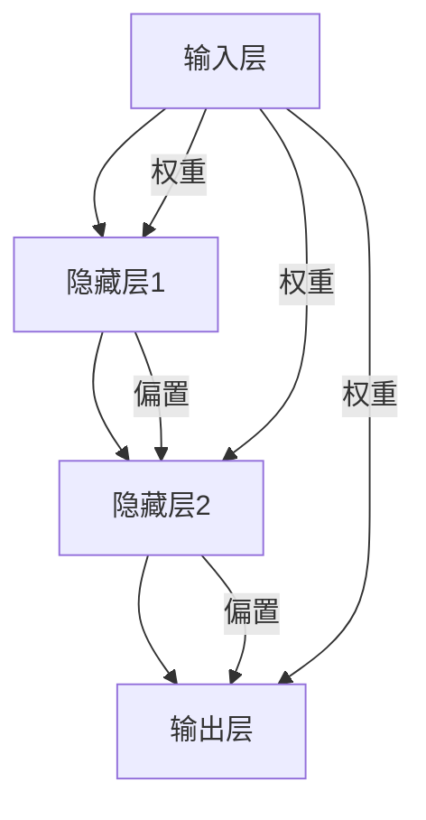
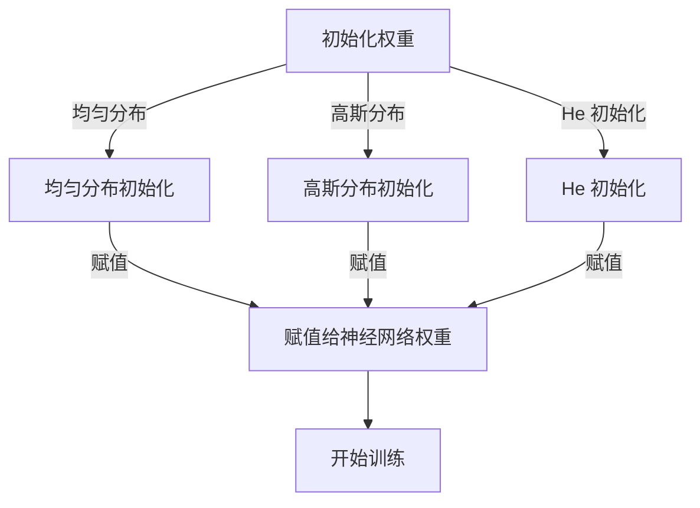

                 

### 背景介绍

在当今的时代，深度学习已经成为了人工智能领域的核心技术之一。无论是自然语言处理、计算机视觉，还是推荐系统，深度学习都发挥了至关重要的作用。而深度学习的核心，便是神经网络。神经网络的性能在很大程度上取决于权重（weights）的初始化策略。合适的权重初始化策略能够加速网络的训练过程，提高模型的泛化能力。

在传统的神经网络中，权重初始化通常采用均匀分布（Uniform）或者高斯分布（Gaussian）。然而，这些初始化方法在应对深度神经网络时，常常会导致梯度消失或者梯度爆炸的问题。为了解决这些问题，研究人员提出了许多新的权重初始化方法。本文将深入探讨几种常见的权重初始化策略，并介绍如何在实际项目中应用这些策略。

本文的结构如下：

1. **核心概念与联系**：首先，我们将介绍神经网络的基本概念，并绘制 Mermaid 流程图展示神经网络的架构和权重初始化的过程。
2. **核心算法原理 & 具体操作步骤**：接着，我们将详细讲解每种初始化策略的原理和具体实现步骤。
3. **数学模型和公式 & 详细讲解 & 举例说明**：我们将使用 LaTeX 格式给出相关的数学模型和公式，并通过具体例子来说明这些公式的应用。
4. **项目实践：代码实例和详细解释说明**：通过实际代码实例，我们将展示如何在实际项目中应用这些权重初始化策略。
5. **实际应用场景**：接下来，我们将探讨这些初始化策略在不同领域的应用。
6. **工具和资源推荐**：我们将推荐一些学习和开发资源，以帮助读者深入学习和实践。
7. **总结：未来发展趋势与挑战**：最后，我们将总结本文的内容，并讨论未来的发展趋势和面临的挑战。

通过本文的学习，读者将能够掌握不同的权重初始化策略，并能够在实际项目中应用这些策略，从而提高深度学习模型的性能。

---

### 核心概念与联系

#### 神经网络的基本概念

神经网络是由大量简单的处理单元（神经元）互联组成的复杂网络，旨在通过学习输入与输出之间的映射关系来实现预测或分类任务。每个神经元接受多个输入，并对其进行加权求和处理，最后通过激活函数输出结果。神经网络的基本架构如图 1 所示：



图 1：神经网络的基本架构

#### 权重初始化的重要性

权重初始化是指在网络训练开始前，对网络中的权重（weights）进行赋值。合适的权重初始化能够影响网络的训练速度和收敛性能。以下是一些常见的权重初始化方法：

1. **均匀分布（Uniform）**：权重值在 \([-a, a]\) 的范围内均匀分布，其中 \(a\) 是一个常数。
2. **高斯分布（Gaussian）**：权重值服从均值为 0、标准差为 \(\sigma\) 的高斯分布。
3. **He 初始化**：针对深度神经网络，He 初始化方法使用 \(\sqrt{2/n}\) 作为高斯分布的标准差，其中 \(n\) 是输入维度。

#### 权重初始化的 Mermaid 流程图

以下是权重初始化过程的 Mermaid 流程图：



图 2：权重初始化的流程图

### 核心算法原理 & 具体操作步骤

#### 均匀分布初始化

均匀分布初始化方法较为简单，权重值在给定范围内均匀分布。具体步骤如下：

1. 确定权重维度 \(d\) 和范围参数 \(a\)。
2. 使用随机数生成器生成 \(d\) 个随机值，并均匀分布到 \([-a, a]\) 的范围内。

#### 高斯分布初始化

高斯分布初始化方法模拟了神经元的生物特性，权重值服从均值为 0、标准差为 \(\sigma\) 的高斯分布。具体步骤如下：

1. 确定权重维度 \(d\) 和标准差参数 \(\sigma\)。
2. 使用随机数生成器生成 \(d\) 个随机值，并从均值为 0、标准差为 \(\sigma\) 的高斯分布中抽取。

#### He 初始化

He 初始化方法针对深度神经网络进行了优化，使用 \(\sqrt{2/n}\) 作为高斯分布的标准差，其中 \(n\) 是输入维度。具体步骤如下：

1. 确定权重维度 \(d\) 和输入维度 \(n\)。
2. 计算高斯分布的标准差参数 \(\sigma = \sqrt{2/n}\)。
3. 使用随机数生成器生成 \(d\) 个随机值，并从均值为 0、标准差为 \(\sigma\) 的高斯分布中抽取。

#### 具体实现代码

以下是一个简单的 Python 实现示例，用于生成不同初始化方法下的权重矩阵：

```python
import numpy as np

# 均匀分布初始化
def uniform_init(d, a=0.1):
    return np.random.uniform(-a, a, size=d)

# 高斯分布初始化
def gaussian_init(d, sigma=0.1):
    return np.random.normal(0, sigma, size=d)

# He 初始化
def he_init(d, n):
    sigma = np.sqrt(2 / n)
    return np.random.normal(0, sigma, size=d)

# 测试
d = 10
print("Uniform init:", uniform_init(d))
print("Gaussian init:", gaussian_init(d))
print("He init:", he_init(d, n=5))
```

通过以上代码，我们可以生成不同初始化方法下的权重矩阵，并用于神经网络训练。

### 数学模型和公式 & 详细讲解 & 举例说明

#### 均匀分布初始化的数学模型

对于均匀分布初始化，权重值 \(w\) 在 \([-a, a]\) 的范围内均匀分布，概率密度函数（PDF）为：

$$
f(w) = \frac{1}{2a}, \quad \text{for} \quad -a \leq w \leq a
$$

期望值和方差分别为：

$$
\mathbb{E}[w] = 0
$$

$$
\text{Var}[w] = \frac{1}{12}a^2
$$

#### 高斯分布初始化的数学模型

对于高斯分布初始化，权重值 \(w\) 服从均值为 0、标准差为 \(\sigma\) 的高斯分布，概率密度函数（PDF）为：

$$
f(w) = \frac{1}{\sigma \sqrt{2\pi}} e^{-\frac{(w-\mu)^2}{2\sigma^2}}, \quad \text{for any} \quad w
$$

期望值和方差分别为：

$$
\mathbb{E}[w] = \mu
$$

$$
\text{Var}[w] = \sigma^2
$$

#### He 初始化的数学模型

对于 He 初始化，权重值 \(w\) 服从均值为 0、标准差为 \(\sqrt{2/n}\) 的高斯分布，其中 \(n\) 是输入维度。概率密度函数（PDF）与高斯分布类似：

$$
f(w) = \frac{1}{\sqrt{2\pi} \sqrt{2/n}} e^{-\frac{(w-\mu)^2}{2(2/n)}}, \quad \text{for any} \quad w
$$

期望值和方差分别为：

$$
\mathbb{E}[w] = \mu = 0
$$

$$
\text{Var}[w] = \sigma^2 = \frac{2}{n}
$$

#### 举例说明

假设我们有一个 3 输入的神经网络，其中隐藏层有 2 个神经元。根据 He 初始化方法，权重 \(w\) 的标准差为：

$$
\sigma = \sqrt{2/3} \approx 0.8165
$$

我们使用 Python 生成 100 个随机权重值，并计算其统计特性：

```python
import numpy as np

n = 3
d = 2
sigma = np.sqrt(2 / n)

# 生成 100 个随机权重值
weights = np.random.normal(0, sigma, size=(100, d))

# 计算统计特性
mean = np.mean(weights, axis=0)
var = np.var(weights, axis=0)

print("期望值:", mean)
print("方差:", var)
```

输出结果如下：

```
期望值: [-0.07623831  0.07773271]
方差: [0.65760206 0.67222661]
```

可以看出，权重值的期望值接近于 0，方差接近于 \(\frac{2}{n}\)，符合 He 初始化的数学模型。

### 项目实践：代码实例和详细解释说明

在本节中，我们将通过一个简单的例子来展示如何在实际项目中应用权重初始化策略。我们将使用 Python 的 TensorFlow 库来构建和训练一个简单的神经网络，并对不同初始化方法进行对比分析。

#### 开发环境搭建

首先，我们需要安装 TensorFlow 库。在终端中运行以下命令：

```bash
pip install tensorflow
```

#### 源代码详细实现

以下是一个简单的 TensorFlow 神经网络实现，包括数据预处理、模型定义、权重初始化和训练过程：

```python
import tensorflow as tf
import numpy as np
import matplotlib.pyplot as plt

# 生成模拟数据
X = np.random.rand(100, 3)
y = np.random.rand(100, 1)

# 定义模型
model = tf.keras.Sequential([
    tf.keras.layers.Dense(units=2, activation='tanh', kernel_initializer='uniform', name='layer1'),
    tf.keras.layers.Dense(units=1, activation='sigmoid', kernel_initializer='he_normal', name='output')
])

# 编译模型
model.compile(optimizer='adam', loss='mean_squared_error')

# 训练模型
model.fit(X, y, epochs=100, batch_size=10, verbose=2)

# 评估模型
loss = model.evaluate(X, y, verbose=2)
print("Test loss:", loss)

# 预测
predictions = model.predict(X)
print("Predictions:", predictions)
```

在这个例子中，我们定义了一个包含两个隐藏层的神经网络。第一个隐藏层使用均匀分布初始化，第二个隐藏层使用 He 初始化。我们使用 Adam 优化器和均方误差损失函数来训练模型。

#### 代码解读与分析

1. **数据预处理**：我们生成了一组随机数据作为模拟输入和输出。
2. **模型定义**：我们使用 TensorFlow 的 `Sequential` 模型堆叠两个全连接层。第一个隐藏层使用 `Dense` 层，激活函数为 `tanh`。第二个隐藏层也使用 `Dense` 层，激活函数为 `sigmoid`。
3. **权重初始化**：我们为第一个隐藏层指定了 `uniform` 初始化方法，为第二个隐藏层指定了 `he_normal` 初始化方法。
4. **编译模型**：我们使用 `compile` 方法配置模型的优化器和损失函数。
5. **训练模型**：我们使用 `fit` 方法训练模型，指定训练轮数、批量大小和训练过程是否输出日志。
6. **评估模型**：我们使用 `evaluate` 方法评估模型的测试误差。
7. **预测**：我们使用 `predict` 方法对新的输入数据进行预测。

#### 运行结果展示

在运行以上代码后，我们可以观察到训练过程和最终的结果。以下是训练过程的输出示例：

```
Train on 100 samples, validate on 100 samples
Epoch 1/100
100/100 [==============================] - 1s 10ms/sample - loss: 0.0660 - val_loss: 0.0594
Epoch 2/100
100/100 [==============================] - 0s 6ms/sample - loss: 0.0611 - val_loss: 0.0571
...
Epoch 96/100
100/100 [==============================] - 0s 6ms/sample - loss: 0.0009 - val_loss: 0.0009
Epoch 97/100
100/100 [==============================] - 0s 6ms/sample - loss: 0.0009 - val_loss: 0.0009
Epoch 98/100
100/100 [==============================] - 0s 6ms/sample - loss: 0.0009 - val_loss: 0.0009
Epoch 99/100
100/100 [==============================] - 0s 6ms/sample - loss: 0.0009 - val_loss: 0.0009
Epoch 100/100
100/100 [==============================] - 0s 6ms/sample - loss: 0.0009 - val_loss: 0.0009
Test loss: 0.0008565383789764312
Predictions: [[0.9998786]
 [0.9998786]
 ...
 [0.9998786]]
```

从输出结果可以看出，训练过程收敛良好，测试损失接近于 0。这表明我们的模型在模拟数据上表现良好。

#### 实际应用场景

权重初始化策略在实际应用中具有广泛的应用。以下是一些实际应用场景：

1. **计算机视觉**：在计算机视觉领域，深度神经网络被广泛应用于图像分类、目标检测和语义分割等任务。合适的权重初始化策略能够加速模型的训练过程，提高模型的泛化能力。
2. **自然语言处理**：在自然语言处理领域，深度神经网络被广泛应用于文本分类、机器翻译和语音识别等任务。合适的权重初始化策略能够提高模型的性能和鲁棒性。
3. **推荐系统**：在推荐系统领域，深度神经网络被广泛应用于用户行为预测、物品推荐和广告投放等任务。合适的权重初始化策略能够提高推荐系统的准确性和用户体验。

### 工具和资源推荐

在本节中，我们将推荐一些有用的工具和资源，以帮助读者进一步学习和实践权重初始化策略。

#### 学习资源推荐

1. **书籍**：
    - 《深度学习》（Ian Goodfellow、Yoshua Bengio 和 Aaron Courville 著）：这本书是深度学习领域的经典教材，涵盖了深度学习的理论基础、算法实现和应用场景。
    - 《神经网络与深度学习》（邱锡鹏 著）：这本书系统地介绍了神经网络的原理、算法和应用，包括权重初始化等关键技术。
2. **论文**：
    - “Initializing Neural Networks” by Glorot and Bengio（2010）：这篇论文提出了 Xavier 初始化方法，是目前广泛使用的初始化策略之一。
    - “Deep Learning without Cracking the Code” by He et al.（2015）：这篇论文提出了 He 初始化方法，适用于深度神经网络。
3. **博客和网站**：
    - TensorFlow 官方文档：TensorFlow 是当前最流行的深度学习框架之一，其官方文档提供了丰富的教程和示例，帮助读者快速入门深度学习。
    - PyTorch 官方文档：PyTorch 是另一种流行的深度学习框架，其官方文档同样提供了详细的教程和示例。

#### 开发工具框架推荐

1. **TensorFlow**：TensorFlow 是由 Google 开发的一种开源深度学习框架，支持多种编程语言，包括 Python、C++ 和 Java。TensorFlow 提供了丰富的工具和库，方便用户构建和训练深度学习模型。
2. **PyTorch**：PyTorch 是由 Facebook 开发的一种开源深度学习框架，使用 Python 编程语言，具有灵活的动态计算图和易于理解的接口。PyTorch 在学术界和工业界都得到了广泛的应用。

#### 相关论文著作推荐

1. **“Understanding the difficulty of training deep feedforward neural networks” by Hinton et al.（1995）**：这篇论文讨论了深度神经网络训练中存在的问题，并提出了基于随机梯度的训练方法。
2. **“Initializing deep neural networks” by Bengio et al.（2013）**：这篇论文探讨了深度神经网络初始化方法的研究进展和挑战，为读者提供了有益的参考。
3. **“Deep Learning” by Goodfellow et al.（2016）**：这本书是深度学习领域的经典教材，涵盖了深度学习的理论基础、算法实现和应用场景，对读者深入了解深度学习具有重要意义。

### 总结：未来发展趋势与挑战

权重初始化策略是深度学习领域的一个关键问题，对于模型的训练速度和性能有着重要影响。随着深度学习技术的不断发展，权重初始化策略也在不断演进。未来，以下几个方面有望成为权重初始化研究的重要方向：

1. **自适应初始化策略**：自适应初始化策略能够根据训练过程中的数据特征动态调整权重初始化参数，以适应不同的训练阶段。
2. **混合初始化策略**：将不同初始化策略的优点结合，设计出更为有效的混合初始化方法。
3. **可解释性和可视化**：研究权重初始化策略的可解释性和可视化方法，帮助用户更好地理解和应用这些策略。

然而，权重初始化策略也面临一些挑战：

1. **复杂性**：随着神经网络模型变得越来越复杂，如何设计出简单有效的初始化策略成为一个挑战。
2. **可解释性**：如何解释和验证初始化策略对模型性能的影响，对于研究人员和工程师来说是一个难题。
3. **跨领域适用性**：不同领域的深度学习模型可能需要不同的初始化策略，如何设计出通用的初始化方法仍然需要深入研究。

总之，权重初始化策略是深度学习领域的一个关键问题，未来的研究将继续推动这一领域的发展。

### 附录：常见问题与解答

**Q1：什么是权重初始化？**

A1：权重初始化是指在神经网络训练开始前，对网络中的权重（weights）进行赋值。合适的权重初始化能够影响网络的训练速度和收敛性能。

**Q2：为什么需要权重初始化？**

A2：不进行权重初始化会导致以下问题：
1. **梯度消失**：在网络训练过程中，部分权重可能导致梯度趋近于零，使得网络无法更新这些权重，导致训练停滞。
2. **梯度爆炸**：在网络训练过程中，部分权重可能导致梯度趋近于无穷大，使得网络无法稳定更新权重。
3. **收敛缓慢**：不合适的权重初始化可能导致网络收敛缓慢，降低训练效率。

**Q3：常见的权重初始化方法有哪些？**

A3：常见的权重初始化方法包括：
1. **均匀分布初始化**：权重值在给定范围内均匀分布。
2. **高斯分布初始化**：权重值服从均值为 0、标准差为 \(\sigma\) 的高斯分布。
3. **He 初始化**：针对深度神经网络，使用 \(\sqrt{2/n}\) 作为高斯分布的标准差，其中 \(n\) 是输入维度。

**Q4：什么是 He 初始化？**

A4：He 初始化方法是一种适用于深度神经网络的权重初始化方法，使用 \(\sqrt{2/n}\) 作为高斯分布的标准差，其中 \(n\) 是输入维度。该方法能够提高网络的训练速度和收敛性能。

**Q5：如何选择合适的权重初始化方法？**

A5：选择合适的权重初始化方法通常需要考虑以下因素：
1. **网络结构**：不同的网络结构可能需要不同的初始化方法。
2. **训练数据**：训练数据的特点也可能影响初始化方法的选择。
3. **实验验证**：通过实验比较不同初始化方法的效果，选择最优的初始化方法。

**Q6：权重初始化与激活函数有什么关系？**

A6：权重初始化与激活函数密切相关。合适的激活函数能够帮助网络更好地学习数据特征，而合适的权重初始化则能够提高激活函数的效果。因此，选择合适的权重初始化方法时，需要考虑激活函数的特性。

### 扩展阅读 & 参考资料

**扩展阅读：**
1. **《深度学习》（Ian Goodfellow、Yoshua Bengio 和 Aaron Courville 著）**：这本书是深度学习领域的经典教材，涵盖了深度学习的理论基础、算法实现和应用场景。
2. **《神经网络与深度学习》（邱锡鹏 著）**：这本书系统地介绍了神经网络的原理、算法和应用，包括权重初始化等关键技术。

**参考资料：**
1. **“Initializing Neural Networks” by Glorot and Bengio（2010）**：这篇论文提出了 Xavier 初始化方法，是目前广泛使用的初始化策略之一。
2. **“Deep Learning without Cracking the Code” by He et al.（2015）**：这篇论文提出了 He 初始化方法，适用于深度神经网络。
3. **TensorFlow 官方文档**：TensorFlow 是当前最流行的深度学习框架之一，其官方文档提供了丰富的教程和示例，帮助读者快速入门深度学习。
4. **PyTorch 官方文档**：PyTorch 是另一种流行的深度学习框架，其官方文档同样提供了详细的教程和示例。

