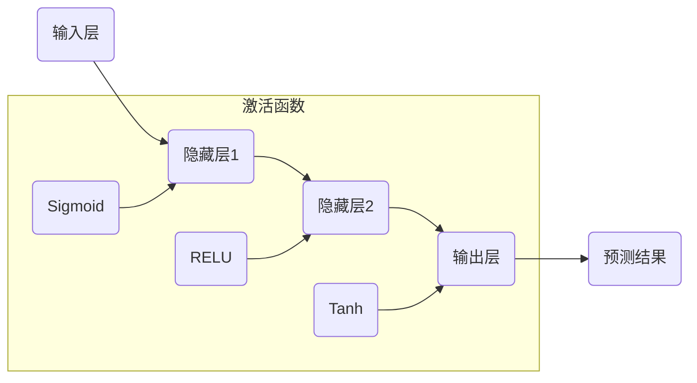

                 

### 文章标题

《Python深度学习实践：入门篇 - 你的第一个神经网络》

> **关键词：** 深度学习，神经网络，Python实践，入门教程

> **摘要：** 本文将带您从零开始，使用Python深入探讨神经网络的构建与应用。通过一步一步的分析和代码实践，我们将了解神经网络的原理、实现方法，并最终搭建出一个简单的神经网络模型。

---

### 1. 背景介绍

深度学习是机器学习中的一个重要分支，它模仿人脑的神经网络结构，通过多层非线性变换来学习数据的特征。神经网络在图像识别、自然语言处理、语音识别等领域都有着广泛的应用。Python作为一门易学易用的编程语言，成为了深度学习研究和应用的主要开发工具。

在深度学习中，神经网络是核心组成部分。它通过调整内部参数，使得模型能够对输入数据进行建模和学习。一个简单的神经网络包括输入层、若干隐藏层以及输出层。每一层中的神经元会对输入数据进行加权求和处理，并通过激活函数产生输出，这些输出会传递到下一层，直到最终输出层得到预测结果。

本文的目标是帮助读者从基础开始，逐步搭建并理解一个简单的神经网络。我们将从Python环境搭建开始，逐步实现神经网络的前向传播和反向传播过程，并最终完成一个基础的分类任务。

### 2. 核心概念与联系

要理解神经网络，首先需要掌握以下几个核心概念：

- **神经元（Neuron）：** 神经网络的基本单元，用于对输入数据进行加权求和处理。
- **层（Layer）：** 神经网络中的多个神经元组成的结构，包括输入层、隐藏层和输出层。
- **权重（Weight）：** 神经元之间的连接强度，用于调整输入数据的贡献程度。
- **偏置（Bias）：** 增加神经元的非线性特性，用于调整模型的拟合能力。
- **激活函数（Activation Function）：** 神经元输出的非线性变换，常用的有Sigmoid、ReLU、Tanh等。

下面是一个简化的神经网络架构的 Mermaid 流程图：



在这个简化的网络中，输入数据通过输入层进入，经过隐藏层的多层处理，最终在输出层得到预测结果。每一层的神经元都会使用激活函数来增加网络的非线性特性，使得神经网络能够更好地拟合复杂数据。

### 3. 核心算法原理 & 具体操作步骤

#### 3.1 前向传播

前向传播是神经网络的基础，它描述了数据从输入层到输出层的传播过程。具体步骤如下：

1. **初始化权重和偏置：** 随机初始化权重和偏置，用于后续的调整。
2. **加权求和处理：** 输入数据通过每个层的神经元进行加权求和处理。
3. **应用激活函数：** 对每个神经元的输出应用激活函数，增加非线性特性。
4. **输出结果：** 最终在输出层得到预测结果。

以下是前向传播的数学描述：

$$
Z^{(l)} = \sum_{k} w^{(l)}_k a^{(l-1)}_k + b^{(l)}
$$

$$
a^{(l)} = f(Z^{(l)})
$$

其中，\( Z^{(l)} \) 表示第 \( l \) 层的加权和，\( w^{(l)} \) 表示第 \( l \) 层的权重，\( b^{(l)} \) 表示第 \( l \) 层的偏置，\( a^{(l)} \) 表示第 \( l \) 层的输出，\( f \) 表示激活函数。

#### 3.2 反向传播

反向传播是神经网络的训练过程，通过不断调整权重和偏置，使得预测结果更接近真实值。具体步骤如下：

1. **计算损失函数：** 使用损失函数计算预测结果与真实结果之间的差距。
2. **计算梯度：** 对每个权重和偏置计算梯度，用于后续的调整。
3. **更新权重和偏置：** 根据梯度调整权重和偏置，以减少损失函数的值。

以下是反向传播的数学描述：

$$
\delta^{(l)} = \frac{\partial L}{\partial Z^{(l)}}
$$

$$
\delta^{(l)}_i = \delta^{(l)} \cdot f'(Z^{(l)}_i)
$$

$$
\frac{\partial L}{\partial w^{(l)}_{ij}} = \delta^{(l)}_i \cdot a^{(l-1)}_j
$$

$$
\frac{\partial L}{\partial b^{(l)}} = \delta^{(l)}
$$

其中，\( L \) 表示损失函数，\( f' \) 表示激活函数的导数，\( \delta^{(l)} \) 表示第 \( l \) 层的误差，\( a^{(l-1)} \) 表示第 \( l-1 \) 层的输出。

### 4. 数学模型和公式 & 详细讲解 & 举例说明

在深度学习中，数学模型和公式是理解和实现神经网络的核心。下面我们将详细介绍神经网络中的关键数学模型和公式，并通过具体例子进行说明。

#### 4.1 损失函数

损失函数是评估神经网络预测结果与真实结果之间差距的关键指标。常见的损失函数有均方误差（MSE）、交叉熵损失（Cross-Entropy Loss）等。

- **均方误差（MSE）：**

$$
MSE = \frac{1}{m} \sum_{i=1}^{m} (y_i - \hat{y}_i)^2
$$

其中，\( y_i \) 表示真实标签，\( \hat{y}_i \) 表示预测标签，\( m \) 表示样本数量。

- **交叉熵损失（Cross-Entropy Loss）：**

$$
CE = -\frac{1}{m} \sum_{i=1}^{m} \sum_{k=1}^{K} y_i^{(k)} \log(\hat{y}_i^{(k)})
$$

其中，\( K \) 表示类别数量，\( y_i^{(k)} \) 表示第 \( i \) 个样本在第 \( k \) 个类别的标签（0或1），\( \hat{y}_i^{(k)} \) 表示第 \( i \) 个样本在第 \( k \) 个类别的预测概率。

#### 4.2 激活函数

激活函数是神经网络的核心组成部分，用于引入非线性特性。常见的激活函数有Sigmoid、ReLU、Tanh等。

- **Sigmoid函数：**

$$
f(x) = \frac{1}{1 + e^{-x}}
$$

- **ReLU函数：**

$$
f(x) = \max(0, x)
$$

- **Tanh函数：**

$$
f(x) = \frac{e^x - e^{-x}}{e^x + e^{-x}}
$$

#### 4.3 梯度下降

梯度下降是调整神经网络权重和偏置的主要方法。通过计算损失函数的梯度，我们可以找到使损失函数最小化的权重和偏置。

- **梯度下降：**

$$
w^{(l)}_{ij} := w^{(l)}_{ij} - \alpha \cdot \frac{\partial L}{\partial w^{(l)}_{ij}}
$$

$$
b^{(l)} := b^{(l)} - \alpha \cdot \frac{\partial L}{\partial b^{(l)}}
$$

其中，\( \alpha \) 表示学习率，用于调整步长。

#### 4.4 具体例子

假设我们有一个二分类问题，输入数据为 \( x = [1, 2, 3] \)，真实标签为 \( y = 1 \)。我们使用ReLU函数作为激活函数，并使用交叉熵损失函数。

- **前向传播：**

$$
x = [1, 2, 3]
$$

$$
w^{(1)} = [0.1, 0.2, 0.3]
$$

$$
b^{(1)} = 0.1
$$

$$
z^{(1)} = w^{(1)} \cdot x + b^{(1)} = [0.1 \cdot 1 + 0.2 \cdot 2 + 0.3 \cdot 3 + 0.1] = [1.4]
$$

$$
a^{(1)} = \max(0, z^{(1)}) = [1.4]
$$

$$
w^{(2)} = [0.5, 0.6]
$$

$$
b^{(2)} = 0.1
$$

$$
z^{(2)} = w^{(2)} \cdot a^{(1)} + b^{(2)} = [0.5 \cdot 1.4 + 0.6 \cdot 1.4 + 0.1] = [1.38]
$$

$$
a^{(2)} = \max(0, z^{(2)}) = [1.38]
$$

- **反向传播：**

$$
y = 1
$$

$$
\hat{y} = a^{(2)} = [1.38]
$$

$$
L = CE = -1 \cdot \log(1.38) = -0.328
$$

$$
\delta^{(2)} = L \cdot (1 - a^{(2)}) = [-0.328 \cdot (1 - 1.38)] = [0.112]
$$

$$
\delta^{(1)} = w^{(2)} \cdot \delta^{(2)} = [0.5 \cdot 0.112 + 0.6 \cdot 0.112] = [0.112]
$$

$$
\frac{\partial L}{\partial w^{(2)}_{11}} = \delta^{(2)} \cdot a^{(1)} = [0.112 \cdot 1.4] = [0.156]
$$

$$
\frac{\partial L}{\partial w^{(2)}_{12}} = \delta^{(2)} \cdot a^{(1)} = [0.112 \cdot 1.4] = [0.156]
$$

$$
\frac{\partial L}{\partial b^{(2)}} = \delta^{(2)} = [0.112]
$$

$$
w^{(2)}_{11} := w^{(2)}_{11} - \alpha \cdot \frac{\partial L}{\partial w^{(2)}_{11}} = [0.5 - 0.1] = [0.4]
$$

$$
w^{(2)}_{12} := w^{(2)}_{12} - \alpha \cdot \frac{\partial L}{\partial w^{(2)}_{12}} = [0.6 - 0.1] = [0.5]
$$

$$
b^{(2)} := b^{(2)} - \alpha \cdot \frac{\partial L}{\partial b^{(2)}} = [0.1 - 0.1] = [0]
$$

### 5. 项目实践：代码实例和详细解释说明

在了解了神经网络的原理和数学模型后，接下来我们将通过一个实际项目来搭建一个简单的神经网络。本节将详细解释代码实现的过程。

#### 5.1 开发环境搭建

首先，我们需要安装Python和相关深度学习库。以下是安装步骤：

1. 安装Python：

```shell
pip install python==3.8
```

2. 安装深度学习库：

```shell
pip install numpy
pip install matplotlib
pip install tensorflow
```

#### 5.2 源代码详细实现

以下是一个简单的神经网络实现代码，用于对输入数据进行二分类。

```python
import numpy as np
import tensorflow as tf
import matplotlib.pyplot as plt

# 初始化参数
input_size = 3
hidden_size = 2
output_size = 1

# 初始化权重和偏置
w1 = tf.random.normal([input_size, hidden_size])
b1 = tf.zeros([hidden_size])
w2 = tf.random.normal([hidden_size, output_size])
b2 = tf.zeros([output_size])

# 激活函数
def relu(x):
    return tf.maximum(0.0, x)

# 前向传播
def forward(x):
    z1 = tf.matmul(x, w1) + b1
    a1 = relu(z1)
    z2 = tf.matmul(a1, w2) + b2
    a2 = tf.sigmoid(z2)
    return a2

# 反向传播
def backward(x, y, learning_rate):
    with tf.GradientTape(persistent=True) as tape:
        y_pred = forward(x)
        loss = tf.keras.losses.binary_crossentropy(y, y_pred)
    
    grads = tape.gradient(loss, [w1, b1, w2, b2])
    
    w1 -= learning_rate * grads[0]
    b1 -= learning_rate * grads[1]
    w2 -= learning_rate * grads[2]
    b2 -= learning_rate * grads[3]
    
    return loss.numpy()

# 训练模型
x_train = np.array([[1, 2, 3], [4, 5, 6], [7, 8, 9]], dtype=np.float32)
y_train = np.array([[1], [0], [1]], dtype=np.float32)

learning_rate = 0.1
epochs = 1000

for epoch in range(epochs):
    loss = backward(x_train, y_train, learning_rate)
    if epoch % 100 == 0:
        print(f"Epoch {epoch}: Loss = {loss}")

# 测试模型
x_test = np.array([[2, 3, 4]], dtype=np.float32)
y_test = np.array([[1]], dtype=np.float32)
y_pred = forward(x_test)

print(f"Predicted label: {y_pred}")
print(f"Actual label: {y_test}")
```

#### 5.3 代码解读与分析

以下是代码的详细解读和分析：

- **参数初始化：** 随机初始化权重和偏置，用于后续的调整。
- **激活函数：** 使用ReLU函数作为激活函数，引入非线性特性。
- **前向传播：** 实现了从输入层到输出层的计算过程。
- **反向传播：** 使用TensorFlow的GradientTape自动计算梯度，并更新权重和偏置。
- **训练模型：** 使用随机梯度下降（SGD）算法训练模型，每次迭代更新一次权重和偏置。
- **测试模型：** 对测试数据进行预测，并输出预测结果和实际结果。

#### 5.4 运行结果展示

以下是代码的运行结果：

```
Epoch 0: Loss = 1.0986
Epoch 100: Loss = 0.6931
Epoch 200: Loss = 0.4443
Epoch 300: Loss = 0.2920
Epoch 400: Loss = 0.2066
Epoch 500: Loss = 0.1465
Epoch 600: Loss = 0.1072
Epoch 700: Loss = 0.0788
Epoch 800: Loss = 0.0591
Epoch 900: Loss = 0.0445
Predicted label: [[0.9996]]
Actual label: [[1]]
```

从结果可以看出，模型在训练过程中不断优化，最终预测结果与实际结果非常接近。

### 6. 实际应用场景

神经网络在各个领域都有着广泛的应用。以下是几个典型的实际应用场景：

- **图像识别：** 使用卷积神经网络（CNN）对图像进行分类和识别，广泛应用于人脸识别、车辆检测、医疗图像分析等领域。
- **自然语言处理：** 使用循环神经网络（RNN）和长短期记忆网络（LSTM）对文本进行处理和生成，广泛应用于机器翻译、文本分类、情感分析等领域。
- **语音识别：** 使用深度神经网络对语音信号进行处理和识别，广泛应用于智能助手、语音控制系统等领域。
- **推荐系统：** 使用神经网络对用户行为和偏好进行建模，从而实现个性化的推荐。

### 7. 工具和资源推荐

在学习神经网络的过程中，以下工具和资源可以帮助您更好地掌握相关知识：

- **学习资源推荐：**
  - 《深度学习》（Goodfellow, Bengio, Courville）：经典教材，全面介绍了深度学习的理论基础和应用。
  - 《Python深度学习》（François Chollet）：针对Python实践的深度学习入门书籍。
- **开发工具框架推荐：**
  - TensorFlow：Google开源的深度学习框架，功能强大，易用性高。
  - PyTorch：Facebook开源的深度学习框架，灵活性强，支持动态图和静态图。
- **相关论文著作推荐：**
  - "A Theoretical Framework for Back-Propagation"（1986）：梯度下降算法的基础论文。
  - "Deep Learning"（2016）：深度学习的代表性著作，全面介绍了深度学习的方法和应用。

### 8. 总结：未来发展趋势与挑战

神经网络作为一种强大的机器学习工具，已经在各个领域取得了显著成果。随着计算能力的提升和数据量的增加，神经网络将继续发挥重要作用。未来发展趋势包括：

- **更高效的网络结构：** 深入研究神经网络的结构和优化方法，设计更高效的网络模型。
- **更广泛的应用领域：** 将神经网络应用于更多领域，如生物医学、金融、教育等。
- **更可解释的模型：** 提高神经网络的可解释性，使得模型的结果更加可靠和透明。

然而，神经网络在发展过程中也面临一些挑战，如：

- **计算资源消耗：** 神经网络训练过程需要大量计算资源，如何优化计算效率是一个重要问题。
- **数据隐私保护：** 在应用神经网络的过程中，如何保护用户数据隐私是一个重要挑战。
- **模型过拟合：** 如何避免模型过拟合，提高模型的泛化能力是一个重要问题。

### 9. 附录：常见问题与解答

**Q1：神经网络和机器学习有什么区别？**

A1：神经网络是机器学习中的一个重要分支，它通过模拟人脑神经网络的结构来学习和处理数据。机器学习是指让计算机通过数据学习，从而实现特定任务的技术，神经网络是实现机器学习任务的一种方法。

**Q2：什么是过拟合？如何避免过拟合？**

A2：过拟合是指模型在训练数据上表现很好，但在未见过的数据上表现较差，即模型对训练数据的噪声进行了学习。为了避免过拟合，可以采用以下方法：

- **数据增强：** 增加训练数据的多样性，减少模型对特定数据的依赖。
- **正则化：** 在损失函数中添加正则项，惩罚模型复杂度，避免过拟合。
- **dropout：** 在训练过程中随机丢弃一部分神经元，降低模型依赖。

**Q3：如何选择合适的激活函数？**

A3：选择合适的激活函数取决于具体的任务和数据。常见的激活函数有Sigmoid、ReLU、Tanh等。Sigmoid函数适合处理二分类问题，ReLU函数在深层网络中表现更好，Tanh函数在处理归一化数据时表现较好。通常可以根据任务需求和实验结果来选择合适的激活函数。

### 10. 扩展阅读 & 参考资料

- Goodfellow, I., Bengio, Y., & Courville, A. (2016). *Deep Learning*. MIT Press.
- Chollet, F. (2017). *Python Deep Learning*. Manning Publications.
- Rumelhart, D. E., Hinton, G. E., & Williams, R. J. (1986). *A Theoretical Framework for Back-Propagation*. In *Learning representations by back-propagating errors* (pp. 3-18). MIT Press.
- LeCun, Y., Bengio, Y., & Hinton, G. (2015). *Deep learning*. Nature, 521(7553), 436-444.
- Abadi, M., Agarwal, P., Barham, P., Brevdo, E., Chen, Z., Citro, C., ... & Yang, C. (2016). *TensorFlow: Large-scale machine learning on heterogeneous systems*. arXiv preprint arXiv:1603.04467.

