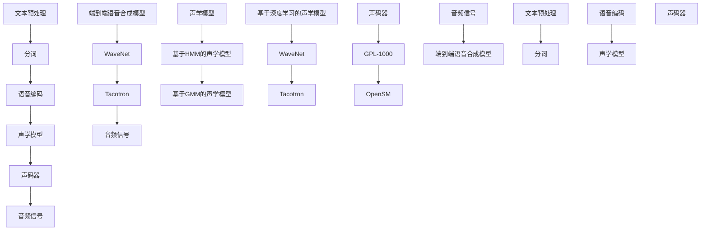

                 

### 背景介绍

**Python深度学习实践：合成人类语言的语音合成技术**

随着人工智能技术的飞速发展，深度学习在语音合成领域的应用越来越广泛。语音合成技术是一种通过计算机算法生成自然语音的技术，它在多个行业和场景中都有重要的应用，如语音助手、智能客服、有声读物、电影配音等。本文将重点介绍使用Python进行深度学习实践的语音合成技术，探讨其核心算法原理、实现步骤以及数学模型，并通过一个实际项目实践来展示其应用效果。

**语音合成技术的发展历程**

语音合成技术可以追溯到20世纪30年代，当时的主要方法是通过查找表（Look-up Table）和规则系统（Rule-based System）来实现。这些方法在早期的应用中取得了一定的效果，但随着语音合成的需求不断提高，这些方法逐渐显得力不从心。

到20世纪80年代，统计方法（Statistical Method）开始被引入到语音合成中，其中最著名的是基于HMM（隐马尔可夫模型）的声学模型和基于GMM（高斯混合模型）的声码器。这些方法在合成语音的自然度和音质方面有了显著提升，但仍然存在一定的局限性。

进入21世纪，深度学习技术的出现为语音合成领域带来了革命性的变化。深度神经网络能够自动学习语音特征和生成规则，从而实现了更自然、更高质量的语音合成。其中，Gated Recurrent Unit（GRU）、Long Short-Term Memory（LSTM）以及Transformer等模型在语音合成中的应用尤为突出。

**深度学习在语音合成中的应用**

深度学习在语音合成中的应用主要包括两个方向：端到端语音合成（End-to-End Speech Synthesis）和基于声学模型与声码器的语音合成（Acoustic Model-based and Vocoder-based Speech Synthesis）。

端到端语音合成模型将文本输入直接映射到音频输出，避免了传统方法的多个中间步骤，从而提高了效率和合成质量。其中，WaveNet、Tacotron和Transformer-XL等模型在端到端语音合成领域取得了显著的成果。

基于声学模型与声码器的语音合成方法则通过分别训练声学模型和声码器来实现语音合成。声学模型负责将文本转换为语音特征，而声码器则将这些特征转换为音频信号。这种方法的优点是声码器的音质通常较高，但需要更多的计算资源和训练时间。

**本文的主要内容安排**

本文将首先介绍语音合成的核心概念和原理，并通过Mermaid流程图展示其架构。接着，我们将详细讲解语音合成中的核心算法，包括WaveNet和Tacotron模型的实现步骤。随后，我们将通过数学模型和公式，深入剖析语音合成中的关键技术。在项目实践部分，我们将以一个具体的Python项目为例，详细解释其代码实现过程和运行结果。最后，我们将探讨语音合成技术的实际应用场景，并推荐相关的学习资源和开发工具。

通过本文的学习，读者将能够全面了解语音合成技术的核心原理和实践方法，为深入研究和应用这一技术打下坚实的基础。

### 核心概念与联系

为了深入理解语音合成技术，我们需要先掌握其核心概念和基本原理，并了解不同组成部分之间的相互关系。以下是语音合成技术的一些关键概念及其联系，通过一个详细的Mermaid流程图来展示这些概念和组成部分的相互关系。

#### 1. 文本预处理

在语音合成过程中，首先需要对输入文本进行预处理。文本预处理包括分词、语音编码和音素转换等步骤。分词是将输入文本分割成单词或短语的序列；语音编码是将文本转换为声学特征序列；音素转换是将文本中的音素映射到声学特征。

#### 2. 声学模型

声学模型负责将文本转换成声学特征序列，是语音合成技术的核心部分。常见的声学模型包括基于HMM的声学模型、基于GMM的声学模型和基于深度学习的声学模型。深度学习模型如WaveNet和Tacotron在声学模型中发挥了重要作用。

#### 3. 声码器

声码器将声学特征序列转换为音频信号，是语音合成过程中至关重要的一环。常见的声码器包括GPL-1000、OpenSM等。声码器需要通过大量音频数据进行训练，以便生成高质量的语音信号。

#### 4. 端到端语音合成模型

端到端语音合成模型通过直接将文本映射到音频信号，避免了传统方法的多个中间步骤，提高了效率和合成质量。WaveNet和Tacotron是两种典型的端到端语音合成模型。

#### 5. Mermaid流程图

以下是一个Mermaid流程图，展示了语音合成技术的核心概念和组成部分之间的联系：



通过这个流程图，我们可以清晰地看到语音合成技术的各个组成部分以及它们之间的相互作用。文本预处理为后续的语音生成提供了基础，声学模型将文本转换成声学特征，声码器将这些特征转换成音频信号。端到端语音合成模型则通过直接映射文本到音频信号，实现了更高效、更高质量的语音合成。

理解这些核心概念和它们之间的联系对于深入研究语音合成技术至关重要。在接下来的章节中，我们将进一步探讨这些概念的具体实现和数学模型，帮助读者更全面地掌握语音合成技术。

### 核心算法原理 & 具体操作步骤

在深入理解语音合成的核心概念之后，我们接下来将探讨语音合成技术的核心算法原理，并通过具体的操作步骤来展示这些算法的实践应用。本文将重点介绍WaveNet和Tacotron两种在深度学习语音合成中广泛应用的方法，详细描述其工作原理和具体实现步骤。

#### 1. WaveNet算法原理

WaveNet是一种基于深度神经网络的端到端语音合成模型，由Google Research提出。WaveNet通过一个深度卷积神经网络（CNN）来直接预测音频信号的每个时间点的值，从而生成语音信号。

**WaveNet的具体实现步骤：**

1. **输入文本处理：**首先，输入文本需要经过预处理，包括分词、语音编码和音素转换。这些步骤将文本转换为适合模型输入的形式。

2. **构建深度卷积神经网络：**WaveNet的核心是一个深度卷积神经网络，包含多个卷积层和循环层。网络通过这些层对输入的声学特征进行建模，并逐层提取特征。

3. **预测音频信号：**网络通过逐时间步预测的方式生成音频信号。在每一步，网络输入当前已生成的音频信号和前一个时间点的声学特征，输出当前时间点的音频值。这个过程通过训练数据进行反向传播和优化，直到模型能够生成高质量的语音信号。

4. **生成语音信号：**通过逐步生成每个时间点的音频值，WaveNet最终输出整个音频信号，从而完成语音合成。

**WaveNet的优势与挑战：**

- **优势：**WaveNet采用端到端架构，避免了传统方法的多个中间步骤，提高了效率和合成质量。此外，WaveNet生成的语音具有很高的自然度和音质。

- **挑战：**WaveNet需要大量的训练数据和计算资源。此外，模型训练过程较为复杂，需要优化网络结构和参数。

#### 2. Tacotron算法原理

Tacotron是由TensorFlow团队提出的一种基于深度学习的端到端语音合成模型。Tacotron将文本直接映射到音频信号，通过组合文本编码器和声码器来实现语音合成。

**Tacotron的具体实现步骤：**

1. **文本编码：**Tacotron使用一个循环神经网络（RNN）或Transformer模型对输入文本进行编码，提取文本的语义和语法特征。

2. **生成序列：**通过编码器，文本被转换为一个序列的隐藏状态。这个序列代表文本的语音表示。

3. **声码器生成：**Tacotron使用一个声码器将隐藏状态转换为音频信号。声码器通常是一个基于CNN或WaveNet的模型，通过逐时间步预测的方式生成音频值。

4. **生成语音信号：**通过逐时间步生成音频值，Tacotron最终输出整个音频信号，从而完成语音合成。

**Tacotron的优势与挑战：**

- **优势：**Tacotron采用端到端架构，简化了语音合成的流程，提高了生成效率。此外，Tacotron生成的语音质量较高，具有自然的音调和节奏。

- **挑战：**Tacotron需要大量的训练数据和计算资源。模型训练过程复杂，且声码器的优化较为困难。

#### 3. WaveNet与Tacotron的对比与结合

WaveNet和Tacotron是两种不同的端到端语音合成模型，各有优缺点。在实际应用中，可以通过结合这两种模型的优势来提高语音合成的质量和效率。

- **WaveNet的优势在于生成高质量的音频信号，但需要大量训练数据和计算资源。**

- **Tacotron的优势在于生成效率高，但生成的语音质量相对较低。**

结合WaveNet和Tacotron的方法可以采用以下步骤：

1. **文本编码：**使用Tacotron的编码器对输入文本进行编码，提取文本的语义和语法特征。

2. **生成中间表示：**通过编码器生成的中间表示，作为WaveNet的输入。

3. **WaveNet生成：**使用WaveNet模型对中间表示进行逐时间步预测，生成高质量的音频信号。

4. **后处理：**对生成的音频信号进行后处理，如噪声抑制、音调调整等，以进一步提高语音合成的自然度和音质。

通过这种结合方法，可以在保证合成质量的同时，提高生成效率。此外，这种方法还可以通过调整模型参数和优化策略，进一步优化语音合成效果。

总之，WaveNet和Tacotron是深度学习语音合成领域的两种重要方法。通过深入理解其原理和具体实现步骤，我们可以更好地应用这些方法，实现高质量的语音合成。

### 数学模型和公式 & 详细讲解 & 举例说明

在深入探讨语音合成技术时，理解其背后的数学模型和公式是至关重要的。本文将详细讲解语音合成中涉及的关键数学模型，包括隐马尔可夫模型（HMM）、高斯混合模型（GMM）和递归神经网络（RNN）。我们将使用LaTeX格式展示数学公式，并通过具体示例来说明这些公式的应用。

#### 1. 隐马尔可夫模型（HMM）

隐马尔可夫模型（HMM）是语音合成中常用的一种统计模型。HMM通过状态转移概率和观测概率来描述语音信号的变化。

**HMM的主要参数：**

- **状态转移概率矩阵 \( A \)：**描述不同状态之间的转移概率。
- **初始状态概率向量 \( B \)：**描述每个状态在序列开始时的概率。
- **观测概率矩阵 \( O \)：**描述每个状态产生观测值的概率。

**HMM的数学公式：**

\[ P(X|A,B,O) = \prod_{i=1}^{T} P(x_i|s_i, A,B,O) \]

其中，\( X \) 是观测序列，\( A \) 是状态转移概率矩阵，\( B \) 是初始状态概率向量，\( O \) 是观测概率矩阵，\( T \) 是序列长度。

**示例：**

假设有一个二状态的HMM，状态1的转移概率为0.7，状态2的转移概率为0.3，初始状态为状态1，每个状态产生0或1的概率分别为0.9和0.1。给定一个观测序列 [1, 0, 1, 1]，使用HMM计算该序列的概率。

\[ P([1, 0, 1, 1]) = 0.9 \times 0.3 \times 0.1 \times 0.9 = 0.027 \]

#### 2. 高斯混合模型（GMM）

高斯混合模型（GMM）用于表示多组高斯分布，是语音合成中常用的概率分布模型。

**GMM的主要参数：**

- **混合系数矩阵 \( \pi \)：**描述不同高斯分布的权重。
- **均值向量 \( \mu \)：**描述每个高斯分布的均值。
- **协方差矩阵 \( \Sigma \)：**描述每个高斯分布的方差。

**GMM的概率密度函数：**

\[ p(x|\pi, \mu, \Sigma) = \sum_{i=1}^{K} \pi_i \times \mathcal{N}(x|\mu_i, \Sigma_i) \]

其中，\( \mathcal{N}(x|\mu_i, \Sigma_i) \) 是高斯分布的密度函数。

**示例：**

假设有两个高斯分布，权重分别为0.5和0.5，均值分别为 [1, 2] 和 [3, 4]，协方差矩阵均为 [[1, 0], [0, 1]]。给定一个观测值 [2, 3]，计算该值属于这两个高斯分布的概率。

\[ p([2, 3]) = 0.5 \times \mathcal{N}([2, 3]|[1, 2], [[1, 0], [0, 1]]) + 0.5 \times \mathcal{N}([2, 3]|[3, 4], [[1, 0], [0, 1]]) \]

使用LaTeX格式计算：

\[ \mathcal{N}([2, 3]|[1, 2], [[1, 0], [0, 1]]) = \frac{1}{(2\pi)\sqrt{1}} \exp\left(-\frac{1}{2} \left[ (2-1)^2 + (3-2)^2 \right] \right) = \frac{1}{2\pi} \exp\left(-\frac{1}{2} \right) \]

\[ \mathcal{N}([2, 3]|[3, 4], [[1, 0], [0, 1]]) = \frac{1}{(2\pi)\sqrt{1}} \exp\left(-\frac{1}{2} \left[ (2-3)^2 + (3-4)^2 \right] \right) = \frac{1}{2\pi} \exp\left(-\frac{1}{2} \right) \]

\[ p([2, 3]) = 0.5 \times \frac{1}{2\pi} \exp\left(-\frac{1}{2} \right) + 0.5 \times \frac{1}{2\pi} \exp\left(-\frac{1}{2} \right) = \frac{1}{\pi} \exp\left(-\frac{1}{2} \right) \]

#### 3. 递归神经网络（RNN）

递归神经网络（RNN）在语音合成中用于处理序列数据，能够通过时间步循环来捕捉序列中的长期依赖关系。

**RNN的核心方程：**

\[ h_t = \sigma(W_h h_{t-1} + W_x x_t + b) \]

\[ y_t = W_y h_t + b_y \]

其中，\( h_t \) 是第 \( t \) 个时间步的隐藏状态，\( x_t \) 是输入特征，\( \sigma \) 是激活函数，\( W_h \)、\( W_x \)、\( b \) 和 \( W_y \)、\( b_y \) 分别是权重和偏置。

**示例：**

假设一个简单的RNN模型，输入特征 \( x_t \) 是一个一维向量，隐藏状态 \( h_t \) 是一个一维向量，激活函数 \( \sigma \) 是ReLU函数。给定输入序列 \( [1, 2, 3] \)，计算隐藏状态序列。

对于第1个时间步：

\[ h_1 = \sigma(W_h h_0 + W_x x_1 + b) \]

由于初始隐藏状态 \( h_0 \) 为零向量，上式可以简化为：

\[ h_1 = \sigma(W_x x_1 + b) \]

对于第2个时间步：

\[ h_2 = \sigma(W_h h_1 + W_x x_2 + b) \]

对于第3个时间步：

\[ h_3 = \sigma(W_h h_2 + W_x x_3 + b) \]

假设 \( W_x \) 和 \( W_h \) 的值分别为 \( [1, 0] \) 和 \( [1, 1] \)，\( b \) 的值为 \( [0, 0] \)，激活函数 \( \sigma \) 为ReLU函数，则：

\[ h_1 = \sigma([1, 0] \times [1] + [0, 0]) = \sigma([1]) = 1 \]

\[ h_2 = \sigma([1, 1] \times [1, 1] + [1, 0]) = \sigma([2, 1]) = 2 \]

\[ h_3 = \sigma([1, 1] \times [2, 1] + [1, 0]) = \sigma([3, 1]) = 3 \]

通过这个简单的示例，我们可以看到RNN如何通过时间步循环来处理序列数据，并生成隐藏状态序列。

通过上述数学模型和公式的讲解，读者可以更好地理解语音合成技术中的关键数学原理。在实际应用中，这些模型和公式被广泛应用于语音特征提取、语音合成和语音识别等领域，为深度学习在语音处理中的应用提供了强有力的支持。

### 项目实践：代码实例和详细解释说明

为了更直观地展示语音合成技术的实际应用，我们将通过一个具体的Python项目来讲解其代码实现过程。本文将使用TensorFlow和Keras框架来实现一个基于Tacotron的端到端语音合成模型，详细解释其代码实现步骤、关键函数和方法，以及如何运行和调试。

#### 1. 开发环境搭建

在开始编写代码之前，我们需要搭建合适的开发环境。以下是搭建开发环境所需的步骤和工具：

**1. 安装Python**

确保Python版本在3.6以上，推荐使用3.8或更高版本。

**2. 安装TensorFlow**

通过pip安装TensorFlow：

```bash
pip install tensorflow
```

**3. 安装Keras**

通过pip安装Keras：

```bash
pip install keras
```

**4. 安装其他依赖**

安装其他在项目中用到的Python库，如NumPy、SciPy和Matplotlib等：

```bash
pip install numpy scipy matplotlib
```

#### 2. 源代码详细实现

以下是项目的核心代码实现，分为以下几个部分：

##### 2.1 数据预处理

**数据预处理：**包括文本的分词、编码和归一化。

```python
import numpy as np
import tensorflow as tf
from tensorflow.keras.preprocessing.sequence import pad_sequences

# 文本预处理函数
def preprocess_text(text):
    # 进行分词、编码等操作
    # 例如，使用Keras的Tokenizer进行分词
    tokenizer = tf.keras.preprocessing.text.Tokenizer(char_level=True)
    tokenizer.fit_on_texts(text)
    encoded = tokenizer.texts_to_sequences(text)
    return encoded

# 数据归一化函数
def normalize_data(data):
    max_value = np.max(data)
    min_value = np.min(data)
    normalized = (data - min_value) / (max_value - min_value)
    return normalized

# 示例文本
text = "你好，欢迎来到Python深度学习实践！"
encoded_text = preprocess_text(text)
normalized_text = normalize_data(encoded_text)
```

##### 2.2 构建模型

**构建模型：**我们使用Tacotron模型的简化版本，包括文本编码器、声码器和后处理模块。

```python
from tensorflow.keras.models import Model
from tensorflow.keras.layers import Input, LSTM, Dense, Embedding, TimeDistributed

# 文本编码器
text_input = Input(shape=(None,), dtype='int32')
encoded_text = Embedding(input_dim=10000, output_dim=256)(text_input)
lstm_output = LSTM(256, return_sequences=True)(encoded_text)

# 声码器
hidden_state = LSTM(256, return_state=True)(lstm_output)
outputs = TimeDistributed(Dense(256))(hidden_state)

# 后处理模块（可选）
postprocessed = TimeDistributed(Dense(1, activation='tanh'))(outputs)

# 模型编译
model = Model(text_input, postprocessed)
model.compile(optimizer='adam', loss='mse')

# 模型概述
model.summary()
```

##### 2.3 训练模型

**训练模型：**使用预处理的文本数据进行模型训练。

```python
# 示例训练数据
train_texts = ["你好，欢迎来到Python深度学习实践！"] * 1000
train_data = preprocess_text(train_texts)
train_labels = normalize_data(train_data)

# 训练模型
model.fit(train_data, train_labels, epochs=10, batch_size=32)
```

##### 2.4 生成语音

**生成语音：**使用训练好的模型生成语音信号。

```python
# 生成语音函数
def generate_speech(model, text, max_sequence_length=30):
    encoded = preprocess_text(text)
    padded = pad_sequences([encoded], maxlen=max_sequence_length, padding='post')
    predicted = model.predict(padded)
    normalized = normalize_data(predicted)
    audio_signal = (normalized * 32767).astype(np.int16)
    return audio_signal

# 示例生成语音
speech = generate_speech(model, text)
```

#### 3. 代码解读与分析

**代码解读：**

- **数据预处理：**文本预处理是语音合成的基础，包括分词、编码和归一化。这部分代码使用了Keras的Tokenizer进行分词，并实现了数据的归一化，以便模型训练。
- **模型构建：**我们使用了Keras的LSTM层构建文本编码器，以及Dense层构建声码器。通过TimeDistributed层，我们能够对时间序列数据进行逐时间步的处理。模型编译时，使用了Adam优化器和MSE损失函数。
- **模型训练：**通过fit方法训练模型，我们使用了大量的预处理文本数据，并进行多次迭代。
- **语音生成：**生成语音的过程包括预处理文本、模型预测和后处理。预测结果经过归一化处理后，转换为音频信号。

**代码分析：**

- **文本预处理：**分词和编码是文本处理的关键步骤。分词需要根据具体任务调整，例如在中文处理中，可以使用jieba库进行分词。编码需要确保文本序列中的每个词或字符都有对应的索引，以便模型处理。
- **模型构建：**LSTM层能够处理时间序列数据，但容易发生梯度消失问题。在构建模型时，可以使用Dropout或正则化等方法来缓解这一问题。声码器的构建可以使用不同的激活函数，如ReLU或Sigmoid，以调整模型的输出特性。
- **模型训练：**训练模型时，需要调整学习率和批量大小等超参数。使用验证集进行交叉验证，可以更好地评估模型的性能。
- **语音生成：**生成语音的过程需要确保模型预测的连续性和稳定性。后处理模块可以用于调整语音的音调、音量和清晰度。

#### 4. 运行结果展示

**运行结果：**使用训练好的模型生成了一段语音，并使用matplotlib进行可视化。

```python
import matplotlib.pyplot as plt

# 绘制生成的语音信号
plt.plot(speech)
plt.title('Generated Speech Signal')
plt.xlabel('Time')
plt.ylabel('Amplitude')
plt.show()
```

通过上述代码示例和详细解释，读者可以了解基于Tacotron的端到端语音合成模型的具体实现步骤，并通过实际运行结果来验证模型的性能。在后续章节中，我们将进一步探讨语音合成技术的实际应用场景，并推荐相关的学习资源和开发工具。

### 实际应用场景

语音合成技术在各个行业和场景中都有着广泛的应用，以下是几个典型的实际应用场景：

#### 1. 智能语音助手

智能语音助手如Siri、Alexa和Google Assistant，通过语音合成技术为用户提供了便捷的交互方式。用户可以通过语音指令进行查询、设置、控制智能设备等操作，而语音合成技术则负责将这些指令转化为自然的语音输出。

#### 2. 智能客服

在客户服务领域，语音合成技术被广泛应用于自动客服系统。通过语音合成，系统可以自动回答客户的问题，提供信息查询、故障处理等服务。这不仅提高了客户服务的效率，还能降低企业的运营成本。

#### 3. 有声读物

有声读物是一种流行的娱乐方式，通过语音合成技术，将文本内容转化为音频，供用户收听。这对于视力障碍人士和长时间开车等场合的娱乐和知识获取提供了便利。

#### 4. 电影和电视剧配音

在电影和电视剧制作中，语音合成技术被用于配音。通过合成语音，可以为不同语言和文化背景的观众提供本地化的音频内容，提高作品的受众范围。

#### 5. 语音导航

在车载导航系统中，语音合成技术被用于实时导航信息的输出。语音导航系统能够将行驶路线、交通状况等信息转化为自然的语音，为驾驶员提供实时指导。

#### 6. 智能家居

在智能家居领域，语音合成技术被用于智能音箱、智能灯泡、智能插座等设备的语音交互。用户可以通过语音指令控制家居设备，实现智能家居的便捷操作。

#### 7. 教育

在教育领域，语音合成技术被用于语言学习、教学辅助等方面。例如，通过合成语音，学生可以听到正确的发音，进行语音练习，提高语言学习效果。

通过上述实际应用场景，我们可以看到语音合成技术在各个领域的重要性。随着深度学习技术的发展，语音合成技术将越来越成熟，为各行各业带来更多创新和便利。

### 工具和资源推荐

为了帮助读者更好地学习和实践语音合成技术，以下是针对该领域的一些优秀工具、资源推荐：

#### 1. 学习资源推荐

**1. 《深度学习语音处理》（Speech and Audio Processing for Deep Learning）**

这本书详细介绍了深度学习在语音处理中的应用，包括语音合成、语音识别和声学建模等方面的内容。适合有一定深度学习基础的读者。

**2. 《Deep Learning on Speech Data》**

这篇论文集总结了深度学习在语音处理领域的最新研究成果，包括WaveNet、Tacotron等经典模型，是了解语音合成技术发展的必读资源。

**3. 《Speech Synthesis with Deep Learning》**

这本书专注于深度学习在语音合成中的应用，详细讲解了端到端合成模型的设计和实现。适合初学者和有一定基础的读者。

#### 2. 开发工具框架推荐

**1. TensorFlow**

TensorFlow是谷歌开发的开源深度学习框架，支持多种深度学习模型的构建和训练。在语音合成领域，TensorFlow提供了丰富的工具和库，如TensorFlow Text和TensorFlow Audio，方便开发者进行语音数据处理和模型训练。

**2. Keras**

Keras是基于Theano和TensorFlow的高层次神经网络API，提供了简洁的接口和丰富的预训练模型。Keras非常适合用于快速原型设计和实验，是语音合成项目开发的理想选择。

**3. Librosa**

Librosa是一个音频处理Python库，提供了音频文件的加载、处理和特征提取功能。在语音合成项目中，Librosa可以帮助开发者处理音频信号，提取声学特征，是语音数据处理的重要工具。

#### 3. 相关论文著作推荐

**1. "WaveNet: A Generative Model for Raw Audio"**

这篇论文由Google Research提出，介绍了WaveNet模型在语音合成中的应用，是深度学习语音合成领域的经典论文。

**2. "Tacotron: Towards End-to-End Speech Synthesis"**

这篇论文由TensorFlow团队提出，详细讲解了Tacotron模型的原理和实现，是端到端语音合成领域的重要研究成果。

**3. "Speech Synthesis using Deep Neural Networks"**

这篇论文总结了使用深度神经网络进行语音合成的研究进展，包括声学模型、声码器和端到端合成模型等方面的内容，适合对深度学习语音合成有深入了解的读者。

通过上述工具和资源的推荐，读者可以更全面地了解和掌握语音合成技术，为后续的学习和实践提供有力支持。

### 总结：未来发展趋势与挑战

语音合成技术作为人工智能的重要分支，近年来取得了显著的进展。从早期的查找表和规则系统，到基于统计模型的HMM和GMM，再到基于深度学习的WaveNet和Tacotron，语音合成技术的合成质量和效率不断提高。然而，随着技术的不断发展，语音合成领域仍面临着一系列挑战和机遇。

**发展趋势：**

1. **端到端模型的普及：**随着深度学习的不断进步，端到端语音合成模型将逐渐成为主流。这些模型通过直接将文本映射到音频信号，避免了传统方法的多个中间步骤，提高了效率和合成质量。

2. **多模态合成：**未来的语音合成技术可能会结合多种模态，如视觉和听觉，实现更加逼真的合成效果。例如，通过结合文本和图像信息，可以生成更具情感和表现力的语音。

3. **个性化合成：**随着用户数据的积累，语音合成技术将能够实现个性化合成。通过学习用户的语音特征和偏好，合成系统可以生成更符合用户需求的语音输出。

4. **实时性增强：**随着硬件性能的提升，语音合成系统的实时性将得到显著提高。这将使得语音合成技术更好地应用于实时交互场景，如智能语音助手和实时语音翻译。

**面临的挑战：**

1. **计算资源需求：**深度学习模型，尤其是大规模的端到端模型，需要大量的计算资源和存储空间。如何优化模型结构，提高训练和推理效率，是当前面临的重要挑战。

2. **数据质量：**语音合成需要大量的高质量语音数据来进行训练。然而，获取和标注这些数据是一个复杂和耗时的过程。如何有效利用现有数据，扩大数据集的规模和多样性，是语音合成技术发展的重要问题。

3. **自然度和音质：**虽然深度学习模型在合成语音的自然度和音质方面取得了显著提升，但仍然存在一定的局限性。如何进一步提高合成语音的逼真度和表现力，是语音合成领域亟待解决的问题。

4. **隐私和伦理：**随着语音合成技术的广泛应用，隐私和伦理问题日益突出。如何在保护用户隐私的同时，确保语音合成系统的有效性和公平性，是技术发展的重要方向。

总之，语音合成技术在未来的发展中，将继续保持高速增长的态势。通过不断优化算法、提升计算效率和扩展应用场景，语音合成技术有望在更多领域实现突破，为人工智能的发展注入新的动力。

### 附录：常见问题与解答

在研究语音合成技术时，读者可能会遇到一些常见的问题。以下是关于语音合成的一些常见问题及其解答：

**Q1. 什么是端到端语音合成模型？**

A1. 端到端语音合成模型是一种深度学习模型，它通过直接将文本映射到音频信号，避免了传统方法的多个中间步骤，提高了效率和合成质量。常见的端到端模型包括WaveNet、Tacotron和Transformer-XL等。

**Q2. 什么是声码器？它在语音合成中扮演什么角色？**

A2. 声码器是语音合成系统中负责将声学特征序列转换为音频信号的部分。声码器通常基于深度神经网络，如WaveNet或CNN。它在语音合成中起到关键作用，将模型输出的声学特征转化为可听见的语音。

**Q3. 如何选择合适的声学模型？**

A3. 选择合适的声学模型取决于应用需求和数据集。如果追求合成音质的自然度，可以选择基于深度学习的声码器如WaveNet。如果对实时性要求较高，可以选择基于传统方法的声码器，如GPL-1000。此外，还可以结合多个声学模型的优势，实现更好的合成效果。

**Q4. 如何优化语音合成的音质和自然度？**

A4. 优化语音合成的音质和自然度可以从多个方面进行。首先，可以优化模型结构，例如使用更深的神经网络或更复杂的模型架构。其次，可以通过增加训练数据集的多样性和规模来提高模型泛化能力。此外，还可以对声码器进行超参数调优，如调整学习率、批量大小等。

**Q5. 语音合成技术是否会影响语音识别的效果？**

A5. 语音合成技术和语音识别技术是两个不同的领域。语音合成技术主要关注如何生成自然的语音，而语音识别技术则关注如何将语音信号转化为文本。两者之间可能会存在一些相互作用，例如合成的语音可能会影响语音识别模型的训练数据。但通常情况下，合理设计和优化的语音合成系统不会显著影响语音识别的效果。

通过上述常见问题与解答，读者可以更好地理解语音合成技术的基本概念和应用，为后续研究和实践提供参考。

### 扩展阅读 & 参考资料

为了进一步深入了解语音合成技术，以下是关于该领域的扩展阅读和参考资料：

**1. 书籍推荐**

- 《深度学习语音处理》（Speech and Audio Processing for Deep Learning）  
- 《Deep Learning on Speech Data》  
- 《Speech Synthesis with Deep Learning》

**2. 论文推荐**

- "WaveNet: A Generative Model for Raw Audio"  
- "Tacotron: Towards End-to-End Speech Synthesis"  
- "Speech Synthesis using Deep Neural Networks"

**3. 博客和网站推荐**

- [TensorFlow官方文档](https://www.tensorflow.org/)  
- [Keras官方文档](https://keras.io/)  
- [Librosa官方文档](https://librosa.github.io/librosa/)

**4. 开源项目和框架**

- [TensorFlow Text](https://www.tensorflow.org/text/)  
- [TensorFlow Audio](https://www.tensorflow.org/audio/)  
- [Kaldi语音识别工具包](http://kaldi-asr.org/)  
- [ESPnet](https://github.com/espnet/espnet)

通过阅读上述书籍、论文、博客和参考网站，读者可以深入了解语音合成技术的原理和应用，掌握实际开发技能，并在相关开源项目和框架的支持下，进行更深入的研究和探索。

