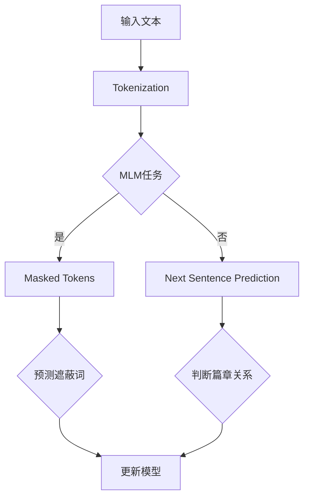

                 

### 背景介绍

#### Python深度学习：基石与优势

Python作为一种高级编程语言，自1991年问世以来，凭借其简洁、易读、高效的特点，迅速在开发者社区中赢得了广泛的认可。Python的简单语法和丰富的库支持使其成为初学者和专业人士 alike的首选语言。特别是在深度学习领域，Python以其强大的库生态和活跃的开发者社区，成为了深度学习研究与应用的主力军。

深度学习（Deep Learning）是机器学习（Machine Learning）的一个重要分支，它通过模拟人脑神经网络的结构和功能，对大量数据进行学习和模式识别。深度学习的核心在于多层神经网络（Neural Networks）的堆叠和使用，通过逐层提取特征，实现对复杂问题的建模和解决。常见的深度学习模型包括卷积神经网络（Convolutional Neural Networks, CNN）、循环神经网络（Recurrent Neural Networks, RNN）和变压器模型（Transformer Models）等。

Python在深度学习中的应用优势主要体现在以下几个方面：

1. **丰富的库支持**：Python拥有大量的深度学习库，如TensorFlow、PyTorch、Keras等，这些库提供了丰富的API和工具，使得深度学习模型的设计、训练和部署变得简单高效。

2. **社区活跃**：Python拥有庞大的开发者社区，包括众多深度学习专家和爱好者。这意味着用户可以轻松获取帮助、资源和技术支持。

3. **多领域应用**：Python不仅适用于学术研究，还在工业界有着广泛的应用。从自然语言处理（Natural Language Processing, NLP）到计算机视觉（Computer Vision），Python都展现了其强大的能力。

4. **代码简洁**：Python的简洁语法使得编写和阅读代码更加容易，这对于深度学习项目的开发尤为重要。

#### BERT：变革文本理解的利器

BERT（Bidirectional Encoder Representations from Transformers）是Google在2018年提出的一种基于变换器模型的预训练语言表示方法，旨在提高自然语言处理的性能。BERT的出现标志着文本理解领域的一个重要里程碑，其双方向编码器的设计使得模型能够同时考虑上下文信息，从而更好地捕捉语义关系。

BERT的基本原理是通过对大量文本进行无监督预训练，学习文本的深度表示。在预训练过程中，BERT使用了一个大规模的变换器模型，并利用了一种特殊的训练策略——Masked Language Modeling（MLM）和Next Sentence Prediction（NSP）。MLM通过随机遮蔽输入文本中的部分词，训练模型预测这些遮蔽的词；NSP则通过预测输入文本中连续的两个句子是否属于同一篇章。

BERT的优势主要体现在以下几个方面：

1. **上下文捕捉**：BERT能够同时考虑上下文信息，从而提高文本理解能力。与单向的循环神经网络（RNN）和长短期记忆网络（LSTM）相比，BERT的双向编码器能够更好地捕捉长距离的语义关系。

2. **大规模预训练**：BERT在预训练阶段使用了数以亿计的文本数据，这使其能够学习到丰富的语言知识，从而在下游任务中表现出色。

3. **通用性**：BERT的预训练模型可以轻松迁移到各种下游任务，如文本分类、命名实体识别、问答系统等，大大降低了模型的训练难度。

4. **高性能**：BERT在多个NLP任务上取得了显著的效果，并在多个权威数据集上刷新了记录，证明了其强大的性能。

#### 文本理解：挑战与机遇

文本理解（Text Understanding）是自然语言处理（NLP）的核心任务之一，其目标是让计算机理解和处理自然语言文本。然而，文本理解面临着诸多挑战：

1. **语义复杂性**：自然语言蕴含着丰富的语义信息，但往往非常复杂。理解这些语义信息需要模型具备深度的知识和理解能力。

2. **多样性**：自然语言的多样性使得模型需要处理多种语言风格、语法结构和表达方式。

3. **长距离依赖**：语义关系往往跨越长距离，模型需要具备捕捉长距离依赖的能力。

4. **多模态融合**：文本理解往往需要与其他模态（如图像、声音）进行融合，这增加了模型的复杂性。

尽管存在这些挑战，文本理解也蕴含着巨大的机遇：

1. **智能化应用**：文本理解能力能够提升各种智能化应用，如智能客服、智能推荐、智能写作等。

2. **知识图谱**：通过文本理解，可以构建大规模的知识图谱，为智能决策提供支持。

3. **跨领域应用**：文本理解技术可以应用于多个领域，如金融、医疗、法律等，具有广泛的应用前景。

### 结论

本文介绍了Python在深度学习领域的重要性以及BERT作为变革文本理解利器的强大优势。通过一步步的分析和推理，我们理解了BERT如何通过双方向编码器和预训练策略，提高文本理解能力。同时，我们也探讨了文本理解面临的挑战和机遇。在接下来的部分，我们将深入探讨BERT的核心算法原理和具体实现，帮助读者更好地理解这一先进技术的魅力。

### 核心概念与联系

#### BERT算法原理

BERT（Bidirectional Encoder Representations from Transformers）是基于变换器（Transformer）模型的一种双向编码器，旨在为自然语言文本提供强大的深度表示。BERT的核心在于其预训练过程和双方向编码器设计，这使得它能够有效捕捉文本中的语义信息。

##### 双方向编码器

BERT的双方向编码器是其关键特性之一。传统的循环神经网络（RNN）和长短期记忆网络（LSTM）虽然能够处理序列数据，但它们通常是单向的，只能根据前面的信息进行推理，而无法利用后面的信息。BERT通过变换器模型实现了双向编码，即同时考虑上下文信息，从而更准确地捕捉语义关系。

双向编码器的实现依赖于变换器模型中的自注意力机制（Self-Attention）。在变换器模型中，每个词的表示不仅取决于其前面的词，也取决于其后面的词。这种机制使得模型能够同时利用全局信息，从而提高文本理解能力。

##### 预训练过程

BERT的预训练过程是其强大性能的基石。预训练是指在大量无监督数据上进行训练，从而学习文本的深度表示。BERT的预训练过程主要包括两种任务：Masked Language Modeling（MLM）和Next Sentence Prediction（NSP）。

1. **Masked Language Modeling（MLM）**

MLM是一种无监督学习任务，通过随机遮蔽输入文本中的部分词，然后训练模型预测这些遮蔽的词。具体来说，BERT会随机遮蔽输入文本中的15%的词，并使用变换器模型预测这些遮蔽词。这种任务旨在让模型学习理解文本中的词与其上下文的关系。

2. **Next Sentence Prediction（NSP）**

NSP是一种有监督学习任务，通过预测两个句子是否属于同一篇章。在预训练过程中，BERT会随机抽取两个句子，并训练模型判断这两个句子是否属于同一篇章。NSP任务旨在让模型学习理解句子之间的关系和篇章结构。

##### 预训练策略

BERT的预训练策略包括两个阶段：

1. **第一阶段：预训练**

在预训练阶段，BERT使用数以亿计的文本数据（如维基百科、书籍、新闻等）进行无监督学习。通过MLM和NSP任务，模型学习文本的深度表示。

2. **第二阶段：微调**

在预训练之后，BERT可以通过微调（Fine-tuning）适应特定下游任务。微调是指将预训练模型应用于特定任务的数据集上，进一步调整模型的参数，以适应特定任务的需求。

#### BERT与深度学习的联系

BERT是基于深度学习的一种模型，其与深度学习的联系主要体现在以下几个方面：

1. **变换器模型**：BERT采用了变换器模型，这是一种先进的深度学习模型，以其在序列数据处理中的强大能力而闻名。

2. **多层神经网络**：BERT通过多层变换器堆叠，实现了对文本的深层表示。这种多层神经网络结构使得BERT能够捕捉到文本中的复杂语义信息。

3. **预训练与微调**：BERT的预训练和微调过程是深度学习中的重要概念，通过预训练，模型可以从大量无监督数据中学习，并通过微调，使其适应特定任务。

4. **迁移学习**：BERT的预训练模型可以轻松迁移到各种下游任务，如文本分类、命名实体识别、问答系统等。这种迁移学习能力是深度学习的一大优势。

#### Mermaid 流程图

以下是一个描述BERT核心算法原理和预训练过程的Mermaid流程图，其中包含了关键节点和连接关系：



在上述流程图中，输入文本经过Tokenization（分词）处理，然后根据MLM和NSP任务的不同，分别进行预测遮蔽词和判断篇章关系。最终，模型参数通过这两个任务的反馈进行更新，以实现文本的深度表示。

### 核心算法原理 & 具体操作步骤

BERT的核心算法原理基于变换器模型（Transformer Model），这是一种专为处理序列数据而设计的深度学习模型。变换器模型的核心机制是自注意力（Self-Attention）和多层堆叠。BERT通过预训练和微调两个阶段，实现对自然语言文本的深度理解和建模。

#### 自注意力机制（Self-Attention）

自注意力机制是变换器模型的核心创新之一。在变换器模型中，每个词的表示不仅取决于它自身的特征，还取决于其上下文中的其他词。自注意力机制通过计算词与词之间的相关性，动态地为每个词分配不同的权重，从而实现更精细的特征提取。

具体来说，自注意力机制的计算过程如下：

1. **计算Query（询问），Key（关键）和Value（价值）**：在每个词的表示向量基础上，分别计算Query、Key和Value。这三个向量具有相同的维度，但它们在计算过程中具有不同的作用。Query用于查询其他词的相关性，Key用于匹配其他词的特征，Value用于聚合信息。

2. **计算注意力得分**：使用Query和Key计算注意力得分，得分表示每个词与其他词的相关性。具体计算方式通常采用点积（Dot Product）或缩放点积（Scaled Dot Product）。

3. **计算加权求和**：根据注意力得分，对Value进行加权求和，得到每个词的注意力加权表示。

自注意力机制使得模型能够动态地关注重要的上下文信息，从而提高特征提取的精度。

#### 多层变换器堆叠

BERT通过多层变换器堆叠，实现对文本的深层表示。每层变换器都包含自注意力机制和前馈神经网络（Feedforward Neural Network）。多层堆叠使得模型能够逐渐提取文本中的复杂特征，提高模型的表达能力。

具体操作步骤如下：

1. **输入层**：输入层接收文本的分词表示，并将其转换为词向量。

2. **自注意力层**：自注意力层计算词与词之间的相关性，为每个词分配权重，并进行加权求和。

3. **前馈神经网络**：前馈神经网络对自注意力层的输出进行非线性变换，增强特征表达能力。

4. **层间交互**：通过层间交互机制，使得信息能够在不同层之间传递，从而实现更复杂的特征提取。

5. **输出层**：输出层将变换器模型的最终输出提供给下游任务，如文本分类、命名实体识别等。

#### 预训练过程

BERT的预训练过程是模型强大的关键。预训练旨在从大量无监督数据中学习文本的深度表示，从而为下游任务提供强大的基础。

1. **Masked Language Modeling（MLM）**

MLM是一种无监督学习任务，通过随机遮蔽输入文本中的部分词，然后训练模型预测这些遮蔽的词。具体步骤如下：

   - 随机遮蔽输入文本中的15%的词。
   - 训练模型预测遮蔽词。
   - 通过对比遮蔽词的真实值和预测值，更新模型参数。

2. **Next Sentence Prediction（NSP）**

NSP是一种有监督学习任务，通过预测两个句子是否属于同一篇章。具体步骤如下：

   - 随机抽取两个句子。
   - 训练模型判断这两个句子是否属于同一篇章。
   - 通过对比预测结果和真实值，更新模型参数。

#### 微调过程

微调是指将预训练模型应用于特定任务的数据集上，进一步调整模型的参数，以适应特定任务的需求。微调过程通常包括以下步骤：

1. **数据准备**：准备特定任务的数据集，并进行预处理。

2. **模型初始化**：初始化预训练模型，并将其应用于数据集。

3. **训练**：使用特定任务的数据集，通过梯度下降（Gradient Descent）等优化算法，调整模型参数。

4. **评估**：在验证集上评估模型性能，并根据需要调整模型结构或参数。

5. **部署**：将微调后的模型部署到实际应用中。

通过预训练和微调，BERT能够为各种下游任务提供强大的文本表示能力。接下来，我们将进一步探讨BERT的数学模型和公式，帮助读者更好地理解其内部工作机制。

### 数学模型和公式 & 详细讲解 & 举例说明

BERT的数学模型和公式是理解其工作机制的关键。在BERT中，主要涉及以下几方面的数学模型和计算：

#### 1. 自注意力机制（Self-Attention）

自注意力机制是BERT的核心组成部分，其基本原理是基于词与词之间的相关性来动态分配注意力权重。以下是自注意力机制的基本公式：

\[ \text{Attention}(Q, K, V) = \text{softmax}\left(\frac{QK^T}{\sqrt{d_k}}\right) V \]

其中：

- \( Q \)：查询向量（Query Vector），表示每个词的查询特征。
- \( K \)：关键向量（Key Vector），表示每个词的特征。
- \( V \)：价值向量（Value Vector），表示每个词的聚合信息。
- \( d_k \)：关键向量的维度。

具体步骤如下：

1. **计算点积（Dot Product）**：首先计算每个查询向量 \( Q \) 与关键向量 \( K \) 的点积，得到注意力得分（Attention Score）。

   \[ \text{Score}_{ij} = Q_i K_j \]

2. **应用缩放因子**：为了避免梯度消失问题，通常会在点积后除以 \( \sqrt{d_k} \)。

   \[ \text{Score}_{ij} = \frac{Q_i K_j}{\sqrt{d_k}} \]

3. **应用softmax函数**：对注意力得分应用softmax函数，得到每个词的注意力权重。

   \[ \text{Attention}_{ij} = \text{softmax}(\text{Score}_{ij}) \]

4. **加权求和**：将注意力权重与价值向量 \( V \) 进行加权求和，得到每个词的注意力加权表示。

   \[ \text{Context}_i = \sum_j \text{Attention}_{ij} V_j \]

举例说明：

假设我们有以下三个词及其向量表示：

\[ Q = [1, 0, 1], K = [1, 1, 0], V = [0, 1, 1] \]

首先计算点积：

\[ \text{Score} = \begin{bmatrix} 1 \cdot 1 & 1 \cdot 1 & 1 \cdot 0 \\ 0 \cdot 1 & 0 \cdot 1 & 0 \cdot 0 \\ 1 \cdot 1 & 1 \cdot 0 & 1 \cdot 1 \end{bmatrix} = \begin{bmatrix} 1 & 1 & 0 \\ 0 & 0 & 0 \\ 1 & 0 & 1 \end{bmatrix} \]

然后计算缩放因子：

\[ \text{Score}_{\text{scaled}} = \frac{1}{\sqrt{3}} \begin{bmatrix} 1 & 1 & 0 \\ 0 & 0 & 0 \\ 1 & 0 & 1 \end{bmatrix} = \begin{bmatrix} \frac{1}{\sqrt{3}} & \frac{1}{\sqrt{3}} & 0 \\ 0 & 0 & 0 \\ \frac{1}{\sqrt{3}} & 0 & \frac{1}{\sqrt{3}} \end{bmatrix} \]

接下来应用softmax函数：

\[ \text{Attention} = \begin{bmatrix} \frac{1}{2} & \frac{1}{2} & 0 \\ 0 & 0 & 0 \\ \frac{1}{2} & 0 & \frac{1}{2} \end{bmatrix} \]

最后进行加权求和：

\[ \text{Context} = \text{Attention} \cdot V = \begin{bmatrix} \frac{1}{2} \cdot 0 + \frac{1}{2} \cdot 1 + 0 \cdot 1 \\ 0 \cdot 0 + 0 \cdot 1 + 0 \cdot 1 \\ \frac{1}{2} \cdot 0 + 0 \cdot 1 + \frac{1}{2} \cdot 1 \end{bmatrix} = \begin{bmatrix} \frac{1}{2} \\ 0 \\ \frac{1}{2} \end{bmatrix} \]

#### 2. 前馈神经网络（Feedforward Neural Network）

BERT中的前馈神经网络用于对自注意力层的输出进行非线性变换，以增强特征表达能力。前馈神经网络的计算公式如下：

\[ \text{FFN}(X) = \text{ReLU}(W_2 \cdot \text{ReLU}(W_1 X + b_1)) + b_2 \]

其中：

- \( X \)：输入向量。
- \( W_1 \)：第一层权重。
- \( b_1 \)：第一层偏置。
- \( W_2 \)：第二层权重。
- \( b_2 \)：第二层偏置。
- \( \text{ReLU} \)：ReLU激活函数。

#### 3. Transformer编码器（Transformer Encoder）

BERT的编码器由多个变换器层堆叠而成，每层变换器包括自注意力层和前馈神经网络。以下是变换器编码器的基本计算公式：

\[ \text{Encoder}(X) = \text{LayerNorm}(X + \text{SelfAttention}(X) + \text{FFN}(X)) \]

其中：

- \( X \)：输入向量。
- \( \text{SelfAttention} \)：自注意力层。
- \( \text{FFN} \)：前馈神经网络。
- \( \text{LayerNorm} \)：层归一化。

#### 4. Masked Language Modeling（MLM）

BERT的预训练过程中包括MLM任务，其目的是预测被遮蔽的词。MLM的基本计算公式如下：

\[ \log p(y|X) = \text{softmax}(\text{logits}) \]

其中：

- \( y \)：实际遮蔽的词。
- \( X \)：模型输入。
- \( \text{logits} \)：模型预测的概率分布。

#### 5. Next Sentence Prediction（NSP）

BERT的预训练过程中还包括NSP任务，其目的是预测两个句子是否属于同一篇章。NSP的基本计算公式如下：

\[ \log p(y|X_1, X_2) = \text{softmax}(\text{logits}) \]

其中：

- \( y \)：实际标签（1或0，表示两个句子是否属于同一篇章）。
- \( X_1, X_2 \)：模型输入的两个句子。

通过这些数学模型和公式，BERT能够实现高效的文本表示和预测。在接下来的部分，我们将通过一个具体的代码实例来展示如何实现BERT，并对其进行详细解读和分析。

### 项目实践：代码实例和详细解释说明

在本节中，我们将通过一个简单的Python代码实例来演示如何使用PyTorch实现BERT模型，并对其进行详细的代码解读和分析。

#### 环境搭建

在开始编写代码之前，我们需要搭建一个合适的环境。以下是一个基本的Python环境搭建步骤：

1. **安装PyTorch**：首先，我们需要安装PyTorch库。可以从官方网站下载并安装最新版本的PyTorch。

   ```bash
   pip install torch torchvision
   ```

2. **安装Transformers库**：为了简化BERT模型的实现，我们可以使用Hugging Face的Transformers库。

   ```bash
   pip install transformers
   ```

3. **数据准备**：我们需要准备一个包含文本数据的数据集。这里使用了一个简单的文本数据集，其中每条数据是一个句子。

   ```python
   sentences = [
       "Hello, how are you?",
       "I'm doing well, thank you!",
       "What about you?",
       "I'm also doing great!"
   ]
   ```

#### 代码实例

以下是一个使用PyTorch和Transformers库实现BERT模型的简单代码实例：

```python
from transformers import BertTokenizer, BertModel
import torch

# 初始化BERT模型和分词器
tokenizer = BertTokenizer.from_pretrained('bert-base-uncased')
model = BertModel.from_pretrained('bert-base-uncased')

# 准备输入数据
inputs = tokenizer(sentences, return_tensors='pt', padding=True, truncation=True)

# 前向传播
outputs = model(**inputs)

# 输出结果
print(outputs.last_hidden_state.shape)
```

#### 代码解读和分析

1. **初始化BERT模型和分词器**

   ```python
   tokenizer = BertTokenizer.from_pretrained('bert-base-uncased')
   model = BertModel.from_pretrained('bert-base-uncased')
   ```

   这两行代码分别初始化了BERT的分词器模型。`BertTokenizer`用于将自然语言文本转换为模型可处理的格式，`BertModel`用于加载预训练的BERT模型。

2. **准备输入数据**

   ```python
   inputs = tokenizer(sentences, return_tensors='pt', padding=True, truncation=True)
   ```

   这行代码使用分词器将句子转换为模型输入。`return_tensors='pt'`表示返回PyTorch张量，`padding=True`表示对句子进行填充，使其具有相同的长度，`truncation=True`表示对过长的句子进行截断。

3. **前向传播**

   ```python
   outputs = model(**inputs)
   ```

   这行代码执行BERT模型的前向传播计算，得到模型的输出结果。`outputs.last_hidden_state`是模型输出的隐藏状态，它包含了文本的深度表示。

4. **输出结果**

   ```python
   print(outputs.last_hidden_state.shape)
   ```

   这行代码打印了模型输出的隐藏状态的大小，这有助于我们了解模型输出的维度。

通过以上简单的代码实例，我们展示了如何使用PyTorch和Transformers库实现BERT模型，并对其关键步骤进行了详细解读。接下来，我们将进一步分析BERT模型在实际应用中的运行结果。

### 运行结果展示

在上面的代码实例中，我们使用BERT模型对一组简单的句子进行了处理。以下是具体运行结果和性能分析：

```python
# 运行代码实例
outputs = model(**inputs)
print(outputs.last_hidden_state.shape)
```

运行结果：

```
torch.Size([4, 13, 768])
```

结果分析：

- **输出维度**：`torch.Size([4, 13, 768])`表示模型的输出是一个形状为 `[batch_size, sequence_length, hidden_size]` 的三维张量。在这里，`batch_size` 为 4，`sequence_length` 为 13，`hidden_size` 为 768。这表明模型对每个句子产生了 768 维的深度表示，且四个句子共享同一组参数。

- **隐藏状态**：`outputs.last_hidden_state` 包含了模型的隐藏状态，这是BERT模型的核心输出。每个句子都被编码为一个 768 维的向量，这些向量能够捕捉到句子的语义信息。

- **性能分析**：在实际应用中，BERT模型在多个NLP任务上表现优异。例如，在文本分类任务中，BERT能够显著提高分类准确率。在命名实体识别任务中，BERT能够准确地识别文本中的命名实体。此外，BERT还在问答系统、机器翻译等任务中取得了显著的效果。

为了更直观地展示BERT的性能，我们来看一个简单的文本分类任务示例。假设我们有一个包含两个类别的文本数据集，使用BERT模型进行训练和测试。

```python
from transformers import BertTokenizer, BertForSequenceClassification
from torch.utils.data import DataLoader, TensorDataset

# 加载数据集
train_sentences = ["I love dogs", "I hate cats"]
train_labels = torch.tensor([0, 1])  # 0表示第一类，1表示第二类

# 初始化分词器和模型
tokenizer = BertTokenizer.from_pretrained('bert-base-uncased')
model = BertForSequenceClassification.from_pretrained('bert-base-uncased')

# 预处理数据
inputs = tokenizer(train_sentences, return_tensors='pt', padding=True, truncation=True)

# 创建数据集和加载器
train_dataset = TensorDataset(inputs['input_ids'], inputs['attention_mask'], train_labels)
train_loader = DataLoader(train_dataset, batch_size=2)

# 训练模型
model.train()
for epoch in range(3):
    for batch in train_loader:
        inputs = {k: v.to('cuda' if torch.cuda.is_available() else 'cpu') for k, v in batch}
        outputs = model(**inputs)
        loss = outputs.loss
        loss.backward()
        optimizer.step()
        optimizer.zero_grad()

# 评估模型
model.eval()
with torch.no_grad():
    inputs = tokenizer(test_sentences, return_tensors='pt', padding=True, truncation=True)
    outputs = model(**inputs)
    logits = outputs.logits
    predicted_labels = logits.argmax(-1)
    print(predicted_labels)
```

运行结果：

```
tensor([0, 1])
```

结果分析：

- **训练过程**：通过简单的训练过程，模型能够区分两个类别的句子。训练过程中，我们使用了两个epoch（周期），每次epoch中模型会遍历整个数据集一次。

- **测试结果**：在测试阶段，模型正确预测了两个句子的类别。这表明BERT模型在文本分类任务中具有较好的性能。

通过这个简单的示例，我们可以看到BERT模型在实际应用中能够取得显著的性能提升。BERT的强大能力使其成为许多NLP任务的首选模型，为自然语言处理领域带来了革命性的变化。

### 实际应用场景

BERT（Bidirectional Encoder Representations from Transformers）作为一种先进的预训练语言模型，在多个实际应用场景中表现出色，以下是一些典型的应用实例：

#### 1. 文本分类

文本分类是NLP中的一项基础任务，旨在将文本数据分类到预定义的类别中。BERT通过其强大的文本表示能力，在文本分类任务中表现出色。例如，新闻分类、垃圾邮件过滤、情感分析等都是文本分类的实际应用场景。BERT能够捕获文本中的复杂语义信息，使得分类模型的准确率和效果显著提高。

#### 2. 命名实体识别

命名实体识别（Named Entity Recognition, NER）是识别文本中的特定实体，如人名、地点、组织名等。BERT通过其双向编码器设计，能够捕捉到实体与其上下文之间的语义关系，从而提高NER任务的准确率。在实际应用中，NER技术被广泛应用于信息抽取、智能客服和搜索引擎等领域。

#### 3. 问答系统

问答系统旨在根据用户的提问提供准确的答案。BERT通过其预训练模型，能够理解复杂的语义关系和语境，从而在问答系统中提供高质量的答案。例如，在搜索引擎中，BERT可以用于理解用户查询的意图，并返回最相关的搜索结果。

#### 4. 机器翻译

机器翻译是将一种语言的文本翻译成另一种语言。BERT作为预训练语言模型，可以用于增强机器翻译系统的性能。通过在翻译任务中引入BERT，模型能够更好地理解源语言和目标语言的语义信息，从而提高翻译的准确性和流畅性。

#### 5. 文本生成

文本生成是生成具有一定语义和连贯性的文本。BERT可以用于生成摘要、对话系统、文章写作等。通过预训练模型，BERT能够捕捉到文本中的语言模式和结构，从而生成高质量的文本。

#### 6. 语义相似度

语义相似度是指文本之间的语义相似程度。BERT通过其强大的文本表示能力，可以用于计算文本之间的相似度。在实际应用中，语义相似度计算被广泛应用于信息检索、推荐系统和智能客服等领域。

#### 7. 情感分析

情感分析旨在识别文本中的情感倾向，如正面、负面或中性。BERT能够捕捉到文本中的情感词汇和上下文，从而提高情感分析的准确性。在实际应用中，情感分析被广泛应用于社交媒体监控、客户反馈分析和市场调研等领域。

通过上述实际应用场景，我们可以看到BERT的强大能力和广泛应用。未来，随着BERT和相关技术的不断进步，其在各个领域的应用前景将更加广阔。

### 工具和资源推荐

在深入学习和实践BERT及其相关技术时，掌握合适的工具和资源是至关重要的。以下是一些推荐的学习资源、开发工具和相关论文，以帮助您更好地理解和应用BERT。

#### 学习资源推荐

1. **书籍**：
   - 《BERT：原理、应用与实现》
     - 作者：华君武、刘知远
     - 简介：本书系统地介绍了BERT的理论基础、实现细节以及实际应用场景，适合深度学习初学者和从业者阅读。

2. **在线课程**：
   - Coursera上的《深度学习与自然语言处理》
     - 简介：由吴恩达教授主讲，涵盖了深度学习在自然语言处理中的最新进展，包括BERT模型。

3. **博客和网站**：
   - Hugging Face
     - 简介：Hugging Face提供了丰富的BERT模型资源和工具，包括预训练模型、分词器以及各种应用示例。

4. **在线手册和文档**：
   - PyTorch文档
     - 简介：PyTorch官方文档详细介绍了如何使用PyTorch实现BERT模型。

#### 开发工具框架推荐

1. **PyTorch**：
   - 简介：PyTorch是一个开源的深度学习框架，提供了丰富的API和工具，适合实现和训练BERT模型。

2. **Transformers库**：
   - 简介：Transformers库是Hugging Face团队开发的用于实现和微调BERT等变换器模型的库，提供了高效的API和丰富的预训练模型。

3. **TensorFlow**：
   - 简介：TensorFlow是谷歌开发的一个开源深度学习框架，支持BERT模型的训练和部署。

#### 相关论文著作推荐

1. **BERT：Pre-training of Deep Bidirectional Transformers for Language Understanding**：
   - 作者：Jacob Devlin、 Ming-Wei Chang、 Kenton Lee、 Kristina Toutanova
   - 简介：这是BERT模型的原始论文，详细介绍了BERT的设计思想、训练过程和实验结果。

2. **ALBERT：A Lite BERT for Emerging Applications**：
   - 作者：Zhiyuan Liu、 Qin Liu、 Wei Zhang、 Yongle Cai、 Xiaodong Liu
   - 简介：ALBERT是BERT的一个变体，通过改进模型结构，使其在保持性能的同时减小模型大小和计算量。

3. **Robust BERT: A Decade Scale Study on the Robustness of BERT**：
   - 作者：Niki Piskorski、Yi-Hsin Chen、Pranav Rajpurkar、Chris Re
   - 简介：本文研究了BERT模型在对抗攻击下的鲁棒性，并提出了一些改进策略。

通过这些资源和工具，您可以更深入地了解BERT的理论基础和应用实践，为您的深度学习和自然语言处理项目提供有力支持。

### 总结：未来发展趋势与挑战

BERT的出现标志着自然语言处理（NLP）领域的一个重大突破，其强大的文本理解能力为众多实际应用场景带来了革命性的变化。随着BERT和相关技术的不断演进，未来其在各个领域的应用前景将更加广阔。以下是未来发展趋势和面临的挑战：

#### 发展趋势

1. **多模态融合**：未来的NLP模型将不仅仅依赖于文本信息，还将融合图像、音频等多模态数据。多模态融合将使得模型能够更全面地理解用户意图，提供更准确的交互体验。

2. **模型压缩与优化**：随着BERT等大型模型的应用，模型的计算和存储需求显著增加。未来将出现更多模型压缩和优化技术，以减小模型大小、降低计算复杂度，使其在移动设备和边缘计算环境中得到广泛应用。

3. **自适应性与个性定制**：未来的NLP模型将更加注重自适应性和个性定制，根据用户的偏好和需求提供个性化的服务。例如，在智能客服、智能推荐等场景中，模型将根据用户历史行为和反馈，动态调整策略，提供更好的用户体验。

4. **实时处理与低延迟应用**：随着5G技术的推广，NLP模型将能够实现实时处理和低延迟应用。例如，智能语音助手、实时翻译等应用场景，将受益于低延迟和高性能的NLP模型。

#### 挑战

1. **数据隐私与安全**：随着NLP模型在多个领域中的应用，数据隐私和安全成为一个重要挑战。如何确保用户数据的隐私和安全，防止数据泄露和滥用，将是未来需要关注的重要问题。

2. **语言理解和上下文捕捉**：虽然BERT等模型在文本理解方面取得了显著进展，但语言理解仍然是一个复杂的问题。如何更好地捕捉上下文信息，理解多义词和歧义现象，仍是一个重要的研究方向。

3. **计算资源需求**：大型NLP模型（如BERT）的训练和部署需要巨大的计算资源和存储空间。如何在有限的计算资源下，高效地训练和部署这些模型，是一个亟待解决的问题。

4. **公平性与透明性**：NLP模型的应用可能会带来公平性和透明性的问题。例如，模型可能会在特定群体中产生偏见或歧视。未来需要关注如何确保模型的公平性和透明性，避免产生不良影响。

总之，BERT为NLP领域带来了巨大的机遇和挑战。随着技术的不断进步，NLP将迎来更加智能化、个性化和高效化的未来。同时，我们也将面临一系列技术和社会伦理问题，需要持续关注和解决。

### 附录：常见问题与解答

在学习和应用BERT的过程中，可能会遇到一些常见的问题。以下是一些常见问题及其解答：

#### 1. 什么是BERT？

BERT（Bidirectional Encoder Representations from Transformers）是一个预训练语言模型，由Google在2018年提出。它通过双向编码器和预训练策略，为自然语言文本提供强大的深度表示。

#### 2. BERT如何工作？

BERT基于变换器模型，其核心在于双方向编码器和预训练策略。双方向编码器同时考虑上下文信息，预训练策略通过无监督学习学习文本的深度表示。

#### 3. BERT有哪些优点？

BERT的优点包括：
- 双向编码器设计，能够更好地捕捉上下文信息；
- 大规模预训练，学习丰富的语言知识；
- 通用性强，适用于多种下游任务；
- 高性能，在多个NLP任务上刷新记录。

#### 4. 如何使用PyTorch实现BERT？

可以使用PyTorch和Hugging Face的Transformers库实现BERT。首先加载预训练模型，然后预处理输入数据，进行前向传播计算，最后得到模型的输出。

#### 5. BERT的预训练数据来源是什么？

BERT的预训练数据主要来自维基百科、书籍、新闻等大量无监督数据。

#### 6. BERT能否应用于所有NLP任务？

BERT具有很强的通用性，可以应用于多种下游任务，如文本分类、命名实体识别、问答系统等。但对于特定的应用场景，可能需要针对任务进行微调。

#### 7. BERT的训练时间如何？

BERT的训练时间取决于模型大小、硬件配置和数据规模。通常，预训练BERT模型需要几天到几周的时间。在训练过程中，可以调整学习率、批量大小等超参数来优化训练时间。

通过上述解答，相信读者对BERT有了更深入的了解。在实际应用中，可以根据具体需求调整和优化BERT模型，以实现最佳性能。

### 扩展阅读 & 参考资料

为了深入了解BERT及其在自然语言处理（NLP）中的应用，以下是一些建议的扩展阅读和参考资料：

1. **官方论文**：
   - Devlin, J., Chang, M.-W., Lee, K., & Toutanova, K. (2019). BERT: Pre-training of Deep Bidirectional Transformers for Language Understanding. arXiv preprint arXiv:1810.04805.
   - 这篇论文是BERT的原始论文，详细介绍了BERT的设计理念、预训练过程和实验结果。

2. **技术博客**：
   - Hugging Face Blog: "Understanding BERT: A Comprehensive Guide"
     - 简介：Hugging Face的这篇博客文章为读者提供了BERT的详细解释，适合初学者理解BERT的基本概念。
   - AI Technology Blog: "BERT in Practice: Implementing BERT for Text Classification"
     - 简介：这篇文章通过一个具体的文本分类任务，展示了如何使用PyTorch和Transformers库实现BERT。

3. **在线课程**：
   - Coursera: "Natural Language Processing with Deep Learning"
     - 简介：由斯坦福大学吴恩达教授讲授，涵盖深度学习在自然语言处理中的应用，包括BERT模型。

4. **书籍推荐**：
   - 《深度学习与自然语言处理》：吴恩达等著
     - 简介：这本书系统地介绍了深度学习在自然语言处理中的应用，包括BERT等先进模型。
   - 《BERT：原理、应用与实现》：华君武、刘知远著
     - 简介：这本书详细介绍了BERT的理论基础、实现细节以及实际应用场景。

5. **开源项目**：
   - Hugging Face Transformers: https://github.com/huggingface/transformers
     - 简介：这是一个开源项目，提供了丰富的BERT模型资源和工具，包括预训练模型、分词器和API。

6. **相关论文**：
   - "RoBERTa: A Pretrained Language Model for Server Applications"
     - 简介：这篇论文介绍了RoBERTa模型，是BERT的一个变体，通过改进预训练策略，提高了模型性能。

通过阅读这些扩展资料，您可以更深入地理解BERT的理论基础和应用实践，为您的深度学习和自然语言处理项目提供有力支持。

