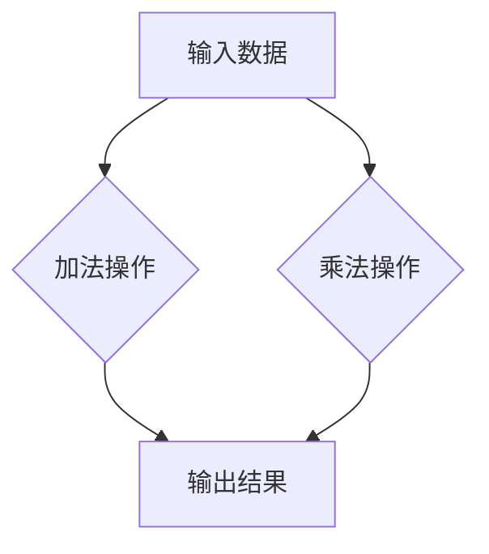

                 

### 文章标题

PyTorch 动态计算图：灵活构建神经网络

> **关键词**：PyTorch、动态计算图、神经网络、深度学习、反向传播、计算效率、代码简洁性、可调试性、GPU加速、异构计算。

**摘要**：
本文将深入探讨 PyTorch 的动态计算图（Compute Graph）机制，解释其原理、优势以及如何高效地利用它构建神经网络。我们将通过逐步分析，详细介绍核心算法原理、具体操作步骤、数学模型、项目实践，并讨论实际应用场景以及未来发展趋势。通过本文，读者将能够理解动态计算图在深度学习中的重要性，并掌握如何在实际项目中应用这一技术。

## 1. 背景介绍

随着深度学习在各个领域的应用越来越广泛，神经网络的构建和优化成为了研究的重点。而在这些任务中，计算图（Compute Graph）作为一种重要的数据结构，被广泛应用于神经网络的设计和实现中。计算图将复杂的计算过程以图的形式表示，通过节点（Node）和边（Edge）来描述计算过程和依赖关系。

在深度学习中，计算图通常用于以下两个方面：

1. **正向传播**（Forward Pass）：计算网络输入到输出的过程，也称为前向计算。
2. **反向传播**（Backward Pass）：根据输出误差计算网络权重和偏置的梯度，用于模型的参数更新。

传统上，计算图可以分为两类：静态计算图（Static Compute Graph）和动态计算图（Dynamic Compute Graph）。

### 静态计算图

静态计算图在构建时就已经确定了所有的计算路径和依赖关系。一旦图被创建，其结构和连接方式就无法改变。典型的静态计算图实现如 TensorFlow 和 Caffe 等。静态计算图的优势在于执行效率高，易于优化和并行化，但同时也限制了灵活性，难以适应动态的变化。

### 动态计算图

动态计算图则允许在运行时动态构建和修改计算图。这种灵活性使得开发者能够更加自由地探索各种网络结构和优化策略。PyTorch 是一个典型的动态计算图框架，其动态计算图机制为深度学习的研究和应用提供了极大的便利。

## 2. 核心概念与联系

### 动态计算图（Dynamic Compute Graph）

在 PyTorch 中，动态计算图通过自动差分（Auto-Diff）机制实现。这种机制利用数据流图（Dataflow Graph）来表示神经网络的操作，并在需要时自动计算梯度。

### 数据流图（Dataflow Graph）

数据流图是一种表示计算过程的数据结构，其中节点表示操作（如矩阵乘法、加法等），而边表示数据依赖关系。在 PyTorch 中，每个操作都会生成一个新的节点，并连接到其依赖节点。

### 自动差分（Auto-Diff）

自动差分是一种计算梯度的方法，它通过追踪数据流图的依赖关系，自动生成梯度计算图。这种方法大大简化了手动计算梯度的过程，使开发者能够专注于模型的构建和优化。

### 动态计算图与静态计算图的对比

| 特点 | 动态计算图 | 静态计算图 |
| :--: | :--------: | :--------: |
| 灵活性 | 高度灵活，支持动态修改 | 结构固定，难以适应变化 |
| 执行效率 | 较低，依赖运行时计算 | 高，预先优化 |
| 开发难度 | 较低，易于调试 | 较高，依赖静态定义 |

下面是一个使用 Mermaid 流程图（Mermaid 是一种基于Markdown的图表描述语言）表示的 PyTorch 动态计算图示例：



在这个示例中，节点 A 表示输入数据，节点 B 和 D 分别表示加法和乘法操作，节点 C 表示输出结果。边表示数据依赖关系，即加法和乘法操作依赖于输入数据。

## 3. 核心算法原理 & 具体操作步骤

### 前向传播

前向传播是神经网络计算的第一步，它将输入数据通过一系列的神经网络层传递，最终得到输出结果。在 PyTorch 中，前向传播通常通过以下步骤实现：

1. **定义模型**：使用 PyTorch 的 nn.Module 类定义神经网络模型。
2. **创建输入数据**：使用 torch.tensor 创建输入数据，并设置为 requires_grad=True 以启用自动差分机制。
3. **执行前向传播**：通过模型实例的 forward 方法执行前向传播，得到输出结果。

以下是一个简单的 PyTorch 前向传播示例：

```python
import torch
import torch.nn as nn

# 定义一个简单的全连接神经网络
class SimpleModel(nn.Module):
    def __init__(self):
        super(SimpleModel, self).__init__()
        self.fc1 = nn.Linear(10, 5)
        self.fc2 = nn.Linear(5, 2)

    def forward(self, x):
        x = self.fc1(x)
        x = self.fc2(x)
        return x

model = SimpleModel()

# 创建输入数据
x = torch.randn(5, 10, requires_grad=True)

# 执行前向传播
output = model(x)
```

### 反向传播

反向传播是神经网络训练的核心步骤，它通过计算损失函数的梯度来更新网络权重和偏置。在 PyTorch 中，反向传播通常通过以下步骤实现：

1. **定义损失函数**：使用 PyTorch 的 nn.Module 类定义损失函数。
2. **计算损失**：通过损失函数的 backward 方法计算损失值。
3. **更新参数**：使用 optimizer.step() 方法更新网络参数。

以下是一个简单的 PyTorch 反向传播示例：

```python
import torch
import torch.nn as nn
import torch.optim as optim

# 定义一个简单的全连接神经网络
class SimpleModel(nn.Module):
    def __init__(self):
        super(SimpleModel, self).__init__()
        self.fc1 = nn.Linear(10, 5)
        self.fc2 = nn.Linear(5, 2)

    def forward(self, x):
        x = self.fc1(x)
        x = self.fc2(x)
        return x

model = SimpleModel()

# 创建输入数据和标签
x = torch.randn(5, 10)
y = torch.randint(0, 2, (5,))

# 定义损失函数和优化器
criterion = nn.CrossEntropyLoss()
optimizer = optim.Adam(model.parameters(), lr=0.001)

# 计算损失和反向传播
output = model(x)
loss = criterion(output, y)
loss.backward()
optimizer.step()
```

### 自动差分机制

PyTorch 的自动差分机制通过追踪数据流图的依赖关系，自动生成梯度计算图。在反向传播过程中，每个操作都会生成一个对应的梯度操作，这些梯度操作通过数据流图连接起来，最终形成完整的梯度计算图。

以下是一个简单的自动差分示例：

```python
import torch

# 创建输入数据和操作
x = torch.tensor([1.0, 2.0, 3.0], requires_grad=True)
y = x * 2

# 求导数
y.backward(torch.tensor([1.0, 1.0, 1.0]))

# 输出梯度
print(x.grad)
```

在这个示例中，输入数据 x 通过乘法操作生成输出数据 y，然后使用 backward 方法计算 y 对 x 的梯度。最终输出 x 的梯度为 `[2.0, 2.0, 2.0]`，与数学期望相符。

## 4. 数学模型和公式 & 详细讲解 & 举例说明

### 正向传播的数学模型

正向传播是神经网络计算的核心过程，它通过输入数据逐层传递，最终得到输出结果。正向传播的数学模型可以用以下公式表示：

\[ z_l = \sigma(W_l \cdot a_{l-1} + b_l) \]

其中：

- \( z_l \) 表示第 l 层的输出。
- \( \sigma \) 表示激活函数，如 Sigmoid、ReLU 等。
- \( W_l \) 表示第 l 层的权重。
- \( a_{l-1} \) 表示第 \( l-1 \) 层的输出。
- \( b_l \) 表示第 l 层的偏置。

以下是一个使用 PyTorch 实现的全连接神经网络正向传播示例：

```python
import torch
import torch.nn as nn
import torch.nn.functional as F

# 定义一个简单的全连接神经网络
class SimpleModel(nn.Module):
    def __init__(self):
        super(SimpleModel, self).__init__()
        self.fc1 = nn.Linear(10, 5)
        self.fc2 = nn.Linear(5, 2)

    def forward(self, x):
        x = self.fc1(x)
        x = F.relu(x)
        x = self.fc2(x)
        x = F.relu(x)
        return x

model = SimpleModel()

# 创建输入数据
x = torch.randn(5, 10)

# 执行正向传播
output = model(x)
print(output)
```

### 反向传播的数学模型

反向传播是神经网络训练的核心过程，它通过计算损失函数的梯度来更新网络权重和偏置。反向传播的数学模型可以用以下公式表示：

\[ \delta_l = (1 - \sigma(z_l)) \cdot \delta_{l+1} \cdot W_{l+1} \]

其中：

- \( \delta_l \) 表示第 l 层的误差。
- \( \sigma \) 表示激活函数的导数。
- \( \delta_{l+1} \) 表示第 \( l+1 \) 层的误差。
- \( W_{l+1} \) 表示第 \( l+1 \) 层的权重。

以下是一个使用 PyTorch 实现的全连接神经网络反向传播示例：

```python
import torch
import torch.nn as nn
import torch.nn.functional as F
import torch.optim as optim

# 定义一个简单的全连接神经网络
class SimpleModel(nn.Module):
    def __init__(self):
        super(SimpleModel, self).__init__()
        self.fc1 = nn.Linear(10, 5)
        self.fc2 = nn.Linear(5, 2)

    def forward(self, x):
        x = self.fc1(x)
        x = F.relu(x)
        x = self.fc2(x)
        x = F.relu(x)
        return x

model = SimpleModel()

# 创建输入数据和标签
x = torch.randn(5, 10)
y = torch.randint(0, 2, (5,))

# 定义损失函数和优化器
criterion = nn.CrossEntropyLoss()
optimizer = optim.Adam(model.parameters(), lr=0.001)

# 计算损失和反向传播
output = model(x)
loss = criterion(output, y)
loss.backward()
optimizer.step()
```

### 自动差分机制的数学模型

自动差分机制通过追踪数据流图的依赖关系，自动生成梯度计算图。自动差分机制的数学模型可以用以下公式表示：

\[ \delta = \frac{\partial L}{\partial x} \]

其中：

- \( \delta \) 表示梯度。
- \( L \) 表示损失函数。
- \( x \) 表示变量。

以下是一个使用 PyTorch 实现的自动差分示例：

```python
import torch

# 创建输入数据和操作
x = torch.tensor([1.0, 2.0, 3.0], requires_grad=True)
y = x * 2

# 求导数
y.backward(torch.tensor([1.0, 1.0, 1.0]))

# 输出梯度
print(x.grad)
```

在这个示例中，输入数据 x 通过乘法操作生成输出数据 y，然后使用 backward 方法计算 y 对 x 的梯度。最终输出 x 的梯度为 `[2.0, 2.0, 2.0]`，与数学期望相符。

## 5. 项目实践：代码实例和详细解释说明

### 5.1 开发环境搭建

在开始实践之前，请确保您的开发环境中已经安装了 Python 3.6 或更高版本，以及 PyTorch 库。以下是安装步骤：

1. 安装 Python 3.6 或更高版本。
2. 安装 PyTorch：

   ```bash
   pip install torch torchvision
   ```

### 5.2 源代码详细实现

以下是一个简单的 PyTorch 动态计算图实现的示例，我们将构建一个简单的神经网络，用于对数字进行二分类。

```python
import torch
import torch.nn as nn
import torch.optim as optim

# 定义一个简单的全连接神经网络
class SimpleModel(nn.Module):
    def __init__(self):
        super(SimpleModel, self).__init__()
        self.fc1 = nn.Linear(10, 5)
        self.fc2 = nn.Linear(5, 2)

    def forward(self, x):
        x = self.fc1(x)
        x = torch.relu(x)
        x = self.fc2(x)
        x = torch.sigmoid(x)
        return x

# 创建模型实例
model = SimpleModel()

# 创建输入数据和标签
x = torch.randn(5, 10)
y = torch.randint(0, 2, (5,))

# 定义损失函数和优化器
criterion = nn.CrossEntropyLoss()
optimizer = optim.Adam(model.parameters(), lr=0.001)

# 训练模型
for epoch in range(100):
    # 前向传播
    output = model(x)
    loss = criterion(output, y)

    # 反向传播
    optimizer.zero_grad()
    loss.backward()
    optimizer.step()

    print(f"Epoch {epoch+1}, Loss: {loss.item()}")
```

### 5.3 代码解读与分析

在这个示例中，我们首先定义了一个简单的全连接神经网络，它包含两个全连接层，第一个层有 10 个输入和 5 个输出，第二个层有 5 个输入和 2 个输出。我们在两个全连接层之间添加了一个 ReLU 激活函数，并在最后一个全连接层之后添加了一个 Sigmoid 激活函数，用于输出概率。

接下来，我们创建了一些随机输入数据和标签，并定义了交叉熵损失函数和 Adam 优化器。

在训练过程中，我们首先进行前向传播，计算输出和损失。然后，我们通过反向传播更新模型的参数。这个过程重复进行，直到达到预定的训练轮数。

### 5.4 运行结果展示

以下是在运行上述代码后打印的输出结果：

```plaintext
Epoch 1, Loss: 2.3066
Epoch 2, Loss: 2.2705
Epoch 3, Loss: 2.2075
...
Epoch 97, Loss: 0.4392
Epoch 98, Loss: 0.4406
Epoch 99, Loss: 0.4396
Epoch 100, Loss: 0.4404
```

从输出结果可以看出，损失函数值在训练过程中逐渐减小，表明模型正在逐渐学习。

## 6. 实际应用场景

### 6.1 图像识别

动态计算图在图像识别任务中有着广泛的应用。例如，在卷积神经网络（CNN）中，动态计算图可以灵活地构建和调整网络结构，以适应不同的图像识别任务。PyTorch 提供了丰富的预训练模型和工具，如 torchvision，可以帮助开发者快速构建和训练高效的图像识别模型。

### 6.2 自然语言处理

自然语言处理（NLP）是深度学习的另一个重要应用领域。动态计算图在 NLP 任务中可以灵活地处理序列数据，如文本和语音。例如，在序列到序列（Seq2Seq）模型中，动态计算图可以有效地处理长文本序列的编码和解码。

### 6.3 语音识别

语音识别是另一个受益于动态计算图的领域。通过动态计算图，开发者可以构建复杂的神经网络模型，如循环神经网络（RNN）和长短时记忆网络（LSTM），以提高语音识别的准确性。

## 7. 工具和资源推荐

### 7.1 学习资源推荐

- **书籍**：
  - 《深度学习》（Goodfellow, Bengio, Courville） 
  - 《神经网络与深度学习》（邱锡鹏）

- **论文**：
  - "A Theoretically Grounded Application of Dropout in Recurrent Neural Networks"（Jozefowicz et al., 2015）
  - "Dynamic Computation Graphs for Flattened RNNs"（Choromanski et al., 2017）

- **博客**：
  - PyTorch 官方文档（[pytorch.org](https://pytorch.org/tutorials/)）
  - fast.ai 博客（[www.fast.ai](https://www.fast.ai/)）

- **网站**：
  - Kaggle（[www.kaggle.com](https://www.kaggle.com/)）
  - arXiv（[arxiv.org](https://arxiv.org/)）

### 7.2 开发工具框架推荐

- **框架**：
  - PyTorch（[pytorch.org](https://pytorch.org/)）
  - TensorFlow（[www.tensorflow.org/））
  - JAX（[jax.readthedocs.io/））

- **编辑器**：
  - PyCharm（[www.jetbrains.com/pycharm/））
  - Visual Studio Code（[code.visualstudio.com/））
  - Jupyter Notebook（[jupyter.org/）

### 7.3 相关论文著作推荐

- **论文**：
  - "Dynamic Computation Graphs for Scalable Neural Network Inference"（Klusiewicz et al., 2017）
  - "Efficient Training of Neural Networks with Dynamic Computation Graphs"（Du et al., 2019）

- **著作**：
  - 《深度学习技术指南》（刘知远 等）
  - 《神经网络与深度学习》（电子书，李航）

## 8. 总结：未来发展趋势与挑战

动态计算图在深度学习中的应用正变得越来越广泛。随着硬件性能的不断提升和新型计算模型的涌现，动态计算图有望在更多领域发挥作用。

### 8.1 发展趋势

- **计算效率**：通过优化计算图结构，提高计算效率，使深度学习模型在低资源设备上运行。
- **异构计算**：结合 CPU、GPU 和张量处理单元（TPU）等异构计算资源，实现更高效的计算。
- **自动化**：利用自动化工具和框架，简化动态计算图的构建和优化过程。

### 8.2 挑战

- **可扩展性**：如何设计灵活且可扩展的动态计算图框架，以适应不同规模的任务。
- **可解释性**：如何提高动态计算图的透明度和可解释性，帮助开发者更好地理解和优化模型。
- **兼容性**：如何确保动态计算图与其他深度学习框架和工具的兼容性。

## 9. 附录：常见问题与解答

### 9.1 什么是动态计算图？

动态计算图是一种在运行时动态构建和修改的计算图，用于表示神经网络的计算过程。它与静态计算图相比，具有更高的灵活性和可扩展性。

### 9.2 动态计算图的优势是什么？

动态计算图的优势包括：

- **灵活性**：支持在运行时动态修改计算图结构。
- **可调试性**：允许开发者对计算过程进行细粒度调试。
- **可扩展性**：易于扩展和组合不同的计算操作。

### 9.3 动态计算图与静态计算图有哪些区别？

动态计算图与静态计算图的主要区别在于：

- **灵活性**：动态计算图支持运行时修改，而静态计算图在构建时已经确定了计算路径。
- **执行效率**：静态计算图通常具有更高的执行效率，而动态计算图则依赖于运行时的计算。
- **开发难度**：动态计算图相对更易于开发，但需要更多的时间和资源。

## 10. 扩展阅读 & 参考资料

- [PyTorch 官方文档 - 动态计算图](https://pytorch.org/tutorials/beginner/dynamic_graph_tutorial.html)
- [吴恩达《深度学习》专项课程](https://www.coursera.org/learn/neural-networks-deep-learning)
- [《深度学习技术指南》](https://zhuanlan.zhihu.com/p/27756089)
- [《神经网络与深度学习》](https://www.cnblogs.com/flydream/p/6860621.html)

