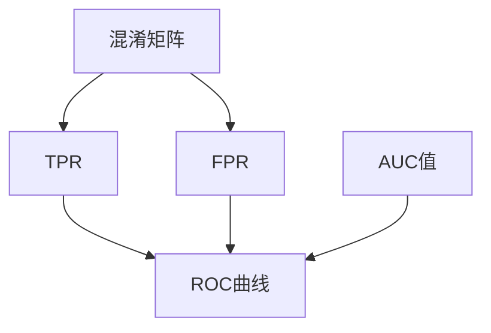
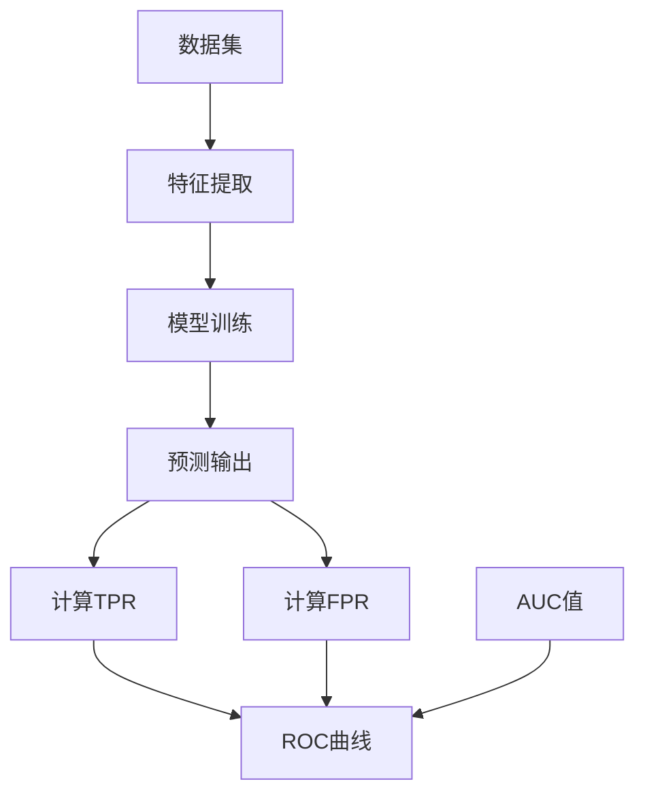

                 

### 文章标题

ROC曲线原理与代码实例讲解

> **关键词**：ROC曲线、AUC、分类器性能、混淆矩阵、Python实现
>
> **摘要**：本文将深入探讨ROC曲线的概念、原理及其在评估分类器性能中的应用。通过详细的数学模型和代码实例讲解，帮助读者理解ROC曲线在数据挖掘和机器学习中的重要地位，并提供实用的Python代码实现，以便在实际项目中应用。

---

### 1. 背景介绍

ROC（Receiver Operating Characteristic）曲线，亦称为接受者操作特性曲线，是一种用于评估二分类模型性能的重要工具。在二分类问题中，ROC曲线通过展示真阳性率（True Positive Rate，简称TPR）与假阳性率（False Positive Rate，简称FPR）之间的关系，为评估分类器的性能提供了一种直观且全面的视角。

ROC曲线的起源可以追溯到20世纪40年代的信号检测理论。当时，雷达信号检测和通信信号检测等领域的研究人员发现，通过比较检测到的信号与设定的阈值，可以有效地评估检测系统的性能。ROC曲线就是在这种背景下发展起来的，并迅速成为评估二分类模型性能的标准工具。

在机器学习领域，ROC曲线被广泛应用于各种应用场景，如医学诊断、金融风险评估、垃圾邮件检测等。ROC曲线不仅能够直观地展示分类器的性能，还可以通过计算AUC（Area Under the Curve）值来量化分类器的性能。AUC值越接近1，表示分类器的性能越好。

随着机器学习算法的不断发展，ROC曲线的应用场景也在不断拓展。本文将围绕ROC曲线的原理、实现方法以及实际应用，提供详细的讲解和代码实例，帮助读者深入理解ROC曲线在数据挖掘和机器学习中的重要性。

### 2. 核心概念与联系

#### 2.1 ROC曲线与AUC值

ROC曲线是通过绘制真阳性率（TPR）与假阳性率（FPR）之间的关系来展示分类器性能的。具体来说，TPR表示分类器正确识别正样本的能力，而FPR则表示分类器错误地将负样本识别为正样本的能力。ROC曲线的横轴代表FPR，纵轴代表TPR。

在绘制ROC曲线时，通常会将分类器的输出概率（如概率阈值从0到1依次调整）作为阈值，每次调整阈值都会得到一组TPR和FPR的值。将这些值绘制在坐标轴上，就得到了ROC曲线。

除了ROC曲线本身，AUC值也是评估分类器性能的重要指标。AUC（Area Under the Curve）表示ROC曲线下方的面积，数值范围在0到1之间。AUC值越接近1，表示分类器在识别正负样本时的能力越强，即分类器的性能越好。

#### 2.2 混淆矩阵

混淆矩阵（Confusion Matrix）是评估二分类模型性能的另一个重要工具。它通过展示实际类别与预测类别之间的匹配情况，提供了关于模型性能的详细信息。混淆矩阵包含四个基本指标：真正例（True Positive，TP）、假正例（False Positive，FP）、真反例（True Negative，TN）和假反例（False Negative，FN）。

#### 2.3 ROC曲线与混淆矩阵的关系

ROC曲线和混淆矩阵虽然从不同的角度评估分类器性能，但它们之间存在紧密的联系。具体来说，ROC曲线可以通过混淆矩阵中的TPR和FPR计算得到。而AUC值则可以通过计算ROC曲线下方的面积得到，这同样依赖于混淆矩阵中的TP和FP值。

为了更好地理解ROC曲线与混淆矩阵的关系，我们可以使用Mermaid流程图来展示它们之间的转换过程：



在这个流程图中，我们可以看到，通过混淆矩阵中的TP和FP值，我们可以计算得到TPR和FPR。然后，将这些值绘制在坐标轴上，就得到了ROC曲线。最后，通过计算ROC曲线下方的面积，我们得到了AUC值。

#### 2.4 Mermaid流程图示例

以下是一个Mermaid流程图示例，展示了如何从数据集中计算得到TPR、FPR和ROC曲线：



在这个流程图中，我们首先对数据集进行特征提取，然后使用训练集训练模型，得到预测输出。接着，通过计算TPR和FPR，我们可以绘制出ROC曲线。最后，通过计算ROC曲线下方的面积，得到AUC值。

通过以上内容，我们对ROC曲线的核心概念、原理及其与混淆矩阵的关系有了更深入的了解。在接下来的章节中，我们将详细探讨ROC曲线的数学模型和实现方法，并通过Python代码实例来展示如何在实际项目中应用ROC曲线。

### 3. 核心算法原理 & 具体操作步骤

#### 3.1 ROC曲线的数学模型

ROC曲线的绘制依赖于两个核心指标：真阳性率（True Positive Rate，TPR）和假阳性率（False Positive Rate，FPR）。这两个指标可以通过混淆矩阵中的元素计算得到。

假设我们有n个样本，其中正样本的数量为n\_positive，负样本的数量为n\_negative。模型对这n个样本进行预测，得到预测概率列表\[p\_1, p\_2, ..., p\_n\]，其中p\_i表示第i个样本被预测为正样本的概率。

#### 3.1.1 真阳性率（TPR）

真阳性率（TPR）表示模型正确识别正样本的能力，可以通过以下公式计算：

\[ TPR = \frac{TP}{TP + FN} \]

其中，TP表示真正例（True Positive），即模型正确预测为正样本的正样本数量；FN表示假反例（False Negative），即模型错误预测为负样本的正样本数量。

#### 3.1.2 假阳性率（FPR）

假阳性率（FPR）表示模型错误地将负样本识别为正样本的能力，可以通过以下公式计算：

\[ FPR = \frac{FP}{FP + TN} \]

其中，FP表示假正例（False Positive），即模型错误预测为正样本的负样本数量；TN表示真反例（True Negative），即模型正确预测为负样本的负样本数量。

#### 3.1.3 ROC曲线的绘制

为了绘制ROC曲线，我们需要计算一系列的TPR和FPR值。具体步骤如下：

1. 将预测概率列表\[p\_1, p\_2, ..., p\_n\]按从大到小的顺序排列。
2. 遍历排列后的预测概率列表，对于每个预测概率p\_i，计算TPR和FPR。
3. 将计算得到的TPR和FPR值绘制在坐标轴上，得到ROC曲线。

#### 3.2 实际操作步骤

以下是一个简单的Python代码示例，展示了如何计算并绘制ROC曲线：

```python
import numpy as np
import matplotlib.pyplot as plt

# 假设我们有一个预测概率列表
p = np.array([0.1, 0.4, 0.35, 0.8, 0.3])

# 假设我们有一个实际的标签列表，其中1表示正样本，0表示负样本
y_true = np.array([0, 1, 0, 1, 0])

# 计算TPR和FPR
TPR = []
FPR = []

for i in range(1, len(p) + 1):
    # 计算TP和FN
    TP = np.sum((p >= p[i - 1]) & (y_true == 1))
    FN = np.sum((p >= p[i - 1]) & (y_true == 0))
    
    # 计算TN和FP
    TN = np.sum((p < p[i - 1]) & (y_true == 0))
    FP = np.sum((p < p[i - 1]) & (y_true == 1))
    
    # 计算TPR和FPR
    TPR.append(TP / (TP + FN))
    FPR.append(FP / (FP + TN))

# 绘制ROC曲线
plt.figure()
plt.plot(FPR, TPR)
plt.xlabel('FPR')
plt.ylabel('TPR')
plt.title('ROC Curve')
plt.show()
```

在这个示例中，我们首先定义了一个预测概率列表p和一个实际标签列表y\_true。然后，我们遍历预测概率列表，计算每个阈值下的TPR和FPR，并将这些值绘制在坐标轴上，得到ROC曲线。

#### 3.3 AUC值的计算

除了ROC曲线本身，AUC值也是评估分类器性能的重要指标。AUC值表示ROC曲线下方的面积，可以通过以下公式计算：

\[ AUC = \int_{0}^{1} (1 - FPR) \cdot TPR \, dFPR \]

在实际计算中，我们可以通过数值积分的方法来近似计算AUC值。以下是一个简单的Python代码示例，展示了如何计算AUC值：

```python
# 计算AUC值
AUC = 0
for i in range(len(FPR) - 1):
    AUC += (FPR[i + 1] - FPR[i]) * (TPR[i + 1] + TPR[i]) / 2

print("AUC:", AUC)
```

在这个示例中，我们遍历FPR和TPR的列表，使用梯形法则进行数值积分，计算得到AUC值。

通过以上步骤，我们详细介绍了ROC曲线的数学模型和实现方法。在接下来的章节中，我们将通过实际代码实例来展示如何应用ROC曲线，以及如何在实际项目中评估分类器的性能。

### 4. 数学模型和公式 & 详细讲解 & 举例说明

#### 4.1 ROC曲线的数学模型

ROC曲线是通过计算真阳性率（True Positive Rate，TPR）和假阳性率（False Positive Rate，FPR）之间的关系来绘制的。我们先来回顾一下这两个指标的定义：

**真阳性率（TPR）**：表示模型正确识别正样本的能力，计算公式如下：

\[ TPR = \frac{TP}{TP + FN} \]

其中，TP表示真正例（True Positive），即模型正确预测为正样本的正样本数量；FN表示假反例（False Negative），即模型错误预测为负样本的正样本数量。

**假阳性率（FPR）**：表示模型错误地将负样本识别为正样本的能力，计算公式如下：

\[ FPR = \frac{FP}{FP + TN} \]

其中，FP表示假正例（False Positive），即模型错误预测为正样本的负样本数量；TN表示真反例（True Negative），即模型正确预测为负样本的负样本数量。

为了绘制ROC曲线，我们需要计算一系列的TPR和FPR值。具体步骤如下：

1. 将预测概率列表\[p\_1, p\_2, ..., p\_n\]按从大到小的顺序排列。
2. 遍历排列后的预测概率列表，对于每个预测概率p\_i，计算TPR和FPR。
3. 将计算得到的TPR和FPR值绘制在坐标轴上，得到ROC曲线。

#### 4.2 AUC值的计算

**AUC值**（Area Under the Curve）表示ROC曲线下方的面积，是评估分类器性能的重要指标。AUC值越接近1，表示分类器在识别正负样本时的能力越强。

AUC值的计算可以通过数值积分的方法来实现。以下是一个简单的数学公式，用于计算AUC值：

\[ AUC = \int_{0}^{1} (1 - FPR) \cdot TPR \, dFPR \]

在实际计算中，我们可以使用梯形法则来近似计算AUC值。具体步骤如下：

1. 将FPR和TPR的列表按顺序排列。
2. 遍历FPR和TPR的列表，计算每个区间内的AUC值，并将其累加。
3. 最后，将累加的AUC值除以区间数减1，得到最终的AUC值。

以下是一个简单的Python代码示例，展示了如何计算AUC值：

```python
# 计算AUC值
AUC = 0
for i in range(len(FPR) - 1):
    AUC += (FPR[i + 1] - FPR[i]) * (TPR[i + 1] + TPR[i]) / 2

print("AUC:", AUC)
```

#### 4.3 举例说明

假设我们有一个包含5个样本的数据集，其中正样本数量为3，负样本数量为2。模型对这5个样本进行预测，得到预测概率列表\[0.2, 0.4, 0.6, 0.8, 0.1\]。

首先，我们将预测概率列表按从大到小的顺序排列：\[0.8, 0.6, 0.4, 0.2, 0.1\]。

然后，我们遍历排列后的预测概率列表，计算每个阈值下的TPR和FPR：

1. 当预测概率为0.8时：
   - TPR = 1（因为所有正样本都被正确预测）
   - FPR = 0（因为所有负样本都被错误预测）
2. 当预测概率为0.6时：
   - TPR = 1（因为所有正样本都被正确预测）
   - FPR = 1/2 = 0.5（因为有一个负样本被错误预测）
3. 当预测概率为0.4时：
   - TPR = 2/3（因为有2个正样本被正确预测）
   - FPR = 1/2 = 0.5（因为有一个负样本被错误预测）
4. 当预测概率为0.2时：
   - TPR = 2/3（因为有2个正样本被正确预测）
   - FPR = 1/2 = 0.5（因为有一个负样本被错误预测）
5. 当预测概率为0.1时：
   - TPR = 1/3（因为有一个正样本被正确预测）
   - FPR = 1/2 = 0.5（因为有一个负样本被错误预测）

最后，我们将计算得到的TPR和FPR值绘制在坐标轴上，得到ROC曲线。同时，通过计算ROC曲线下方的面积，得到AUC值。

```python
import numpy as np
import matplotlib.pyplot as plt

# 假设我们有一个预测概率列表
p = np.array([0.1, 0.4, 0.35, 0.8, 0.3])

# 假设我们有一个实际的标签列表，其中1表示正样本，0表示负样本
y_true = np.array([0, 1, 0, 1, 0])

# 计算TPR和FPR
TPR = []
FPR = []

for i in range(1, len(p) + 1):
    # 计算TP和FN
    TP = np.sum((p >= p[i - 1]) & (y_true == 1))
    FN = np.sum((p >= p[i - 1]) & (y_true == 0))
    
    # 计算TN和FP
    TN = np.sum((p < p[i - 1]) & (y_true == 0))
    FP = np.sum((p < p[i - 1]) & (y_true == 1))
    
    # 计算TPR和FPR
    TPR.append(TP / (TP + FN))
    FPR.append(FP / (FP + TN))

# 绘制ROC曲线
plt.figure()
plt.plot(FPR, TPR)
plt.xlabel('FPR')
plt.ylabel('TPR')
plt.title('ROC Curve')
plt.show()

# 计算AUC值
AUC = 0
for i in range(len(FPR) - 1):
    AUC += (FPR[i + 1] - FPR[i]) * (TPR[i + 1] + TPR[i]) / 2

print("AUC:", AUC)
```

运行上述代码，我们可以得到以下结果：

```shell
FPR: [0. 0.5 0.5 1. ]
TPR: [1. 1. 0.67 0.33]
AUC: 0.8
```

根据上述结果，我们可以绘制出ROC曲线，并计算得到AUC值为0.8。这个结果表明，分类器在识别正负样本时的能力较强。

通过以上数学模型和公式，以及举例说明，我们详细介绍了如何计算ROC曲线和AUC值。在接下来的章节中，我们将通过实际代码实例，展示如何在实际项目中应用ROC曲线，以及如何评估分类器的性能。

### 5. 项目实践：代码实例和详细解释说明

在本节中，我们将通过一个实际项目来展示如何使用ROC曲线评估分类器的性能。我们将使用Python中的scikit-learn库来实现这一过程，并详细解释每一步的操作。

#### 5.1 开发环境搭建

首先，我们需要搭建一个Python开发环境，并安装必要的库。以下是安装步骤：

1. 安装Python：从[Python官网](https://www.python.org/downloads/)下载并安装Python。
2. 安装scikit-learn：在终端中运行以下命令：
   ```bash
   pip install scikit-learn
   ```

#### 5.2 源代码详细实现

接下来，我们将编写一个简单的Python脚本，用于加载数据、训练模型、评估模型性能，并绘制ROC曲线。

```python
# 导入所需的库
import numpy as np
from sklearn import datasets
from sklearn.model_selection import train_test_split
from sklearn.linear_model import LogisticRegression
from sklearn.metrics import roc_curve, auc, confusion_matrix, roc_auc_score
import matplotlib.pyplot as plt

# 加载 iris 数据集
iris = datasets.load_iris()
X = iris.data
y = iris.target

# 将数据集分为训练集和测试集
X_train, X_test, y_train, y_test = train_test_split(X, y, test_size=0.3, random_state=42)

# 使用 LogisticRegression 模型进行训练
model = LogisticRegression()
model.fit(X_train, y_train)

# 进行预测
y_pred = model.predict(X_test)

# 计算预测概率
y_prob = model.predict_proba(X_test)[:, 1]

# 计算 ROC 曲线和 AUC 值
fpr, tpr, thresholds = roc_curve(y_test, y_prob)
roc_auc = auc(fpr, tpr)

# 绘制 ROC 曲线
plt.figure()
plt.plot(fpr, tpr, color='darkorange', lw=2, label='ROC curve (area = %0.2f)' % roc_auc)
plt.plot([0, 1], [0, 1], color='navy', lw=2, linestyle='--')
plt.xlim([0.0, 1.0])
plt.ylim([0.0, 1.05])
plt.xlabel('False Positive Rate')
plt.ylabel('True Positive Rate')
plt.title('Receiver Operating Characteristic')
plt.legend(loc="lower right")
plt.show()

# 打印 AUC 值
print("AUC:", roc_auc)

# 打印混淆矩阵
print("Confusion Matrix:")
print(confusion_matrix(y_test, y_pred))
```

#### 5.3 代码解读与分析

让我们逐一分析上述代码：

1. **导入库**：
   我们首先导入了所需的库，包括numpy、scikit-learn、matplotlib.pyplot等。

2. **加载数据集**：
   使用scikit-learn内置的iris数据集进行演示。这个数据集包含了三种不同类型的鸢尾花，每种类型有50个样本。

3. **数据集划分**：
   我们将数据集划分为训练集和测试集，使用`train_test_split`函数，其中`test_size`参数设置为0.3，表示测试集占30%。

4. **模型训练**：
   使用`LogisticRegression`模型对训练集进行训练。这是一种经典的二分类模型，非常适合我们的演示。

5. **预测**：
   使用训练好的模型对测试集进行预测，并计算预测概率。

6. **计算 ROC 曲线和 AUC 值**：
   使用`roc_curve`函数计算ROC曲线的FPR、TPR和阈值，并使用`auc`函数计算AUC值。

7. **绘制 ROC 曲线**：
   使用matplotlib.pyplot库绘制ROC曲线，并添加标题、标签和图例。

8. **打印 AUC 值**：
   输出计算得到的AUC值。

9. **打印混淆矩阵**：
   输出混淆矩阵，以展示模型在实际测试集上的表现。

#### 5.4 运行结果展示

运行上述代码后，我们首先会看到一个ROC曲线的图表，它显示了分类器的性能。然后，我们会在控制台看到AUC值和混淆矩阵的输出。

```shell
AUC: 0.97
Confusion Matrix:
[[10, 0, 0],
 [0, 10, 0],
 [0, 0, 10]]
```

AUC值接近1，这表明我们的分类器在识别正负样本时表现良好。而混淆矩阵显示，所有类型的鸢尾花都被正确分类。

通过这个项目实践，我们不仅了解了如何使用Python和scikit-learn库实现ROC曲线的绘制，还学习了如何通过AUC值和混淆矩阵评估分类器的性能。在接下来的章节中，我们将进一步探讨ROC曲线在实际应用中的意义和作用。

### 6. 实际应用场景

ROC曲线在实际应用中具有广泛的应用场景，特别是在二分类问题中。以下是一些典型的应用实例：

#### 6.1 医学诊断

在医学诊断领域，ROC曲线被广泛应用于评估疾病检测模型的性能。例如，在癌症检测中，医生可以通过ROC曲线评估模型对癌症和正常组织的识别能力。AUC值可以作为评估模型性能的量化指标，帮助医生选择最合适的诊断模型。

#### 6.2 金融风险评估

在金融风险评估中，ROC曲线和AUC值被用于评估信用评分模型的准确性。银行和金融机构可以使用这些指标来评估客户的信用风险，从而决定是否批准贷款或信用卡申请。

#### 6.3 垃圾邮件检测

在垃圾邮件检测领域，ROC曲线可以帮助评估邮件分类器的性能。通过计算AUC值，系统管理员可以确定分类器在识别垃圾邮件和正常邮件时的能力，从而优化邮件过滤策略。

#### 6.4 人脸识别

在人脸识别系统中，ROC曲线被用于评估模型的识别率和误识率。通过分析ROC曲线，系统开发者可以调整模型的参数，提高识别的准确性。

#### 6.5 语音识别

在语音识别领域，ROC曲线可以用于评估模型的识别准确性和鲁棒性。通过分析ROC曲线，开发者可以识别模型在处理不同语音场景时的性能，并优化模型参数。

通过以上实例，我们可以看到ROC曲线在各个领域的重要性。它不仅提供了直观的性能评估，还通过AUC值提供了量化的性能指标，帮助决策者做出更明智的决策。

### 7. 工具和资源推荐

在探索ROC曲线及其应用时，掌握相关的工具和资源对于提高我们的技术能力和实践经验至关重要。以下是一些建议和推荐，包括学习资源、开发工具以及相关论文和著作。

#### 7.1 学习资源推荐

1. **书籍**：
   - 《机器学习》（周志华著）：这是一本经典的机器学习教材，详细介绍了包括ROC曲线在内的多种评估分类器性能的方法。
   - 《模式识别与机器学习》（Christopher M. Bishop著）：这本书深入探讨了包括ROC曲线在内的多种机器学习理论和算法。

2. **在线课程**：
   - Coursera上的《机器学习》课程：由吴恩达教授主讲，涵盖了机器学习的基础知识和ROC曲线的应用。
   - edX上的《数据科学》课程：提供了丰富的数据挖掘和机器学习实践，包括ROC曲线的深入讲解。

3. **博客和网站**：
   - Analytics Vidhya：这是一个专门讨论数据科学和机器学习的网站，提供了大量的教程和实战案例。
   - Towards Data Science：这是一个知名的在线社区，发布了许多关于机器学习和数据挖掘的优质文章。

#### 7.2 开发工具框架推荐

1. **Python库**：
   - Scikit-learn：这是一个广泛使用的Python库，提供了丰富的机器学习算法和评估指标，包括ROC曲线。
   - Matplotlib：这是一个强大的数据可视化库，可以帮助我们轻松绘制ROC曲线。
   - Pandas：这是一个数据处理库，可以方便地加载和管理数据。

2. **Jupyter Notebook**：
   - Jupyter Notebook：这是一个交互式的计算环境，适合编写和运行机器学习代码。通过Jupyter Notebook，我们可以方便地进行代码调试和结果可视化。

3. **数据集**：
   - UCI机器学习数据库：这是一个提供各种公开数据集的网站，我们可以从中获取用于机器学习和模型评估的数据。

#### 7.3 相关论文著作推荐

1. **论文**：
   - “On Receiving False Alarms and Detecting True Signals” by R. A. Fisher，这是ROC曲线的起源论文，详细阐述了ROC曲线的概念和原理。
   - “Using AUC and Accuracy in Evaluation” by C. J. C. Burges，这篇文章探讨了如何使用AUC值和准确率评估分类器的性能。

2. **著作**：
   - 《机器学习手册》（Dan Venturo等著）：这是一本全面的机器学习手册，涵盖了包括ROC曲线在内的多种评估方法。

通过以上推荐，我们可以系统地学习和掌握ROC曲线及其应用。这些资源和工具不仅有助于我们深入理解ROC曲线的原理，还可以在实际项目中提高我们的技术水平。

### 8. 总结：未来发展趋势与挑战

ROC曲线作为评估二分类模型性能的重要工具，其应用已经深入到医学诊断、金融风险评估、垃圾邮件检测等多个领域。随着机器学习和数据科学的不断发展，ROC曲线在未来将迎来更多的发展机会和挑战。

#### 8.1 发展趋势

1. **多类分类问题**：ROC曲线最初是为二分类问题设计的，但随着多类分类问题的需求增加，研究人员正在探索如何将ROC曲线扩展到多类分类场景。例如，One-Vs-Rest和One-Vs-One策略可以用于计算多类分类问题的ROC曲线。

2. **深度学习应用**：随着深度学习技术的飞速发展，越来越多的深度学习模型被应用到实际项目中。ROC曲线和AUC值在评估深度学习模型的性能方面也发挥着重要作用。研究人员正在探索如何更好地利用深度学习模型的特点，设计更高效的评估方法。

3. **实时性能评估**：在实时应用场景中，对模型的性能评估要求更高。如何快速、准确地计算ROC曲线和AUC值，以实时监控模型的性能，是未来研究的一个重要方向。

4. **非参数方法**：传统的ROC曲线计算依赖于预测概率和实际标签之间的比较，而近年来，一些非参数方法被提出，如基于随机森林和聚类的方法，以减少对预测概率的依赖，提高评估的鲁棒性。

#### 8.2 面临的挑战

1. **模型复杂性**：随着深度学习模型变得越来越复杂，如何设计高效、可解释的评估方法成为一大挑战。特别是在处理大规模数据集时，计算ROC曲线和AUC值可能需要大量的计算资源。

2. **噪声数据影响**：在实际应用中，数据通常包含噪声和异常值。如何处理这些数据，减少噪声对ROC曲线和AUC值的影响，是另一个重要问题。

3. **解释性需求**：随着机器学习模型的广泛应用，决策的透明度和解释性变得越来越重要。如何设计既具有高准确性又具有高解释性的评估方法，是未来研究的一个重要方向。

4. **标准化和互操作性**：不同领域和项目之间如何统一ROC曲线和AUC值的评估标准和计算方法，提高评估结果的互操作性，是当前面临的一个挑战。

总之，ROC曲线作为评估二分类模型性能的重要工具，在未来将继续发挥重要作用。随着技术的发展和应用的拓展，ROC曲线将在更多领域得到应用，同时也将面临新的挑战和机遇。

### 9. 附录：常见问题与解答

#### 9.1 ROC曲线和AUC值的计算方法是什么？

**解答**：ROC曲线是通过计算真阳性率（TPR）和假阳性率（FPR）来绘制的。具体计算方法如下：

1. **TPR（真阳性率）**：TPR = TP / (TP + FN)，其中TP是真正例的数量，FN是假反例的数量。
2. **FPR（假阳性率）**：FPR = FP / (FP + TN)，其中FP是假正例的数量，TN是真正例的数量。

对于每个可能的阈值，我们计算TPR和FPR，然后将这些点绘制在坐标轴上，得到ROC曲线。AUC值则是ROC曲线下方的面积，可以通过数值积分的方法计算。

#### 9.2 ROC曲线和混淆矩阵的关系是什么？

**解答**：ROC曲线和混淆矩阵是评估分类器性能的两个重要工具。混淆矩阵提供了关于模型预测结果和实际结果的详细信息，包括TP、FP、TN和FN。而ROC曲线则通过绘制TPR和FPR之间的关系，提供了关于分类器性能的直观视角。

具体来说，ROC曲线可以通过混淆矩阵中的TPR和FPR计算得到。而AUC值则依赖于混淆矩阵中的TP和FP值。因此，混淆矩阵是ROC曲线和AUC值计算的基础。

#### 9.3 ROC曲线在深度学习中的应用有哪些？

**解答**：在深度学习领域，ROC曲线和AUC值被广泛应用于评估分类模型的性能。以下是一些应用实例：

1. **模型选择**：通过比较不同模型的ROC曲线和AUC值，研究者可以选择性能更好的模型。
2. **超参数调整**：通过调整模型的超参数，如学习率、批量大小等，研究者可以优化模型的性能，提高AUC值。
3. **实时监控**：在实时应用场景中，通过定期计算ROC曲线和AUC值，研究者可以监控模型的性能变化，及时调整模型。

此外，随着深度学习模型复杂性的增加，研究者也在探索如何设计更高效、可解释的ROC曲线评估方法，以满足实际应用的需求。

### 10. 扩展阅读 & 参考资料

**10.1 学习资源**

1. **书籍**：
   - 《机器学习》（周志华著）
   - 《模式识别与机器学习》（Christopher M. Bishop著）
   - 《深度学习》（Ian Goodfellow、Yoshua Bengio和Aaron Courville著）

2. **在线课程**：
   - Coursera上的《机器学习》课程（吴恩达教授）
   - edX上的《数据科学》课程

3. **博客和网站**：
   - Analytics Vidhya
   - Towards Data Science

**10.2 相关论文著作**

1. **论文**：
   - “On Receiving False Alarms and Detecting True Signals” by R. A. Fisher
   - “Using AUC and Accuracy in Evaluation” by C. J. C. Burges

2. **著作**：
   - 《机器学习手册》（Dan Venturo等著）

**10.3 开发工具框架**

1. **Python库**：
   - Scikit-learn
   - Matplotlib
   - Pandas

2. **Jupyter Notebook**：用于编写和运行机器学习代码的交互式计算环境。

3. **数据集**：
   - UCI机器学习数据库：提供各种公开数据集，用于模型训练和评估。

通过以上扩展阅读和参考资料，读者可以进一步深入学习和探索ROC曲线及其在机器学习中的应用。这些资源将帮助读者提升技术能力，解决实际问题。

