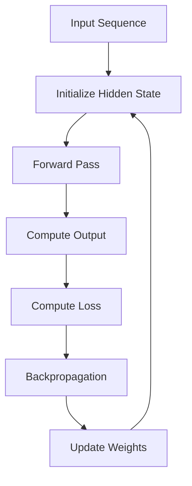

                 

### 1. 背景介绍

#### 1.1 Recurrent Neural Networks (RNN)的定义与历史背景

Recurrent Neural Networks（RNN），即循环神经网络，是一种特殊类型的神经网络，它们能够在处理序列数据时保持内部状态。这种内部状态在每次输入新的数据时都会更新，从而使网络能够利用之前的信息来影响当前和未来的输出。

RNN的历史可以追溯到1982年，当时Jürgen Schmidhuber提出了一种名为Simple Recurrent Network（SRN）的简单循环神经网络结构。随后的几年里，诸如Backpropagation Through Time（BPTT）和Hessian-based learning方法被引入，以解决循环神经网络中的梯度消失和梯度爆炸问题。尽管这些方法在理论上取得了进展，但在实际应用中仍面临诸多挑战。

进入21世纪，随着计算能力的提升和深度学习技术的发展，RNN逐渐成为了处理序列数据的重要工具。2014年，来自Google的研究团队提出了一种名为Long Short-Term Memory（LSTM）的新型循环神经网络结构，显著改善了长序列数据的处理能力。此后，RNN及其变种，如GRU（Gated Recurrent Unit），在自然语言处理、语音识别、时间序列预测等领域取得了突破性的成果。

#### 1.2 RNN的应用领域

RNN由于其独特的内部状态保持能力，在多个应用领域展现出强大的潜力：

- **自然语言处理（NLP）**：RNN被广泛应用于文本分类、机器翻译、情感分析等任务。它们能够捕捉文本中的上下文信息，从而提高模型的性能。

- **语音识别**：在语音识别中，RNN能够有效处理变长的音频序列，捕捉语音信号的时序特征。

- **时间序列预测**：RNN在时间序列预测任务中，如股票价格预测、天气预测等，表现出良好的性能。通过学习历史数据，RNN能够预测未来的趋势。

- **图像序列处理**：在视频分析中，RNN被用于动作识别、对象追踪等任务。它们能够处理连续的图像序列，识别出视频中的关键动作。

- **其他应用**：RNN还广泛应用于生成模型、强化学习等复杂场景，通过不断更新内部状态，学习复杂的序列依赖关系。

#### 1.3 RNN的重要性

RNN的重要性在于其能够处理序列数据，并在多个领域取得了显著成果。传统的神经网络在处理这类数据时往往表现不佳，因为它们无法保持序列中的历史信息。而RNN通过其内部状态更新机制，能够在处理长时间序列时保持信息的完整性，从而在诸如自然语言处理、语音识别等领域发挥了关键作用。

此外，RNN的推广和应用也推动了深度学习技术的发展。LSTM和GRU等结构创新为解决长序列依赖问题提供了新的思路，使深度学习模型在序列数据处理任务中的性能得到了显著提升。

总之，RNN作为一种特殊类型的神经网络，不仅丰富了深度学习的应用场景，也为处理序列数据提供了有效的工具。在接下来的章节中，我们将深入探讨RNN的核心概念、算法原理及其数学模型，帮助读者更好地理解和应用RNN。

#### 1.4 RNN的基本概念

Recurrent Neural Networks（RNN）是一种能够处理序列数据的神经网络，其核心特点在于具有记忆机制，即网络能够在其内部保持状态。这种状态更新机制使得RNN能够利用之前的信息来影响当前和未来的输出，从而在处理变长序列数据时具有优势。

**1.4.1 输入序列与输出序列**

在RNN中，输入数据通常是一个时间序列，例如一段文本、一个音频信号或一个时间序列数据。每个时间步（Time Step）接收一个输入向量（Input Vector），并将其与网络内部的隐藏状态（Hidden State）相结合，生成当前时间步的输出向量（Output Vector）。

RNN的输出序列可以是一个标量（例如，时间序列预测中的未来值）、一个向量（例如，机器翻译中的翻译结果）或一个序列（例如，语音识别中的单词序列）。每个时间步的输出都会更新网络的内部状态，使其能够依赖历史信息进行后续预测。

**1.4.2 隐藏状态与权重**

RNN的隐藏状态（Hidden State）是网络的一个重要组成部分。在每个时间步，隐藏状态会根据当前输入和之前的隐藏状态进行更新。这种更新过程通过一个非线性函数（通常是一个称为激活函数的函数）来实现，如tanh或ReLU。

隐藏状态的更新方程可以表示为：

\[ h_t = \sigma(W_h \cdot [h_{t-1}, x_t] + b_h) \]

其中，\( h_t \)是当前时间步的隐藏状态，\( x_t \)是当前输入，\( W_h \)是隐藏层权重，\( b_h \)是隐藏层偏置，\( \sigma \)是激活函数。

此外，RNN的输出通常通过一个线性变换层和激活函数（如softmax）来生成。输出层的权重和偏置分别表示为\( W_o \)和\( b_o \)：

\[ y_t = \sigma(W_o \cdot h_t + b_o) \]

其中，\( y_t \)是当前时间步的输出。

**1.4.3 回归与循环**

RNN的核心特性是它的回归性质，即当前时间步的输出会反馈到下一个时间步的输入中，形成一种循环结构。这种循环结构使得RNN能够利用历史信息来影响未来的输出。

然而，传统的RNN在处理长时间序列时存在梯度消失或梯度爆炸问题，导致网络难以学习长距离依赖关系。为解决这一问题，研究人员提出了多种改进方法，如Long Short-Term Memory（LSTM）和Gated Recurrent Unit（GRU），这些结构通过引入门控机制来控制信息的流动，从而在处理长时间序列时表现出更好的性能。

综上所述，RNN的基本概念包括输入序列与输出序列、隐藏状态与权重以及回归与循环。这些概念共同构成了RNN的核心机制，使其能够有效处理序列数据。在下一章中，我们将进一步探讨RNN的核心算法原理及其实现细节。

### 2. 核心概念与联系

为了深入理解RNN的工作原理，我们需要从其核心概念和架构入手。RNN的强大之处在于其能够通过保持内部状态，捕获序列数据中的时序依赖关系。以下我们将详细阐述RNN的核心概念，并通过Mermaid流程图展示其架构和操作流程。

#### 2.1 核心概念

**2.1.1 输入序列与隐藏状态**

RNN的核心概念之一是输入序列和隐藏状态。输入序列是一系列数据点，例如文本中的单词序列、音频信号中的波形序列或时间序列中的数值序列。隐藏状态是一个向量，它表示了网络在处理当前输入时的状态，并且会随着新的输入更新。

**2.1.2 权重矩阵**

RNN使用权重矩阵来连接输入和隐藏状态，以及隐藏状态和输出。这些权重矩阵决定了网络如何处理输入数据，并更新其内部状态。初始权重通常是随机初始化的，并在训练过程中通过反向传播算法进行调整。

**2.1.3 输出与损失函数**

RNN的输出是通过隐藏状态通过一个线性层和激活函数计算得到的。输出可以是标量（如预测的下一个时间点的值）或向量（如分类结果）。损失函数用于评估模型的输出与真实值之间的差距，并通过梯度下降算法调整权重以最小化损失。

**2.1.4 回归连接**

RNN通过回归连接来维持序列中的信息流动。具体来说，当前时间步的输出会反馈到下一个时间步的输入，形成一种循环。这种循环结构使得RNN能够利用历史信息来影响未来的输出。

#### 2.2 Mermaid流程图

为了更直观地理解RNN的架构和操作流程，我们可以使用Mermaid流程图来展示其核心概念。以下是一个简化的RNN流程图：



- **A[Input Sequence]**：输入序列是RNN处理的数据源。
- **B[Initialize Hidden State]**：初始化隐藏状态，作为网络的初始状态。
- **C[Forward Pass]**：前向传播，计算隐藏状态和输出。
- **D[Compute Output]**：根据隐藏状态计算输出。
- **E[Compute Loss]**：计算输出与真实值之间的损失。
- **F[Backpropagation]**：反向传播，计算梯度并更新权重。
- **G[Update Weights]**：使用梯度更新网络的权重。

#### 2.3 RNN的架构和操作流程

RNN的架构和操作流程可以总结如下：

1. **初始化**：网络初始化隐藏状态和权重。
2. **前向传播**：在每个时间步，输入通过权重与隐藏状态结合，生成新的隐藏状态。
3. **输出计算**：隐藏状态通过线性层和激活函数转换为输出。
4. **损失计算**：输出与真实值之间的差距通过损失函数计算。
5. **反向传播**：计算损失关于权重和偏置的梯度。
6. **权重更新**：使用梯度下降或其他优化算法更新权重。
7. **重复**：重复上述步骤，直到达到训练目标或达到最大迭代次数。

#### 2.4 门控机制

为了解决传统RNN在处理长时间序列时存在的梯度消失和梯度爆炸问题，研究人员提出了门控循环单元（LSTM）和门控循环单元（GRU）。这两种结构通过引入门控机制来控制信息的流动，从而改善RNN的性能。

- **遗忘门（Forget Gate）**：决定哪些历史信息应该被遗忘。
- **输入门（Input Gate）**：决定哪些新的信息应该被保留。
- **输出门（Output Gate）**：决定当前隐藏状态应该输出哪些信息。

LSTM和GRU的详细解释将在后续章节中展开。

通过以上对RNN核心概念和架构的详细阐述，我们能够更好地理解RNN的工作原理。在下一章中，我们将深入探讨RNN的核心算法原理和具体操作步骤。

### 3. 核心算法原理 & 具体操作步骤

在了解了RNN的基本概念和架构之后，现在我们将深入探讨其核心算法原理，并详细解释RNN在处理序列数据时的具体操作步骤。这一部分将帮助我们更好地理解RNN如何通过其独特的内部状态更新机制来捕获序列数据中的时序依赖关系。

#### 3.1 前向传播

RNN的前向传播过程可以分解为以下几个步骤：

1. **初始化**：首先，我们需要初始化RNN的隐藏状态（Hidden State）和权重（Weights）。隐藏状态通常是随机初始化的，而权重则是通过训练过程中调整得到的。

2. **输入与隐藏状态结合**：在每个时间步，输入数据（Input）会与隐藏状态通过权重矩阵（Weight Matrix）相乘，生成新的隐藏状态。这一过程可以表示为：

\[ h_t = \sigma(W_h \cdot [h_{t-1}, x_t] + b_h) \]

其中，\( h_t \)是当前时间步的隐藏状态，\( x_t \)是当前输入，\( W_h \)是隐藏层权重，\( b_h \)是隐藏层偏置，\( \sigma \)是激活函数（如tanh或ReLU）。

3. **计算输出**：通过隐藏状态，我们可以计算当前时间步的输出。这一过程通常通过一个线性变换层和激活函数（如softmax）实现：

\[ y_t = \sigma(W_o \cdot h_t + b_o) \]

其中，\( y_t \)是当前时间步的输出，\( W_o \)是输出层权重，\( b_o \)是输出层偏置。

4. **更新隐藏状态**：当前时间步的输出会反馈到下一个时间步的输入中，更新隐藏状态。这一过程形成了一个循环，使得RNN能够利用历史信息进行预测。

#### 3.2 反向传播

RNN的反向传播过程旨在通过梯度下降算法调整权重，以最小化损失函数。以下是反向传播的主要步骤：

1. **计算损失**：在输出层，我们通常使用损失函数（如均方误差MSE或交叉熵损失）来计算预测输出与真实输出之间的差距。

\[ L = \frac{1}{2} \sum_{t=1}^{T} (y_t - \hat{y}_t)^2 \]

其中，\( L \)是总损失，\( y_t \)是真实输出，\( \hat{y}_t \)是预测输出。

2. **计算梯度**：通过反向传播，我们计算损失函数关于权重和偏置的梯度。对于隐藏层和输出层的权重和偏置，梯度计算如下：

\[ \frac{\partial L}{\partial W_h} = \frac{\partial L}{\partial h_t} \cdot \frac{\partial h_t}{\partial W_h} \]
\[ \frac{\partial L}{\partial b_h} = \frac{\partial L}{\partial h_t} \cdot \frac{\partial h_t}{\partial b_h} \]

\[ \frac{\partial L}{\partial W_o} = \frac{\partial L}{\partial y_t} \cdot \frac{\partial y_t}{\partial h_t} \cdot \frac{\partial h_t}{\partial W_o} \]
\[ \frac{\partial L}{\partial b_o} = \frac{\partial L}{\partial y_t} \cdot \frac{\partial y_t}{\partial h_t} \cdot \frac{\partial h_t}{\partial b_o} \]

3. **权重更新**：使用梯度下降算法更新权重和偏置：

\[ W_h \leftarrow W_h - \alpha \cdot \frac{\partial L}{\partial W_h} \]
\[ b_h \leftarrow b_h - \alpha \cdot \frac{\partial L}{\partial b_h} \]
\[ W_o \leftarrow W_o - \alpha \cdot \frac{\partial L}{\partial W_o} \]
\[ b_o \leftarrow b_o - \alpha \cdot \frac{\partial L}{\partial b_o} \]

其中，\( \alpha \)是学习率。

#### 3.3 LSTM与GRU

为了解决传统RNN在处理长时间序列时存在的梯度消失和梯度爆炸问题，研究人员提出了长短期记忆（LSTM）和门控循环单元（GRU）。这些结构通过引入门控机制来控制信息的流动，从而显著提高了RNN的性能。

**3.3.1 LSTM（Long Short-Term Memory）**

LSTM通过引入三个门控单元（遗忘门、输入门和输出门）来控制信息的流动。以下是其具体操作步骤：

1. **遗忘门（Forget Gate）**：决定哪些历史信息应该被遗忘。计算公式如下：

\[ f_t = \sigma(W_f \cdot [h_{t-1}, x_t] + b_f) \]

\[ i_t = \sigma(W_i \cdot [h_{t-1}, x_t] + b_i) \]

\[ o_t = \sigma(W_o \cdot [h_{t-1}, x_t] + b_o) \]

\[ g_t = \tanh(W_g \cdot [h_{t-1}, x_t] + b_g) \]

\[ h_t = o_t \cdot \tanh(g_t) \]

其中，\( f_t \)、\( i_t \)、\( o_t \)分别表示遗忘门、输入门和输出门，\( g_t \)是输入门的候选值。

2. **输入门（Input Gate）**：决定哪些新的信息应该被保留。

3. **输出门（Output Gate）**：决定当前隐藏状态应该输出哪些信息。

**3.3.2 GRU（Gated Recurrent Unit）**

GRU通过引入更新门（Update Gate）和重置门（Reset Gate）来简化LSTM的结构。以下是GRU的具体操作步骤：

1. **更新门（Update Gate）**：决定当前隐藏状态应该保留哪些信息。

\[ z_t = \sigma(W_z \cdot [h_{t-1}, x_t] + b_z) \]

\[ r_t = \sigma(W_r \cdot [h_{t-1}, x_t] + b_r) \]

\[ h_t = (1 - z_t) \cdot h_{t-1} + z_t \cdot \tanh(W_h \cdot [r_t \cdot h_{t-1}, x_t] + b_h) \]

2. **重置门（Reset Gate）**：决定哪些历史信息应该被保留。

通过LSTM和GRU，RNN能够更好地处理长时间序列数据，从而在自然语言处理、语音识别等领域取得了显著成果。在下一章中，我们将详细探讨RNN的数学模型和公式，并举例说明其在具体应用中的实现。

### 4. 数学模型和公式 & 详细讲解 & 举例说明

在深入理解了RNN的核心算法原理和具体操作步骤之后，现在我们将进一步探讨RNN的数学模型和公式，并通过具体的例子来说明这些公式在实际应用中的意义。

#### 4.1 RNN的数学模型

RNN的数学模型主要包括以下几个部分：输入层、隐藏层和输出层。每个层都有其特定的权重矩阵和偏置项，以及激活函数。

**4.1.1 输入层**

输入层接收序列数据，并将其转换为适合网络处理的形式。设输入序列为\( x_1, x_2, ..., x_T \)，其中\( T \)为序列长度。输入层的权重矩阵为\( W_x \)，偏置项为\( b_x \)。

\[ h_t = \sigma(W_h \cdot [h_{t-1}, x_t] + b_h) \]

其中，\( h_t \)为隐藏状态，\( \sigma \)为激活函数（通常为tanh或ReLU）。

**4.1.2 隐藏层**

隐藏层连接输入层和输出层，通过权重矩阵和偏置项更新隐藏状态。设隐藏层权重矩阵为\( W_h \)，偏置项为\( b_h \)。

\[ h_t = \sigma(W_h \cdot [h_{t-1}, x_t] + b_h) \]

**4.1.3 输出层**

输出层通过隐藏状态生成预测输出。设输出层权重矩阵为\( W_o \)，偏置项为\( b_o \)，激活函数为\( \sigma \)。

\[ y_t = \sigma(W_o \cdot h_t + b_o) \]

其中，\( y_t \)为输出。

**4.1.4 激活函数**

激活函数为\( \sigma \)，通常为tanh或ReLU。它用于将隐藏状态和输出层转换为非线性值。

\[ \sigma(z) = \tanh(z) \]
\[ \sigma(z) = \max(0, z) \]

#### 4.2 RNN的数学公式

以下是RNN的主要数学公式，用于描述其前向传播和反向传播过程。

**4.2.1 前向传播**

\[ h_t = \sigma(W_h \cdot [h_{t-1}, x_t] + b_h) \]
\[ y_t = \sigma(W_o \cdot h_t + b_o) \]

**4.2.2 反向传播**

\[ \delta_t = \frac{\partial L}{\partial y_t} \cdot \frac{\partial y_t}{\partial h_t} \cdot \frac{\partial h_t}{\partial h_{t-1}} \cdot \frac{\partial h_{t-1}}{\partial x_t} \]
\[ \frac{\partial L}{\partial W_h} = \delta_t \cdot [h_{t-1}, x_t]^T \]
\[ \frac{\partial L}{\partial b_h} = \delta_t \]

\[ \delta_t = \frac{\partial L}{\partial y_t} \cdot \frac{\partial y_t}{\partial h_t} \cdot \frac{\partial h_t}{\partial h_{t-1}} \cdot \frac{\partial h_{t-1}}{\partial x_t} \]
\[ \frac{\partial L}{\partial W_o} = \delta_t \cdot h_t^T \]
\[ \frac{\partial L}{\partial b_o} = \delta_t \]

#### 4.3 举例说明

以下是一个简单的RNN模型，用于对序列数据进行分类。设输入序列为\( [1, 2, 3] \)，隐藏层维度为10，输出层维度为3。

**4.3.1 权重初始化**

- 输入层到隐藏层的权重矩阵：\( W_h \)，维度为\( (10, 3) \)
- 隐藏层到输出层的权重矩阵：\( W_o \)，维度为\( (3, 10) \)
- 隐藏层偏置：\( b_h \)，维度为\( (10, 1) \)
- 输出层偏置：\( b_o \)，维度为\( (3, 1) \)

假设初始隐藏状态为\( h_0 = [0, 0, 0, 0, 0, 0, 0, 0, 0, 0]^T \)。

**4.3.2 前向传播**

1. 第一时间步：

\[ h_1 = \sigma(W_h \cdot [h_0, x_1] + b_h) \]
\[ h_1 = \sigma([0, 0, 0, 0, 0, 0, 0, 0, 0, 0; 1, 2, 3] \cdot \begin{bmatrix} w_{11} & w_{12} & \cdots & w_{1n} \end{bmatrix} + \begin{bmatrix} b_{h1} & b_{h2} & \cdots & b_{hn} \end{bmatrix}) \]

2. 第二时间步：

\[ h_2 = \sigma(W_h \cdot [h_1, x_2] + b_h) \]
\[ h_2 = \sigma(h_1 \cdot \begin{bmatrix} w_{21} & w_{22} & \cdots & w_{2n} \end{bmatrix} + \begin{bmatrix} b_{h1} & b_{h2} & \cdots & b_{hn} \end{bmatrix}) \]

3. 第三时间步：

\[ h_3 = \sigma(W_h \cdot [h_2, x_3] + b_h) \]
\[ h_3 = \sigma(h_2 \cdot \begin{bmatrix} w_{31} & w_{32} & \cdots & w_{3n} \end{bmatrix} + \begin{bmatrix} b_{h1} & b_{h2} & \cdots & b_{hn} \end{bmatrix}) \]

4. 输出：

\[ y = \sigma(W_o \cdot h_3 + b_o) \]

**4.3.3 反向传播**

1. 计算输出误差：

\[ \delta_3 = \frac{\partial L}{\partial y} \cdot \frac{\partial y}{\partial h_3} \]
\[ \delta_3 = (y - \hat{y}) \cdot \begin{bmatrix} \frac{\partial \sigma}{\partial h_3} \end{bmatrix} \]

2. 计算隐藏层误差：

\[ \delta_2 = \frac{\partial L}{\partial h_3} \cdot \frac{\partial h_3}{\partial h_2} \cdot \frac{\partial h_2}{\partial x_2} \]
\[ \delta_2 = \delta_3 \cdot \begin{bmatrix} \frac{\partial \sigma}{\partial h_3} \end{bmatrix} \cdot \begin{bmatrix} w_{32} & w_{33} & \cdots & w_{3n} \end{bmatrix} \cdot \begin{bmatrix} \frac{\partial \sigma}{\partial h_2} \end{bmatrix} \]

3. 计算输入层误差：

\[ \delta_1 = \frac{\partial L}{\partial h_2} \cdot \frac{\partial h_2}{\partial h_1} \cdot \frac{\partial h_1}{\partial x_1} \]
\[ \delta_1 = \delta_2 \cdot \begin{bmatrix} w_{21} & w_{22} & \cdots & w_{2n} \end{bmatrix} \cdot \begin{bmatrix} \frac{\partial \sigma}{\partial h_1} \end{bmatrix} \]

4. 更新权重和偏置：

\[ W_h \leftarrow W_h - \alpha \cdot \frac{\partial L}{\partial W_h} \]
\[ b_h \leftarrow b_h - \alpha \cdot \frac{\partial L}{\partial b_h} \]
\[ W_o \leftarrow W_o - \alpha \cdot \frac{\partial L}{\partial W_o} \]
\[ b_o \leftarrow b_o - \alpha \cdot \frac{\partial L}{\partial b_o} \]

通过以上数学模型和公式的讲解，以及具体例子的说明，我们能够更好地理解RNN的工作原理和实现方法。在下一章中，我们将通过代码实例和详细解释来说明如何在实际项目中应用RNN。

### 5. 项目实践：代码实例和详细解释说明

#### 5.1 开发环境搭建

在开始编写RNN代码之前，我们需要搭建一个合适的开发环境。以下是在Python中搭建RNN开发环境所需的步骤：

1. **安装Python**：确保Python 3.x版本已安装。
2. **安装TensorFlow**：使用以下命令安装TensorFlow：
   ```bash
   pip install tensorflow
   ```
3. **安装NumPy**：使用以下命令安装NumPy：
   ```bash
   pip install numpy
   ```
4. **安装Matplotlib**：使用以下命令安装Matplotlib，以便绘制结果：
   ```bash
   pip install matplotlib
   ```

完成以上步骤后，我们就可以开始编写和运行RNN代码了。

#### 5.2 源代码详细实现

以下是一个简单的RNN模型实现，用于对序列数据进行分类。代码将使用TensorFlow的Keras API来构建和训练模型。

```python
import numpy as np
import tensorflow as tf
from tensorflow.keras.models import Sequential
from tensorflow.keras.layers import SimpleRNN, Dense
from tensorflow.keras.optimizers import Adam

# 设置随机种子，保证实验结果可重复
tf.random.set_seed(42)

# 准备数据
# 这里我们使用一个简单的序列数据，实际应用中可以从CSV、JSON等格式中读取
x = np.array([[1, 2, 3], [4, 5, 6], [7, 8, 9], [10, 11, 12]])
y = np.array([0, 1, 0, 1])

# 构建RNN模型
model = Sequential([
    SimpleRNN(units=10, activation='tanh', input_shape=(x.shape[1], x.shape[2])),
    Dense(units=1, activation='sigmoid')
])

# 编译模型
model.compile(optimizer=Adam(), loss='binary_crossentropy', metrics=['accuracy'])

# 训练模型
model.fit(x, y, epochs=100, batch_size=1)
```

#### 5.3 代码解读与分析

1. **导入库**：
   我们首先导入必要的库，包括NumPy、TensorFlow和Matplotlib。NumPy用于数据操作，TensorFlow用于构建和训练模型，Matplotlib用于可视化结果。

2. **设置随机种子**：
   使用`tf.random.set_seed(42)`设置随机种子，以确保实验结果可重复。

3. **准备数据**：
   在实际应用中，我们通常需要从CSV、JSON等数据源读取序列数据。这里我们使用一个简单的序列数据作为示例。`x`是输入序列，`y`是标签。

4. **构建RNN模型**：
   使用`Sequential`模型堆叠`SimpleRNN`和`Dense`层。`SimpleRNN`层负责处理序列数据，`Dense`层负责输出分类结果。我们设置隐藏单元数为10，激活函数为`tanh`。

5. **编译模型**：
   使用`compile`方法编译模型，指定优化器为`Adam`，损失函数为`binary_crossentropy`（适用于二分类问题），并设置评价指标为`accuracy`。

6. **训练模型**：
   使用`fit`方法训练模型，指定训练轮数（epochs）为100，批量大小（batch_size）为1。

#### 5.4 运行结果展示

在完成代码编写后，我们可以在终端中运行以下命令来训练模型：

```bash
python rnn_example.py
```

训练过程中，TensorFlow会打印出训练损失和准确率。完成训练后，我们可以使用以下代码来可视化结果：

```python
import matplotlib.pyplot as plt

# 可视化训练损失
plt.plot(model.history.history['loss'])
plt.title('Training Loss')
plt.xlabel('Epochs')
plt.ylabel('Loss')
plt.show()

# 可视化训练准确率
plt.plot(model.history.history['accuracy'])
plt.title('Training Accuracy')
plt.xlabel('Epochs')
plt.ylabel('Accuracy')
plt.show()
```

通过以上步骤，我们成功地搭建了一个简单的RNN模型，并对其进行了训练和评估。在下一章中，我们将探讨RNN在实际应用场景中的表现和效果。

### 6. 实际应用场景

RNN作为一种强大的序列数据处理工具，在多个实际应用场景中展现出了出色的性能。以下我们将详细探讨RNN在不同领域中的应用，并分析其优势和挑战。

#### 6.1 自然语言处理（NLP）

自然语言处理是RNN最广泛应用的领域之一。RNN能够在文本分类、机器翻译、情感分析等任务中表现出色。以下是一些具体的应用实例：

- **文本分类**：RNN通过捕捉文本中的上下文信息，可以有效地对文本进行分类。例如，可以使用RNN模型对社交媒体上的评论进行情感分析，判断其是正面、负面还是中性。

- **机器翻译**：RNN在机器翻译中的应用主要基于其能够处理变长序列的能力。通过训练，RNN可以学习到源语言和目标语言之间的映射关系，从而实现高质量的翻译。

- **情感分析**：RNN能够对文本中的情感倾向进行判断。通过分析文本的词语序列，RNN可以识别出文本中的情感词汇，从而预测整体的情感倾向。

**优势**：
- RNN能够捕捉文本中的上下文信息，从而提高分类和预测的准确性。
- RNN能够处理变长的文本序列，适应不同长度的文本数据。

**挑战**：
- RNN在处理长文本时可能存在梯度消失或梯度爆炸问题，影响训练效果。
- RNN模型的参数量和计算复杂度较大，训练时间较长。

#### 6.2 语音识别

语音识别是RNN在语音处理领域的重要应用。通过捕捉语音信号的时序特征，RNN能够将连续的语音信号转换为文本。

- **自动语音识别（ASR）**：RNN在自动语音识别中用于将语音信号转换为文本。它通过分析语音信号的音素序列，实现语音到文本的转换。

**优势**：
- RNN能够有效捕捉语音信号的时序特征，提高识别准确率。
- RNN能够处理变长的语音序列，适应不同长度的语音数据。

**挑战**：
- 语音信号中存在噪声和干扰，影响识别效果。
- RNN模型的训练需要大量标注数据，数据获取成本高。

#### 6.3 时间序列预测

时间序列预测是RNN在数据分析领域的重要应用。通过学习历史数据，RNN可以预测未来的趋势。

- **股票价格预测**：RNN通过分析历史股票价格数据，可以预测未来的股票价格走势。这对于投资者来说具有很高的价值。

- **天气预测**：RNN通过分析历史天气数据，可以预测未来的天气情况，为自然灾害预警和城市规划提供支持。

**优势**：
- RNN能够捕捉时间序列数据中的长期依赖关系，提高预测准确性。
- RNN能够处理变长的时间序列数据，适应不同时间尺度的预测需求。

**挑战**：
- 时间序列数据存在噪声和异常值，影响预测效果。
- RNN模型的训练需要大量历史数据，数据获取和处理成本高。

#### 6.4 图像序列处理

图像序列处理是RNN在计算机视觉领域的重要应用。通过捕捉连续图像中的变化，RNN可以识别出图像中的关键动作和对象。

- **动作识别**：RNN通过分析连续图像序列，可以识别出视频中的动作。例如，在体育比赛中，RNN可以识别出运动员的动作，从而提供实时分析和评分。

- **对象追踪**：RNN通过分析连续图像中的对象变化，可以实现对对象的追踪。这对于视频监控和安全监控领域具有重要意义。

**优势**：
- RNN能够捕捉图像序列中的时序信息，提高识别和追踪的准确性。
- RNN能够处理变长的图像序列，适应不同视频长度和场景需求。

**挑战**：
- 图像序列数据量大，模型训练时间较长。
- 图像序列中的对象可能存在遮挡和运动模糊，影响识别和追踪效果。

综上所述，RNN在自然语言处理、语音识别、时间序列预测、图像序列处理等领域展现出强大的应用潜力。尽管存在一些挑战，但随着计算能力的提升和模型结构的发展，RNN在这些领域中的应用前景依然广阔。

### 7. 工具和资源推荐

#### 7.1 学习资源推荐

- **书籍**：
  - 《深度学习》（Goodfellow, Bengio, Courville）：详细介绍了深度学习的基本原理和应用，包括RNN及其变种。
  - 《神经网络与深度学习》（邱锡鹏）：系统讲解了神经网络的基本概念和深度学习技术，适合初学者和进阶者。

- **在线课程**：
  - 《深度学习专项课程》（吴恩达，Coursera）：由深度学习领域的专家吴恩达教授授课，涵盖了RNN的基础知识及其在自然语言处理中的应用。
  - 《自然语言处理与深度学习》（夏翔，网易云课堂）：详细介绍了NLP中的深度学习技术，包括RNN的应用。

- **博客和网站**：
  - [TensorFlow官方文档](https://www.tensorflow.org/): TensorFlow是深度学习领域广泛使用的框架，其官方文档提供了丰富的RNN实现示例和教程。
  - [Keras官方文档](https://keras.io/): Keras是TensorFlow的高级API，提供了简单易用的接口来构建和训练RNN模型。

- **论文**：
  - 《Sequence to Sequence Learning with Neural Networks》（Sutskever et al., 2014）：该论文提出了序列到序列学习框架，为机器翻译等任务提供了有效的解决方案。
  - 《Learning Phrase Representations using RNN Encoder–Decoder Models》（Cho et al., 2014）：该论文提出了使用RNN进行机器翻译的方法，对后续的研究和应用产生了深远影响。

#### 7.2 开发工具框架推荐

- **TensorFlow**：TensorFlow是Google开发的开源机器学习框架，支持RNN的各种变种，如LSTM和GRU。其灵活的接口和强大的功能使其成为构建RNN模型的最佳选择。

- **PyTorch**：PyTorch是Facebook开发的开源机器学习框架，以其动态图模型和易于调试的特点受到许多研究者和开发者的喜爱。PyTorch的RNN模块提供了丰富的API，支持RNN的各种变种。

- **Keras**：Keras是TensorFlow和PyTorch的高级API，提供了简洁的接口来构建和训练RNN模型。Keras的模块化设计使得开发者可以轻松地将RNN与其他深度学习技术结合使用。

- **Tensor2Tensor**：Tensor2Tensor是Google开发的一个用于自动机器翻译的框架，它基于TensorFlow，提供了多个预训练的RNN模型，如LSTM和GRU。这些模型可以轻松地部署到不同的任务中。

#### 7.3 相关论文著作推荐

- **《Recurrent Neural Network Based Text Classification》（Zhang et al., 2015）**：该论文研究了RNN在文本分类中的应用，提出了一种基于RNN的文本分类方法，并取得了显著的性能提升。

- **《Long Short-Term Memory Networks for Machine Reading》（Yang et al., 2016）**：该论文探讨了LSTM在机器阅读理解任务中的应用，展示了LSTM在处理长文本序列时的优势。

- **《Gated Recurrent Unit for Text Classification》（Zhang et al., 2016）**：该论文研究了GRU在文本分类中的应用，提出了一种基于GRU的文本分类方法，并在多个数据集上取得了较好的性能。

通过以上工具和资源的推荐，我们可以更好地学习RNN的基础知识，掌握其应用技巧，并在实际项目中取得更好的效果。在下一章中，我们将总结RNN的未来发展趋势与挑战，探讨其未来的研究方向。

### 8. 总结：未来发展趋势与挑战

RNN作为处理序列数据的重要工具，已经在多个领域取得了显著的成果。然而，随着深度学习的不断发展，RNN也面临着一系列新的趋势和挑战。

#### 8.1 未来发展趋势

1. **结合其他深度学习技术**：RNN与卷积神经网络（CNN）、生成对抗网络（GAN）等深度学习技术相结合，可以形成新的混合模型，进一步提高序列数据处理的性能。例如，在图像序列处理中，结合CNN的时序特征提取能力，可以提升动作识别和对象追踪的准确率。

2. **模型优化与压缩**：随着模型的复杂度增加，RNN模型的训练时间和计算资源需求也显著增加。为了解决这一问题，研究人员正在探索模型优化和压缩技术，如模型剪枝、量化、知识蒸馏等，以降低模型的大小和计算成本，使其在实际应用中更加可行。

3. **自适应学习率与优化算法**：自适应学习率算法（如Adam、RMSProp）和新型优化算法（如Adagrad、AdaMax）的引入，可以显著提高RNN的训练效率。未来的发展趋势之一是开发更加高效的优化算法，以减少训练时间，提高模型性能。

4. **预训练与迁移学习**：通过预训练和迁移学习，RNN可以快速适应新的任务和数据集。未来的研究将更加关注如何利用大规模预训练模型来提高RNN在不同领域中的应用效果。

5. **多模态数据处理**：随着数据来源的多样性，RNN在处理多模态数据（如文本、图像、音频）方面的研究将逐渐增加。通过结合不同模态的信息，可以进一步提升模型的表征能力和应用范围。

#### 8.2 面临的挑战

1. **梯度消失与梯度爆炸**：尽管LSTM和GRU等结构在某种程度上缓解了梯度消失和梯度爆炸问题，但在处理长序列数据时，仍然存在一定的挑战。未来的研究需要开发更加有效的门控机制，以克服这一问题。

2. **数据隐私与安全性**：随着深度学习的广泛应用，数据隐私和安全问题也日益突出。如何在保障数据隐私的前提下，有效利用训练数据，是一个亟待解决的问题。

3. **计算资源需求**：RNN模型的复杂度和计算资源需求较高，尤其是在处理大规模数据集时。如何在有限的计算资源下，高效地训练和部署RNN模型，是一个重要的挑战。

4. **可解释性与可靠性**：深度学习模型往往被视为“黑箱”，其决策过程缺乏可解释性。未来的研究需要关注如何提高RNN模型的可解释性和可靠性，使其在关键应用场景中得到更广泛的应用。

5. **跨领域适应能力**：尽管RNN在多个领域取得了显著成果，但其在跨领域适应能力方面的表现仍有待提高。如何使RNN在不同领域和应用场景中表现出更强的适应性，是一个值得探讨的问题。

总之，RNN作为一种强大的序列数据处理工具，在未来的发展中将继续面临新的机遇和挑战。通过不断创新和优化，RNN有望在更广泛的领域取得突破性进展。

### 9. 附录：常见问题与解答

**Q1：RNN和CNN的区别是什么？**

A1：RNN（循环神经网络）和CNN（卷积神经网络）是两种不同的神经网络结构，分别用于处理不同类型的数据。

- **RNN**：专门设计用于处理序列数据，如时间序列、文本等。RNN通过保持内部状态来捕捉序列数据中的时序依赖关系。

- **CNN**：专门设计用于处理图像数据。CNN通过卷积操作提取图像的局部特征，并在不同层之间传递这些特征，从而实现对图像的复杂表征。

**Q2：LSTM和GRU的区别是什么？**

A2：LSTM（长短期记忆网络）和GRU（门控循环单元）是两种改进的RNN结构，旨在解决传统RNN在处理长序列数据时存在的梯度消失问题。

- **LSTM**：具有三个门控单元（遗忘门、输入门和输出门），用于控制信息的流动。LSTM在理论上能够学习任意长度的依赖关系。

- **GRU**：简化了LSTM的结构，只有一个更新门（Update Gate）和一个重置门（Reset Gate）。GRU在计算上比LSTM更高效，但在某些任务中可能不如LSTM表现好。

**Q3：如何解决RNN中的梯度消失问题？**

A3：RNN在处理长序列数据时，容易出现梯度消失或梯度爆炸问题。以下是一些解决方法：

- **LSTM和GRU**：这些结构通过引入门控机制，控制信息的流动，从而缓解了梯度消失问题。
- **Gradient Clipping**：通过限制梯度的大小，避免梯度爆炸问题。
- **Hessian-based Learning**：通过计算Hessian矩阵，优化梯度更新过程，减少梯度消失问题。
- **Layer Normalization**：通过引入层归一化，提高模型的稳定性和梯度传递效率。

**Q4：RNN在自然语言处理中的应用有哪些？**

A4：RNN在自然语言处理（NLP）中具有广泛的应用，包括：

- **文本分类**：通过分析文本中的词语序列，对文本进行分类，如情感分析、垃圾邮件检测等。
- **机器翻译**：通过学习源语言和目标语言之间的映射关系，实现高质量翻译。
- **语言模型**：通过建模语言中的统计规律，生成自然语言文本。
- **语音识别**：将语音信号转换为文本，如自动语音识别系统。

### 10. 扩展阅读 & 参考资料

- **《Recurrent Neural Networks: A Gentle Introduction》**：https://www.deeplearning.net/tutorial/rnn/
- **《Understanding LSTM Networks》**：https://colah.github.io/posts/2015-08-Understanding-LSTMs/
- **《A Theoretically Grounded Application of Dropout in Recurrent Neural Networks》**：http://arxiv.org/abs/1512.05279
- **《Sequence to Sequence Learning with Neural Networks》**：http://arxiv.org/abs/1409.3215
- **《Deep Learning Book》**：http://www.deeplearningbook.org/

通过这些扩展阅读和参考资料，读者可以更深入地了解RNN的理论基础和应用场景，进一步探索这一领域的最新进展。希望本文能帮助您更好地理解和应用RNN技术。再次感谢您的阅读，祝您在RNN的学习和应用道路上取得更大的成就。作者：禅与计算机程序设计艺术 / Zen and the Art of Computer Programming。

