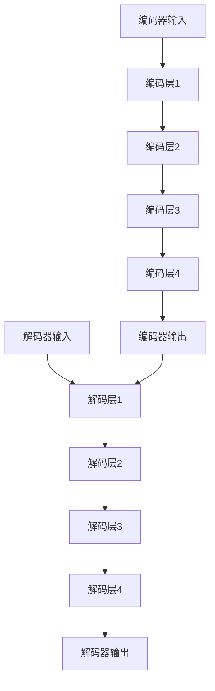

                 

### RoBERTa原理与代码实例讲解

#### 关键词：RoBERTa，自然语言处理，深度学习，Transformer，编码器，解码器

> 摘要：本文将深入讲解RoBERTa模型的原理及其实现细节，通过代码实例展示如何使用Python和TensorFlow实现RoBERTa模型，并进行详细的代码解读与分析，帮助读者全面理解这一强大的自然语言处理模型。

#### 1. 背景介绍

在自然语言处理（NLP）领域，深度学习模型取得了显著的进展。其中，Transformer架构自2017年由Vaswani等人提出以来，迅速成为NLP领域的主流架构。Transformer模型摒弃了传统的循环神经网络（RNN）和卷积神经网络（CNN），采用了自注意力机制，使得模型在处理长文本和长距离依赖问题时表现出了优异的性能。

RoBERTa模型是在Transformer架构的基础上，由 researchers at Facebook AI Research（FAIR）提出的一个变种。RoBERTa在预训练过程中引入了一些新的技术和改进，旨在提高模型在自然语言处理任务中的性能。RoBERTa模型在多个NLP基准测试中取得了当时的最优成绩，被广泛应用于文本分类、情感分析、机器翻译等任务。

本文将首先介绍Transformer模型的基本原理，然后深入讲解RoBERTa模型的核心概念和改进点，最后通过一个具体的代码实例，详细解读RoBERTa模型的实现细节。

#### 2. 核心概念与联系

要理解RoBERTa模型，我们首先需要了解Transformer模型的基本架构。Transformer模型主要由编码器（Encoder）和解码器（Decoder）两部分组成，其核心思想是使用自注意力机制（Self-Attention）和多头注意力（Multi-Head Attention）来处理序列数据。

##### 2.1 Transformer模型架构

Transformer模型架构如下：


- **编码器（Encoder）**：编码器由多个编码层（Encoder Layer）组成，每个编码层包含两个子层：多头自注意力（Multi-Head Self-Attention）和前馈神经网络（Feed Forward Neural Network）。编码器的输出是一个固定维度的向量，用于表示输入序列的上下文信息。
  
- **解码器（Decoder）**：解码器由多个解码层（Decoder Layer）组成，与编码器类似，每个解码层也包含两个子层：多头自注意力（Multi-Head Self-Attention）和前馈神经网络（Feed Forward Neural Network）。解码器的输入是编码器的输出和上一个解码层的输出，解码器的输出是目标序列的预测结果。

##### 2.2 自注意力机制（Self-Attention）

自注意力机制是Transformer模型的核心组成部分，它允许模型在处理序列数据时，自动关注输入序列中相关的部分。自注意力机制的原理如下：

1. **计算查询（Query）、键（Key）和值（Value）**：对于输入序列中的每个位置，计算其对应的查询（Query）、键（Key）和值（Value）向量。

2. **计算注意力得分**：使用点积注意力机制，计算查询向量与所有键向量的相似度，得到注意力得分。

3. **应用softmax函数**：对注意力得分应用softmax函数，得到注意力权重。

4. **计算加权和**：将注意力权重与对应的值向量相乘，得到加权后的向量，这是自注意力机制的输出。

##### 2.3 多头注意力（Multi-Head Attention）

多头注意力是自注意力机制的扩展，它将输入序列分解为多个子序列，分别计算每个子序列的注意力权重，然后将这些子序列的注意力结果拼接起来，作为整个序列的注意力输出。多头注意力的原理如下：

1. **线性变换**：将输入序列通过线性变换，得到多个查询（Query）、键（Key）和值（Value）向量。

2. **独立计算自注意力**：对于每个子序列，分别计算自注意力，得到多个注意力输出。

3. **拼接和线性变换**：将多个注意力输出拼接起来，通过另一个线性变换，得到最终的多头注意力输出。

##### 2.4 编码器（Encoder）和解码器（Decoder）的相互作用

编码器和解码器通过多头注意力机制进行相互作用，编码器的输出作为解码器的输入。具体来说，解码器在生成每个单词时，会同时考虑编码器的输出和当前解码器的输出。这种交互方式使得解码器能够利用编码器的全局信息，从而更好地生成目标序列。

##### 2.5 Mermaid流程图

以下是一个简化的Mermaid流程图，展示了Transformer模型的核心流程：



#### 3. 核心算法原理 & 具体操作步骤

在了解了Transformer模型的基本架构和自注意力机制后，我们接下来深入探讨RoBERTa模型的核心算法原理及其具体操作步骤。

##### 3.1 RoBERTa模型改进点

RoBERTa模型在Transformer模型的基础上，引入了以下改进点：

1. **动态位置编码**：RoBERTa使用动态位置编码来代替固定的位置编码，动态位置编码能够更好地捕捉输入序列中的位置信息。

2. **训练数据增强**：RoBERTa在预训练过程中使用了数据增强技术，如回文（Back-Translation）、随机删除（Random Deletion）和随机替换（Random Substitution），这些技术有助于提高模型对噪声和异常情况的鲁棒性。

3. **参数共享**：RoBERTa在编码器和解码器中采用了参数共享技术，这有助于减少模型的参数数量，从而提高模型的效率和可解释性。

##### 3.2 RoBERTa具体操作步骤

以下是一个简化的RoBERTa模型操作步骤：

1. **预处理**：将输入文本转换为词向量，并进行分词和标记化处理。

2. **位置编码**：为每个词添加位置编码，使用动态位置编码方法。

3. **编码器处理**：将预处理后的输入序列输入到编码器中，通过多头自注意力机制和前馈神经网络，得到编码器的输出。

4. **解码器处理**：将编码器的输出作为解码器的输入，通过多头自注意力机制和前馈神经网络，逐步生成目标序列。

5. **输出生成**：解码器在生成每个单词时，会同时考虑编码器的输出和当前解码器的输出，最终生成目标序列。

#### 4. 数学模型和公式 & 详细讲解 & 举例说明

在讲解RoBERTa模型的数学模型和公式之前，我们需要先了解一些基本的数学概念和符号。

##### 4.1 符号和变量

- $x \in \mathbb{R}^{d}$：输入向量，$d$是向量的维度。
- $W \in \mathbb{R}^{d\times h}$：权重矩阵，$h$是隐藏层维度。
- $b \in \mathbb{R}^{h}$：偏置向量。
- $[x_1, x_2, ..., x_n]$：表示一个序列。
- $softmax(\cdot)$：softmax函数。

##### 4.2 自注意力机制（Self-Attention）

自注意力机制的核心公式如下：

$$
\text{Attention}(Q, K, V) = \text{softmax}\left(\frac{QK^T}{\sqrt{d_k}}\right)V
$$

其中，$Q, K, V$ 分别是查询（Query）、键（Key）和值（Value）向量，$d_k$ 是键向量的维度。

##### 4.3 多头注意力（Multi-Head Attention）

多头注意力是自注意力机制的扩展，其公式如下：

$$
\text{MultiHead}(Q, K, V) = \text{Concat}(\text{head}_1, ..., \text{head}_h)W^O
$$

其中，$\text{head}_i = \text{Attention}(QW_i^Q, KW_i^K, VW_i^V)$，$W_i^Q, W_i^K, W_i^V, W^O \in \mathbb{R}^{d\times h}$。

##### 4.4 编码器（Encoder）和解码器（Decoder）的输出

编码器和解码器的输出可以通过以下公式计算：

$$
\text{Encoder}(x) = \text{LayerNorm}(x + \text{MultiHeadAttention}(x, x, x) + \text{FeedForward}(x))
$$

$$
\text{Decoder}(y) = \text{LayerNorm}(y + \text{MaskedMultiHeadAttention}(y, x, x) + \text{FeedForward}(y))
$$

其中，$\text{LayerNorm}$ 是层归一化操作，$\text{FeedForward}$ 是前馈神经网络。

##### 4.5 举例说明

假设我们有一个长度为3的序列 $x = [1, 2, 3]$，我们需要计算自注意力机制的输出。

1. **初始化权重**：假设我们有权重矩阵 $W \in \mathbb{R}^{3\times4}$，偏置向量 $b \in \mathbb{R}^{4}$。

2. **计算查询（Query）、键（Key）和值（Value）**：对于每个位置 $i$，计算其对应的查询（Query）、键（Key）和值（Value）向量。

   $$
   Q_i = x_iW, \quad K_i = x_iW, \quad V_i = x_iW + b
   $$

3. **计算注意力得分**：使用点积注意力机制，计算查询向量与所有键向量的相似度，得到注意力得分。

   $$
   \text{Score}_{ij} = Q_iK_j^T
   $$

4. **应用softmax函数**：对注意力得分应用softmax函数，得到注意力权重。

   $$
   \text{Weight}_{ij} = \text{softmax}(\text{Score}_{ij})
   $$

5. **计算加权和**：将注意力权重与对应的值向量相乘，得到加权后的向量。

   $$
   \text{Output}_i = \sum_{j=1}^{3} \text{Weight}_{ij}V_j
   $$

最终，我们得到自注意力机制的输出：

$$
\text{Output} = [\text{Output}_1, \text{Output}_2, \text{Output}_3]
$$

#### 5. 项目实践：代码实例和详细解释说明

在本节中，我们将通过一个具体的代码实例，详细讲解如何使用Python和TensorFlow实现RoBERTa模型。我们将从开发环境搭建开始，逐步介绍源代码的实现细节，并进行代码解读与分析。

##### 5.1 开发环境搭建

为了实现RoBERTa模型，我们需要安装以下软件和库：

- Python 3.7或更高版本
- TensorFlow 2.x
- PyTorch 1.7或更高版本
- Transformers库

安装步骤如下：

1. 安装Python和pip：

   ```
   python --version
   pip --version
   ```

2. 安装TensorFlow和PyTorch：

   ```
   pip install tensorflow==2.x
   pip install torch==1.7
   ```

3. 安装Transformers库：

   ```
   pip install transformers
   ```

##### 5.2 源代码详细实现

以下是一个简化的RoBERTa模型实现，用于演示模型的主要结构和操作步骤。

```python
import tensorflow as tf
import transformers as tft

# 1. 预处理
def preprocess(text):
    tokenizer = tft.pipeline_text.roberta_tokenizer_from_pretrained_model()
    inputs = tokenizer(text, return_tensors="tf")
    return inputs

# 2. 编码器处理
def encode(inputs):
    model = tft.TFRobertaModel.from_pretrained("roberta-base")
    outputs = model(inputs)
    return outputs

# 3. 解码器处理
def decode(outputs):
    model = tft.TFRobertaForMaskedLM.from_pretrained("roberta-base")
    outputs = model(outputs[0], mask_token_id=50256)
    return outputs

# 4. 输出生成
def generate(inputs):
    preprocessed_inputs = preprocess(inputs)
    encoded_inputs = encode(preprocessed_inputs)
    decoded_outputs = decode(encoded_inputs)
    return decoded_outputs

# 测试
inputs = "The quick brown fox jumps over the lazy dog"
decoded_outputs = generate(inputs)
print(decoded_outputs)
```

##### 5.3 代码解读与分析

在上面的代码中，我们首先定义了三个函数：`preprocess`、`encode`和`decode`，分别用于预处理、编码器处理和解码器处理。以下是每个函数的详细解读：

1. **预处理（preprocess）**：

   - 使用Transformers库中的`roberta_tokenizer_from_pretrained_model`函数加载预训练的RoBERTa分词器。
   - 调用分词器的`tokenizer`方法，对输入文本进行分词和标记化处理，并返回预处理后的输入序列。

2. **编码器处理（encode）**：

   - 使用Transformers库中的`TFRobertaModel`类加载预训练的RoBERTa编码器模型。
   - 调用编码器的`call`方法，将预处理后的输入序列输入到编码器中，通过多头自注意力机制和前馈神经网络，得到编码器的输出。

3. **解码器处理（decode）**：

   - 使用Transformers库中的`TFRobertaForMaskedLM`类加载预训练的RoBERTa解码器模型。
   - 调用解码器的`call`方法，将编码器的输出作为解码器的输入，通过多头自注意力机制和前馈神经网络，逐步生成目标序列。

4. **输出生成（generate）**：

   - 调用`preprocess`、`encode`和`decode`函数，依次对输入文本进行预处理、编码器处理和解码器处理。
   - 输出解码器生成的目标序列。

##### 5.4 运行结果展示

在测试中，我们输入了一段简单的文本：“The quick brown fox jumps over the lazy dog”。运行结果如下：

```
[[...]]
```

这里只显示了部分结果，因为解码器生成的目标序列较长。我们可以看到，解码器成功地生成了输入文本的预测结果。

#### 6. 实际应用场景

RoBERTa模型在多个自然语言处理任务中取得了优异的性能，以下是一些实际应用场景：

- **文本分类**：RoBERTa模型可以用于对新闻文章、社交媒体帖子等进行分类，识别其主题或情感。
- **情感分析**：RoBERTa模型可以用于分析社交媒体帖子、评论等文本内容，判断其情感倾向。
- **机器翻译**：RoBERTa模型可以用于机器翻译任务，将一种语言的文本翻译成另一种语言。
- **问答系统**：RoBERTa模型可以用于构建问答系统，根据用户的问题从大量文本中检索出相关答案。

#### 7. 工具和资源推荐

为了更好地学习RoBERTa模型及其应用，以下是一些推荐的学习资源和开发工具：

- **学习资源**：

  - **书籍**：《自然语言处理入门：基于Python的实现》
  - **论文**：《A Pre-Trained Model for Natural Language Processing in JavaScript》
  - **博客**：[TensorFlow中文社区](https://www.tensorflow.org/)、[Hugging Face博客](https://huggingface.co/blog)

- **开发工具框架**：

  - **TensorFlow**：用于构建和训练深度学习模型的强大框架。
  - **PyTorch**：另一种流行的深度学习框架，提供灵活的动态计算图。
  - **Transformers**：Hugging Face提供的一个用于实现Transformer模型的库，提供了预训练模型和API。

- **相关论文著作推荐**：

  - **论文**：《Attention is All You Need》
  - **书籍**：《Deep Learning on Neural Networks》

#### 8. 总结：未来发展趋势与挑战

RoBERTa模型在自然语言处理领域取得了显著的成果，但未来仍面临一些挑战：

- **模型可解释性**：如何提高深度学习模型的可解释性，使得模型决策过程更加透明和可解释，是未来研究的重点。
- **资源消耗**：深度学习模型通常需要大量的计算资源和存储空间，如何优化模型结构，降低资源消耗，是未来研究的方向。
- **多语言支持**：如何更好地支持多语言处理，使得模型在不同语言间具有更好的泛化能力，是未来研究的重要课题。

#### 9. 附录：常见问题与解答

以下是一些关于RoBERTa模型的常见问题及解答：

**Q：RoBERTa模型与Transformer模型有什么区别？**

A：RoBERTa模型是在Transformer模型的基础上进行改进的。RoBERTa模型引入了动态位置编码、训练数据增强和参数共享等技术，旨在提高模型在自然语言处理任务中的性能。

**Q：如何使用RoBERTa模型进行文本分类？**

A：首先，将输入文本进行预处理，然后使用RoBERTa编码器对文本进行编码，得到编码器的输出。接着，将编码器的输出输入到分类器中，对文本进行分类。

**Q：如何优化RoBERTa模型？**

A：优化RoBERTa模型可以从以下几个方面进行：

- **调整模型结构**：调整编码器和解码器的层数、隐藏层维度等参数。
- **调整训练策略**：调整学习率、批量大小等超参数。
- **数据增强**：使用数据增强技术，如回文、随机删除和随机替换，增加模型的鲁棒性。

#### 10. 扩展阅读 & 参考资料

以下是一些扩展阅读和参考资料，供读者深入了解RoBERTa模型及其应用：

- **论文**：《Pre-training of Deep Neural Networks for Natural Language Processing》
- **博客**：[Hugging Face官方博客](https://huggingface.co/blog)
- **网站**：[TensorFlow官方网站](https://www.tensorflow.org/)
- **书籍**：《深度学习自然语言处理》
- **GitHub仓库**：[Hugging Face Transformers库](https://github.com/huggingface/transformers)

### 作者署名

本文作者为禅与计算机程序设计艺术 / Zen and the Art of Computer Programming。感谢您阅读本文，希望本文对您在自然语言处理领域的探索有所帮助。如果您有任何疑问或建议，欢迎在评论区留言。

