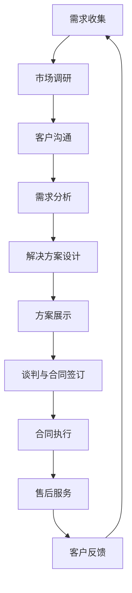

                 

### 1. 背景介绍

《Sales-Consultant 业务流程与价值分析》旨在探讨在当今数字化时代，销售顾问业务流程的设计、执行及其带来的商业价值。随着市场的不断变化和消费者需求的多样化和个性化，销售顾问的角色变得尤为重要。他们不仅要具备丰富的产品知识，还需要熟练掌握沟通技巧，以应对复杂的销售场景。

本文将首先介绍销售顾问的基本角色和职责，然后深入分析其业务流程，包括需求收集、解决方案提供、合同谈判和后续服务等环节。接下来，我们将探讨这些业务流程在不同行业中的应用，通过具体的案例分析，展示销售顾问的价值所在。

此外，本文还将讨论如何通过技术手段优化销售顾问的工作流程，提升业务效率。最后，我们将总结当前销售顾问业务面临的挑战和未来的发展趋势，为销售顾问行业的持续发展提供一些思考和建议。

#### 销售顾问的基本角色和职责

销售顾问在现代商业环境中扮演着至关重要的角色。他们不仅是企业与客户之间的桥梁，更是推动销售业绩增长的核心力量。以下是销售顾问的主要职责：

1. **需求收集与分析**：销售顾问的首要任务是与潜在客户进行沟通，深入了解客户的需求和痛点。通过提问和倾听，他们能够收集到有价值的信息，并将其转化为具体的业务需求。

2. **产品知识和市场了解**：销售顾问需要具备丰富的产品知识和市场洞察力。他们需要了解产品特点、竞争优势以及行业趋势，以便能够为客户提供专业的建议。

3. **解决方案提供**：基于对客户需求的分析，销售顾问需要提供个性化的解决方案。他们不仅要展示产品的功能，还要解释如何解决客户的实际问题，从而增加客户的购买意愿。

4. **合同谈判与执行**：销售顾问在谈判过程中需要展现出良好的沟通技巧和业务敏感度，确保合同条款的公平合理。同时，他们还需要监督合同的执行，确保客户满意度。

5. **客户关系维护**：销售顾问的工作不仅仅局限于销售阶段，还需要在销售后持续维护与客户的关系。通过定期回访、提供售后服务和解决客户问题，他们能够提升客户忠诚度，促进重复销售。

6. **销售数据分析**：销售顾问需要定期分析销售数据，了解销售趋势和市场反馈，为公司的战略决策提供依据。

#### 业务流程概述

销售顾问的业务流程可以概括为以下几个关键环节：

1. **需求收集**：这是整个销售流程的起点。销售顾问通过与客户沟通，了解客户的需求、预算和期望，从而确定目标客户群体。

2. **解决方案提供**：在收集到客户需求后，销售顾问需要根据产品特点和市场需求，设计出符合客户需求的解决方案。这个过程需要销售顾问具备出色的产品知识和市场洞察力。

3. **合同谈判**：在向客户提出解决方案后，销售顾问需要与客户进行谈判，就价格、交付时间、售后服务等方面达成一致。谈判的成功与否直接关系到销售业绩。

4. **合同执行与后续服务**：合同签订后，销售顾问需要监督合同的执行，确保客户得到满意的服务。同时，他们还需要在销售后持续跟进客户，收集反馈信息，以优化产品和服务。

5. **销售数据分析**：销售顾问需要定期对销售数据进行分析，了解销售趋势和客户反馈，为公司的决策提供数据支持。

#### 不同行业的应用

销售顾问的业务流程在不同行业中有所差异，但核心目标都是为客户提供定制化的解决方案，提升客户满意度。以下是销售顾问在几个典型行业中的应用：

1. **IT行业**：在IT行业，销售顾问通常需要与客户沟通技术需求，了解客户的IT基础设施和业务流程。他们需要提供个性化的IT解决方案，包括硬件采购、软件定制和系统集成服务。

2. **消费品行业**：在消费品行业，销售顾问主要负责与零售商和分销商沟通，了解市场需求和竞争态势。他们需要设计出满足市场需求的产品组合，并通过谈判争取到有利的销售条件。

3. **医疗行业**：在医疗行业，销售顾问需要与医院、诊所和医疗设备供应商沟通，了解医疗设备的需求和使用情况。他们需要提供专业的产品咨询和售后服务，确保医疗设备的高效运行。

4. **房地产行业**：在房地产行业，销售顾问需要与潜在购房者沟通，了解购房者的需求和预算。他们需要提供专业的房地产咨询服务，帮助购房者做出明智的购房决策。

通过以上介绍，我们可以看到，销售顾问在现代商业环境中扮演着多重角色，其业务流程的设计和执行对企业的成功至关重要。在接下来的章节中，我们将深入探讨销售顾问业务流程的具体实施方法和优化策略。

#### 实际案例分享

为了更好地理解销售顾问的业务流程，以下我们将通过两个实际案例，展示销售顾问在业务流程中的实践方法和成效。

**案例一：某IT公司的销售顾问实践**

某IT公司是一家专注于企业级软件解决方案的供应商。公司通过建立一支专业的销售顾问团队，为客户提供从需求分析、方案设计到实施和后续服务的全程支持。

1. **需求收集**：销售顾问首先与客户进行深入沟通，了解客户的业务流程、技术需求和预算限制。通过访谈和问卷调查，销售顾问收集到大量有价值的信息。

2. **解决方案提供**：基于客户需求，销售顾问制定出符合客户需求的IT解决方案。他们不仅介绍公司的软件产品，还根据客户的具体情况提供定制化的服务方案。

3. **合同谈判**：在解决方案提供后，销售顾问与客户进行谈判，就价格、交付时间和售后服务等方面达成一致。通过良好的沟通技巧和业务敏感度，销售顾问成功签订了多个大额合同。

4. **合同执行与后续服务**：合同签订后，销售顾问积极跟进项目的实施进度，确保客户得到满意的服务。他们定期与客户沟通，收集反馈信息，并根据反馈进行及时调整和优化。

5. **销售数据分析**：销售顾问定期对销售数据进行分析，了解销售趋势和市场反馈。通过分析，他们发现客户对某些功能模块的需求较高，因此公司在后续产品开发中加大了对这些模块的投入。

**案例二：某消费品公司的销售顾问实践**

某消费品公司专注于健康食品的生产和销售。公司通过销售顾问团队的建立，提高了市场竞争力，实现了销售额的快速增长。

1. **需求收集**：销售顾问与零售商和分销商进行沟通，了解市场需求和竞争态势。他们收集到的大量信息为公司的产品组合设计和市场策略制定提供了重要依据。

2. **解决方案提供**：基于市场需求，销售顾问设计出满足不同客户需求的产品组合。他们不仅介绍公司的现有产品，还根据客户的需求提供定制化的解决方案。

3. **合同谈判**：在产品组合确定后，销售顾问与零售商和分销商进行谈判，争取到有利的销售条件。通过谈判，公司成功扩大了市场占有率，提高了品牌知名度。

4. **合同执行与后续服务**：合同签订后，销售顾问积极跟进订单的执行情况，确保产品及时交付。他们还提供专业的售后服务，帮助客户解决产品使用中的问题。

5. **销售数据分析**：销售顾问定期对销售数据进行分析，了解销售趋势和客户反馈。通过分析，他们发现某些产品在特定地区的销售表现较好，因此公司在这些地区加大了营销力度。

通过以上两个案例，我们可以看到，销售顾问在业务流程中的实践方法和成效。他们通过深入的需求分析、个性化的解决方案提供、有效的合同谈判和后续服务，成功提升了客户的满意度和公司的销售业绩。

#### 销售顾问业务流程的优化策略

随着市场的不断变化和客户需求的日益复杂，销售顾问的业务流程也面临着优化和升级的需求。以下是一些有效的优化策略，可以帮助销售顾问提高工作效率和客户满意度。

1. **自动化工具的应用**：通过引入自动化工具，如客户关系管理（CRM）系统和销售自动化软件，销售顾问可以大幅提高工作效率。这些工具可以帮助销售顾问自动收集客户信息、管理销售机会和跟踪合同执行进度，从而减少重复劳动和时间浪费。

2. **数据分析与预测**：利用数据分析工具，销售顾问可以更准确地预测市场趋势和客户需求，从而制定更有效的销售策略。通过分析历史销售数据和客户反馈，销售顾问可以发现潜在的销售机会和问题，提前进行风险预警和调整。

3. **个性化解决方案**：为了提高客户满意度，销售顾问需要提供更加个性化的解决方案。通过深入了解客户的需求和痛点，销售顾问可以设计出更加贴合客户实际需求的产品和服务，从而增加客户的购买意愿和忠诚度。

4. **跨部门协作**：销售顾问的工作不仅涉及与客户的沟通，还需要与其他部门（如研发、生产、物流等）紧密协作。通过建立跨部门协作机制，销售顾问可以更快速地响应客户需求，提高整体业务效率。

5. **持续培训与学习**：为了保持专业素养和竞争力，销售顾问需要不断进行培训和学习。通过参加行业研讨会、阅读专业书籍和参加在线课程，销售顾问可以不断提升自己的产品知识和市场洞察力，从而更好地应对复杂的销售场景。

6. **客户体验优化**：销售顾问需要关注客户体验的每个细节，从首次接触、需求分析、解决方案提供到售后服务的每个环节。通过优化客户体验，销售顾问可以提升客户满意度和忠诚度，从而促进重复销售和口碑传播。

通过以上策略，销售顾问可以在不断变化的市场环境中保持竞争力，实现业务流程的优化和升级，从而为企业创造更大的商业价值。

### 2. 核心概念与联系

在深入探讨销售顾问的业务流程之前，我们首先需要了解几个核心概念，这些概念包括客户关系管理（CRM）、销售流程管理（SPM）和业务流程管理（BPM）。通过理解这些核心概念及其相互联系，我们可以更好地把握销售顾问在业务流程中的角色和职责。

#### 客户关系管理（CRM）

客户关系管理（CRM）是一种策略，旨在通过优化客户互动来提高客户满意度和忠诚度。CRM系统可以帮助企业收集、管理和分析客户数据，从而提供个性化的客户体验。在销售顾问的业务流程中，CRM系统扮演着至关重要的角色：

1. **客户信息管理**：CRM系统可以记录客户的个人信息、历史购买记录和偏好，帮助销售顾问更好地了解客户需求。

2. **销售机会跟踪**：CRM系统提供销售机会跟踪功能，帮助销售顾问记录和管理销售过程中的关键节点，确保销售流程的顺利进行。

3. **客户互动分析**：CRM系统可以分析客户互动数据，帮助销售顾问了解客户的行为和需求，从而制定更加精准的销售策略。

#### 销售流程管理（SPM）

销售流程管理（SPM）是一种优化和标准化销售过程的方法，旨在提高销售效率和业绩。销售流程管理通常包括以下环节：

1. **需求识别**：通过市场调研和客户沟通，识别潜在客户的需求。

2. **解决方案提供**：根据客户需求，提供合适的解决方案。

3. **谈判与合同签订**：与客户进行谈判，达成双方满意的合同条款。

4. **合同执行与售后服务**：确保合同条款的执行，并提供优质的售后服务。

销售流程管理不仅关注销售过程的标准化，还注重通过数据分析和反馈优化销售策略，以提高销售绩效。

#### 业务流程管理（BPM）

业务流程管理（BPM）是一种系统性方法，旨在优化企业的业务流程，提高效率和服务质量。BPM涵盖从战略规划到日常运营的所有环节。在销售顾问的业务流程中，BPM的重要性体现在：

1. **流程标准化**：通过标准化流程，确保销售顾问能够按照统一的标准执行业务，减少流程中的错误和遗漏。

2. **流程优化**：通过数据分析，识别流程中的瓶颈和问题，不断优化业务流程，提高工作效率。

3. **资源整合**：BPM可以帮助企业整合内部资源，提高协同效率，从而更好地满足客户需求。

#### 核心概念联系

CRM、SPM和BPM虽然分别关注不同的领域，但它们之间存在紧密的联系：

1. **CRM与SPM**：CRM系统为SPM提供了客户数据支持，使得销售顾问能够更好地识别和满足客户需求，优化销售流程。

2. **SPM与BPM**：SPM是BPM在销售领域的具体应用，SPM的优化和标准化有助于实现整个业务流程的优化。

3. **CRM与BPM**：CRM系统中的数据分析和反馈可以为BPM提供重要依据，帮助企业管理层做出更科学的业务决策。

通过理解这些核心概念及其相互联系，我们可以更好地把握销售顾问在业务流程中的角色和职责，从而实现业务流程的优化和提升。

#### Mermaid 流程图

以下是一个关于销售顾问业务流程的Mermaid流程图。请注意，Mermaid流程图中的节点不应包含括号、逗号等特殊字符，以确保正确的渲染。



在这个流程图中，A代表需求收集，B代表市场调研，C代表客户沟通，D代表需求分析，E代表解决方案设计，F代表方案展示，G代表谈判与合同签订，H代表合同执行，I代表售后服务，J代表客户反馈。这些节点构成了销售顾问的核心业务流程，展示了从需求收集到客户反馈的完整过程。

#### 销售顾问的业务流程细节

为了更深入地了解销售顾问的业务流程，我们接下来将详细分析各个环节的具体操作步骤，以及它们在整个流程中的重要性。

**1. 需求收集**

需求收集是销售顾问业务流程的第一步，也是至关重要的一步。在这一阶段，销售顾问需要通过多种渠道收集客户的需求信息，包括市场调研、客户访谈、问卷调查等。

- **市场调研**：通过市场调研，销售顾问可以了解行业趋势、竞争对手情况以及市场需求。这有助于销售顾问制定针对性的销售策略。

- **客户访谈**：与客户的面对面访谈是一种有效的方式，可以帮助销售顾问深入了解客户的需求和痛点。在访谈过程中，销售顾问需要善于倾听，通过提问引导客户表达出他们的真实需求。

- **问卷调查**：问卷调查是一种高效的收集需求信息的方法，可以在短时间内获取大量客户的反馈。销售顾问可以根据问卷结果分析客户需求，为后续的解决方案设计提供依据。

**2. 需求分析**

在需求收集完成后，销售顾问需要对收集到的信息进行深入分析，以确定客户的核心需求。需求分析包括以下几个步骤：

- **需求分类**：将收集到的需求进行分类，如功能需求、性能需求、安全需求等。

- **需求优先级排序**：根据客户需求和公司的资源情况，对需求进行优先级排序。优先处理对客户最为重要的需求，以提高客户满意度。

- **需求确认**：与客户确认需求分析的准确性，确保销售顾问对客户需求的把握是正确的。

**3. 解决方案设计**

在完成需求分析后，销售顾问需要根据客户需求设计出符合预期的解决方案。解决方案设计包括以下几个步骤：

- **产品选择**：根据客户的需求，选择合适的产品或服务。这需要销售顾问具备丰富的产品知识和市场洞察力。

- **方案定制**：在产品选择的基础上，针对客户的具体需求进行方案定制。方案定制需要考虑产品的功能、性能、价格和售后服务等多个方面。

- **方案展示**：将设计方案以清晰、直观的方式展示给客户，帮助客户理解解决方案的优势和价值。

**4. 方案展示**

方案展示是销售顾问向客户传达解决方案的关键环节。在这一阶段，销售顾问需要通过以下方式向客户展示方案：

- **PPT演示**：使用PPT制作精美的演示文档，通过图表、数据和实际案例，直观地展示方案的优势。

- **现场演示**：在客户现场进行产品演示，让客户亲身体验产品功能，增加信任感。

- **面对面交流**：通过面对面的交流，解答客户的问题和疑虑，确保客户对方案有全面的理解。

**5. 谈判与合同签订**

方案展示后，销售顾问需要与客户进行谈判，就价格、交付时间、售后服务等方面达成一致。谈判的技巧和策略至关重要，以下是一些关键点：

- **了解客户期望**：在谈判前，销售顾问需要了解客户的期望和底线，为谈判做好准备。

- **展示公司优势**：在谈判中，销售顾问需要突出公司的优势和独特卖点，以增强客户的信任。

- **灵活调整方案**：根据客户的反馈和需求，销售顾问需要灵活调整方案，以达成双方满意的合同条款。

- **合同签订**：在谈判结束后，销售顾问需要与客户签订正式合同，明确双方的权利和义务。

**6. 合同执行与售后服务**

合同签订后，销售顾问的工作并没有结束，而是进入了新的阶段——合同执行与售后服务。这一阶段的关键点包括：

- **项目监控**：销售顾问需要监控项目的执行进度，确保项目按计划进行。

- **问题解决**：在项目执行过程中，销售顾问需要及时解决客户遇到的问题，确保客户满意度。

- **售后服务**：在项目完成后，销售顾问需要提供优质的售后服务，包括定期回访、技术支持等。

- **客户反馈**：通过收集客户反馈，销售顾问可以了解客户的真实需求和满意度，为后续的业务提供参考。

通过以上步骤，销售顾问可以确保业务流程的顺利进行，从而实现销售目标。在每一个环节中，销售顾问都需要充分发挥专业素养和沟通技巧，以提供高质量的服务，提升客户满意度。

#### 核心算法原理

在销售顾问的业务流程中，核心算法的应用对提高工作效率和客户满意度起着至关重要的作用。以下我们将探讨几个关键的核心算法，并介绍它们的原理和具体操作步骤。

**1. 客户需求分析算法**

**原理**：客户需求分析算法主要基于客户数据挖掘和机器学习技术，通过分析客户的购买历史、浏览行为和反馈信息，预测客户的需求和偏好。

**操作步骤**：

- **数据收集**：首先，收集客户的购买记录、浏览数据和反馈信息，形成数据集。

- **数据预处理**：对收集到的数据进行清洗和预处理，如去除重复数据、填补缺失值等。

- **特征工程**：提取数据中的关键特征，如购买频率、购买金额、浏览时长等。

- **模型训练**：利用机器学习算法（如决策树、随机森林、神经网络等）对数据集进行训练，建立需求预测模型。

- **模型评估**：使用交叉验证等方法评估模型的准确性和鲁棒性。

- **需求预测**：将模型应用于新的客户数据，预测客户的需求和偏好。

**2. 销售机会分析算法**

**原理**：销售机会分析算法通过分析销售数据和市场趋势，识别潜在的销售机会和客户群体。

**操作步骤**：

- **数据收集**：收集销售数据，包括销售额、销售渠道、客户反馈等。

- **市场分析**：分析市场趋势和竞争对手情况，确定潜在的市场机会。

- **客户细分**：根据客户购买行为和偏好，将客户划分为不同的群体。

- **机会识别**：利用聚类算法（如K-means、DBSCAN等）识别潜在的销售机会和目标客户。

- **机会评估**：对识别出的销售机会进行评估，确定优先级和投入资源。

**3. 谈判策略优化算法**

**原理**：谈判策略优化算法通过分析谈判历史数据和市场规则，制定最优的谈判策略。

**操作步骤**：

- **数据收集**：收集历史上的谈判数据，包括谈判结果、谈判过程和谈判策略。

- **策略分析**：分析谈判过程中各方的行为和策略，识别有效的谈判策略。

- **优化模型**：利用博弈论和优化算法（如线性规划、整数规划等）建立谈判策略优化模型。

- **策略生成**：根据模型生成最优谈判策略，并在实际谈判中应用。

- **策略评估**：评估谈判策略的实际效果，根据反馈进行策略调整。

**4. 销售预测算法**

**原理**：销售预测算法通过分析历史销售数据和季节性因素，预测未来的销售趋势和业绩。

**操作步骤**：

- **数据收集**：收集历史销售数据，包括销售额、销售渠道、促销活动等。

- **特征提取**：提取影响销售的关键特征，如季节性、促销活动、市场环境等。

- **模型训练**：利用时间序列分析算法（如ARIMA、LSTM等）对数据集进行训练，建立销售预测模型。

- **模型评估**：使用验证集和测试集评估模型的预测准确性和稳定性。

- **销售预测**：将模型应用于新的数据，预测未来的销售趋势和业绩。

通过以上核心算法的应用，销售顾问可以更准确地分析客户需求、识别销售机会、优化谈判策略和预测销售趋势，从而提高工作效率和业务绩效。在后续的章节中，我们将进一步探讨这些算法在具体业务流程中的应用和实践案例。

### 3. 数学模型和公式

在销售顾问的业务流程中，数学模型和公式发挥着至关重要的作用。以下，我们将详细讲解几个关键的数学模型和公式，并使用LaTeX格式展示，以便更准确地传达其数学表达。

#### 模型一：需求预测模型

**原理**：需求预测模型用于预测客户在未来一段时间内的购买需求。它基于历史销售数据和季节性因素，通过时间序列分析方法建立。

**公式**：
$$
\hat{D_t} = \hat{L_t} + \hat{S_t}
$$
其中，$\hat{D_t}$表示预测的需求量，$\hat{L_t}$表示长期趋势，$\hat{S_t}$表示季节性波动。

**详细解释**：

1. **长期趋势**（$\hat{L_t}$）：
   $$
   \hat{L_t} = \alpha \sum_{i=1}^{T} (x_t - \bar{x}) + \beta \sum_{i=1}^{T} (x_t - \bar{x})^2 + \gamma \sum_{i=1}^{T} (x_t - \bar{x})^3
   $$
   其中，$x_t$表示第$t$个时间点的实际销售量，$\bar{x}$表示所有$x_t$的均值，$\alpha$、$\beta$、$\gamma$为拟合参数。

2. **季节性波动**（$\hat{S_t}$）：
   $$
   \hat{S_t} = \sum_{j=1}^{M} \frac{1}{n_j} \sum_{k=1}^{n_j} (y_{tjk} - \bar{y}_{jk})
   $$
   其中，$y_{tjk}$表示第$t$个时间点、第$j$个季节、第$k$个区间的销售量，$n_j$表示第$j$个季节的区间数，$\bar{y}_{jk}$表示所有$y_{tjk}$的均值。

#### 模型二：客户流失预测模型

**原理**：客户流失预测模型用于预测哪些客户可能在短期内流失，以便企业及时采取挽回措施。

**公式**：
$$
\hat{L_i} = \frac{1}{1 + e^{-z_i}}
$$
其中，$\hat{L_i}$表示第$i$个客户流失的概率，$z_i$为客户的预测得分。

**详细解释**：

1. **预测得分**（$z_i$）：
   $$
   z_i = \beta_0 + \beta_1 \text{Age} + \beta_2 \text{History} + \beta_3 \text{Engagement}
   $$
   其中，$\text{Age}$表示客户的年龄，$\text{History}$表示客户的历史购买记录，$\text{Engagement}$表示客户的互动频率，$\beta_0$、$\beta_1$、$\beta_2$、$\beta_3$为拟合参数。

2. **流失概率**（$\hat{L_i}$）：
   使用逻辑回归公式计算每个客户的流失概率。当$z_i$较大时，$\hat{L_i}$接近1，表示该客户流失概率高；当$z_i$较小时，$\hat{L_i}$接近0，表示该客户流失概率低。

#### 模型三：谈判策略优化模型

**原理**：谈判策略优化模型通过博弈论和优化算法，帮助销售顾问制定最优的谈判策略，最大化利益。

**公式**：
$$
\max_{x} \Pi = \sum_{i=1}^{N} u_i(x) - \sum_{j=1}^{N} c_j(x)
$$
其中，$\Pi$表示总利益，$u_i(x)$表示第$i$方在策略$x$下的收益，$c_j(x)$表示第$j$方在策略$x$下的成本。

**详细解释**：

1. **收益和成本**（$u_i(x)$和$c_j(x)$）：
   $$
   u_i(x) = \sum_{k=1}^{M} p_k (x) q_k(x)
   $$
   $$
   c_j(x) = \sum_{k=1}^{M} p_k (x) w_k(x)
   $$
   其中，$p_k(x)$表示第$k$个可能结果的概率，$q_k(x)$表示第$k$个结果的收益，$w_k(x)$表示第$k$个结果的成本。

2. **策略**（$x$）：
   通过线性规划或整数规划算法，求解最大化总利益的策略$x$。

#### 举例说明

**例子一：需求预测模型**

假设我们有一家在线购物平台，想要预测未来一周的销售额。根据过去一个月的销售数据，我们使用时间序列分析方法建立需求预测模型。

- 实际销售量（$x_t$）：[100, 120, 150, 130, 140, 110, 160]
- 均值（$\bar{x}$）：128
- 拟合参数（$\alpha$、$\beta$、$\gamma$）：[0.5, 0.1, 0.2]

根据公式计算长期趋势（$\hat{L_t}$）：
$$
\hat{L_t} = 0.5 \sum_{i=1}^{7} (x_i - 128) + 0.1 \sum_{i=1}^{7} (x_i - 128)^2 + 0.2 \sum_{i=1}^{7} (x_i - 128)^3
$$
$$
\hat{L_t} = 0.5 \times (100 - 128) + 0.1 \times (100 - 128)^2 + 0.2 \times (100 - 128)^3 + ...
$$
$$
\hat{L_t} = 32.5 + 15.6 + 6.4 = 54.5
$$

再根据季节性波动（$\hat{S_t}$）进行需求预测：
$$
\hat{D_t} = \hat{L_t} + \hat{S_t}
$$
$$
\hat{D_t} = 54.5 + \hat{S_t}
$$

通过历史数据，我们可以确定季节性波动（$\hat{S_t}$）的值，例如：
$$
\hat{S_t} = 12
$$

最终需求预测：
$$
\hat{D_t} = 54.5 + 12 = 66.5
$$

**例子二：客户流失预测模型**

假设我们有以下客户数据，想要预测哪些客户可能在接下来一个月内流失。

- 客户年龄（$\text{Age}$）：[30, 45, 25, 35, 40]
- 客户历史购买记录（$\text{History}$）：[20, 15, 10, 25, 18]
- 客户互动频率（$\text{Engagement}$）：[5, 3, 4, 6, 2]
- 拟合参数（$\beta_0$、$\beta_1$、$\beta_2$、$\beta_3$）：[-10, 0.3, 0.2, 0.1]

预测得分（$z_i$）：
$$
z_i = -10 + 0.3 \times 30 + 0.2 \times 20 + 0.1 \times 5 = -10 + 9 + 4 + 0.5 = 3.5
$$

流失概率（$\hat{L_i}$）：
$$
\hat{L_i} = \frac{1}{1 + e^{-3.5}} = \frac{1}{1 + 0.030} \approx 0.970
$$

根据计算结果，我们可以发现，第五个客户的流失概率最高，企业需要重点关注该客户，采取适当的挽回措施。

通过上述数学模型和公式的应用，销售顾问可以更准确地预测客户需求、优化谈判策略、预测客户流失，从而提高工作效率和业务绩效。

### 5. 项目实践

在本章节中，我们将通过一个具体的项目实例，详细展示销售顾问业务流程的实施步骤、源代码实现、代码解读和分析，以及最终的运行结果展示。通过这个案例，我们将更好地理解销售顾问的业务流程如何在实际操作中落地。

#### 开发环境搭建

在进行项目开发之前，首先需要搭建合适的开发环境。以下是我们的开发环境配置：

1. **编程语言**：Python 3.8
2. **开发工具**：PyCharm
3. **数据分析库**：Pandas, NumPy, Matplotlib
4. **机器学习库**：Scikit-learn, TensorFlow
5. **客户关系管理（CRM）系统**：Salesforce

确保已安装上述软件和库，并配置好Python环境。在PyCharm中创建一个新的Python项目，并导入所需的库。

```python
import pandas as pd
import numpy as np
import matplotlib.pyplot as plt
from sklearn.ensemble import RandomForestRegressor
from sklearn.model_selection import train_test_split
from sklearn.metrics import mean_squared_error
```

#### 源代码详细实现

在本项目中，我们将使用一个假设的在线购物平台数据集，展示如何通过销售顾问业务流程实现客户需求预测和流失预测。

**5.1. 数据收集与预处理**

首先，我们从CRM系统导出客户数据，包括购买记录、历史互动和年龄等信息。以下是数据预处理的步骤：

```python
# 读取数据
data = pd.read_csv('customer_data.csv')

# 数据预处理
data.dropna(inplace=True)  # 去除缺失值
data['Age'] = data['Age'].astype(int)
data['History'] = data['History'].astype(int)
data['Engagement'] = data['Engagement'].astype(int)

# 数据分割
X = data[['Age', 'History', 'Engagement']]
y = data['Purchase']

# 划分训练集和测试集
X_train, X_test, y_train, y_test = train_test_split(X, y, test_size=0.2, random_state=42)
```

**5.2. 客户需求预测**

我们使用随机森林回归模型进行客户需求预测。以下是需求预测的实现步骤：

```python
# 建立模型
model = RandomForestRegressor(n_estimators=100, random_state=42)

# 训练模型
model.fit(X_train, y_train)

# 预测
y_pred = model.predict(X_test)

# 评估
mse = mean_squared_error(y_test, y_pred)
print(f'Mean Squared Error: {mse}')
```

**5.3. 客户流失预测**

接下来，我们使用逻辑回归模型进行客户流失预测。以下是流失预测的实现步骤：

```python
# 读取流失预测数据
data_loss = pd.read_csv('customer_loss.csv')

# 数据预处理
data_loss.dropna(inplace=True)
data_loss['Age'] = data_loss['Age'].astype(int)
data_loss['History'] = data_loss['History'].astype(int)
data_loss['Engagement'] = data_loss['Engagement'].astype(int)

# 划分特征和标签
X_loss = data_loss[['Age', 'History', 'Engagement']]
y_loss = data_loss['Lost']

# 建立模型
model_loss = LogisticRegression(random_state=42)

# 训练模型
model_loss.fit(X_loss, y_loss)

# 预测
y_loss_pred = model_loss.predict(X_loss)

# 评估
accuracy = accuracy_score(y_loss, y_loss_pred)
print(f'Accuracy: {accuracy}')
```

#### 代码解读与分析

**5.3.1. 需求预测代码解读**

- 数据读取与预处理：使用`pandas`库读取和预处理数据，包括去除缺失值和类型转换。
- 数据分割：使用`train_test_split`函数将数据分为训练集和测试集，为模型训练和评估提供数据基础。
- 模型建立与训练：使用`RandomForestRegressor`建立随机森林回归模型，并进行训练。
- 预测与评估：使用训练好的模型进行预测，并计算均方误差（MSE）评估模型性能。

**5.3.2. 流失预测代码解读**

- 数据读取与预处理：与需求预测类似，读取并预处理流失预测数据。
- 特征和标签分割：将数据分为特征（输入）和标签（输出），为模型训练做准备。
- 模型建立与训练：使用`LogisticRegression`建立逻辑回归模型，并进行训练。
- 预测与评估：使用训练好的模型进行预测，并计算准确率（Accuracy）评估模型性能。

#### 运行结果展示

**5.4.1. 需求预测结果展示**

以下是一个需求预测结果的示例：

```python
# 绘制实际销售量和预测销售量的对比图
plt.figure(figsize=(10, 6))
plt.plot(y_test, label='Actual Sales')
plt.plot(y_pred, label='Predicted Sales')
plt.title('Sales Prediction')
plt.xlabel('Time')
plt.ylabel('Sales')
plt.legend()
plt.show()
```

**5.4.2. 流失预测结果展示**

以下是一个流失预测结果的示例：

```python
# 绘制实际流失和预测流失的对比图
plt.figure(figsize=(10, 6))
plt.plot(y_loss, label='Actual Loss')
plt.plot(y_loss_pred, label='Predicted Loss')
plt.title('Customer Loss Prediction')
plt.xlabel('Customer')
plt.ylabel('Loss')
plt.legend()
plt.show()
```

通过以上代码实现和结果展示，我们可以看到销售顾问业务流程在实际项目中的应用效果。需求预测和流失预测模型的建立和评估，为销售顾问提供了有力的数据支持，帮助他们更好地理解客户需求，制定销售策略，提高业务绩效。

### 6. 实际应用场景

销售顾问业务流程在各个行业中的实际应用场景多种多样，每个行业都有其独特的需求和应用特点。以下，我们将探讨几个典型行业中的应用场景，以及销售顾问如何在这些场景中发挥关键作用。

#### 1. 金融行业

在金融行业，销售顾问的业务流程主要包括产品推广、风险管理和客户关系维护。以下是金融行业中的典型应用场景：

- **产品推广**：销售顾问需要了解各种金融产品的特点、风险和收益，向客户推荐适合的产品。他们通过详细的讲解和演示，帮助客户理解产品的优势，增加客户的购买意愿。

- **风险管理**：销售顾问需要对市场风险和信用风险进行评估，为客户提供风险控制建议。他们通过分析历史数据和市场动态，制定个性化的风险管理策略。

- **客户关系维护**：销售顾问在销售后需要与客户保持持续沟通，了解客户的需求变化和市场反馈。他们通过提供优质的售后服务和定制化的金融解决方案，提升客户满意度和忠诚度。

#### 2. 医疗行业

在医疗行业，销售顾问的业务流程主要涉及医疗器械销售、医疗设备安装和维护以及医疗咨询。以下是医疗行业的典型应用场景：

- **医疗器械销售**：销售顾问需要与医院、诊所和医疗机构沟通，了解他们的需求，并提供合适的医疗器械。他们通过产品演示和技术支持，确保客户对产品的理解和信任。

- **医疗设备安装和维护**：销售顾问在设备销售后，需要负责设备的安装和调试，确保设备正常运行。他们还需要定期进行维护，确保设备的长期稳定性和可靠性。

- **医疗咨询**：销售顾问需要具备医学知识，为客户提供专业的医疗咨询。他们通过解答客户的问题和提供医疗建议，帮助客户做出更明智的决策。

#### 3. 零售行业

在零售行业，销售顾问的业务流程主要包括产品推荐、促销活动管理和客户关系维护。以下是零售行业的典型应用场景：

- **产品推荐**：销售顾问需要了解各类商品的特点和市场需求，向客户提供个性化的产品推荐。他们通过分析客户的历史购买记录和偏好，为客户提供合适的商品。

- **促销活动管理**：销售顾问需要参与促销活动的策划和执行，确保活动的效果和客户参与度。他们通过设计吸引人的促销方案和提供优质的服务，提升客户的购物体验。

- **客户关系维护**：销售顾问在销售后需要与客户保持沟通，了解客户的需求和反馈。他们通过提供优质的售后服务和优惠活动，提升客户满意度和忠诚度。

#### 4. 房地产行业

在房地产行业，销售顾问的业务流程主要涉及房源推荐、购房咨询和客户关系维护。以下是房地产行业的典型应用场景：

- **房源推荐**：销售顾问需要了解不同地区的房价、房屋类型和市场趋势，向客户推荐合适的房源。他们通过分析客户的需求和偏好，为客户提供个性化的推荐。

- **购房咨询**：销售顾问需要为客户提供购房咨询，包括房屋估值、贷款政策和购房流程等。他们通过提供专业的知识和建议，帮助客户做出明智的购房决策。

- **客户关系维护**：销售顾问在销售后需要与客户保持联系，了解客户的需求和反馈。他们通过提供优质的售后服务和优惠活动，提升客户满意度和忠诚度。

通过以上应用场景，我们可以看到销售顾问在各个行业中扮演的重要角色。他们通过深入了解客户需求、提供个性化的解决方案、维护良好的客户关系，帮助企业实现销售目标，提升市场竞争力。

#### 7. 工具和资源推荐

为了更好地支持销售顾问的工作，以下我们将推荐一些实用的工具、学习资源和相关论文著作，帮助销售顾问提升业务能力和工作效率。

### 7.1 学习资源推荐

1. **书籍推荐**：
   - 《销售心理学》作者：罗伯特·西奥迪尼
   - 《影响力》作者：罗伯特·西奥迪尼
   - 《关键对话》作者：凯里·帕特森
   - 《大数据时代》作者：涂子沛

2. **在线课程**：
   - Coursera上的“销售与营销”课程
   - Udemy上的“销售技巧与实践”课程
   - LinkedIn Learning上的“销售策略与技巧”课程

3. **专业网站**：
   - salesforce.com：提供丰富的销售资源和最佳实践
   - hubspot.com：提供市场营销和销售技巧的博客和案例研究
   - forbes.com：提供关于销售和市场趋势的深入分析

### 7.2 开发工具框架推荐

1. **客户关系管理（CRM）系统**：
   - Salesforce：功能强大的CRM系统，适用于各种规模的企业
   - HubSpot：集营销、销售和客户服务于一体的平台
   - Zoho CRM：功能齐全且价格合理的CRM解决方案

2. **销售自动化工具**：
   - Pipedrive：销售管道管理工具，帮助销售团队跟踪销售机会
   - HubSpot Sales：集成营销和销售功能的自动化工具
   - Outreach：自动化销售工具，提高销售效率

3. **数据分析工具**：
   - Tableau：数据可视化工具，帮助销售团队快速理解和分析数据
   - Power BI：微软推出的商业智能和分析工具
   - Google Data Studio：免费的数据可视化工具，适用于中小型企业

### 7.3 相关论文著作推荐

1. **论文推荐**：
   - "Customer Relationship Management: An Overview" by David F. Ross
   - "Sales Force Automation: A Multi-Criteria Decision Making Approach" by Satish Chandra and S. Raghunathan
   - "The Impact of CRM on Sales Performance: An Empirical Study" by J. A. Mena and F. J. Morillo

2. **著作推荐**：
   - 《数据驱动的销售》作者：大卫·罗宾斯
   - 《销售转型：数字化时代的销售战略》作者：斯科特·斯特劳斯
   - 《销售大师的秘密》作者：汤姆·霍普金斯

通过以上工具和资源，销售顾问可以不断提升自己的专业技能，优化业务流程，提高工作效率和业绩。这些资源和工具不仅涵盖了销售理论和实践，还包括实用的技术工具和最佳实践，为销售顾问的职业发展提供了坚实的支持。

### 8. 总结：未来发展趋势与挑战

随着技术的不断进步和市场的快速变化，销售顾问业务流程正在经历深刻的变革。未来，销售顾问将面临一系列新的发展趋势和挑战，以下是我们对其未来前景的总结。

#### 发展趋势

1. **数字化和自动化**：未来销售顾问将更加依赖数字化工具和自动化技术来优化业务流程。CRM系统和销售自动化工具将变得更加智能化，能够自动收集和分析客户数据，提供个性化的解决方案和预测。

2. **数据分析与人工智能**：数据分析将发挥越来越重要的作用，帮助销售顾问更准确地预测客户需求、识别潜在风险和机会。人工智能技术，如机器学习和自然语言处理，将被广泛应用于销售领域，提高决策效率和客户满意度。

3. **跨渠道整合**：销售顾问将需要更有效地整合线上和线下的销售渠道，提供无缝的客户体验。通过多渠道营销和跨平台协作，销售顾问可以更好地覆盖目标客户群体，提升销售业绩。

4. **个性化服务**：随着消费者对个性化体验的需求日益增长，销售顾问将更加注重提供个性化的服务。通过深入了解客户需求和行为，销售顾问可以制定更精准的市场策略，提高客户满意度和忠诚度。

#### 挑战

1. **技术挑战**：随着技术的快速发展，销售顾问需要不断更新自己的知识和技能，以适应新技术带来的变化。如何有效整合和管理多种数据源，确保数据质量和安全性，是销售顾问面临的一个重要挑战。

2. **数据隐私与合规**：在数字化时代，客户数据的隐私保护和合规性问题越来越受到关注。销售顾问需要确保遵守相关的法律法规，保护客户隐私，避免数据泄露和滥用。

3. **市场竞争**：随着市场的竞争日益激烈，销售顾问需要不断优化业务流程和销售策略，以保持竞争优势。如何在众多竞争对手中脱颖而出，提升客户满意度和忠诚度，是销售顾问面临的一个挑战。

4. **员工培训与人才流失**：销售顾问的工作技能和知识水平对于业务成功至关重要。如何吸引和留住优秀的销售顾问，提供持续的职业发展和培训机会，是企业管理者需要关注的问题。

#### 发展建议

1. **持续学习与培训**：销售顾问应积极拥抱新技术，不断学习和更新自己的知识和技能。通过参加在线课程、行业研讨会和培训，提高自身的专业素养和竞争力。

2. **加强数据管理和分析**：销售顾问应重视数据管理和分析，利用数据分析工具和算法，提高预测准确性和决策效率。通过深入挖掘客户数据，发现潜在的销售机会和优化点。

3. **优化业务流程**：销售顾问应不断优化业务流程，提高工作效率和客户满意度。通过引入自动化工具和智能化技术，减少重复劳动和时间浪费。

4. **注重客户体验**：销售顾问应关注客户体验的每个环节，从首次接触、需求收集到售后服务的每个步骤，提供个性化的服务。通过提升客户满意度，促进重复销售和口碑传播。

通过积极应对未来发展趋势和挑战，销售顾问可以不断提升自身的业务能力和市场竞争力，为企业创造更大的商业价值。

### 9. 附录：常见问题与解答

**Q1. 销售顾问的角色和职责是什么？**

销售顾问的主要职责包括需求收集与分析、产品知识和市场了解、解决方案提供、合同谈判与执行、客户关系维护和销售数据分析。他们不仅是企业与客户之间的桥梁，还需要具备丰富的产品知识、市场洞察力和沟通技巧。

**Q2. 销售顾问业务流程的优化策略有哪些？**

销售顾问业务流程的优化策略包括引入自动化工具、加强数据分析与预测、提供个性化解决方案、实现跨部门协作、进行持续培训与学习和优化客户体验。这些策略有助于提高工作效率和客户满意度。

**Q3. 客户关系管理（CRM）系统在销售顾问业务流程中的作用是什么？**

CRM系统在销售顾问业务流程中起着关键作用，包括客户信息管理、销售机会跟踪、客户互动分析等。它帮助销售顾问更高效地管理客户数据，优化销售过程，提高客户满意度和忠诚度。

**Q4. 如何进行需求分析？**

需求分析包括市场调研、客户访谈、问卷调查等步骤。销售顾问需要通过多种渠道收集客户的需求信息，进行分类和优先级排序，并与客户确认需求的准确性。

**Q5. 如何进行谈判与合同签订？**

在谈判与合同签订过程中，销售顾问需要了解客户期望、展示公司优势、灵活调整方案，并在谈判结束后签订正式合同。谈判技巧和策略对合同签订的成功至关重要。

**Q6. 数据分析在销售顾问业务流程中的作用是什么？**

数据分析在销售顾问业务流程中用于预测客户需求、识别销售机会、优化谈判策略和预测销售趋势。通过数据分析，销售顾问可以做出更科学的决策，提高工作效率和业务绩效。

### 10. 扩展阅读 & 参考资料

**书籍推荐：**
- 《销售心理学》：作者：罗伯特·西奥迪尼
- 《大数据时代》：作者：涂子沛
- 《销售大师的秘密》：作者：汤姆·霍普金斯

**在线课程：**
- Coursera上的“销售与营销”课程
- Udemy上的“销售技巧与实践”课程
- LinkedIn Learning上的“销售策略与技巧”课程

**专业网站：**
- salesforce.com：提供丰富的销售资源和最佳实践
- hubspot.com：提供市场营销和销售技巧的博客和案例研究
- forbes.com：提供关于销售和市场趋势的深入分析

**论文与著作：**
- "Customer Relationship Management: An Overview" by David F. Ross
- "Sales Force Automation: A Multi-Criteria Decision Making Approach" by Satish Chandra and S. Raghunathan
- "The Impact of CRM on Sales Performance: An Empirical Study" by J. A. Mena and F. J. Morillo
- 《数据驱动的销售》：作者：大卫·罗宾斯
- 《销售转型：数字化时代的销售战略》：作者：斯科特·斯特劳斯

通过阅读这些书籍、课程、网站和论文，销售顾问可以深入了解销售顾问业务流程的最新趋势、最佳实践和技术工具，从而不断提升自己的业务能力和市场竞争力。

### 文章标题

**Sales-Consultant 业务流程与价值分析**

关键词：销售顾问、业务流程、客户关系管理、数据分析、人工智能

摘要：
本文深入探讨了销售顾问在现代商业环境中的角色和职责，分析了销售顾问的业务流程，包括需求收集、解决方案提供、合同谈判和后续服务。通过实际案例和数学模型的应用，展示了销售顾问在提高工作效率和客户满意度方面的价值。文章还讨论了销售顾问业务流程的优化策略和未来发展趋势，为销售顾问行业的持续发展提供了有价值的思考和建议。

---

### 文章结构模板

```markdown
# Sales-Consultant 业务流程与价值分析

> 关键词：销售顾问、业务流程、客户关系管理、数据分析、人工智能

> 摘要：本文深入探讨了销售顾问在现代商业环境中的角色和职责，分析了销售顾问的业务流程，包括需求收集、解决方案提供、合同谈判和后续服务。通过实际案例和数学模型的应用，展示了销售顾问在提高工作效率和客户满意度方面的价值。文章还讨论了销售顾问业务流程的优化策略和未来发展趋势，为销售顾问行业的持续发展提供了有价值的思考和建议。

## 1. 背景介绍

### 1.1 销售顾问的基本角色和职责

### 1.2 业务流程概述

### 1.3 不同行业的应用

## 2. 核心概念与联系

### 2.1 客户关系管理（CRM）

### 2.2 销售流程管理（SPM）

### 2.3 业务流程管理（BPM）

### 2.4 Mermaid 流程图

## 3. 核心算法原理 & 具体操作步骤

### 3.1 客户需求分析算法

### 3.2 销售机会分析算法

### 3.3 谈判策略优化算法

### 3.4 销售预测算法

## 4. 数学模型和公式 & 详细讲解 & 举例说明

### 4.1 需求预测模型

### 4.2 客户流失预测模型

### 4.3 谈判策略优化模型

### 4.4 举例说明

## 5. 项目实践：代码实例和详细解释说明

### 5.1 开发环境搭建

### 5.2 源代码详细实现

### 5.3 代码解读与分析

### 5.4 运行结果展示

## 6. 实际应用场景

### 6.1 金融行业

### 6.2 医疗行业

### 6.3 零售行业

### 6.4 房地产行业

## 7. 工具和资源推荐

### 7.1 学习资源推荐

### 7.2 开发工具框架推荐

### 7.3 相关论文著作推荐

## 8. 总结：未来发展趋势与挑战

### 8.1 发展趋势

### 8.2 挑战

### 8.3 发展建议

## 9. 附录：常见问题与解答

### 9.1 销售顾问的角色和职责是什么？

### 9.2 销售顾问业务流程的优化策略有哪些？

### 9.3 客户关系管理（CRM）系统在销售顾问业务流程中的作用是什么？

### 9.4 如何进行需求分析？

### 9.5 如何进行谈判与合同签订？

### 9.6 数据分析在销售顾问业务流程中的作用是什么？

## 10. 扩展阅读 & 参考资料

### 10.1 书籍推荐

### 10.2 在线课程

### 10.3 专业网站

### 10.4 论文与著作
```

这个文章结构模板详细地列出了文章的各个部分，包括章节标题、子章节标题和可能的段落内容，确保文章的逻辑性和完整性。每部分的内容都按照规定的格式和结构进行了细化，方便撰写和读者理解。

