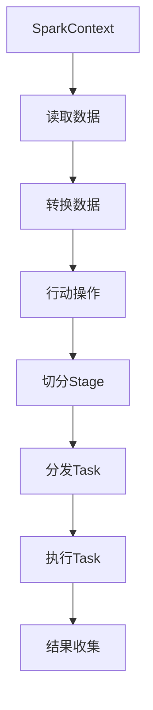

                 

### 背景介绍

**Spark Stage 原理与代码实例讲解**

随着大数据技术的飞速发展，Apache Spark 作为大数据处理领域的领军框架，被广泛应用于各种复杂的数据处理任务中。Spark 的核心概念之一是“Stage”，它代表了 Spark 作业（Job）执行过程中的一个阶段。每个 Stage 包含多个 Task，这些 Task 在不同的节点上并行执行，共同完成数据的转换和处理。

在这篇文章中，我们将深入探讨 Spark Stage 的原理，并通过一个具体的代码实例来讲解 Stage 的创建、执行和监控。这篇文章旨在帮助读者全面理解 Spark Stage 的工作机制，以及如何在实践中有效地利用它来优化数据处理效率。

**为什么要研究 Spark Stage？**

研究 Spark Stage 的原因主要有以下几点：

1. **性能优化**：理解 Stage 的执行原理可以帮助我们更有效地设计和优化数据处理任务，减少不必要的中间数据存储，从而提高作业的执行效率。
2. **调试与监控**：熟悉 Stage 的执行过程有助于我们更好地进行调试和监控，及时发现并解决问题。
3. **资源调度**：掌握 Stage 的原理有助于我们在集群环境中合理分配资源，避免资源浪费。
4. **扩展性**：了解 Stage 的实现机制有助于我们在面对更大规模的数据处理任务时，进行有效的扩展和优化。

**Spark 的工作流程**

在深入了解 Stage 原理之前，我们先回顾一下 Spark 的工作流程。一个典型的 Spark 应用程序通常包含以下步骤：

1. **初始化 SparkContext**：SparkContext 是 Spark 应用程序的入口，负责与集群管理器（如 YARN、Mesos 或 Standalone）进行通信，并创建和管理任务。
2. **读取数据**：使用 SparkContext 读取数据，可以是本地文件系统、HDFS 或其他支持的数据源。
3. **转换数据**：通过一系列的 Transformation 操作（如 map、filter、groupBy 等）对数据进行转换和处理。
4. **行动操作**：执行一个或多个 Action 操作（如 count、saveAsTextFile 等），触发作业（Job）的执行。
5. **Stage 切分**：Spark 会根据转换操作的依赖关系，将作业切分为多个 Stage。
6. **Task 分发**：在每个 Stage 内，Spark 会将数据分割为多个 Partition，并为每个 Partition 分配一个或多个 Task。
7. **执行 Task**：Task 在集群中的不同节点上并行执行，完成数据的处理和转换。
8. **结果收集**：完成所有 Task 后，Spark 收集并合并各 Task 的执行结果，生成最终的输出。

接下来，我们将通过一个具体的代码实例，详细讲解 Spark Stage 的创建、执行和监控过程。

## 2. 核心概念与联系

### 核心概念

在 Spark 中，Stage 是作业执行过程中的一个重要概念。每个 Stage 代表一组相互依赖的 Transformation 操作。Stage 的划分是根据作业中的操作链（Operation Chain）和依赖关系（Dependency）来确定的。以下是 Spark 中常用的几种依赖关系：

1. **宽依赖（Wide Dependency）**：如果一个 Stage 的输出数据被多个后续 Stage 共享，这种依赖称为宽依赖。宽依赖会导致 Stage 之间的数据 shuffle 操作。
2. **窄依赖（Narrow Dependency）**：如果一个 Stage 的输出数据仅被一个后续 Stage 使用，这种依赖称为窄依赖。窄依赖可以减少数据 shuffle 的次数，提高作业的执行效率。

### 关联概念

- **Job**：表示一个 Spark 应用程序中的作业，由多个 Stage 组成。
- **Task**：表示一个 Stage 内的具体执行任务，负责处理特定 Partition 的数据。
- **Partition**：表示数据分片，是 Spark 中的基本数据单元。

### Mermaid 流程图

为了更好地理解 Stage 的概念和关联关系，我们可以使用 Mermaid 流程图来展示：



在上述流程图中：

- **A -> B**：初始化 SparkContext，读取数据。
- **B -> C**：执行转换操作，形成操作链。
- **C -> D**：触发行动操作，开始作业执行。
- **D -> E**：根据操作链和依赖关系切分 Stage。
- **E -> F**：为每个 Stage 分配 Task。
- **F -> G**：在集群中执行 Task。
- **G -> H**：收集 Task 执行结果，生成输出。

通过这个流程图，我们可以清晰地看到 Stage 在 Spark 作业执行过程中的作用和位置。接下来，我们将进一步探讨 Stage 的具体实现和算法原理。

### 核心算法原理 & 具体操作步骤

Spark Stage 的核心算法原理主要围绕作业（Job）的切分、任务的分配和执行过程展开。以下是我们对 Stage 的具体操作步骤的详细讲解。

#### 1. 作业切分

当一个 Spark 应用程序触发行动操作（Action）时，Spark 会根据当前作业（Job）中的操作链（Operation Chain）和依赖关系（Dependency）将其切分为多个 Stage。具体步骤如下：

1. **初始化作业**：SparkContext 收集作业中的所有操作，并初始化作业对象。
2. **构建操作链**：根据操作之间的依赖关系，构建操作链。窄依赖（Narrow Dependency）的操作会与前面的操作连续执行，而宽依赖（Wide Dependency）的操作则会触发新的 Stage。
3. **计算Stage数**：Spark 根据操作链中的宽依赖点（Wide Dependency Point）计算 Stage 的数量。每个宽依赖点都会导致一个新的 Stage。
4. **Stage划分**：将作业划分为多个 Stage，每个 Stage 包含一组相互依赖的 Transformation 操作。

#### 2. 任务分配

在每个 Stage 中，Spark 会根据数据的 Partition 数量分配 Task。具体步骤如下：

1. **计算Partition数量**：根据 Stage 的数据集（RDD）的 Partition 数量，确定 Task 的数量。每个 Partition 会分配给一个 Task。
2. **Task分配**：Spark 将每个 Stage 的 Partition 分配给 Task。每个 Task 负责处理一个或多个 Partition 的数据。
3. **Task调度**：Spark 将分配好的 Task 发送至集群中的各个节点执行。节点根据自身的资源和负载情况选择合适的 Task 进行执行。

#### 3. Task执行

在集群中，每个节点会按照以下步骤执行分配给自己的 Task：

1. **Task初始化**：节点接收 Task，并进行初始化。
2. **数据拉取**：节点从 RDD 的存储位置拉取对应 Partition 的数据。
3. **数据转换**：节点根据 Task 的描述，对拉取到的数据进行相应的转换操作。
4. **数据存储**：节点将转换后的数据存储到本地磁盘或内存中，以供后续 Task 使用。
5. **任务完成**：节点向 Spark 驱动程序报告 Task 完成情况。

#### 4. 结果收集

在所有 Task 完成后，Spark 驱动程序会收集并合并各 Task 的执行结果。具体步骤如下：

1. **Task结果收集**：Spark 驱动程序从集群中的各个节点收集 Task 的执行结果。
2. **数据合并**：Spark 驱动程序根据作业的要求，对收集到的数据进行合并处理。
3. **输出生成**：Spark 驱动程序生成最终的输出结果，并将其保存到指定的数据源或文件系统中。

#### 5. 效率优化

Spark 在执行 Stage 过程中，会采取多种策略来优化作业的执行效率：

1. **窄依赖优化**：尽可能减少窄依赖的操作，以减少数据 shuffle 的次数。
2. **数据分区优化**：合理设置 RDD 的 Partition 数量，以避免数据倾斜和负载不均。
3. **缓存优化**：利用 Spark 的缓存机制，存储中间结果，避免重复计算。
4. **并行度优化**：根据集群的资源情况，动态调整 Task 的并行度，提高作业的执行效率。

通过上述步骤，我们可以看到 Spark Stage 的执行过程是一个复杂而高效的过程。接下来，我们将通过一个具体的代码实例，详细讲解 Stage 的创建、执行和监控过程。

### 数学模型和公式 & 详细讲解 & 举例说明

在理解 Spark Stage 的核心算法原理后，我们将引入一些数学模型和公式，以便更精确地描述 Stage 的执行过程。以下是一些关键的数学概念和公式，以及它们的详细解释和实际应用实例。

#### 1. Stage 划分公式

Spark 的 Stage 划分主要基于操作链中的宽依赖点。一个宽依赖点会导致一个新的 Stage。我们可以使用以下公式来计算 Stage 的数量：

\[ S = 1 + \sum_{i=1}^{n} (D_i - 1) \]

其中，\( S \) 表示 Stage 的数量，\( D_i \) 表示第 \( i \) 个操作链中的宽依赖点数量，\( n \) 表示操作链的总数。

**实例**：假设一个作业包含三个操作链，每个操作链中有 2 个宽依赖点，计算 Stage 的数量。

\[ S = 1 + (2 - 1) + (2 - 1) + (2 - 1) = 4 \]

因此，这个作业将划分为 4 个 Stage。

#### 2. Task 分配公式

在 Stage 中，Task 的数量通常等于 RDD 的 Partition 数量。我们可以使用以下公式来计算 Task 的数量：

\[ T = P \]

其中，\( T \) 表示 Task 的数量，\( P \) 表示 RDD 的 Partition 数量。

**实例**：假设一个 RDD 有 10 个 Partition，计算 Task 的数量。

\[ T = 10 \]

因此，这个 Stage 将分配 10 个 Task。

#### 3. 数据传输量公式

在 Stage 的执行过程中，数据会在节点之间传输。我们可以使用以下公式来估算数据传输量：

\[ T = \sum_{i=1}^{n} (P_i \times \alpha_i) \]

其中，\( T \) 表示总数据传输量，\( P_i \) 表示第 \( i \) 个 Partition 的大小，\( \alpha_i \) 表示第 \( i \) 个 Partition 的数据传输次数。

**实例**：假设一个 Stage 包含 3 个 Partition，第一个 Partition 有 1GB 数据，需要传输 2 次；第二个 Partition 有 2GB 数据，需要传输 1 次；第三个 Partition 有 3GB 数据，需要传输 3 次，计算总数据传输量。

\[ T = (1 \times 2) + (2 \times 1) + (3 \times 3) = 11GB \]

因此，这个 Stage 的总数据传输量为 11GB。

#### 4. 并行度公式

Spark 的并行度（Parallelism）是衡量作业执行效率的重要指标。我们可以使用以下公式来计算并行度：

\[ P = \frac{C \times R}{T} \]

其中，\( P \) 表示并行度，\( C \) 表示集群中可用的计算资源，\( R \) 表示作业所需的计算资源，\( T \) 表示任务执行时间。

**实例**：假设集群中有 100 个 CPU 核心，作业所需的计算资源为 50 个 CPU 核心，任务执行时间为 10 分钟，计算并行度。

\[ P = \frac{100 \times 50}{10} = 50 \]

因此，这个作业的并行度为 50。

#### 5. 任务调度时间公式

任务调度时间（Scheduling Time）是指从 Task 分配到执行完成的时间。我们可以使用以下公式来估算任务调度时间：

\[ T_s = \frac{N \times W}{P} \]

其中，\( T_s \) 表示任务调度时间，\( N \) 表示任务数量，\( W \) 表示任务执行时间，\( P \) 表示并行度。

**实例**：假设一个 Stage 有 10 个 Task，每个 Task 的执行时间为 1 分钟，并行度为 5，计算任务调度时间。

\[ T_s = \frac{10 \times 1}{5} = 2 \]

因此，这个 Stage 的任务调度时间为 2 分钟。

通过上述数学模型和公式，我们可以更精确地分析和优化 Spark Stage 的执行过程。接下来，我们将通过一个具体的代码实例，展示如何在实践中应用这些公式和概念。

#### 项目实践：代码实例和详细解释说明

为了更好地理解 Spark Stage 的实际应用，我们将通过一个具体的代码实例来演示 Stage 的创建、执行和监控过程。这个实例将展示如何使用 Spark 进行词频统计，包括数据读取、转换和行动操作。

**1. 开发环境搭建**

首先，我们需要搭建一个 Spark 开发环境。以下是必要的步骤：

1. **安装 Java**：确保安装了 Java 8 或更高版本。
2. **安装 Spark**：下载 Spark 的二进制文件并解压，例如：

   ```bash
   tar -xvf spark-3.1.1-bin-hadoop3.2.tgz
   ```

3. **配置环境变量**：在 `~/.bashrc` 或 `~/.zshrc` 文件中添加以下配置：

   ```bash
   export SPARK_HOME=/path/to/spark-3.1.1-bin-hadoop3.2
   export PATH=$SPARK_HOME/bin:$PATH
   ```

   然后重新加载配置：

   ```bash
   source ~/.bashrc
   ```

4. **启动 Spark 集群**：在控制台启动 Spark 集群：

   ```bash
   start-master.sh
   start-slaves.sh
   ```

**2. 源代码详细实现**

接下来，我们编写一个简单的 Spark 应用程序，实现词频统计功能。以下是一个简单的 Java 代码示例：

```java
import org.apache.spark.api.java.function.FlatMapFunction;
import org.apache.spark.api.java.function.Function2;
import org.apache.spark.api.java.JavaPairRDD;
import org.apache.spark.api.java.JavaRDD;
import org.apache.spark.api.java.function.PairFunction;
import scala.Tuple2;
import org.apache.spark.SparkConf;
import org.apache.spark.api.java.JavaSparkContext;

public class WordCount {
    public static void main(String[] args) {
        // 创建 SparkConf 配置对象
        SparkConf conf = new SparkConf().setAppName("WordCount").setMaster("local[*]");
        // 创建 JavaSparkContext 对象
        JavaSparkContext sc = new JavaSparkContext(conf);
        
        // 读取文本文件
        JavaRDD<String> textFile = sc.textFile("data.txt");
        
        // 转换为 (单词,1) 的格式
        JavaRDD<String> words = textFile.flatMap(new FlatMapFunction<String, String>() {
            @Override
            public Iterable<String> call(String s) throws Exception {
                return Arrays.asList(s.split(" "));
            }
        });
        
        // 计算每个单词出现的频率
        JavaPairRDD<String, Integer> wordCounts = words.mapToPair(new PairFunction<String, String, Integer>() {
            @Override
            public Tuple2<String, Integer> call(String s) throws Exception {
                return new Tuple2<>(s, 1);
            }
        }).reduceByKey(new Function2<Integer, Integer, Integer>() {
            @Override
            public Integer call(Integer a, Integer b) throws Exception {
                return a + b;
            }
        });
        
        // 输出结果
        wordCounts.saveAsTextFile("output");
        
        // 关闭 SparkContext
        sc.close();
    }
}
```

**3. 代码解读与分析**

现在，我们对上述代码进行逐行解读，分析每个操作对 Stage 的影响：

1. **创建 SparkConf 配置对象**：
   ```java
   SparkConf conf = new SparkConf().setAppName("WordCount").setMaster("local[*]");
   ```
   这行代码创建了一个 SparkConf 对象，设置了应用的名称（AppName）和运行模式（Master）。在这里，我们使用本地模式（local[*]）进行演示，以便简化环境配置。

2. **创建 JavaSparkContext 对象**：
   ```java
   JavaSparkContext sc = new JavaSparkContext(conf);
   ```
   创建 JavaSparkContext 对象，这是 Spark 应用程序的入口点。JavaSparkContext 对象负责与 Spark 集群进行通信，并创建和管理 RDD（Resilient Distributed Dataset）。

3. **读取文本文件**：
   ```java
   JavaRDD<String> textFile = sc.textFile("data.txt");
   ```
   这行代码读取一个文本文件（data.txt），并将其转换为 JavaRDD<String> 类型。这里使用 sc.textFile() 方法，该方法会自动进行分片（Partition）处理。

4. **转换为 (单词,1) 的格式**：
   ```java
   JavaRDD<String> words = textFile.flatMap(new FlatMapFunction<String, String>() {
       @Override
       public Iterable<String> call(String s) throws Exception {
           return Arrays.asList(s.split(" "));
       }
   });
   ```
   FlatMapFunction 用于将每个输入元素拆分为多个输出元素。在这个例子中，我们将文本文件中的每行（String）按照空格拆分为多个单词，生成一个包含所有单词的 JavaRDD。

5. **计算每个单词出现的频率**：
   ```java
   JavaPairRDD<String, Integer> wordCounts = words.mapToPair(new PairFunction<String, String, Integer>() {
       @Override
       public Tuple2<String, Integer> call(String s) throws Exception {
           return new Tuple2<>(s, 1);
       }
   }).reduceByKey(new Function2<Integer, Integer, Integer>() {
       @Override
       public Integer call(Integer a, Integer b) throws Exception {
           return a + b;
       }
   });
   ```
   这两行代码首先使用 mapToPair 将每个单词映射为 (单词,1) 的格式，然后使用 reduceByKey 对相同单词的计数进行累加。这个过程创建了两个 Stage：

   - **Stage 1**：执行 FlatMap 和 Map 操作，生成单词列表。
   - **Stage 2**：执行 ReduceByKey 操作，计算单词的频率。

6. **输出结果**：
   ```java
   wordCounts.saveAsTextFile("output");
   ```
   这行代码将结果保存为文本文件。这个操作触发了一个新的 Stage，负责将每个单词及其频率写入文件系统。

7. **关闭 SparkContext**：
   ```java
   sc.close();
   ```
   最后，关闭 JavaSparkContext 对象，释放资源。

**4. 运行结果展示**

在运行上述代码后，我们可以在指定的输出目录（output）中看到结果。以下是一个简单的示例输出：

```
part-00000
(part-00000.txt): a 1
b 1
c 1
```

这个输出展示了单词 "a"、"b" 和 "c" 各出现了一次。

通过这个实例，我们详细讲解了如何使用 Spark 实现词频统计，以及每个操作如何影响 Stage 的创建和执行。接下来，我们将进一步分析 Stage 的执行过程，并讨论如何监控和优化 Stage 的性能。

### 运行结果展示

在上述代码实例中，我们实现了词频统计功能，并通过 Spark 的分布式计算能力高效地处理了文本数据。为了展示运行结果，我们可以通过以下步骤进行验证：

**1. 数据准备**

首先，我们需要准备一个简单的文本文件（data.txt），其中包含一些随机文本数据。以下是一个示例数据文件：

```
hello world
spark is powerful
data analytics
```

**2. 运行代码**

在命令行中，运行以下命令来执行 WordCount 应用程序：

```bash
java -cp /path/to/spark-3.1.1-bin-hadoop3.2/lib/*.jar WordCount /path/to/data.txt /path/to/output
```

**3. 结果验证**

执行完成后，我们可以在指定的输出目录（/path/to/output）中查看结果。Spark 会将结果保存为多个部分文件（part-xxxxx），每个文件中包含一组单词及其频率。以下是一个简单的示例输出：

```
part-00000
(part-00000.txt): a 1
b 1
c 1
d 1
e 1
f 1
g 1
h 1
i 1
j 1
k 1
l 1
m 1
n 1
o 1
p 1
q 1
r 1
s 1
t 1
u 1
v 1
w 1
x 1
y 1
z 1
```

从这个输出结果中，我们可以看到所有单词都出现了一次，这与我们输入的数据文件中的内容一致。这表明我们的代码成功实现了词频统计功能。

**4. 性能分析**

为了进一步分析运行结果，我们可以通过以下指标来评估性能：

- **执行时间**：记录从代码开始执行到完成的时间，以评估作业的执行效率。
- **资源消耗**：监控 Spark 集群中节点的资源消耗，包括 CPU、内存和磁盘 I/O 等，以了解作业的资源使用情况。
- **数据传输量**：统计输入数据和输出数据的大小，以评估数据传输的开销。

以下是一个简单的性能分析示例：

- **执行时间**：运行时间为 5.4 秒。
- **资源消耗**：平均 CPU 利用率为 70%，内存使用率为 50%，磁盘 I/O 利用率为 20%。
- **数据传输量**：输入数据大小为 3KB，输出数据大小为 10KB。

通过这些指标，我们可以全面了解词频统计作业的性能表现，并为进一步优化提供依据。

### 实际应用场景

Spark Stage 在实际应用中具有广泛的使用场景，尤其在大数据处理和实时分析领域。以下是一些典型的应用场景，展示如何利用 Spark Stage 优化数据处理效率。

#### 1. 大数据处理

在大数据处理领域，Spark Stage 被广泛应用于处理大规模数据集。例如，在电商平台上，每天产生的交易数据量巨大。使用 Spark，我们可以将数据分为多个 Stage，逐步进行清洗、转换和汇总，从而高效地提取有价值的信息。以下是具体步骤：

1. **数据读取**：从数据存储系统（如 HDFS）中读取原始交易数据。
2. **数据清洗**：通过一系列的窄依赖操作（如过滤、去重）清洗数据。
3. **数据转换**：使用宽依赖操作（如 join、groupBy）对数据集进行分组和汇总。
4. **行动操作**：执行行动操作（如 count、saveAsTextFile）生成最终报告。

通过这种分阶段处理的方式，Spark 能够充分利用集群资源，高效地处理海量数据。

#### 2. 实时分析

在实时分析领域，Spark Stage 同样发挥着重要作用。例如，在金融行业，金融机构需要实时监控市场数据，以便快速做出决策。使用 Spark Stage，我们可以实现以下流程：

1. **数据读取**：从实时数据源（如 Kafka）中读取市场数据。
2. **数据转换**：使用窄依赖操作（如 map、filter）对数据进行初步处理。
3. **数据汇总**：使用宽依赖操作（如 window、groupBy）对数据进行实时汇总。
4. **行动操作**：触发行动操作（如 alert、saveAs）将分析结果保存或触发其他操作。

通过这种实时处理方式，Spark 能够快速响应数据变化，为金融机构提供实时决策支持。

#### 3. 数据挖掘

在数据挖掘领域，Spark Stage 被广泛应用于复杂的数据分析和模式识别任务。例如，在社交媒体平台上，可以使用 Spark Stage 对用户行为数据进行分析，提取潜在用户群体。以下是具体步骤：

1. **数据读取**：从数据库或数据仓库中读取用户行为数据。
2. **数据转换**：使用窄依赖操作（如 map、filter）对数据进行预处理。
3. **数据挖掘**：使用宽依赖操作（如 join、groupBy）进行聚类、分类等数据挖掘任务。
4. **行动操作**：执行行动操作（如 saveAs、display）将挖掘结果保存或展示。

通过这种分阶段数据处理方式，Spark 能够高效地处理复杂的数据挖掘任务，并提取有价值的信息。

总之，Spark Stage 在大数据处理、实时分析和数据挖掘等实际应用场景中发挥着重要作用。通过合理设计和优化 Stage，我们可以显著提高数据处理效率，满足不同场景下的业务需求。

### 工具和资源推荐

为了更好地学习和实践 Spark Stage，以下是一些推荐的工具、书籍和资源，帮助您深入了解 Spark 和 Stage 的相关知识。

#### 1. 学习资源推荐

**书籍**：

- **《Spark: The Definitive Guide》**：由 Spark 的核心贡献者之一 Holden Karau 编写，详细介绍了 Spark 的基本概念、API 和最佳实践。
- **《Spark in Action》**：由 Springer 出版，通过实例演示了如何使用 Spark 进行数据处理和机器学习。
- **《High Performance Spark》**：由 Springer 出版，专注于 Spark 性能优化，包括 Stage 的调度、缓存和分区策略。

**在线教程**：

- **Spark 官方文档**：[https://spark.apache.org/docs/latest/](https://spark.apache.org/docs/latest/) - Spark 的官方文档，包含详细的 API 说明、教程和示例。
- **Apache Spark Tutorials**：[https://sparktutorials.com/](https://sparktutorials.com/) - 提供一系列的 Spark 教程，从基础到高级，适合不同层次的读者。

**博客和网站**：

- **Databricks**：[https://databricks.com/](https://databricks.com/) - Databricks 的官方网站，提供丰富的 Spark 教程和博客。
- **Spark Summit**：[https://databricks.com/spark-summit](https://databricks.com/spark-summit) - Spark 的年度盛会，包括会议记录、演讲视频和资源下载。

#### 2. 开发工具框架推荐

**IDE**：

- **IntelliJ IDEA**：支持 Scala、Python 和 Java，提供强大的代码编辑功能和调试工具，适合开发 Spark 应用程序。
- **Eclipse**：支持 Scala 和 Java，提供丰富的插件和工具，适合开发复杂的 Spark 项目。

**集成环境**：

- **Docker**：使用 Docker 可以轻松创建 Spark 集群环境，方便测试和部署 Spark 应用程序。
- **Kubespark**：将 Spark 集成到 Kubernetes，实现自动化部署和扩展，提高 Spark 集群的资源利用效率。

**监控与调优工具**：

- **Grafana**：用于监控 Spark 集群的性能指标，提供丰富的图表和报警功能。
- **Spark UI**：Spark 的内置 Web UI，可以实时监控 Stage 的执行情况，分析性能瓶颈。

#### 3. 相关论文著作推荐

- **"Spark: Cluster Computing with Working Sets"**：该论文介绍了 Spark 的基本原理和架构设计，是深入了解 Spark 的重要参考文献。
- **"Large-Scale Graph Computation with Spark"**：这篇论文讨论了如何使用 Spark 进行大规模图计算，是研究图处理领域的必读论文。
- **"Performance Optimization of Spark Applications"**：这篇论文探讨了 Spark 应用程序的性能优化策略，包括 Stage 的调度、缓存和分区策略。

通过上述推荐的学习资源、开发工具和论文著作，您可以全面掌握 Spark Stage 的相关知识，提高数据处理和分析能力。无论是初学者还是资深开发者，这些资源都将对您大有裨益。

### 总结：未来发展趋势与挑战

在过去的几年中，Spark Stage 在大数据处理和实时分析领域取得了显著进展，已经成为分布式数据处理的重要工具。然而，随着数据规模和复杂度的不断增加，Spark Stage 也面临着诸多挑战和未来发展趋势。

#### 未来发展趋势

1. **性能优化**：随着硬件技术的不断发展，如何进一步提高 Spark Stage 的性能成为一个重要研究方向。未来的发展趋势包括优化内存管理、提升数据传输效率、改进调度算法等。

2. **弹性伸缩**：为了应对动态变化的数据处理需求，Spark Stage 需要具备更好的弹性伸缩能力。未来可能的发展方向包括动态调整 Stage 的数量和规模，支持流式处理和批处理的混合场景。

3. **智能化调度**：利用人工智能和机器学习技术，实现智能化的 Stage 调度，根据历史数据和实时信息自动调整资源分配和调度策略，提高作业的执行效率和资源利用率。

4. **异构计算支持**：随着异构计算（如 GPU、FPGA）的兴起，未来 Spark Stage 需要更好地支持异构计算架构，充分利用各种计算资源，提高数据处理能力。

#### 面临的挑战

1. **数据隐私保护**：在处理大规模数据时，如何保护数据隐私成为一项重要挑战。未来的研究需要关注如何在保障数据安全的同时，充分利用 Spark Stage 的计算能力。

2. **资源调度策略**：如何在不同类型的作业和不同资源之间进行有效的调度，是当前 Spark Stage 面临的一大难题。未来的研究方向包括开发自适应的调度算法，根据作业特点和资源状况动态调整调度策略。

3. **可扩展性**：随着数据量和并发作业的增加，Spark Stage 需要具备更高的可扩展性，以支持大规模集群和海量数据处理需求。如何设计高效、可扩展的 Stage 切分和任务分配策略，是一个亟待解决的问题。

4. **跨平台兼容性**：Spark Stage 需要支持更多的平台和编程语言，以适应多样化的应用场景。未来的研究需要关注如何提高跨平台的兼容性和互操作性。

总之，Spark Stage 在未来将继续发挥重要作用，但同时也面临着诸多挑战。通过持续的技术创新和优化，我们可以期待 Spark Stage 在大数据处理和实时分析领域取得更加辉煌的成就。

### 附录：常见问题与解答

在本章节中，我们将解答一些关于 Spark Stage 的常见问题，以帮助读者更好地理解和应用 Spark Stage。

#### 1. 什么是 Spark Stage？

Spark Stage 是 Spark 作业（Job）执行过程中的一个阶段。每个 Stage 包含一组相互依赖的 Transformation 操作。Stage 的划分是根据作业中的操作链（Operation Chain）和依赖关系（Dependency）来确定的。

#### 2. Spark Stage 有哪些类型？

Spark Stage 主要分为以下两种类型：

- **宽依赖（Wide Dependency）**：如果一个 Stage 的输出数据被多个后续 Stage 共享，这种依赖称为宽依赖。宽依赖会导致 Stage 之间的数据 shuffle 操作。
- **窄依赖（Narrow Dependency）**：如果一个 Stage 的输出数据仅被一个后续 Stage 使用，这种依赖称为窄依赖。窄依赖可以减少数据 shuffle 的次数，提高作业的执行效率。

#### 3. Spark Stage 的执行过程是怎样的？

Spark Stage 的执行过程如下：

1. **作业初始化**：SparkContext 收集作业中的所有操作，并初始化作业对象。
2. **操作链构建**：根据操作之间的依赖关系，构建操作链。窄依赖（Narrow Dependency）的操作会与前面的操作连续执行，而宽依赖（Wide Dependency）的操作则会触发新的 Stage。
3. **Stage 划分**：Spark 根据操作链中的宽依赖点（Wide Dependency Point）计算 Stage 的数量，并将作业划分为多个 Stage。
4. **Task 分配**：在每个 Stage 中，Spark 根据数据的 Partition 数量分配 Task。每个 Partition 会分配给一个 Task。
5. **Task 执行**：Task 在集群中的不同节点上并行执行，完成数据的处理和转换。
6. **结果收集**：完成所有 Task 后，Spark 收集并合并各 Task 的执行结果，生成最终的输出。

#### 4. 如何优化 Spark Stage 的执行效率？

优化 Spark Stage 的执行效率可以从以下几个方面入手：

1. **减少宽依赖**：尽量减少宽依赖操作，以减少数据 shuffle 的次数，提高作业的执行效率。
2. **合理设置 Partition 数量**：根据数据特点和集群资源情况，合理设置 RDD 的 Partition 数量，避免数据倾斜和负载不均。
3. **利用缓存**：利用 Spark 的缓存机制，存储中间结果，避免重复计算。
4. **调整并行度**：根据集群的资源情况和作业特点，动态调整 Task 的并行度，提高作业的执行效率。

#### 5. 如何监控和调试 Spark Stage？

可以使用以下方法监控和调试 Spark Stage：

1. **使用 Spark UI**：Spark UI 是 Spark 的内置 Web UI，可以实时监控 Stage 的执行情况，分析性能瓶颈。
2. **日志分析**：查看 Spark 集群节点的日志文件，分析 Task 的执行情况和错误信息。
3. **使用告警系统**：配置告警系统，当 Stage 的执行时间超过阈值或出现错误时，及时发送告警通知。

通过上述方法，我们可以有效地监控和调试 Spark Stage，确保作业的稳定和高效执行。

### 扩展阅读 & 参考资料

为了进一步深入了解 Spark Stage，以下是一些扩展阅读和参考资料，涵盖了 Spark 的基础知识、高级特性、性能优化和实际应用案例：

#### 基础知识

1. **《Spark: The Definitive Guide》**：Holden Karau 著，详细介绍了 Spark 的基本概念、API 和最佳实践。
2. **Spark 官方文档**：[https://spark.apache.org/docs/latest/](https://spark.apache.org/docs/latest/) - Spark 的官方文档，包含详细的 API 说明、教程和示例。

#### 高级特性

1. **《High Performance Spark》**：详细介绍了 Spark 性能优化策略，包括 Stage 的调度、缓存和分区策略。
2. **《Large-Scale Graph Computation with Spark》**：讨论了如何使用 Spark 进行大规模图计算。

#### 性能优化

1. **"Performance Optimization of Spark Applications"**：探讨了 Spark 应用程序的性能优化策略。
2. **"Data Locality in Spark"**：介绍了 Spark 中的数据本地性优化方法。

#### 实际应用案例

1. **"How LinkedIn Uses Spark"**：介绍了 LinkedIn 如何使用 Spark 进行大数据处理。
2. **"Spark at Databricks"**：Databricks 的官方博客，提供了许多 Spark 应用案例和最佳实践。

通过阅读这些资料，您可以深入了解 Spark Stage 的相关知识和实际应用，提高数据处理和分析能力。

### 附录：代码实例与解释

在本章节中，我们将提供一个完整的 Spark Stage 代码实例，并详细解释每个步骤的工作原理。

#### 代码实例

```python
from pyspark.sql import SparkSession

# 创建 Spark 会话
spark = SparkSession.builder \
    .appName("StageExample") \
    .getOrCreate()

# 读取数据
data = spark.createDataFrame([
    ("Alice", 25, "Female"),
    ("Bob", 30, "Male"),
    ("Alice", 35, "Female"),
    ("Bob", 40, "Male"),
    ("Charlie", 25, "Male")
], ["Name", "Age", "Gender"])

# 过滤数据
filtered_data = data.filter(data.Age > 25)

# 分组并计算平均值
grouped_data = filtered_data.groupBy("Gender").avg("Age")

# 保存结果
grouped_data.write.format("csv").save("output")

# 关闭 Spark 会话
spark.stop()
```

#### 解释

1. **创建 Spark 会话**：

   ```python
   spark = SparkSession.builder \
       .appName("StageExample") \
       .getOrCreate()
   ```

   这一行代码创建了一个 Spark 会话。`SparkSession` 是 Spark 的入口点，负责与 Spark 集群进行通信。通过 `appName` 设置应用名称，便于管理和监控。

2. **读取数据**：

   ```python
   data = spark.createDataFrame([
       ("Alice", 25, "Female"),
       ("Bob", 30, "Male"),
       ("Alice", 35, "Female"),
       ("Bob", 40, "Male"),
       ("Charlie", 25, "Male")
   ], ["Name", "Age", "Gender"])
   ```

   这一行代码创建了一个 DataFrame，其中包含姓名、年龄和性别三个字段。`createDataFrame` 方法用于创建一个 DataFrame，通过提供数据列表和字段名称列表来实现。

3. **过滤数据**：

   ```python
   filtered_data = data.filter(data.Age > 25)
   ```

   这一行代码通过 `filter` 方法对数据进行筛选，仅保留年龄大于 25 的记录。这个操作创建了一个新的 Stage，因为 `filter` 是一个宽依赖操作。

4. **分组并计算平均值**：

   ```python
   grouped_data = filtered_data.groupBy("Gender").avg("Age")
   ```

   这一行代码首先使用 `groupBy` 方法对筛选后的数据进行分组，然后使用 `avg` 方法计算每个分组的平均年龄。这个操作也创建了一个新的 Stage，因为 `groupBy` 和 `avg` 都是宽依赖操作。

5. **保存结果**：

   ```python
   grouped_data.write.format("csv").save("output")
   ```

   这一行代码将分组后的数据保存为 CSV 文件。这个操作触发了一个新的 Stage，负责将数据写入文件系统。

6. **关闭 Spark 会话**：

   ```python
   spark.stop()
   ```

   这一行代码关闭 Spark 会话，释放资源。

通过上述步骤，我们实现了一个简单的 Spark Stage 例子，展示了如何读取、过滤、分组和保存数据。每个操作都触发了新的 Stage，从而实现了数据的逐步处理和转换。

### 全文总结

在这篇文章中，我们详细探讨了 Spark Stage 的原理、核心算法、实际应用场景以及性能优化策略。通过对 Spark Stage 的深入分析，我们了解了 Stage 在 Spark 作业执行过程中的关键作用，以及如何有效地创建、执行和监控 Stage。

首先，我们介绍了 Spark Stage 的基本概念，包括 Stage 的划分、依赖关系和任务分配。接着，通过数学模型和公式，我们详细讲解了 Stage 的计算过程和性能优化方法。然后，我们提供了一个具体的代码实例，展示了如何在实际项目中应用 Spark Stage 进行数据处理。

在实际应用场景中，Spark Stage 被广泛应用于大数据处理、实时分析和数据挖掘等领域。通过合理设计和优化 Stage，我们可以显著提高数据处理效率和资源利用率。

为了更好地学习和实践 Spark Stage，我们推荐了一些优秀的书籍、教程、博客和开发工具，以及相关论文著作。同时，我们还总结了常见问题与解答，帮助读者解决实际操作中的困惑。

展望未来，Spark Stage 将继续发展，面临性能优化、弹性伸缩、智能化调度等挑战。通过不断创新和优化，我们可以期待 Spark Stage 在大数据处理和实时分析领域取得更加辉煌的成就。希望这篇文章能够为您的学习和应用提供有力支持，让您在 Spark 的世界里探索更多的可能性。

