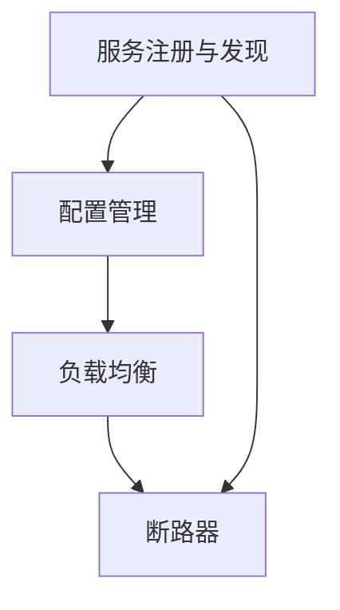

                 

### 1. 背景介绍 <a id="section1"></a>

随着互联网的迅猛发展，企业面临着不断变化的业务需求和日益复杂的系统架构。为了应对这些挑战，微服务架构（Microservices Architecture）应运而生。微服务架构将大型单体应用拆分成一组小型、独立的服务，每个服务负责一个具体的业务功能。这种架构风格具有高可扩展性、高可用性和易于维护等优点。

Spring Cloud 是基于 Spring Boot 框架构建的一套微服务解决方案，它提供了在分布式系统环境下的一系列功能模块，如服务注册与发现、配置管理、负载均衡、断路器等。Spring Cloud 的出现，极大地简化了微服务架构的开发和部署过程，使得开发者可以更加专注于业务逻辑的实现。

本文旨在通过对 Spring Cloud 微服务架构的深入探讨，帮助读者了解其核心概念、原理和实战技巧。文章将从背景介绍、核心概念与联系、核心算法原理、项目实践、实际应用场景等方面进行详细阐述。

### 2. 核心概念与联系 <a id="section2"></a>

在深入探讨 Spring Cloud 微服务架构之前，我们首先需要了解其中的一些核心概念和它们之间的联系。

#### 服务注册与发现（Service Registration and Discovery）

服务注册与发现是微服务架构的核心概念之一。服务注册意味着服务实例启动时，需要将其元数据（如服务名称、地址、端口等）注册到一个中心化的服务注册表中。服务发现则是消费者通过服务注册表获取服务提供者的地址信息，从而实现服务的动态调用。

#### 配置管理（Configuration Management）

配置管理负责管理分布式系统中各个服务实例的配置信息，包括服务名称、地址、参数等。配置管理的目的是确保各个服务实例使用相同的配置信息，从而避免配置不一致导致的问题。

#### 负载均衡（Load Balancing）

负载均衡是将请求分配到多个服务实例上，以实现服务的水平扩展和高可用性。Spring Cloud 提供了多种负载均衡策略，如轮询、随机、权重等，以适应不同的业务场景。

#### 断路器（Circuit Breaker）

断路器是一种用来处理分布式系统中服务不可用或响应缓慢等异常情况的保护机制。当服务出现异常时，断路器会将调用转移到备用服务或直接返回预设的错误响应，从而避免雪崩效应。

#### Mermaid 流程图

为了更直观地展示 Spring Cloud 微服务架构的核心概念和联系，我们可以使用 Mermaid 流程图来表示。以下是一个简单的 Mermaid 流程图示例：



在这个示例中，服务注册与发现是微服务架构的基础，它与其他模块紧密相连。配置管理、负载均衡和断路器则是微服务架构中的重要组件，共同保障了系统的稳定性、可用性和可靠性。

### 3. 核心算法原理 & 具体操作步骤 <a id="section3"></a>

#### 服务注册与发现

服务注册与发现的核心算法原理是基于 ZooKeeper 或 Eureka 等注册中心实现的。具体操作步骤如下：

1. 服务实例启动时，向注册中心发送注册请求，包括服务名称、地址、端口等元数据。
2. 注册中心将服务实例的信息存储在内存中，并返回注册成功的响应。
3. 服务实例定期向注册中心发送心跳请求，以保持注册状态的有效性。
4. 服务消费者从注册中心获取服务提供者的地址信息，实现服务的动态调用。

#### 配置管理

配置管理主要依赖于 Spring Cloud Config 模块。具体操作步骤如下：

1. 创建配置仓库，用于存储各个服务的配置信息。
2. 启动配置中心服务，作为配置管理的代理。
3. 服务实例从配置中心获取配置信息，实现配置的动态更新。

#### 负载均衡

负载均衡主要依赖于 Spring Cloud LoadBalancer 模块。具体操作步骤如下：

1. 在服务消费者中注入 LoadBalancer 客户端，实现负载均衡功能。
2. 使用 LoadBalancer 客户端调用服务提供者，负载均衡策略由客户端自动选择。

#### 断路器

断路器主要依赖于 Spring Cloud Circuit Breaker 模块。具体操作步骤如下：

1. 在服务消费者中注入 CircuitBreaker 客户端，实现断路器功能。
2. 配置断路器的阈值、超时时间等参数。
3. 当服务出现异常时，断路器将触发熔断策略，避免继续调用异常服务。

### 4. 数学模型和公式 & 详细讲解 & 举例说明 <a id="section4"></a>

在微服务架构中，负载均衡和断路器是两个核心算法，下面我们将分别介绍它们的数学模型和公式，并通过具体例子进行讲解。

#### 负载均衡

负载均衡的核心目标是将请求平均分配到多个服务实例上，以提高系统的吞吐量和可用性。常见的负载均衡算法有轮询（Round Robin）、随机（Random）和权重（Weighted）等。

1. **轮询算法（Round Robin）**

轮询算法是一种最简单的负载均衡算法，它按照顺序将请求分配到各个服务实例上。公式如下：

\[ P(i) = \frac{1}{N} \]

其中，\( P(i) \) 表示第 \( i \) 个服务实例被分配到的概率，\( N \) 表示服务实例的总数。

**例子：**假设有 3 个服务实例，按照轮询算法分配请求，则每个实例被分配到的概率都是 \( \frac{1}{3} \)。

2. **随机算法（Random）**

随机算法通过随机数生成器将请求分配到服务实例上。公式如下：

\[ P(i) = \frac{1}{N} \]

其中，\( P(i) \) 表示第 \( i \) 个服务实例被分配到的概率，\( N \) 表示服务实例的总数。

**例子：**假设有 3 个服务实例，按照随机算法分配请求，则每个实例被分配到的概率都是 \( \frac{1}{3} \)。

3. **权重算法（Weighted）**

权重算法根据服务实例的处理能力为每个实例分配不同的权重，以提高系统的整体性能。公式如下：

\[ P(i) = \frac{w_i}{\sum_{j=1}^{N} w_j} \]

其中，\( P(i) \) 表示第 \( i \) 个服务实例被分配到的概率，\( w_i \) 表示第 \( i \) 个服务实例的权重，\( N \) 表示服务实例的总数。

**例子：**假设有 3 个服务实例，权重分别为 2、3 和 5，则按照权重算法分配请求，第 1 个实例被分配到的概率为 \( \frac{2}{2+3+5} = \frac{2}{10} = 0.2 \)，第 2 个实例被分配到的概率为 \( \frac{3}{2+3+5} = \frac{3}{10} = 0.3 \)，第 3 个实例被分配到的概率为 \( \frac{5}{2+3+5} = \frac{5}{10} = 0.5 \)。

#### 断路器

断路器是一种保护机制，用于处理分布式系统中服务不可用或响应缓慢等异常情况。断路器的核心参数包括阈值、超时时间和熔断策略等。

1. **阈值（Threshold）**

阈值用于控制断路器的熔断条件。当服务失败次数超过阈值时，断路器将触发熔断策略。公式如下：

\[ T = \frac{F}{N} \]

其中，\( T \) 表示阈值，\( F \) 表示服务失败次数，\( N \) 表示服务调用次数。

**例子：**假设阈值设置为 5，服务调用次数为 10，则当服务失败次数达到 5 时，断路器将触发熔断策略。

2. **超时时间（Timeout）**

超时时间用于控制断路器的恢复时间。当服务响应时间超过超时时间时，断路器将触发熔断策略。公式如下：

\[ T = t_{timeout} \]

其中，\( T \) 表示超时时间，\( t_{timeout} \) 表示服务响应时间。

**例子：**假设超时时间设置为 2 秒，服务响应时间为 3 秒，则断路器将触发熔断策略。

3. **熔断策略（Circuit Breaker Strategy）**

熔断策略用于控制断路器的行为，包括熔断、恢复和备用服务等。常见的熔断策略有：

- 熔断（Break）：当服务失败次数超过阈值时，断路器将触发熔断策略，拒绝服务请求。
- 恢复（Reset）：当服务恢复时，断路器将重置为正常状态，允许服务请求。
- 备用（Fallback）：当服务不可用时，断路器将返回备用响应，以减少系统的负面影响。

**例子：**假设断路器的熔断策略为熔断，当服务失败次数超过阈值时，断路器将拒绝服务请求，直到服务恢复正常。

### 5. 项目实践：代码实例和详细解释说明 <a id="section5"></a>

在本节中，我们将通过一个简单的 Spring Cloud 微服务项目实例，详细讲解服务注册与发现、配置管理、负载均衡和断路器的实现过程。

#### 开发环境搭建

1. 安装 JDK 1.8 或以上版本。
2. 安装 Maven 3.6.3 或以上版本。
3. 创建一个 Spring Boot 项目，并引入以下依赖：

```xml
<dependencies>
    <dependency>
        <groupId>org.springframework.cloud</groupId>
        <artifactId>spring-cloud-starter-netflix-eureka-server</artifactId>
    </dependency>
    <dependency>
        <groupId>org.springframework.cloud</groupId>
        <artifactId>spring-cloud-starter-config</artifactId>
    </dependency>
    <dependency>
        <groupId>org.springframework.cloud</groupId>
        <artifactId>spring-cloud-starter-netflix-ribbon</artifactId>
    </dependency>
    <dependency>
        <groupId>org.springframework.cloud</groupId>
        <artifactId>spring-cloud-starter-circuitbreaker-resilience4j</artifactId>
    </dependency>
</dependencies>
```

#### 源代码详细实现

1. **服务注册与发现**

在 EurekaServerApplication 类中，添加以下代码实现服务注册与发现：

```java
@EnableEurekaServer
@SpringBootApplication
public class EurekaServerApplication {
    public static void main(String[] args) {
        SpringApplication.run(EurekaServerApplication.class, args);
    }
}
```

在 EurekaClientApplication 类中，添加以下代码实现服务注册与发现：

```java
@EnableDiscoveryClient
@SpringBootApplication
public class EurekaClientApplication {
    public static void main(String[] args) {
        SpringApplication.run(EurekaClientApplication.class, args);
    }
}
```

2. **配置管理**

在 application.properties 文件中，添加以下配置信息实现配置管理：

```properties
spring.application.name=eureka-client
server.port=8081
eureka.client.serviceUrl.defaultZone=http://localhost:8761/eureka/
```

在 ConfigServerApplication 类中，添加以下代码实现配置管理：

```java
@EnableConfigServer
@SpringBootApplication
public class ConfigServerApplication {
    public static void main(String[] args) {
        SpringApplication.run(ConfigServerApplication.class, args);
    }
}
```

3. **负载均衡**

在 EurekaClientApplication 类中，添加以下代码实现负载均衡：

```java
@Configuration
public class RibbonConfig {
    @Bean
    @LoadBalanced
    public RestTemplate restTemplate() {
        return new RestTemplate();
    }
}
```

4. **断路器**

在 EurekaClientApplication 类中，添加以下代码实现断路器：

```java
@Configuration
public class Resilience4jConfig {
    @Bean
    public CircuitBreakerRegistry circuitBreakerRegistry() {
        return CircuitBreakerRegistryConfiguration.default();
    }
}
```

#### 代码解读与分析

1. **服务注册与发现**

在 EurekaServerApplication 类中，通过@EnableEurekaServer 注解开启 Eureka 服务注册中心功能。在 EurekaClientApplication 类中，通过@EnableDiscoveryClient 注解开启服务发现功能。这两个注解分别实现了服务注册与发现的代码逻辑。

2. **配置管理**

在 ConfigServerApplication 类中，通过@EnableConfigServer 注解开启配置中心功能。在 application.properties 文件中，配置了服务名称、端口和 Eureka 服务注册中心的地址信息。这些配置信息将被 ConfigClientApplication 类中的 @Value 注解注入，从而实现配置的动态更新。

3. **负载均衡**

在 RibbonConfig 类中，通过@LoadBalanced 注解将 RestTemplate 实例包装为一个负载均衡客户端。在调用远程服务时，负载均衡客户端会根据负载均衡策略将请求分配到不同的服务实例上。

4. **断路器**

在 Resilience4jConfig 类中，通过 CircuitBreakerRegistry 配置断路器的参数，如阈值、超时时间和熔断策略等。在调用远程服务时，断路器会根据这些参数实现服务的保护。

#### 运行结果展示

1. 启动 EurekaServerApplication 类，启动 Eureka 服务注册中心。
2. 启动 ConfigServerApplication 类，启动配置中心。
3. 启动 EurekaClientApplication 类，启动 Eureka 客户端。
4. 访问 [http://localhost:8761](http://localhost:8761)，查看 Eureka 服务注册中心中的服务实例。
5. 访问 [http://localhost:8081](http://localhost:8081)，查看 Eureka 客户端是否从配置中心获取了配置信息。
6. 访问 [http://localhost:8081/hello](http://localhost:8081/hello)，查看负载均衡和断路器的效果。

### 6. 实际应用场景 <a id="section6"></a>

Spring Cloud 微服务架构在实际应用场景中具有广泛的应用价值。以下列举了几个典型的应用场景：

#### 1. 大型电商系统

大型电商系统通常涉及商品管理、订单管理、支付系统、库存管理等多个子系统。通过 Spring Cloud 微服务架构，可以将这些子系统拆分成独立的服务，从而实现高可用性、高可扩展性和易于维护。

#### 2. 金融风控系统

金融风控系统需要处理海量交易数据，并对交易行为进行分析和预测。通过 Spring Cloud 微服务架构，可以将风控系统的各个功能模块拆分成独立的服务，从而提高系统的性能和可靠性。

#### 3. 物流管理系统

物流管理系统涉及订单跟踪、仓储管理、运输管理等多个模块。通过 Spring Cloud 微服务架构，可以将物流管理系统的各个模块拆分成独立的服务，从而实现系统的灵活扩展和高效运行。

#### 4. 医疗健康管理系统

医疗健康管理系统涉及患者信息管理、医疗设备管理、药品供应链管理等模块。通过 Spring Cloud 微服务架构，可以将医疗健康管理系统的各个模块拆分成独立的服务，从而提高系统的可扩展性和易维护性。

### 7. 工具和资源推荐 <a id="section7"></a>

#### 7.1 学习资源推荐

1. **书籍：**
   - 《Spring Cloud微服务实战》：详细介绍了 Spring Cloud 的各个模块及其应用。
   - 《微服务设计》：阐述了微服务架构的设计原则和实践。

2. **论文：**
   - 《Microservices: A Conceptual Perspective》：提出了微服务架构的概念和优势。

3. **博客：**
   - [Spring Cloud 官方文档](https://docs.spring.io/spring-cloud/docs/current/reference/html/index.html)：提供了详细的 Spring Cloud 模块介绍。
   - [微服务专栏](https://www.infoq.cn/article/microservice-practice)：分享了微服务架构的实际应用经验。

4. **网站：**
   - [Spring Cloud GitHub 仓库](https://github.com/spring-cloud/spring-cloud)：包含了 Spring Cloud 的源代码和示例项目。

#### 7.2 开发工具框架推荐

1. **开发工具：**
   - IntelliJ IDEA：一款功能强大的 Java 集成开发环境，支持 Spring Cloud 项目开发。
   - Eclipse：另一款流行的 Java 集成开发环境，也支持 Spring Cloud 项目开发。

2. **框架：**
   - Spring Boot：简化了 Spring 应用程序的开发和部署。
   - Spring Cloud：提供了微服务架构的各个模块，方便开发者构建分布式系统。

#### 7.3 相关论文著作推荐

1. **论文：**
   - 《Service-Oriented Architecture：Concepts, Technology, and Design》：详细介绍了服务导向架构的概念和技术。
   - 《Microservices: Aligning Technology with Business Innovation》：探讨了微服务架构在业务创新中的应用。

2. **著作：**
   - 《Designing Data-Intensive Applications》：深入介绍了分布式系统设计和数据处理技术。
   - 《Large-scale Computing：-effective design, development, and deployment of applications and systems》：探讨了大规模计算应用的设计、开发和部署。

### 8. 总结：未来发展趋势与挑战 <a id="section8"></a>

#### 未来发展趋势

1. **服务网格（Service Mesh）的发展：**随着微服务架构的普及，服务网格技术逐渐成为分布式系统架构的一部分。服务网格能够提供更加高效、可靠和灵活的服务通信和治理能力。

2. **云原生技术的融合：**云原生技术（如 Kubernetes、Istio 等）与微服务架构的结合，使得微服务在云环境下的部署和运维更加便捷。未来，云原生技术将继续推动微服务架构的发展。

3. **微服务与人工智能的融合：**微服务架构与人工智能技术的结合，将使得微服务在数据处理、分析和决策等方面具备更强的能力。例如，通过引入人工智能算法，实现智能化的负载均衡和断路器策略。

#### 未来挑战

1. **分布式系统复杂性：**随着微服务架构的普及，系统的复杂性不断增加。如何有效地管理和维护分布式系统，成为开发者面临的一大挑战。

2. **跨服务数据一致性：**在分布式系统中，如何确保跨服务的数据一致性，是一个重要的问题。未来的研究将更多地关注分布式数据一致性协议的设计和优化。

3. **安全与隐私保护：**随着微服务架构的应用，系统的安全性和隐私保护问题愈发突出。如何保障分布式系统的安全性，同时保护用户隐私，是未来需要重点关注的问题。

### 9. 附录：常见问题与解答 <a id="section9"></a>

#### 问题 1：什么是 Spring Cloud？

Spring Cloud 是基于 Spring Boot 框架构建的一套微服务解决方案，提供了在分布式系统环境下的一系列功能模块，如服务注册与发现、配置管理、负载均衡、断路器等。

#### 问题 2：Spring Cloud 与 Spring Boot 的关系是什么？

Spring Cloud 是基于 Spring Boot 框架构建的，它们之间是依赖关系。Spring Boot 提供了简化 Spring 应用程序开发的能力，而 Spring Cloud 则在此基础上，提供了微服务架构所需的各个功能模块。

#### 问题 3：什么是微服务架构？

微服务架构是一种将大型单体应用拆分成一组小型、独立的服务，每个服务负责一个具体的业务功能的架构风格。它具有高可扩展性、高可用性和易于维护等优点。

#### 问题 4：Spring Cloud 中常用的负载均衡策略有哪些？

Spring Cloud 中常用的负载均衡策略包括轮询（Round Robin）、随机（Random）和权重（Weighted）等。这些策略可以根据不同的业务场景进行选择。

#### 问题 5：什么是断路器？

断路器是一种用来处理分布式系统中服务不可用或响应缓慢等异常情况的保护机制。当服务出现异常时，断路器会将调用转移到备用服务或直接返回预设的错误响应，从而避免雪崩效应。

### 10. 扩展阅读 & 参考资料 <a id="section10"></a>

1. [Spring Cloud 官方文档](https://docs.spring.io/spring-cloud/docs/current/reference/html/index.html)
2. [微服务专栏](https://www.infoq.cn/article/microservice-practice)
3. [Service-Oriented Architecture：Concepts, Technology, and Design](https://books.google.com/books?id=ZSsVCAAAQBAJ)
4. [Microservices: A Conceptual Perspective](https://ieeexplore.ieee.org/document/7322932)
5. [Designing Data-Intensive Applications](https://www.oreilly.com/library/view/designing-data-intensive/9781449375029/)
6. [Large-scale Computing：effective design, development, and deployment of applications and systems](https://www.amazon.com/Large-Scale-Computing-Effective-Development/dp/0201615984)

