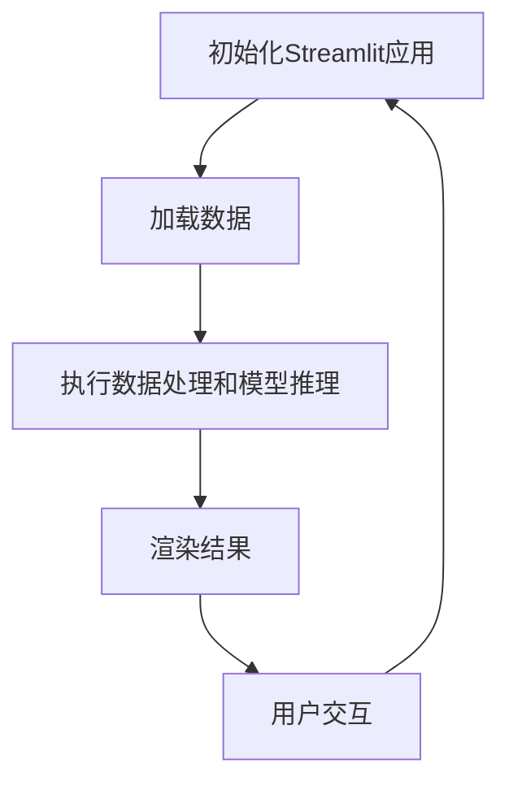

                 

## Streamlit：快速构建AI Web应用

### 1. 背景介绍

在当今数字化时代，人工智能（AI）已经成为推动企业创新和发展的关键力量。随着AI技术的日益普及，越来越多的企业开始将AI应用集成到他们的业务流程中。然而，构建一个功能强大且易于使用的AI Web应用并非易事，它需要专业的技术团队、复杂的开发流程以及大量的时间投入。

Streamlit是一款新兴的AI Web应用开发框架，它旨在简化这一过程，让开发者能够快速构建出美观、功能丰富的Web应用。Streamlit的出现填补了数据科学和Web开发之间的鸿沟，使得非Web开发背景的数据科学家也能够轻松创建高质量的Web应用。

本文将详细探讨Streamlit的核心概念、使用方法、项目实践，并探讨其在实际应用中的优势和挑战。通过本文，读者将了解到如何利用Streamlit将AI模型部署到Web端，从而实现高效的AI应用开发。

### 2. 核心概念与联系

#### Streamlit的核心概念

Streamlit的核心概念可以总结为以下几点：

1. **实时互动**：Streamlit能够实时显示数据科学代码的输出结果，如图表、统计数据等。
2. **简单易用**：Streamlit的代码非常简洁，通常只需要几行代码就能实现一个完整的Web应用。
3. **全栈开发**：Streamlit支持从后端数据处理到前端交互的一体化开发流程。
4. **快速部署**：Streamlit应用可以直接部署到本地或云端，无需复杂的配置。

#### Streamlit与相关技术的联系

Streamlit与其他技术的联系主要体现在以下几个方面：

1. **Python**：Streamlit是基于Python开发的，因此与Python的生态有着天然的融合。
2. **机器学习库**：如Scikit-learn、TensorFlow、PyTorch等，这些库可以与Streamlit无缝集成。
3. **Web框架**：Streamlit可以与Flask、Django等主流Web框架结合使用，以扩展其功能。
4. **前端框架**：Streamlit本身内置了一些基本的交互组件，但也可以与React、Vue等前端框架结合。

#### Mermaid 流程图

为了更好地理解Streamlit的工作流程，下面是一个简化的Mermaid流程图：



### 3. 核心算法原理 & 具体操作步骤

#### 核心算法原理

Streamlit的核心算法原理是即时渲染和数据绑定。当用户与Streamlit应用交互时，它会实时更新视图，确保应用始终保持最新的状态。

具体操作步骤如下：

1. **初始化Streamlit应用**：使用`streamlit.run()`函数启动应用。
2. **加载数据**：使用Python的内置库或外部数据源加载数据。
3. **执行数据处理和模型推理**：根据数据执行相应的数据处理和模型推理操作。
4. **渲染结果**：将处理结果以图表、文本等形式展示在Web界面上。
5. **用户交互**：用户可以与应用进行互动，例如选择不同的参数、查看更多的信息等。
6. **更新视图**：Streamlit会根据用户的交互行为实时更新视图。

#### 具体操作步骤示例

下面是一个简单的Streamlit应用示例，演示了如何加载数据、执行数据处理并展示结果：

```python
import streamlit as st
import pandas as pd
import matplotlib.pyplot as plt

# 加载数据
data = pd.read_csv('data.csv')

# 数据预处理
data['Age'] = data['Age'].astype(int)
data['Salary'] = data['Salary'].astype(float)

# 绘制图表
plt.scatter(data['Age'], data['Salary'])
plt.xlabel('Age')
plt.ylabel('Salary')
plt.title('Salary vs Age')
st.pyplot(plt)
```

在这个示例中，我们首先导入了Streamlit、Pandas和Matplotlib库。然后，我们使用Pandas加载一个CSV文件作为数据源。接下来，我们执行了一些基本的数据预处理操作，例如将年龄和薪资转换为适当的类型。最后，我们使用Matplotlib绘制了一个散点图，并将其作为图像渲染到Web界面上。

### 4. 数学模型和公式 & 详细讲解 & 举例说明

#### 数学模型和公式

Streamlit的核心在于其数据处理和模型推理功能。为了更好地理解这一点，我们来看一个简单的线性回归模型：

$$
y = \beta_0 + \beta_1 \cdot x + \epsilon
$$

其中，\( y \) 是目标变量，\( x \) 是输入变量，\( \beta_0 \) 和 \( \beta_1 \) 是模型的参数，\( \epsilon \) 是误差项。

#### 详细讲解

线性回归模型是一种基本的统计模型，用于预测一个连续值目标变量。在Streamlit中，我们可以使用Scikit-learn库来实现这个模型：

```python
from sklearn.linear_model import LinearRegression

# 准备数据
X = data[['Age']]
y = data['Salary']

# 创建线性回归模型
model = LinearRegression()

# 拟合模型
model.fit(X, y)

# 输出模型参数
print(f"Model parameters: {model.coef_}, {model.intercept_}")
```

在这个示例中，我们首先导入了Scikit-learn的线性回归模块。然后，我们准备了一些输入数据（年龄）和目标数据（薪资）。接下来，我们创建了一个线性回归模型，并使用`fit()`方法将其拟合到数据上。最后，我们输出了模型的参数，包括斜率 \( \beta_1 \) 和截距 \( \beta_0 \)。

#### 举例说明

为了更直观地理解这个模型，我们可以绘制一个散点图，并在图上添加模型预测的直线：

```python
# 绘制散点图和拟合直线
plt.scatter(X['Age'], y, label='Actual')
plt.plot(X['Age'], model.predict(X), color='red', label='Predicted')
plt.xlabel('Age')
plt.ylabel('Salary')
plt.title('Salary Prediction')
plt.legend()
st.pyplot(plt)
```

在这个示例中，我们首先绘制了一个包含实际数据和模型预测的散点图。然后，我们添加了一条红色直线，表示模型的预测结果。通过这个图表，我们可以直观地看到模型的预测效果。

### 5. 项目实践：代码实例和详细解释说明

#### 5.1 开发环境搭建

要开始使用Streamlit，首先需要搭建一个适合的开发环境。以下是搭建开发环境的步骤：

1. 安装Python（推荐Python 3.7或更高版本）。
2. 使用pip安装Streamlit和其他依赖库，如Pandas、NumPy和Matplotlib：

```bash
pip install streamlit pandas numpy matplotlib
```

3. 创建一个新的Python虚拟环境，以避免依赖冲突。

```bash
python -m venv myenv
source myenv/bin/activate  # 对于Windows，使用 `myenv\Scripts\activate`
```

4. 验证Streamlit安装：

```bash
streamlit --help
```

如果安装成功，你将看到Streamlit的帮助信息。

#### 5.2 源代码详细实现

以下是一个使用Streamlit构建的简单线性回归Web应用：

```python
import streamlit as st
import pandas as pd
import numpy as np
import matplotlib.pyplot as plt

# 加载数据
data = pd.read_csv('data.csv')

# 准备输入数据
X = data[['Age']]
y = data['Salary']

# 创建线性回归模型
model = LinearRegression()

# 拟合模型
model.fit(X, y)

# 输出模型参数
st.write("Model parameters:", model.coef_, model.intercept_)

# 创建输入表
st.write("Input Data:")
st.write(X)

# 创建输出表
st.write("Predicted Salary:")
predicted_salary = model.predict(X)
st.write(predicted_salary)

# 绘制散点图和拟合直线
plt.scatter(X['Age'], y, label='Actual')
plt.plot(X['Age'], predicted_salary, color='red', label='Predicted')
plt.xlabel('Age')
plt.ylabel('Salary')
plt.title('Salary Prediction')
plt.legend()
st.pyplot(plt)

# 用户输入
user_age = st.number_input('Enter your age:', min_value=18, max_value=70)

# 预测用户薪资
predicted_salary = model.predict([[user_age]])
st.write("Predicted Salary for age", user_age, ":", predicted_salary)
```

在这个代码中，我们首先加载了CSV数据文件，然后使用Scikit-learn创建了一个线性回归模型。接下来，我们使用Streamlit的各种函数来创建输入表、输出表和图表。最后，我们允许用户输入他们的年龄，并根据模型预测他们的薪资。

#### 5.3 代码解读与分析

这个代码实例展示了如何使用Streamlit创建一个简单的Web应用来预测薪资。以下是代码的主要组成部分：

1. **加载数据**：我们使用Pandas的`read_csv()`函数从CSV文件加载数据。
2. **准备输入数据**：我们将年龄和薪资作为输入数据，并将其存储在Pandas的DataFrame中。
3. **创建线性回归模型**：我们使用Scikit-learn的`LinearRegression()`函数创建一个线性回归模型。
4. **拟合模型**：我们使用`fit()`方法将模型拟合到输入数据上。
5. **输出模型参数**：我们使用`st.write()`函数将模型参数显示在Web界面上。
6. **创建输入表**：我们使用`st.write()`函数创建一个显示输入数据的表格。
7. **创建输出表**：我们使用`st.write()`函数创建一个显示预测薪资的表格。
8. **绘制散点图和拟合直线**：我们使用Matplotlib的函数绘制散点图和拟合直线，并使用`st.pyplot()`函数将图表显示在Web界面上。
9. **用户输入**：我们使用`st.number_input()`函数创建一个允许用户输入年龄的输入表单。
10. **预测用户薪资**：我们使用`predict()`方法根据用户输入的年龄预测薪资，并使用`st.write()`函数将预测结果显示在Web界面上。

通过这个代码实例，我们可以看到Streamlit的简单性和灵活性，这使得构建AI Web应用变得轻松而直观。

#### 5.4 运行结果展示

要运行这个Streamlit应用，我们只需在命令行中执行以下命令：

```bash
streamlit run app.py
```

其中`app.py`是我们编写的Python脚本文件。运行成功后，我们将在浏览器中看到一个Web应用，其中包含输入表单、输出表和图表。用户可以输入他们的年龄，然后查看预测的薪资。

### 6. 实际应用场景

Streamlit在AI Web应用开发中具有广泛的应用场景。以下是一些典型的实际应用场景：

1. **数据可视化**：Streamlit可以帮助开发者快速构建数据可视化应用，用于展示数据报告、数据分析结果等。
2. **机器学习模型部署**：开发者可以将机器学习模型部署到Streamlit上，以便用户可以通过Web界面进行交互和预测。
3. **教育工具**：Streamlit可以用于创建互动式的教育工具，如在线课程、模拟实验等。
4. **客户互动**：企业可以使用Streamlit构建客户互动平台，如产品推荐系统、用户反馈分析等。
5. **内部报告**：公司内部可以使用Streamlit构建高效的数据报告和业务分析工具，以帮助决策者快速获取关键信息。

#### 应用案例

1. **医疗数据分析平台**：一家医疗公司使用Streamlit构建了一个数据分析平台，用于处理大量的医疗数据，并为医生提供实时数据报告和诊断建议。
2. **客户推荐系统**：一家电商平台利用Streamlit搭建了一个客户推荐系统，根据用户的行为数据和喜好，为用户提供个性化的产品推荐。
3. **在线教育平台**：一家在线教育公司使用Streamlit创建了一个互动式的在线课程平台，学生可以通过Web界面参与课程互动和实验操作。

### 7. 工具和资源推荐

#### 7.1 学习资源推荐

1. **书籍**：
   - 《Streamlit实战指南》：详细介绍了Streamlit的使用方法和最佳实践。
   - 《Python Web开发》：涵盖了Python在Web开发中的多种应用，包括Streamlit。

2. **在线课程**：
   - Coursera上的“Building Data Science Projects in Python”课程：提供了丰富的Streamlit相关课程内容。
   - Udemy上的“Streamlit for Data Science and Machine Learning”课程：从基础到高级的Streamlit教程。

3. **博客和网站**：
   - Streamlit官方文档：提供了详细的API文档和教程。
   - Real Python：提供了多篇关于Streamlit的教程和案例研究。

#### 7.2 开发工具框架推荐

1. **Streamlit扩展库**：
   - `streamlit-chatbot`: 用于在Streamlit应用中集成聊天机器人。
   - `streamlit-dashboards`: 用于创建交互式仪表板。

2. **前端框架**：
   - React：与Streamlit结合，可以创建更复杂的前端界面。
   - Vue.js：提供了一种轻量级的前端解决方案，可以与Streamlit无缝集成。

3. **后端框架**：
   - Flask：用于构建后端服务，可以与Streamlit结合使用。
   - Django：提供了一套完整的Web开发框架，可以简化开发流程。

#### 7.3 相关论文著作推荐

1. **论文**：
   - "Streamlit: The End-to-End Web Application Framework for Data Science"：介绍了Streamlit的设计理念和应用场景。
   - "Building Data Products with Python"：讨论了如何在Python中构建数据科学项目，包括Streamlit的使用。

2. **著作**：
   - 《数据科学实战》：详细介绍了数据科学的各个领域，包括Streamlit在数据可视化中的应用。
   - 《Python Web开发实战》：介绍了Python在Web开发中的应用，包括Streamlit的使用。

### 8. 总结：未来发展趋势与挑战

Streamlit作为一个新兴的AI Web应用开发框架，展现了极大的潜力。未来，Streamlit的发展趋势包括以下几个方面：

1. **功能扩展**：随着AI技术的发展，Streamlit可能会集成更多先进的功能，如增强的机器学习库集成、更丰富的交互组件等。
2. **社区发展**：Streamlit的社区正在迅速壮大，未来将会有更多的开发者贡献资源和经验，推动框架的进一步完善。
3. **商业化应用**：企业可能会更加重视Streamlit的应用，用于构建内部数据和业务分析工具。

然而，Streamlit也面临着一些挑战：

1. **性能优化**：当前Streamlit的性能在某些场景下仍有待提高，特别是在处理大规模数据时。
2. **安全性**：随着Web应用的复杂性增加，如何确保Streamlit应用的安全性成为一个重要问题。
3. **文档与支持**：尽管Streamlit的文档和社区支持正在不断改善，但仍然存在一些不完善之处，需要进一步优化。

总的来说，Streamlit在AI Web应用开发中具有广阔的应用前景，但也需要不断地优化和完善，以应对未来的挑战。

### 9. 附录：常见问题与解答

**Q1**: 如何在Streamlit应用中添加自定义CSS样式？

**A1**: 在Streamlit应用中，您可以在`__init__.py`文件中定义全局的CSS样式。例如：

```python
import streamlit as st

def main():
    st.markdown("""
        <style>
        .big-font {
            font-size:18px !important;
            font-weight:bold !important;
        }
        </style>
    """, unsafe_allow_html=True)
    
    # 其余代码

if __name__ == "__main__":
    main()
```

在这个示例中，我们定义了一个名为`big-font`的CSS样式，并将其应用到Streamlit应用的文本中。

**Q2**: Streamlit应用如何与外部数据库交互？

**A2**: Streamlit应用通常使用Python的数据库库（如SQLite、MySQL、PostgreSQL等）与外部数据库交互。您可以在Python代码中直接使用这些库来执行数据库操作。例如，以下代码展示了如何使用SQLite：

```python
import sqlite3
import pandas as pd

# 连接数据库
conn = sqlite3.connect('database.db')

# 查询数据
data = pd.read_sql_query("SELECT * FROM table_name;", conn)

# 关闭数据库连接
conn.close()
```

在这个示例中，我们首先导入所需的库，然后连接到SQLite数据库，执行一个查询操作，并将结果存储在Pandas的DataFrame中。

**Q3**: Streamlit应用可以支持多用户交互吗？

**A3**: Streamlit默认情况下是单用户交互的。要实现多用户交互，您可以使用Web服务器扩展如`streamlit-chatbot`，或者使用WebSocket等技术。以下是一个使用`streamlit-chatbot`的简单示例：

```python
import streamlit as st
from streamlit_chatbot import bridge_to_server, set_bridging_config

def main():
    st.title("Chatbot Example")
    
    # Set up the server
    set_bridging_config(server_url="http://your_server_url:port", auto_connect=True)

    # Start the chatbot
    bridge_to_server()

if __name__ == "__main__":
    main()
```

在这个示例中，我们首先设置了WebSocket服务器，然后使用`bridge_to_server()`函数启动聊天机器人。

### 10. 扩展阅读 & 参考资料

1. **官方文档**：Streamlit的官方文档提供了详细的API参考和使用教程，是学习Streamlit的首选资源。
2. **GitHub仓库**：Streamlit的GitHub仓库包含了源代码、示例项目和贡献指南，是了解Streamlit实现细节和参与社区的好地方。
3. **Stack Overflow**：在Stack Overflow上搜索Streamlit相关的问题和解决方案，可以找到许多实用的技巧和经验分享。
4. **Reddit社区**：Reddit上的Streamlit社区是一个活跃的讨论区，开发者可以在这里分享经验和讨论问题。
5. **Real Python教程**：Real Python提供了多篇关于Streamlit的教程和案例研究，适合初学者和实践者。

