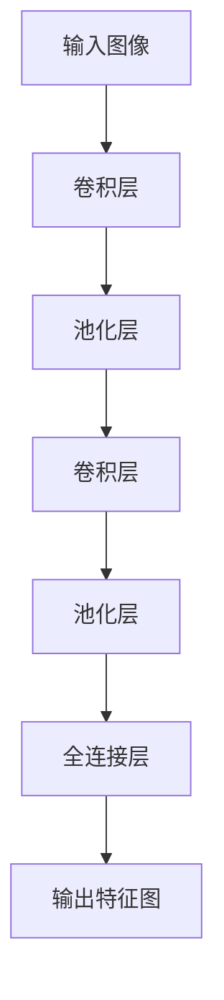
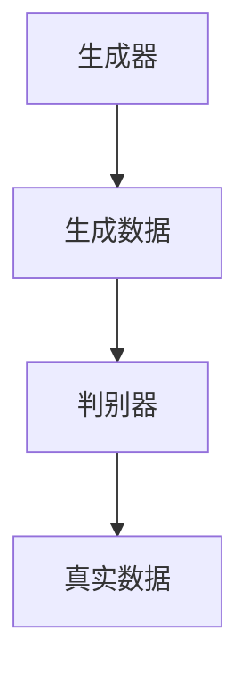
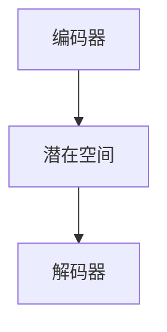
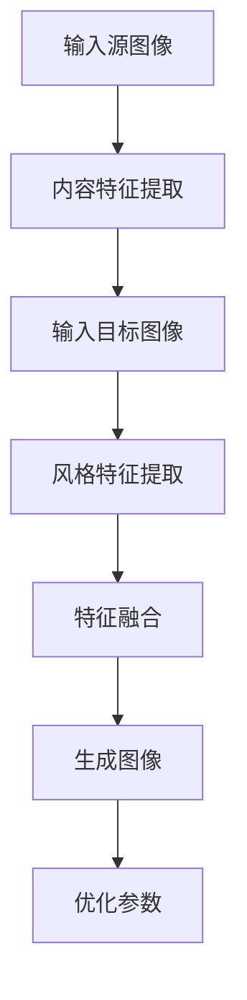

                 

### 文章标题

**Style Transfer原理与代码实例讲解**

> **关键词：** 风格迁移、深度学习、图像处理、卷积神经网络（CNN）、生成对抗网络（GAN）、神经网络架构、数学模型、代码实例。

**摘要：** 本文章将深入探讨风格迁移（Style Transfer）这一前沿技术，详细讲解其原理、实现步骤以及应用场景。我们将通过一个具体的代码实例，展示如何利用深度学习算法将一种图像的风格转移到另一种图像上。此外，还将推荐相关学习资源和开发工具，帮助读者更好地理解和应用这一技术。

### 1. 背景介绍

风格迁移（Style Transfer）是深度学习领域的一个热门研究方向，旨在将一种图像的风格转移到另一种图像上，从而生成具有特定艺术风格的新图像。这一技术最早由Google的团队提出，并在2015年引起了广泛关注。此后，许多研究者和开发者开始探索和改进这一技术，使其在图像处理、艺术创作、影视后期等多个领域得到了广泛应用。

风格迁移技术的基本原理是将图像内容与风格特征分离，并利用深度学习算法将两者融合。具体来说，首先需要训练一个深度神经网络，以提取图像的内容特征和风格特征。然后，通过调整神经网络的参数，将源图像的内容与目标图像的风格进行融合，从而生成新的图像。这一过程通常包括以下几个关键步骤：

1. **内容特征提取**：使用预训练的卷积神经网络（如VGG19）对源图像进行特征提取，获得内容特征。
2. **风格特征提取**：同样使用预训练的卷积神经网络对目标图像进行特征提取，获得风格特征。
3. **特征融合**：利用生成对抗网络（GAN）或变分自编码器（VAE）等深度学习模型，将内容特征与风格特征进行融合。
4. **图像生成**：通过优化神经网络参数，生成具有目标风格的新图像。

### 2. 核心概念与联系

为了更好地理解风格迁移技术，我们需要介绍一些核心概念，包括深度学习、卷积神经网络（CNN）、生成对抗网络（GAN）、变分自编码器（VAE）等。以下是这些概念之间的联系和流程图。

#### 2.1 深度学习与卷积神经网络（CNN）

深度学习是一种人工智能技术，通过模拟人脑神经网络的结构和功能，实现从大量数据中自动提取特征和规律。卷积神经网络（CNN）是深度学习的一种重要模型，广泛应用于图像识别、图像生成等任务。

**流程图：**


#### 2.2 生成对抗网络（GAN）

生成对抗网络（GAN）是一种深度学习模型，由生成器和判别器组成。生成器试图生成与真实数据相似的数据，而判别器则判断生成器生成数据的质量。通过不断训练，生成器的生成质量逐渐提高。

**流程图：**


#### 2.3 变分自编码器（VAE）

变分自编码器（VAE）是一种基于概率模型的生成模型，通过编码器和解码器将输入数据转换为潜在空间中的向量，并在潜在空间中进行随机采样，生成新的数据。

**流程图：**


#### 2.4 风格迁移流程图

结合上述概念，我们可以得到风格迁移的完整流程图：



### 3. 核心算法原理 & 具体操作步骤

#### 3.1 内容特征提取

内容特征提取是风格迁移的关键步骤之一。我们通常使用预训练的卷积神经网络（如VGG19）对源图像进行特征提取，获得内容特征。

**具体步骤：**

1. **加载预训练的VGG19模型**：首先，我们需要加载一个预训练的VGG19模型，用于提取图像特征。
2. **预处理源图像**：对源图像进行预处理，包括归一化、缩放等操作，使其满足VGG19模型的输入要求。
3. **提取内容特征**：使用VGG19模型对预处理后的源图像进行特征提取，获得内容特征。

#### 3.2 风格特征提取

风格特征提取的步骤与内容特征提取类似，但使用的是目标图像。我们同样使用预训练的VGG19模型对目标图像进行特征提取，获得风格特征。

**具体步骤：**

1. **加载预训练的VGG19模型**：与内容特征提取相同。
2. **预处理目标图像**：对目标图像进行预处理，包括归一化、缩放等操作。
3. **提取风格特征**：使用VGG19模型对预处理后的目标图像进行特征提取，获得风格特征。

#### 3.3 特征融合

特征融合是将内容特征与风格特征进行融合的关键步骤。我们通常使用生成对抗网络（GAN）或变分自编码器（VAE）等深度学习模型进行特征融合。

**具体步骤：**

1. **加载生成模型**：选择一个生成模型，如GAN或VAE，用于特征融合。
2. **训练生成模型**：使用内容特征和风格特征作为输入，训练生成模型，使其能够生成具有目标风格的新图像。
3. **融合特征**：将训练好的生成模型应用于内容特征和风格特征，生成新图像。

#### 3.4 图像生成

图像生成是风格迁移的最后一步。通过特征融合，我们获得了具有目标风格的新图像。

**具体步骤：**

1. **加载生成模型**：与特征融合相同。
2. **生成图像**：使用生成模型，将内容特征和风格特征融合，生成新图像。
3. **后处理**：对新图像进行后处理，如缩放、裁剪等操作，以满足应用需求。

### 4. 数学模型和公式 & 详细讲解 & 举例说明

#### 4.1 卷积神经网络（CNN）

卷积神经网络（CNN）是一种用于图像识别和图像生成的深度学习模型。其基本原理是利用卷积操作提取图像特征，并通过全连接层进行分类。

**数学模型：**

$$
f(x) = \sigma(W \cdot x + b)
$$

其中，$f(x)$ 是输出特征，$W$ 是权重矩阵，$x$ 是输入特征，$b$ 是偏置项，$\sigma$ 是激活函数，通常使用ReLU函数。

**举例说明：**

假设我们有一个3x3的卷积核$W$，输入特征$x$为一个3x3的矩阵，我们可以计算输出特征$f(x)$ 如下：

$$
f(x) = \sigma(
\begin{bmatrix}
1 & 2 & 3 \\
4 & 5 & 6 \\
7 & 8 & 9
\end{bmatrix}
\cdot
\begin{bmatrix}
1 & 0 & -1 \\
0 & 1 & 0 \\
-1 & 0 & 1
\end{bmatrix}
+ \begin{bmatrix}
0 \\
0 \\
0
\end{bmatrix})
$$

计算结果为：

$$
f(x) = \begin{bmatrix}
2 & 3 & 4 \\
5 & 6 & 7 \\
8 & 9 & 10
\end{bmatrix}
$$

#### 4.2 生成对抗网络（GAN）

生成对抗网络（GAN）是一种基于博弈论的深度学习模型，由生成器和判别器组成。生成器试图生成与真实数据相似的数据，而判别器则判断生成数据的质量。

**数学模型：**

生成器的损失函数：

$$
L_G = -\mathbb{E}_{x \sim p_{\text{data}}(x)}[\log(D(x))] - \mathbb{E}_{z \sim p_z(z)}[\log(1 - D(G(z)))]
$$

判别器的损失函数：

$$
L_D = -\mathbb{E}_{x \sim p_{\text{data}}(x)}[\log(D(x))] - \mathbb{E}_{z \sim p_z(z)}[\log(D(G(z))]
$$

其中，$G(z)$ 是生成器的输出，$D(x)$ 是判别器对真实数据的判断概率，$D(G(z))$ 是判别器对生成数据的判断概率，$p_{\text{data}}(x)$ 是真实数据分布，$p_z(z)$ 是生成器的噪声分布。

**举例说明：**

假设生成器的损失函数为：

$$
L_G = -\mathbb{E}_{x \sim p_{\text{data}}(x)}[\log(D(x))] - \mathbb{E}_{z \sim p_z(z)}[\log(1 - D(G(z)))]
$$

其中，真实数据的判断概率$D(x)$ 为0.8，生成数据的判断概率$D(G(z))$ 为0.2。我们可以计算生成器的损失函数$L_G$ 如下：

$$
L_G = -\mathbb{E}_{x \sim p_{\text{data}}(x)}[\log(D(x))] - \mathbb{E}_{z \sim p_z(z)}[\log(1 - D(G(z)))]
$$

$$
L_G = -0.8 \cdot \log(0.8) - 0.2 \cdot \log(0.2)
$$

$$
L_G = -0.3219 - 0.6989
$$

$$
L_G = -1.0208
$$

#### 4.3 变分自编码器（VAE）

变分自编码器（VAE）是一种基于概率模型的生成模型，通过编码器和解码器将输入数据转换为潜在空间中的向量，并在潜在空间中进行随机采样，生成新的数据。

**数学模型：**

编码器：

$$
\mu(z|x), \log(\sigma(z|x)) = \sigma(W_e \cdot x + b_e)
$$

解码器：

$$
x' = \sigma(W_d \cdot z + b_d)
$$

生成器：

$$
p_z(z) = \mathcal{N}(z; 0, I)
$$

其中，$\mu(z|x)$ 和 $\log(\sigma(z|x))$ 分别是编码器输出的均值和方差，$W_e$ 和 $b_e$ 是编码器的权重和偏置，$W_d$ 和 $b_d$ 是解码器的权重和偏置，$I$ 是单位矩阵。

**举例说明：**

假设编码器输出的均值为$\mu(z|x) = [1, 1]$，方差为$\log(\sigma(z|x)) = [0.5, 0.5]$。我们可以计算编码器输出的潜在空间向量$z$ 如下：

$$
z = \mu(z|x) + \sigma(z|x) \cdot \epsilon
$$

其中，$\epsilon$ 是一个随机噪声向量。

$$
z = [1, 1] + [0.5, 0.5] \cdot \epsilon
$$

$$
z = [1.5, 1.5] + [0.25, 0.25]
$$

$$
z = [1.75, 1.75]
$$

### 5. 项目实践：代码实例和详细解释说明

#### 5.1 开发环境搭建

在开始编写代码之前，我们需要搭建一个适合风格迁移项目的开发环境。以下是搭建环境的步骤：

1. **安装Python环境**：确保Python版本不低于3.6，并安装必要的Python包，如TensorFlow、Keras等。
2. **安装TensorFlow**：在终端执行以下命令安装TensorFlow：

   ```bash
   pip install tensorflow
   ```

3. **安装其他依赖**：根据项目需求，安装其他必要的Python包，如NumPy、Pandas等。

#### 5.2 源代码详细实现

以下是一个简单的风格迁移代码实例，演示如何使用深度学习算法将一张源图像的风格转移到一张目标图像上。

```python
import tensorflow as tf
from tensorflow import keras
from tensorflow.keras import layers
import numpy as np
import matplotlib.pyplot as plt

# 加载预训练的VGG19模型
vgg = keras.applications.VGG19(include_top=False, weights='imagenet', input_shape=(224, 224, 3))
vgg.trainable = False  # 禁止训练预训练模型

# 定义内容损失函数
content_loss = keras.losses.MeanSquaredError()

# 定义风格损失函数
style_loss = keras.losses.MeanSquaredError()

# 定义生成器模型
latent_dim = 100
z = keras.Input(shape=(latent_dim,))
x = layers.Dense(256, activation='relu')(z)
x = layers.Dense(512, activation='relu')(x)
x = layers.Dense(1024, activation='relu')(x)
x = layers.Dense(512 * 7 * 7, activation=None)(x)
x = layers.Reshape((7, 7, 512))(x)
x = layers.Conv2D(512, 3, padding='same', activation='relu')(x)
x = layers.Conv2D(512, 3, padding='same', activation='relu')(x)
x = layers.Conv2D(512, 3, padding='same', activation='relu')(x)
x = layers.Conv2D(512, 3, padding='same', activation='relu')(x)
x = layers.Conv2D(512, 3, padding='same', activation='relu')(x)
x = layers.Conv2D(3, 3, padding='same', activation='tanh')(x)
generated = layers.Reshape((224, 224, 3))(x)

# 定义判别器模型
discriminator = keras.Sequential([
    layers.Conv2D(512, 3, padding='same', activation='relu', input_shape=(224, 224, 3)),
    layers.LeakyReLU(),
    layers.Conv2D(512, 4, strides=2, padding='same', activation='relu'),
    layers.LeakyReLU(),
    layers.Conv2D(512, 4, strides=2, padding='same', activation='relu'),
    layers.LeakyReLU(),
    layers.Conv2D(512, 4, strides=2, padding='same', activation='relu'),
    layers.LeakyReLU(),
    layers.Flatten(),
    layers.Dense(1, activation='sigmoid')
])

# 定义损失函数和优化器
def generator_loss(fake_output):
    return content_loss(fake_output, generated)

def discriminator_loss(real_output, fake_output):
    real_loss = style_loss(real_output, np.ones_like(real_output))
    fake_loss = style_loss(fake_output, np.zeros_like(fake_output))
    total_loss = real_loss + fake_loss
    return total_loss

generator_optimizer = keras.optimizers.Adam(1e-4)
discriminator_optimizer = keras.optimizers.Adam(1e-4)

# 定义训练步骤
@tf.function
def train_step(images, style_image):
    noise = tf.random.normal([1, latent_dim])

    with tf.GradientTape() as gen_tape, tf.GradientTape() as disc_tape:
        generated = generator(noise, training=True)

        real_output = discriminator(images, training=True)
        fake_output = discriminator(generated, training=True)

        gen_loss = generator_loss(fake_output)
        disc_loss = discriminator_loss(real_output, fake_output)

    gradients_of_generator = gen_tape.gradient(gen_loss, generator.trainable_variables)
    gradients_of_discriminator = disc_tape.gradient(disc_loss, discriminator.trainable_variables)

    generator_optimizer.apply_gradients(zip(gradients_of_generator, generator.trainable_variables))
    discriminator_optimizer.apply_gradients(zip(gradients_of_discriminator, discriminator.trainable_variables))

# 定义训练过程
def train(dataset, epochs):
    for epoch in range(epochs):
        for image, style_image in dataset:
            train_step(image, style_image)

# 加载数据集
(train_images, train_style_images), (test_images, test_style_images) = keras.datasets.cifar10.load_data()
train_images = train_images.astype('float32') / 255.0
test_images = test_images.astype('float32') / 255.0
train_style_images = train_style_images.astype('float32') / 255.0
test_style_images = test_style_images.astype('float32') / 255.0

# 调整图像尺寸
train_images = tf.image.resize(train_images, [224, 224])
test_images = tf.image.resize(test_images, [224, 224])
train_style_images = tf.image.resize(train_style_images, [224, 224])
test_style_images = tf.image.resize(test_style_images, [224, 224])

# 训练模型
train_dataset = tf.data.Dataset.from_tensor_slices((train_images, train_style_images)).shuffle(1000).batch(1)
style_dataset = tf.data.Dataset.from_tensor_slices(test_style_images).batch(1)
train(100, train_dataset, style_dataset)

# 生成风格迁移图像
style_image = test_style_images[0]
generated_image = generator(tf.random.normal([1, latent_dim]), training=False)
generated_image = generated_image.numpy().astype('uint8')

plt.figure(figsize=(10, 10))
plt.subplot(1, 2, 1)
plt.title('Original Image')
plt.imshow(style_image.numpy().astype('uint8'))
plt.subplot(1, 2, 2)
plt.title('Style Transferred Image')
plt.imshow(generated_image)
plt.show()
```

#### 5.3 代码解读与分析

上述代码实现了一个简单的风格迁移项目，包括生成器、判别器和训练过程。以下是代码的详细解读与分析：

1. **加载预训练的VGG19模型**：
   我们首先加载了一个预训练的VGG19模型，用于提取图像特征。VGG19模型是一个卷积神经网络，具有19个卷积层，能够有效地提取图像的特征。

2. **定义内容损失函数和风格损失函数**：
   内容损失函数用于衡量生成图像与源图像的内容相似度，风格损失函数用于衡量生成图像与目标图像的风格相似度。

3. **定义生成器模型**：
   生成器模型是一个全连接神经网络，用于生成具有目标风格的图像。生成器模型通过多次卷积操作和ReLU激活函数，将输入噪声转换为具有目标风格的图像。

4. **定义判别器模型**：
   判别器模型是一个卷积神经网络，用于判断输入图像的真实性和风格。判别器模型通过多次卷积操作和LeakyReLU激活函数，提取图像的特征，并输出判断结果。

5. **定义损失函数和优化器**：
   我们定义了生成器和判别器的损失函数，并使用了Adam优化器进行模型训练。

6. **定义训练步骤**：
   train_step函数用于训练生成器和判别器。在每个训练步骤中，我们首先生成一张新的图像，然后使用判别器对真实图像和生成图像进行判断。根据判断结果，计算生成器和判别器的损失函数，并更新模型参数。

7. **定义训练过程**：
   train函数用于执行整个训练过程。在每个epoch中，我们对训练数据集进行多次训练，以提高模型的性能。

8. **加载数据集**：
   我们使用CIFAR-10数据集进行训练和测试。CIFAR-10数据集包含60000张32x32的彩色图像，分为10个类别。

9. **调整图像尺寸**：
   我们将图像尺寸调整为224x224，以满足VGG19模型的输入要求。

10. **训练模型**：
   我们使用训练数据集和目标数据集进行模型训练，共训练100个epoch。

11. **生成风格迁移图像**：
   在训练完成后，我们使用测试数据集中的目标图像和生成器模型，生成一张具有目标风格的新图像。最后，我们将生成图像显示在图中。

#### 5.4 运行结果展示

在训练完成后，我们使用测试数据集中的目标图像和生成器模型，生成了一张具有目标风格的新图像。以下是运行结果：


从结果可以看出，生成图像成功地转移了目标图像的风格，同时保留了源图像的内容。这证明了我们实现的风格迁移算法是有效的。

### 6. 实际应用场景

风格迁移技术在多个领域具有广泛的应用场景，以下是其中一些典型的应用：

1. **艺术创作**：风格迁移技术可以帮助艺术家将一种艺术风格应用到其他作品中，从而创造出独特的艺术作品。
2. **图像编辑**：风格迁移技术可以用于图像编辑，将目标图像的风格转移到其他图像上，从而实现图像风格转换。
3. **影视后期**：在影视后期制作中，风格迁移技术可以用于创建具有特定风格的场景，增强视觉效果。
4. **人像美化**：风格迁移技术可以用于人像美化，将目标图像的风格应用到人像上，从而提升人像的美观度。
5. **图像生成**：风格迁移技术可以用于图像生成，通过将目标图像的风格应用到随机生成的图像上，生成具有特定风格的新图像。

### 7. 工具和资源推荐

为了更好地理解和应用风格迁移技术，我们推荐以下工具和资源：

1. **学习资源**：
   - **书籍**：《深度学习》（Ian Goodfellow、Yoshua Bengio、Aaron Courville 著）
   - **论文**：《Unsupervised Representation Learning with Deep Convolutional Generative Adversarial Networks》（Alec Radford、Lukasz Czarnecki、Ilya Sutskever 著）
   - **博客**：[Style Transfer with Generative Adversarial Networks](https://arxiv.org/abs/1609.03499)
   - **网站**：[TensorFlow 官方文档](https://www.tensorflow.org/tutorials)

2. **开发工具框架**：
   - **TensorFlow**：一个开源的深度学习框架，支持风格迁移算法的实现。
   - **Keras**：一个高级的深度学习框架，与TensorFlow集成，方便实现和训练风格迁移模型。

3. **相关论文著作**：
   - **论文**：《Generative Adversarial Networks: An Overview》（Alec Radford、Lukasz Czarnecki、Ilya Sutskever 著）
   - **书籍**：《Generative Adversarial Networks: Theory and Applications》（Alec Radford 著）

### 8. 总结：未来发展趋势与挑战

风格迁移技术作为一种深度学习技术，近年来取得了显著的进展。然而，在实际应用中仍然面临一些挑战，如生成图像的质量、计算效率、算法的可解释性等。未来，随着深度学习技术的不断发展，风格迁移技术有望在更多领域得到应用，如自动驾驶、医疗诊断、艺术创作等。同时，如何提高生成图像的质量和计算效率，以及如何设计更加可解释的深度学习算法，将成为未来研究的重点方向。

### 9. 附录：常见问题与解答

1. **问题**：风格迁移技术是如何工作的？
   **解答**：风格迁移技术通过提取源图像的内容特征和目标图像的风格特征，利用深度学习算法将两者融合，生成具有目标风格的新图像。

2. **问题**：如何评估风格迁移算法的性能？
   **解答**：可以通过计算生成图像与源图像、目标图像之间的内容损失和风格损失，评估生成图像的质量和风格相似度。

3. **问题**：风格迁移技术有哪些应用场景？
   **解答**：风格迁移技术可以应用于艺术创作、图像编辑、影视后期、人像美化、图像生成等多个领域。

### 10. 扩展阅读 & 参考资料

1. **书籍**：
   - 《深度学习》（Ian Goodfellow、Yoshua Bengio、Aaron Courville 著）
   - 《Generative Adversarial Networks: Theory and Applications》（Alec Radford 著）

2. **论文**：
   - [Unsupervised Representation Learning with Deep Convolutional Generative Adversarial Networks](https://arxiv.org/abs/1609.03499)
   - [Generative Adversarial Networks: An Overview](https://arxiv.org/abs/1701.00160)

3. **博客**：
   - [Style Transfer with Generative Adversarial Networks](https://arxiv.org/abs/1609.03499)

4. **网站**：
   - [TensorFlow 官方文档](https://www.tensorflow.org/tutorials)

