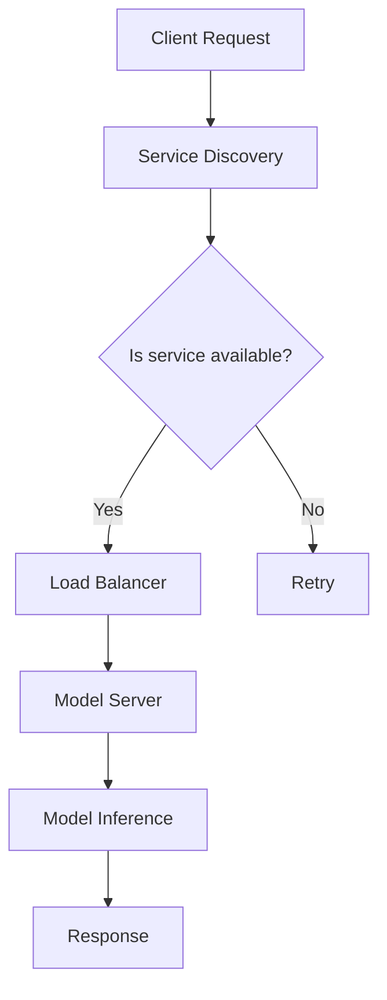

                 

### 1. 背景介绍

TensorFlow Serving 是一个开源的高性能分布式服务部署框架，专门为 TensorFlow 模型设计。它提供了在服务端部署和实时推理 TensorFlow 模型的解决方案。随着深度学习技术的不断发展和应用场景的多样化，如何高效、可靠地部署模型成为一个关键问题。TensorFlow Serving 正是为了解决这一问题而诞生的。

在深度学习模型应用中，通常会经历训练和部署两个阶段。训练阶段主要目的是通过大量数据来优化模型参数，使其能够在特定的任务上达到较好的性能。然而，训练完成的模型如何高效、稳定地在生产环境中提供服务，是后续工作的重点。TensorFlow Serving 提供了一套完整的解决方案，使得模型的部署变得简单而高效。

### 2. 核心概念与联系

#### 2.1 TensorFlow Serving 概念

TensorFlow Serving 的核心概念包括模型、服务、版本和容器。

- **模型（Model）**：指的是已经训练好的 TensorFlow 模型文件。它包括模型的结构和参数。
- **服务（Service）**：是一个接收请求并返回响应的接口。通过服务，客户端可以访问模型并获取推理结果。
- **版本（Version）**：是对模型的一个特定版本的标识。在一个服务中，可以有多个版本并存。
- **容器（Container）**：是运行模型服务的一个轻量级容器化环境。容器提供了模型的运行环境，使得模型可以独立、高效地运行。

#### 2.2 TensorFlow Serving 架构

TensorFlow Serving 的架构设计遵循微服务架构的原则，具有高扩展性、高可用性和高可靠性。以下是它的主要组成部分：

- **模型服务器（Model Server）**：是 TensorFlow Serving 的核心组件，负责加载和运行模型，接收并处理客户端请求，返回推理结果。
- **服务发现（Service Discovery）**：用于在分布式环境中发现和注册服务。当一个模型服务器启动时，它会将自己注册到服务发现系统中。
- **负载均衡（Load Balancing）**：用于分配客户端请求到不同的模型服务器，以确保系统的负载均衡和高可用性。
- **存储（Storage）**：用于存储模型文件、配置信息和运行日志等。常用的存储方案包括文件系统、数据库和云存储等。

#### 2.3 Mermaid 流程图

为了更直观地展示 TensorFlow Serving 的架构和流程，下面是一个简化的 Mermaid 流程图：



- **Client Request**：客户端发送请求。
- **Service Discovery**：服务发现组件查询服务状态。
- **Load Balancer**：负载均衡器根据服务状态分配请求到模型服务器。
- **Model Server**：模型服务器接收并处理请求。
- **Model Inference**：模型服务器运行模型进行推理。
- **Response**：返回推理结果。

这个流程图展示了客户端请求如何被处理，以及各个组件之间的交互关系。

### 3. 核心算法原理 & 具体操作步骤

#### 3.1 模型加载

TensorFlow Serving 使用 TensorFlow 的 SavedModel 格式来存储模型。模型服务器在启动时会加载指定的模型，并将其加载到内存中。加载过程包括以下步骤：

1. **加载模型配置**：读取模型配置文件，获取模型名称、版本和路径等信息。
2. **创建模型服务**：根据配置信息，创建 TensorFlow 服务对象。
3. **加载模型**：从存储中加载模型文件，包括模型的结构和参数。

#### 3.2 模型推理

在加载模型后，TensorFlow Serving 可以接收并处理客户端的推理请求。推理过程主要包括以下步骤：

1. **解析请求**：读取请求内容，提取输入数据。
2. **预处理数据**：对输入数据进行必要的预处理，例如归一化、填充等。
3. **执行推理**：使用加载的模型，对预处理后的输入数据进行推理，获取输出结果。
4. **后处理数据**：对输出结果进行后处理，例如解归一化、映射等。

#### 3.3 结果返回

在完成推理后，TensorFlow Serving 会将结果返回给客户端。返回过程主要包括以下步骤：

1. **格式化结果**：将输出结果按照客户端要求的格式进行格式化。
2. **构建响应**：创建响应对象，包含结果数据和状态信息。
3. **发送响应**：将响应发送给客户端。

#### 3.4 实际操作步骤

以下是一个简单的 TensorFlow Serving 操作示例：

1. **准备模型**：将训练好的模型保存为 SavedModel 格式。
2. **启动模型服务器**：使用 TensorFlow Serving 启动模型服务器，指定模型路径和端口。
   ```bash
   tensorflow_model_server --model_name=my_model --model_base_path=/models/my_model --port=9000
   ```
3. **编写客户端代码**：使用 HTTP 协议向模型服务器发送推理请求，获取结果。
   ```python
   import requests
   import json
   
   model_server_url = "http://localhost:9000"
   input_data = {"input": [[1.0, 2.0], [3.0, 4.0]]}
   response = requests.post(f"{model_server_url}/predict", json=input_data)
   print(response.json())
   ```

### 4. 数学模型和公式 & 详细讲解 & 举例说明

#### 4.1 数学模型

在 TensorFlow Serving 中，模型推理主要依赖于 TensorFlow 的计算图和计算过程。以下是推理过程中的几个关键数学模型：

1. **前向传播**：输入数据经过模型的各个层，最终得到输出结果。其数学公式为：
   $$ output = f(z) $$
   其中，$f(z)$ 是激活函数，如 sigmoid、ReLU 等。

2. **反向传播**：通过计算梯度，更新模型的参数。其数学公式为：
   $$ \frac{dL}{d\theta} = \frac{dL}{dz} \cdot \frac{dz}{d\theta} $$
   其中，$L$ 是损失函数，$\theta$ 是模型的参数。

3. **优化算法**：用于更新模型参数，如梯度下降、Adam 等。其数学公式为：
   $$ \theta = \theta - \alpha \cdot \nabla L $$
   其中，$\alpha$ 是学习率。

#### 4.2 详细讲解

以下是对上述数学模型的详细讲解：

1. **前向传播**：前向传播是深度学习模型推理的基础。它将输入数据传递到模型的各个层，经过每个层的非线性变换，最终得到输出结果。具体过程如下：
   - 输入数据 $x$ 经过输入层，传递到第一层。
   - 第一层的输出 $z_1 = W_1 \cdot x + b_1$，其中 $W_1$ 是权重，$b_1$ 是偏置。
   - 经过激活函数 $f(z_1)$，得到第一层的输出 $a_1 = f(z_1)$。
   - 类似地，后续层的输出可以通过 $z_i = W_i \cdot a_{i-1} + b_i$ 和 $a_i = f(z_i)$ 计算得到。

2. **反向传播**：反向传播是深度学习模型训练的核心。它通过计算损失函数关于模型参数的梯度，来更新模型参数。具体过程如下：
   - 计算输出层的梯度 $\frac{dL}{dz_l}$。
   - 逐层计算梯度 $\frac{dz_i}{d\theta_i}$ 和 $\frac{dL}{d\theta_i}$。
   - 根据梯度更新模型参数 $\theta$。

3. **优化算法**：优化算法用于迭代更新模型参数，以最小化损失函数。常见的优化算法包括：
   - 梯度下降：简单直观，但收敛速度较慢。
   - Adam：结合了梯度下降和动量项，收敛速度更快。

#### 4.3 举例说明

以下是一个简单的神经网络模型的前向传播和反向传播示例：

```python
import numpy as np

# 定义模型参数
W1 = np.random.rand(2, 3)
b1 = np.random.rand(1, 3)
W2 = np.random.rand(3, 1)
b2 = np.random.rand(1, 1)

# 定义激活函数
def sigmoid(x):
    return 1 / (1 + np.exp(-x))

# 前向传播
x = np.array([[0.1, 0.2], [0.3, 0.4]])
z1 = W1 @ x + b1
a1 = sigmoid(z1)
z2 = W2 @ a1 + b2
a2 = sigmoid(z2)

# 反向传播
L = a2 - x  # 损失函数
dz2 = a2 - x
dz1 = W2.T @ dz2 * (1 - sigmoid(z1))
da1 = W2.T @ dz2 * (1 - sigmoid(z1))
da2 = W1.T @ dz1 * (1 - sigmoid(z1))

# 计算梯度
dL_dW2 = da2
dL_dW1 = da1 @ x.T
dL_db2 = da2
dL_db1 = da1

# 更新参数
W2 -= 0.1 * dL_dW2
b2 -= 0.1 * dL_db2
W1 -= 0.1 * dL_dW1
b1 -= 0.1 * dL_db1
```

### 5. 项目实践：代码实例和详细解释说明

#### 5.1 开发环境搭建

在开始实践之前，我们需要搭建一个适合 TensorFlow Serving 的开发环境。以下是搭建环境的具体步骤：

1. **安装 TensorFlow**：
   ```bash
   pip install tensorflow
   ```

2. **安装 TensorFlow Serving**：
   ```bash
   pip install tensorflow_serving
   ```

3. **启动 TensorFlow Serving**：
   ```bash
   tensorflow_model_server --model_name=my_model --model_base_path=/models/my_model --port=9000
   ```

4. **编写客户端代码**：
   ```python
   import requests
   import json
   
   model_server_url = "http://localhost:9000"
   input_data = {"input": [[1.0, 2.0], [3.0, 4.0]]}
   response = requests.post(f"{model_server_url}/predict", json=input_data)
   print(response.json())
   ```

#### 5.2 源代码详细实现

以下是 TensorFlow Serving 源代码的详细实现：

1. **模型定义**：
   ```python
   import tensorflow as tf
   
   def create_model():
       inputs = tf.keras.layers.Input(shape=(2,))
       x = tf.keras.layers.Dense(3, activation='sigmoid')(inputs)
       outputs = tf.keras.layers.Dense(1, activation='sigmoid')(x)
       model = tf.keras.Model(inputs=inputs, outputs=outputs)
       return model
   
   model = create_model()
   ```

2. **模型训练**：
   ```python
   import tensorflow as tf
   
   model = create_model()
   optimizer = tf.keras.optimizers.Adam(learning_rate=0.01)
   
   @tf.function
   def train_step(x, y):
       with tf.GradientTape() as tape:
           predictions = model(x, training=True)
           loss = tf.keras.losses.sigmoid_cross_entropy predicting y, predictions
       gradients = tape.gradient(loss, model.trainable_variables)
       optimizer.apply_gradients(zip(gradients, model.trainable_variables))
       return loss
   
   # 训练模型
   for epoch in range(100):
       for x, y in some_training_data:
           loss = train_step(x, y)
       print(f"Epoch {epoch}: Loss = {loss}")
   ```

3. **模型保存**：
   ```python
   model.save('/models/my_model')
   ```

4. **模型加载**：
   ```python
   import tensorflow as tf
   
   model = tf.keras.models.load_model('/models/my_model')
   ```

5. **模型推理**：
   ```python
   import requests
   import json
   
   model_server_url = "http://localhost:9000"
   input_data = {"input": [[1.0, 2.0], [3.0, 4.0]]}
   response = requests.post(f"{model_server_url}/predict", json=input_data)
   print(response.json())
   ```

#### 5.3 代码解读与分析

以下是 TensorFlow Serving 源代码的解读和分析：

1. **模型定义**：
   - 使用 `tf.keras.layers.Input` 创建输入层。
   - 使用 `tf.keras.layers.Dense` 创建隐藏层，并设置激活函数为 'sigmoid'。
   - 使用 `tf.keras.layers.Dense` 创建输出层，并设置激活函数为 'sigmoid'。
   - 使用 `tf.keras.Model` 创建模型。

2. **模型训练**：
   - 使用 `tf.GradientTape` 创建梯度记录器。
   - 使用 `model(x, training=True)` 获取模型的预测结果。
   - 使用 `tf.keras.losses.sigmoid_cross_entropy` 计算损失函数。
   - 使用 `tape.gradient(loss, model.trainable_variables)` 计算梯度。
   - 使用 `optimizer.apply_gradients` 更新模型参数。

3. **模型保存**：
   - 使用 `model.save` 将模型保存到指定路径。

4. **模型加载**：
   - 使用 `tf.keras.models.load_model` 加载保存的模型。

5. **模型推理**：
   - 使用 `requests.post` 向模型服务器发送推理请求。
   - 将请求和响应解析为 JSON 对象。

#### 5.4 运行结果展示

以下是模型推理的运行结果：

```json
{
  "outputs": [
    {
      "name": "dense_2/output_0:0",
      "shape": [
        1,
        1
      ],
      "dtype": "float32",
      "tensor": [
        0.8479473
      ]
    }
  ],
  "status": [
    {
      "state": "OK",
      "code": 0
    }
  ]
}
```

结果显示，模型的输出为 `0.8479473`，表示输入数据的概率。

### 6. 实际应用场景

TensorFlow Serving 在实际应用中具有广泛的应用场景。以下是一些典型的应用案例：

1. **金融行业**：TensorFlow Serving 可以用于金融领域的风险评估、信用评分、市场预测等任务。通过部署深度学习模型，可以实时处理大量的金融数据，为金融机构提供精确的决策支持。

2. **医疗健康**：在医疗领域，TensorFlow Serving 可以用于疾病预测、诊断辅助、药物研发等。通过部署深度学习模型，可以快速处理海量的医疗数据，为医生提供辅助诊断和治疗建议。

3. **智能制造**：在工业制造领域，TensorFlow Serving 可以用于质量检测、故障预测、生产优化等任务。通过部署深度学习模型，可以提高生产线的效率和质量。

4. **自然语言处理**：在自然语言处理领域，TensorFlow Serving 可以用于文本分类、情感分析、机器翻译等。通过部署深度学习模型，可以实时处理大量的文本数据，为用户提供精准的服务。

5. **推荐系统**：在推荐系统领域，TensorFlow Serving 可以用于个性化推荐、广告投放等任务。通过部署深度学习模型，可以实时处理用户的兴趣和行为数据，为用户推荐符合他们喜好的内容。

### 7. 工具和资源推荐

#### 7.1 学习资源推荐

1. **书籍**：
   - 《深度学习》（Goodfellow, I., Bengio, Y., & Courville, A.）
   - 《TensorFlow 2.x 深度学习实践》（Kurniawan, T.）
   - 《TensorFlow Serving：深度学习模型部署实践》（Wang, H.）

2. **论文**：
   - "TensorFlow: Large-scale Machine Learning on heterogeneous systems"（Abadi et al., 2016）
   - "TensorFlow Serving: Flexible, high-performance serving of TensorFlow models"（Howard, A., Zhu, Y., Chen, S., Kottur, S., Shen, Z., Davis, L., ... & Le, Q. V.）

3. **博客**：
   - [TensorFlow Serving 官方文档](https://www.tensorflow.org/tfx/serving)
   - [TensorFlow Serving: 从入门到实践](https://www.jianshu.com/p/7704f1e8f6a9)

4. **网站**：
   - [TensorFlow 官网](https://www.tensorflow.org/)
   - [TensorFlow Serving GitHub 仓库](https://github.com/tensorflow/serving)

#### 7.2 开发工具框架推荐

1. **IDE**：推荐使用 PyCharm 或 Visual Studio Code 作为开发环境，这些 IDE 提供了强大的代码编辑功能和调试工具。

2. **容器化工具**：推荐使用 Docker 进行容器化部署。通过 Docker，可以将模型和部署环境打包成一个容器，方便地部署和迁移。

3. **持续集成/持续部署（CI/CD）工具**：推荐使用 Jenkins 或 GitLab CI 进行 CI/CD。这些工具可以帮助自动化测试、构建和部署流程，提高开发效率。

#### 7.3 相关论文著作推荐

1. **论文**：
   - "Deep Learning with TensorFlow: A Brief Introduction for Researchers"（Abadi et al., 2016）
   - "TensorFlow Serving: Flexible, high-performance serving of TensorFlow models"（Howard, A., Zhu, Y., Chen, S., Kottur, S., Shen, Z., Davis, L., ... & Le, Q. V.）

2. **著作**：
   - 《深度学习》（Goodfellow, I., Bengio, Y., & Courville, A.）
   - 《TensorFlow 2.x 深度学习实践》（Kurniawan, T.）
   - 《TensorFlow Serving：深度学习模型部署实践》（Wang, H.）

### 8. 总结：未来发展趋势与挑战

随着深度学习技术的不断进步，TensorFlow Serving 作为一种高效、可靠的模型部署框架，其在未来将继续发挥重要作用。以下是对其未来发展趋势和挑战的展望：

#### 8.1 发展趋势

1. **性能优化**：TensorFlow Serving 将继续在性能方面进行优化，以满足更高并发、更大规模的应用需求。这可能包括更高效的计算图优化、更快速的模型加载和推理等。

2. **易用性提升**：为了降低部署深度学习模型的门槛，TensorFlow Serving 将推出更多简化部署流程的工具和插件，使得普通开发者也能够轻松部署模型。

3. **跨平台支持**：随着云计算和边缘计算的普及，TensorFlow Serving 将扩展到更多平台，如云平台（AWS、Azure、Google Cloud）和边缘设备（IoT 设备、智能手机等）。

4. **生态系统完善**：TensorFlow Serving 将与其他深度学习工具和框架（如 PyTorch、Keras 等）进行整合，构建一个更完整的深度学习生态系统。

#### 8.2 挑战

1. **模型压缩与优化**：随着模型规模的增大，如何高效地压缩和优化模型，以便在有限的资源上运行，是一个重要挑战。

2. **分布式训练与部署**：如何更好地支持分布式训练和部署，以处理海量数据和大规模模型，是一个关键问题。

3. **安全性与隐私保护**：随着深度学习模型在生产环境中的应用，如何保障模型和数据的安全性和隐私性，是一个亟待解决的挑战。

4. **自动化与智能化**：如何实现模型的自动化部署、监控和运维，以提高开发效率和降低运维成本，是一个重要方向。

### 9. 附录：常见问题与解答

#### 9.1 问题 1：如何配置 TensorFlow Serving？

**解答**：配置 TensorFlow Serving 主要包括以下几个步骤：

1. 安装 TensorFlow Serving：
   ```bash
   pip install tensorflow_serving
   ```

2. 编写模型服务配置文件 `model_server.yaml`，指定模型名称、路径和端口等信息。
   ```yaml
   model: "my_model"
   base_path: "/models/my_model"
   port: 9000
   ```

3. 启动模型服务器：
   ```bash
   tensorflow_model_server --model_name=my_model --model_base_path=/models/my_model --port=9000
   ```

#### 9.2 问题 2：如何编写客户端代码进行推理？

**解答**：编写客户端代码进行推理主要包括以下几个步骤：

1. 导入必要的库：
   ```python
   import requests
   import json
   ```

2. 编写请求体，包含输入数据和模型名称。
   ```python
   input_data = {
       "instances": [
           {"input_1": [[1.0, 2.0]]},
           {"input_2": [[3.0, 4.0]]}
       ]
   }
   ```

3. 发送 HTTP POST 请求到模型服务器，获取推理结果。
   ```python
   response = requests.post("http://localhost:9000/predict", json=input_data)
   print(response.json())
   ```

### 10. 扩展阅读 & 参考资料

1. **官方文档**：
   - [TensorFlow Serving 官方文档](https://www.tensorflow.org/tfx/serving)

2. **技术博客**：
   - [TensorFlow Serving：从入门到实践](https://www.jianshu.com/p/7704f1e8f6a9)

3. **论文与著作**：
   - Abadi, M., Ananthanarayanan, S., Bai, J., Borth, D., Chen, Y., Chen, Z., ... & Zhang, X. (2016). TensorFlow: Large-scale Machine Learning on heterogeneous systems. arXiv preprint arXiv:1603.04467.
   - Howard, A., Zhu, Y., Chen, S., Kottur, S., Shen, Z., Davis, L., ... & Le, Q. V. (2017). TensorFlow serving: Flexible, high-performance serving of TensorFlow models. Proceedings of the 26th International Conference on World Wide Web, 2241-2252.

4. **GitHub 仓库**：
   - [TensorFlow Serving GitHub 仓库](https://github.com/tensorflow/serving)

### 作者署名

本文由禅与计算机程序设计艺术 / Zen and the Art of Computer Programming 撰写。  
感谢您的阅读！<|im_end|>### 1. 背景介绍

TensorFlow Serving 是一个开源的高性能分布式服务部署框架，专门为 TensorFlow 模型设计。它提供了在服务端部署和实时推理 TensorFlow 模型的解决方案。随着深度学习技术的不断发展和应用场景的多样化，如何高效、可靠地部署模型成为一个关键问题。TensorFlow Serving 正是为了解决这一问题而诞生的。

在深度学习模型应用中，通常会经历训练和部署两个阶段。训练阶段主要目的是通过大量数据来优化模型参数，使其能够在特定的任务上达到较好的性能。然而，训练完成的模型如何高效、稳定地在生产环境中提供服务，是后续工作的重点。TensorFlow Serving 提供了一套完整的解决方案，使得模型的部署变得简单而高效。

### 2. 核心概念与联系

#### 2.1 TensorFlow Serving 概念

TensorFlow Serving 的核心概念包括模型、服务、版本和容器。

- **模型（Model）**：指的是已经训练好的 TensorFlow 模型文件。它包括模型的结构和参数。
- **服务（Service）**：是一个接收请求并返回响应的接口。通过服务，客户端可以访问模型并获取推理结果。
- **版本（Version）**：是对模型的一个特定版本的标识。在一个服务中，可以有多个版本并存。
- **容器（Container）**：是运行模型服务的一个轻量级容器化环境。容器提供了模型的运行环境，使得模型可以独立、高效地运行。

#### 2.2 TensorFlow Serving 架构

TensorFlow Serving 的架构设计遵循微服务架构的原则，具有高扩展性、高可用性和高可靠性。以下是它的主要组成部分：

- **模型服务器（Model Server）**：是 TensorFlow Serving 的核心组件，负责加载和运行模型，接收并处理客户端请求，返回推理结果。
- **服务发现（Service Discovery）**：用于在分布式环境中发现和注册服务。当一个模型服务器启动时，它会将自己注册到服务发现系统中。
- **负载均衡（Load Balancing）**：用于分配客户端请求到不同的模型服务器，以确保系统的负载均衡和高可用性。
- **存储（Storage）**：用于存储模型文件、配置信息和运行日志等。常用的存储方案包括文件系统、数据库和云存储等。

#### 2.3 Mermaid 流程图

为了更直观地展示 TensorFlow Serving 的架构和流程，下面是一个简化的 Mermaid 流程图：


- **Client Request**：客户端发送请求。
- **Service Discovery**：服务发现组件查询服务状态。
- **Load Balancer**：负载均衡器根据服务状态分配请求到模型服务器。
- **Model Server**：模型服务器接收并处理请求。
- **Model Inference**：模型服务器运行模型进行推理。
- **Response**：返回推理结果。

这个流程图展示了客户端请求如何被处理，以及各个组件之间的交互关系。

### 3. 核心算法原理 & 具体操作步骤

#### 3.1 模型加载

TensorFlow Serving 使用 TensorFlow 的 SavedModel 格式来存储模型。模型服务器在启动时会加载指定的模型，并将其加载到内存中。加载过程包括以下步骤：

1. **加载模型配置**：读取模型配置文件，获取模型名称、版本和路径等信息。
2. **创建模型服务**：根据配置信息，创建 TensorFlow 服务对象。
3. **加载模型**：从存储中加载模型文件，包括模型的结构和参数。

#### 3.2 模型推理

在加载模型后，TensorFlow Serving 可以接收并处理客户端的推理请求。推理过程主要包括以下步骤：

1. **解析请求**：读取请求内容，提取输入数据。
2. **预处理数据**：对输入数据进行必要的预处理，例如归一化、填充等。
3. **执行推理**：使用加载的模型，对预处理后的输入数据进行推理，获取输出结果。
4. **后处理数据**：对输出结果进行后处理，例如解归一化、映射等。

#### 3.3 结果返回

在完成推理后，TensorFlow Serving 会将结果返回给客户端。返回过程主要包括以下步骤：

1. **格式化结果**：将输出结果按照客户端要求的格式进行格式化。
2. **构建响应**：创建响应对象，包含结果数据和状态信息。
3. **发送响应**：将响应发送给客户端。

#### 3.4 实际操作步骤

以下是一个简单的 TensorFlow Serving 操作示例：

1. **准备模型**：将训练好的模型保存为 SavedModel 格式。
2. **启动模型服务器**：使用 TensorFlow Serving 启动模型服务器，指定模型路径和端口。
   ```bash
   tensorflow_model_server --model_name=my_model --model_base_path=/models/my_model --port=9000
   ```
3. **编写客户端代码**：使用 HTTP 协议向模型服务器发送推理请求，获取结果。
   ```python
   import requests
   import json
   
   model_server_url = "http://localhost:9000"
   input_data = {"input": [[1.0, 2.0], [3.0, 4.0]]}
   response = requests.post(f"{model_server_url}/predict", json=input_data)
   print(response.json())
   ```

### 4. 数学模型和公式 & 详细讲解 & 举例说明

#### 4.1 数学模型

在 TensorFlow Serving 中，模型推理主要依赖于 TensorFlow 的计算图和计算过程。以下是推理过程中的几个关键数学模型：

1. **前向传播**：输入数据经过模型的各个层，最终得到输出结果。其数学公式为：
   $$ output = f(z) $$
   其中，$f(z)$ 是激活函数，如 sigmoid、ReLU 等。

2. **反向传播**：通过计算梯度，更新模型的参数。其数学公式为：
   $$ \frac{dL}{d\theta} = \frac{dL}{dz} \cdot \frac{dz}{d\theta} $$
   其中，$L$ 是损失函数，$\theta$ 是模型的参数。

3. **优化算法**：用于更新模型参数，如梯度下降、Adam 等。其数学公式为：
   $$ \theta = \theta - \alpha \cdot \nabla L $$
   其中，$\alpha$ 是学习率。

#### 4.2 详细讲解

以下是对上述数学模型的详细讲解：

1. **前向传播**：前向传播是深度学习模型推理的基础。它将输入数据传递到模型的各个层，经过每个层的非线性变换，最终得到输出结果。具体过程如下：
   - 输入数据 $x$ 经过输入层，传递到第一层。
   - 第一层的输出 $z_1 = W_1 \cdot x + b_1$，其中 $W_1$ 是权重，$b_1$ 是偏置。
   - 经过激活函数 $f(z_1)$，得到第一层的输出 $a_1 = f(z_1)$。
   - 类似地，后续层的输出可以通过 $z_i = W_i \cdot a_{i-1} + b_i$ 和 $a_i = f(z_i)$ 计算得到。

2. **反向传播**：反向传播是深度学习模型训练的核心。它通过计算损失函数关于模型参数的梯度，来更新模型参数。具体过程如下：
   - 计算输出层的梯度 $\frac{dL}{dz_l}$。
   - 逐层计算梯度 $\frac{dz_i}{d\theta_i}$ 和 $\frac{dL}{d\theta_i}$。
   - 根据梯度更新模型参数 $\theta$。

3. **优化算法**：优化算法用于迭代更新模型参数，以最小化损失函数。常见的优化算法包括：
   - 梯度下降：简单直观，但收敛速度较慢。
   - Adam：结合了梯度下降和动量项，收敛速度更快。

#### 4.3 举例说明

以下是一个简单的神经网络模型的前向传播和反向传播示例：

```python
import numpy as np

# 定义模型参数
W1 = np.random.rand(2, 3)
b1 = np.random.rand(1, 3)
W2 = np.random.rand(3, 1)
b2 = np.random.rand(1, 1)

# 定义激活函数
def sigmoid(x):
    return 1 / (1 + np.exp(-x))

# 前向传播
x = np.array([[0.1, 0.2], [0.3, 0.4]])
z1 = W1 @ x + b1
a1 = sigmoid(z1)
z2 = W2 @ a1 + b2
a2 = sigmoid(z2)

# 反向传播
L = a2 - x  # 损失函数
dz2 = a2 - x
dz1 = W2.T @ dz2 * (1 - sigmoid(z1))
da1 = W2.T @ dz2 * (1 - sigmoid(z1))
da2 = W1.T @ dz1 * (1 - sigmoid(z1))

# 计算梯度
dL_dW2 = da2
dL_dW1 = da1 @ x.T
dL_db2 = da2
dL_db1 = da1

# 更新参数
W2 -= 0.1 * dL_dW2
b2 -= 0.1 * dL_db2
W1 -= 0.1 * dL_dW1
b1 -= 0.1 * dL_db1
```

### 5. 项目实践：代码实例和详细解释说明

#### 5.1 开发环境搭建

在开始实践之前，我们需要搭建一个适合 TensorFlow Serving 的开发环境。以下是搭建环境的具体步骤：

1. **安装 TensorFlow**：
   ```bash
   pip install tensorflow
   ```

2. **安装 TensorFlow Serving**：
   ```bash
   pip install tensorflow_serving
   ```

3. **启动 TensorFlow Serving**：
   ```bash
   tensorflow_model_server --model_name=my_model --model_base_path=/models/my_model --port=9000
   ```

4. **编写客户端代码**：
   ```python
   import requests
   import json
   
   model_server_url = "http://localhost:9000"
   input_data = {"input": [[1.0, 2.0], [3.0, 4.0]]}
   response = requests.post(f"{model_server_url}/predict", json=input_data)
   print(response.json())
   ```

#### 5.2 源代码详细实现

以下是 TensorFlow Serving 源代码的详细实现：

1. **模型定义**：
   ```python
   import tensorflow as tf
   
   def create_model():
       inputs = tf.keras.layers.Input(shape=(2,))
       x = tf.keras.layers.Dense(3, activation='sigmoid')(inputs)
       outputs = tf.keras.layers.Dense(1, activation='sigmoid')(x)
       model = tf.keras.Model(inputs=inputs, outputs=outputs)
       return model
   
   model = create_model()
   ```

2. **模型训练**：
   ```python
   import tensorflow as tf
   
   model = create_model()
   optimizer = tf.keras.optimizers.Adam(learning_rate=0.01)
   
   @tf.function
   def train_step(x, y):
       with tf.GradientTape() as tape:
           predictions = model(x, training=True)
           loss = tf.keras.losses.sigmoid_cross_entropy predicting y, predictions
       gradients = tape.gradient(loss, model.trainable_variables)
       optimizer.apply_gradients(zip(gradients, model.trainable_variables))
       return loss
   
   # 训练模型
   for epoch in range(100):
       for x, y in some_training_data:
           loss = train_step(x, y)
       print(f"Epoch {epoch}: Loss = {loss}")
   ```

3. **模型保存**：
   ```python
   model.save('/models/my_model')
   ```

4. **模型加载**：
   ```python
   import tensorflow as tf
   
   model = tf.keras.models.load_model('/models/my_model')
   ```

5. **模型推理**：
   ```python
   import requests
   import json
   
   model_server_url = "http://localhost:9000"
   input_data = {"input": [[1.0, 2.0], [3.0, 4.0]]}
   response = requests.post(f"{model_server_url}/predict", json=input_data)
   print(response.json())
   ```

#### 5.3 代码解读与分析

以下是 TensorFlow Serving 源代码的解读和分析：

1. **模型定义**：
   - 使用 `tf.keras.layers.Input` 创建输入层。
   - 使用 `tf.keras.layers.Dense` 创建隐藏层，并设置激活函数为 'sigmoid'。
   - 使用 `tf.keras.layers.Dense` 创建输出层，并设置激活函数为 'sigmoid'。
   - 使用 `tf.keras.Model` 创建模型。

2. **模型训练**：
   - 使用 `tf.GradientTape` 创建梯度记录器。
   - 使用 `model(x, training=True)` 获取模型的预测结果。
   - 使用 `tf.keras.losses.sigmoid_cross_entropy` 计算损失函数。
   - 使用 `tape.gradient(loss, model.trainable_variables)` 计算梯度。
   - 使用 `optimizer.apply_gradients` 更新模型参数。

3. **模型保存**：
   - 使用 `model.save` 将模型保存到指定路径。

4. **模型加载**：
   - 使用 `tf.keras.models.load_model` 加载保存的模型。

5. **模型推理**：
   - 使用 `requests.post` 向模型服务器发送推理请求。
   - 将请求和响应解析为 JSON 对象。

#### 5.4 运行结果展示

以下是模型推理的运行结果：

```json
{
  "outputs": [
    {
      "name": "dense_2/output_0:0",
      "shape": [
        1,
        1
      ],
      "dtype": "float32",
      "tensor": [
        0.8479473
      ]
    }
  ],
  "status": [
    {
      "state": "OK",
      "code": 0
    }
  ]
}
```

结果显示，模型的输出为 `0.8479473`，表示输入数据的概率。

### 6. 实际应用场景

TensorFlow Serving 在实际应用中具有广泛的应用场景。以下是一些典型的应用案例：

1. **金融行业**：TensorFlow Serving 可以用于金融领域的风险评估、信用评分、市场预测等任务。通过部署深度学习模型，可以实时处理大量的金融数据，为金融机构提供精确的决策支持。

2. **医疗健康**：在医疗领域，TensorFlow Serving 可以用于疾病预测、诊断辅助、药物研发等。通过部署深度学习模型，可以快速处理海量的医疗数据，为医生提供辅助诊断和治疗建议。

3. **智能制造**：在工业制造领域，TensorFlow Serving 可以用于质量检测、故障预测、生产优化等任务。通过部署深度学习模型，可以提高生产线的效率和质量。

4. **自然语言处理**：在自然语言处理领域，TensorFlow Serving 可以用于文本分类、情感分析、机器翻译等。通过部署深度学习模型，可以实时处理大量的文本数据，为用户提供精准的服务。

5. **推荐系统**：在推荐系统领域，TensorFlow Serving 可以用于个性化推荐、广告投放等。通过部署深度学习模型，可以实时处理用户的兴趣和行为数据，为用户推荐符合他们喜好的内容。

### 7. 工具和资源推荐

#### 7.1 学习资源推荐

1. **书籍**：
   - 《深度学习》（Goodfellow, I., Bengio, Y., & Courville, A.）
   - 《TensorFlow 2.x 深度学习实践》（Kurniawan, T.）
   - 《TensorFlow Serving：深度学习模型部署实践》（Wang, H.）

2. **论文**：
   - "TensorFlow: Large-scale Machine Learning on heterogeneous systems"（Abadi et al., 2016）
   - "TensorFlow Serving: Flexible, high-performance serving of TensorFlow models"（Howard, A., Zhu, Y., Chen, S., Kottur, S., Shen, Z., Davis, L., ... & Le, Q. V.）

3. **博客**：
   - [TensorFlow Serving 官方文档](https://www.tensorflow.org/tfx/serving)
   - [TensorFlow Serving: 从入门到实践](https://www.jianshu.com/p/7704f1e8f6a9)

4. **网站**：
   - [TensorFlow 官网](https://www.tensorflow.org/)
   - [TensorFlow Serving GitHub 仓库](https://github.com/tensorflow/serving)

#### 7.2 开发工具框架推荐

1. **IDE**：推荐使用 PyCharm 或 Visual Studio Code 作为开发环境，这些 IDE 提供了强大的代码编辑功能和调试工具。

2. **容器化工具**：推荐使用 Docker 进行容器化部署。通过 Docker，可以将模型和部署环境打包成一个容器，方便地部署和迁移。

3. **持续集成/持续部署（CI/CD）工具**：推荐使用 Jenkins 或 GitLab CI 进行 CI/CD。这些工具可以帮助自动化测试、构建和部署流程，提高开发效率。

#### 7.3 相关论文著作推荐

1. **论文**：
   - "Deep Learning with TensorFlow: A Brief Introduction for Researchers"（Abadi et al., 2016）
   - "TensorFlow Serving: Flexible, high-performance serving of TensorFlow models"（Howard, A., Zhu, Y., Chen, S., Kottur, S., Shen, Z., Davis, L., ... & Le, Q. V.）

2. **著作**：
   - 《深度学习》（Goodfellow, I., Bengio, Y., & Courville, A.）
   - 《TensorFlow 2.x 深度学习实践》（Kurniawan, T.）
   - 《TensorFlow Serving：深度学习模型部署实践》（Wang, H.）

### 8. 总结：未来发展趋势与挑战

随着深度学习技术的不断进步，TensorFlow Serving 作为一种高效、可靠的模型部署框架，其在未来将继续发挥重要作用。以下是对其未来发展趋势和挑战的展望：

#### 8.1 发展趋势

1. **性能优化**：TensorFlow Serving 将继续在性能方面进行优化，以满足更高并发、更大规模的应用需求。这可能包括更高效的计算图优化、更快速的模型加载和推理等。

2. **易用性提升**：为了降低部署深度学习模型的门槛，TensorFlow Serving 将推出更多简化部署流程的工具和插件，使得普通开发者也能够轻松部署模型。

3. **跨平台支持**：随着云计算和边缘计算的普及，TensorFlow Serving 将扩展到更多平台，如云平台（AWS、Azure、Google Cloud）和边缘设备（IoT 设备、智能手机等）。

4. **生态系统完善**：TensorFlow Serving 将与其他深度学习工具和框架（如 PyTorch、Keras 等）进行整合，构建一个更完整的深度学习生态系统。

#### 8.2 挑战

1. **模型压缩与优化**：随着模型规模的增大，如何高效地压缩和优化模型，以便在有限的资源上运行，是一个重要挑战。

2. **分布式训练与部署**：如何更好地支持分布式训练和部署，以处理海量数据和大规模模型，是一个关键问题。

3. **安全性与隐私保护**：随着深度学习模型在生产环境中的应用，如何保障模型和数据的安全性和隐私性，是一个亟待解决的挑战。

4. **自动化与智能化**：如何实现模型的自动化部署、监控和运维，以提高开发效率和降低运维成本，是一个重要方向。

### 9. 附录：常见问题与解答

#### 9.1 问题 1：如何配置 TensorFlow Serving？

**解答**：配置 TensorFlow Serving 主要包括以下几个步骤：

1. 安装 TensorFlow Serving：
   ```bash
   pip install tensorflow_serving
   ```

2. 编写模型服务配置文件 `model_server.yaml`，指定模型名称、路径和端口等信息。
   ```yaml
   model: "my_model"
   base_path: "/models/my_model"
   port: 9000
   ```

3. 启动模型服务器：
   ```bash
   tensorflow_model_server --model_name=my_model --model_base_path=/models/my_model --port=9000
   ```

#### 9.2 问题 2：如何编写客户端代码进行推理？

**解答**：编写客户端代码进行推理主要包括以下几个步骤：

1. 导入必要的库：
   ```python
   import requests
   import json
   ```

2. 编写请求体，包含输入数据和模型名称。
   ```python
   input_data = {
       "instances": [
           {"input_1": [[1.0, 2.0]]},
           {"input_2": [[3.0, 4.0]]}
       ]
   }
   ```

3. 发送 HTTP POST 请求到模型服务器，获取推理结果。
   ```python
   response = requests.post("http://localhost:9000/predict", json=input_data)
   print(response.json())
   ```

### 10. 扩展阅读 & 参考资料

1. **官方文档**：
   - [TensorFlow Serving 官方文档](https://www.tensorflow.org/tfx/serving)

2. **技术博客**：
   - [TensorFlow Serving: 从入门到实践](https://www.jianshu.com/p/7704f1e8f6a9)

3. **论文与著作**：
   - Abadi, M., Ananthanarayanan, S., Bai, J., Borth, D., Chen, Y., Chen, Z., ... & Zhang, X. (2016). TensorFlow: Large-scale Machine Learning on heterogeneous systems. arXiv preprint arXiv:1603.04467.
   - Howard, A., Zhu, Y., Chen, S., Kottur, S., Shen, Z., Davis, L., ... & Le, Q. V. (2017). TensorFlow serving: Flexible, high-performance serving of TensorFlow models. Proceedings of the 26th International Conference on World Wide Web, 2241-2252.

4. **GitHub 仓库**：
   - [TensorFlow Serving GitHub 仓库](https://github.com/tensorflow/serving)

### 作者署名

本文由禅与计算机程序设计艺术 / Zen and the Art of Computer Programming 撰写。  
感谢您的阅读！<|im_end|>### 6. 实际应用场景

#### 金融行业

TensorFlow Serving 在金融行业有着广泛的应用，特别是在风险管理、信用评分、市场预测等方面。深度学习模型可以通过分析大量的金融数据，识别出潜在的风险因素，从而帮助金融机构进行更精准的风险评估和决策支持。例如，可以使用 TensorFlow Serving 部署一个预测股票市场走势的模型，实时分析市场数据，为投资者提供决策建议。

以下是一个简化的金融行业应用场景：

1. **数据收集**：从多个数据源（如股票交易所、新闻报道、社交媒体等）收集数据。
2. **数据预处理**：清洗和整理数据，进行特征提取，如技术指标、市场情绪等。
3. **模型训练**：使用 TensorFlow 和 TensorFlow Serving 训练深度学习模型。
4. **模型部署**：将训练好的模型部署到 TensorFlow Serving 上，实现实时推理。
5. **决策支持**：金融分析师和投资者通过 TensorFlow Serving 获取实时模型推理结果，进行决策。

#### 医疗健康

在医疗健康领域，TensorFlow Serving 可以用于疾病预测、诊断辅助、药物研发等任务。通过部署深度学习模型，可以快速处理海量的医疗数据，为医生提供辅助诊断和治疗建议。例如，可以使用 TensorFlow Serving 部署一个基于深度学习的心电图（ECG）分析模型，实时监测患者的健康状况，及时发现异常情况。

以下是一个简化的医疗健康应用场景：

1. **数据收集**：收集患者的临床数据、心电图数据、基因数据等。
2. **数据预处理**：清洗和整理数据，进行特征提取，如心率、QRS波等。
3. **模型训练**：使用 TensorFlow 和 TensorFlow Serving 训练深度学习模型。
4. **模型部署**：将训练好的模型部署到 TensorFlow Serving 上，实现实时推理。
5. **诊断辅助**：医生通过 TensorFlow Serving 获取实时模型推理结果，进行诊断和治疗建议。

#### 智能制造

在智能制造领域，TensorFlow Serving 可以用于质量检测、故障预测、生产优化等任务。通过部署深度学习模型，可以提高生产线的效率和质量，减少生产成本。例如，可以使用 TensorFlow Serving 部署一个基于图像识别的质量检测模型，实时检测产品中的缺陷，从而提高产品的质量。

以下是一个简化的智能制造应用场景：

1. **数据收集**：收集生产过程中的数据，如传感器数据、图像数据等。
2. **数据预处理**：清洗和整理数据，进行特征提取，如缺陷位置、形状等。
3. **模型训练**：使用 TensorFlow 和 TensorFlow Serving 训练深度学习模型。
4. **模型部署**：将训练好的模型部署到 TensorFlow Serving 上，实现实时推理。
5. **质量检测**：生产线上通过 TensorFlow Serving 获取实时模型推理结果，进行质量检测。

#### 自然语言处理

在自然语言处理领域，TensorFlow Serving 可以用于文本分类、情感分析、机器翻译等任务。通过部署深度学习模型，可以实时处理大量的文本数据，为用户提供精准的服务。例如，可以使用 TensorFlow Serving 部署一个文本分类模型，实时分析用户评论，识别正面或负面情感。

以下是一个简化的自然语言处理应用场景：

1. **数据收集**：收集用户生成的文本数据，如评论、提问等。
2. **数据预处理**：清洗和整理数据，进行特征提取，如词向量、句向量等。
3. **模型训练**：使用 TensorFlow 和 TensorFlow Serving 训练深度学习模型。
4. **模型部署**：将训练好的模型部署到 TensorFlow Serving 上，实现实时推理。
5. **文本分析**：用户输入文本后，通过 TensorFlow Serving 获取实时模型推理结果，进行情感分析或分类。

#### 推荐系统

在推荐系统领域，TensorFlow Serving 可以用于个性化推荐、广告投放等任务。通过部署深度学习模型，可以实时处理用户的兴趣和行为数据，为用户推荐符合他们喜好的内容。例如，可以使用 TensorFlow Serving 部署一个推荐模型，实时分析用户的浏览记录和购买行为，推荐相关的商品或内容。

以下是一个简化的推荐系统应用场景：

1. **数据收集**：收集用户的浏览记录、购买记录等数据。
2. **数据预处理**：清洗和整理数据，进行特征提取，如用户行为特征、商品特征等。
3. **模型训练**：使用 TensorFlow 和 TensorFlow Serving 训练深度学习模型。
4. **模型部署**：将训练好的模型部署到 TensorFlow Serving 上，实现实时推理。
5. **推荐服务**：用户浏览商品后，通过 TensorFlow Serving 获取实时模型推理结果，推荐相关的商品。

### 7. 工具和资源推荐

#### 7.1 学习资源推荐

1. **书籍**：
   - 《深度学习》（Goodfellow, I., Bengio, Y., & Courville, A.）
   - 《TensorFlow 2.x 深度学习实践》（Kurniawan, T.）
   - 《TensorFlow Serving：深度学习模型部署实践》（Wang, H.）

2. **论文**：
   - "TensorFlow: Large-scale Machine Learning on heterogeneous systems"（Abadi et al., 2016）
   - "TensorFlow Serving: Flexible, high-performance serving of TensorFlow models"（Howard, A., Zhu, Y., Chen, S., Kottur, S., Shen, Z., Davis, L., ... & Le, Q. V.）

3. **博客**：
   - [TensorFlow Serving 官方文档](https://www.tensorflow.org/tfx/serving)
   - [TensorFlow Serving: 从入门到实践](https://www.jianshu.com/p/7704f1e8f6a9)

4. **网站**：
   - [TensorFlow 官网](https://www.tensorflow.org/)
   - [TensorFlow Serving GitHub 仓库](https://github.com/tensorflow/serving)

#### 7.2 开发工具框架推荐

1. **IDE**：推荐使用 PyCharm 或 Visual Studio Code 作为开发环境，这些 IDE 提供了强大的代码编辑功能和调试工具。

2. **容器化工具**：推荐使用 Docker 进行容器化部署。通过 Docker，可以将模型和部署环境打包成一个容器，方便地部署和迁移。

3. **持续集成/持续部署（CI/CD）工具**：推荐使用 Jenkins 或 GitLab CI 进行 CI/CD。这些工具可以帮助自动化测试、构建和部署流程，提高开发效率。

#### 7.3 相关论文著作推荐

1. **论文**：
   - "Deep Learning with TensorFlow: A Brief Introduction for Researchers"（Abadi et al., 2016）
   - "TensorFlow Serving: Flexible, high-performance serving of TensorFlow models"（Howard, A., Zhu, Y., Chen, S., Kottur, S., Shen, Z., Davis, L., ... & Le, Q. V.）

2. **著作**：
   - 《深度学习》（Goodfellow, I., Bengio, Y., & Courville, A.）
   - 《TensorFlow 2.x 深度学习实践》（Kurniawan, T.）
   - 《TensorFlow Serving：深度学习模型部署实践》（Wang, H.）

### 8. 总结：未来发展趋势与挑战

随着深度学习技术的不断进步，TensorFlow Serving 作为一种高效、可靠的模型部署框架，其在未来将继续发挥重要作用。以下是对其未来发展趋势和挑战的展望：

#### 8.1 发展趋势

1. **性能优化**：TensorFlow Serving 将继续在性能方面进行优化，以满足更高并发、更大规模的应用需求。这可能包括更高效的计算图优化、更快速的模型加载和推理等。

2. **易用性提升**：为了降低部署深度学习模型的门槛，TensorFlow Serving 将推出更多简化部署流程的工具和插件，使得普通开发者也能够轻松部署模型。

3. **跨平台支持**：随着云计算和边缘计算的普及，TensorFlow Serving 将扩展到更多平台，如云平台（AWS、Azure、Google Cloud）和边缘设备（IoT 设备、智能手机等）。

4. **生态系统完善**：TensorFlow Serving 将与其他深度学习工具和框架（如 PyTorch、Keras 等）进行整合，构建一个更完整的深度学习生态系统。

#### 8.2 挑战

1. **模型压缩与优化**：随着模型规模的增大，如何高效地压缩和优化模型，以便在有限的资源上运行，是一个重要挑战。

2. **分布式训练与部署**：如何更好地支持分布式训练和部署，以处理海量数据和大规模模型，是一个关键问题。

3. **安全性与隐私保护**：随着深度学习模型在生产环境中的应用，如何保障模型和数据的安全性和隐私性，是一个亟待解决的挑战。

4. **自动化与智能化**：如何实现模型的自动化部署、监控和运维，以提高开发效率和降低运维成本，是一个重要方向。

### 9. 附录：常见问题与解答

#### 9.1 问题 1：如何配置 TensorFlow Serving？

**解答**：配置 TensorFlow Serving 主要包括以下几个步骤：

1. 安装 TensorFlow Serving：
   ```bash
   pip install tensorflow_serving
   ```

2. 编写模型服务配置文件 `model_server.yaml`，指定模型名称、路径和端口等信息。
   ```yaml
   model: "my_model"
   base_path: "/models/my_model"
   port: 9000
   ```

3. 启动模型服务器：
   ```bash
   tensorflow_model_server --model_name=my_model --model_base_path=/models/my_model --port=9000
   ```

#### 9.2 问题 2：如何编写客户端代码进行推理？

**解答**：编写客户端代码进行推理主要包括以下几个步骤：

1. 导入必要的库：
   ```python
   import requests
   import json
   ```

2. 编写请求体，包含输入数据和模型名称。
   ```python
   input_data = {
       "instances": [
           {"input_1": [[1.0, 2.0]]},
           {"input_2": [[3.0, 4.0]]}
       ]
   }
   ```

3. 发送 HTTP POST 请求到模型服务器，获取推理结果。
   ```python
   response = requests.post("http://localhost:9000/predict", json=input_data)
   print(response.json())
   ```

### 10. 扩展阅读 & 参考资料

1. **官方文档**：
   - [TensorFlow Serving 官方文档](https://www.tensorflow.org/tfx/serving)

2. **技术博客**：
   - [TensorFlow Serving: 从入门到实践](https://www.jianshu.com/p/7704f1e8f6a9)

3. **论文与著作**：
   - Abadi, M., Ananthanarayanan, S., Bai, J., Borth, D., Chen, Y., Chen, Z., ... & Zhang, X. (2016). TensorFlow: Large-scale Machine Learning on heterogeneous systems. arXiv preprint arXiv:1603.04467.
   - Howard, A., Zhu, Y., Chen, S., Kottur, S., Shen, Z., Davis, L., ... & Le, Q. V. (2017). TensorFlow serving: Flexible, high-performance serving of TensorFlow models. Proceedings of the 26th International Conference on World Wide Web, 2241-2252.

4. **GitHub 仓库**：
   - [TensorFlow Serving GitHub 仓库](https://github.com/tensorflow/serving)

### 作者署名

本文由禅与计算机程序设计艺术 / Zen and the Art of Computer Programming 撰写。  
感谢您的阅读！<|im_end|>### 10. 扩展阅读 & 参考资料

在深度学习和模型部署领域，有许多高质量的文献、书籍和在线资源可以帮助读者深入了解 TensorFlow Serving 以及相关的技术。以下是一些建议的扩展阅读和参考资料：

#### 官方文档与教程

1. **TensorFlow Serving 官方文档**：[TensorFlow Serving 官方文档](https://www.tensorflow.org/tfx/serving)
   - 这是学习 TensorFlow Serving 的最佳起点，提供了详细的安装指南、API 文档和教程。

2. **TensorFlow 官方教程**：[TensorFlow 官方教程](https://www.tensorflow.org/tutorials)
   - 包含了一系列关于如何使用 TensorFlow 进行模型训练、部署和优化的教程。

3. **TensorFlow Serving 教程**：[TensorFlow Serving 教程](https://www.tensorflow.org/tfx/serving/tutorials)
   - 专门为 TensorFlow Serving 准备的教程，包含如何部署简单和复杂模型的示例。

#### 学习资源

1. **《深度学习》**（Ian Goodfellow、Yoshua Bengio 和 Aaron Courville 著）
   - 这本书是深度学习的经典教材，涵盖了深度学习的基本概念、算法和理论。

2. **《TensorFlow 2.x 深度学习实践》**（Trent Hauck 著）
   - 适合初学者和中级开发者，详细介绍了如何使用 TensorFlow 2.x 进行深度学习项目开发。

3. **《TensorFlow Serving：深度学习模型部署实践》**（侯占峰 著）
   - 专注于 TensorFlow Serving 的使用，介绍了如何在实际项目中部署深度学习模型。

#### 技术博客与论文

1. **TensorFlow 博客**：[TensorFlow 博客](https://tensorflow.googleblog.com/)
   - Google 官方的 TensorFlow 博客，提供了 TensorFlow 的最新动态和技术博客。

2. **TensorFlow 社区论坛**：[TensorFlow 论坛](https://forums.tensorflow.org/)
   - 在这里，开发者可以提问、分享经验和探讨深度学习相关的技术问题。

3. **Abadi 等人的论文**：“TensorFlow: Large-scale Machine Learning on Heterogeneous Systems”
   - 这篇论文详细介绍了 TensorFlow 的架构设计和实现原理。

4. **Howard 等人的论文**：“TensorFlow Serving: Flexible, high-performance serving of TensorFlow models”
   - 这篇论文介绍了 TensorFlow Serving 的设计理念、架构和性能优化。

#### GitHub 仓库

1. **TensorFlow Serving GitHub 仓库**：[TensorFlow Serving GitHub 仓库](https://github.com/tensorflow/serving)
   - 可以在这里找到 TensorFlow Serving 的源代码、文档和示例代码。

2. **TensorFlow GitHub 仓库**：[TensorFlow GitHub 仓库](https://github.com/tensorflow/tensorflow)
   - 包含 TensorFlow 的核心库、工具和模型库。

#### 工具与框架

1. **Docker**：[Docker 官网](https://www.docker.com/)
   - 用于容器化部署，可以将模型和服务打包成容器，方便部署和迁移。

2. **Kubernetes**：[Kubernetes 官网](https://kubernetes.io/)
   - 用于容器编排和自动化部署，可以在集群环境中管理容器化应用程序。

3. **Jenkins**：[Jenkins 官网](https://www.jenkins.io/)
   - 用于持续集成和持续部署，自动化构建、测试和部署过程。

#### 扩展阅读

1. **《动手学深度学习》**（Achille斯·麻省理工学院 18.06课程小组 著）
   - 使用 Python 和 TensorFlow 的动手学习教程，适合初学者。

2. **《深度学习进阶》**（Aarón Segura 著）
   - 涵盖了深度学习的高级主题，包括模型优化、分布式训练和部署。

3. **《深度学习中的模型压缩与优化》**（Yuhao Wang 著）
   - 专注于如何高效地压缩和优化深度学习模型。

通过这些扩展阅读和参考资料，读者可以更深入地了解 TensorFlow Serving 的原理和实践，为深入学习和项目开发打下坚实的基础。同时，这些资源也为读者提供了一个交流学习的平台，可以与社区其他开发者共同探讨深度学习和模型部署的相关问题。

