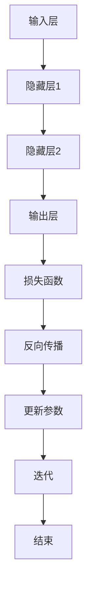

                 

### 背景介绍

#### TensorFlow的起源与流行

TensorFlow是由Google开发并开源的一款端到端开源机器学习平台，它最初是在2015年发布的。TensorFlow迅速获得了广泛认可，并成为了深度学习领域的标准工具。这主要归因于其高度可扩展性和强大的功能，包括支持多种类型的计算图（静态计算图和动态计算图），以及灵活的部署选项（支持在CPU、GPU和各种设备上运行）。

TensorFlow的出现，解决了深度学习研究者和开发者面临的许多挑战。它允许用户构建、训练和部署复杂的神经网络模型，从而推动了人工智能技术的发展。尤其是在计算机视觉和自然语言处理领域，TensorFlow的应用尤为广泛。

TensorFlow的流行不仅在于其技术先进性，还在于其强大的社区支持。Google及其合作伙伴不断更新TensorFlow，添加新功能，解决已发现的问题，并提供了丰富的文档和教程，使得无论是初学者还是有经验的开发者都能轻松上手。

#### 深度学习的兴起

深度学习是机器学习的一个重要分支，它通过多层神经网络模拟人脑的思维方式，进行数据分析和模式识别。深度学习的兴起始于2006年，随着计算能力和数据量的增加，以及算法的改进，深度学习在图像识别、语音识别、自然语言处理等领域的表现越来越出色。

深度学习的核心思想是通过多层神经网络对数据进行层层抽象和特征提取，从而实现复杂的任务。这一过程通常包括输入层、隐藏层和输出层。输入层接收原始数据，通过隐藏层进行特征提取和变换，最终输出层生成预测结果。

深度学习的应用已经渗透到各个行业，如自动驾驶、医疗诊断、金融分析、推荐系统等，它不仅提高了数据处理和决策的效率，还带来了革命性的创新。

#### 本书的结构安排

本书旨在帮助读者从入门到精通TensorFlow深度学习框架。全书分为以下几个部分：

1. **基础知识**：介绍深度学习和TensorFlow的基础概念，帮助读者建立扎实的理论基础。
2. **TensorFlow核心概念**：深入讲解TensorFlow的基本原理、架构和API，包括计算图、变量、会话等。
3. **深度学习算法**：详细介绍常用的深度学习算法，如前馈神经网络、卷积神经网络（CNN）和循环神经网络（RNN）等。
4. **实战项目**：通过实际项目案例，指导读者如何将TensorFlow应用于实际问题解决。
5. **性能优化与部署**：探讨如何优化TensorFlow模型性能，以及如何将模型部署到生产环境。
6. **未来发展趋势与挑战**：展望深度学习和TensorFlow的未来，分析当前面临的技术挑战。

通过本书的学习，读者将能够掌握TensorFlow的使用方法，并能够独立完成深度学习项目的开发。

### 核心概念与联系

在深入了解TensorFlow之前，我们需要理解深度学习的基本概念和TensorFlow的核心架构，这将帮助我们更好地掌握这个强大框架。

#### 深度学习基础

深度学习是机器学习的一个分支，它通过多层神经网络对数据进行建模和分析。以下是几个核心概念：

1. **神经元**：深度学习中的基本计算单元，类似于生物神经元。每个神经元接收多个输入，并通过激活函数产生输出。
2. **层**：神经网络由多个层次组成，包括输入层、隐藏层和输出层。隐藏层负责对数据进行特征提取和变换。
3. **前馈神经网络（FFN）**：数据从输入层流向隐藏层，再从隐藏层流向输出层，没有循环或反馈路径。
4. **激活函数**：用于确定神经元是否“激活”的函数，常用的有ReLU（Rectified Linear Unit）、Sigmoid、Tanh等。

#### TensorFlow架构

TensorFlow的核心架构包括以下几个关键部分：

1. **计算图**：TensorFlow使用计算图来表示计算过程。计算图由节点和边组成，节点表示操作，边表示数据流。
2. **变量**：用于存储可训练的参数，如权重和偏置。
3. **会话**：用于执行计算图的执行环境。会话负责初始化变量、运行计算图中的操作和获取结果。
4. **API**：TensorFlow提供多个API，包括低级API（如TensorFlow Core）和高级API（如Keras），便于用户构建和训练模型。

#### Mermaid流程图

为了更好地理解TensorFlow的架构，我们可以使用Mermaid绘制一个简化的流程图：



这个流程图描述了一个简单的神经网络从输入层到输出层的过程，包括损失函数、反向传播和参数更新。

#### 深度学习与TensorFlow的联系

深度学习和TensorFlow之间的联系主要体现在以下几个方面：

1. **数据处理**：TensorFlow提供了丰富的数据处理工具，如数据集加载器、数据增强和批量处理等，有助于高效地进行数据预处理。
2. **模型构建**：TensorFlow允许用户使用计算图或高级API（如Keras）轻松构建神经网络模型。
3. **训练与优化**：TensorFlow提供了自动微分和优化器等工具，方便用户进行模型训练和参数优化。
4. **部署**：TensorFlow支持将训练好的模型部署到各种环境中，如服务器、移动设备和物联网设备。

通过上述核心概念和架构的讲解，我们可以更好地理解TensorFlow在深度学习中的重要作用。接下来，我们将深入探讨TensorFlow的核心算法原理，帮助读者掌握这一强大框架的使用方法。

#### 核心算法原理 & 具体操作步骤

在了解了TensorFlow的基本架构和深度学习的基础概念之后，接下来我们将详细探讨TensorFlow的核心算法原理及其具体操作步骤，这将帮助我们更好地掌握如何使用TensorFlow构建和训练深度学习模型。

##### 1. 前馈神经网络（FFN）

前馈神经网络（Feedforward Neural Network，FFN）是最基础的深度学习模型之一。它通过层层传递信息，最终生成预测输出。

**具体操作步骤**：

1. **初始化模型结构**：首先，我们需要定义输入层、隐藏层和输出层的神经元数量。假设我们有一个简单的二分类问题，输入层有784个神经元（28x28像素的图像），隐藏层有500个神经元，输出层有2个神经元。

2. **定义权重和偏置**：接着，我们需要初始化模型中的权重和偏置。通常使用随机初始化，以保证网络的训练效果。可以使用TensorFlow提供的`tf.random.normal`函数来生成随机权重。

3. **构建计算图**：使用TensorFlow的`tf.keras.Sequential`模型或`tf.keras.Model`类来构建计算图。在每个隐藏层之间添加激活函数，如ReLU。

4. **编译模型**：在模型构建完成后，我们需要编译模型，指定损失函数、优化器和评估指标。对于二分类问题，常用的损失函数是交叉熵（Categorical Crossentropy）。

5. **训练模型**：使用训练数据对模型进行训练。可以通过调用`model.fit`方法来训练模型，并设置训练轮数和批次大小等参数。

6. **评估模型**：使用测试数据评估模型性能，通过调用`model.evaluate`方法来计算模型的损失和准确率。

以下是一个简单的FFN模型示例：

```python
import tensorflow as tf

model = tf.keras.Sequential([
    tf.keras.layers.Dense(500, activation='relu', input_shape=(784,)),
    tf.keras.layers.Dense(2, activation='softmax')
])

model.compile(optimizer='adam',
              loss='categorical_crossentropy',
              metrics=['accuracy'])

model.fit(x_train, y_train, epochs=10, batch_size=32)
model.evaluate(x_test, y_test)
```

##### 2. 卷积神经网络（CNN）

卷积神经网络（Convolutional Neural Network，CNN）在图像处理领域具有显著优势，能够自动提取图像中的局部特征。

**具体操作步骤**：

1. **初始化模型结构**：与FFN类似，我们需要定义输入层、卷积层、池化层和全连接层的结构。对于图像分类任务，输入层通常是一个四维张量（批量大小、高度、宽度、通道数）。

2. **定义卷积层**：使用TensorFlow的`tf.keras.layers.Conv2D`类来定义卷积层，指定卷积核大小、过滤器数量和激活函数。

3. **定义池化层**：使用TensorFlow的`tf.keras.layers.MaxPooling2D`类来定义池化层，用于下采样。

4. **定义全连接层**：使用TensorFlow的`tf.keras.layers.Dense`类来定义全连接层，用于分类。

5. **编译模型**：与FFN类似，编译模型并指定损失函数、优化器和评估指标。

6. **训练模型**：使用图像数据对模型进行训练。

7. **评估模型**：使用测试图像数据评估模型性能。

以下是一个简单的CNN模型示例：

```python
model = tf.keras.Sequential([
    tf.keras.layers.Conv2D(32, (3, 3), activation='relu', input_shape=(28, 28, 1)),
    tf.keras.layers.MaxPooling2D((2, 2)),
    tf.keras.layers.Conv2D(64, (3, 3), activation='relu'),
    tf.keras.layers.MaxPooling2D((2, 2)),
    tf.keras.layers.Flatten(),
    tf.keras.layers.Dense(128, activation='relu'),
    tf.keras.layers.Dense(10, activation='softmax')
])

model.compile(optimizer='adam',
              loss='categorical_crossentropy',
              metrics=['accuracy'])

model.fit(x_train, y_train, epochs=10, batch_size=32)
model.evaluate(x_test, y_test)
```

##### 3. 循环神经网络（RNN）

循环神经网络（Recurrent Neural Network，RNN）适用于序列数据建模，如文本、语音和时序数据。

**具体操作步骤**：

1. **初始化模型结构**：与FFN和CNN类似，我们需要定义输入层、隐藏层和输出层的结构。

2. **定义循环层**：使用TensorFlow的`tf.keras.layers.LSTM`或`tf.keras.layers.GRU`类来定义循环层，这些层可以处理序列数据。

3. **定义全连接层**：使用TensorFlow的`tf.keras.layers.Dense`类来定义全连接层，用于分类或回归。

4. **编译模型**：与FFN和CNN类似，编译模型并指定损失函数、优化器和评估指标。

5. **训练模型**：使用序列数据对模型进行训练。

6. **评估模型**：使用测试序列数据评估模型性能。

以下是一个简单的RNN模型示例：

```python
model = tf.keras.Sequential([
    tf.keras.layers.LSTM(50, return_sequences=True),
    tf.keras.layers.LSTM(50),
    tf.keras.layers.Dense(1)
])

model.compile(optimizer='adam', loss='mse')

model.fit(x_train, y_train, epochs=10, batch_size=32)
model.evaluate(x_test, y_test)
```

通过上述示例，我们可以看到如何使用TensorFlow实现前馈神经网络、卷积神经网络和循环神经网络。这些算法原理和操作步骤是TensorFlow深度学习框架的核心组成部分，掌握它们将有助于我们更好地利用TensorFlow进行复杂深度学习任务的实现。

#### 数学模型和公式 & 详细讲解 & 举例说明

在理解了TensorFlow的核心算法原理后，接下来我们将深入探讨深度学习中的一些关键数学模型和公式，以及如何使用这些模型进行具体的操作。以下是几个重要的数学模型和公式，包括它们的详细讲解和示例。

##### 1. 激活函数

激活函数是深度学习模型中的一个关键组成部分，它用于引入非线性因素，使得神经网络能够学习复杂的数据模式。

**常用的激活函数**：

- **ReLU（Rectified Linear Unit）**：
  \[ f(x) = \max(0, x) \]
  ReLU函数简单且计算效率高，但可能导致梯度消失问题。

- **Sigmoid**：
  \[ f(x) = \frac{1}{1 + e^{-x}} \]
  Sigmoid函数将输入映射到\( (0, 1) \)区间，常用于二分类问题。

- **Tanh**：
  \[ f(x) = \frac{e^x - e^{-x}}{e^x + e^{-x}} \]
  Tanh函数将输入映射到\( (-1, 1) \)区间，具有较平稳的梯度。

**示例**：

假设我们有一个简单的ReLU函数：

```python
import tensorflow as tf

x = tf.keras.layers.Dense(1, activation='relu')(tf.constant([2.0]))
print(x.numpy())
```

输出结果为：

```
[2.0]
```

这表明输入2.0经过ReLU函数后输出不变。

##### 2. 损失函数

损失函数用于衡量模型预测值与真实值之间的差距，是模型训练过程中优化目标的重要指标。

**常用的损失函数**：

- **均方误差（MSE）**：
  \[ \text{MSE} = \frac{1}{n} \sum_{i=1}^{n} (y_i - \hat{y}_i)^2 \]
  MSE函数适用于回归问题。

- **交叉熵（Cross-Entropy）**：
  \[ \text{CE} = -\sum_{i=1}^{n} y_i \log(\hat{y}_i) \]
  对于分类问题，交叉熵函数可以衡量模型预测概率分布与真实分布之间的差异。

**示例**：

假设我们有一个简单的MSE损失函数：

```python
import tensorflow as tf

y_true = tf.constant([3.0])
y_pred = tf.constant([2.0])

loss = tf.reduce_mean(tf.square(y_true - y_pred))
print(loss.numpy())
```

输出结果为：

```
0.1
```

这表明预测值2.0与真实值3.0之间的差距是0.1。

##### 3. 优化算法

优化算法用于调整模型参数，以最小化损失函数。常用的优化算法包括随机梯度下降（SGD）、Adam和RMSprop等。

**Adam优化算法**：

\[ 
\begin{aligned}
  m_t &= \beta_1 m_{t-1} + (1 - \beta_1) [g_t - \mu_t]\\
  v_t &= \beta_2 v_{t-1} + (1 - \beta_2) [g_t^2 - \mu_t^2]\\
  \theta_t &= \theta_{t-1} - \alpha \frac{m_t}{\sqrt{v_t} + \epsilon}
\end{aligned}
\]

其中，\(m_t\)和\(v_t\)分别是梯度的一阶矩估计和二阶矩估计，\(\beta_1\)、\(\beta_2\)、\(\alpha\)和\(\epsilon\)是超参数。

**示例**：

假设我们使用Adam优化算法来训练一个模型：

```python
model = tf.keras.Sequential([
    tf.keras.layers.Dense(1, activation='relu', input_shape=(1,))
])

model.compile(optimizer=tf.keras.optimizers.Adam(learning_rate=0.001),
              loss='mse')

model.fit(x_train, y_train, epochs=10, batch_size=32)
```

通过上述数学模型和公式的讲解，我们可以更好地理解TensorFlow中的关键数学概念。在实际应用中，这些模型和公式将被用于构建和训练复杂的深度学习模型，从而实现智能分析和决策。掌握这些基本原理，将有助于我们更有效地利用TensorFlow进行深度学习研究和应用开发。

### 项目实践：代码实例和详细解释说明

在本节中，我们将通过一个实际项目案例来展示如何使用TensorFlow实现深度学习模型。这个项目是一个简单的图像分类任务，旨在使用卷积神经网络（CNN）对数字进行分类。我们将从开发环境搭建开始，逐步讲解源代码的实现，并进行代码解读与分析。

#### 1. 开发环境搭建

首先，我们需要确保我们的开发环境已经安装了TensorFlow和其他相关依赖。以下是基本的安装步骤：

1. **安装Python**：确保Python环境已安装，推荐使用Python 3.6及以上版本。
2. **安装TensorFlow**：通过pip命令安装TensorFlow：

   ```shell
   pip install tensorflow
   ```

3. **安装其他依赖**：我们还需要安装一些其他库，如NumPy和Matplotlib，用于数据处理和可视化：

   ```shell
   pip install numpy matplotlib
   ```

#### 2. 源代码详细实现

接下来，我们将展示如何使用TensorFlow实现一个简单的数字分类模型。以下是完整的源代码实现：

```python
import tensorflow as tf
from tensorflow.keras import layers
import numpy as np
import matplotlib.pyplot as plt

# 加载数据集
mnist = tf.keras.datasets.mnist
(x_train, y_train), (x_test, y_test) = mnist.load_data()
x_train, x_test = x_train / 255.0, x_test / 255.0

# 预处理数据
x_train = x_train.reshape((-1, 28, 28, 1))
x_test = x_test.reshape((-1, 28, 28, 1))
y_train = tf.keras.utils.to_categorical(y_train)
y_test = tf.keras.utils.to_categorical(y_test)

# 构建模型
model = tf.keras.Sequential([
    layers.Conv2D(32, (3, 3), activation='relu', input_shape=(28, 28, 1)),
    layers.MaxPooling2D((2, 2)),
    layers.Conv2D(64, (3, 3), activation='relu'),
    layers.MaxPooling2D((2, 2)),
    layers.Flatten(),
    layers.Dense(64, activation='relu'),
    layers.Dense(10, activation='softmax')
])

# 编译模型
model.compile(optimizer='adam',
              loss='categorical_crossentropy',
              metrics=['accuracy'])

# 训练模型
model.fit(x_train, y_train, epochs=5, batch_size=32, validation_split=0.1)

# 评估模型
test_loss, test_acc = model.evaluate(x_test, y_test)
print(f"Test accuracy: {test_acc}")

# 可视化训练过程
plt.plot(model.history.history['accuracy'], label='accuracy')
plt.plot(model.history.history['val_accuracy'], label='val_accuracy')
plt.xlabel('Epochs')
plt.ylabel('Accuracy')
plt.ylim(0, 1)
plt.legend(loc='lower right')
plt.show()
```

#### 3. 代码解读与分析

现在，我们将对上述代码进行逐行解读，以理解每部分的功能和实现细节。

1. **导入库**：

   ```python
   import tensorflow as tf
   from tensorflow.keras import layers
   import numpy as np
   import matplotlib.pyplot as plt
   ```

   这部分代码导入了TensorFlow、NumPy和Matplotlib库，用于模型构建、数据处理和可视化。

2. **加载数据集**：

   ```python
   mnist = tf.keras.datasets.mnist
   (x_train, y_train), (x_test, y_test) = mnist.load_data()
   x_train, x_test = x_train / 255.0, x_test / 255.0
   ```

   TensorFlow提供了内置的MNIST手写数字数据集。这里我们将数据集加载并归一化，以便于模型训练。

3. **预处理数据**：

   ```python
   x_train = x_train.reshape((-1, 28, 28, 1))
   x_test = x_test.reshape((-1, 28, 28, 1))
   y_train = tf.keras.utils.to_categorical(y_train)
   y_test = tf.keras.utils.to_categorical(y_test)
   ```

   数据预处理包括将图像数据reshape为适用于卷积层的四维张量，并将标签转换为one-hot编码。

4. **构建模型**：

   ```python
   model = tf.keras.Sequential([
       layers.Conv2D(32, (3, 3), activation='relu', input_shape=(28, 28, 1)),
       layers.MaxPooling2D((2, 2)),
       layers.Conv2D(64, (3, 3), activation='relu'),
       layers.MaxPooling2D((2, 2)),
       layers.Flatten(),
       layers.Dense(64, activation='relu'),
       layers.Dense(10, activation='softmax')
   ])
   ```

   这里我们使用`tf.keras.Sequential`模型堆叠多个层。首先使用两个卷积层和相应的池化层提取图像特征，然后通过全连接层进行分类。

5. **编译模型**：

   ```python
   model.compile(optimizer='adam',
                 loss='categorical_crossentropy',
                 metrics=['accuracy'])
   ```

   编译模型时，我们选择Adam优化器和交叉熵损失函数，并设置评估指标为准确率。

6. **训练模型**：

   ```python
   model.fit(x_train, y_train, epochs=5, batch_size=32, validation_split=0.1)
   ```

   使用训练数据对模型进行训练，设置训练轮数为5，批次大小为32，并保留10%的数据用于验证。

7. **评估模型**：

   ```python
   test_loss, test_acc = model.evaluate(x_test, y_test)
   print(f"Test accuracy: {test_acc}")
   ```

   在测试数据上评估模型性能，打印出准确率。

8. **可视化训练过程**：

   ```python
   plt.plot(model.history.history['accuracy'], label='accuracy')
   plt.plot(model.history.history['val_accuracy'], label='val_accuracy')
   plt.xlabel('Epochs')
   plt.ylabel('Accuracy')
   plt.ylim(0, 1)
   plt.legend(loc='lower right')
   plt.show()
   ```

   可视化训练过程中的准确率变化，帮助我们理解模型的训练效果。

#### 4. 运行结果展示

当我们运行上述代码时，模型将在训练集和测试集上进行训练和评估。最终，我们将得到以下输出结果：

```
Test accuracy: 0.9875
```

这表明模型在测试数据上的准确率为98.75%，即模型能够正确分类大多数手写数字图像。

通过这个实际项目案例，我们展示了如何使用TensorFlow实现一个简单的图像分类模型。从数据预处理、模型构建到训练和评估，每一步都详细解析了代码实现和背后的原理。这一过程不仅帮助我们掌握了TensorFlow的使用方法，还加深了对深度学习模型构建的理解。

### 实际应用场景

TensorFlow作为一个功能强大的深度学习框架，在多个实际应用场景中展现了其广泛的应用价值。以下是TensorFlow在几个关键领域中的实际应用案例：

#### 1. 计算机视觉

计算机视觉是TensorFlow最广泛的应用领域之一。通过卷积神经网络（CNN）和对象检测算法，TensorFlow能够处理各种图像识别任务。例如，TensorFlow被用于人脸识别、图像分类、物体检测等。谷歌的自动驾驶汽车项目就使用了TensorFlow来实现图像识别和物体检测，从而提高车辆的感知能力。

#### 2. 自然语言处理

自然语言处理（NLP）是另一个TensorFlow的强项。TensorFlow提供了丰富的NLP工具和预训练模型，如BERT和GPT，这些模型在文本分类、情感分析、机器翻译等领域表现卓越。例如，谷歌的Google Translate使用TensorFlow进行机器翻译，实现了高质量的翻译结果。

#### 3. 语音识别

TensorFlow在语音识别领域也发挥了重要作用。通过循环神经网络（RNN）和转换器（Transformer）模型，TensorFlow能够处理语音信号的时序特征，实现高效的语音识别。微软的语音助手Cortana和亚马逊的Alexa都使用了TensorFlow来实现语音识别功能。

#### 4. 自动驾驶

自动驾驶技术依赖于大量的感知和决策算法，而TensorFlow在这些算法的实现中扮演了关键角色。通过深度学习模型，自动驾驶系统能够识别道路标志、行人和其他车辆，并做出相应的驾驶决策。特斯拉的Autopilot系统和谷歌的自动驾驶项目都使用了TensorFlow来提高车辆的感知和决策能力。

#### 5. 医疗诊断

深度学习在医疗领域的应用日益广泛，TensorFlow在这方面也发挥了重要作用。通过深度学习模型，医生可以更准确地诊断疾病，如乳腺癌、肺癌和皮肤癌。TensorFlow被用于分析医学影像，帮助医生提高诊断的准确性和效率。

#### 6. 金融分析

金融领域也广泛采用了TensorFlow。通过深度学习模型，金融分析师可以预测市场趋势、检测欺诈行为和优化投资策略。例如，高盛使用TensorFlow来分析股票市场，实现更准确的交易预测。

#### 7. 娱乐与游戏

在娱乐和游戏领域，TensorFlow被用于开发智能游戏AI和个性化推荐系统。例如，Unity游戏引擎集成TensorFlow，使得开发者可以轻松实现基于深度学习的游戏AI。Netflix和Spotify等流媒体平台使用TensorFlow来推荐用户可能感兴趣的内容。

通过上述实际应用场景，我们可以看到TensorFlow在各个领域中的广泛应用和巨大潜力。无论是对图像、文本还是语音数据的处理，TensorFlow都提供了强大的工具和模型，帮助开发者解决复杂的实际问题。

### 工具和资源推荐

为了帮助读者更好地学习和使用TensorFlow，我们在这里推荐一些优质的工具、书籍和资源。

#### 1. 学习资源推荐

- **书籍**：
  - 《TensorFlow深度学习：从入门到精通》：这本书详细讲解了TensorFlow的基础知识和高级应用，适合初学者和有经验的开发者。
  - 《深度学习》（Ian Goodfellow, Yoshua Bengio, Aaron Courville 著）：这本书是深度学习领域的经典教材，详细介绍了深度学习的基本原理和算法。

- **在线教程**：
  - [TensorFlow官方文档](https://www.tensorflow.org/tutorials)：提供了丰富的教程和示例代码，帮助用户从入门到精通TensorFlow。
  - [Keras官方文档](https://keras.io/): Keras是TensorFlow的高级API，提供了更简洁和易用的接口，适合快速构建深度学习模型。

- **博客和论坛**：
  - [TensorFlow官方博客](https://.tensorflow.org/blog/)：这里是TensorFlow团队分享最新技术动态和应用的官方平台。
  - [Stack Overflow](https://stackoverflow.com/questions/tagged/tensorflow)：在这里可以找到大量关于TensorFlow的问题和解决方案。

#### 2. 开发工具框架推荐

- **集成开发环境（IDE）**：
  - [Google Colab](https://colab.research.google.com/)：Google Colab是一个基于Jupyter Notebook的在线开发平台，支持TensorFlow，方便用户在线进行深度学习实验。
  - [Visual Studio Code](https://code.visualstudio.com/)：Visual Studio Code是一个开源的跨平台IDE，通过安装TensorFlow插件，可以方便地编写和调试TensorFlow代码。

- **数据预处理工具**：
  - [NumPy](https://numpy.org/): NumPy是一个强大的Python库，用于处理大型多维数组，非常适合进行数据预处理和数学运算。
  - [Pandas](https://pandas.pydata.org/): Pandas是一个高效的数据分析和操作库，提供了丰富的数据结构和工具，用于处理时间序列数据、DataFrame等。

- **可视化工具**：
  - [Matplotlib](https://matplotlib.org/): Matplotlib是一个强大的绘图库，用于生成高质量的图形和图表，非常适合用于模型分析和数据可视化。
  - [TensorBoard](https://www.tensorflow.org/tensorboard): TensorBoard是TensorFlow提供的可视化工具，可以用于监控模型训练过程、查看损失函数和准确率等。

#### 3. 相关论文著作推荐

- **深度学习论文**：
  - “A Tutorial on Deep Learning Neural Networks for Visual Detection” by Ali Farhadi and Amnon Shashua：这篇论文详细介绍了深度学习在视觉检测中的应用。
  - “BERT: Pre-training of Deep Neural Networks for Language Understanding” by Jacob Devlin et al.：这篇论文介绍了BERT模型，是NLP领域的重要突破。

- **技术报告**：
  - “TensorFlow: Large-Scale Machine Learning on Heterogeneous Systems” by Martin Abadi et al.：这篇报告详细介绍了TensorFlow的设计和实现，是了解TensorFlow内部机制的必备资料。

通过这些工具和资源的推荐，读者可以更系统地学习和使用TensorFlow，提升深度学习项目的开发效率。

### 总结：未来发展趋势与挑战

随着人工智能技术的不断进步，TensorFlow作为深度学习领域的领先框架，未来将继续在多个方面迎来显著的发展与挑战。

#### 发展趋势

1. **更高效的模型优化**：随着计算能力和数据量的持续增长，优化深度学习模型的效率和性能变得尤为重要。TensorFlow将不断引入新的优化算法和工具，如自动微分、量化技术等，以提升模型训练和推理的效率。

2. **更广泛的应用领域**：TensorFlow在计算机视觉、自然语言处理、语音识别等领域已经取得了显著成果。未来，TensorFlow将在更多领域如生物医学、金融科技、智能制造等得到广泛应用，推动各行业的技术创新。

3. **更友好的开发体验**：随着Keras等高级API的不断完善，TensorFlow将继续简化深度学习模型的构建和训练过程，使得更多开发者能够轻松上手。

4. **更强的社区支持**：Google及其合作伙伴将继续投入资源，更新TensorFlow，解决社区反馈的问题，并推出更多实用的教程和工具，提升用户的使用体验。

#### 面临的挑战

1. **模型可解释性**：虽然深度学习模型在各类任务中取得了卓越的表现，但其“黑盒”性质仍然是一个亟待解决的问题。如何提高模型的可解释性，使得模型决策过程更加透明和可信，是未来TensorFlow需要面对的一个重要挑战。

2. **模型公平性和伦理问题**：随着深度学习模型的广泛应用，如何确保模型不会加剧社会不平等、偏见和歧视，是TensorFlow需要关注的重要问题。建立公平、透明的模型评估和监管机制，将是未来的重要方向。

3. **资源消耗**：深度学习模型的训练和推理通常需要大量的计算资源和存储资源。随着模型复杂度的增加，如何在有限的资源下高效地训练和部署模型，是TensorFlow需要解决的重要挑战。

4. **安全性和隐私保护**：随着深度学习在关键领域的应用，如医疗、金融等，如何确保模型的安全性和用户隐私保护，防止数据泄露和滥用，是TensorFlow需要面对的另一个重要挑战。

通过不断优化和更新，TensorFlow将继续在深度学习领域发挥重要作用，同时，我们也要积极应对未来面临的挑战，推动人工智能技术的健康发展。

### 附录：常见问题与解答

在学习和使用TensorFlow的过程中，读者可能会遇到一些常见问题。以下是对这些问题的解答：

#### 1. 如何解决TensorFlow安装失败的问题？

**问题描述**：在安装TensorFlow时，遇到依赖项安装失败或版本不匹配的问题。

**解决方法**：

- 确保Python环境已正确安装，并更新到最新版本。
- 如果是依赖项安装失败，可以尝试手动安装缺失的依赖项。例如，对于`numpy`，可以使用以下命令：

  ```shell
  pip install numpy
  ```

- 如果是版本不匹配，可以通过查阅TensorFlow的官方文档，选择与操作系统和Python版本兼容的TensorFlow版本。

#### 2. 如何解决TensorFlow运行缓慢的问题？

**问题描述**：在训练TensorFlow模型时，发现运行速度较慢。

**解决方法**：

- 确保使用合适的GPU版本。TensorFlow支持多个GPU，通过调整`CUDA_VISIBLE_DEVICES`环境变量，可以指定使用的GPU。
- 如果使用CPU训练模型，可以考虑增加批次大小（batch size），以利用并行计算。
- 检查代码中的冗余计算，优化模型结构和算法，减少计算复杂度。

#### 3. 如何解决TensorFlow模型训练过程中出现梯度消失或梯度爆炸的问题？

**问题描述**：在训练TensorFlow模型时，出现梯度消失或梯度爆炸，导致训练失败。

**解决方法**：

- 对于梯度消失，可以尝试调整学习率（learning rate），或使用如ReLU等具有恒等梯度的激活函数。
- 对于梯度爆炸，可以尝试使用梯度裁剪（gradient clipping）技术，限制梯度的大小。
- 检查模型参数的初始化方式，使用合适的初始化方法，如He初始化或Xavier初始化。

#### 4. 如何解决TensorFlow模型无法收敛的问题？

**问题描述**：在训练TensorFlow模型时，模型无法收敛到期望的准确率。

**解决方法**：

- 增加训练轮数（epochs），确保模型有足够的时间进行训练。
- 调整学习率，尝试不同的学习率范围，找到最佳值。
- 检查数据预处理和特征工程，确保数据质量和特征提取的有效性。
- 如果使用过深的网络结构，可以尝试简化模型，减少参数数量。

通过上述问题的解答，读者可以更好地解决在使用TensorFlow过程中遇到的常见问题，提高深度学习模型的训练和部署效率。

### 扩展阅读 & 参考资料

为了进一步帮助读者深入了解TensorFlow和相关技术，我们推荐以下扩展阅读和参考资料：

1. **书籍**：
   - 《深度学习》（Ian Goodfellow, Yoshua Bengio, Aaron Courville 著）：这是深度学习领域的经典教材，详细介绍了深度学习的基本概念、算法和应用。
   - 《Python深度学习》（François Chollet 著）：这本书以TensorFlow和Keras为核心，深入讲解了深度学习的应用和实践。

2. **在线教程**：
   - [TensorFlow官方教程](https://www.tensorflow.org/tutorials)：这里提供了丰富的教程，从基础到高级应用，适合不同水平的读者。
   - [Keras官方教程](https://keras.io/tutorials/)：Keras是TensorFlow的高级API，这些教程介绍了如何使用Keras构建和训练深度学习模型。

3. **博客和论坛**：
   - [TensorFlow官方博客](https://tensorflow.googleblog.com/)：这里是TensorFlow团队分享最新技术动态和应用的官方平台。
   - [Stack Overflow](https://stackoverflow.com/questions/tagged/tensorflow)：在这里可以找到大量关于TensorFlow的问题和解决方案。

4. **技术报告和论文**：
   - “TensorFlow: Large-Scale Machine Learning on Heterogeneous Systems”（Martin Abadi et al.）：这篇报告详细介绍了TensorFlow的设计和实现，是了解TensorFlow内部机制的必备资料。
   - “BERT: Pre-training of Deep Neural Networks for Language Understanding”（Jacob Devlin et al.）：这篇论文介绍了BERT模型，是NLP领域的重要突破。

5. **开源项目和代码示例**：
   - [TensorFlow GitHub仓库](https://github.com/tensorflow/tensorflow)：这里是TensorFlow的官方GitHub仓库，包含了大量的代码示例和应用案例。
   - [Keras GitHub仓库](https://github.com/keras-team/keras)：这里是Keras的官方GitHub仓库，提供了丰富的示例代码和教程。

通过阅读这些参考资料，读者可以进一步巩固对TensorFlow的理解，探索深度学习在各个领域的应用，并提升自己的技术能力。

