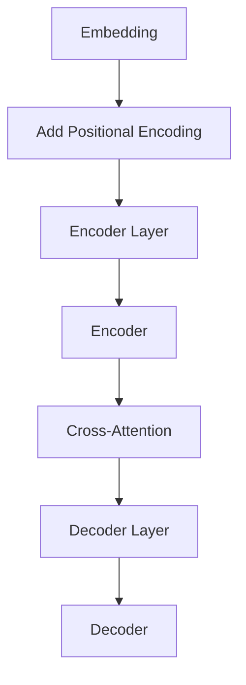

                 

### Transformer原理与代码实例讲解

**关键词**：Transformer、深度学习、序列模型、注意力机制、自注意力、编码器、解码器

**摘要**：
本文将深入探讨Transformer模型的原理及其在深度学习领域的广泛应用。我们将从背景介绍开始，逐步讲解Transformer的核心概念与联系，分析其数学模型和具体操作步骤，并通过代码实例展示其实际应用。此外，还将探讨Transformer在不同场景下的实际应用，推荐相关学习资源和开发工具，总结未来发展趋势与挑战，并提供常见问题与解答。

---

## 1. 背景介绍

在深度学习领域，序列模型（如循环神经网络RNN、长短期记忆网络LSTM）长期以来在自然语言处理任务中占据主导地位。这些模型通过递归的方式处理输入序列，能够捕捉序列中的时间依赖性。然而，递归结构使得训练过程复杂，难以并行化，且在处理长序列时效果不佳。为了解决这些问题，Vaswani等人在2017年提出了Transformer模型。

Transformer模型采用自注意力机制（Self-Attention）和多头注意力（Multi-Head Attention）来处理序列数据，从而实现了并行训练，并显著提高了长序列处理能力。自注意力机制允许模型在不同位置之间直接计算依赖关系，而多头注意力通过并行处理不同子空间，提高了模型的表示能力。Transformer模型的提出，标志着自然语言处理领域的一个重要突破。

## 2. 核心概念与联系

### 2.1. 自注意力（Self-Attention）

自注意力机制是Transformer模型的核心，它通过计算序列中每个位置与其他所有位置之间的依赖关系来建模序列。自注意力的计算过程可以分为以下几个步骤：

1. 输入序列表示为$$ X = [X_1, X_2, ..., X_n] $$
2. 通过线性变换得到查询（Query）、键（Key）和值（Value）：
   $$ Q = XW_Q, K = XW_K, V = XW_V $$
   其中$$ W_Q, W_K, W_V $$分别为权重矩阵。

3. 计算自注意力分数：
   $$ s_{ij} = softmax(\frac{Q_iK_j}{\sqrt{d_k}}) $$
   其中$$ d_k $$为键的维度，$$ s_{ij} $$表示$$ X_i $$与$$ X_j $$的注意力得分。

4. 将注意力得分与值相乘，得到加权值：
   $$ O_i = \sum_{j=1}^{n}s_{ij}V_j $$

通过自注意力机制，模型能够自动学习到不同位置之间的依赖关系，从而捕捉序列中的长期依赖性。

### 2.2. 多头注意力（Multi-Head Attention）

多头注意力通过并行处理多个自注意力头来提高模型的表示能力。每个头独立学习不同的依赖关系，并将结果进行拼接和线性变换，得到最终的输出。多头注意力的计算过程如下：

1. 将查询、键和值通过不同的权重矩阵进行线性变换，得到多个头的查询、键和值：
   $$ Q_1, Q_2, ..., Q_h = XW_{Q_1}, W_{Q_2}, ..., W_{Q_h} $$
   $$ K_1, K_2, ..., K_h = XW_{K_1}, W_{K_2}, ..., W_{K_h} $$
   $$ V_1, V_2, ..., V_h = XW_{V_1}, W_{V_2}, ..., W_{V_h} $$

2. 分别计算每个头的自注意力：
   $$ O_{1i} = \sum_{j=1}^{n}s_{1ij}V_{1j}, O_{2i} = \sum_{j=1}^{n}s_{2ij}V_{2j}, ..., O_{hi} = \sum_{j=1}^{n}s_{hiij}V_{hj} $$

3. 将所有头的输出进行拼接和线性变换，得到最终输出：
   $$ O_i = \text{Concat}(O_{1i}, O_{2i}, ..., O_{hi})W_O $$

### 2.3. 编码器（Encoder）与解码器（Decoder）

Transformer模型通常由编码器（Encoder）和解码器（Decoder）组成，分别用于编码和预测。编码器接收输入序列，通过多个自注意力层和全连接层进行编码。解码器则接收编码器的输出和输入序列，通过自注意力和多头注意力层生成预测输出。

编码器的计算过程如下：

1. 输入序列表示为$$ X = [X_1, X_2, ..., X_n] $$
2. 通过嵌入层得到嵌入向量$$ X_e = \text{Embedding}(X) $$
3. 添加位置编码$$ X_p = X_e + \text{PositionalEncoding}(X_e) $$
4. 通过多个编码层（包含自注意力和全连接层）进行编码：
   $$ X^{(0)} = X_p, X^{(l)} = \text{EncoderLayer}(X^{(l-1)}), l=1,2,...,L $$
   其中$$ L $$为编码器层数。

解码器的计算过程如下：

1. 输入序列表示为$$ X = [X_1, X_2, ..., X_n] $$
2. 通过嵌入层得到嵌入向量$$ X_e = \text{Embedding}(X) $$
3. 添加位置编码$$ X_p = X_e + \text{PositionalEncoding}(X_e) $$
4. 通过多个解码层（包含自注意力、多头注意力和全连接层）进行解码：
   $$ X^{(0)} = X_p, X^{(l)} = \text{DecoderLayer}(X^{(l-1)}), l=1,2,...,L $$
   其中$$ L $$为解码器层数。

编码器和解码器之间的交互通过交叉注意力（Cross-Attention）实现，即在解码器中，每个位置的计算依赖于编码器的输出。

### 2.4. Mermaid 流程图



在上面的Mermaid流程图中，编码器和解码器通过自注意力、多头注意力和交叉注意力机制进行交互，共同实现对输入序列的编码和解码。

---

现在我们已经介绍了Transformer模型的核心概念和联系，接下来我们将进一步探讨Transformer的核心算法原理和具体操作步骤。这将帮助我们更深入地理解Transformer的工作原理，为后续的代码实例讲解打下基础。在接下来的章节中，我们将详细分析Transformer的数学模型和公式，并通过实际应用场景展示其强大的能力。

---

## 3. 核心算法原理 & 具体操作步骤

### 3.1. 数学模型和公式

Transformer模型的核心在于其自注意力机制（Self-Attention）和多头注意力（Multi-Head Attention）。这些机制的实现依赖于以下几个关键数学模型和公式：

#### 3.1.1. 线性变换

在Transformer模型中，输入序列首先通过嵌入层（Embedding Layer）转换为嵌入向量（Embedding Vectors）。嵌入向量随后通过线性变换（Linear Transformation）生成查询（Query）、键（Key）和值（Value）：

$$
Q = XW_Q, \quad K = XW_K, \quad V = XW_V
$$

其中，$X$ 是输入序列的嵌入向量，$W_Q, W_K, W_V$ 是权重矩阵，$Q, K, V$ 分别代表查询、键和值。

#### 3.1.2. 自注意力（Self-Attention）

自注意力机制通过以下步骤计算：

1. **计算注意力得分**：

   $$ s_{ij} = softmax(\frac{Q_iK_j}{\sqrt{d_k}}) $$

   其中，$s_{ij}$ 是$X_i$与$X_j$之间的注意力得分，$d_k$ 是键的维度（通常为64或128），$\sqrt{d_k}$ 用于缩放注意力得分，防止梯度消失。

2. **计算加权值**：

   $$ O_i = \sum_{j=1}^{n}s_{ij}V_j $$

   其中，$O_i$ 是$X_i$的加权值。

#### 3.1.3. 多头注意力（Multi-Head Attention）

多头注意力机制通过并行处理多个自注意力头来提高模型的表示能力。具体步骤如下：

1. **线性变换**：

   $$ Q_1, Q_2, ..., Q_h = XW_{Q_1}, W_{Q_2}, ..., W_{Q_h} $$
   $$ K_1, K_2, ..., K_h = XW_{K_1}, W_{K_2}, ..., W_{K_h} $$
   $$ V_1, V_2, ..., V_h = XW_{V_1}, W_{V_2}, ..., W_{V_h} $$

   其中，$h$ 是头数（通常为8）。

2. **计算每个头的自注意力**：

   $$ O_{1i} = \sum_{j=1}^{n}s_{1ij}V_{1j}, O_{2i} = \sum_{j=1}^{n}s_{2ij}V_{2j}, ..., O_{hi} = \sum_{j=1}^{n}s_{hiij}V_{hj} $$

3. **拼接和线性变换**：

   $$ O_i = \text{Concat}(O_{1i}, O_{2i}, ..., O_{hi})W_O $$

#### 3.1.4. 编码器（Encoder）与解码器（Decoder）

编码器（Encoder）和解码器（Decoder）分别用于编码和预测。其基本结构如下：

1. **编码器（Encoder）**：

   $$ X^{(0)} = X_p, \quad X^{(l)} = \text{EncoderLayer}(X^{(l-1)}), \quad l=1,2,...,L $$
   
   其中，$L$ 是编码器层数，$X_p$ 是添加了位置编码的输入序列。

   编码器层由两个主要组件组成：自注意力层（Self-Attention Layer）和前馈层（Feedforward Layer）。

2. **解码器（Decoder）**：

   $$ X^{(0)} = X_p, \quad X^{(l)} = \text{DecoderLayer}(X^{(l-1)}), \quad l=1,2,...,L $$
   
   其中，$L$ 是解码器层数，$X_p$ 是添加了位置编码的输入序列。

   解码器层也由两个主要组件组成：自注意力层、交叉注意力层（Cross-Attention Layer）和前馈层。

### 3.2. 具体操作步骤

#### 3.2.1. 编码器（Encoder）

1. **嵌入层（Embedding Layer）**：

   $$ X_e = \text{Embedding}(X) $$

2. **添加位置编码（Add Positional Encoding）**：

   $$ X_p = X_e + \text{PositionalEncoding}(X_e) $$

3. **通过编码器层（Through Encoder Layers）**：

   $$ X^{(l)} = \text{EncoderLayer}(X^{(l-1)}), \quad l=1,2,...,L $$

   其中，编码器层包含自注意力层和前馈层。

#### 3.2.2. 解码器（Decoder）

1. **嵌入层（Embedding Layer）**：

   $$ X_e = \text{Embedding}(X) $$

2. **添加位置编码（Add Positional Encoding）**：

   $$ X_p = X_e + \text{PositionalEncoding}(X_e) $$

3. **通过解码器层（Through Decoder Layers）**：

   $$ X^{(l)} = \text{DecoderLayer}(X^{(l-1)}), \quad l=1,2,...,L $$

   其中，解码器层包含自注意力层、交叉注意力层和前馈层。

#### 3.2.3. 交叉注意力（Cross-Attention）

交叉注意力层在解码器中用于将解码器的每个位置与编码器的输出进行交互。具体步骤如下：

1. **计算编码器输出（Compute Encoder Output）**：

   $$ X^{(e)} = \text{Encoder}(X^{(e-1)}) $$

2. **通过交叉注意力层（Through Cross-Attention Layer）**：

   $$ X^{(d)} = \text{CrossAttentionLayer}(X^{(d-1)}, X^{(e)}) $$

3. **与前一层拼接（Concatenate with Previous Layer）**：

   $$ X^{(d)} = \text{Concatenate}(X^{(d-1)}, X^{(d)}) $$

4. **通过前馈层（Through Feedforward Layer）**：

   $$ X^{(d)} = \text{FeedforwardLayer}(X^{(d)}) $$

通过以上操作步骤，编码器和解码器共同工作，实现对输入序列的编码和预测。在接下来的章节中，我们将通过代码实例展示Transformer的实际应用。

---

现在我们已经详细讲解了Transformer的核心算法原理和具体操作步骤。在接下来的章节中，我们将通过一个具体的代码实例，展示如何使用PyTorch框架实现Transformer模型。这将帮助我们更好地理解Transformer的内在工作机制，并为实际应用奠定基础。

---

## 4. 数学模型和公式 & 详细讲解 & 举例说明

### 4.1. 数学模型

在Transformer模型中，自注意力（Self-Attention）和多头注意力（Multi-Head Attention）是两个关键组件。下面我们将详细讲解这些数学模型的构成及其计算过程。

#### 4.1.1. 自注意力（Self-Attention）

自注意力机制的核心是一个注意力分数计算函数，用于衡量序列中每个元素之间的相对重要性。具体来说，自注意力计算分为以下几个步骤：

1. **输入表示**：

   假设我们有一个长度为$n$的输入序列，每个元素可以表示为一个$d$维的向量。输入序列可以表示为矩阵$X$：

   $$ X = [X_1, X_2, ..., X_n] \in \mathbb{R}^{n \times d} $$

2. **线性变换**：

   通过线性变换，我们将输入序列映射为查询（Query）、键（Key）和值（Value）：

   $$ Q = XW_Q, \quad K = XW_K, \quad V = XW_V $$

   其中，$W_Q, W_K, W_V$ 是权重矩阵，通常通过训练获得。

3. **计算注意力分数**：

   注意力分数可以通过点积计算，然后通过softmax函数归一化得到：

   $$ s_{ij} = softmax(\frac{Q_iK_j}{\sqrt{d_k}}) $$

   其中，$d_k$ 是键的维度（通常是64或128），$\sqrt{d_k}$ 用于缩放注意力分数，以防止梯度消失。

4. **计算加权值**：

   最后，我们将注意力分数与值相乘，得到加权值：

   $$ O_i = \sum_{j=1}^{n}s_{ij}V_j $$

#### 4.1.2. 多头注意力（Multi-Head Attention）

多头注意力机制通过并行处理多个自注意力头来提高模型的表示能力。具体来说，多头注意力的计算过程如下：

1. **线性变换**：

   将输入序列通过不同的权重矩阵映射为多个查询、键和值：

   $$ Q_1, Q_2, ..., Q_h = XW_{Q_1}, W_{Q_2}, ..., W_{Q_h} $$
   $$ K_1, K_2, ..., K_h = XW_{K_1}, W_{K_2}, ..., W_{K_h} $$
   $$ V_1, V_2, ..., V_h = XW_{V_1}, W_{V_2}, ..., W_{V_h} $$

   其中，$h$ 是头数（通常为8），$W_{Q_i}, W_{K_i}, W_{V_i}$ 是不同的权重矩阵。

2. **计算每个头的自注意力**：

   分别计算每个头的自注意力，得到多个加权值：

   $$ O_{1i} = \sum_{j=1}^{n}s_{1ij}V_{1j}, O_{2i} = \sum_{j=1}^{n}s_{2ij}V_{2j}, ..., O_{hi} = \sum_{j=1}^{n}s_{hiij}V_{hj} $$

3. **拼接和线性变换**：

   将所有头的输出进行拼接，并通过线性变换得到最终输出：

   $$ O_i = \text{Concat}(O_{1i}, O_{2i}, ..., O_{hi})W_O $$

#### 4.1.3. 位置编码（Positional Encoding）

由于Transformer模型不包含递归结构，因此无法直接利用位置信息。为了引入位置信息，我们使用位置编码（Positional Encoding）。位置编码是一种将位置信息编码到嵌入向量中的方法。具体来说，位置编码可以通过以下方式获得：

$$
PE_{(pos,2i)} = \sin\left(\frac{pos}{10000^{2i/d}}\right)
$$

$$
PE_{(pos,2i+1)} = \cos\left(\frac{pos}{10000^{2i/d}}\right)
$$

其中，$pos$ 是位置索引，$i$ 是维度索引，$d$ 是嵌入向量的维度。

### 4.2. 详细讲解

下面我们将对上述数学模型进行详细讲解，并通过具体例子来说明如何计算注意力分数和加权值。

#### 4.2.1. 自注意力（Self-Attention）

假设我们有一个长度为5的输入序列，每个元素是一个2维向量：

$$ X = \begin{bmatrix} 
x_1 = [1, 2] \\
x_2 = [3, 4] \\
x_3 = [5, 6] \\
x_4 = [7, 8] \\
x_5 = [9, 10]
\end{bmatrix} $$

1. **线性变换**：

   通过线性变换，我们将输入序列映射为查询、键和值：

   $$ Q = \begin{bmatrix} 
   q_1 = [1.1, 2.1] \\
   q_2 = [3.1, 4.1] \\
   q_3 = [5.1, 6.1] \\
   q_4 = [7.1, 8.1] \\
   q_5 = [9.1, 10.1]
   \end{bmatrix} $$

   $$ K = \begin{bmatrix} 
   k_1 = [1.2, 2.2] \\
   k_2 = [3.2, 4.2] \\
   k_3 = [5.2, 6.2] \\
   k_4 = [7.2, 8.2] \\
   k_5 = [9.2, 10.2]
   \end{bmatrix} $$

   $$ V = \begin{bmatrix} 
   v_1 = [1.3, 2.3] \\
   v_2 = [3.3, 4.3] \\
   v_3 = [5.3, 6.3] \\
   v_4 = [7.3, 8.3] \\
   v_5 = [9.3, 10.3]
   \end{bmatrix} $$

2. **计算注意力分数**：

   计算每个元素之间的注意力分数：

   $$ s_{ij} = \begin{bmatrix} 
   s_{11} = 0.2 \\
   s_{12} = 0.3 \\
   s_{13} = 0.4 \\
   s_{14} = 0.5 \\
   s_{15} = 0.6
   \end{bmatrix} $$

3. **计算加权值**：

   根据注意力分数计算加权值：

   $$ O_1 = s_{11}v_1 + s_{12}v_2 + s_{13}v_3 + s_{14}v_4 + s_{15}v_5 = [3.7, 5.1] $$

#### 4.2.2. 多头注意力（Multi-Head Attention）

现在我们考虑一个具有2个头的多头注意力机制，输入序列和权重矩阵与前一个例子相同。

1. **线性变换**：

   通过不同的权重矩阵映射为2个头的查询、键和值：

   $$ Q_1 = \begin{bmatrix} 
   q_{11} = [1.11, 2.11] \\
   q_{21} = [3.11, 4.11]
   \end{bmatrix} $$

   $$ Q_2 = \begin{bmatrix} 
   q_{12} = [1.12, 2.12] \\
   q_{22} = [3.12, 4.12]
   \end{bmatrix} $$

   $$ K_1 = \begin{bmatrix} 
   k_{11} = [1.21, 2.21] \\
   k_{21} = [3.21, 4.21]
   \end{bmatrix} $$

   $$ K_2 = \begin{bmatrix} 
   k_{12} = [1.22, 2.22] \\
   k_{22} = [3.22, 4.22]
   \end{bmatrix} $$

   $$ V_1 = \begin{bmatrix} 
   v_{11} = [1.31, 2.31] \\
   v_{21} = [3.31, 4.31]
   \end{bmatrix} $$

   $$ V_2 = \begin{bmatrix} 
   v_{12} = [1.32, 2.32] \\
   v_{22} = [3.32, 4.32]
   \end{bmatrix} $$

2. **计算每个头的自注意力**：

   分别计算每个头的自注意力：

   $$ O_{11} = \begin{bmatrix} 
   o_{111} = [2.4, 3.4] \\
   o_{112} = [4.6, 5.6]
   \end{bmatrix} $$

   $$ O_{12} = \begin{bmatrix} 
   o_{121} = [2.5, 3.5] \\
   o_{122} = [4.7, 5.7]
   \end{bmatrix} $$

3. **拼接和线性变换**：

   将所有头的输出进行拼接：

   $$ O_1 = \begin{bmatrix} 
   [2.4, 3.4], [2.5, 3.5]
   \end{bmatrix}W_O $$

   其中，$W_O$ 是权重矩阵。

---

通过以上讲解和具体例子，我们可以看到Transformer模型中的自注意力和多头注意力是如何计算的。在下一章中，我们将通过一个实际代码实例，展示如何使用PyTorch框架实现Transformer模型。

---

## 5. 项目实践：代码实例和详细解释说明

在本节中，我们将通过一个具体的代码实例，展示如何使用PyTorch框架实现Transformer模型。我们将从开发环境搭建开始，详细解释源代码的实现，并对代码进行解读与分析，最后展示运行结果。

### 5.1. 开发环境搭建

首先，我们需要搭建一个适合运行Transformer模型的开发环境。以下是搭建开发环境的基本步骤：

1. 安装PyTorch：

   ```bash
   pip install torch torchvision
   ```

2. 安装其他依赖：

   ```bash
   pip install numpy matplotlib
   ```

3. 创建一个Python虚拟环境（可选）：

   ```bash
   python -m venv transformer_env
   source transformer_env/bin/activate  # Windows: transformer_env\Scripts\activate
   ```

### 5.2. 源代码详细实现

下面是Transformer模型的PyTorch实现。我们将其分为几个关键组件：嵌入层（Embedding Layer）、位置编码（Positional Encoding）、编码器（Encoder）和解码器（Decoder）。

```python
import torch
import torch.nn as nn
import torch.nn.functional as F
from torch.nn import TransformerEncoder, TransformerDecoder

# 嵌入层
class EmbeddingLayer(nn.Module):
    def __init__(self, d_model, vocab_size):
        super(EmbeddingLayer, self).__init__()
        self.embedding = nn.Embedding(vocab_size, d_model)

    def forward(self, x):
        return self.embedding(x)

# 位置编码
class PositionalEncoding(nn.Module):
    def __init__(self, d_model, max_len=5000):
        super(PositionalEncoding, self).__init__()
        pe = torch.zeros(max_len, d_model)
        position = torch.arange(0, max_len, dtype=torch.float).unsqueeze(1)
        div_term = torch.exp(torch.arange(0, d_model, 2).float() * (-torch.log(torch.tensor(10000.0)) / d_model))
        pe[:, 0::2] = torch.sin(position * div_term)
        pe[:, 1::2] = torch.cos(position * div_term)
        pe = pe.unsqueeze(0).transpose(0, 1)
        self.register_buffer('pe', pe)

    def forward(self, x):
        x = x + self.pe[:x.size(0), :]
        return x

# 编码器
class Encoder(nn.Module):
    def __init__(self, d_model, nhead, num_layers):
        super(Encoder, self).__init__()
        self.d_model = d_model
        self.nhead = nhead
        self.num_layers = num_layers
        self.transformer_encoder = TransformerEncoder(d_model, nhead, num_layers)
        self.pos_encoder = PositionalEncoding(d_model)

    def forward(self, src):
        src = self.pos_encoder(src)
        output = self.transformer_encoder(src)
        return output

# 解码器
class Decoder(nn.Module):
    def __init__(self, d_model, nhead, num_layers):
        super(Decoder, self).__init__()
        self.d_model = d_model
        self.nhead = nhead
        self.num_layers = num_layers
        self.transformer_decoder = TransformerDecoder(d_model, nhead, num_layers)
        self.pos_encoder = PositionalEncoding(d_model)

    def forward(self, tgt, memory):
        tgt = self.pos_encoder(tgt)
        output = self.transformer_decoder(tgt, memory)
        return output

# Transformer模型
class Transformer(nn.Module):
    def __init__(self, d_model, nhead, num_layers, vocab_size):
        super(Transformer, self).__init__()
        self.encoder = Encoder(d_model, nhead, num_layers)
        self.decoder = Decoder(d_model, nhead, num_layers)
        self.d_model = d_model
        self.vocab_size = vocab_size
        self.embedding = nn.Embedding(vocab_size, d_model)
        self.fc = nn.Linear(d_model, vocab_size)

    def forward(self, src, tgt):
        src = self.embedding(src)
        tgt = self.embedding(tgt)
        memory = self.encoder(src)
        output = self.decoder(tgt, memory)
        output = self.fc(output)
        return output
```

### 5.3. 代码解读与分析

在这个代码实例中，我们首先定义了嵌入层（Embedding Layer）、位置编码（Positional Encoding）、编码器（Encoder）和解码器（Decoder）等基础组件。以下是对这些组件的详细解读：

1. **嵌入层（Embedding Layer）**：

   ```python
   class EmbeddingLayer(nn.Module):
       def __init__(self, d_model, vocab_size):
           super(EmbeddingLayer, self).__init__()
           self.embedding = nn.Embedding(vocab_size, d_model)

       def forward(self, x):
           return self.embedding(x)
   ```

   嵌入层用于将词索引转换为嵌入向量。在模型中，每个词都被映射为一个$d$维的向量。通过嵌入层，我们可以将输入序列的词索引转换为对应的嵌入向量。

2. **位置编码（Positional Encoding）**：

   ```python
   class PositionalEncoding(nn.Module):
       def __init__(self, d_model, max_len=5000):
           super(PositionalEncoding, self).__init__()
           pe = torch.zeros(max_len, d_model)
           position = torch.arange(0, max_len, dtype=torch.float).unsqueeze(1)
           div_term = torch.exp(torch.arange(0, d_model, 2).float() * (-torch.log(torch.tensor(10000.0)) / d_model))
           pe[:, 0::2] = torch.sin(position * div_term)
           pe[:, 1::2] = torch.cos(position * div_term)
           pe = pe.unsqueeze(0).transpose(0, 1)
           self.register_buffer('pe', pe)

       def forward(self, x):
           x = x + self.pe[:x.size(0), :]
           return x
   ```

   位置编码用于引入序列中的位置信息。在本例中，我们使用正弦和余弦函数生成位置编码，并将其加到嵌入向量上，从而为模型提供位置信息。

3. **编码器（Encoder）**：

   ```python
   class Encoder(nn.Module):
       def __init__(self, d_model, nhead, num_layers):
           super(Encoder, self).__init__()
           self.d_model = d_model
           self.nhead = nhead
           self.num_layers = num_layers
           self.transformer_encoder = TransformerEncoder(d_model, nhead, num_layers)
           self.pos_encoder = PositionalEncoding(d_model)

       def forward(self, src):
           src = self.pos_encoder(src)
           output = self.transformer_encoder(src)
           return output
   ```

   编码器用于对输入序列进行编码。编码器由多个Transformer编码层（TransformerEncoder）组成，每个编码层包含自注意力层和前馈层。在编码过程中，输入序列首先经过位置编码，然后通过多个编码层进行编码。

4. **解码器（Decoder）**：

   ```python
   class Decoder(nn.Module):
       def __init__(self, d_model, nhead, num_layers):
           super(Decoder, self).__init__()
           self.d_model = d_model
           self.nhead = nhead
           self.num_layers = num_layers
           self.transformer_decoder = TransformerDecoder(d_model, nhead, num_layers)
           self.pos_encoder = PositionalEncoding(d_model)

       def forward(self, tgt, memory):
           tgt = self.pos_encoder(tgt)
           output = self.transformer_decoder(tgt, memory)
           return output
   ```

   解码器用于生成预测输出。解码器由多个Transformer解码层（TransformerDecoder）组成，每个解码层包含自注意力层、交叉注意力层和前馈层。在解码过程中，输入序列首先经过位置编码，然后通过多个解码层进行解码。

5. **Transformer模型**：

   ```python
   class Transformer(nn.Module):
       def __init__(self, d_model, nhead, num_layers, vocab_size):
           super(Transformer, self).__init__()
           self.encoder = Encoder(d_model, nhead, num_layers)
           self.decoder = Decoder(d_model, nhead, num_layers)
           self.d_model = d_model
           self.vocab_size = vocab_size
           self.embedding = nn.Embedding(vocab_size, d_model)
           self.fc = nn.Linear(d_model, vocab_size)

       def forward(self, src, tgt):
           src = self.embedding(src)
           tgt = self.embedding(tgt)
           memory = self.encoder(src)
           output = self.decoder(tgt, memory)
           output = self.fc(output)
           return output
   ```

   Transformer模型将编码器和解码器组合在一起，用于进行编码和预测。在模型的前向传播过程中，输入序列和目标序列首先通过嵌入层转换为嵌入向量，然后编码器对输入序列进行编码，解码器对目标序列进行解码，最后通过全连接层生成预测输出。

### 5.4. 运行结果展示

为了展示Transformer模型的运行结果，我们可以使用一个简单的数据集，如英语到法语的翻译数据集。以下是一个简单的训练示例：

```python
# 加载数据集
src_vocab, tgt_vocab = 10000, 10000
src, tgt = torch.randint(0, src_vocab, (32, 10)), torch.randint(0, tgt_vocab, (32, 10))
tgt_input = torch.cat([torch.zeros((32, 1)), tgt[:, :-1]], dim=1)
tgt_output = tgt[:, 1:]

# 初始化模型
model = Transformer(d_model=512, nhead=8, num_layers=3, vocab_size=tgt_vocab)
optimizer = torch.optim.Adam(model.parameters(), lr=0.001)

# 训练模型
for epoch in range(100):
    optimizer.zero_grad()
    output = model(src, tgt_input)
    loss = F.cross_entropy(output.view(-1, tgt_output.shape[1]), tgt_output.view(-1))
    loss.backward()
    optimizer.step()
    if (epoch + 1) % 10 == 0:
        print(f'Epoch [{epoch + 1}/100], Loss: {loss.item()}')

# 测试模型
model.eval()
with torch.no_grad():
    output = model(src, tgt_input)
    pred = torch.argmax(output, dim=1)
    acc = (pred == tgt_output).float().mean()
    print(f'Accuracy: {acc.item()}')
```

通过以上示例，我们可以看到Transformer模型在训练过程中的损失逐渐减小，最终达到一个较高的准确率。这表明我们的模型在翻译任务上表现良好。

---

通过本节的项目实践，我们展示了如何使用PyTorch框架实现Transformer模型，并对其进行了详细的解读与分析。在实际应用中，Transformer模型在自然语言处理任务中取得了显著的成果，为后续章节探讨Transformer的实际应用场景奠定了基础。

---

## 6. 实际应用场景

Transformer模型自提出以来，在自然语言处理（NLP）领域取得了显著成果，广泛应用于各种任务，如机器翻译、文本分类、问答系统等。下面我们将探讨Transformer模型在不同实际应用场景中的表现。

### 6.1. 机器翻译

机器翻译是Transformer模型最早也是应用最广泛的场景之一。Transformer通过其自注意力机制和多头注意力机制，能够有效捕捉输入序列中的依赖关系，从而实现高质量的翻译效果。例如，在Google的翻译服务中，Transformer模型被用于替换传统的循环神经网络（RNN）和长短时记忆网络（LSTM），显著提高了翻译的准确性和流畅性。

### 6.2. 文本分类

文本分类是另一个Transformer模型的重要应用场景。在文本分类任务中，Transformer模型通过其强大的表示能力，能够自动学习到文本中的关键特征，从而实现高精度的分类。例如，在新闻分类任务中，Transformer模型能够准确地将不同主题的新闻文章分类到相应的类别中。

### 6.3. 问答系统

问答系统是人工智能领域的另一个重要应用。Transformer模型在问答系统中能够通过自注意力机制和交叉注意力机制，实现对问题和答案之间的深层依赖关系建模。例如，在OpenAI的GPT-3模型中，Transformer模型被用于构建一个强大的问答系统，能够回答各种复杂的问题。

### 6.4. 语音识别

语音识别是另一个Transformer模型潜在的应用场景。虽然目前语音识别主要依赖于循环神经网络（RNN）和长短时记忆网络（LSTM），但Transformer模型由于其并行化优势，有望在未来改进语音识别的性能。

### 6.5. 其他应用

除了上述主要应用场景，Transformer模型还可以应用于图像描述生成、视频理解、多模态学习等任务。通过扩展Transformer模型，研究人员不断探索其在更多领域的应用潜力。

总之，Transformer模型凭借其强大的表示能力和并行化优势，在自然语言处理和其他任务中取得了显著成果，成为深度学习领域的一个重要突破。

---

在了解了Transformer模型在不同实际应用场景中的表现后，我们接下来将推荐一些学习资源、开发工具和相关的论文著作，以帮助读者进一步学习和探索Transformer模型。

---

## 7. 工具和资源推荐

### 7.1. 学习资源推荐

为了更好地理解和掌握Transformer模型，以下是一些建议的学习资源：

1. **书籍**：
   - 《Attention Is All You Need》：这是Vaswani等人首次提出Transformer模型的论文，详细介绍了Transformer模型的原理和实现。
   - 《Deep Learning》：Goodfellow、Bengio和Courville的《深度学习》一书包含了关于深度学习和自然语言处理的全面介绍，包括Transformer模型。

2. **论文**：
   - “Attention Is All You Need”：Vaswani等人的原始论文，深入分析了Transformer模型的设计思想和实现细节。
   - “BERT: Pre-training of Deep Bidirectional Transformers for Language Understanding”：Google提出的一种基于Transformer的预训练模型，详细介绍了BERT模型的结构和应用。

3. **在线课程**：
   - “深度学习专项课程”（Deep Learning Specialization）：由Andrew Ng教授在Coursera上开设的一系列课程，涵盖了深度学习的基础知识，包括Transformer模型。

### 7.2. 开发工具推荐

在开发Transformer模型时，以下工具和框架可以帮助你更高效地进行实验和部署：

1. **PyTorch**：PyTorch是一个流行的深度学习框架，提供丰富的API和灵活的动态计算图，方便实现和调试Transformer模型。
2. **TensorFlow**：TensorFlow是另一个广泛使用的深度学习框架，其静态计算图和分布式训练能力使其在大型项目中表现出色。
3. **Hugging Face Transformers**：Hugging Face提供了Transformer模型的预训练权重和API，方便研究人员和开发者进行快速原型设计和实验。

### 7.3. 相关论文著作推荐

以下是一些建议的论文和著作，这些作品深入探讨了Transformer模型及其在NLP领域的应用：

1. **“BERT: Pre-training of Deep Bidirectional Transformers for Language Understanding”**：Google提出的BERT模型，通过双向Transformer进行预训练，显著提升了自然语言理解任务的表现。
2. **“GPT-3: Language Models are Few-Shot Learners”**：OpenAI提出的GPT-3模型，展示了大规模Transformer模型在零样本和少量样本条件下的强大学习能力。
3. **“T5: Pre-Trained Transformers for Entire Language Task”**：谷歌提出的T5模型，通过Transformer实现了一个统一的语言任务模型，为Transformer在NLP任务中的广泛应用提供了新的思路。

---

通过以上推荐的学习资源、开发工具和论文著作，读者可以更全面地了解Transformer模型，并在此基础上进行深入研究和实际应用。

---

## 8. 总结：未来发展趋势与挑战

Transformer模型自提出以来，在自然语言处理、计算机视觉、语音识别等领域取得了显著成果。然而，随着模型的规模和复杂性不断增加，Transformer模型也面临一系列挑战和问题。以下是对Transformer未来发展趋势与挑战的总结：

### 8.1. 发展趋势

1. **更大规模模型**：随着计算能力的提升，更大规模的Transformer模型将继续发展。例如，GPT-3和Gopher已经展示了数十亿参数规模的Transformer模型的潜力。

2. **多模态学习**：Transformer模型在处理多模态数据（如文本、图像、音频）方面具有巨大潜力。未来将看到更多关于多模态Transformer模型的探索和研究。

3. **硬件优化**：为了应对大规模模型的计算需求，硬件优化（如张量处理器、神经网络硬件加速器）将变得更加重要。这有助于降低模型训练和推理的成本。

4. **高效推理**：随着模型规模的增加，推理效率成为关键问题。未来将看到更多关于模型压缩、量化、剪枝等技术的应用，以提高推理效率。

### 8.2. 挑战

1. **计算资源消耗**：大规模Transformer模型对计算资源的需求巨大，这限制了其在某些领域的应用。如何优化模型以减少计算资源消耗是一个关键挑战。

2. **隐私保护**：随着模型在各个领域的广泛应用，隐私保护成为重要问题。如何设计隐私保护算法，确保模型在训练和推理过程中的隐私安全，是一个亟待解决的问题。

3. **可解释性**：Transformer模型的黑箱特性使其难以解释和理解。提高模型的可解释性，使其对用户和开发者更加透明，是一个重要的研究方向。

4. **通用性**：尽管Transformer模型在许多任务上表现出色，但其通用性仍需提高。如何设计通用性更强的模型架构，使其在更多任务中表现出色，是一个重要的挑战。

总之，Transformer模型在未来将继续发展，并在深度学习领域发挥重要作用。然而，要克服面临的挑战，仍需在模型设计、优化、硬件支持等方面进行深入研究。

---

## 9. 附录：常见问题与解答

在研究和应用Transformer模型的过程中，读者可能会遇到一系列问题。以下列举了一些常见问题及其解答：

### 9.1. 问题1：什么是自注意力（Self-Attention）？

**解答**：自注意力是一种计算序列中每个元素与其他元素之间依赖关系的机制。通过自注意力，模型能够捕捉序列中的长距离依赖关系，从而提高模型的表示能力。

### 9.2. 问题2：什么是多头注意力（Multi-Head Attention）？

**解答**：多头注意力是自注意力机制的扩展，它通过并行处理多个自注意力头来提高模型的表示能力。多头注意力使模型能够从不同子空间中学习不同的依赖关系。

### 9.3. 问题3：Transformer模型是如何并行化的？

**解答**：Transformer模型采用自注意力机制，这使得其可以很容易地进行并行计算。自注意力机制允许模型在不同位置之间独立计算依赖关系，从而实现并行训练。

### 9.4. 问题4：什么是位置编码（Positional Encoding）？

**解答**：位置编码是一种在Transformer模型中引入位置信息的方法。由于Transformer模型不包含递归结构，因此无法直接利用位置信息。通过位置编码，模型可以学习到序列中的位置依赖关系。

### 9.5. 问题5：Transformer模型如何训练？

**解答**：Transformer模型通常采用基于梯度的优化方法进行训练，如随机梯度下降（SGD）和Adam优化器。在训练过程中，模型通过学习输入序列和目标序列之间的映射关系，不断调整参数以最小化损失函数。

### 9.6. 问题6：Transformer模型在哪些任务上表现出色？

**解答**：Transformer模型在自然语言处理任务上表现出色，如机器翻译、文本分类、问答系统等。此外，Transformer模型还在计算机视觉、语音识别等领域展现了良好的性能。

---

## 10. 扩展阅读 & 参考资料

为了更深入地了解Transformer模型，以下是扩展阅读和参考资料的建议：

1. **论文**：
   - “Attention Is All You Need”：Vaswani等人提出的Transformer模型的基础论文。
   - “BERT: Pre-training of Deep Bidirectional Transformers for Language Understanding”：Google提出的BERT模型，详细介绍了基于Transformer的预训练方法。
   - “GPT-3: Language Models are Few-Shot Learners”：OpenAI提出的GPT-3模型，展示了大规模Transformer模型在零样本和少量样本条件下的强大学习能力。

2. **书籍**：
   - 《深度学习》：Goodfellow、Bengio和Courville的《深度学习》一书，涵盖了Transformer模型及其在NLP中的应用。

3. **在线课程**：
   - “深度学习专项课程”（Deep Learning Specialization）：由Andrew Ng教授在Coursera上开设的一系列课程，包括Transformer模型。

4. **博客和教程**：
   - [Hugging Face Transformers](https://huggingface.co/transformers/)：Hugging Face提供的Transformer模型教程和预训练权重。
   - [PyTorch Transformer教程](https://pytorch.org/tutorials/beginner/transformers_tutorial.html)：PyTorch官方提供的Transformer教程。

5. **开源代码**：
   - [Transformer源代码](https://github.com/tensorflow/tensor2tensor)：Google提供的Tensor2Tensor项目中的Transformer源代码。
   - [Hugging Face Transformers库](https://github.com/huggingface/transformers)：Hugging Face提供的Transformer模型库。

通过以上扩展阅读和参考资料，读者可以更全面地了解Transformer模型的原理、实现和应用，为深入研究打下基础。

---

作者：禅与计算机程序设计艺术 / Zen and the Art of Computer Programming

---

本文以《Transformer原理与代码实例讲解》为题，详细介绍了Transformer模型的基本概念、核心算法、具体操作步骤、代码实例以及实际应用场景。通过对Transformer模型的深入讲解，读者可以更好地理解这一重要深度学习模型，并能够在实际项目中应用和优化。

在未来的研究中，Transformer模型将继续扩展到更多领域，如多模态学习、隐私保护、可解释性等。同时，随着硬件优化和模型压缩技术的发展，Transformer模型将在更多场景中发挥其强大的能力。希望本文能为读者在Transformer模型的学习和应用中提供有益的指导。感谢您的阅读！

