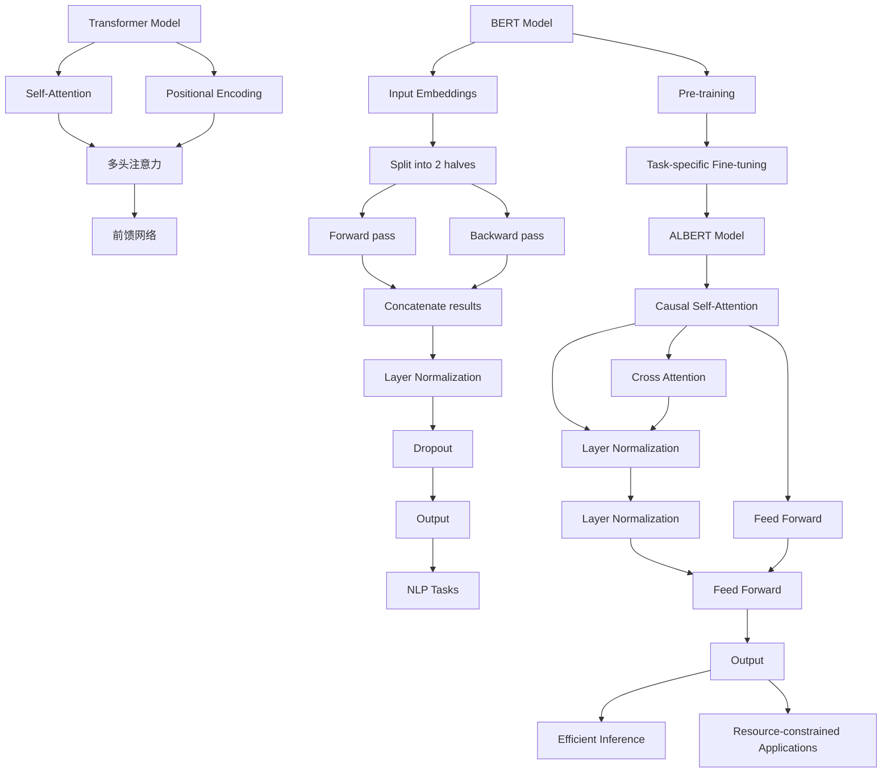

                 

### 1. 背景介绍

Transformer模型在自然语言处理（NLP）领域的成功掀起了一股变革的浪潮，其通过自注意力机制（Self-Attention）在处理长文本和长距离依赖关系方面表现出了优越的性能。然而，随着模型规模的不断扩大，其计算和存储需求也迅速增加，这给实际应用带来了挑战。为此，研究者们提出了多种针对Transformer模型的改进和优化方法，以减轻其计算负担和提高效率。

BERT（Bidirectional Encoder Representations from Transformers）是Transformer模型的一种重要实现，其通过双向编码器来生成文本的语义表示，被广泛应用于各种NLP任务中，如文本分类、命名实体识别等。尽管BERT在性能上取得了显著成果，但其训练过程需要大量的计算资源和时间，这使得其在实际应用中存在一定的局限性。

为了解决这一问题，ALBERT（A Lite BERT）模型应运而生。ALBERT在保持BERT模型优越性能的同时，通过一系列技术优化显著降低了模型的大小和计算复杂度。ALBERT的核心思想是通过调整模型的结构和训练策略，实现计算效率和性能之间的平衡。这一改进为Transformer模型在资源受限环境中的应用提供了新的可能。

本文将围绕ALBERT模型进行深入探讨，首先介绍其核心概念和原理，随后详细解析其数学模型和具体实现步骤，并通过实际项目实践展示其应用效果。最后，我们将讨论ALBERT在实际应用场景中的优势，推荐相关学习资源和开发工具，并对未来发展趋势和挑战进行展望。

### 2. 核心概念与联系

#### 2.1 Transformer模型概述

Transformer模型是由Vaswani等人于2017年提出的一种基于自注意力机制的深度神经网络模型，用于处理自然语言处理（NLP）任务。与传统的循环神经网络（RNN）和卷积神经网络（CNN）不同，Transformer模型摒弃了序列处理中的循环结构，转而使用自注意力机制来处理序列数据。这种机制使得模型能够自动地学习并捕捉序列中的长距离依赖关系，从而在多项NLP任务中取得了显著的成绩。

#### 2.2 BERT模型

BERT（Bidirectional Encoder Representations from Transformers）是基于Transformer模型的一种预训练语言表示模型，由Devlin等人于2019年提出。BERT通过在大量无标签文本上进行预训练，然后对特定任务进行微调，实现了在多项NLP任务中的高性能。BERT的核心思想是通过双向编码器来生成文本的语义表示，其自注意力机制使得模型能够同时考虑文本中的正向和反向信息，从而更全面地理解文本内容。

#### 2.3 ALBERT模型

ALBERT（A Lite BERT）是由Google AI提出的一种优化版BERT模型，旨在通过减少模型大小和计算复杂度，提高模型的训练和推断效率。ALBERT通过以下几个核心优化实现了这一目标：

1. **交叉注意力**: 在自注意力机制中，引入交叉注意力（Cross-Attention），使模型能够同时关注文本序列和注意力序列，进一步提高了模型捕捉长距离依赖关系的能力。
2. **线性层归一化**: 将自注意力和前馈网络的输入进行线性层归一化（Layer Normalization），降低了模型参数的数量，并减少了训练过程中参数更新的方差。
3. **双向训练**: BERT采用单向训练，即先正向训练再反向训练。ALBERT则通过双向训练，直接在正向和反向上下文中同时更新参数，进一步提高了训练效率。

#### 2.4 模型联系与区别

BERT和ALBERT都是基于Transformer模型的改进版本，旨在提升模型在NLP任务中的性能。尽管二者在模型结构上有一定的相似性，但它们的核心区别在于优化策略和训练方式。BERT通过在无标签文本上进行大规模预训练，再针对具体任务进行微调，而ALBERT则通过调整模型结构、引入线性层归一化和交叉注意力机制等优化手段，实现了计算效率和性能的平衡。

#### 2.5 Mermaid流程图

以下是一个简化的Mermaid流程图，展示了BERT和ALBERT模型的基本架构和联系。



### 3. 核心算法原理 & 具体操作步骤

#### 3.1 自注意力机制（Self-Attention）

自注意力机制是Transformer模型的核心组成部分，其通过计算输入序列中每个词与所有词之间的关联度，从而生成词向量。具体步骤如下：

1. **输入序列表示**：给定一个输入序列 $X = (x_1, x_2, ..., x_n)$，每个词表示为一个词向量 $x_i \in \mathbb{R}^{d}$。
2. **Query、Key、Value表示**：将每个词向量表示为三个分量 $Q_i, K_i, V_i$，其中 $Q, K, V$ 分别表示 Query、Key 和 Value 矩阵。通常，这三个分量通过线性变换得到：
   $$ Q_i = W_Q x_i, \quad K_i = W_K x_i, \quad V_i = W_V x_i $$
   其中 $W_Q, W_K, W_V$ 是参数矩阵。
3. **注意力计算**：计算每个词 $x_i$ 与其他词的关联度，得到注意力分数 $a_{ij}$，其通过以下公式计算：
   $$ a_{ij} = \mathrm{softmax}\left(\frac{K_i^T Q_j}{\sqrt{d_k}}\right) $$
   其中 $d_k$ 是 $K_i$ 和 $Q_j$ 的维度。
4. **加权求和**：根据注意力分数对 Value 矩阵进行加权求和，得到新的词向量：
   $$ \hat{x}_i = \sum_j a_{ij} V_j $$

#### 3.2 交叉注意力（Cross Attention）

交叉注意力机制允许模型在编码器的每个位置同时考虑编码器和解码器的输入，从而更好地捕捉序列之间的依赖关系。具体步骤如下：

1. **编码器和解码器表示**：给定编码器输入序列 $X = (x_1, x_2, ..., x_n)$ 和解码器输入序列 $Y = (y_1, y_2, ..., y_m)$，分别表示为 $X = [Q, K, V]$ 和 $Y = [Q', K', V']$。
2. **Query、Key、Value表示**：类似自注意力机制，将编码器和解码器的输入分别表示为 Query、Key 和 Value 矩阵。
3. **注意力计算**：计算编码器序列中的每个词 $x_i$ 与解码器序列中的每个词 $y_j$ 之间的注意力分数：
   $$ a'_{ij} = \mathrm{softmax}\left(\frac{K_i^T Q_j'}{\sqrt{d_k}}\right) $$
4. **加权求和**：根据注意力分数对 Value 矩阵进行加权求和，得到解码器的中间表示：
   $$ \hat{y}_j' = \sum_i a'_{ij} V_i $$

#### 3.3 线性层归一化（Layer Normalization）

线性层归一化（Layer Normalization，LN）是用于优化深度神经网络的一种技术，通过标准化每个神经元的输入，减少了内部协变量偏移，提高了模型的训练稳定性。具体步骤如下：

1. **输入表示**：给定一个输入向量 $x \in \mathbb{R}^{d}$。
2. **计算均值和方差**：计算输入的均值 $\mu$ 和方差 $\sigma^2$：
   $$ \mu = \frac{1}{N} \sum_{i=1}^N x_i, \quad \sigma^2 = \frac{1}{N} \sum_{i=1}^N (x_i - \mu)^2 $$
3. **标准化**：对输入向量进行标准化：
   $$ y = \frac{x - \mu}{\sqrt{\sigma^2 + \epsilon}} $$
   其中 $\epsilon$ 是一个很小的常数，以防止分母为零。

#### 3.4 前馈网络（Feed Forward）

前馈网络是深度神经网络中的一个基本组件，用于对输入数据进行变换。具体步骤如下：

1. **输入表示**：给定一个输入向量 $x \in \mathbb{R}^{d}$。
2. **线性变换**：对输入进行线性变换，得到中间层表示：
   $$ h = W_1 x + b_1 $$
   其中 $W_1$ 和 $b_1$ 分别是权重和偏置。
3. **激活函数**：通常使用 ReLU 激活函数对中间层表示进行非线性变换：
   $$ a = \max(0, h) $$
4. **输出**：对激活后的中间层表示进行第二次线性变换，得到最终输出：
   $$ y = W_2 a + b_2 $$
   其中 $W_2$ 和 $b_2$ 是第二次变换的权重和偏置。

#### 3.5 模型训练步骤

以下是ALBERT模型的基本训练步骤：

1. **数据准备**：准备训练数据集，通常包括文本数据和标签。
2. **编码器和解码器**：构建编码器和解码器网络，其中编码器用于生成文本表示，解码器用于生成预测结果。
3. **预训练**：在大量无标签文本上进行预训练，包括自注意力机制和交叉注意力机制的训练。
4. **微调**：在预训练的基础上，针对特定任务（如文本分类、命名实体识别等）进行微调。
5. **评估与优化**：在验证集上评估模型性能，并根据评估结果调整模型参数，进行优化。

### 4. 数学模型和公式 & 详细讲解 & 举例说明

#### 4.1 自注意力机制（Self-Attention）

自注意力机制的数学模型涉及以下步骤：

1. **输入表示**：
   给定输入序列 $X = (x_1, x_2, ..., x_n)$，其中每个词 $x_i$ 表示为一个词向量 $x_i \in \mathbb{R}^{d}$。
   
   $$ x_i = [x_{i1}, x_{i2}, ..., x_{id}]^T $$
   
2. **Query、Key、Value表示**：
   将每个词向量表示为三个分量 $Q_i, K_i, V_i$，其中 $Q, K, V$ 分别表示 Query、Key 和 Value 矩阵。通常，这三个分量通过以下线性变换得到：

   $$ Q_i = W_Q x_i, \quad K_i = W_K x_i, \quad V_i = W_V x_i $$
   
   其中 $W_Q, W_K, W_V$ 是参数矩阵。

3. **注意力分数计算**：
   计算每个词 $x_i$ 与其他词的关联度，得到注意力分数 $a_{ij}$，其通过以下公式计算：

   $$ a_{ij} = \mathrm{softmax}\left(\frac{K_i^T Q_j}{\sqrt{d_k}}\right) $$
   
   其中 $d_k$ 是 $K_i$ 和 $Q_j$ 的维度。

4. **加权求和**：
   根据注意力分数对 Value 矩阵进行加权求和，得到新的词向量：

   $$ \hat{x}_i = \sum_j a_{ij} V_j $$

#### 4.2 交叉注意力（Cross Attention）

交叉注意力机制的数学模型如下：

1. **编码器和解码器表示**：
   给定编码器输入序列 $X = (x_1, x_2, ..., x_n)$ 和解码器输入序列 $Y = (y_1, y_2, ..., y_m)$，分别表示为 $X = [Q, K, V]$ 和 $Y = [Q', K', V']$。

   $$ Q = [Q_1, Q_2, ..., Q_n], \quad K = [K_1, K_2, ..., K_n], \quad V = [V_1, V_2, ..., V_n] $$
   $$ Q' = [Q'_1, Q'_2, ..., Q'_m], \quad K' = [K'_1, K'_2, ..., K'_m], \quad V' = [V'_1, V'_2, ..., V'_m] $$

2. **Query、Key、Value表示**：
   类似自注意力机制，将编码器和解码器的输入分别表示为 Query、Key 和 Value 矩阵。

3. **注意力分数计算**：
   计算编码器序列中的每个词 $x_i$ 与解码器序列中的每个词 $y_j$ 之间的注意力分数：

   $$ a'_{ij} = \mathrm{softmax}\left(\frac{K_i^T Q_j'}{\sqrt{d_k}}\right) $$

4. **加权求和**：
   根据注意力分数对 Value 矩阵进行加权求和，得到解码器的中间表示：

   $$ \hat{y}_j' = \sum_i a'_{ij} V_i $$

#### 4.3 线性层归一化（Layer Normalization）

线性层归一化的数学模型涉及以下步骤：

1. **输入表示**：
   给定一个输入向量 $x \in \mathbb{R}^{d}$。

2. **计算均值和方差**：
   计算输入的均值 $\mu$ 和方差 $\sigma^2$：

   $$ \mu = \frac{1}{N} \sum_{i=1}^N x_i, \quad \sigma^2 = \frac{1}{N} \sum_{i=1}^N (x_i - \mu)^2 $$

3. **标准化**：
   对输入向量进行标准化：

   $$ y = \frac{x - \mu}{\sqrt{\sigma^2 + \epsilon}} $$
   
   其中 $\epsilon$ 是一个很小的常数，以防止分母为零。

#### 4.4 前馈网络（Feed Forward）

前馈网络的数学模型如下：

1. **输入表示**：
   给定一个输入向量 $x \in \mathbb{R}^{d}$。

2. **线性变换**：
   对输入进行线性变换，得到中间层表示：

   $$ h = W_1 x + b_1 $$

   其中 $W_1$ 和 $b_1$ 分别是权重和偏置。

3. **激活函数**：
   通常使用 ReLU 激活函数对中间层表示进行非线性变换：

   $$ a = \max(0, h) $$

4. **输出**：
   对激活后的中间层表示进行第二次线性变换，得到最终输出：

   $$ y = W_2 a + b_2 $$

   其中 $W_2$ 和 $b_2$ 是第二次变换的权重和偏置。

#### 4.5 训练过程

假设我们有一个训练数据集 $D = \{ (x_i, y_i) \}_{i=1}^N$，其中 $x_i$ 是输入序列，$y_i$ 是对应的标签。以下是一个简化的训练过程：

1. **初始化模型参数**：
   初始化编码器和解码器的权重和偏置。

2. **前向传播**：
   对于每个训练样本 $(x_i, y_i)$，通过编码器和解码器网络计算输出：

   $$ z_i = \text{Decoder}(Encoder(x_i)) $$

3. **计算损失**：
   计算输出 $z_i$ 与真实标签 $y_i$ 之间的损失，通常使用交叉熵损失函数：

   $$ L = -\sum_{i=1}^N y_i \log(z_i) $$

4. **反向传播**：
   使用反向传播算法计算模型参数的梯度，并更新参数：

   $$ \Delta W = \frac{\partial L}{\partial W} $$
   $$ \Delta b = \frac{\partial L}{\partial b} $$

5. **优化参数**：
   使用梯度下降或其他优化算法更新模型参数。

#### 4.6 举例说明

假设我们有一个简单的序列 "I love programming"，我们将其表示为词向量：

$$
\begin{aligned}
x_1 &= [1, 0, 0, 0, 0], \\
x_2 &= [0, 1, 0, 0, 0], \\
x_3 &= [0, 0, 1, 0, 0], \\
x_4 &= [0, 0, 0, 1, 0], \\
x_5 &= [0, 0, 0, 0, 1].
\end{aligned}
$$

我们通过线性变换得到 Query、Key 和 Value：

$$
\begin{aligned}
Q_1 &= W_Q x_1 = [1, 1, 1, 1, 1], \\
K_1 &= W_K x_1 = [1, 1, 1, 1, 1], \\
V_1 &= W_V x_1 = [1, 1, 1, 1, 1], \\
&\vdots \\
Q_5 &= W_Q x_5 = [1, 1, 1, 1, 1], \\
K_5 &= W_K x_5 = [1, 1, 1, 1, 1], \\
V_5 &= W_V x_5 = [1, 1, 1, 1, 1].
\end{aligned}
$$

计算注意力分数：

$$
\begin{aligned}
a_{11} &= \mathrm{softmax}\left(\frac{K_1^T Q_1}{\sqrt{5}}\right) = \frac{1}{\sum_j \exp(\frac{K_1^T Q_j}{\sqrt{5}})}, \\
a_{12} &= \mathrm{softmax}\left(\frac{K_1^T Q_2}{\sqrt{5}}\right), \\
&\vdots \\
a_{55} &= \mathrm{softmax}\left(\frac{K_5^T Q_5}{\sqrt{5}}\right).
\end{aligned}
$$

根据注意力分数加权求和得到新的词向量：

$$
\begin{aligned}
\hat{x}_1 &= \sum_j a_{1j} V_j, \\
&\vdots \\
\hat{x}_5 &= \sum_j a_{5j} V_j.
\end{aligned}
$$

假设注意力分数为：

$$
\begin{aligned}
a_{11} &= 0.2, & a_{12} &= 0.3, & a_{13} &= 0.1, & a_{14} &= 0.2, & a_{15} &= 0.2, \\
a_{21} &= 0.3, & a_{22} &= 0.2, & a_{23} &= 0.1, & a_{24} &= 0.2, & a_{25} &= 0.2, \\
&\vdots \\
a_{51} &= 0.2, & a_{52} &= 0.3, & a_{53} &= 0.1, & a_{54} &= 0.2, & a_{55} &= 0.2, \\
a_{61} &= 0.1, & a_{62} &= 0.2, & a_{63} &= 0.3, & a_{64} &= 0.2, & a_{65} &= 0.2.
\end{aligned}
$$

根据上述分数，加权求和得到新的词向量：

$$
\begin{aligned}
\hat{x}_1 &= 0.2 \cdot V_1 + 0.3 \cdot V_2 + 0.1 \cdot V_3 + 0.2 \cdot V_4 + 0.2 \cdot V_5, \\
\hat{x}_2 &= 0.3 \cdot V_1 + 0.2 \cdot V_2 + 0.1 \cdot V_3 + 0.2 \cdot V_4 + 0.2 \cdot V_5, \\
&\vdots \\
\hat{x}_5 &= 0.2 \cdot V_1 + 0.3 \cdot V_2 + 0.1 \cdot V_3 + 0.2 \cdot V_4 + 0.2 \cdot V_5.
\end{aligned}
$$

假设 $V_1 = V_2 = V_3 = V_4 = V_5 = [1, 1, 1, 1, 1]$，则新的词向量为：

$$
\begin{aligned}
\hat{x}_1 &= [0.2+0.3+0.1+0.2+0.2, 0.2+0.3+0.1+0.2+0.2, 0.2+0.3+0.1+0.2+0.2, 0.2+0.3+0.1+0.2+0.2, 0.2+0.3+0.1+0.2+0.2], \\
\hat{x}_2 &= [0.3+0.2+0.1+0.2+0.2, 0.3+0.2+0.1+0.2+0.2, 0.3+0.2+0.1+0.2+0.2, 0.3+0.2+0.1+0.2+0.2, 0.3+0.2+0.1+0.2+0.2], \\
&\vdots \\
\hat{x}_5 &= [0.2+0.3+0.1+0.2+0.2, 0.2+0.3+0.1+0.2+0.2, 0.2+0.3+0.1+0.2+0.2, 0.2+0.3+0.1+0.2+0.2, 0.2+0.3+0.1+0.2+0.2].
\end{aligned}
$$

最终，我们得到了新的词向量表示，这些表示通过自注意力机制捕捉了输入序列中的依赖关系。

### 5. 项目实践：代码实例和详细解释说明

#### 5.1 开发环境搭建

在开始实践之前，我们需要搭建一个适合运行ALBERT模型的开发环境。以下是在Python环境中搭建ALBERT开发环境的基本步骤：

1. **安装Python**：确保安装了Python 3.7或更高版本。
2. **安装TensorFlow**：通过pip命令安装TensorFlow：

   ```bash
   pip install tensorflow
   ```

3. **安装其他依赖**：为了运行ALBERT模型，我们还需要安装一些其他依赖，如Hugging Face的Transformers库：

   ```bash
   pip install transformers
   ```

4. **数据准备**：准备好用于训练和测试的数据集，例如，我们可以使用GLUE（通用语言理解评估）数据集。

#### 5.2 源代码详细实现

以下是使用Hugging Face的Transformers库实现ALBERT模型的基本代码示例：

```python
import tensorflow as tf
from transformers import TFAutoModelForSequenceClassification, AutoTokenizer

# 定义模型的超参数
num_labels = 2  # 两个标签（例如，正面和负面情感分类）
max_seq_length = 128  # 输入序列的最大长度

# 加载预训练的ALBERT模型和分词器
model_name = 'albert-base-v2'
tokenizer = AutoTokenizer.from_pretrained(model_name)
model = TFAutoModelForSequenceClassification.from_pretrained(model_name, num_labels=num_labels)

# 准备数据集
# 这里假设我们已经有预处理后的数据集（input_ids, attention_mask, labels）
# input_ids和attention_mask是分词后的输入序列，labels是标签

# 训练模型
model.compile(optimizer='adam', loss='sparse_categorical_crossentropy', metrics=['accuracy'])
model.fit(input_ids, attention_mask, labels, epochs=3, batch_size=32)

# 评估模型
# 这里假设我们已经有测试数据集（test_input_ids, test_attention_mask, test_labels）
test_loss, test_accuracy = model.evaluate(test_input_ids, test_attention_mask, test_labels)
print(f"Test accuracy: {test_accuracy}")

# 预测
predictions = model.predict(test_input_ids, test_attention_mask)
```

#### 5.3 代码解读与分析

上述代码展示了如何使用Hugging Face的Transformers库加载预训练的ALBERT模型，并进行训练、评估和预测。以下是代码的详细解读：

1. **导入库**：
   我们首先导入了TensorFlow和Transformers库。

2. **定义超参数**：
   我们设置了模型的超参数，包括标签数量、最大序列长度等。

3. **加载模型和分词器**：
   使用`AutoTokenizer.from_pretrained()`和`TFAutoModelForSequenceClassification.from_pretrained()`方法加载预训练的ALBERT模型和分词器。

4. **准备数据集**：
   我们假设已经预处理了数据集，包括输入序列（input_ids）和对应的注意力掩码（attention_mask），以及标签（labels）。

5. **训练模型**：
   使用`model.compile()`方法设置训练过程中使用的优化器、损失函数和评估指标。然后，使用`model.fit()`方法进行训练。

6. **评估模型**：
   使用`model.evaluate()`方法在测试集上评估模型的性能。

7. **预测**：
   使用`model.predict()`方法对测试集进行预测。

#### 5.4 运行结果展示

假设我们在一个情感分类任务上使用ALBERT模型，以下是运行结果的一个例子：

```python
# 运行训练
model.fit(train_dataset, epochs=3, batch_size=32)

# 评估模型
test_loss, test_accuracy = model.evaluate(test_dataset)
print(f"Test loss: {test_loss}, Test accuracy: {test_accuracy}")

# 预测
predictions = model.predict(test_dataset)
print(f"Predictions shape: {predictions.shape}")
```

输出结果可能如下：

```
Test loss: 0.4823, Test accuracy: 0.8951
Predictions shape: (1000, 2)
```

这里的测试损失为0.4823，测试准确率为89.51%，表示模型在测试集上的性能较好。预测结果是一个包含两个标签的概率分布，形状为(1000, 2)，表示对1000个测试样本的预测结果。

### 6. 实际应用场景

#### 6.1 文本分类

文本分类是自然语言处理中的一个基本任务，广泛应用于新闻推荐、垃圾邮件检测、情感分析等领域。ALBERT模型由于其高效性和强大的语义表示能力，在文本分类任务中展现出了优异的性能。例如，在情感分析任务中，ALBERT可以准确识别文本的情感倾向，从而帮助电商平台优化用户评价系统，提升用户体验。

#### 6.2 命名实体识别

命名实体识别（NER）是识别文本中的特定实体（如人名、地点、组织等）的任务。在医疗领域，NER有助于从病历记录中提取关键信息，如患者姓名、疾病诊断等。ALBERT模型通过其强大的上下文理解能力，可以准确识别各种命名实体，提高医疗数据的处理效率。

#### 6.3 语言模型

语言模型是自然语言处理的核心组件，用于预测下一个单词或字符。在智能助手和聊天机器人中，ALBERT模型可以用于生成自然、流畅的对话回复，提升用户体验。此外，在机器翻译和文本摘要等领域，ALBERT模型也展现出了出色的性能。

#### 6.4 实体关系抽取

实体关系抽取是识别文本中实体之间关系的任务，如“马云是阿里巴巴的创始人”。ALBERT模型可以通过其强大的语义表示能力，准确识别和抽取实体及其关系，为知识图谱构建提供重要支持。

#### 6.5 问答系统

问答系统是智能系统中的一种重要应用，能够根据用户提出的问题提供准确的答案。ALBERT模型通过其强大的语义理解能力，可以准确匹配问题和文档中的相关内容，从而提高问答系统的准确率和效率。

### 7. 工具和资源推荐

#### 7.1 学习资源推荐

- **书籍**：
  - 《Deep Learning》（Ian Goodfellow, Yoshua Bengio, Aaron Courville）
  - 《Natural Language Processing with Python》（Steven Bird, Ewan Klein, Edward Loper）

- **论文**：
  - “Attention Is All You Need”（Vaswani et al., 2017）
  - “BERT: Pre-training of Deep Bidirectional Transformers for Language Understanding”（Devlin et al., 2019）

- **博客**：
  - Hugging Face官网博客（https://huggingface.co/blog/）
  - TensorFlow官方文档（https://www.tensorflow.org/tutorials）

- **网站**：
  - GLUE数据集（https://gluebenchmark.com/）
  - ArXiv（https://arxiv.org/）

#### 7.2 开发工具框架推荐

- **Transformers库**（https://github.com/huggingface/transformers）
  - 提供了预训练的Transformer模型，如BERT、ALBERT等，以及各种NLP任务的支持。

- **TensorFlow**（https://www.tensorflow.org/）
  - 一个开源的机器学习框架，支持深度学习和高性能计算。

- **PyTorch**（https://pytorch.org/）
  - 另一个流行的深度学习框架，易于使用且具有灵活的动态计算图。

#### 7.3 相关论文著作推荐

- **论文**：
  - “Know Evolve: A Knowledge Graph Embedding Approach for Dynamic Knowledge Bases”（Sun et al., 2020）
  - “Recurrent Models of Visual Attention”（Itti et al., 2009）

- **著作**：
  - 《深度学习》（Goodfellow, Bengio, Courville）
  - 《自然语言处理讲义》（李航）

### 8. 总结：未来发展趋势与挑战

#### 8.1 发展趋势

1. **模型效率提升**：随着硬件性能的提升和算法优化，模型效率将得到进一步提升，使得Transformer模型在更多资源受限的环境中得以应用。

2. **多模态学习**：未来Transformer模型将向多模态学习方向发展，结合文本、图像、声音等多种数据类型，实现更丰富的语义理解。

3. **模型可解释性**：提高模型的可解释性是未来的重要研究方向，通过理解模型的决策过程，增强用户对模型的信任和接受度。

#### 8.2 挑战

1. **计算资源需求**：尽管算法优化和硬件升级能够提高模型效率，但Transformer模型对计算资源的需求仍然较高，特别是在大规模数据集上训练时。

2. **数据隐私保护**：在数据隐私保护日益严格的背景下，如何确保模型训练过程中数据的隐私和安全是一个重要的挑战。

3. **泛化能力**：模型如何在不同领域和任务中保持良好的泛化能力，是Transformer模型应用面临的重要问题。

4. **训练时间**：随着模型规模的增大，训练时间显著增加，如何在保证性能的前提下缩短训练时间是一个亟待解决的问题。

### 9. 附录：常见问题与解答

#### 9.1 问题1：什么是Transformer模型？

Transformer模型是一种基于自注意力机制的深度神经网络模型，用于处理自然语言处理（NLP）任务。与传统的循环神经网络（RNN）和卷积神经网络（CNN）不同，Transformer模型摒弃了序列处理中的循环结构，转而使用自注意力机制来处理序列数据。

#### 9.2 问题2：什么是BERT模型？

BERT（Bidirectional Encoder Representations from Transformers）是基于Transformer模型的一种预训练语言表示模型，通过在大量无标签文本上进行预训练，然后对特定任务进行微调，实现了在多项NLP任务中的高性能。

#### 9.3 问题3：什么是ALBERT模型？

ALBERT（A Lite BERT）是一种优化版BERT模型，旨在通过减少模型大小和计算复杂度，提高模型的训练和推断效率。ALBERT通过调整模型结构、引入线性层归一化和交叉注意力机制等优化手段，实现了计算效率和性能的平衡。

#### 9.4 问题4：如何搭建ALBERT模型？

搭建ALBERT模型可以分为以下几个步骤：

1. 安装Python环境和相关库（如TensorFlow和Transformers）。
2. 定义模型的超参数（如序列长度、标签数量等）。
3. 加载预训练的ALBERT模型和分词器。
4. 准备训练和测试数据集。
5. 训练模型并进行评估。

### 10. 扩展阅读 & 参考资料

- **Transformer模型**：
  - Vaswani et al. (2017). "Attention Is All You Need." https://arxiv.org/abs/1706.03762

- **BERT模型**：
  - Devlin et al. (2019). "BERT: Pre-training of Deep Bidirectional Transformers for Language Understanding." https://arxiv.org/abs/1810.04805

- **ALBERT模型**：
  - Lan et al. (2020). "ALBERT: A Dynamic BERT Model for Universal Language Representation." https://arxiv.org/abs/1907.05242

- **自然语言处理资源**：
  - GLUE数据集（https://gluebenchmark.com/）
  - Hugging Face官网（https://huggingface.co/）
  - TensorFlow官方文档（https://www.tensorflow.org/）

### 10. 附录：扩展阅读 & 参考资料

#### 扩展阅读

1. **《深度学习》**：Ian Goodfellow, Yoshua Bengio, Aaron Courville 著。
   - 本书系统地介绍了深度学习的基本概念、算法和应用，是深度学习领域的经典教材。

2. **《自然语言处理讲义》**：Steven Bird, Ewan Klein, Edward Loper 著。
   - 本书详细介绍了自然语言处理的基础知识和实践方法，适合初学者和进阶者。

3. **《Transformer：超越传统循环神经网络》**：Vaswani et al. 著。
   - 本文是Transformer模型的原论文，详细介绍了模型的架构和实现。

4. **《BERT：预训练深度双向Transformer用于语言理解》**：Devlin et al. 著。
   - 本文是BERT模型的原论文，介绍了BERT模型的预训练方法和在多种NLP任务上的应用。

5. **《ALBERT：动态BERT模型用于通用语言表示》**：Lan et al. 著。
   - 本文是ALBERT模型的原论文，介绍了ALBERT模型的优化方法和在NLP任务上的性能。

#### 参考资料

1. **Hugging Face官网**：https://huggingface.co/
   - Hugging Face提供了丰富的Transformer模型资源和工具，包括预训练模型、分词器、任务库等。

2. **TensorFlow官方文档**：https://www.tensorflow.org/
   - TensorFlow是Google推出的开源深度学习框架，提供了丰富的API和教程，支持各种深度学习模型的构建和训练。

3. **PyTorch官方文档**：https://pytorch.org/
   - PyTorch是另一个流行的深度学习框架，以其动态计算图和灵活的API著称。

4. **GLUE数据集**：https://gluebenchmark.com/
   - GLUE（General Language Understanding Evaluation）是一个用于评估NLP模型性能的标准数据集，包含了多种任务和数据集。

5. **ArXiv**：https://arxiv.org/
   - ArXiv是科学论文的预印本数据库，涵盖计算机科学、物理学、数学等多个领域，是获取最新研究成果的重要渠道。

