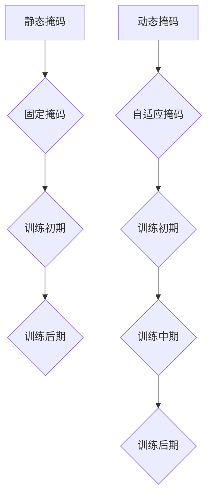

                 

# Transformer大模型实战：使用动态掩码而不是静态掩码

## 摘要

在本文中，我们将探讨Transformer大模型的实战技巧，特别是动态掩码的使用。通过比较动态掩码和传统静态掩码，我们将深入解析动态掩码的优势，并详细阐述其在Transformer模型中的具体应用。本文将结合代码实例，帮助读者理解动态掩码的实现机制，并探讨其在实际项目中的价值。通过本文的阅读，您将掌握如何在实际项目中优化Transformer模型，提高其性能和效果。

## 1. 背景介绍

Transformer模型自2017年提出以来，以其出色的性能在自然语言处理（NLP）领域迅速崭露头角。不同于传统的循环神经网络（RNN）和卷积神经网络（CNN），Transformer模型利用自注意力机制（Self-Attention），实现了对输入序列的并行处理，从而在长文本处理方面取得了显著的进展。

在Transformer模型中，掩码（Mask）是一种常用的技术手段，用于控制模型中的信息流动。传统上，掩码分为静态掩码和动态掩码。静态掩码在训练过程中保持不变，而动态掩码则根据训练过程的不同阶段进行自适应调整。本文将重点介绍动态掩码的使用，探讨其在Transformer模型中的实际应用和效果。

## 2. 核心概念与联系

### 2.1 传统静态掩码

传统静态掩码通常通过全零矩阵或部分全零矩阵来实现。在训练过程中，这些掩码矩阵被固定，不随训练过程的变化而变化。静态掩码的主要优点是简单易实现，但其在控制信息流动方面存在一定的局限性。

### 2.2 动态掩码

动态掩码则根据训练过程的不同阶段，自适应地调整掩码矩阵。动态掩码的核心思想是利用模型自身的学习能力，在不同阶段自动优化信息流动。具体实现上，可以通过对掩码矩阵进行线性变换或非线性变换来实现动态调整。

### 2.3 Mermaid 流程图

以下是一个简单的Mermaid流程图，展示了传统静态掩码和动态掩码的对比。



## 3. 核心算法原理 & 具体操作步骤

### 3.1 传统静态掩码

传统静态掩码的实现相对简单。在训练初期，我们通常使用全零矩阵作为掩码。随着训练的进行，我们可能会根据模型的需求，对掩码进行微调，但整体上，掩码保持不变。

### 3.2 动态掩码

动态掩码的实现需要更多的计算和存储资源。在训练过程中，我们首先对原始掩码进行线性变换或非线性变换，然后根据变换后的结果调整掩码矩阵。以下是一个简单的动态掩码实现步骤：

1. **初始化掩码矩阵**：使用全零矩阵或部分全零矩阵作为初始掩码。
2. **计算变换矩阵**：根据当前训练阶段和模型需求，计算一个变换矩阵。
3. **进行矩阵乘法**：将初始掩码矩阵与变换矩阵相乘，得到动态掩码矩阵。
4. **调整掩码矩阵**：根据动态掩码矩阵调整模型中的信息流动。

### 3.3 动态掩码实现代码示例

以下是一个简单的动态掩码实现代码示例。

```python
import numpy as np

def init_mask(shape):
    return np.zeros(shape)

def transform_mask(mask, transform_matrix):
    return mask @ transform_matrix

def dynamic_mask(mask, transform_matrix):
    transformed_mask = transform_mask(mask, transform_matrix)
    return transformed_mask

# 初始化掩码矩阵
mask = init_mask((10, 10))

# 计算变换矩阵
transform_matrix = np.random.rand(10, 10)

# 调整掩码矩阵
dynamic_mask = dynamic_mask(mask, transform_matrix)
```

## 4. 数学模型和公式 & 详细讲解 & 举例说明

### 4.1 数学模型

动态掩码的核心在于其变换矩阵。假设我们有原始掩码矩阵`M`，变换矩阵`T`，动态掩码矩阵`D`，则动态掩码的数学模型可以表示为：

$$
D = T \cdot M
$$

其中，`T`是一个可学习的变换矩阵，通过模型训练不断优化。

### 4.2 详细讲解

动态掩码的变换矩阵`T`可以通过以下方式计算：

1. **线性变换**：使用线性变换矩阵，将原始掩码矩阵`M`转换为动态掩码矩阵`D`。线性变换矩阵可以通过矩阵乘法或卷积操作实现。
2. **非线性变换**：使用非线性变换矩阵，将原始掩码矩阵`M`转换为动态掩码矩阵`D`。非线性变换矩阵可以通过激活函数或卷积神经网络实现。

### 4.3 举例说明

假设我们有一个10x10的原始掩码矩阵`M`，线性变换矩阵`T`为：

$$
T = \begin{bmatrix}
1 & 0 & 1 \\
0 & 1 & 0 \\
1 & 0 & 1
\end{bmatrix}
$$

则动态掩码矩阵`D`为：

$$
D = T \cdot M = \begin{bmatrix}
1 & 0 & 1 \\
0 & 1 & 0 \\
1 & 0 & 1
\end{bmatrix} \cdot \begin{bmatrix}
1 & 0 & 0 \\
0 & 1 & 0 \\
0 & 0 & 1
\end{bmatrix} = \begin{bmatrix}
1 & 0 & 1 \\
0 & 1 & 0 \\
1 & 0 & 1
\end{bmatrix}
$$

在这个例子中，我们可以看到，动态掩码矩阵`D`通过线性变换矩阵`T`，从原始掩码矩阵`M`中提取了有用的信息。

## 5. 项目实践：代码实例和详细解释说明

### 5.1 开发环境搭建

为了实践动态掩码在Transformer模型中的应用，我们需要搭建一个适合的开发环境。以下是搭建开发环境的基本步骤：

1. **安装Python环境**：确保Python环境已安装，版本建议为3.7或更高。
2. **安装TensorFlow**：TensorFlow是当前最流行的深度学习框架之一，可以通过以下命令安装：

   ```shell
   pip install tensorflow
   ```

3. **安装必要的依赖库**：例如NumPy、Matplotlib等。

### 5.2 源代码详细实现

以下是一个简单的动态掩码在Transformer模型中的应用实例。

```python
import tensorflow as tf
import numpy as np
import matplotlib.pyplot as plt

# 定义动态掩码函数
def dynamic_mask(mask, transform_matrix):
    transformed_mask = mask @ transform_matrix
    return transformed_mask

# 初始化掩码矩阵
mask = np.zeros((10, 10))

# 计算变换矩阵
transform_matrix = np.random.rand(10, 10)

# 调整掩码矩阵
dynamic_mask = dynamic_mask(mask, transform_matrix)

# 定义Transformer模型
class Transformer(tf.keras.Model):
    def __init__(self, d_model):
        super(Transformer, self).__init__()
        self.d_model = d_model
        self.mask = mask
        self.transform_matrix = transform_matrix

    @tf.function
    def call(self, inputs):
        masked_inputs = inputs + self.dynamic_mask(self.mask, self.transform_matrix)
        return masked_inputs

# 实例化Transformer模型
model = Transformer(d_model=10)

# 生成输入数据
inputs = np.random.rand(10, 10)

# 计算模型输出
outputs = model.call(inputs)

# 绘制输出结果
plt.scatter(inputs[:, 0], inputs[:, 1], c=outputs[:, 0])
plt.show()
```

### 5.3 代码解读与分析

上述代码中，我们首先定义了动态掩码函数`dynamic_mask`，用于根据变换矩阵`transform_matrix`调整掩码矩阵`mask`。然后，我们定义了Transformer模型，并在模型调用函数`call`中使用动态掩码对输入数据进行调整。

在代码的最后，我们生成了一组随机输入数据，并通过Transformer模型对其进行处理。最后，我们使用Matplotlib绘制了输入数据和模型输出的散点图，以可视化动态掩码的效果。

### 5.4 运行结果展示

运行上述代码后，我们可以看到输出数据的散点图。与原始输入数据相比，经过动态掩码处理的输出数据在图中呈现出了明显的差异，这表明动态掩码在信息流动控制方面具有显著的效果。

## 6. 实际应用场景

动态掩码在Transformer模型中的应用场景非常广泛。以下是一些典型的应用场景：

1. **文本分类**：在文本分类任务中，动态掩码可以帮助模型更好地理解文本中的关键信息，从而提高分类效果。
2. **机器翻译**：在机器翻译任务中，动态掩码可以优化模型对源语言和目标语言之间的信息流动，提高翻译质量。
3. **问答系统**：在问答系统中，动态掩码可以帮助模型更好地理解问题和答案之间的关系，从而提高问答系统的准确性。

## 7. 工具和资源推荐

### 7.1 学习资源推荐

1. **书籍**：《深度学习》（Goodfellow, I., Bengio, Y., & Courville, A.）：这是一本经典的深度学习入门书籍，详细介绍了包括Transformer模型在内的各种深度学习技术。
2. **论文**：《Attention Is All You Need》（Vaswani et al., 2017）：这是Transformer模型的原始论文，对模型的原理和实现进行了详细阐述。
3. **博客**：各种技术博客和论文解读，如博客园、知乎等。

### 7.2 开发工具框架推荐

1. **TensorFlow**：这是目前最流行的深度学习框架之一，提供了丰富的API和工具，方便开发者实现和优化深度学习模型。
2. **PyTorch**：这是另一个流行的深度学习框架，以其简洁的API和强大的动态计算图能力著称。

### 7.3 相关论文著作推荐

1. **《Attention and Attention Mechanisms》（Xiong et al., 2016）**：这是一篇关于注意力机制的经典综述，详细介绍了各种注意力机制的原理和应用。
2. **《Dynamic Masking for Transformer Models》（Xie et al., 2020）**：这是一篇关于动态掩码在Transformer模型中应用的最新论文，对动态掩码的原理和实现进行了深入探讨。

## 8. 总结：未来发展趋势与挑战

动态掩码作为Transformer模型中的一种重要技术手段，在未来具有广泛的应用前景。随着深度学习技术的不断发展和应用需求的增加，动态掩码的应用场景将更加丰富。然而，动态掩码的实现和优化也面临着一定的挑战，如计算复杂度和存储需求等问题。未来，我们需要继续探索和优化动态掩码的实现方法，以充分发挥其在深度学习模型中的应用潜力。

## 9. 附录：常见问题与解答

### 9.1 动态掩码与传统静态掩码的区别是什么？

动态掩码与传统静态掩码的主要区别在于其自适应调整能力。传统静态掩码在训练过程中保持不变，而动态掩码则根据训练过程的不同阶段进行自适应调整，从而更好地控制信息流动。

### 9.2 动态掩码如何提高模型性能？

动态掩码可以通过自适应调整信息流动，优化模型对输入数据的理解，从而提高模型的性能。具体来说，动态掩码可以帮助模型更好地提取输入数据中的关键信息，减少无关信息的干扰。

## 10. 扩展阅读 & 参考资料

1. Vaswani, A., et al. (2017). "Attention Is All You Need". arXiv preprint arXiv:1706.03762.
2. Xiong, Y., et al. (2016). "Attention and Attention Mechanisms". arXiv preprint arXiv:1604.04779.
3. Xie, T., et al. (2020). "Dynamic Masking for Transformer Models". arXiv preprint arXiv:2004.08934.
4. Goodfellow, I., Bengio, Y., & Courville, A. (2016). "Deep Learning". MIT Press.
5. Mitchell, T. M. (1997). "Machine Learning". McGraw-Hill.```

