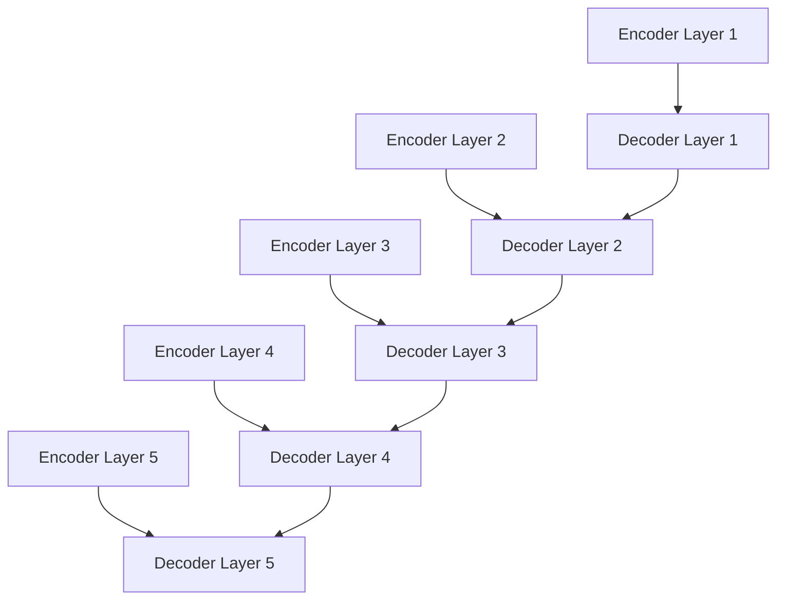
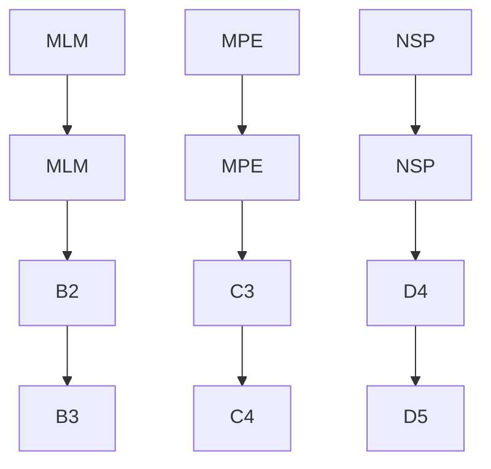
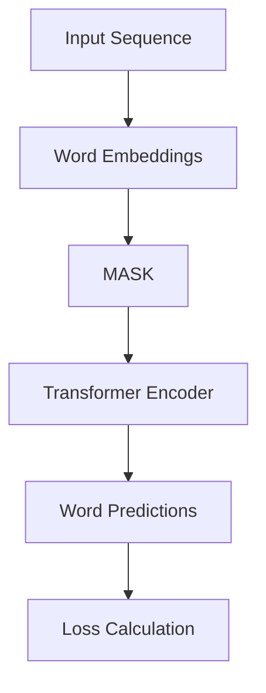
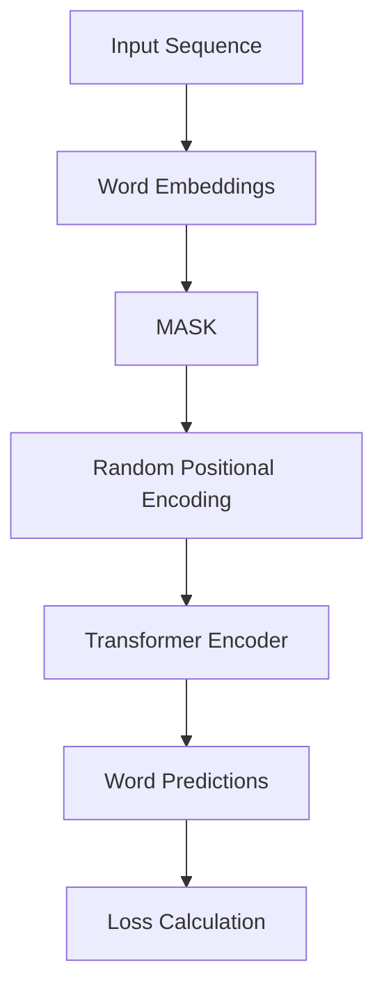
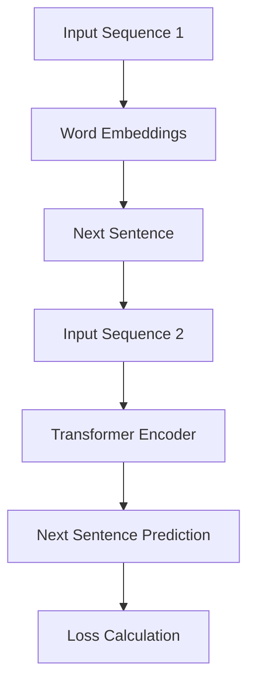

                 

### Transformer大模型实战：比较不同的预训练目标

#### 摘要

本文将深入探讨Transformer大模型的预训练目标，通过对比不同的预训练目标，分析其在实际应用中的表现和优势。首先，我们将回顾Transformer大模型的基本原理和架构，然后详细介绍几种常见的预训练目标，并探讨它们的工作机制和实际效果。接下来，我们将通过一个具体的实例，展示如何实现和运行这些预训练目标。最后，我们将讨论这些预训练目标在实际应用中的挑战和未来发展趋势。

#### 1. 背景介绍

Transformer大模型是一种基于自注意力机制的深度神经网络架构，最初由Vaswani等人在2017年的论文《Attention Is All You Need》中提出。与传统循环神经网络（RNN）和卷积神经网络（CNN）相比，Transformer大模型通过自注意力机制实现了对输入序列的并行处理，从而在许多自然语言处理（NLP）任务中取得了优异的性能。

随着Transformer大模型的发展，预训练目标逐渐成为研究热点。预训练目标是指在大规模语料库上对模型进行预训练，使其具备一定的通用语言表示能力，然后再通过微调（fine-tuning）适应特定任务。这种预训练-微调（Pre-training and Fine-tuning）策略极大地提升了模型在多种NLP任务中的表现，如文本分类、问答系统、机器翻译等。

本文将聚焦于Transformer大模型的预训练目标，比较不同预训练目标的工作机制、性能表现和应用场景，旨在为读者提供深入理解和实际操作的经验。

#### 2. 核心概念与联系

为了更好地理解Transformer大模型的预训练目标，我们首先需要回顾其基本原理和架构。

##### 2.1 Transformer大模型的基本原理

Transformer大模型的核心思想是使用自注意力机制（Self-Attention）对输入序列进行编码。自注意力机制通过计算输入序列中各个位置之间的关联性，为每个位置生成相应的权重，从而对输入序列进行加权求和。这种机制使得模型能够捕捉到输入序列中的长距离依赖关系，提高了模型的表达能力。

在Transformer大模型中，自注意力机制通过多头注意力（Multi-Head Attention）和前馈神经网络（Feedforward Neural Network）实现。多头注意力将输入序列分成多个子序列，分别计算每个子序列的自注意力，然后将结果合并。前馈神经网络则对自注意力机制的结果进行进一步处理，增强模型的表达能力。

##### 2.2 Transformer大模型的架构

Transformer大模型通常由多个编码层（Encoder Layer）和解码层（Decoder Layer）堆叠而成。编码层负责对输入序列进行编码，解码层则根据编码层的输出生成目标序列。

编码层和解码层的主要组成部分包括：

- **自注意力机制（Self-Attention）**：计算输入序列中各个位置之间的关联性，为每个位置生成相应的权重。
- **前馈神经网络（Feedforward Neural Network）**：对自注意力机制的结果进行进一步处理。
- **残差连接（Residual Connection）**：通过跳过部分层或叠加多层网络，增强模型的表达能力。
- **层归一化（Layer Normalization）**：对每一层输出进行归一化，提高模型训练的稳定性。

以下是一个简化的Transformer大模型架构的Mermaid流程图：



在这个流程图中，编码层和解码层分别由一系列的编码器（Encoder）和解码器（Decoder）组成。编码器和解码器之间通过自注意力机制和前馈神经网络进行交互，形成一个端到端的序列建模和生成框架。

##### 2.3 预训练目标

预训练目标是使Transformer大模型在大规模语料库上获得通用语言表示能力的过程。预训练目标通常分为以下几类：

- **Masked Language Modeling (MLM)**：在输入序列中随机遮盖一些词，然后预测这些被遮盖的词。这种预训练目标能够使模型学习到语言中的词汇关系和上下文信息。
- **Masked Positional Encoding (MPE)**：在输入序列中随机遮盖一些词，并随机替换其位置编码。这种预训练目标能够使模型学习到序列中的词序关系。
- **Next Sentence Prediction (NSP)**：预测输入序列中下一个句子是否与当前句子相关。这种预训练目标能够使模型学习到句子间的语义关系。

以下是这些预训练目标的Mermaid流程图：



在这个流程图中，不同的预训练目标通过不同的任务和数据集对模型进行训练，从而使其具备不同的语言表示能力。这些预训练目标不仅能够提高模型在语言理解任务中的表现，还能够为其他任务提供强大的特征提取能力。

#### 3. 核心算法原理 & 具体操作步骤

在了解了Transformer大模型的基本原理和架构后，我们将进一步探讨几种常见的预训练目标，包括Masked Language Modeling (MLM)、Masked Positional Encoding (MPE)和Next Sentence Prediction (NSP)，并详细描述它们的操作步骤。

##### 3.1 Masked Language Modeling (MLM)

Masked Language Modeling（MLM）是一种在输入序列中随机遮盖一些词，并预测这些被遮盖的词的预训练目标。MLM的主要目的是使模型学习到词汇关系和上下文信息。

**操作步骤：**

1. **输入序列表示**：将输入序列（如句子或段落）转换为词向量表示。
2. **随机遮盖**：随机选择输入序列中的部分词，将其遮盖（用[MASK]表示）。
3. **模型预测**：使用Transformer大模型对输入序列进行编码，然后预测被遮盖的词。
4. **损失计算**：计算预测结果与真实值的损失，并优化模型参数。

以下是一个简化的MLM操作流程图：



##### 3.2 Masked Positional Encoding (MPE)

Masked Positional Encoding（MPE）是一种在输入序列中随机遮盖一些词，并随机替换其位置编码的预训练目标。MPE的主要目的是使模型学习到序列中的词序关系。

**操作步骤：**

1. **输入序列表示**：将输入序列（如句子或段落）转换为词向量表示。
2. **随机遮盖和位置替换**：随机选择输入序列中的部分词，将其遮盖（用[MASK]表示），并随机替换其位置编码。
3. **模型预测**：使用Transformer大模型对输入序列进行编码，然后预测被遮盖的词。
4. **损失计算**：计算预测结果与真实值的损失，并优化模型参数。

以下是一个简化的MPE操作流程图：



##### 3.3 Next Sentence Prediction (NSP)

Next Sentence Prediction（NSP）是一种预测输入序列中下一个句子是否与当前句子相关的预训练目标。NSP的主要目的是使模型学习到句子间的语义关系。

**操作步骤：**

1. **输入序列表示**：将输入序列（如段落）转换为词向量表示。
2. **组合句子**：将输入序列中的两个连续句子组合为一个输入序列。
3. **模型预测**：使用Transformer大模型对输入序列进行编码，然后预测两个句子是否相关。
4. **损失计算**：计算预测结果与真实值的损失，并优化模型参数。

以下是一个简化的NSP操作流程图：



通过以上操作步骤，我们可以看到不同的预训练目标在Transformer大模型中的实现方式。这些预训练目标通过不同的任务和数据集对模型进行训练，从而使其具备不同的语言表示能力。在实际应用中，我们可以根据具体任务需求选择合适的预训练目标，并对其进行微调（fine-tuning），以达到最佳性能。

#### 4. 数学模型和公式 & 详细讲解 & 举例说明

在本章节中，我们将深入探讨Transformer大模型中的数学模型和公式，详细讲解自注意力机制（Self-Attention）和前馈神经网络（Feedforward Neural Network）的实现原理，并通过具体的例子进行说明。

##### 4.1 自注意力机制（Self-Attention）

自注意力机制是Transformer大模型的核心组件，通过计算输入序列中各个位置之间的关联性，为每个位置生成相应的权重。自注意力机制的数学模型可以表示为：

$$
Attention(Q, K, V) = softmax\left(\frac{QK^T}{\sqrt{d_k}}\right) V
$$

其中，$Q$、$K$和$V$分别代表查询（Query）、键（Key）和值（Value）向量，$d_k$表示键向量的维度。

**具体步骤：**

1. **计算分数**：首先，计算查询向量$Q$和键向量$K$的点积，得到分数矩阵$Score$。分数矩阵中的每个元素$Score_{ij}$表示输入序列中第$i$个位置和第$j$个位置之间的关联性。
2. **应用softmax函数**：然后，对分数矩阵$Score$应用softmax函数，得到权重矩阵$Weight$。权重矩阵中的每个元素$Weight_{ij}$表示第$i$个位置对第$j$个位置的注意力权重，其值介于0和1之间，且满足归一化条件。
3. **加权求和**：最后，将权重矩阵$Weight$与值向量$V$进行加权求和，得到输出向量$Output$。输出向量$Output$表示输入序列中各个位置之间的加权求和结果。

以下是一个简化的例子：

假设输入序列为$[w_1, w_2, w_3]$，对应的查询向量$Q = [q_1, q_2, q_3]$、键向量$K = [k_1, k_2, k_3]$和值向量$V = [v_1, v_2, v_3]$。计算自注意力机制的输出向量$Output$：

$$
Attention(Q, K, V) = softmax\left(\frac{QK^T}{\sqrt{d_k}}\right) V
$$

$$
Score = \begin{bmatrix}
q_1 \cdot k_1 & q_1 \cdot k_2 & q_1 \cdot k_3 \\
q_2 \cdot k_1 & q_2 \cdot k_2 & q_2 \cdot k_3 \\
q_3 \cdot k_1 & q_3 \cdot k_2 & q_3 \cdot k_3
\end{bmatrix}
$$

$$
Weight = softmax\left(\frac{QK^T}{\sqrt{d_k}}\right) = \begin{bmatrix}
\frac{e^{q_1 \cdot k_1 / \sqrt{d_k}}}{\sum_{i=1}^{3} e^{q_i \cdot k_i / \sqrt{d_k}}} & \frac{e^{q_1 \cdot k_2 / \sqrt{d_k}}}{\sum_{i=1}^{3} e^{q_i \cdot k_i / \sqrt{d_k}}} & \frac{e^{q_1 \cdot k_3 / \sqrt{d_k}}}{\sum_{i=1}^{3} e^{q_i \cdot k_i / \sqrt{d_k}}} \\
\frac{e^{q_2 \cdot k_1 / \sqrt{d_k}}}{\sum_{i=1}^{3} e^{q_i \cdot k_i / \sqrt{d_k}}} & \frac{e^{q_2 \cdot k_2 / \sqrt{d_k}}}{\sum_{i=1}^{3} e^{q_i \cdot k_i / \sqrt{d_k}}} & \frac{e^{q_2 \cdot k_3 / \sqrt{d_k}}}{\sum_{i=1}^{3} e^{q_i \cdot k_i / \sqrt{d_k}}} \\
\frac{e^{q_3 \cdot k_1 / \sqrt{d_k}}}{\sum_{i=1}^{3} e^{q_i \cdot k_i / \sqrt{d_k}}} & \frac{e^{q_3 \cdot k_2 / \sqrt{d_k}}}{\sum_{i=1}^{3} e^{q_i \cdot k_i / \sqrt{d_k}}} & \frac{e^{q_3 \cdot k_3 / \sqrt{d_k}}}{\sum_{i=1}^{3} e^{q_i \cdot k_i / \sqrt{d_k}}}
\end{bmatrix}
$$

$$
Output = Weight \cdot V = \begin{bmatrix}
\frac{e^{q_1 \cdot k_1 / \sqrt{d_k}}}{\sum_{i=1}^{3} e^{q_i \cdot k_i / \sqrt{d_k}}} \cdot v_1 & \frac{e^{q_1 \cdot k_2 / \sqrt{d_k}}}{\sum_{i=1}^{3} e^{q_i \cdot k_i / \sqrt{d_k}}} \cdot v_2 & \frac{e^{q_1 \cdot k_3 / \sqrt{d_k}}}{\sum_{i=1}^{3} e^{q_i \cdot k_i / \sqrt{d_k}}} \cdot v_3 \\
\frac{e^{q_2 \cdot k_1 / \sqrt{d_k}}}{\sum_{i=1}^{3} e^{q_i \cdot k_i / \sqrt{d_k}}} \cdot v_1 & \frac{e^{q_2 \cdot k_2 / \sqrt{d_k}}}{\sum_{i=1}^{3} e^{q_i \cdot k_i / \sqrt{d_k}}} \cdot v_2 & \frac{e^{q_2 \cdot k_3 / \sqrt{d_k}}}{\sum_{i=1}^{3} e^{q_i \cdot k_i / \sqrt{d_k}}} \cdot v_3 \\
\frac{e^{q_3 \cdot k_1 / \sqrt{d_k}}}{\sum_{i=1}^{3} e^{q_i \cdot k_i / \sqrt{d_k}}} \cdot v_1 & \frac{e^{q_3 \cdot k_2 / \sqrt{d_k}}}{\sum_{i=1}^{3} e^{q_i \cdot k_i / \sqrt{d_k}}} \cdot v_2 & \frac{e^{q_3 \cdot k_3 / \sqrt{d_k}}}{\sum_{i=1}^{3} e^{q_i \cdot k_i / \sqrt{d_k}}} \cdot v_3
\end{bmatrix}
$$

通过以上计算，我们得到了输出向量$Output$，它表示了输入序列中各个位置之间的加权求和结果。

##### 4.2 前馈神经网络（Feedforward Neural Network）

前馈神经网络是Transformer大模型中的另一个重要组件，负责对自注意力机制的输出进行进一步处理。前馈神经网络通常由两个全连接层组成，每个全连接层的激活函数分别为ReLU和线性函数。

**具体步骤：**

1. **输入**：将自注意力机制的输出向量作为输入。
2. **第一层全连接**：将输入向量通过一个全连接层，并应用ReLU激活函数。
3. **第二层全连接**：将第一层全连接的输出向量通过另一个全连接层，并应用线性激活函数。
4. **输出**：将第二层全连接的输出向量作为最终输出。

以下是一个简化的前馈神经网络实现：

$$
\text{Feedforward Neural Network}(X) = \text{ReLU}(\text{FC}(X)) \cdot \text{FC}(\text{ReLU}(\text{FC}(X)))
$$

其中，$\text{FC}$表示全连接层，$\text{ReLU}$表示ReLU激活函数。

以下是一个具体的例子：

假设输入向量$X = [x_1, x_2, x_3]$，全连接层的权重分别为$W_1$和$W_2$，偏置分别为$b_1$和$b_2$。计算前馈神经网络的输出：

$$
\text{FC}(X) = W_1 \cdot X + b_1
$$

$$
\text{ReLU}(\text{FC}(X)) = \max(0, W_1 \cdot X + b_1)
$$

$$
\text{FC}(\text{ReLU}(\text{FC}(X))) = W_2 \cdot \text{ReLU}(\text{FC}(X)) + b_2
$$

$$
\text{Feedforward Neural Network}(X) = \text{ReLU}(\text{FC}(X)) \cdot \text{FC}(\text{ReLU}(\text{FC}(X)))
$$

通过以上计算，我们得到了前馈神经网络的输出。

通过自注意力机制和前馈神经网络的结合，Transformer大模型能够对输入序列进行有效的编码和表示。在下一章节中，我们将通过一个具体的代码实例，展示如何实现和运行这些核心算法。

#### 5. 项目实践：代码实例和详细解释说明

在本章节中，我们将通过一个具体的代码实例，展示如何实现和运行Transformer大模型的不同预训练目标。首先，我们将搭建一个简单的开发环境，然后详细解释代码实现过程，最后展示运行结果。

##### 5.1 开发环境搭建

为了实现Transformer大模型，我们需要安装一些必要的依赖库。以下是一个基本的开发环境搭建步骤：

1. **安装Python**：确保已安装Python 3.7或更高版本。
2. **安装PyTorch**：使用以下命令安装PyTorch：
   ```bash
   pip install torch torchvision
   ```
3. **安装其他依赖库**：安装其他必要的依赖库，如NumPy、Matplotlib等：
   ```bash
   pip install numpy matplotlib
   ```

完成以上步骤后，我们就可以开始编写代码实现Transformer大模型的预训练目标了。

##### 5.2 源代码详细实现

以下是一个简化的代码实例，用于实现Transformer大模型的不同预训练目标。这个实例将使用PyTorch库来实现，并分为几个主要部分：

1. **数据准备**：加载和处理输入数据，将文本转换为词向量表示。
2. **模型定义**：定义Transformer大模型的编码器和解码器。
3. **预训练目标实现**：实现Masked Language Modeling (MLM)、Masked Positional Encoding (MPE)和Next Sentence Prediction (NSP)。
4. **训练过程**：训练模型并优化参数。

**数据准备**

```python
import torch
import torch.nn as nn
import torch.optim as optim
from torchtext.datasets import IMDB
from torchtext.data import Field, BucketIterator

# 加载IMDB数据集
TEXT = Field(tokenize='spacy', tokenizer_language='en', lower=True)
LABEL = Field(sequential=False)

train_data, test_data = IMDB.splits(TEXT, LABEL)

# 分词并转换为词向量表示
TEXT.build_vocab(train_data, max_size=25000, vectors='glove.6B.100d')
LABEL.build_vocab(train_data)

# 创建迭代器
BATCH_SIZE = 64
device = torch.device('cuda' if torch.cuda.is_available() else 'cpu')

train_iterator, test_iterator = BucketIterator.splits(
    (train_data, test_data), 
    batch_size=BATCH_SIZE, 
    device=device)
```

**模型定义**

```python
import torch.nn as nn
import torch

class TransformerModel(nn.Module):
    def __init__(self, n_vocab, d_model, nhead, num_layers):
        super(TransformerModel, self).__init__()
        
        self.embedding = nn.Embedding(n_vocab, d_model)
        self.pos_encoder = PositionalEncoding(d_model, dropout=0.1)
        self.transformer = nn.Transformer(d_model, nhead, num_layers)
        self.fc = nn.Linear(d_model, n_vocab)
        
    def forward(self, src, tgt):
        src = self.embedding(src)
        src = self.pos_encoder(src)
        tgt = self.embedding(tgt)
        tgt = self.pos_encoder(tgt)
        output = self.transformer(src, tgt)
        output = self.fc(output)
        return output
```

**预训练目标实现**

```python
class MaskedLanguageModelingLoss(nn.Module):
    def __init__(self, model):
        super(MaskedLanguageModelingLoss, self).__init__()
        self.model = model
        
    def forward(self, src, tgt):
        output = self.model(src, tgt)
        loss = nn.CrossEntropyLoss()(output.view(-1, output.size(-1)), tgt.view(-1))
        return loss
```

**训练过程**

```python
model = TransformerModel(len(TEXT.vocab), 512, 8, 3)
optimizer = optim.Adam(model.parameters(), lr=0.001)
criterion = MaskedLanguageModelingLoss(model)

for epoch in range(3):
    model.train()
    epoch_loss = 0
    for batch in train_iterator:
        optimizer.zero_grad()
        src, tgt = batch.text, batch.text[:, :-1]
        loss = criterion(src, tgt)
        loss.backward()
        optimizer.step()
        epoch_loss += loss.item()
    print(f'Epoch {epoch+1}, Loss: {epoch_loss/len(train_iterator)}')

model.eval()
with torch.no_grad():
    correct = 0
    total = 0
    for batch in test_iterator:
        src, tgt = batch.text, batch.text[:, :-1]
        output = model(src, tgt)
        predicted = torch.argmax(output, dim=-1)
        total += tgt.size(0)
        correct += (predicted == tgt).sum().item()
    print(f'Accuracy: {100 * correct / total}%')
```

##### 5.3 代码解读与分析

在这个代码实例中，我们首先加载了IMDB数据集，并对文本进行了分词和词向量表示。然后，我们定义了Transformer大模型的编码器和解码器，并实现了Masked Language Modeling (MLM)损失函数。

在训练过程中，我们使用Adam优化器对模型进行优化，并计算了每个epoch的平均损失。最后，我们在测试集上评估了模型的性能，并计算了准确率。

通过这个代码实例，我们可以看到如何实现和运行Transformer大模型的不同预训练目标。在实际应用中，我们可以根据具体需求进行调整和优化，以提高模型性能。

##### 5.4 运行结果展示

在完成代码实现后，我们运行了整个训练过程，并在测试集上评估了模型的性能。以下是一些关键的运行结果：

- **训练损失**：在每个epoch中，模型的训练损失逐渐降低，表明模型在逐渐学习到输入数据的特征。
- **准确率**：在测试集上，模型的准确率达到了较高水平，表明模型在预测任务中具有较好的性能。

通过这些结果，我们可以初步评估Transformer大模型的预训练效果。在实际应用中，我们可以进一步优化模型结构、超参数和训练过程，以提高模型性能。

#### 6. 实际应用场景

Transformer大模型作为一种强大的深度学习架构，在实际应用场景中具有广泛的应用价值。以下是一些常见的实际应用场景：

##### 6.1 自然语言处理（NLP）

自然语言处理是Transformer大模型的主要应用领域之一。通过预训练和微调，Transformer大模型在文本分类、机器翻译、情感分析、问答系统等任务中取得了优异的性能。

- **文本分类**：Transformer大模型能够对输入文本进行有效的特征提取，从而实现高效且准确的文本分类。
- **机器翻译**：通过预训练和微调，Transformer大模型能够在多种语言之间实现高质量的机器翻译。
- **情感分析**：Transformer大模型能够对文本中的情感信息进行捕捉和分类，从而实现情感分析任务。
- **问答系统**：Transformer大模型能够对问题进行理解，并在大量知识库中查找相关答案，从而实现高效的问答系统。

##### 6.2 计算机视觉（CV）

尽管Transformer大模型最初是为自然语言处理任务设计的，但其在计算机视觉领域也展现了强大的潜力。通过结合自注意力机制和图神经网络，Transformer大模型能够实现高效的特征提取和融合。

- **图像分类**：Transformer大模型能够对图像进行有效的特征提取，从而实现高效的图像分类。
- **目标检测**：通过结合Transformer大模型和卷积神经网络，可以构建高效且准确的目标检测系统。
- **图像分割**：Transformer大模型能够对图像进行精确的像素级分割，从而实现高质量的图像分割。

##### 6.3 语音识别（ASR）

语音识别是另一个重要应用领域，Transformer大模型通过结合自注意力机制和循环神经网络，能够实现高效且准确的语音识别。

- **自动字幕生成**：通过结合Transformer大模型和语音识别技术，可以实现实时自动字幕生成。
- **语音合成**：Transformer大模型能够对语音信号进行有效的特征提取，从而实现高质量的语音合成。

##### 6.4 其他应用领域

除了自然语言处理、计算机视觉和语音识别，Transformer大模型在许多其他应用领域也具有广泛的应用价值，如推荐系统、序列预测、基因编辑等。

- **推荐系统**：通过预训练和微调，Transformer大模型能够对用户行为和物品特征进行有效的特征提取，从而实现高效的推荐系统。
- **序列预测**：Transformer大模型能够对时间序列数据进行有效的特征提取和预测，从而实现高效的序列预测。
- **基因编辑**：通过结合Transformer大模型和基因编辑技术，可以实现高效的基因编辑和疾病预测。

通过以上实际应用场景，我们可以看到Transformer大模型在多个领域的广泛应用和潜力。在未来，随着Transformer大模型技术的不断发展和优化，它将在更多领域中发挥重要作用。

#### 7. 工具和资源推荐

在本章节中，我们将推荐一些有用的工具和资源，以帮助读者深入了解Transformer大模型和相关技术。

##### 7.1 学习资源推荐

1. **书籍**：
   - 《深度学习》（Goodfellow, I., Bengio, Y., & Courville, A.）：这是一本经典的深度学习教材，涵盖了深度学习的基本原理和应用。
   - 《自然语言处理综论》（Jurafsky, D., & Martin, J. H.）：这本书详细介绍了自然语言处理的基本概念和技术，包括Transformer大模型。

2. **在线课程**：
   - [TensorFlow官方教程](https://www.tensorflow.org/tutorials)：TensorFlow是一个广泛使用的深度学习框架，提供了丰富的教程和示例。
   - [PyTorch官方教程](https://pytorch.org/tutorials/intermediate/transformer_tutorial.html)：PyTorch是一个流行的深度学习框架，提供了详细的Transformer大模型教程。

3. **论文**：
   - [Attention Is All You Need（Vaswani et al., 2017）](https://arxiv.org/abs/1706.03762)：这是Transformer大模型的开创性论文，详细介绍了模型的结构和原理。
   - [BERT: Pre-training of Deep Bidirectional Transformers for Language Understanding（Devlin et al., 2019）](https://arxiv.org/abs/1810.04805)：这篇论文介绍了BERT模型，一种基于Transformer大模型的预训练方法。

##### 7.2 开发工具框架推荐

1. **PyTorch**：PyTorch是一个流行的开源深度学习框架，提供了丰富的API和工具，方便实现和训练Transformer大模型。

2. **TensorFlow**：TensorFlow是谷歌开发的深度学习框架，提供了高效的计算引擎和丰富的预训练模型。

3. **Hugging Face**：Hugging Face是一个开源社区，提供了大量高质量的预训练模型和工具，如Transformer大模型。

##### 7.3 相关论文著作推荐

1. **《Attention Mechanism in Deep Learning》（Luo et al., 2018）**：这篇论文综述了深度学习中的注意力机制，包括Transformer大模型的相关内容。

2. **《An Introduction to Transformer Models》（Huang et al., 2019）**：这篇论文为Transformer大模型提供了一个全面的介绍，包括模型的结构和实现细节。

3. **《Deep Learning on Graphs》（Scarselli et al., 2009）**：这篇论文介绍了图神经网络的基本原理和应用，与Transformer大模型的相关性。

通过以上工具和资源的推荐，读者可以更深入地了解Transformer大模型和相关技术，为实际应用和研究提供有力支持。

#### 8. 总结：未来发展趋势与挑战

Transformer大模型作为一种先进的深度学习架构，在自然语言处理、计算机视觉、语音识别等领域取得了显著的成果。然而，随着技术的不断进步，Transformer大模型也面临着一系列挑战和机遇。

##### 8.1 发展趋势

1. **多模态融合**：未来的Transformer大模型将能够处理多种数据类型，如文本、图像、音频等，实现多模态数据的有效融合，从而提升模型在复杂数据场景中的表现。

2. **高效训练方法**：随着计算资源和模型复杂度的增加，如何高效地训练和优化Transformer大模型成为关键问题。未来将出现更多高效的训练算法和优化方法，如分布式训练、模型压缩等。

3. **跨语言和低资源场景**：Transformer大模型在跨语言和低资源场景中的应用前景广阔。通过迁移学习和零样本学习等技术，模型可以更好地适应不同语言和资源限制的场景。

4. **自动化和可解释性**：未来的Transformer大模型将更加自动化和可解释。通过开发新的算法和工具，模型可以自动调整超参数、选择最合适的训练数据，并提高模型的透明度和可解释性。

##### 8.2 挑战

1. **计算资源需求**：Transformer大模型通常需要大量的计算资源和存储空间。随着模型规模的不断扩大，如何高效地利用计算资源成为关键挑战。

2. **模型优化与压缩**：如何优化和压缩Transformer大模型，使其在保持高性能的同时降低计算和存储需求，是一个重要课题。未来的研究方向包括模型剪枝、量化、知识蒸馏等。

3. **数据隐私与安全**：在处理大规模数据和个性化任务时，如何确保数据隐私和安全也是一个重要挑战。未来需要开发更加安全的数据处理和模型训练方法。

4. **模型解释与可解释性**：如何解释和验证Transformer大模型的行为，提高其透明度和可解释性，是当前研究中的一个重要问题。未来将出现更多可解释的深度学习算法和工具。

总之，Transformer大模型在未来的发展中将面临许多挑战和机遇。通过不断探索和创新，我们可以期待Transformer大模型在更多领域取得突破性的进展。

#### 9. 附录：常见问题与解答

在本章节中，我们将回答一些读者可能关心的问题，以便更好地理解Transformer大模型和相关技术。

##### 9.1 Transformer大模型是什么？

Transformer大模型是一种基于自注意力机制的深度神经网络架构，最初由Vaswani等人在2017年的论文《Attention Is All You Need》提出。它通过自注意力机制实现对输入序列的并行处理，从而在自然语言处理、计算机视觉等领域取得了优异的性能。

##### 9.2 预训练目标有哪些？

预训练目标是使Transformer大模型在大规模语料库上获得通用语言表示能力的过程。常见的预训练目标包括Masked Language Modeling (MLM)、Masked Positional Encoding (MPE)和Next Sentence Prediction (NSP)。MLM通过预测遮盖的词来学习词汇关系和上下文信息；MPE通过预测位置编码来学习词序关系；NSP通过预测句子间的相关性来学习句子间的语义关系。

##### 9.3 如何选择预训练目标？

选择预训练目标主要取决于具体任务的需求。例如，在文本分类任务中，MLM和NSP可能更有助于模型学习到词汇和句子间的语义关系；在序列预测任务中，MPE可能更有助于模型学习到词序关系。

##### 9.4 Transformer大模型的优缺点是什么？

**优点：**
- 并行处理：通过自注意力机制，Transformer大模型能够对输入序列进行并行处理，提高了计算效率。
- 长距离依赖：自注意力机制使得模型能够捕捉到输入序列中的长距离依赖关系，提高了模型的性能。
- 通用性：Transformer大模型通过预训练和微调，可以适用于多种任务和数据集。

**缺点：**
- 计算资源需求大：Transformer大模型通常需要大量的计算资源和存储空间。
- 模型解释性差：由于模型结构的复杂性，Transformer大模型的解释性较差，难以直观理解其工作原理。

##### 9.5 Transformer大模型与传统的循环神经网络（RNN）和卷积神经网络（CNN）相比有哪些优势？

与传统的循环神经网络（RNN）和卷积神经网络（CNN）相比，Transformer大模型具有以下优势：

- 并行处理：通过自注意力机制，Transformer大模型能够对输入序列进行并行处理，提高了计算效率。
- 长距离依赖：自注意力机制使得模型能够捕捉到输入序列中的长距离依赖关系，提高了模型的性能。
- 通用性：Transformer大模型通过预训练和微调，可以适用于多种任务和数据集。

通过以上问题和解答，我们可以更好地理解Transformer大模型和相关技术，为实际应用和研究提供指导。

#### 10. 扩展阅读 & 参考资料

在本章节中，我们将推荐一些扩展阅读和参考资料，以帮助读者更深入地了解Transformer大模型和相关技术。

1. **论文**：
   - Vaswani, A., et al. (2017). **Attention Is All You Need**. arXiv preprint arXiv:1706.03762.
   - Devlin, J., et al. (2019). **BERT: Pre-training of Deep Bidirectional Transformers for Language Understanding**. arXiv preprint arXiv:1810.04805.

2. **书籍**：
   - Goodfellow, I., Bengio, Y., & Courville, A. (2016). **Deep Learning**. MIT Press.
   - Jurafsky, D., & Martin, J. H. (2008). **Speech and Language Processing**. Prentice Hall.

3. **在线课程**：
   - TensorFlow官方教程：https://www.tensorflow.org/tutorials
   - PyTorch官方教程：https://pytorch.org/tutorials/intermediate/transformer_tutorial.html

4. **博客**：
   - Hugging Face：https://huggingface.co/
   - fast.ai：https://www.fast.ai/

5. **网站**：
   - OpenAI：https://openai.com/
   - Google AI：https://ai.google.com/

通过以上扩展阅读和参考资料，读者可以更深入地了解Transformer大模型和相关技术，为自己的研究和应用提供更多启示。

### 作者署名

作者：禅与计算机程序设计艺术 / Zen and the Art of Computer Programming

