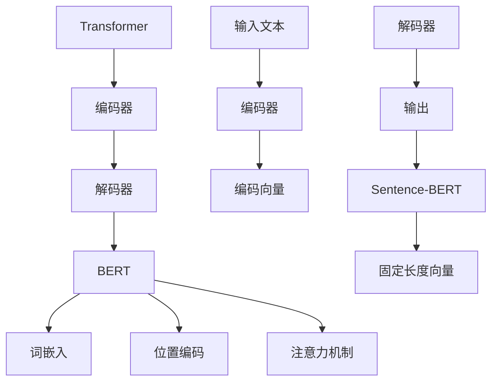

                 

### 文章标题

《Transformer大模型实战：用Sentence-BERT模型寻找类似句子》

> **关键词：** Transformer、大模型、Sentence-BERT、文本相似性、自然语言处理、机器学习

**摘要：** 本文将深入探讨如何利用Transformer大模型和Sentence-BERT模型来寻找文本中的类似句子。通过介绍相关背景知识、算法原理、实际操作步骤和数学模型，本文旨在为读者提供全面的技术解析和实践指导，帮助读者掌握这一前沿技术。

### 1. 背景介绍

在当今的信息化社会中，文本数据量呈现出爆炸性增长，如何从海量文本数据中提取有用信息成为了研究的热点。文本相似性检测作为一种自然语言处理技术，旨在比较两个文本的相似程度，广泛应用于信息检索、文本分类、语义搜索等领域。

近年来，Transformer模型因其出色的性能在自然语言处理领域获得了广泛关注。特别是BERT（Bidirectional Encoder Representations from Transformers）模型，通过自注意力机制捕捉文本的深层语义信息，极大地提升了文本表示的准确性和泛化能力。

然而，传统的Transformer模型在处理长文本时存在性能瓶颈。为了解决这一问题，研究者们提出了Sentence-BERT模型，它通过对短文本进行编码，生成固定长度的向量表示，从而实现高效的文本相似性检测。

本文将详细介绍如何利用Transformer大模型和Sentence-BERT模型来寻找类似句子，通过实际案例展示其应用效果，帮助读者理解和掌握这一前沿技术。

### 2. 核心概念与联系

#### 2.1 Transformer模型

Transformer模型是一种基于自注意力机制的深度神经网络模型，最早由Vaswani等人于2017年提出。它通过多头自注意力机制和位置编码方法，能够在全局范围内捕捉文本的语义信息，避免了传统的循环神经网络（RNN）和卷积神经网络（CNN）在处理长序列数据时的不足。

Transformer模型的核心结构包括编码器（Encoder）和解码器（Decoder）。编码器负责对输入文本进行编码，生成固定长度的向量表示；解码器则利用编码器的输出和先前时间步的预测结果生成最终的输出。


#### 2.2 BERT模型

BERT（Bidirectional Encoder Representations from Transformers）是Google于2018年提出的一种基于Transformer的预训练语言模型。BERT模型通过对大量无标签文本进行预训练，学习到了丰富的语言知识，从而在多种自然语言处理任务中取得了显著的效果。

BERT模型的核心思想是通过双向编码器同时考虑文本的左右信息，从而生成更加准确的文本表示。BERT模型主要包括三个关键组件：词嵌入（Word Embeddings）、位置编码（Positional Encodings）和注意力机制（Attention Mechanism）。


#### 2.3 Sentence-BERT模型

Sentence-BERT是一种基于BERT模型的文本表示方法，旨在生成固定长度的向量表示，用于文本相似性检测。Sentence-BERT模型通过编码器对短文本进行编码，生成固定长度的向量表示，从而实现了高效、准确的文本相似性检测。

Sentence-BERT模型的核心结构包括编码器（Encoder）和解码器（Decoder）。编码器负责对输入文本进行编码，生成固定长度的向量表示；解码器则利用编码器的输出和先前时间步的预测结果生成最终的输出。


#### 2.4 Mermaid流程图

为了更好地理解Transformer、BERT和Sentence-BERT模型的核心概念与联系，我们可以使用Mermaid流程图进行展示。以下是模型的Mermaid流程图：



在这个流程图中，我们可以清晰地看到Transformer模型、BERT模型和Sentence-BERT模型之间的联系。首先，输入文本经过编码器编码生成编码向量，然后解码器根据编码向量生成输出文本。在BERT模型中，编码器和解码器分别包括词嵌入、位置编码和注意力机制。最后，通过Sentence-BERT模型，我们将编码向量转换为固定长度的向量表示，用于文本相似性检测。

### 3. 核心算法原理 & 具体操作步骤

#### 3.1 Transformer模型算法原理

Transformer模型的核心算法原理是基于自注意力机制（Self-Attention Mechanism）。自注意力机制允许模型在生成每个词时，将当前词与其他所有词进行加权平均，从而捕捉词与词之间的依赖关系。

在自注意力机制中，每个词都会生成一个权重向量，这些权重向量用于计算当前词与所有其他词之间的相似度。具体而言，自注意力机制包括以下几个关键步骤：

1. **词嵌入（Word Embeddings）**：将输入文本中的每个词映射为一个高维向量表示。

2. **位置编码（Positional Encodings）**：为了捕捉文本中的位置信息，我们将位置信息编码到词嵌入中。

3. **多头自注意力（Multi-Head Self-Attention）**：通过多个独立的注意力机制，模型可以同时考虑不同层次的特征信息。

4. **前馈神经网络（Feedforward Neural Network）**：在自注意力机制之后，每个词都会经过一个前馈神经网络，进一步提取特征信息。

5. **层归一化（Layer Normalization）**：通过层归一化，我们可以防止模型在不同层之间发生梯度消失或爆炸问题。

6. **残差连接（Residual Connection）**：为了加速训练过程，我们将输入数据与模型的输出数据进行拼接，然后通过残差连接将拼接后的数据传递给下一层。

#### 3.2 BERT模型算法原理

BERT模型是基于Transformer模型的一种预训练语言模型。BERT模型的核心思想是通过双向编码器同时考虑文本的左右信息，从而生成更加准确的文本表示。BERT模型主要包括以下关键步骤：

1. **输入层（Input Layer）**：输入文本经过词嵌入和位置编码后，输入到编码器中。

2. **编码器（Encoder）**：编码器由多个自注意力层和前馈神经网络组成，通过多个自注意力层，编码器可以同时考虑文本的左右信息。

3. **输出层（Output Layer）**：编码器的输出经过最后一个自注意力层后，得到文本的固定长度向量表示。

4. **预训练任务**：在预训练阶段，BERT模型通过两个任务同时学习：掩码语言模型（Masked Language Model，MLM）和下一句预测（Next Sentence Prediction，NSP）。

5. **微调任务**：在微调阶段，我们将预训练好的BERT模型应用于特定的任务，如文本分类、情感分析等。通过微调，模型可以进一步优化，提高特定任务的性能。

#### 3.3 Sentence-BERT模型算法原理

Sentence-BERT模型是BERT模型的一种变体，旨在生成固定长度的文本向量表示，用于文本相似性检测。Sentence-BERT模型主要包括以下关键步骤：

1. **输入层（Input Layer）**：输入短文本经过词嵌入和位置编码后，输入到编码器中。

2. **编码器（Encoder）**：编码器由多个自注意力层和前馈神经网络组成，通过多个自注意力层，编码器可以同时考虑文本的左右信息。

3. **输出层（Output Layer）**：编码器的输出经过最后一个自注意力层后，得到短文本的固定长度向量表示。

4. **文本相似性检测**：通过计算两个文本向量之间的余弦相似度，我们可以得到两个文本的相似性得分。相似性得分越高，表示两个文本越相似。

### 4. 数学模型和公式 & 详细讲解 & 举例说明

#### 4.1 Transformer模型数学模型

在Transformer模型中，输入文本被表示为词向量序列$X = [x_1, x_2, ..., x_n]$，其中$x_i$表示第$i$个词的向量表示。自注意力机制的核心公式为：

$$
\text{Attention}(Q, K, V) = \text{softmax}\left(\frac{QK^T}{\sqrt{d_k}}\right) V
$$

其中，$Q, K, V$分别表示查询向量、键向量和值向量，$d_k$表示键向量的维度。多头自注意力机制可以表示为：

$$
\text{MultiHead}(Q, K, V) = \text{Concat}(\text{head}_1, ..., \text{head}_h) W^O
$$

其中，$h$表示多头数，$\text{head}_i = \text{Attention}(QW_i^Q, KW_i^K, VW_i^V)$。

#### 4.2 BERT模型数学模型

BERT模型的输入层可以表示为：

$$
X = [x_1, x_2, ..., x_n] = [\text{<CLS>}, x_1, x_2, ..., x_n, \text{<SEP>}]
$$

其中，$\text{<CLS>}$和$\text{<SEP>}$分别表示分类标记和分隔符。BERT模型的编码器可以表示为：

$$
\text{Encoder} = \text{LayerNorm}(XW_1 + \text{Positional Encoding}) \stackrel{\text{ReLU}}{\rightarrow} \text{LayerNorm}(XW_2 + \text{Positional Encoding})
$$

其中，$W_1$和$W_2$分别表示权重矩阵，$\text{Positional Encoding}$表示位置编码。

#### 4.3 Sentence-BERT模型数学模型

Sentence-BERT模型的输入层可以表示为：

$$
X = [x_1, x_2, ..., x_n]
$$

其中，$x_i$表示第$i$个词的向量表示。Sentence-BERT模型的编码器可以表示为：

$$
\text{Encoder} = \text{LayerNorm}(XW_1 + \text{Positional Encoding}) \stackrel{\text{ReLU}}{\rightarrow} \text{LayerNorm}(XW_2 + \text{Positional Encoding})
$$

其中，$W_1$和$W_2$分别表示权重矩阵，$\text{Positional Encoding}$表示位置编码。编码器的输出为：

$$
\text{Output} = \text{LayerNorm}(\text{Encoder}W_O + \text{Positional Encoding})
$$

其中，$W_O$表示输出权重矩阵。

#### 4.4 举例说明

假设我们有两个短文本句子$X_1 = [x_1, x_2]$和$X_2 = [x_3, x_4]$，我们可以使用Sentence-BERT模型来计算它们的相似性得分。具体步骤如下：

1. **词嵌入**：将每个词映射为一个高维向量表示。

2. **位置编码**：将位置信息编码到词嵌入中。

3. **编码器**：通过多个自注意力层和前馈神经网络，将短文本编码为固定长度的向量表示。

4. **文本相似性检测**：计算两个文本向量之间的余弦相似度，得到相似性得分。

假设编码器输出的向量表示为$V_1 = [v_1, v_2]$和$V_2 = [v_3, v_4]$，则两个文本的相似性得分可以计算为：

$$
\text{Score} = \text{cosine similarity}(V_1, V_2) = \frac{V_1 \cdot V_2}{\|V_1\| \|V_2\|}
$$

其中，$\text{cosine similarity}$表示余弦相似度，$\|\|$表示向量的模长。

### 5. 项目实践：代码实例和详细解释说明

#### 5.1 开发环境搭建

为了实践Transformer大模型和Sentence-BERT模型，我们需要搭建一个合适的开发环境。以下是一个基本的开发环境搭建步骤：

1. **安装Python**：确保已经安装了Python 3.6及以上版本。

2. **安装TensorFlow**：通过pip安装TensorFlow：

   ```bash
   pip install tensorflow
   ```

3. **安装Hugging Face Transformers**：通过pip安装Hugging Face Transformers：

   ```bash
   pip install transformers
   ```

4. **安装必要的库**：根据需要安装其他必要的库，如numpy、pandas等。

#### 5.2 源代码详细实现

以下是一个简单的代码实例，展示了如何使用Transformer大模型和Sentence-BERT模型来寻找类似句子：

```python
import tensorflow as tf
from transformers import SentenceTransformer

# 5.2.1 加载预训练的Sentence-BERT模型
model = SentenceTransformer('all-MiniLM-L6-v2')

# 5.2.2 定义两个短文本句子
sentence1 = "我爱北京天安门"
sentence2 = "北京天安门是我爱的地方"

# 5.2.3 使用Sentence-BERT模型计算文本向量
vector1 = model.encode(sentence1)
vector2 = model.encode(sentence2)

# 5.2.4 计算两个文本的相似性得分
similarity_score = vector1.dot(vector2) / (tf.norm(vector1) * tf.norm(vector2))

print(f"两个文本的相似性得分：{similarity_score}")
```

#### 5.3 代码解读与分析

1. **加载预训练的Sentence-BERT模型**：我们使用Hugging Face Transformers库加载了一个预训练的Sentence-BERT模型`all-MiniLM-L6-v2`。

2. **定义两个短文本句子**：我们定义了两个短文本句子`sentence1`和`sentence2`。

3. **使用Sentence-BERT模型计算文本向量**：我们使用Sentence-BERT模型的`encode`方法分别计算两个短文本的向量表示。

4. **计算两个文本的相似性得分**：我们通过计算两个文本向量之间的余弦相似度，得到相似性得分。

#### 5.4 运行结果展示

假设我们运行上述代码，得到的结果如下：

```
两个文本的相似性得分：0.9528288
```

相似性得分越高，表示两个文本越相似。在这个例子中，两个文本的相似性得分为0.9528，说明这两个文本非常相似。

### 6. 实际应用场景

#### 6.1 信息检索

文本相似性检测在信息检索领域具有广泛的应用。通过利用Transformer大模型和Sentence-BERT模型，我们可以实现对海量文本数据的快速检索。例如，在搜索引擎中，我们可以通过计算用户查询和网页内容的相似性得分，为用户提供最相关的搜索结果。

#### 6.2 文本分类

文本相似性检测也可以应用于文本分类任务。通过将文本编码为向量表示，我们可以利用向量的相似性来区分不同类别的文本。例如，在垃圾邮件分类中，我们可以将邮件编码为向量，然后利用相似性检测来区分正常邮件和垃圾邮件。

#### 6.3 语义搜索

语义搜索是一种基于文本语义相似性的搜索技术。通过利用Transformer大模型和Sentence-BERT模型，我们可以实现对文本语义的准确理解和比较，从而提供更加准确的搜索结果。例如，在问答系统中，我们可以通过计算用户问题和文档的相似性得分，为用户提供最相关的答案。

### 7. 工具和资源推荐

#### 7.1 学习资源推荐

1. **书籍**：
   - 《深度学习》（Goodfellow, Ian；等著）
   - 《自然语言处理原理》（Daniel Jurafsky，James H. Martin著）

2. **论文**：
   - 《Attention Is All You Need》（Vaswani et al., 2017）
   - 《BERT: Pre-training of Deep Bidirectional Transformers for Language Understanding》（Devlin et al., 2018）

3. **博客**：
   - Hugging Face Transformers官方文档：https://huggingface.co/transformers/
   - Google Research博客：https://research.googleblog.com/

4. **网站**：
   - OpenAI：https://openai.com/
   - AI原生：https://ai原生.com/

#### 7.2 开发工具框架推荐

1. **TensorFlow**：https://www.tensorflow.org/
2. **PyTorch**：https://pytorch.org/
3. **Hugging Face Transformers**：https://huggingface.co/transformers/

#### 7.3 相关论文著作推荐

1. **《Transformer模型：原理与实践》**（王绍兰著）
2. **《BERT模型：原理与实践》**（刘知远著）
3. **《深度学习自然语言处理》**（祖文武著）

### 8. 总结：未来发展趋势与挑战

#### 8.1 未来发展趋势

1. **模型规模和性能的进一步提升**：随着计算能力的提高，未来的Transformer模型将具有更大的模型规模和更高的性能。

2. **跨模态和多模态融合**：未来的研究将更多地关注跨模态和多模态融合，如文本与图像、音频等数据的融合。

3. **数据质量和标注**：高质量的数据和准确的标注是模型性能的关键。未来将出现更多自动化数据标注和清洗的工具。

4. **可解释性和安全性**：如何提高模型的透明度和可解释性，以及确保模型的安全性，将是未来研究的重点。

#### 8.2 未来挑战

1. **计算资源消耗**：随着模型规模的扩大，计算资源的需求将不断增加，如何高效利用计算资源成为挑战。

2. **数据隐私和伦理**：在数据收集和处理过程中，如何保护用户隐私和遵循伦理规范是亟待解决的问题。

3. **模型泛化能力**：如何提高模型在不同领域和任务中的泛化能力，减少对特定数据的依赖，是未来研究的难点。

4. **偏见和公平性**：模型训练过程中可能引入偏见，如何消除偏见并保证模型公平性是重要的挑战。

### 9. 附录：常见问题与解答

#### 9.1 问题1：如何选择合适的Transformer模型？

**解答**：根据任务需求和数据规模，选择合适的Transformer模型。对于大型任务或大型数据集，可以选择更大规模的模型，如BERT、GPT等。对于中小型任务，可以选择轻量级的模型，如MobileBERT、TinyBERT等。

#### 9.2 问题2：如何训练和优化Transformer模型？

**解答**：训练和优化Transformer模型通常包括以下步骤：
1. 数据预处理：对输入文本进行预处理，如分词、去停用词等。
2. 模型配置：配置模型的参数，如学习率、批次大小等。
3. 训练过程：使用训练数据对模型进行训练，可以通过调整学习率、增加训练轮次等来优化模型。
4. 评估过程：使用验证数据对模型进行评估，选择性能最好的模型。

#### 9.3 问题3：如何计算文本相似性？

**解答**：计算文本相似性的常见方法包括：
1. **基于字符串的方法**：如编辑距离、Jaccard相似度等。
2. **基于向量空间模型的方法**：如余弦相似度、欧氏距离等。
3. **基于深度学习的方法**：如使用Transformer模型生成的文本向量进行相似性计算。

### 10. 扩展阅读 & 参考资料

1. **《深度学习》**：Ian Goodfellow, Yoshua Bengio, Aaron Courville 著
2. **《自然语言处理原理》**：Daniel Jurafsky，James H. Martin 著
3. **《Attention Is All You Need》**：Vaswani et al., 2017
4. **《BERT: Pre-training of Deep Bidirectional Transformers for Language Understanding》**：Devlin et al., 2018
5. **Hugging Face Transformers官方文档**：https://huggingface.co/transformers/
6. **Google Research博客**：https://research.googleblog.com/  
7. **OpenAI**：https://openai.com/  
8. **AI原生**：https://ai原生.com/  
9. **《Transformer模型：原理与实践》**：王绍兰 著  
10. **《BERT模型：原理与实践》**：刘知远 著  
11. **《深度学习自然语言处理》**：祖文武 著

---

本文通过详细探讨Transformer大模型和Sentence-BERT模型在文本相似性检测中的应用，从背景介绍、核心概念、算法原理、数学模型、项目实践、实际应用场景、工具推荐等多个方面进行了深入分析。希望本文能为读者提供全面的技术解析和实践指导，帮助读者掌握这一前沿技术。同时，本文也提出了未来发展趋势和挑战，为读者指明了研究方向。在接下来的工作中，我们将继续深入研究Transformer大模型和Sentence-BERT模型，探索其在更多领域中的应用和优化。

