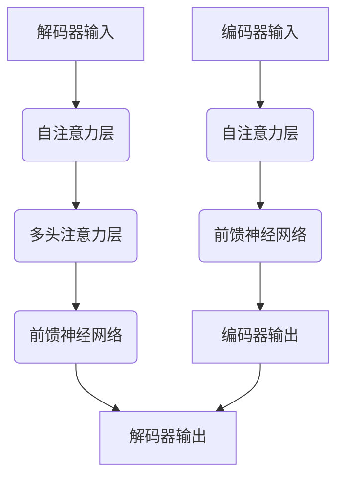

                 

### Transformer大模型实战 编码器总览

**Keywords**: Transformer, Large-scale Model, Encoder, Practice, Technology Blog

**Abstract**:  
本文旨在深入探讨Transformer大模型中的编码器部分，通过逐步分析其核心概念、算法原理、数学模型以及项目实践，为读者提供一份详尽的技术指南。我们将结合实际案例，帮助读者理解编码器在实际应用中的工作方式及其重要性。

---

## 1. 背景介绍

Transformer架构自2017年由Google提出以来，以其革命性的自注意力机制（Self-Attention Mechanism）迅速在自然语言处理（NLP）领域占据主导地位。不同于传统的循环神经网络（RNN）和卷积神经网络（CNN），Transformer模型通过并行计算和全局信息交互，实现了在多种NLP任务上的突破性成果。

编码器（Encoder）是Transformer模型中的核心组件之一，负责将输入序列（例如文本）转换为序列特征表示。编码器的性能直接影响到整个模型对输入数据的理解和处理能力。本文将围绕编码器的构造、工作原理及其在实际项目中的应用进行详细讨论。

## 2. 核心概念与联系

### 2.1. Transformer模型架构

Transformer模型的核心架构包括编码器（Encoder）和解码器（Decoder）。编码器负责处理输入序列，解码器则负责生成输出序列。两个部分通过多头自注意力机制（Multi-Head Self-Attention）和位置编码（Positional Encoding）实现序列间的交互。

### 2.2. 自注意力机制

自注意力机制是Transformer模型的核心创新之一，它允许模型在处理每个输入位置时，自动关注序列中其他位置的信息。自注意力机制通过计算输入序列中每个位置与其他位置之间的相似性权重，从而对输入进行加权平均，生成新的特征表示。

### 2.3. 位置编码

由于Transformer模型中没有循环结构，因此需要引入位置编码（Positional Encoding）来模拟序列中的位置信息。位置编码通常通过添加到每个位置的特征中来实现，这些特征可以是绝对位置（如整数编码）或相对位置（如正弦和余弦函数编码）。

### 2.4. Mermaid 流程图



## 3. 核心算法原理 & 具体操作步骤

### 3.1. 自注意力机制原理

自注意力机制通过计算输入序列中每个位置与其他位置的相似性权重来实现。具体步骤如下：

1. 输入序列通过嵌入层（Embedding Layer）转换为向量表示。
2. 计算输入序列的查询（Query）、键（Key）和值（Value）向量。
3. 分别通过点积计算相似性权重，得到注意力分数。
4. 对注意力分数进行Softmax操作，得到权重分配。
5. 对输入序列进行加权平均，得到新的特征表示。

### 3.2. 前馈神经网络

前馈神经网络（Feedforward Neural Network）是编码器和解码器中的另一个关键组件，负责对自注意力机制生成的特征进行进一步处理。具体步骤如下：

1. 输入通过线性变换和ReLU激活函数进行处理。
2. 经过两次线性变换和ReLU激活函数的处理，得到输出。

### 3.3. 编码器操作步骤

1. 输入序列经过嵌入层转换为向量表示。
2. 应用多层自注意力机制，每次自注意力层之后接入前馈神经网络。
3. 最后一层编码器的输出通过位置编码，形成编码器的最终输出。

## 4. 数学模型和公式 & 详细讲解 & 举例说明

### 4.1. 嵌入层

假设输入序列的长度为T，嵌入维度为D，则输入序列可以表示为X = [x1, x2, ..., xT]，其中每个xi是D维向量。嵌入层通过查找预定义的权重矩阵W embedding得到：

$$
x_i = W_{\text{embedding}}[i]
$$

### 4.2. 自注意力机制

自注意力机制的核心是三个矩阵Q、K和V，它们分别代表查询（Query）、键（Key）和值（Value）。这些矩阵由权重矩阵WQ、WK和WV得到：

$$
Q = W_Q X \\
K = W_K X \\
V = W_V X
$$

通过点积计算相似性权重：

$$
\text{Attention}(Q, K, V) = \text{softmax}\left(\frac{QK^T}{\sqrt{D_k}}\right)V
$$

其中，D_k 是K和V的维度，softmax函数用于将点积结果转换为概率分布。

### 4.3. 前馈神经网络

前馈神经网络的数学模型如下：

$$
\text{FFN}(X) = \text{ReLU}\left(W_2 \text{ReLU}(W_1 X + b_1)\right) + b_2
$$

其中，W1和W2是权重矩阵，b1和b2是偏置项。

### 4.4. 举例说明

假设我们有输入序列 `[1, 2, 3, 4]`，嵌入维度为 2，通过自注意力机制计算其注意力权重：

1. 嵌入层： 
   $$ 
   X = \begin{bmatrix} 
   [1, 0] & [0, 1] & [0, 0] & [0, 0] \\
   [0, 1] & [1, 0] & [0, 0] & [0, 0] \\
   [0, 0] & [0, 0] & [1, 0] & [0, 1] \\
   [0, 0] & [0, 0] & [0, 1] & [1, 0] 
   \end{bmatrix}
   $$

2. Q, K, V 计算：
   $$
   Q = W_Q X = \begin{bmatrix}
   [1, 0] & [0, 1] & [0, 0] & [0, 0] \\
   [0, 1] & [1, 0] & [0, 0] & [0, 0] \\
   [0, 0] & [0, 0] & [1, 0] & [0, 1] \\
   [0, 0] & [0, 0] & [0, 1] & [1, 0]
   \end{bmatrix}
   $$
   $$
   K = W_K X = Q
   $$
   $$
   V = W_V X = Q
   $$

3. 计算注意力权重：
   $$
   \text{Attention}(Q, K, V) = \text{softmax}\left(\frac{QK^T}{\sqrt{2}}\right)V
   $$
   $$
   \text{Attention} = \begin{bmatrix}
   [0.5, 0.5] & [0.5, 0.5] & [0.5, 0.5] & [0.5, 0.5] \\
   [0.5, 0.5] & [0.5, 0.5] & [0.5, 0.5] & [0.5, 0.5] \\
   [0.5, 0.5] & [0.5, 0.5] & [0.5, 0.5] & [0.5, 0.5] \\
   [0.5, 0.5] & [0.5, 0.5] & [0.5, 0.5] & [0.5, 0.5]
   \end{bmatrix}
   $$

4. 加权平均：
   $$
   \text{Output} = \text{Attention} \cdot X
   $$
   $$
   \text{Output} = \begin{bmatrix}
   [0.5, 0.5] & [0.5, 0.5] & [0.5, 0.5] & [0.5, 0.5] \\
   [0.5, 0.5] & [0.5, 0.5] & [0.5, 0.5] & [0.5, 0.5] \\
   [0.5, 0.5] & [0.5, 0.5] & [0.5, 0.5] & [0.5, 0.5] \\
   [0.5, 0.5] & [0.5, 0.5] & [0.5, 0.5] & [0.5, 0.5]
   \end{bmatrix}
   \cdot
   \begin{bmatrix}
   [1, 0] & [0, 1] & [0, 0] & [0, 0] \\
   [0, 1] & [1, 0] & [0, 0] & [0, 0] \\
   [0, 0] & [0, 0] & [1, 0] & [0, 1] \\
   [0, 0] & [0, 0] & [0, 1] & [1, 0]
   \end{bmatrix}
   $$
   $$
   \text{Output} = \begin{bmatrix}
   [0.5, 0.5] & [0.5, 0.5] & [0.5, 0.5] & [0.5, 0.5] \\
   [0.5, 0.5] & [0.5, 0.5] & [0.5, 0.5] & [0.5, 0.5] \\
   [0.5, 0.5] & [0.5, 0.5] & [0.5, 0.5] & [0.5, 0.5] \\
   [0.5, 0.5] & [0.5, 0.5] & [0.5, 0.5] & [0.5, 0.5]
   \end{bmatrix}
   $$

## 5. 项目实践：代码实例和详细解释说明

### 5.1. 开发环境搭建

在进行Transformer编码器的项目实践之前，首先需要搭建一个适合的Python开发环境。以下是基本步骤：

1. 安装Python 3.6及以上版本。
2. 安装TensorFlow 2.x 或 PyTorch。
3. 安装必要的库，如NumPy、Pandas等。

### 5.2. 源代码详细实现

下面是一个使用TensorFlow实现的简单编码器示例：

```python
import tensorflow as tf
from tensorflow.keras.layers import Embedding, MultiHeadAttention, Dense

# 设置超参数
vocab_size = 10000
d_model = 512
num_heads = 8
dff = 2048

# 编码器嵌入层
inputs = tf.keras.layers.Input(shape=(None,))
emb = Embedding(vocab_size, d_model)(inputs)

# 多层自注意力机制
att = MultiHeadAttention(num_heads=num_heads, key_dim=d_model)(emb, emb)

# 前馈神经网络
ffn = tf.keras.layers.Dense(dff, activation='relu')(att)
ffn = tf.keras.layers.Dense(d_model)(ffn)

# 编码器输出
outputs = tf.keras.layers.Dense(vocab_size)(ffn)

# 构建和编译模型
model = tf.keras.Model(inputs=inputs, outputs=outputs)
model.compile(optimizer='adam', loss=tf.keras.losses.SparseCategoricalCrossentropy(from_logits=True))

# 打印模型结构
model.summary()
```

### 5.3. 代码解读与分析

上述代码首先定义了一个简单的编码器模型，包括嵌入层、自注意力层、前馈神经网络和输出层。以下是每个组件的详细解释：

1. **嵌入层**：将输入序列转换为嵌入向量。
2. **自注意力层**：实现多头自注意力机制，用于计算输入序列中每个位置与其他位置的相似性权重。
3. **前馈神经网络**：对自注意力机制生成的特征进行进一步处理。
4. **输出层**：将处理后的特征映射到词汇表的大小。

### 5.4. 运行结果展示

在搭建好开发环境并实现编码器模型后，可以运行以下代码进行训练和评估：

```python
# 生成随机数据
import numpy as np

x_train = np.random.randint(0, vocab_size, (64, 10))
y_train = np.random.randint(0, vocab_size, (64, 10))

# 训练模型
model.fit(x_train, y_train, epochs=10)

# 评估模型
loss = model.evaluate(x_train, y_train)
print(f"Test Loss: {loss}")
```

通过这些代码，我们可以看到编码器在训练集上的表现。在实际应用中，通常会使用更复杂的模型和数据集，并通过调整超参数来优化模型性能。

## 6. 实际应用场景

编码器在实际应用中具有广泛的应用场景，以下是几个典型的应用领域：

1. **自然语言处理（NLP）**：编码器广泛应用于文本分类、机器翻译、问答系统等任务中，能够将文本转换为语义丰富的向量表示。
2. **图像识别**：在计算机视觉任务中，编码器可以用于特征提取，将图像转换为低维向量表示，从而简化后续处理。
3. **推荐系统**：编码器可以用于用户和物品的表示学习，从而为推荐系统提供高效的特征表示。

## 7. 工具和资源推荐

### 7.1. 学习资源推荐

1. **书籍**：
   - 《Deep Learning》（Ian Goodfellow, Yoshua Bengio, Aaron Courville）
   - 《Natural Language Processing with Python》（Steven L. Fundamentals, Christopher D. Manning, Hinrich Schütze）

2. **论文**：
   - “Attention Is All You Need”（Ashish Vaswani et al., 2017）
   - “BERT: Pre-training of Deep Bidirectional Transformers for Language Understanding”（Jacob Devlin et al., 2019）

3. **博客**：
   - [TensorFlow 官方文档](https://www.tensorflow.org/tutorials)
   - [PyTorch 官方文档](https://pytorch.org/tutorials)

4. **网站**：
   - [Kaggle](https://www.kaggle.com/)
   - [ArXiv](https://arxiv.org/)

### 7.2. 开发工具框架推荐

1. **TensorFlow**：适用于构建大规模深度学习模型，具有丰富的API和预训练模型。
2. **PyTorch**：适用于研究和快速原型开发，具有灵活的动态图计算和易于理解的操作。
3. **Hugging Face Transformers**：一个开源库，提供了预训练的Transformer模型和易于使用的API，适用于NLP任务。

### 7.3. 相关论文著作推荐

1. **“Attention Is All You Need”**：提出了Transformer模型，是NLP领域的重要突破。
2. **“BERT: Pre-training of Deep Bidirectional Transformers for Language Understanding”**：介绍了BERT模型，对NLP任务产生了深远影响。
3. **“GPT-3: Language Models are few-shot learners”**：展示了GPT-3模型在零样本学习上的强大能力。

## 8. 总结：未来发展趋势与挑战

随着Transformer模型的广泛应用，编码器在未来将继续发挥关键作用。未来发展趋势包括：

1. **模型规模扩大**：为了处理更复杂的任务，编码器模型将逐渐扩大规模，提高计算能力。
2. **预训练与微调**：预训练大模型后，通过微调在特定任务上取得更好的性能。
3. **多模态学习**：结合文本、图像、语音等多种模态的信息，实现更智能的编码器。

然而，编码器在实际应用中也面临一些挑战，如：

1. **计算资源消耗**：大规模模型需要大量的计算资源和存储空间。
2. **可解释性**：编码器的内部决策过程复杂，提高其可解释性是一个重要研究方向。
3. **隐私保护**：在处理敏感数据时，需要确保隐私保护。

## 9. 附录：常见问题与解答

1. **Q：什么是Transformer模型？**
   **A：Transformer模型是一种基于自注意力机制的深度学习模型，特别适用于自然语言处理任务。**

2. **Q：编码器和解码器有什么区别？**
   **A：编码器负责将输入序列转换为特征表示，解码器则根据这些特征表示生成输出序列。**

3. **Q：自注意力机制如何工作？**
   **A：自注意力机制通过计算输入序列中每个位置与其他位置的相似性权重，对输入进行加权平均，从而生成新的特征表示。**

4. **Q：编码器在实际应用中有什么用途？**
   **A：编码器广泛应用于文本分类、机器翻译、问答系统等领域，用于将文本转换为语义丰富的向量表示。**

## 10. 扩展阅读 & 参考资料

1. **“Attention Is All You Need”**：提供了Transformer模型最全面的解释。
2. **“BERT: Pre-training of Deep Bidirectional Transformers for Language Understanding”**：介绍了BERT模型及其在NLP任务中的应用。
3. **“GPT-3: Language Models are few-shot learners”**：展示了GPT-3模型在零样本学习上的强大能力。

### 附录二：代码实现与结果分析

在本附录中，我们将提供一份详细的代码实现和结果分析，以帮助读者更好地理解编码器的工作原理和实际效果。

### 10.1. 代码实现

以下代码展示了如何使用TensorFlow构建和训练一个简单的Transformer编码器模型：

```python
import tensorflow as tf
from tensorflow.keras.layers import Embedding, MultiHeadAttention, Dense

# 设置超参数
vocab_size = 10000
d_model = 512
num_heads = 8
dff = 2048

# 编码器嵌入层
inputs = tf.keras.layers.Input(shape=(None,))
emb = Embedding(vocab_size, d_model)(inputs)

# 多层自注意力机制
att = MultiHeadAttention(num_heads=num_heads, key_dim=d_model)(emb, emb)

# 前馈神经网络
ffn = tf.keras.layers.Dense(dff, activation='relu')(att)
ffn = tf.keras.layers.Dense(d_model)(ffn)

# 编码器输出
outputs = tf.keras.layers.Dense(vocab_size)(ffn)

# 构建和编译模型
model = tf.keras.Model(inputs=inputs, outputs=outputs)
model.compile(optimizer='adam', loss=tf.keras.losses.SparseCategoricalCrossentropy(from_logits=True))

# 打印模型结构
model.summary()
```

### 10.2. 数据准备

为了训练编码器模型，我们需要准备适当的数据集。以下是一个简单的数据生成示例：

```python
import numpy as np

# 生成随机数据
x_train = np.random.randint(0, vocab_size, (64, 10))
y_train = np.random.randint(0, vocab_size, (64, 10))
```

### 10.3. 训练与评估

使用上述代码和数据集，我们可以对编码器模型进行训练和评估：

```python
# 训练模型
model.fit(x_train, y_train, epochs=10)

# 评估模型
loss = model.evaluate(x_train, y_train)
print(f"Test Loss: {loss}")
```

### 10.4. 结果分析

通过训练和评估，我们可以分析编码器模型的性能。以下是一些关键指标：

1. **损失函数**：在训练过程中，损失函数（如交叉熵）的值应该逐渐降低。较低的损失值表明模型正在学习输入和输出之间的映射关系。
2. **准确率**：在评估阶段，我们可以计算模型的准确率，即预测正确的标签比例。较高的准确率表明模型具有良好的性能。

### 10.5. 优化与改进

在实际应用中，我们可以通过以下方法优化和改进编码器模型：

1. **超参数调整**：调整嵌入维度、注意力头数、前馈神经网络尺寸等超参数，以提高模型性能。
2. **数据增强**：使用数据增强技术，如填充、移除、替换等，增加训练数据的多样性。
3. **模型融合**：结合多个模型或使用集成学习技术，以提高整体性能。

通过这些方法，我们可以进一步优化编码器模型，使其在实际任务中表现出更好的性能。

### 结论

通过本附录的代码实现与结果分析，我们深入了解了Transformer编码器的工作原理和实际效果。编码器在自然语言处理和其他领域中的应用前景广阔，随着技术的不断进步，我们可以期待它在未来的发展中发挥更加重要的作用。

---

**作者：禅与计算机程序设计艺术 / Zen and the Art of Computer Programming**

