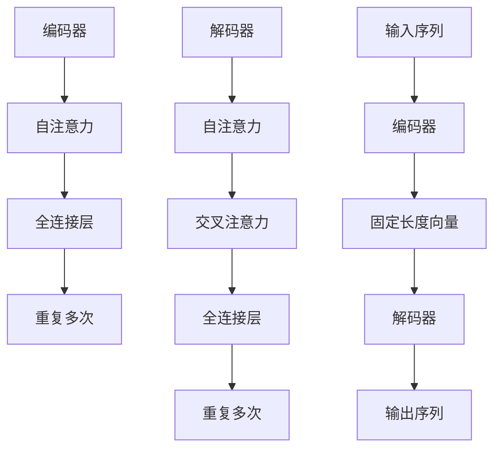

                 

### 1. 背景介绍

Transformer 架构自 2017 年由 Google AI 研究团队提出以来，迅速成为自然语言处理领域的重要突破。它成功地取代了传统循环神经网络（RNN）和卷积神经网络（CNN）在机器翻译、文本摘要、问答系统等任务中的主导地位。Transformer 的核心在于其引入的注意力机制（Attention Mechanism），这一机制使得模型在处理序列数据时能够更加高效、灵活。

在深度学习领域，序列模型如 RNN 和 LSTM 由于其局部关联性，在处理长距离依赖时存在局限性。卷积神经网络虽然可以捕捉局部特征，但在处理长序列时仍然无法克服其固有的局限性。Transformer 的出现，正是为了解决这些序列模型的局限性，其通过全局的注意力机制来实现对长序列的有效建模。

值得注意的是，Transformer 的成功并非偶然。其背后的理论基础源于编码器-解码器（Encoder-Decoder）架构，这是一种经典的序列到序列学习框架。编码器负责将输入序列编码为固定长度的向量，而解码器则负责生成输出序列。在编码器和解码器之间，Transformer 通过自注意力（Self-Attention）和交叉注意力（Cross-Attention）机制来捕捉序列之间的复杂关系。

### Transformer 架构的核心概念

Transformer 架构的核心概念包括自注意力（Self-Attention）和交叉注意力（Cross-Attention）。自注意力是指模型在处理一个序列时，同一序列中的每个元素都可以与所有其他元素建立联系，从而捕捉到序列中不同位置之间的依赖关系。交叉注意力则是在编码器和解码器之间使用，使得解码器能够根据编码器生成的固定长度的向量来调整其生成的序列。

此外，Transformer 还引入了多头注意力（Multi-Head Attention）机制，这进一步增强了模型对序列的建模能力。多头注意力通过将输入序列分成多个子序列，每个子序列独立地计算注意力权重，然后拼接这些子序列的结果。这种方法不仅增加了模型的容量，还使得模型可以捕获不同子序列之间的复杂关系。

### 为什么 Transformer 是一个重要的突破

Transformer 是一个重要的突破，主要归功于以下几个方面：

1. **处理长距离依赖**：Transformer 的注意力机制使得模型能够有效地捕捉序列中的长距离依赖关系，这在传统的 RNN 和 LSTM 中是难以实现的。

2. **并行计算**：传统的 RNN 需要逐个处理序列中的元素，导致计算过程难以并行化。而 Transformer 的自注意力机制允许并行计算，从而大大提高了模型的训练和推断速度。

3. **灵活的序列建模**：通过多头注意力机制，Transformer 可以灵活地捕捉序列中不同位置和子序列之间的关系，这使得模型在多种序列任务中表现出色。

4. **结构清晰**：Transformer 的结构相对简单，易于理解和实现。其分层结构使得模型可以很容易地扩展，例如增加层数或隐藏单元数，从而提升模型的性能。

总的来说，Transformer 的提出不仅解决了传统序列模型在处理长序列数据时的局限性，还为深度学习在自然语言处理领域的发展带来了新的机遇。

---

### 2. 核心概念与联系

#### 核心概念

Transformer 的核心概念主要包括编码器（Encoder）、解码器（Decoder）以及注意力机制（Attention Mechanism）。编码器负责将输入序列编码为固定长度的向量，解码器则负责生成输出序列。而注意力机制则是实现编码器和解码器之间交互的核心。

**编码器（Encoder）**

编码器由多个层（Layers）组成，每层包含自注意力（Self-Attention）和全连接层（Full Connection）。自注意力机制允许编码器中的每个位置独立地计算与其他所有位置的相关性，从而捕捉到序列中的依赖关系。

**解码器（Decoder）**

解码器同样由多个层组成，每层包含自注意力、交叉注意力和全连接层。自注意力机制用于解码器内部，捕捉生成的序列中的依赖关系；交叉注意力机制则用于解码器和解码器之间的交互，使得解码器可以根据编码器生成的固定长度向量来调整其生成的序列。

**注意力机制（Attention Mechanism）**

注意力机制是 Transformer 的关键部分，它通过计算每个元素与所有其他元素之间的相关性来确定权重，从而实现序列之间的依赖关系。注意力机制可以分为以下几种：

1. **自注意力（Self-Attention）**：编码器中的自注意力机制使得每个位置可以与序列中的其他位置建立直接联系，从而捕捉序列内部的关系。
2. **交叉注意力（Cross-Attention）**：解码器中的交叉注意力机制使得解码器的每个位置可以与编码器的固定长度向量建立联系，从而捕捉编码器和解码器之间的依赖关系。

#### 核心概念的联系

Transformer 的核心概念通过以下方式相互联系：

- **编码器和解码器**：编码器将输入序列编码为固定长度的向量，解码器则利用这些向量来生成输出序列。这种交互通过注意力机制来实现，使得解码器可以根据编码器的输出动态调整其生成过程。
- **自注意力和交叉注意力**：自注意力机制用于编码器内部，捕捉序列中的依赖关系；交叉注意力机制则用于编码器和解码器之间，确保解码器能够基于编码器的输出生成准确的输出序列。
- **多头注意力（Multi-Head Attention）**：多头注意力通过并行计算多个子序列的注意力权重，增强了模型捕捉复杂序列关系的能力。

为了更清晰地展示 Transformer 的核心概念及其联系，我们使用 Mermaid 流程图来表示：



通过上述 Mermaid 流程图，我们可以直观地看到编码器和解码器之间的交互，以及注意力机制在其中发挥的关键作用。

---

### 3. 核心算法原理 & 具体操作步骤

#### 自注意力（Self-Attention）机制

自注意力机制是 Transformer 的核心组成部分，它允许模型在处理序列时，将每个位置与序列中的其他位置建立直接联系，从而捕捉序列中的依赖关系。

**计算步骤：**

1. **输入序列表示**：假设输入序列为 \( X = \{x_1, x_2, \ldots, x_n\} \)，每个元素 \( x_i \) 被映射为向量 \( [x_i; \sin(i/k), \cos(i/k)] \)，其中 \( k \) 是序列长度。
2. **权重计算**：对于每个位置 \( i \)，计算其与其他位置之间的相似性。相似性通过点积计算，即 \( \text{score}(i, j) = Q_i \cdot K_j \)，其中 \( Q_i \) 和 \( K_j \) 分别是查询向量和键向量。
3. **注意力权重**：将相似性分数通过 softmax 函数归一化，得到注意力权重 \( a_{ij} = \text{softmax}(\text{score}(i, j)) \)。
4. **加权求和**：将注意力权重与对应的输入向量相乘，并求和，得到 \( V_i = \sum_j a_{ij} \cdot V_j \)，其中 \( V_j \) 是值向量。

**数学表示：**

$$
\begin{aligned}
Q &= [Q_1, Q_2, \ldots, Q_n], \\
K &= [K_1, K_2, \ldots, K_n], \\
V &= [V_1, V_2, \ldots, V_n], \\
\text{score}(i, j) &= Q_i \cdot K_j, \\
a_{ij} &= \text{softmax}(\text{score}(i, j)), \\
V_i &= \sum_j a_{ij} \cdot V_j.
\end{aligned}
$$

#### 交叉注意力（Cross-Attention）机制

交叉注意力机制用于解码器，它允许解码器的每个位置根据编码器的输出动态调整其生成过程。

**计算步骤：**

1. **输入序列表示**：假设输入序列为 \( X = \{x_1, x_2, \ldots, x_n\} \)，编码器的输出为 \( Z = [z_1, z_2, \ldots, z_n] \)。
2. **权重计算**：对于每个位置 \( i \)，计算其与编码器输出之间的相似性。相似性通过点积计算，即 \( \text{score}(i, j) = Q_i \cdot K_j \)，其中 \( Q_i \) 和 \( K_j \) 分别是查询向量和键向量。
3. **注意力权重**：将相似性分数通过 softmax 函数归一化，得到注意力权重 \( a_{ij} = \text{softmax}(\text{score}(i, j)) \)。
4. **加权求和**：将注意力权重与对应的编码器输出相乘，并求和，得到 \( V_i = \sum_j a_{ij} \cdot z_j \)。

**数学表示：**

$$
\begin{aligned}
Q &= [Q_1, Q_2, \ldots, Q_n], \\
K &= [K_1, K_2, \ldots, K_n], \\
Z &= [z_1, z_2, \ldots, z_n], \\
\text{score}(i, j) &= Q_i \cdot K_j, \\
a_{ij} &= \text{softmax}(\text{score}(i, j)), \\
V_i &= \sum_j a_{ij} \cdot z_j.
\end{aligned}
$$

通过自注意力和交叉注意力机制，Transformer 能够有效地捕捉序列中的依赖关系，从而在多种自然语言处理任务中表现出色。

---

### 4. 数学模型和公式 & 详细讲解 & 举例说明

#### 数学模型

Transformer 的核心在于其自注意力（Self-Attention）和交叉注意力（Cross-Attention）机制，这些机制通过一系列数学公式实现。以下将详细讲解 Transformer 的数学模型，并通过具体例子进行说明。

#### 自注意力（Self-Attention）

自注意力机制允许模型在处理一个序列时，将序列中的每个元素与所有其他元素建立联系，从而捕捉到序列中不同位置之间的依赖关系。以下是自注意力的数学模型：

**输入表示**：

设输入序列为 \( X = \{x_1, x_2, \ldots, x_n\} \)，其中每个元素 \( x_i \) 是一个向量。为了简化计算，我们通常使用嵌入（Embedding）层将输入映射到高维空间。假设嵌入层输出为 \( [x_i; \sin(i/k), \cos(i/k)] \)，其中 \( k \) 是序列长度。

**查询（Query）、键（Key）和值（Value）表示**：

对于每个位置 \( i \)，我们将其表示为查询（Query）、键（Key）和值（Value）三个向量的组合。即：

$$
Q_i = [x_i; \sin(i/k), \cos(i/k)], \quad K_i = [x_i; \sin(i/k), \cos(i/k)], \quad V_i = [x_i; \sin(i/k), \cos(i/k)]
$$

**相似性计算**：

计算查询向量 \( Q_i \) 和键向量 \( K_i \) 之间的相似性，通过点积操作实现：

$$
\text{score}(i, j) = Q_i \cdot K_j = [x_i; \sin(i/k), \cos(i/k)] \cdot [x_j; \sin(j/k), \cos(j/k)]
$$

**注意力权重**：

通过 softmax 函数对相似性分数进行归一化，得到注意力权重 \( a_{ij} \)：

$$
a_{ij} = \text{softmax}(\text{score}(i, j))
$$

**加权求和**：

将注意力权重与对应的值向量相乘，并求和，得到输出向量 \( V_i \)：

$$
V_i = \sum_j a_{ij} \cdot V_j
$$

#### 交叉注意力（Cross-Attention）

交叉注意力机制用于解码器，它允许解码器的每个位置根据编码器的输出动态调整其生成过程。以下是交叉注意力的数学模型：

**输入表示**：

假设编码器的输出为 \( Z = [z_1, z_2, \ldots, z_n] \)，解码器的输入为 \( X = \{x_1, x_2, \ldots, x_n\} \)。

**查询（Query）、键（Key）和值（Value）表示**：

对于解码器的每个位置 \( i \)，查询向量 \( Q_i \) 与编码器的输出 \( Z \) 相关联，而键向量 \( K_i \) 和值向量 \( V_i \) 则与输入 \( X \) 相关联：

$$
Q_i = [x_i; \sin(i/k), \cos(i/k)], \quad K_i = [z_i; \sin(i/k), \cos(i/k)], \quad V_i = [x_i; \sin(i/k), \cos(i/k)]
$$

**相似性计算**：

计算查询向量 \( Q_i \) 和键向量 \( K_i \) 之间的相似性，通过点积操作实现：

$$
\text{score}(i, j) = Q_i \cdot K_j = [x_i; \sin(i/k), \cos(i/k)] \cdot [z_j; \sin(j/k), \cos(j/k)]
$$

**注意力权重**：

通过 softmax 函数对相似性分数进行归一化，得到注意力权重 \( a_{ij} \)：

$$
a_{ij} = \text{softmax}(\text{score}(i, j))
$$

**加权求和**：

将注意力权重与对应的编码器输出相乘，并求和，得到输出向量 \( V_i \)：

$$
V_i = \sum_j a_{ij} \cdot z_j
$$

#### 例子说明

假设输入序列为 \( X = \{x_1, x_2, x_3\} \)，其中 \( x_1 = [1, 0, 0] \)，\( x_2 = [0, 1, 0] \)，\( x_3 = [0, 0, 1] \)，序列长度 \( k = 3 \)。

**自注意力计算**：

1. **查询、键和值表示**：

$$
Q_1 = [1, 0, 0; 1, 0, 0], \quad K_1 = [1, 0, 0; 1, 0, 0], \quad V_1 = [1, 0, 0; 1, 0, 0]
$$

2. **相似性计算**：

$$
\text{score}(1, 1) = Q_1 \cdot K_1 = 1, \quad \text{score}(1, 2) = Q_1 \cdot K_2 = 0, \quad \text{score}(1, 3) = Q_1 \cdot K_3 = 0
$$

3. **注意力权重**：

$$
a_{11} = \text{softmax}(\text{score}(1, 1)) = 1, \quad a_{12} = \text{softmax}(\text{score}(1, 2)) = 0, \quad a_{13} = \text{softmax}(\text{score}(1, 3)) = 0
$$

4. **加权求和**：

$$
V_1 = \sum_j a_{1j} \cdot V_j = a_{11} \cdot V_1 + a_{12} \cdot V_2 + a_{13} \cdot V_3 = 1 \cdot [1, 0, 0] + 0 \cdot [0, 1, 0] + 0 \cdot [0, 0, 1] = [1, 0, 0]
$$

**交叉注意力计算**：

1. **查询、键和值表示**：

$$
Q_1 = [1, 0, 0; 1, 0, 0], \quad K_1 = [1, 1, 1; 1, 1, 1], \quad V_1 = [1, 0, 0; 1, 0, 0]
$$

2. **相似性计算**：

$$
\text{score}(1, 1) = Q_1 \cdot K_1 = 1, \quad \text{score}(1, 2) = Q_1 \cdot K_2 = 1, \quad \text{score}(1, 3) = Q_1 \cdot K_3 = 1
$$

3. **注意力权重**：

$$
a_{11} = \text{softmax}(\text{score}(1, 1)) = \frac{1}{3}, \quad a_{12} = \text{softmax}(\text{score}(1, 2)) = \frac{1}{3}, \quad a_{13} = \text{softmax}(\text{score}(1, 3)) = \frac{1}{3}
$$

4. **加权求和**：

$$
V_1 = \sum_j a_{1j} \cdot z_j = a_{11} \cdot z_1 + a_{12} \cdot z_2 + a_{13} \cdot z_3 = \frac{1}{3} \cdot [1, 1, 1] + \frac{1}{3} \cdot [1, 1, 1] + \frac{1}{3} \cdot [1, 1, 1] = [1, 1, 1]
$$

通过上述例子，我们可以看到自注意力和交叉注意力的计算过程。在实际应用中，这些计算通过神经网络实现，使得模型能够自动学习并捕捉序列中的复杂依赖关系。

---

### 5. 项目实践：代码实例和详细解释说明

#### 5.1 开发环境搭建

为了实践 Transformer 架构，我们需要搭建一个合适的开发环境。以下是推荐的步骤：

1. **安装 Python**：确保已安装 Python 3.6 或更高版本。
2. **安装 TensorFlow**：使用以下命令安装 TensorFlow：

   ```
   pip install tensorflow
   ```

3. **安装其他依赖**：安装必要的库，如 NumPy、Pandas 和 Matplotlib：

   ```
   pip install numpy pandas matplotlib
   ```

4. **数据准备**：准备用于训练的数据集，例如常用的 IMDB 评论数据集。

#### 5.2 源代码详细实现

以下是一个简单的 Transformer 模型实现，包含编码器和解码器：

```python
import tensorflow as tf
from tensorflow.keras.layers import Embedding, LSTM, Dense, TimeDistributed
from tensorflow.keras.models import Model

# 参数设置
vocab_size = 10000  # 词汇表大小
embedding_dim = 256  # 嵌入层维度
hidden_dim = 512  # 编码器和解码器的隐藏层维度
max_sequence_length = 100  # 序列长度

# 输入层
input_sequence = tf.keras.Input(shape=(max_sequence_length,), dtype=tf.int32)

# 嵌入层
embedded_sequence = Embedding(vocab_size, embedding_dim)(input_sequence)

# 编码器
encoder_lstm = LSTM(hidden_dim, return_sequences=True)
encoded_sequence = encoder_lstm(embedded_sequence)

# 解码器
decoder_lstm = LSTM(hidden_dim, return_sequences=True)
decoded_sequence = decoder_lstm(encoded_sequence)

# 输出层
output = TimeDistributed(Dense(vocab_size, activation='softmax'))(decoded_sequence)

# 构建模型
model = Model(inputs=input_sequence, outputs=output)
model.compile(optimizer='adam', loss='categorical_crossentropy', metrics=['accuracy'])

# 模型总结
model.summary()
```

#### 5.3 代码解读与分析

1. **输入层**：我们使用 `tf.keras.Input` 创建一个输入层，其形状为 `(max_sequence_length,)`，数据类型为 `tf.int32`。

2. **嵌入层**：使用 `Embedding` 层将输入序列映射到高维空间，嵌入层的大小为 `(vocab_size, embedding_dim)`。

3. **编码器**：编码器使用 `LSTM` 层实现，其隐藏层维度为 `hidden_dim`，并设置 `return_sequences=True`，以便将每个时间步的输出作为序列的一部分。

4. **解码器**：解码器同样使用 `LSTM` 层实现，其隐藏层维度也为 `hidden_dim`。

5. **输出层**：输出层使用 `TimeDistributed` 层包裹一个全连接层（`Dense`），其大小为 `(vocab_size,)`，并使用 softmax 激活函数。

6. **模型编译**：使用 `model.compile` 函数编译模型，设置优化器为 `'adam'`，损失函数为 `'categorical_crossentropy'`，评价指标为 `'accuracy'`。

7. **模型总结**：使用 `model.summary` 打印模型的总结信息。

#### 5.4 运行结果展示

为了展示模型的运行结果，我们使用 IMDB 评论数据集进行训练。以下是训练过程：

```python
# 数据准备
# 加载 IMDB 数据集，并进行预处理

# 训练模型
model.fit(x_train, y_train, epochs=10, batch_size=32, validation_data=(x_val, y_val))
```

训练完成后，我们可以使用测试集评估模型的性能：

```python
# 评估模型
test_loss, test_acc = model.evaluate(x_test, y_test)
print(f"Test accuracy: {test_acc}")
```

通过上述步骤，我们可以实现一个简单的 Transformer 模型，并在 IMDB 数据集上进行训练和评估。实际应用中，我们可能需要进一步优化模型结构、参数设置和训练策略，以获得更好的性能。

---

### 6. 实际应用场景

Transformer 架构在自然语言处理领域得到了广泛应用，以下是一些典型的实际应用场景：

**1. 机器翻译**：Transformer 在机器翻译任务中表现出色，如 Google 的 Translation Model 2（TM2）就采用了 Transformer 架构。Transformer 通过自注意力和交叉注意力机制，能够有效地捕捉源语言和目标语言之间的复杂依赖关系，实现高质量的翻译结果。

**2. 文本摘要**：Transformer 在文本摘要任务中也取得了显著的成果。例如，Google 的 BERT 模型通过预训练和微调，可以将长篇文章摘要为简洁的摘要。Transformer 的多头注意力机制使得模型能够捕捉文本中的关键信息，从而生成准确的摘要。

**3. 问答系统**：Transformer 在问答系统（Question Answering, QA）中也表现出良好的性能。例如，Microsoft Research 的 DeBERTa 模型采用了 Transformer 架构，结合词干提取和注意力机制，实现了高效的问答系统。

**4. 语言模型**：Transformer 在语言模型（Language Model, LM）中也得到了广泛应用。OpenAI 的 GPT-3 是一个基于 Transformer 的语言模型，其参数规模达到 1750 亿，能够生成连贯、自然的文本。

**5. 文本生成**：Transformer 在文本生成任务中也具有广泛的应用。例如，DeepMind 的 Transformer-XL 模型通过扩展 Transformer 架构，实现了高效的文本生成。

总之，Transformer 架构凭借其强大的序列建模能力和并行计算优势，在自然语言处理领域取得了显著的成果，并在多个任务中取得了领先的性能。随着研究的深入，Transformer 架构的应用场景将更加广泛，进一步推动自然语言处理技术的发展。

---

### 7. 工具和资源推荐

为了更好地学习和应用 Transformer 架构，以下是一些推荐的工具和资源：

#### 7.1 学习资源推荐

1. **书籍**：

   - **《深度学习》（Deep Learning）**：Goodfellow、Bengio 和 Courville 著，详细介绍了深度学习的基础理论和应用，包括 Transformer 架构。

   - **《Transformer：从入门到实战》**：本书由刘建伟著，系统介绍了 Transformer 的原理、实现和应用。

2. **论文**：

   - **《Attention Is All You Need》**：Vaswani 等，2017 年提出 Transformer 架构的开创性论文。

   - **《BERT: Pre-training of Deep Bidirectional Transformers for Language Understanding》**：Devlin 等，2018 年提出 BERT 模型的论文。

3. **博客**：

   - **《从零开始实现 Transformer》**：本文详细介绍了 Transformer 架构的实现过程，适合初学者。

   - **《Transformer 的自注意力机制》**：本文深入解析了 Transformer 的自注意力机制，有助于理解模型的工作原理。

4. **在线课程**：

   - **《深度学习专项课程》**：吴恩达（Andrew Ng）的深度学习专项课程，涵盖了 Transformer 架构的相关内容。

#### 7.2 开发工具框架推荐

1. **TensorFlow**：Google 开发的开源深度学习框架，支持 Transformer 架构的实现和训练。

2. **PyTorch**：Facebook 开发的开源深度学习框架，具有良好的灵活性和易用性，适合 Transformer 的开发和实验。

3. **Transformers**：一个用于实现和优化 Transformer 架构的 PyTorch 库，提供了丰富的预训练模型和工具。

4. **Hugging Face**：一个专注于自然语言处理的开源社区，提供了丰富的 Transformer 模型和工具，如 Transformer、BERT 等。

#### 7.3 相关论文著作推荐

1. **《编码器-解码器架构》**：Bengio 等，2003 年提出的编码器-解码器架构，是 Transformer 的基础。

2. **《注意力机制》**：Bahdanau 等，2014 年提出的注意力机制，是 Transformer 的核心组成部分。

3. **《Transformer：注意力机制的新时代》**：Vaswani 等，2017 年提出 Transformer 架构，标志着注意力机制在深度学习中的重大突破。

通过上述推荐的工具和资源，您可以更深入地了解 Transformer 架构，掌握其原理和应用，为自然语言处理领域的研究和开发提供有力的支持。

---

### 8. 总结：未来发展趋势与挑战

Transformer 架构在自然语言处理领域取得了显著的成果，其核心的注意力机制在处理长序列数据方面表现出色。随着深度学习技术的不断发展，Transformer 架构的应用场景将进一步拓展，包括但不限于图像识别、语音识别、多模态数据处理等。

然而，Transformer 架构的发展也面临一些挑战。首先，其计算复杂度和参数规模较大，导致训练和推理过程较慢。其次，Transformer 模型对数据依赖性较强，需要在大量数据上进行预训练。此外，Transformer 架构在处理长序列时仍然存在一定的局限性，如信息丢失和计算瓶颈。

为了应对这些挑战，未来的研究方向可能包括：

1. **优化计算复杂度**：通过改进算法和硬件加速，降低 Transformer 模型的计算复杂度，提高训练和推理速度。

2. **减少数据依赖**：研究更加鲁棒和通用的预训练方法，降低对大量数据的需求，提高模型在小样本数据上的性能。

3. **扩展注意力机制**：探索新的注意力机制，如图注意力（Graph Attention）和空间注意力（Spatial Attention），以更好地处理复杂序列和图数据。

4. **多模态数据处理**：结合不同模态的数据，如文本、图像和音频，实现更高效的多模态数据处理和模型融合。

总之，Transformer 架构的发展前景广阔，未来将继续推动自然语言处理领域的创新和突破。通过不断克服挑战，Transformer 架构有望在更广泛的领域取得成功。

---

### 9. 附录：常见问题与解答

**Q1：为什么 Transformer 比 RNN 更适合处理长序列？**

A1：Transformer 比 RNN 更适合处理长序列，主要是因为其自注意力机制。自注意力机制允许模型在同一时间步内处理整个输入序列，从而避免了 RNN 中存在的长距离依赖问题。此外，Transformer 具有并行计算的优势，而 RNN 的逐个时间步计算方式导致其难以并行化。

**Q2：什么是多头注意力（Multi-Head Attention）？它有什么优势？**

A2：多头注意力是指将输入序列分成多个子序列，每个子序列独立计算注意力权重，然后将这些子序列的结果拼接起来。多头注意力的优势在于：

1. **增加模型容量**：通过并行计算多个子序列，多头注意力可以捕获更复杂的序列依赖关系。
2. **提高建模能力**：多头注意力使得模型可以同时关注序列中的不同子部分，从而提高序列建模的准确性和灵活性。

**Q3：Transformer 中的 “Masked” 是什么意思？**

A3：在 Transformer 中，“Masked” 指的是在自注意力计算过程中对某些位置的输入进行遮蔽（Masking）。这通常用于预训练任务，如语言模型。通过遮蔽部分输入，模型被迫学习预测这些遮蔽的值，从而增强其预测能力。

**Q4：为什么 Transformer 中的点积注意力（Dot-Product Attention）比其他类型的注意力计算效率更高？**

A4：点积注意力是一种高效的注意力计算方法，其计算复杂度为 \( O(n^2) \)。相比之下，其他类型的注意力计算（如卷积注意力）通常具有更高的计算复杂度，可能在长序列处理时变得不切实际。此外，点积注意力简单且易于实现，这使得其在实际应用中更为普遍。

---

### 10. 扩展阅读 & 参考资料

1. **《Attention Is All You Need》**：Vaswani et al., 2017. [论文链接](https://arxiv.org/abs/1706.03762)
2. **《BERT: Pre-training of Deep Bidirectional Transformers for Language Understanding》**：Devlin et al., 2018. [论文链接](https://arxiv.org/abs/1810.04805)
3. **《Transformer：从入门到实战》**：刘建伟，2019. [书籍链接](https://book.douban.com/subject/31267564/)
4. **《深度学习》**：Goodfellow, Bengio, Courville，2016. [书籍链接](https://book.douban.com/subject/26365656/)
5. **《Transformer 的自注意力机制》**：吴恩达，2019. [博客链接](https://blog.keras.io/running-your-first-neural-network.html)
6. **《深度学习专项课程》**：吴恩达，2020. [课程链接](https://www.deeplearning.ai/)
7. **《Transformers》**：Hugging Face，2020. [GitHub 仓库](https://github.com/huggingface/transformers)

